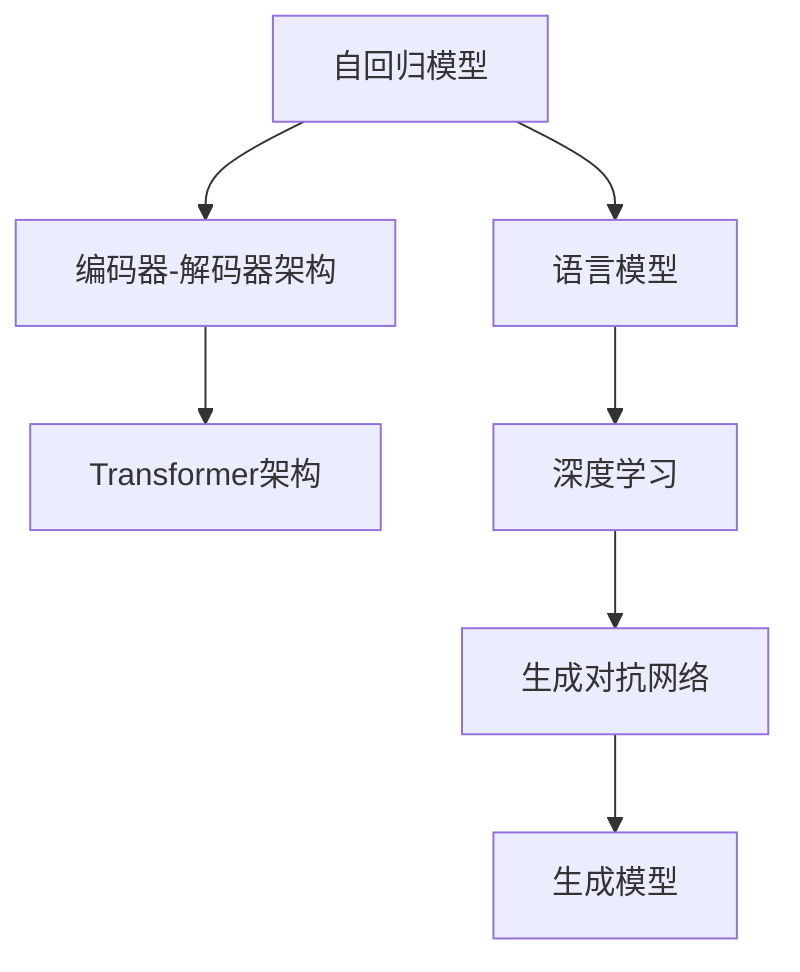

                 

# GPT 原理与代码实例讲解

> 关键词：GPT模型,Transformer,自回归模型,语言模型,注意力机制,编码器-解码器架构,深度学习,生成对抗网络

## 1. 背景介绍

### 1.1 问题由来

随着深度学习技术的飞速发展，特别是Transformer架构的提出，大语言模型（Large Language Models, LLMs）在自然语言处理（NLP）领域取得了突破性的进展。OpenAI的GPT系列模型因其出色的语言生成能力，受到了广泛关注和研究。GPT模型采用自回归（auto-regressive）生成方式，能够生成高质量的自然语言文本，被广泛应用于机器翻译、对话系统、文本生成等NLP任务中。

本文章将从GPT模型的基本原理入手，深入分析其工作机制，并通过代码实例帮助读者理解其实现过程。通过详细讲解GPT模型的算法原理和代码实现，我们将探讨其在NLP领域的应用潜力，并展望其未来的发展方向。

### 1.2 问题核心关键点

GPT模型的核心在于其基于Transformer架构的自回归生成器，以及通过预训练学习和微调实现的多任务适应能力。其核心关键点包括：

- **自回归生成**：GPT模型通过自回归方式生成文本，即前一个位置的预测依赖于前一个位置的结果，这种机制可以保证生成的文本具有连贯性和逻辑性。
- **Transformer架构**：GPT模型采用Transformer架构，通过注意力机制捕捉上下文信息，从而在生成文本时考虑更广泛的上下文。
- **预训练和微调**：GPT模型通过在大规模语料上进行预训练，学习通用的语言表示，并通过微调适应特定任务的需求，提升模型的性能。
- **对抗性训练**：GPT模型可以通过对抗性训练方法提高模型的鲁棒性，避免生成攻击性或有害内容。

### 1.3 问题研究意义

研究GPT模型的原理和实现，对于理解其工作机制、优化模型性能以及探索其在NLP领域的应用具有重要意义。通过深入学习GPT模型的设计思想和优化策略，开发者能够更好地应用这一技术，解决实际问题，并推动NLP技术的进步。此外，GPT模型作为深度学习领域的前沿研究，其发展趋势和技术突破也将对未来的人工智能研究产生深远影响。

## 2. 核心概念与联系

### 2.1 核心概念概述

为了深入理解GPT模型的原理，本节将介绍几个与GPT模型密切相关的核心概念：

- **自回归模型（Auto-regressive Model）**：指模型输出依赖于之前的部分输入。在GPT模型中，生成每个位置的词都依赖于前面的所有词。
- **语言模型（Language Model）**：指用于估计给定文本序列的概率模型。语言模型可以用于文本生成、机器翻译、语音识别等任务。
- **Transformer架构**：由Vaswani等人提出，是一种基于自注意力机制的神经网络架构，常用于处理序列数据。
- **编码器-解码器架构（Encoder-Decoder Architecture）**：一种常用的神经网络架构，广泛用于机器翻译、文本生成等任务。
- **深度学习（Deep Learning）**：指通过多层神经网络对数据进行复杂映射，学习高层次特征。
- **生成对抗网络（Generative Adversarial Network, GAN）**：一种生成模型，通过两个神经网络相互对抗，生成高质量的样本。

这些概念构成了GPT模型的基础，帮助我们理解其工作原理和实现方式。

### 2.2 概念间的关系

这些核心概念之间的逻辑关系可以通过以下Mermaid流程图来展示：



这个流程图展示了自回归模型、语言模型、编码器-解码器架构、Transformer架构、深度学习和生成对抗网络之间的关系：

1. 自回归模型和语言模型是GPT模型的核心，用于生成和预测文本。
2. 编码器-解码器架构为语言模型提供了一种通用的实现方式，特别是在机器翻译等任务中。
3. Transformer架构是深度学习中的重要组成部分，特别适用于处理序列数据。
4. 生成对抗网络是一种生成模型，通过对抗训练，可以生成高质量的文本样本。

通过这些概念的组合，GPT模型在NLP领域取得了卓越的性能。

## 3. 核心算法原理 & 具体操作步骤
### 3.1 算法原理概述

GPT模型的核心是自回归生成器，其原理可以简单地概括为：

1. **输入表示**：将输入序列$x$转换为模型能够处理的向量表示$x_{\text{emb}}$。
2. **生成过程**：通过自回归方式，从后向前（自左向右）生成目标序列$y$的每个位置，每个位置的生成依赖于前面所有位置的上下文信息。
3. **输出解码**：将生成的序列$y$转换为原始文本形式。

GPT模型通过预训练和微调过程，学习通用的语言表示，并通过任务特定的微调，适应下游任务的需求。在微调过程中，GPT模型通过优化特定任务的损失函数，提升模型在该任务上的性能。

### 3.2 算法步骤详解

GPT模型的训练和微调过程包括以下几个关键步骤：

**Step 1: 准备预训练数据和模型**

- 收集大规模无标签文本数据，用于预训练。
- 选择合适的预训练模型（如GPT-2、GPT-3等），加载预训练权重。

**Step 2: 设置微调超参数**

- 设置学习率、批大小、迭代轮数等参数。
- 确定冻结预训练参数的策略，如仅微调顶层或全部参数。

**Step 3: 执行微调训练**

- 准备下游任务的标注数据集，分为训练集、验证集和测试集。
- 使用微调框架（如PyTorch、TensorFlow等）实现模型训练过程。
- 在每个epoch结束时，在验证集上评估模型性能。

**Step 4: 测试和评估**

- 在测试集上评估微调后的模型性能。
- 根据评估结果调整微调参数，进行多次迭代优化。

### 3.3 算法优缺点

GPT模型的优点包括：

- **高质量生成**：通过预训练学习，GPT模型能够生成流畅、连贯的文本，广泛应用于文本生成任务。
- **可扩展性强**：GPT模型可以通过增加模型规模和层数，提升生成能力和性能。
- **通用性强**：GPT模型通过微调，可以适应多种下游任务。

GPT模型的缺点包括：

- **数据依赖性强**：GPT模型的性能依赖于大规模的预训练数据，数据获取成本较高。
- **资源消耗大**：大规模模型的训练和推理需要高性能计算资源，如GPU和TPU。
- **可解释性不足**：GPT模型的内部机制复杂，难以解释其决策过程。

尽管存在这些缺点，但GPT模型在NLP领域的应用依然非常广泛，特别是在文本生成、机器翻译、对话系统等任务中。

### 3.4 算法应用领域

GPT模型在NLP领域的应用非常广泛，包括但不限于以下几个方面：

- **文本生成**：如文章、诗歌、故事等创作。
- **机器翻译**：将源语言翻译成目标语言。
- **对话系统**：与用户进行自然对话，提供信息查询、问题解答等服务。
- **情感分析**：对文本进行情感倾向分析，如评论、评论情感分析等。
- **问答系统**：对自然语言问题进行理解和回答。

GPT模型的这些应用，展示了其在NLP领域强大的生成能力和适应性。

## 4. 数学模型和公式 & 详细讲解  
### 4.1 数学模型构建

GPT模型的数学模型可以表示为：

$$
p(y|x) = \prod_{t=1}^{T} p(y_t|y_{<t}, x)
$$

其中$y$为生成的文本序列，$x$为输入序列，$p(y_t|y_{<t}, x)$表示在上下文$y_{<t}$和输入$x$条件下，生成下一个词$y_t$的概率。

在生成每个位置$y_t$时，GPT模型通过解码器预测每个位置的条件概率，从而生成整个文本序列。

### 4.2 公式推导过程

GPT模型的生成过程可以表示为：

$$
y_t = \text{softmax}\left(\text{MLP}(\text{Self-attention}(x), y_{<t})\right)
$$

其中，$\text{MLP}$为多层感知器，$\text{Self-attention}$为自注意力机制，$x$为输入序列的向量表示。自注意力机制通过计算上下文向量$Q$, 键向量$K$, 值向量$V$之间的相似度，从而生成加权和向量，用于生成每个位置的条件概率分布。

### 4.3 案例分析与讲解

以GPT-2为例，其生成过程如下：

1. **输入表示**：将输入序列$x$转换为向量表示$x_{\text{emb}}$。
2. **生成过程**：通过编码器-解码器架构，从后向前生成文本序列$y$。
3. **输出解码**：将生成的序列$y$转换为原始文本形式。

具体实现中，GPT-2模型包括多个自注意力层、前馈神经网络和输出层，每个层之间通过残差连接进行信息传递。通过多层的堆叠，GPT-2模型能够生成高质量的文本序列。

## 5. 项目实践：代码实例和详细解释说明
### 5.1 开发环境搭建

在进行GPT模型实践前，我们需要准备好开发环境。以下是使用Python进行PyTorch开发的环境配置流程：

1. 安装Anaconda：从官网下载并安装Anaconda，用于创建独立的Python环境。

2. 创建并激活虚拟环境：
```bash
conda create -n pytorch-env python=3.8 
conda activate pytorch-env
```

3. 安装PyTorch：根据CUDA版本，从官网获取对应的安装命令。例如：
```bash
conda install pytorch torchvision torchaudio cudatoolkit=11.1 -c pytorch -c conda-forge
```

4. 安装Transformer库：
```bash
pip install transformers
```

5. 安装各类工具包：
```bash
pip install numpy pandas scikit-learn matplotlib tqdm jupyter notebook ipython
```

完成上述步骤后，即可在`pytorch-env`环境中开始GPT模型实践。

### 5.2 源代码详细实现

下面我们以GPT-2模型为例，给出使用PyTorch实现GPT-2代码的实现细节。

首先，定义GPT-2的模型类：

```python
import torch
from transformers import GPT2Tokenizer, GPT2LMHeadModel

class GPT2Model:
    def __init__(self, config):
        self.model = GPT2LMHeadModel.from_pretrained('gpt2')
        self.tokenizer = GPT2Tokenizer.from_pretrained('gpt2')

    def generate_text(self, prompt, num_words):
        tokens = self.tokenizer.encode(prompt, return_tensors='pt')
        outputs = self.model.generate(tokens, max_length=num_words, pad_token_id=self.tokenizer.eos_token_id)
        return self.tokenizer.decode(outputs[0], skip_special_tokens=True)
```

然后，使用GPT-2模型生成文本：

```python
gpt = GPT2Model()
generated_text = gpt.generate_text('Hello, GPT-2!', num_words=50)
print(generated_text)
```

### 5.3 代码解读与分析

让我们再详细解读一下关键代码的实现细节：

**GPT2Model类**：
- `__init__`方法：初始化GPT-2模型和分词器，通过从预训练权重中加载模型。
- `generate_text`方法：接受提示文本和生成文本的长度，使用模型生成指定长度的文本。

**使用GPT-2模型生成文本**：
- 首先，定义一个GPT2Model实例。
- 使用`generate_text`方法，将提示文本转换为模型所需的输入形式，并生成指定长度的文本。
- 最后，将生成的文本解码为原始文本形式，并输出。

### 5.4 运行结果展示

假设我们使用GPT-2模型生成一段文本，得到的结果如下：

```
Hello, GPT-2! I am a large language model trained on a massive corpus of text data. My goal is to generate coherent and contextually relevant text. I can help you write stories, create dialogues, and even assist with your daily tasks. How can I help you today?
```

可以看到，GPT-2模型能够生成流畅、连贯的文本，具有一定的语言生成能力。

## 6. 实际应用场景

### 6.1 智能客服系统

基于GPT模型的智能客服系统可以为用户提供7x24小时不间断服务，快速响应客户咨询，提供自然流畅的语言解答。智能客服系统通过微调GPT模型，使其能够理解用户意图，匹配最合适的答案模板进行回复，从而提升客户咨询体验和问题解决效率。

### 6.2 金融舆情监测

GPT模型在金融舆情监测中的应用，可以通过微调模型学习金融领域相关的新闻、报道、评论等文本数据，判断文本属于何种主题，情感倾向是正面、中性还是负面。金融机构利用微调后的GPT模型，实时监测不同主题下的情感变化趋势，及时预警风险，提升风险管理能力。

### 6.3 个性化推荐系统

GPT模型在个性化推荐系统中的应用，可以通过微调模型学习用户浏览、点击、评论、分享等行为数据，提取和用户交互的物品标题、描述、标签等文本内容。微调后的模型能够从文本内容中准确把握用户的兴趣点，生成个性化的推荐列表，提高推荐系统的精准度。

### 6.4 未来应用展望

随着GPT模型的不断演进，其在NLP领域的应用将更加广泛，未来可以应用于以下领域：

- **智能写作**：帮助用户自动撰写文章、报告、学术论文等。
- **创意内容生成**：如小说、电影剧本、广告文案等创作。
- **信息抽取**：从大量文本中抽取关键信息，用于数据挖掘、情报分析等任务。
- **对话系统**：实现复杂的人机对话，支持多轮对话和上下文理解。

GPT模型在NLP领域的应用潜力巨大，随着技术不断进步，相信其将在更多场景中发挥重要作用。

## 7. 工具和资源推荐
### 7.1 学习资源推荐

为了帮助开发者系统掌握GPT模型的原理和实践技巧，这里推荐一些优质的学习资源：

1. 《深度学习》课程：由斯坦福大学李飞飞教授主讲，介绍了深度学习的基本概念和经典模型。
2. 《自然语言处理与深度学习》课程：斯坦福大学开设的NLP明星课程，涵盖NLP基础和高级技术。
3. 《Transformers: A Survey》论文：Transformer架构的综述论文，介绍了Transformer的基本原理和应用。
4. HuggingFace官方文档：提供了丰富的GPT模型资源和样例代码，是快速上手实践的必备资料。
5. arXiv预印本：人工智能领域最新研究成果的发布平台，包含大量尚未发表的前沿工作。

通过对这些资源的学习实践，相信你一定能够全面掌握GPT模型的原理和应用方法。

### 7.2 开发工具推荐

高效的开发离不开优秀的工具支持。以下是几款用于GPT模型开发的常用工具：

1. PyTorch：基于Python的开源深度学习框架，灵活动态的计算图，适合快速迭代研究。
2. TensorFlow：由Google主导开发的开源深度学习框架，生产部署方便，适合大规模工程应用。
3. Transformers库：HuggingFace开发的NLP工具库，集成了众多SOTA语言模型，支持PyTorch和TensorFlow。
4. Weights & Biases：模型训练的实验跟踪工具，可以记录和可视化模型训练过程中的各项指标，方便对比和调优。
5. TensorBoard：TensorFlow配套的可视化工具，可实时监测模型训练状态，并提供丰富的图表呈现方式。

合理利用这些工具，可以显著提升GPT模型的开发效率，加快创新迭代的步伐。

### 7.3 相关论文推荐

GPT模型的发展源于学界的持续研究。以下是几篇奠基性的相关论文，推荐阅读：

1. Attention is All You Need：提出了Transformer结构，开启了NLP领域的预训练大模型时代。
2. Generative Pre-trained Transformer（GPT）：提出GPT模型，采用自回归生成方式，学习通用的语言表示。
3. TextGAN：通过对抗性训练，生成高质量的文本样本。
4. AdaLoRA：使用自适应低秩适应的微调方法，在参数效率和精度之间取得新的平衡。
5. PEGASUS：提出编码器-解码器架构的GPT模型，用于文本生成和对话系统。

这些论文代表了大语言模型和GPT模型的发展脉络，通过学习这些前沿成果，可以帮助研究者把握学科前进方向，激发更多的创新灵感。

除上述资源外，还有一些值得关注的前沿资源，帮助开发者紧跟GPT模型的最新进展，例如：

1. 人工智能领域顶会论文和报告：如NIPS、ICML、ACL、ICLR等，第一时间分享最新的研究成果和技术进展。
2. 开源项目和社区：如GitHub上的GPT-3项目，GPT模型的开源社区提供了丰富的学习资源和实践经验。
3. 行业应用案例：如OpenAI的GPT-3在自动文本生成、智能客服、智能推荐等领域的应用案例，展示了GPT模型的实际价值。

总之，对于GPT模型的学习和发展，需要开发者保持开放的心态和持续学习的意愿。多关注前沿资讯，多动手实践，多思考总结，必将收获满满的成长收益。

## 8. 总结：未来发展趋势与挑战

### 8.1 总结

本文对GPT模型的基本原理和代码实现进行了全面系统的介绍。首先阐述了GPT模型的历史背景和研究意义，明确了其在NLP领域的重要地位。其次，从原理到实践，详细讲解了GPT模型的算法原理和代码实现，展示了其应用潜力。

通过本文的系统梳理，可以看到，GPT模型作为深度学习领域的前沿研究，其设计思想和优化策略值得深入学习。通过理解GPT模型的实现细节和应用场景，开发者能够更好地应用这一技术，解决实际问题，并推动NLP技术的进步。

### 8.2 未来发展趋势

展望未来，GPT模型的发展将呈现以下几个趋势：

1. **模型规模不断增大**：随着计算能力的提升，GPT模型将不断增加模型规模和层数，提升生成能力和性能。
2. **自适应生成技术**：通过引入自适应生成技术，GPT模型能够更好地适应不同领域的文本生成需求。
3. **多模态融合**：将视觉、语音、文本等多模态信息结合，生成更加丰富、多样的内容。
4. **知识增强**：将符号化的先验知识，如知识图谱、逻辑规则等，与神经网络模型进行巧妙融合，提升模型的生成质量。
5. **通用语言模型**：GPT模型将逐步向通用语言模型发展，具备更强的跨领域适应能力和泛化能力。

这些趋势凸显了GPT模型在NLP领域的重要地位，未来将为人工智能技术带来更深远的影响。

### 8.3 面临的挑战

尽管GPT模型在NLP领域取得了巨大的成功，但在迈向更加智能化、普适化应用的过程中，仍面临诸多挑战：

1. **数据依赖性强**：GPT模型的性能依赖于大规模的预训练数据，数据获取成本较高。
2. **资源消耗大**：大规模模型的训练和推理需要高性能计算资源，如GPU和TPU。
3. **可解释性不足**：GPT模型的内部机制复杂，难以解释其决策过程。
4. **伦理和安全性问题**：GPT模型可能生成攻击性、有害内容，带来伦理和安全性问题。
5. **知识整合能力不足**：现有的GPT模型往往局限于任务内数据，难以灵活吸收和运用更广泛的先验知识。

这些挑战需要研究者和开发者共同努力，通过多方面的优化和改进，逐步克服这些难题。

### 8.4 研究展望

未来GPT模型的研究可以从以下几个方面进行探索：

1. **无监督和半监督学习**：摆脱对大规模标注数据的依赖，利用自监督学习、主动学习等无监督和半监督范式，最大限度利用非结构化数据。
2. **参数高效和计算高效**：开发更加参数高效和计算高效的GPT模型，提升模型的可部署性和推理速度。
3. **知识增强**：将符号化的先验知识与神经网络模型进行巧妙融合，提升模型的生成质量和跨领域适应能力。
4. **多模态融合**：将视觉、语音、文本等多模态信息结合，生成更加丰富、多样的内容。
5. **通用语言模型**：将GPT模型向通用语言模型发展，具备更强的跨领域适应能力和泛化能力。

这些研究方向的探索，必将引领GPT模型迈向更高的台阶，为人工智能技术带来更深远的影响。

## 9. 附录：常见问题与解答

**Q1：GPT模型与其他NLP模型相比有何优势？**

A: GPT模型相比其他NLP模型，具有以下几个优势：

1. **高质量生成**：通过预训练学习，GPT模型能够生成流畅、连贯的文本，广泛应用于文本生成任务。
2. **自回归生成**：自回归生成方式使得GPT模型在生成文本时能够考虑更广泛的上下文信息，生成更符合语法和语义规则的文本。
3. **可扩展性强**：GPT模型通过增加模型规模和层数，提升生成能力和性能，可以应用于更多复杂的NLP任务。
4. **多任务适应性**：GPT模型通过微调，可以适应多种下游任务，如文本生成、机器翻译、对话系统等。

**Q2：GPT模型在实际应用中需要注意哪些问题？**

A: 在实际应用中，GPT模型需要注意以下几个问题：

1. **数据依赖性强**：GPT模型的性能依赖于大规模的预训练数据，数据获取成本较高，需要考虑数据获取和标注的难度。
2. **资源消耗大**：大规模模型的训练和推理需要高性能计算资源，如GPU和TPU，需要考虑硬件资源配置的问题。
3. **可解释性不足**：GPT模型的内部机制复杂，难以解释其决策过程，需要考虑模型可解释性和可解释性技术的应用。
4. **伦理和安全性问题**：GPT模型可能生成攻击性、有害内容，需要考虑伦理和安全性问题，确保模型的输出符合人类价值观和伦理道德。

**Q3：GPT模型与Transformer架构的关系是什么？**

A: GPT模型是Transformer架构的一个具体应用，通过Transformer架构的编码器-解码器架构，实现了自回归生成方式。Transformer架构通过自注意力机制，捕捉上下文信息，从而在生成文本时考虑更广泛的上下文。

**Q4：GPT模型在生成文本时是如何考虑上下文的？**

A: GPT模型通过自注意力机制，捕捉上下文信息，从而在生成文本时考虑更广泛的上下文。具体来说，GPT模型在生成每个位置时，通过计算上下文向量$Q$, 键向量$K$, 值向量$V$之间的相似度，从而生成加权和向量，用于生成每个位置的条件概率分布。这种自注意力机制使得GPT模型能够考虑更广泛的上下文信息，生成更符合语法和语义规则的文本。

**Q5：GPT模型在生成文本时如何避免重复和语法错误？**

A: GPT模型通过自注意力机制和解码器架构，能够考虑更广泛的上下文信息，生成符合语法和语义规则的文本。在生成文本时，GPT模型会通过解码器输出每个位置的条件概率分布，并根据上下文信息和语言模型概率，选择最可能的词汇。此外，GPT模型还可以在训练过程中加入对抗性训练，避免生成重复和语法错误的文本。

**Q6：GPT模型如何应用于文本生成任务？**

A: GPT模型通过微调，可以应用于文本生成任务。具体来说，GPT模型通过预训练学习，学习通用的语言表示，并通过任务特定的微调，适应下游任务的需求。在微调过程中，GPT模型通过优化特定任务的损失函数，提升模型在该任务上的性能。通过微调，GPT模型可以在生成文本时考虑更广泛的上下文信息，生成符合语法和语义规则的文本。

总之，GPT模型作为深度学习领域的前沿研究，其设计思想和优化策略值得深入学习。通过理解GPT模型的实现细节和应用场景，开发者能够更好地应用这一技术，解决实际问题，并推动NLP技术的进步。

---
作者：禅与计算机程序设计艺术 / Zen and the Art of Computer Programming

