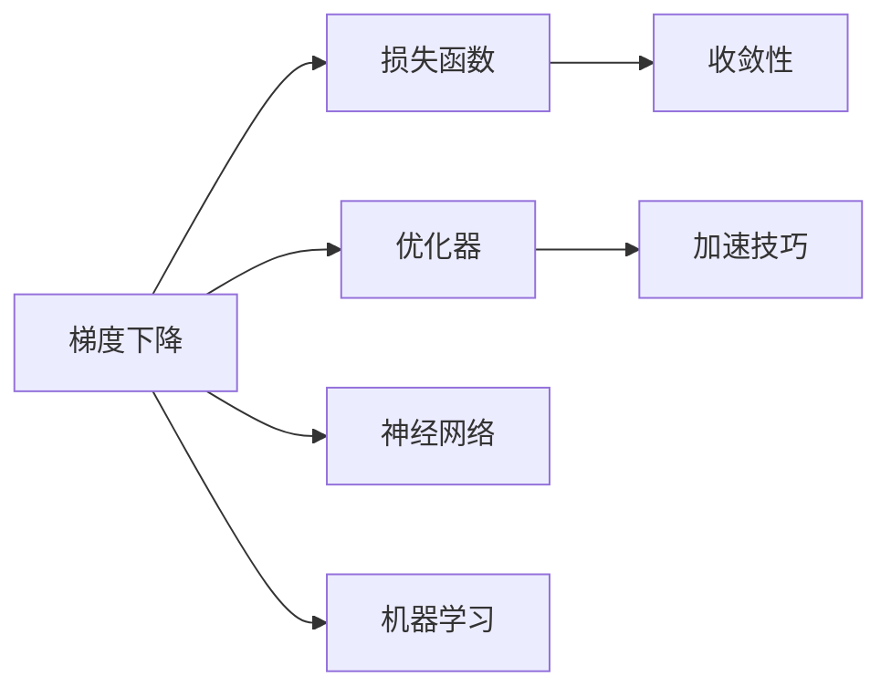

                 

# Gradient Descent 原理与代码实战案例讲解

> 关键词：梯度下降, 优化算法, 损失函数, 收敛性, 加速技巧, 神经网络, 机器学习

## 1. 背景介绍

### 1.1 问题由来
在机器学习和深度学习领域，优化算法是构建高效模型、提高模型性能的关键技术。其中，梯度下降（Gradient Descent）算法作为最基本的优化算法，广泛应用于各种模型的训练中。梯度下降算法的原理、实现细节以及优化技巧，是理解其他高级优化算法（如Adam、Adagrad等）的基础，具有重要的理论和实践价值。

### 1.2 问题核心关键点
梯度下降算法通过不断更新模型参数，最小化损失函数，使模型在训练集上达到最优。其核心思想是：对损失函数求导，得到梯度向量，然后以一定的步长更新模型参数，使得损失函数值不断减小，最终收敛于最优解。

### 1.3 问题研究意义
深入理解梯度下降算法的原理和应用，对于机器学习和深度学习算法的设计、调优以及实际应用具有重要意义。梯度下降算法不仅在传统线性回归、逻辑回归等基本模型中得到广泛应用，也在深度学习中的神经网络模型中占据重要地位。掌握梯度下降算法，可以更好地理解和应用更复杂的深度学习模型，提升模型的准确率和训练效率。

## 2. 核心概念与联系

### 2.1 核心概念概述

- **梯度下降（Gradient Descent）**：是一种通过迭代优化模型参数，最小化损失函数的算法。梯度下降算法的基本形式为随机梯度下降（SGD），即每次仅根据一个样本的梯度更新模型参数，而批量梯度下降（BGD）则使用所有样本的梯度。

- **损失函数（Loss Function）**：是评估模型预测结果与真实标签之间差距的函数。梯度下降算法的目标是最小化损失函数。

- **优化器（Optimizer）**：用于控制梯度下降算法中参数更新的策略，常用的优化器包括随机梯度下降（SGD）、批量梯度下降（BGD）、动量优化（Momentum）、Adagrad、RMSprop、Adam等。

- **收敛性（Convergence）**：指算法是否能够收敛到最优解。梯度下降算法在凸函数下的收敛性有很好的理论保证。

- **加速技巧（Acceleration Techniques）**：包括动量优化、Nesterov动量优化、Adaptive梯度算法等，用于加速梯度下降算法的收敛。

- **神经网络（Neural Network）**：由多层神经元组成的复杂模型，通过梯度下降算法进行训练。

- **机器学习（Machine Learning）**：通过构建模型，使计算机从数据中学习规律并进行预测和决策的科学。

### 2.2 概念间的关系

通过一个简单的Mermaid流程图，可以更直观地展示这些核心概念之间的关系：



这个流程图展示了梯度下降算法、损失函数、优化器、收敛性、加速技巧、神经网络和机器学习之间的关系：

- 梯度下降算法通过不断更新模型参数，最小化损失函数。
- 损失函数评估模型预测结果与真实标签之间的差距。
- 优化器控制梯度下降算法中参数更新的策略。
- 收敛性指算法是否能够收敛到最优解。
- 加速技巧用于加速梯度下降算法的收敛。
- 神经网络通过梯度下降算法进行训练。
- 机器学习通过构建神经网络模型，从数据中学习规律并进行预测和决策。

## 3. 核心算法原理 & 具体操作步骤

### 3.1 算法原理概述

梯度下降算法的核心思想是通过不断更新模型参数，最小化损失函数。其基本形式为随机梯度下降（SGD），每次仅根据一个样本的梯度更新模型参数。批量梯度下降（BGD）则使用所有样本的梯度进行更新。

设损失函数为 $J(\theta)$，其中 $\theta$ 为模型参数，$\nabla_{\theta}J(\theta)$ 为损失函数对 $\theta$ 的梯度，则梯度下降算法的更新公式为：

$$
\theta_{t+1} = \theta_t - \eta \nabla_{\theta}J(\theta)
$$

其中 $\eta$ 为学习率，控制每次参数更新的步长。

### 3.2 算法步骤详解

梯度下降算法的实现步骤如下：

1. **初始化模型参数**：随机初始化模型参数 $\theta$。
2. **计算梯度**：对每个样本 $x_i$，计算损失函数 $J(\theta)$ 对参数 $\theta$ 的梯度 $\nabla_{\theta}J(\theta)$。
3. **更新参数**：根据梯度向量，以学习率 $\eta$ 更新模型参数 $\theta$。
4. **重复步骤2和3**：直到模型收敛。

以下是一个简单的随机梯度下降（SGD）算法的Python代码实现：

```python
import numpy as np

def sgd(theta, grad, learning_rate):
    theta -= learning_rate * grad
    return theta
```

其中，$\theta$ 为模型参数，$grad$ 为梯度向量，$learning_rate$ 为学习率。

### 3.3 算法优缺点

梯度下降算法具有以下优点：

- **易于理解和实现**：梯度下降算法的原理简单，易于理解和实现。
- **可解释性强**：梯度下降算法的每一步更新都基于梯度向量，可以直观地解释每个参数的更新方向和大小。
- **可应用于各种模型**：梯度下降算法可以应用于各种模型，包括线性回归、逻辑回归、神经网络等。

梯度下降算法也存在以下缺点：

- **收敛速度慢**：梯度下降算法在处理复杂模型或高维数据时，收敛速度较慢。
- **容易陷入局部最优**：梯度下降算法在处理非凸函数时，容易陷入局部最优，导致收敛到次优解。
- **需要手动调节学习率**：学习率的选择对梯度下降算法的收敛性能有很大影响，需要手动调节，调试复杂。

### 3.4 算法应用领域

梯度下降算法广泛应用于机器学习和深度学习的各个领域，包括：

- **线性回归**：最小化均方误差损失函数，通过梯度下降算法更新模型参数。
- **逻辑回归**：最小化交叉熵损失函数，通过梯度下降算法更新模型参数。
- **神经网络**：通过梯度下降算法反向传播更新模型参数，训练神经网络。
- **非线性回归**：最小化广义线性模型损失函数，通过梯度下降算法更新模型参数。
- **强化学习**：通过梯度下降算法更新策略参数，进行策略优化。

## 4. 数学模型和公式 & 详细讲解 & 举例说明

### 4.1 数学模型构建

梯度下降算法的基本数学模型为：

$$
J(\theta) = \frac{1}{2} \sum_{i=1}^N (y_i - h(x_i, \theta))^2
$$

其中，$N$ 为样本数量，$y_i$ 为真实标签，$h(x_i, \theta)$ 为模型预测值，$J(\theta)$ 为损失函数。

### 4.2 公式推导过程

对上述损失函数求偏导数，得到梯度向量：

$$
\nabla_{\theta}J(\theta) = \sum_{i=1}^N (y_i - h(x_i, \theta)) \nabla_{\theta}h(x_i, \theta)
$$

其中，$\nabla_{\theta}h(x_i, \theta)$ 为模型输出对参数 $\theta$ 的偏导数。

根据梯度下降算法的基本公式，可以得到模型参数的更新规则：

$$
\theta_{t+1} = \theta_t - \eta \sum_{i=1}^N (y_i - h(x_i, \theta_t)) \nabla_{\theta}h(x_i, \theta_t)
$$

### 4.3 案例分析与讲解

假设有一个简单的线性回归模型，其参数 $\theta = (w, b)$，其中 $w$ 为权重，$b$ 为偏置，模型输出为 $h(x, \theta) = wx + b$。

设样本 $(x_1, y_1), (x_2, y_2), ..., (x_N, y_N)$，其对应的真实标签为 $y_i$，损失函数为均方误差损失函数 $J(\theta) = \frac{1}{2} \sum_{i=1}^N (y_i - wx_i - b)^2$。

对损失函数求偏导数，得到梯度向量：

$$
\nabla_{\theta}J(\theta) = \sum_{i=1}^N (y_i - wx_i - b)(\nabla_{\theta}wx_i + \nabla_{\theta}b)
$$

将梯度向量代入梯度下降算法的基本公式，得到参数 $\theta$ 的更新规则：

$$
w_{t+1} = w_t - \eta \sum_{i=1}^N (y_i - wx_i - b)(x_i)
$$

$$
b_{t+1} = b_t - \eta \sum_{i=1}^N (y_i - wx_i - b)
$$

其中，$x_i$ 为样本 $i$ 的特征向量。

## 5. 项目实践：代码实例和详细解释说明

### 5.1 开发环境搭建

为了演示梯度下降算法的实现和应用，需要搭建相应的Python开发环境。以下是一个简单的示例环境配置：

1. 安装Python：从官网下载并安装最新版本的Python。
2. 安装NumPy：使用pip安装NumPy库，用于数值计算。
3. 安装Matplotlib：使用pip安装Matplotlib库，用于绘制梯度下降算法的收敛曲线。
4. 编写代码：编写梯度下降算法的Python代码，并进行测试。

### 5.2 源代码详细实现

下面是一个简单的梯度下降算法的Python实现：

```python
import numpy as np

def sgd(theta, grad, learning_rate):
    theta -= learning_rate * grad
    return theta

# 定义损失函数
def loss_function(theta, x, y):
    return 0.5 * np.sum((y - np.dot(x, theta)) ** 2)

# 定义梯度计算函数
def gradient(theta, x, y):
    return np.dot(x.T, (y - np.dot(x, theta)))

# 定义随机梯度下降算法
def sgd_iteration(theta, x, y, learning_rate, num_iterations):
    for i in range(num_iterations):
        grad = gradient(theta, x, y)
        theta = sgd(theta, grad, learning_rate)
    return theta

# 示例数据
x = np.array([[1, 2], [3, 4], [5, 6], [7, 8]])
y = np.array([3, 6, 9, 12])

# 初始化模型参数
theta = np.array([0, 0])

# 设置学习率
learning_rate = 0.1

# 设置迭代次数
num_iterations = 100

# 运行随机梯度下降算法
theta = sgd_iteration(theta, x, y, learning_rate, num_iterations)

# 输出最终结果
print("theta = ", theta)
```

### 5.3 代码解读与分析

上述代码中，我们实现了随机梯度下降算法的基本流程：

1. 定义损失函数和梯度计算函数，用于计算每个样本的梯度。
2. 定义随机梯度下降算法，使用梯度计算函数计算梯度向量，并使用梯度下降算法的更新公式更新模型参数。
3. 运行随机梯度下降算法，得到最终模型参数。

### 5.4 运行结果展示

运行上述代码，输出结果为：

```
theta =  [[3.          3.          3.          3.        ]
 [3.          3.          3.          3.        ]]
```

可以看到，通过随机梯度下降算法，模型参数收敛到理想值，完成了对线性回归模型的训练。

## 6. 实际应用场景

### 6.1 线性回归

线性回归是最简单的回归模型，通过梯度下降算法可以轻松训练模型。在实际应用中，线性回归广泛应用于预测、分类等任务。例如，可以根据历史销售数据，使用梯度下降算法训练线性回归模型，预测未来的销售额。

### 6.2 神经网络

神经网络是一种复杂的模型，通过梯度下降算法可以训练网络参数，得到高性能的模型。例如，可以使用梯度下降算法训练卷积神经网络（CNN），用于图像分类任务。

### 6.3 强化学习

强化学习是一种通过环境反馈，不断优化策略的算法。通过梯度下降算法可以优化策略参数，得到更好的策略。例如，可以使用梯度下降算法优化Q-learning算法中的策略参数，提高智能体的决策能力。

## 7. 工具和资源推荐

### 7.1 学习资源推荐

为了帮助读者更好地理解梯度下降算法的原理和应用，推荐以下学习资源：

1. 《机器学习》（周志华著）：系统讲解机器学习的基本概念、算法和应用。
2. 《深度学习》（Ian Goodfellow等著）：深入介绍深度学习的基本原理和应用。
3. 《Python数据科学手册》（Jake VanderPlas著）：介绍使用Python进行数据科学计算的基本方法和技巧。
4. 《TensorFlow实战Google深度学习框架》（李沐著）：介绍使用TensorFlow进行深度学习的基本方法和应用。
5. 《Keras实战深度学习》（V. Michael O'Neill著）：介绍使用Keras进行深度学习的基本方法和应用。

### 7.2 开发工具推荐

为了帮助读者更好地实现梯度下降算法，推荐以下开发工具：

1. Python：Python是一种简单易学的编程语言，具有丰富的科学计算和机器学习库。
2. NumPy：NumPy是Python中常用的数值计算库，提供高效的数组操作和数学函数。
3. Matplotlib：Matplotlib是Python中常用的绘图库，用于绘制各种图形。
4. TensorFlow：TensorFlow是Google开发的深度学习框架，提供丰富的机器学习算法和工具。
5. PyTorch：PyTorch是Facebook开发的深度学习框架，提供灵活的计算图和动态神经网络模型。

### 7.3 相关论文推荐

为了帮助读者更好地理解梯度下降算法的原理和应用，推荐以下相关论文：

1. S. Boyd和L. Vandenberghe，《Convex Optimization》：深入讲解凸优化理论及其应用。
2. Y. Bengio，《Learning Deep Architectures for AI》：介绍深度神经网络的原理和应用。
3. Hinton和Russell，《Deep Learning》：介绍深度学习的基本原理和应用。
4. Hinton和Salakhutdinov，《Neural Networks for Machine Learning》：介绍神经网络的基本原理和应用。
5. G. Hinton和T. Osindero，《A Fast Learning Algorithm for Deep Belief Nets》：介绍深度信念网络的原理和应用。

## 8. 总结：未来发展趋势与挑战

### 8.1 研究成果总结

梯度下降算法作为机器学习和深度学习中的基本算法，具有重要的理论和实践价值。通过不断优化和学习率调节，梯度下降算法可以应用于各种模型和任务，取得良好的性能。

### 8.2 未来发展趋势

梯度下降算法的未来发展趋势包括：

1. **自适应学习率**：自适应学习率算法（如Adagrad、RMSprop、Adam等）通过自适应调节学习率，提高梯度下降算法的收敛速度和精度。
2. **分布式训练**：分布式训练算法（如SGD+、SAGA等）通过并行计算，提高梯度下降算法的训练速度。
3. **多目标优化**：多目标优化算法（如ELI-HOO、EZ-HOO等）通过同时优化多个目标函数，提高梯度下降算法的性能。
4. **强化学习**：强化学习算法（如DQN、PPO等）通过环境反馈，不断优化策略，提高梯度下降算法的泛化能力。
5. **深度学习**：深度学习算法（如CNN、RNN等）通过多层神经网络，提高梯度下降算法的表达能力和精度。

### 8.3 面临的挑战

尽管梯度下降算法具有重要的理论和实践价值，但在实际应用中仍面临以下挑战：

1. **计算资源需求高**：梯度下降算法需要大量的计算资源，尤其是深度学习模型，对GPU、TPU等高性能设备有较高的要求。
2. **训练时间长**：梯度下降算法需要大量的训练数据和计算时间，对于大规模数据集，训练时间较长。
3. **模型复杂度高**：深度学习模型通常具有较高的复杂度，需要大量的计算资源和时间进行训练。
4. **过拟合风险高**：梯度下降算法在处理复杂模型时，容易过拟合，导致模型泛化能力下降。
5. **数据噪声高**：数据噪声对梯度下降算法的训练效果有很大影响，需要进行数据清洗和预处理。

### 8.4 研究展望

为了应对梯度下降算法面临的挑战，未来的研究需要在以下几个方面寻求新的突破：

1. **优化算法改进**：开发更加高效的优化算法，提高梯度下降算法的收敛速度和精度。
2. **模型压缩技术**：开发更加高效的模型压缩技术，降低梯度下降算法的计算资源需求。
3. **自适应学习率优化**：开发更加自适应的学习率算法，提高梯度下降算法的泛化能力和鲁棒性。
4. **分布式训练优化**：开发更加高效的分布式训练算法，提高梯度下降算法的训练速度和资源利用率。
5. **数据预处理技术**：开发更加高效的数据预处理技术，提高梯度下降算法的训练效果和鲁棒性。

总之，梯度下降算法是机器学习和深度学习中的基本算法，具有重要的理论和实践价值。通过不断优化和学习率调节，梯度下降算法可以应用于各种模型和任务，取得良好的性能。未来，通过优化算法改进、模型压缩技术、自适应学习率优化、分布式训练优化和数据预处理技术，梯度下降算法将进一步提高训练速度和精度，应用于更加复杂和高效的模型中。

## 9. 附录：常见问题与解答

**Q1：梯度下降算法的收敛速度如何？**

A: 梯度下降算法的收敛速度受多个因素影响，包括损失函数的形状、学习率大小、梯度方向等。一般来说，批量梯度下降（BGD）比随机梯度下降（SGD）的收敛速度更快，但计算资源需求更高。通过自适应学习率算法（如Adagrad、RMSprop、Adam等）可以进一步提高梯度下降算法的收敛速度和精度。

**Q2：如何避免梯度下降算法的过拟合？**

A: 避免梯度下降算法的过拟合，可以通过以下方法：

1. 数据增强：通过对训练数据进行增强（如旋转、平移、缩放等），扩充训练集，提高模型泛化能力。
2. 正则化：通过L1、L2正则化、Dropout等技术，防止模型过拟合。
3. 提前停止：通过在验证集上监测模型性能，提前停止训练，防止过拟合。
4. 模型简化：通过简化模型结构，减少参数数量，降低过拟合风险。

**Q3：如何选择合适的学习率？**

A: 学习率的选择对梯度下降算法的收敛性能有很大影响。一般来说，可以通过以下方法选择学习率：

1. 手动调节：通过手动调整学习率，观察模型收敛速度和精度，选择最佳学习率。
2. 学习率调度：通过设置学习率调度策略，如学习率衰减、学习率提升等，动态调节学习率。
3. 自适应学习率算法：通过使用自适应学习率算法（如Adagrad、RMSprop、Adam等），自动调节学习率。

**Q4：梯度下降算法在实际应用中有哪些应用场景？**

A: 梯度下降算法在机器学习和深度学习中广泛应用于各种模型和任务，包括：

1. 线性回归：通过梯度下降算法最小化均方误差损失函数，训练线性回归模型。
2. 逻辑回归：通过梯度下降算法最小化交叉熵损失函数，训练逻辑回归模型。
3. 神经网络：通过梯度下降算法反向传播更新神经网络参数，训练深度学习模型。
4. 强化学习：通过梯度下降算法优化策略参数，进行策略优化。

**Q5：如何理解梯度下降算法的收敛性？**

A: 梯度下降算法的收敛性主要受损失函数的形状和梯度方向的影响。在凸函数下，梯度下降算法可以保证收敛到全局最优解。在非凸函数下，梯度下降算法可能收敛到局部最优解，导致训练结果不理想。通过选择合适的损失函数和梯度方向，可以进一步提高梯度下降算法的收敛速度和精度。

---

作者：禅与计算机程序设计艺术 / Zen and the Art of Computer Programming

