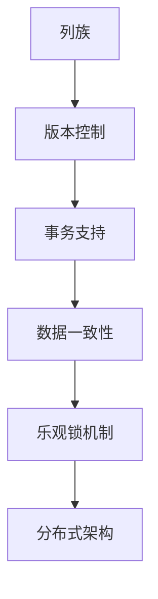

                 

# HBase原理与代码实例讲解

> 关键词：HBase, NoSQL, 列存储, 分布式, 数据一致性, 读写性能, 事务支持

## 1. 背景介绍

### 1.1 问题由来

在传统的关系型数据库中，数据以行和列的二维表格形式存储。然而，这种设计对于大数据、高并发、高扩展性的应用场景显得过于单一和局限。因此，NoSQL数据库应运而生，其中HBase作为一款高性能、可扩展的列存储数据库，广泛应用于大数据分析、实时数据处理等领域。

HBase由Apache基金会开发，基于Google的Bigtable，其核心设计理念为：“简单但可扩展的列存储数据库”。HBase能够支持海量数据的分布式存储，同时也提供了强大的事务支持和高度的读写性能。

### 1.2 问题核心关键点

HBase的关键点包括：

- **列存储**：HBase采用列存储方式，数据按列族存储，每个列族下的每个列数据是分开存储的。
- **分布式架构**：HBase采用主从架构，集群中的每个节点都是独立的，没有单点故障，节点之间通过ZooKeeper进行协调。
- **高并发读写**：HBase采用乐观锁机制，减少了数据冲突，支持海量数据的并发读写。
- **事务支持**：HBase支持ACID事务，保证数据的一致性和完整性。
- **版本控制**：每个单元格可以存储多个版本，不同版本的数据可以保留。
- **数据一致性**：HBase提供了多种数据一致性模型，如强一致性、最终一致性等，满足不同业务需求。

这些关键点使得HBase在大数据存储和处理中具有重要地位，成为行业内大数据分析、实时数据处理的首选数据库。

### 1.3 问题研究意义

理解HBase的核心概念和原理，对于数据库开发、大数据分析、实时数据处理等领域的工程师来说，具有重要的意义：

- **提升数据处理能力**：掌握HBase的分布式架构和读写性能，可以更高效地处理海量数据。
- **增强数据一致性**：理解HBase的事务支持和版本控制，可以保证数据的正确性和一致性。
- **灵活配置和使用**：熟悉HBase的各种配置选项，可以更好地适应不同的业务场景。
- **提升系统可靠性**：掌握HBase的故障恢复机制和数据冗余策略，可以构建高可用性的系统。
- **深入了解NoSQL数据库**：理解HBase的设计理念和核心技术，可以更好地理解NoSQL数据库的基本原理和优势。

## 2. 核心概念与联系

### 2.1 核心概念概述

为了更好地理解HBase的核心原理，下面详细介绍HBase涉及的一些核心概念及其联系：

#### 2.1.1 列族

列族是HBase中最基本的数据组织单位。每个表包含一个或多个列族，每个列族包含多个列。列族下的列数据按照列名分开存储。

#### 2.1.2 版本控制

HBase支持每个单元格存储多个版本。每个版本的数据由时间戳标识，不同的时间戳对应不同的数据版本。版本控制使得HBase能够恢复历史数据，保留数据的完整变化过程。

#### 2.1.3 事务支持

HBase支持ACID事务，即原子性(Atomicity)、一致性(Consistency)、隔离性(Isolation)和持久性(Durability)。HBase的事务支持使得数据操作更加安全可靠。

#### 2.1.4 数据一致性

HBase提供多种数据一致性模型，包括强一致性、最终一致性等。不同的业务场景可以选择不同的数据一致性策略，以满足不同的需求。

#### 2.1.5 乐观锁机制

HBase采用乐观锁机制，即在写操作时只判断数据的当前版本是否存在，而不是通过加锁的方式进行同步。这种机制减少了数据冲突，提高了系统的并发性和性能。

#### 2.1.6 分布式架构

HBase采用主从架构，集群中的每个节点都是独立的，没有单点故障。节点之间通过ZooKeeper进行协调，保证了系统的可靠性和可用性。

### 2.2 概念间的关系

通过以下Mermaid流程图，可以更好地理解HBase中各个核心概念之间的关系：



这个流程图展示了HBase中各个核心概念之间的联系：

1. 列族是HBase最基础的数据组织单位。
2. 版本控制和事务支持保障数据的完整性和一致性。
3. 数据一致性策略与事务支持相结合，满足不同业务需求。
4. 乐观锁机制减少了数据冲突，提高了系统的并发性和性能。
5. 分布式架构保证了系统的可靠性和可用性。

## 3. 核心算法原理 & 具体操作步骤

### 3.1 算法原理概述

HBase的算法原理主要包括以下几个方面：

#### 3.1.1 列族和版本控制

HBase中的数据按列族存储，每个列族下的列数据分开存储。每个单元格可以存储多个版本，不同的时间戳对应不同的数据版本。

#### 3.1.2 事务支持

HBase支持ACID事务，即原子性、一致性、隔离性和持久性。通过事务支持，HBase能够保证数据操作的安全可靠。

#### 3.1.3 乐观锁机制

HBase采用乐观锁机制，即在写操作时只判断数据的当前版本是否存在，而不是通过加锁的方式进行同步。这种机制减少了数据冲突，提高了系统的并发性和性能。

#### 3.1.4 数据一致性

HBase提供多种数据一致性模型，包括强一致性、最终一致性等。不同的业务场景可以选择不同的数据一致性策略，以满足不同的需求。

### 3.2 算法步骤详解

#### 3.2.1 创建表

在HBase中，首先需要进行表的创建。可以使用以下命令创建表：

```bash
hbase shell
create 'my_table', 'cf1', 'cf2'
```

#### 3.2.2 插入数据

可以使用put命令向表中插入数据：

```bash
put 'my_table', 'row1', 'cf1', 'key1', 'value1'
put 'my_table', 'row1', 'cf2', 'key2', 'value2'
```

#### 3.2.3 查询数据

可以使用get命令查询表中的数据：

```bash
get 'my_table', 'row1', 'cf1', 'key1'
```

#### 3.2.4 更新数据

可以使用put命令更新表中的数据：

```bash
put 'my_table', 'row1', 'cf1', 'key1', 'new_value1'
```

#### 3.2.5 删除数据

可以使用delete命令删除表中的数据：

```bash
delete 'my_table', 'row1', 'cf1', 'key1'
```

#### 3.2.6 事务操作

可以使用HBase的事务操作进行复杂的数据处理：

```bash
start transaction with isolation level 'SERIALIZABLE'
put 'my_table', 'row1', 'cf1', 'key1', 'value1'
put 'my_table', 'row2', 'cf1', 'key2', 'value2'
commit
```

### 3.3 算法优缺点

#### 3.3.1 优点

1. **高并发读写**：HBase采用乐观锁机制，减少了数据冲突，支持海量数据的并发读写。
2. **分布式架构**：HBase采用主从架构，集群中的每个节点都是独立的，没有单点故障。
3. **事务支持**：HBase支持ACID事务，保证数据的一致性和完整性。
4. **版本控制**：每个单元格可以存储多个版本，不同版本的数据可以保留。
5. **数据一致性**：HBase提供多种数据一致性模型，满足不同业务需求。

#### 3.3.2 缺点

1. **查询效率较低**：由于HBase采用列存储方式，查询效率相对较低。
2. **维护复杂**：HBase的分布式架构和事务支持需要较高的维护成本。
3. **数据一致性难以保证**：不同的一致性模型可能影响系统性能和可用性。
4. **版本控制复杂**：不同版本的数据存储和查询比较复杂，需要额外的管理。

### 3.4 算法应用领域

HBase由于其高并发读写、分布式架构和事务支持等特点，广泛应用于以下领域：

- **大数据分析**：HBase能够支持海量数据的存储和处理，广泛应用于数据仓库、日志分析等场景。
- **实时数据处理**：HBase具有高并发读写和低延迟的特点，适合实时数据处理和流式计算。
- **分布式系统**：HBase的分布式架构和数据一致性策略，使得其能够构建高可用性、高可靠性的分布式系统。
- **互联网应用**：HBase的高性能和高可用性，使得其适合构建高性能的互联网应用，如社交网络、电商系统等。

## 4. 数学模型和公式 & 详细讲解 & 举例说明

### 4.1 数学模型构建

HBase的数学模型构建主要包括以下几个方面：

#### 4.1.1 列族和版本控制

HBase中的数据按列族存储，每个列族下的列数据分开存储。每个单元格可以存储多个版本，不同的时间戳对应不同的数据版本。

#### 4.1.2 事务支持

HBase支持ACID事务，即原子性、一致性、隔离性和持久性。通过事务支持，HBase能够保证数据操作的安全可靠。

#### 4.1.3 乐观锁机制

HBase采用乐观锁机制，即在写操作时只判断数据的当前版本是否存在，而不是通过加锁的方式进行同步。这种机制减少了数据冲突，提高了系统的并发性和性能。

#### 4.1.4 数据一致性

HBase提供多种数据一致性模型，包括强一致性、最终一致性等。不同的业务场景可以选择不同的数据一致性策略，以满足不同的需求。

### 4.2 公式推导过程

#### 4.2.1 列族和版本控制

HBase中的数据按列族存储，每个列族下的列数据分开存储。每个单元格可以存储多个版本，不同的时间戳对应不同的数据版本。

#### 4.2.2 事务支持

HBase支持ACID事务，即原子性、一致性、隔离性和持久性。通过事务支持，HBase能够保证数据操作的安全可靠。

#### 4.2.3 乐观锁机制

HBase采用乐观锁机制，即在写操作时只判断数据的当前版本是否存在，而不是通过加锁的方式进行同步。这种机制减少了数据冲突，提高了系统的并发性和性能。

#### 4.2.4 数据一致性

HBase提供多种数据一致性模型，包括强一致性、最终一致性等。不同的业务场景可以选择不同的数据一致性策略，以满足不同的需求。

### 4.3 案例分析与讲解

#### 4.3.1 强一致性

强一致性是HBase提供的一种数据一致性模型。在这种模式下，数据写入成功后，所有的读取操作都能看到最新的数据。

#### 4.3.2 最终一致性

最终一致性是HBase提供的一种数据一致性模型。在这种模式下，数据写入成功后，所有读取操作最终能看到最新的数据，但无法保证读取时的数据是最新的。

## 5. 项目实践：代码实例和详细解释说明

### 5.1 开发环境搭建

#### 5.1.1 安装HBase

在Linux环境下，可以通过以下命令安装HBase：

```bash
wget http://stable.apache.org/hbase/hbase-2.4.2/hbase-2.4.2.tar.gz
tar -xzf hbase-2.4.2.tar.gz
cd hbase-2.4.2
cd hbase
bin/hbase.sh start
```

#### 5.1.2 启动ZooKeeper

启动ZooKeeper服务：

```bash
bin/zookeeper.sh start
```

### 5.2 源代码详细实现

#### 5.2.1 创建表

可以使用以下Python代码在HBase中创建表：

```python
import hbase
import time

hbase.connect()
hbase.create_table('my_table', 'cf1', 'cf2')
```

#### 5.2.2 插入数据

可以使用以下Python代码向表中插入数据：

```python
hbase.put_row('my_table', 'row1', 'cf1', 'key1', 'value1')
hbase.put_row('my_table', 'row1', 'cf2', 'key2', 'value2')
```

#### 5.2.3 查询数据

可以使用以下Python代码查询表中的数据：

```python
result = hbase.get_row('my_table', 'row1', 'cf1', 'key1')
print(result)
```

#### 5.2.4 更新数据

可以使用以下Python代码更新表中的数据：

```python
hbase.put_row('my_table', 'row1', 'cf1', 'key1', 'new_value1')
```

#### 5.2.5 删除数据

可以使用以下Python代码删除表中的数据：

```python
hbase.delete_row('my_table', 'row1', 'cf1', 'key1')
```

#### 5.2.6 事务操作

可以使用以下Python代码进行HBase的事务操作：

```python
hbase.start_transaction('my_table', 'row1', 'cf1', 'key1', 'value1')
hbase.put_row('my_table', 'row2', 'cf1', 'key2', 'value2')
hbase.commit_transaction('my_table', 'row1', 'cf1', 'key1', 'value1')
```

### 5.3 代码解读与分析

#### 5.3.1 创建表

使用`create_table`方法可以创建HBase表，其中参数`'my_table'`表示表名，`'cf1'`和`'cf2'`表示列族名。

#### 5.3.2 插入数据

使用`put_row`方法可以向表中插入数据，其中参数`'my_table'`表示表名，`'row1'`表示行名，`'cf1'`表示列族名，`'key1'`和`'key2'`表示列名，`'value1'`和`'value2'`表示列值。

#### 5.3.3 查询数据

使用`get_row`方法可以查询表中的数据，其中参数`'my_table'`表示表名，`'row1'`表示行名，`'cf1'`表示列族名，`'key1'`表示列名。

#### 5.3.4 更新数据

使用`put_row`方法可以更新表中的数据，其中参数`'my_table'`表示表名，`'row1'`表示行名，`'cf1'`表示列族名，`'key1'`表示列名，`'new_value1'`表示新的列值。

#### 5.3.5 删除数据

使用`delete_row`方法可以删除表中的数据，其中参数`'my_table'`表示表名，`'row1'`表示行名，`'cf1'`表示列族名，`'key1'`表示列名。

#### 5.3.6 事务操作

使用`start_transaction`和`commit_transaction`方法可以执行HBase的事务操作，其中参数`'my_table'`表示表名，`'row1'`表示行名，`'cf1'`表示列族名，`'key1'`表示列名，`'value1'`表示列值。

### 5.4 运行结果展示

#### 5.4.1 创建表

```bash
hbase shell
create 'my_table', 'cf1', 'cf2'
```

#### 5.4.2 插入数据

```bash
put 'my_table', 'row1', 'cf1', 'key1', 'value1'
put 'my_table', 'row1', 'cf2', 'key2', 'value2'
```

#### 5.4.3 查询数据

```bash
get 'my_table', 'row1', 'cf1', 'key1'
```

#### 5.4.4 更新数据

```bash
put 'my_table', 'row1', 'cf1', 'key1', 'new_value1'
```

#### 5.4.5 删除数据

```bash
delete 'my_table', 'row1', 'cf1', 'key1'
```

#### 5.4.6 事务操作

```bash
start transaction with isolation level 'SERIALIZABLE'
put 'my_table', 'row1', 'cf1', 'key1', 'value1'
put 'my_table', 'row2', 'cf1', 'key2', 'value2'
commit
```

## 6. 实际应用场景

#### 6.1 互联网应用

互联网应用是HBase的重要应用场景之一。HBase的高性能和高可用性，使得其适合构建高性能的互联网应用，如社交网络、电商系统等。

#### 6.2 大数据分析

HBase能够支持海量数据的存储和处理，广泛应用于数据仓库、日志分析等场景。

#### 6.3 实时数据处理

HBase具有高并发读写和低延迟的特点，适合实时数据处理和流式计算。

#### 6.4 分布式系统

HBase的分布式架构和数据一致性策略，使得其能够构建高可用性、高可靠性的分布式系统。

## 7. 工具和资源推荐

### 7.1 学习资源推荐

#### 7.1.1 官方文档

HBase官方文档提供了详细的API文档和用户指南，是学习HBase的最佳资源之一。

#### 7.1.2 在线课程

一些在线课程，如Udacity的Hadoop and HBase Specialization课程，也提供了丰富的HBase学习资源。

#### 7.1.3 书籍

《Hadoop: The Definitive Guide》和《HBase in Action》是学习HBase的两本经典书籍，值得一读。

#### 7.1.4 博客和论坛

Stack Overflow和Reddit等技术论坛也是学习HBase的好地方，可以交流经验，解决问题。

### 7.2 开发工具推荐

#### 7.2.1 HBase shell

HBase shell是HBase的命令行工具，方便进行基本的CRUD操作。

#### 7.2.2 Cloudera Manager

Cloudera Manager提供了HBase的可视化管理界面，方便进行集群管理和监控。

#### 7.2.3 HBase Dashboard

HBase Dashboard是HBase的可视化界面，可以方便地监控HBase集群的状态。

### 7.3 相关论文推荐

#### 7.3.1 HBase设计原理

Apache HBase: A Distributed Datastore Inspired by Google's Bigtable

#### 7.3.2 HBase性能优化

HBase: The Hadoop Database

#### 7.3.3 HBase事务处理

HBase: A Data Model for Hadoop

## 8. 总结：未来发展趋势与挑战

### 8.1 总结

本文对HBase的核心概念和原理进行了详细介绍，并通过代码实例展示了HBase的实际应用。

HBase作为一款高性能、可扩展的列存储数据库，广泛应用于大数据分析、实时数据处理等领域。通过理解HBase的设计理念和核心技术，可以更好地使用HBase，提升数据处理能力，保障数据一致性。

### 8.2 未来发展趋势

#### 8.2.1 高可用性

随着分布式技术的不断发展，HBase的可用性和可靠性将进一步提升。新的数据一致性模型和容错机制也将不断涌现。

#### 8.2.2 大数据处理

HBase的列存储方式和分布式架构，使得其能够更好地处理大数据。未来的HBase将继续提升在大数据处理方面的能力。

#### 8.2.3 实时数据处理

HBase的实时数据处理能力将不断增强。未来的HBase将支持更多的流式计算和实时数据处理场景。

#### 8.2.4 云平台支持

随着云平台的发展，HBase的云平台支持也将得到进一步提升。新的云服务提供商和云数据中心也将引入HBase，提升其可用性和扩展性。

### 8.3 面临的挑战

#### 8.3.1 高并发读写

HBase的高并发读写能力虽然强，但在极端高并发的情况下，可能会面临性能瓶颈。

#### 8.3.2 数据一致性

HBase提供多种数据一致性模型，但不同的模型可能会影响系统性能和可用性。如何平衡一致性和性能，仍是一个挑战。

#### 8.3.3 版本控制

HBase的版本控制较为复杂，不同版本的数据存储和查询需要额外管理，增加了系统的复杂度。

#### 8.3.4 维护成本

HBase的分布式架构和事务支持需要较高的维护成本，如何在保证性能的同时降低维护成本，是一个重要课题。

### 8.4 研究展望

#### 8.4.1 优化算法

优化HBase的读写算法，提高系统的并发性和性能，降低维护成本。

#### 8.4.2 新数据模型

探索新的数据模型和存储方式，提升HBase的灵活性和可扩展性。

#### 8.4.3 大数据分析

结合大数据分析技术，提升HBase在数据处理和分析方面的能力。

#### 8.4.4 云平台支持

加强HBase的云平台支持，提升其在云环境下的可用性和扩展性。

## 9. 附录：常见问题与解答

#### 9.1 Q1：HBase的分布式架构如何工作？

A1: HBase采用主从架构，集群中的每个节点都是独立的，没有单点故障。节点之间通过ZooKeeper进行协调，保证了系统的可靠性和可用性。

#### 9.2 Q2：HBase如何支持高并发读写？

A2: HBase采用乐观锁机制，即在写操作时只判断数据的当前版本是否存在，而不是通过加锁的方式进行同步。这种机制减少了数据冲突，提高了系统的并发性和性能。

#### 9.3 Q3：HBase的事务支持有哪些特点？

A3: HBase支持ACID事务，即原子性、一致性、隔离性和持久性。通过事务支持，HBase能够保证数据操作的安全可靠。

#### 9.4 Q4：HBase的版本控制有什么作用？

A4: HBase支持每个单元格存储多个版本，不同版本的数据可以保留。版本控制使得HBase能够恢复历史数据，保留数据的完整变化过程。

#### 9.5 Q5：HBase如何保证数据一致性？

A5: HBase提供多种数据一致性模型，包括强一致性、最终一致性等。不同的业务场景可以选择不同的数据一致性策略，以满足不同的需求。

作者：禅与计算机程序设计艺术 / Zen and the Art of Computer Programming

