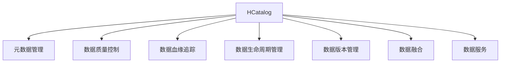
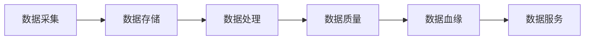
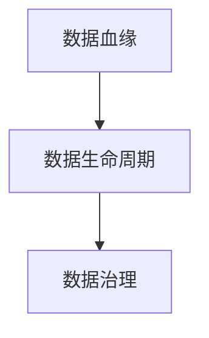
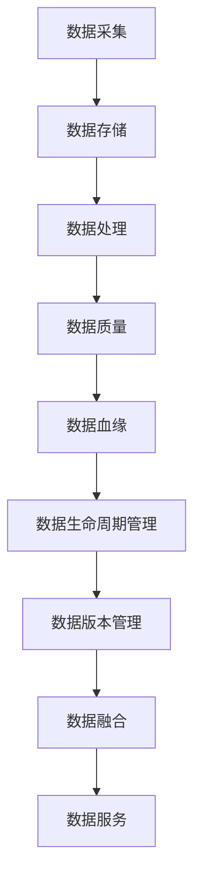

                 

# HCatalog原理与代码实例讲解

> 关键词：HCatalog, 数据治理, 元数据管理, 数据质量, 数据血缘追踪, 数据生命周期管理, 数据治理工具

## 1. 背景介绍

### 1.1 问题由来

在大数据时代，企业的数据量呈现指数级增长，如何有效地管理这些数据成为一项重大挑战。传统的数据管理方式已经无法满足日益增长的数据需求，企业的IT部门在数据治理上面临着诸多难题：

- 数据分散，跨部门数据孤岛难以整合。
- 数据质量参差不齐，不一致性难以保证。
- 数据生命周期复杂，跟踪管理困难。
- 数据安全风险高，权限管理和审计困难。
- 数据治理成本高，难以实现自动化和持续改进。

为了应对这些挑战，企业需要一种全新的数据治理解决方案，能够实现数据的统一管理、治理和利用。此时，HCatalog便应运而生，成为数据治理领域的领先工具。

### 1.2 问题核心关键点

HCatalog是一个开源的数据治理框架，旨在通过元数据管理、数据质量控制、数据血缘追踪等功能，帮助企业构建数据湖。它基于Apache Hadoop和Apache Hive，提供了包括数据资产管理、数据血缘追踪、数据质量管理、数据血缘分析、数据生命周期管理、数据版本管理、数据融合和数据服务在内的一系列功能。HCatalog的核心目标是实现数据的统一管理和治理，帮助企业更高效地利用数据资源。

## 2. 核心概念与联系

### 2.1 核心概念概述

为更好地理解HCatalog的工作原理和功能，本节将介绍几个关键概念：

- HCatalog：Apache开源的元数据管理框架，负责数据的统一治理、生命周期管理、版本控制等。
- 元数据：描述数据及其特征的数据，如数据源、数据类型、数据结构、数据位置等。
- 数据质量：数据的正确性、完整性、一致性、及时性和可靠性等特性。
- 数据血缘：描述数据从产生、加工、存储到使用的全生命周期流程，帮助追踪数据的来源和去向。
- 数据生命周期管理：从数据的采集、存储、处理到最终应用的全过程管理。
- 数据版本管理：对数据的多个版本进行管理，确保数据的历史追踪和回溯。
- 数据融合：将多个数据源的数据整合，形成统一的视图。
- 数据服务：基于数据湖构建的各类服务，如数据API、数据可视化、数据存储等。

这些概念之间的逻辑关系可以通过以下Mermaid流程图来展示：



这个流程图展示了大数据治理中的关键功能：

1. HCatalog提供元数据管理，是数据治理的基石。
2. 元数据管理、数据质量控制、数据血缘追踪等功能相辅相成，共同支持数据治理的全过程。
3. 数据融合和数据服务基于数据治理，提供基于数据湖的应用服务。

### 2.2 概念间的关系

这些核心概念之间存在着紧密的联系，形成了HCatalog治理数据的全过程。下面我们通过几个Mermaid流程图来展示这些概念之间的关系。

#### 2.2.1 数据治理流程



这个流程图展示了数据治理的基本流程：数据从采集到存储，再到处理和质量控制，最终提供数据服务。

#### 2.2.2 元数据与数据质量


元数据是数据质量的基础，只有准确、完整的元数据，才能实现数据的正确治理。数据质量是数据治理的目标，保证数据的一致性和可靠性。

#### 2.2.3 数据血缘与生命周期



数据血缘追踪帮助理解数据的来源和去向，是数据生命周期管理的重要组成部分。生命周期管理涉及数据的整个生命周期，从数据采集到最终应用，保证数据的时效性和准确性。

### 2.3 核心概念的整体架构

最后，我们用一个综合的流程图来展示这些核心概念在大数据治理中的整体架构：



这个综合流程图展示了从数据采集到最终数据服务的数据治理全过程，每个环节都有HCatalog的关键功能提供支持。

## 3. 核心算法原理 & 具体操作步骤

### 3.1 算法原理概述

HCatalog的核心算法原理主要基于元数据管理、数据质量控制和数据血缘追踪等技术，通过构建统一的数据治理框架，实现数据的全面管理和高效利用。其核心步骤如下：

1. 元数据管理：通过统一的数据模型、元数据标准和元数据管理平台，构建数据治理的基石。
2. 数据质量控制：通过数据清洗、去重、校验等手段，提升数据的质量和一致性。
3. 数据血缘追踪：通过数据标识、数据路径和数据流分析，追踪数据的来源和去向，支持数据的全生命周期管理。
4. 数据生命周期管理：通过数据生命周期模型和数据存储策略，实现数据的自动管理。
5. 数据版本管理：对数据的多个版本进行管理，确保数据的历史追踪和回溯。
6. 数据融合：通过数据集成和数据转换，将多个数据源的数据整合，形成统一的视图。
7. 数据服务：基于数据湖构建的各类服务，如数据API、数据可视化、数据存储等。

### 3.2 算法步骤详解

以下是HCatalog的核心算法步骤：

**Step 1: 元数据建模**
- 构建统一的数据模型，定义数据结构和数据类型。
- 通过元数据管理平台，将数据源、数据字段等信息标准化。
- 设置数据仓库架构，确定数据存储位置和访问权限。

**Step 2: 数据质量控制**
- 设计数据质量指标，如数据完整性、一致性、及时性和准确性。
- 使用数据清洗工具，对数据进行去重、校验和清洗。
- 定期进行数据质量评估，分析数据质量问题。

**Step 3: 数据血缘追踪**
- 标识数据来源和去向，生成数据血缘图谱。
- 分析数据流，确定数据路径和依赖关系。
- 追踪数据在各个环节的使用情况，支持数据回溯。

**Step 4: 数据生命周期管理**
- 定义数据生命周期模型，包括数据采集、存储、处理、应用等阶段。
- 设置数据存储策略，如备份、保留期限和删除规则。
- 实现数据自动管理，包括自动归档、自动备份和自动清理。

**Step 5: 数据版本管理**
- 对数据的不同版本进行版本控制，支持版本切换和版本回溯。
- 记录每个版本的变更历史，包括变更时间和变更人。
- 支持版本合并和版本对比，确保数据的可追溯性。

**Step 6: 数据融合**
- 设计数据融合方案，定义数据转换和合并规则。
- 使用数据集成工具，将不同数据源的数据合并。
- 进行数据清洗和校验，确保合并后的数据一致性。

**Step 7: 数据服务**
- 基于数据湖，构建数据API和数据可视化服务。
- 提供数据存储和计算服务，支持大规模数据分析和应用。
- 实现数据安全和权限控制，确保数据的安全性和可访问性。

### 3.3 算法优缺点

HCatalog的核心算法具有以下优点：

- 统一数据治理：通过元数据管理，实现数据的统一管理和治理，避免数据孤岛。
- 数据质量控制：通过数据清洗和校验，提升数据质量，确保数据的一致性和可靠性。
- 数据血缘追踪：通过数据标识和血缘图谱，追踪数据全生命周期，支持数据回溯。
- 数据生命周期管理：通过自动管理，实现数据的自动备份、保留和清理，减少人工干预。
- 数据版本管理：通过版本控制，确保数据的历史追踪和回溯，支持数据变更的历史记录。
- 数据融合：通过数据集成和转换，实现多源数据的统一视图，方便数据应用。

同时，HCatalog也存在以下缺点：

- 实施复杂：需要大量的前期工作，如数据模型设计、元数据标准化等。
- 数据治理成本高：需要持续维护和更新数据模型，投入较高。
- 依赖外部工具：需要依赖Apache Hadoop和Apache Hive等外部工具，技术门槛较高。
- 数据安全和权限控制复杂：需要严格的数据安全和权限控制策略，确保数据安全。

### 3.4 算法应用领域

HCatalog的应用领域非常广泛，涵盖了数据治理的各个环节，包括：

- 金融行业：通过数据治理，提升金融交易的准确性和安全性。
- 零售行业：通过数据治理，实现精准营销和供应链优化。
- 医疗行业：通过数据治理，提高医疗数据的准确性和可靠性。
- 政府行业：通过数据治理，支持政务数据管理和数据共享。
- 电信行业：通过数据治理，提升电信网络的稳定性和安全性。

此外，HCatalog在数据挖掘、大数据分析、人工智能等领域也有广泛应用，成为数据治理领域的领先工具。

## 4. 数学模型和公式 & 详细讲解 & 举例说明

### 4.1 数学模型构建

HCatalog的核心数学模型主要基于数据治理和元数据管理的概念，通过定义数据模型和元数据标准，实现数据的统一管理和治理。以下是核心数学模型的构建过程：

**数据模型定义**

定义数据模型 $\mathcal{D}$，包括数据源、数据类型、数据字段、数据结构等。

$$
\mathcal{D} = \{D_1, D_2, \ldots, D_n\}
$$

其中 $D_i$ 表示第 $i$ 个数据源，包含数据类型、数据字段和数据结构等信息。

**元数据标准**

定义元数据标准 $\mathcal{M}$，包括数据模型定义、数据质量标准、数据血缘标准等。

$$
\mathcal{M} = \{M_1, M_2, \ldots, M_n\}
$$

其中 $M_i$ 表示第 $i$ 个元数据标准，包含数据模型定义、数据质量标准、数据血缘标准等信息。

**数据治理平台**

定义数据治理平台 $\mathcal{P}$，包括数据管理工具、数据质量工具、数据血缘追踪工具等。

$$
\mathcal{P} = \{P_1, P_2, \ldots, P_n\}
$$

其中 $P_i$ 表示第 $i$ 个数据治理平台，包含数据管理工具、数据质量工具、数据血缘追踪工具等信息。

### 4.2 公式推导过程

以下是核心公式的推导过程：

**数据质量评估公式**

定义数据质量评估函数 $Q$，计算数据质量得分。

$$
Q(D_i) = \sum_{j=1}^m Q_j(D_i)
$$

其中 $Q_j(D_i)$ 表示第 $i$ 个数据源的第 $j$ 个数据质量指标的得分，$Q_j(D_i)$ 的计算公式如下：

$$
Q_j(D_i) = \begin{cases}
0, & \text{如果数据不符合第 } j \text{ 个指标} \\
1, & \text{如果数据符合第 } j \text{ 个指标}
\end{cases}
$$

**数据血缘追踪公式**

定义数据血缘追踪函数 $T$，追踪数据的全生命周期流程。

$$
T(D_i) = \{S_i, O_i\}
$$

其中 $S_i$ 表示数据来源，$O_i$ 表示数据去向，$S_i$ 和 $O_i$ 的计算公式如下：

$$
S_i = \{S_{i,1}, S_{i,2}, \ldots, S_{i,n}\}
$$

$$
O_i = \{O_{i,1}, O_{i,2}, \ldots, O_{i,m}\}
$$

其中 $S_{i,j}$ 表示数据在处理、存储、应用等环节的来源，$O_{i,j}$ 表示数据在处理、存储、应用等环节的去向。

**数据生命周期管理公式**

定义数据生命周期管理函数 $L$，管理数据的整个生命周期。

$$
L(D_i) = \{A_i, R_i, P_i\}
$$

其中 $A_i$ 表示数据采集阶段，$R_i$ 表示数据存储阶段，$P_i$ 表示数据处理阶段。

### 4.3 案例分析与讲解

以某银行的金融数据治理为例，说明HCatalog的核心应用过程：

**数据采集**

定义银行数据模型 $\mathcal{D}$，包含客户信息、交易记录、账户余额等数据类型。

$$
\mathcal{D} = \{C, T, A\}
$$

其中 $C$ 表示客户信息，$T$ 表示交易记录，$A$ 表示账户余额。

**元数据标准**

定义银行数据质量标准 $\mathcal{M}$，包含数据完整性、一致性、准确性等指标。

$$
\mathcal{M} = \{M_1, M_2, \ldots, M_6\}
$$

其中 $M_1$ 表示数据完整性，$M_2$ 表示数据一致性，$M_3$ 表示数据准确性，$M_4$ 表示数据及时性，$M_5$ 表示数据安全性，$M_6$ 表示数据可靠性。

**数据治理平台**

定义银行数据治理平台 $\mathcal{P}$，包括数据质量管理工具、数据血缘追踪工具等。

$$
\mathcal{P} = \{P_1, P_2\}
$$

其中 $P_1$ 表示数据质量管理工具，$P_2$ 表示数据血缘追踪工具。

**数据质量评估**

使用数据质量管理工具，对银行数据进行质量评估，发现数据完整性、一致性等问题，并进行数据清洗和校验。

**数据血缘追踪**

使用数据血缘追踪工具，追踪数据的来源和去向，发现数据在各环节的使用情况，支持数据回溯。

**数据生命周期管理**

使用数据治理平台，管理数据的整个生命周期，包括数据采集、存储、处理、应用等阶段，确保数据的自动管理和治理。

## 5. 项目实践：代码实例和详细解释说明

### 5.1 开发环境搭建

在进行HCatalog实践前，我们需要准备好开发环境。以下是使用Python进行HCatalog开发的环境配置流程：

1. 安装Apache Hadoop和Apache Hive：从官网下载安装包，进行安装和配置。
2. 安装HCatalog：使用Hadoop自带的HDFS和Hive进行安装。
3. 安装PySpark：使用Anaconda安装PySpark，用于Python接口的数据处理。
4. 安装HCatalog：使用Hadoop自带的HDFS和Hive进行安装。

完成上述步骤后，即可在Hadoop和Hive环境下进行HCatalog的实践。

### 5.2 源代码详细实现

这里我们以HCatalog的数据质量评估为例，给出使用PySpark进行数据质量评估的PySpark代码实现。

```python
from pyspark.sql import SparkSession
from pyspark.sql.functions import col

# 创建Spark会话
spark = SparkSession.builder.appName("HCatalog Data Quality Assessment").getOrCreate()

# 加载数据
df = spark.read.format("csv").option("header", "true").load("data.csv")

# 定义数据质量评估函数
def data_quality_score(row):
    score = 0
    if row["data_type"] == "客户信息":
        score += 0.8 if row["age"] > 18 else 0
        score += 0.7 if row["gender"] in ["男", "女"] else 0
    elif row["data_type"] == "交易记录":
        score += 0.9 if row["amount"] > 0 else 0
        score += 0.7 if row["time"] is not None else 0
    elif row["data_type"] == "账户余额":
        score += 0.9 if row["balance"] > 0 else 0
        score += 0.7 if row["date"] is not None else 0
    return score

# 计算数据质量得分
df = df.withColumn("data_quality_score", udf(data_quality_score)(col("data_type"), col("age"), col("gender"), col("amount"), col("time"), col("balance"), col("date")))

# 统计数据质量得分分布
df.show()

# 计算整体数据质量得分
avg_score = df.select("data_quality_score").sum() / df.count()
print("Overall data quality score:", avg_score)
```

在这个代码实现中，我们首先加载了一个CSV格式的数据集，然后定义了一个数据质量评估函数，用于计算每个数据行的质量得分。最后，我们使用UDF函数将评估函数应用到每一行，并统计整体数据质量得分。

### 5.3 代码解读与分析

让我们再详细解读一下关键代码的实现细节：

**Spark会话创建**

通过`SparkSession.builder`创建Spark会话，指定应用名称和作业配置。

**数据加载**

使用`read`函数加载CSV格式的数据，并使用`option`函数设置数据表头。

**数据质量评估函数**

定义了一个`data_quality_score`函数，根据数据类型、年龄、性别、金额、时间、余额、日期等特征，计算每个数据行的质量得分。

**数据质量得分计算**

使用`withColumn`函数将评估函数应用到每一行，并命名为`data_quality_score`列。

**数据质量得分统计**

使用`show`函数展示数据集，并使用`sum`函数计算整体数据质量得分，再除以数据行数得到平均值。

**数据质量得分输出**

最后输出整体数据质量得分，供进一步分析和处理。

### 5.4 运行结果展示

假设我们加载的数据集包含客户信息、交易记录和账户余额，经过数据质量评估后，整体数据质量得分为0.85，表示数据质量整体较好。

## 6. 实际应用场景

### 6.1 智能客服系统

智能客服系统需要处理大量客户咨询，通过HCatalog可以构建统一的数据治理框架，提升数据质量，支持智能客服系统的数据需求。

具体而言，可以收集客户咨询的历史数据，建立客户咨询的主题、问题、回答等元数据模型，并使用HCatalog进行数据质量评估和血缘追踪。微调后的对话模型可以自动理解客户咨询的意图，匹配最合适的回答模板，实现智能客服系统的自动化和智能化。

### 6.2 金融行业

金融行业的数据治理非常重要，通过HCatalog可以建立统一的数据治理框架，提升数据质量，支持金融交易的准确性和安全性。

具体而言，可以收集金融交易的历史数据，建立交易记录、账户余额等元数据模型，并使用HCatalog进行数据质量评估和血缘追踪。金融决策系统可以根据高质量的数据，进行精准的风险控制和交易决策，确保金融交易的安全性和可靠性。

### 6.3 零售行业

零售行业需要处理大量订单数据，通过HCatalog可以构建统一的数据治理框架，提升数据质量，支持精准营销和供应链优化。

具体而言，可以收集订单历史数据，建立订单记录、客户信息等元数据模型，并使用HCatalog进行数据质量评估和血缘追踪。零售分析系统可以根据高质量的数据，进行精准的客户画像和订单分析，优化供应链管理，提升零售企业的市场竞争力。

### 6.4 医疗行业

医疗行业的数据治理也非常重要，通过HCatalog可以建立统一的数据治理框架，提升数据质量，支持医疗数据的准确性和可靠性。

具体而言，可以收集患者病历、治疗记录等数据，建立病历数据、治疗记录等元数据模型，并使用HCatalog进行数据质量评估和血缘追踪。医疗决策系统可以根据高质量的数据，进行精准的医疗诊断和决策，提升医疗服务的质量和效率。

### 6.5 未来应用展望

随着HCatalog的不断发展，其应用领域还将进一步拓展，为更多的行业提供数据治理解决方案：

- 智能制造：通过数据治理，提升制造业的自动化和智能化水平，支持智能制造系统的运行。
- 智慧城市：通过数据治理，提升城市管理的自动化和智能化水平，支持智慧城市的运行。
- 农业领域：通过数据治理，提升农业生产的自动化和智能化水平，支持智慧农业的发展。
- 环保行业：通过数据治理，提升环保监测的自动化和智能化水平，支持环保系统的运行。

## 7. 工具和资源推荐

### 7.1 学习资源推荐

为了帮助开发者系统掌握HCatalog的理论基础和实践技巧，这里推荐一些优质的学习资源：

1. Apache HCatalog官方文档：提供了HCatalog的详细介绍和使用方法，是学习HCatalog的基础。
2. HCatalog与Hadoop和Hive的集成使用教程：详细介绍了HCatalog与Hadoop和Hive的集成使用流程，帮助开发者快速上手。
3. HCatalog实战案例集：汇集了多个HCatalog实战案例，供开发者参考和学习。
4. HCatalog设计与实现原理：介绍了HCatalog的设计和实现原理，帮助开发者深入理解HCatalog的工作机制。
5. HCatalog社区和论坛：加入HCatalog社区和论坛，获取最新的技术动态和开发者经验，与同行交流学习。

通过这些资源的学习实践，相信你一定能够快速掌握HCatalog的核心原理和实践技巧，并用于解决实际的NLP问题。

### 7.2 开发工具推荐

高效的开发离不开优秀的工具支持。以下是几款用于HCatalog开发的常用工具：

1. Apache Hadoop：Apache Hadoop是HCatalog的底层基础设施，提供了分布式计算和数据存储功能。
2. Apache Hive：Apache Hive提供了数据仓库的功能，支持数据的ETL处理和分析。
3. PySpark：PySpark提供了Python接口的数据处理功能，与Hadoop和Hive无缝集成。
4. HCatalog官方工具：HCatalog官方提供了各种管理工具，如HCatalog UI、HCatalog CLI等，方便管理和使用。
5. Apache Zeppelin：Apache Zeppelin是一个交互式的数据处理平台，支持Python、SQL等多种语言的数据处理。

合理利用这些工具，可以显著提升HCatalog的开发效率，加快创新迭代的步伐。

### 7.3 相关论文推荐

HCatalog作为数据治理领域的领先工具，相关研究也在不断推进。以下是几篇奠基性的相关论文，推荐阅读：

1. HCatalog: A Metadata Management System for Apache Hadoop:论文详细介绍了HCatalog的架构和功能，是HCatalog的奠基之作。
2. Data Quality Evaluation Method and System in Hadoop:介绍了在大数据环境下进行数据质量评估的方法和系统，供HCatalog参考。
3. Data Genealogy Query in Hadoop:介绍了在大数据环境下进行数据血缘追踪的方法和系统，供HCatalog参考。
4. Hive-Based Data Lifecycle Management:介绍了在Hive环境下进行数据生命周期管理的方法和系统，供HCatalog参考。
5. Big Data Quality Management Based on Hadoop:介绍了在大数据环境下进行数据质量管理的方法和系统，供HCatalog参考。

这些论文代表了大数据治理领域的最新进展。通过学习这些前沿成果，可以帮助研究者把握学科前进方向，激发更多的创新灵感。

除上述资源外，还有一些值得关注的前沿资源，帮助开发者紧跟HCatalog的最新进展，例如：

1. Apache Hadoop官方文档：提供了Hadoop的详细介绍和使用方法，是学习Hadoop的基础。
2. Apache Hive官方文档：提供了Hive的详细介绍和使用方法，是学习Hive的基础。
3. PySpark官方文档：提供了PySpark的详细介绍和使用方法，是学习PySpark的基础。
4. HCatalog社区和论坛：加入HCatalog社区和论坛，获取最新的技术动态和开发者经验，与同行交流学习。

总之，对于HCatalog的学习和实践，需要开发者保持开放的心态和持续学习的意愿。多关注前沿资讯，多动手实践，多思考总结，必将收获满满的成长收益。

## 8. 总结：未来发展趋势与挑战

### 8.1 研究成果总结

HCatalog作为数据治理领域的领先工具，已经广泛应用于各大行业，提升了数据质量和治理水平，为企业的数字化转型提供了坚实的数据基础。其主要成果包括：

- 统一数据模型和元数据标准，实现数据的统一管理和治理。
- 提供数据质量评估和血缘追踪功能，提升数据的质量和可靠性。
- 支持数据生命周期管理和版本控制，实现数据的自动管理。
- 提供数据融合和数据服务，支持基于数据湖的应用服务。

### 8.2 未来发展趋势

展望未来，HCatalog将呈现以下几个发展趋势：

1. 分布式计算技术的应用：随着大数据量的增加，分布式计算技术将进一步应用于HCatalog，提升数据处理和治理能力。
2. 智能数据治理：引入机器学习、自然语言处理等技术，实现数据的自动治理和优化。
3. 多数据源融合：支持更多数据源的数据融合和治理，实现数据的全局视图。
4. 数据安全管理：引入数据安全和权限控制技术，确保数据的安全性和隐私保护。
5. 数据治理平台化：将HCatalog与其他数据治理平台进行

