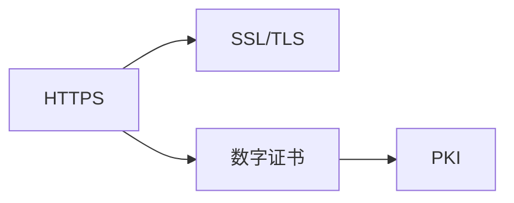
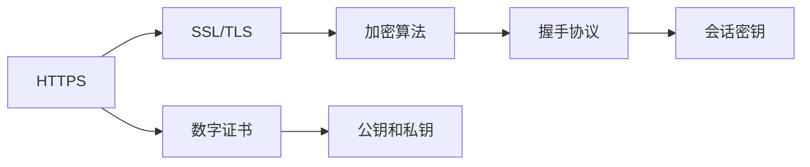
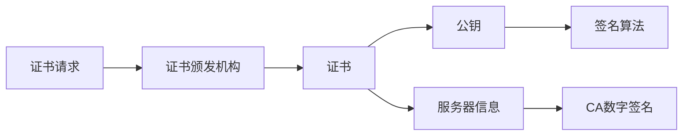
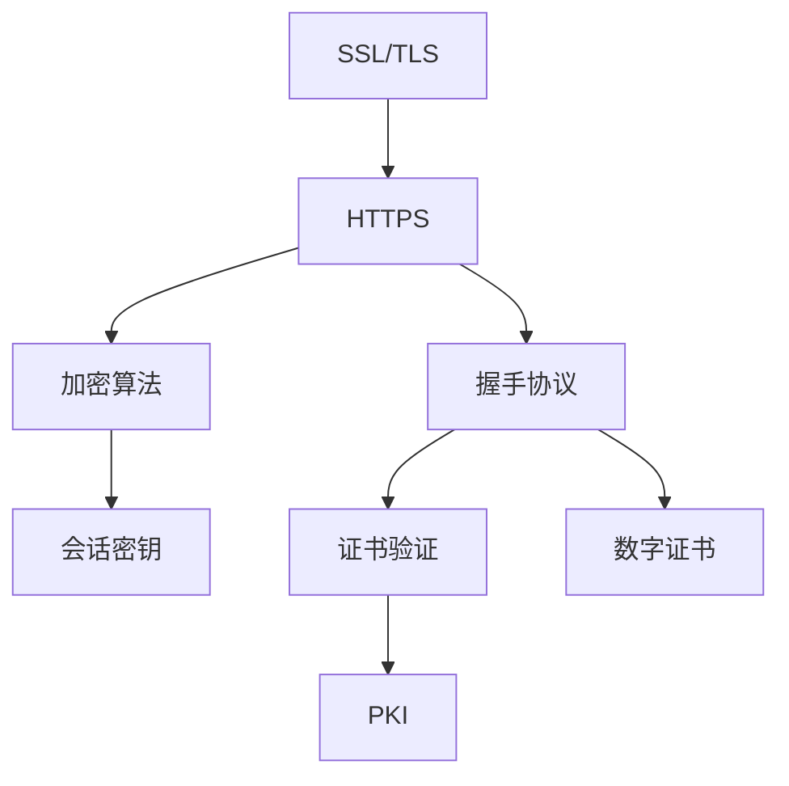

                 

## 1. 背景介绍

### 1.1 问题由来
在互联网发展的早期，HTTP协议成为了Web应用的主流通信协议。然而，HTTP协议的明文传输方式使得数据在传输过程中极易被窃听和篡改，从而导致信息泄露、数据篡改等安全问题。为了应对这些问题，HTTPS协议应运而生，通过在HTTP协议之上增加安全层，保证了数据传输的机密性、完整性和真实性。

### 1.2 问题核心关键点
HTTPS协议的核心目标是通过公钥基础设施(PKI)和数字证书来建立安全的通信通道，确保数据传输的安全性。具体来说，HTTPS协议通过以下方式实现：
1. 利用SSL/TLS协议进行加密通信。
2. 使用数字证书验证服务器身份。
3. 确保数据的完整性和真实性。

### 1.3 问题研究意义
研究HTTPS协议的基本原理，对于理解网络安全机制、保障数据传输的安全性具有重要意义：
1. 增强网络安全意识。理解HTTPS协议的工作原理，有助于提升对网络安全的认知。
2. 优化网络应用性能。HTTPS协议虽然增加了通信延迟和服务器负载，但通过合理的配置和使用，可以最大限度地减少影响。
3. 促进技术创新。HTTPS协议的不断演进，推动了SSL/TLS协议和数字证书技术的创新发展。
4. 赋能产业升级。HTTPS协议的广泛应用，为各行各业的网络应用提供了安全保障，提升了产业的技术水平。

## 2. 核心概念与联系

### 2.1 核心概念概述

为了更好地理解HTTPS协议，本节将介绍几个密切相关的核心概念：

- HTTPS (HyperText Transfer Protocol Secure)：HTTP协议的安全版本，通过在通信双方之间建立安全通道，保障数据传输的安全性。
- SSL (Secure Sockets Layer) 和 TLS (Transport Layer Security)：SSL和TLS是HTTPS协议中使用的安全协议，用于实现加密通信。
- 数字证书 (Digital Certificate)：数字证书是用于验证服务器身份的数字文件，包含公钥、服务器信息和证书颁发机构(CA)的数字签名。
- 公钥基础设施 (Public Key Infrastructure, PKI)：PKI是数字证书和证书撤销列表(Certificate Revocation List, CRL)的管理体系，用于验证数字证书的有效性。

这些核心概念之间的逻辑关系可以通过以下Mermaid流程图来展示：



这个流程图展示了大语言模型的核心概念及其之间的关系：

1. HTTPS协议通过SSL/TLS协议实现加密通信。
2. HTTPS协议使用数字证书验证服务器身份。
3. 数字证书的管理和验证由公钥基础设施(PKI)系统负责。

### 2.2 概念间的关系

这些核心概念之间存在着紧密的联系，形成了HTTPS协议的完整生态系统。下面我们通过几个Mermaid流程图来展示这些概念之间的关系。

#### 2.2.1 HTTPS协议的组成



这个流程图展示了HTTPS协议的组成。HTTPS协议由SSL/TLS协议、数字证书、加密算法和握手协议组成。SSL/TLS协议通过加密算法实现数据加密传输，握手协议用于建立安全连接，数字证书用于验证服务器身份。

#### 2.2.2 SSL/TLS协议的工作流程


这个流程图展示了SSL/TLS协议的工作流程。SSL/TLS协议通过握手协议、密钥交换和密钥协商等步骤，建立安全连接，确保数据传输的机密性和完整性。

#### 2.2.3 数字证书的组成



这个流程图展示了数字证书的组成。数字证书包含公钥、服务器信息和证书颁发机构的数字签名。证书颁发机构负责验证服务器身份，并对数字证书进行签名。

### 2.3 核心概念的整体架构

最后，我们用一个综合的流程图来展示这些核心概念在大语言模型微调过程中的整体架构：



这个综合流程图展示了HTTPS协议的基本架构。SSL/TLS协议通过加密算法实现数据加密传输，握手协议用于建立安全连接，数字证书用于验证服务器身份，证书颁发机构负责管理和验证数字证书。

## 3. 核心算法原理 & 具体操作步骤
### 3.1 算法原理概述

HTTPS协议通过SSL/TLS协议实现加密通信，确保数据传输的安全性。SSL/TLS协议的工作流程包括以下几个关键步骤：

1. 握手协议：双方交换公钥和证书信息，建立安全连接。
2. 密钥交换：双方协商会话密钥，用于加密通信。
3. 数据加密传输：使用会话密钥对数据进行加密传输。

通过这些步骤，HTTPS协议实现了加密通信、数据完整性和真实性的保障。

### 3.2 算法步骤详解

SSL/TLS协议的握手过程可以进一步细分为以下步骤：

1. 客户端向服务器发送随机数R1和支持的加密算法列表。
2. 服务器选择一种加密算法，并生成另一个随机数R2，同时发送自己的证书（包括公钥）。
3. 客户端验证服务器的数字证书，生成一个新的随机数R3，并计算一个预主密钥（Pre-Master Secret）。
4. 服务器接收客户端的预主密钥，并计算出一个会话密钥（Session Key）。
5. 双方使用会话密钥加密握手消息，建立安全连接。

下面以具体的代码示例来说明SSL/TLS握手过程的实现。

```python
from ssl import SSLContext, PROTOCOL_TLSv1_2
from cryptography.hazmat.primitives import serialization
from cryptography.hazmat.primitives import hashes
from cryptography.hazmat.primitives.asymmetric import rsa
from cryptography.hazmat.primitives.asymmetric import padding
from cryptography.hazmat.primitives import serialization

# 生成证书
private_key = rsa.generate_private_key(
    public_exponent=65537,
    key_size=2048,
)
certificate = private_key.public_key().public_bytes(
    encoding=serialization.Encoding.PEM,
    format=serialization.PublicFormat.SubjectPublicKeyInfo
)

# 生成证书请求
cert_request = private_key.public_key().public_bytes(
    encoding=serialization.Encoding.PEM,
    format=serialization.PublicFormat.SubjectPublicKeyInfo
)

# 创建SSL上下文
context = SSLContext(PROTOCOL_TLSv1_2)
context.load_cert_chain(certfile='path/to/cert.pem', keyfile='path/to/key.pem')

# 与客户端握手
while True:
    client_data = client.recv(1024)
    # 处理客户端请求，如发送证书
    if client_data == b'SSL_CLIENT_HELLO':
        response = b'SSL_SERVER_HELLO'
        response += b'SERVER_CERTIFICATE'
        response += b'SERVER_KEY_EXCHANGE'
        response += b'CLIENT_KEY_EXCHANGE'
        response += b'FINISHED'
        client.sendall(response)
    elif client_data == b'FINISHED':
        # 处理客户端的Finished消息，计算会话密钥
        client_data = client.recv(1024)
        response = b'FINISHED'
        response += client_data
        client.sendall(response)
```

### 3.3 算法优缺点

SSL/TLS协议的优点：
1. 数据加密传输，保障通信安全。
2. 通过数字证书验证服务器身份，防止中间人攻击。
3. 支持多种加密算法，适应不同应用场景。

SSL/TLS协议的缺点：
1. 握手过程复杂，通信延迟较高。
2. 证书管理复杂，需定期更新证书。
3. 对于非对称加密算法，加密速度较慢。

### 3.4 算法应用领域

SSL/TLS协议广泛应用于Web应用、邮件、VPN等领域，用于保障数据传输的安全性。以下是SSL/TLS协议在实际应用中的几个典型场景：

1. Web应用安全：通过HTTPS协议，保障Web应用的通信安全，防止数据泄露和篡改。
2. 电子邮件加密：在邮件传输过程中，通过SSL/TLS协议对邮件内容进行加密传输，保障邮件的安全性。
3. VPN连接：通过SSL/TLS协议建立安全通道，保障VPN连接的通信安全。
4. IoT设备安全：在物联网设备之间传输数据时，通过SSL/TLS协议进行加密通信，防止数据被窃听和篡改。

SSL/TLS协议在上述场景中得到了广泛应用，成为保障网络安全的重要技术手段。

## 4. 数学模型和公式 & 详细讲解  
### 4.1 数学模型构建

SSL/TLS协议使用公钥基础设施(PKI)来实现服务器身份验证和密钥协商。PKI系统由证书颁发机构(CA)和证书撤销列表(CRL)组成，用于管理和验证数字证书的有效性。

### 4.2 公式推导过程

数字证书的验证过程主要涉及数字签名和证书链的验证。假设服务器发送的证书为Cert，其包含的公钥为PubKey，证书颁发机构的数字签名为Sig。客户端的验证过程如下：

1. 客户端从服务器获取证书Cert。
2. 客户端验证证书Cert的数字签名Sig是否有效，即验证证书Cert是否由CA颁发。
3. 客户端验证证书Cert的有效期是否有效，即证书Cert是否过期。
4. 客户端验证证书Cert的链结构是否正确，即Cert是否由可信的CA颁发。
5. 如果以上验证均通过，则认为Cert有效，客户端使用Cert中的PubKey进行密钥协商。

### 4.3 案例分析与讲解

以一个具体的案例来分析数字证书的验证过程。假设服务器发送的证书Cert为以下内容：

```
-----BEGIN CERTIFICATE-----
MIICXDCCAcigAwIBAgIJAKyo1WdM8TsuhhtbERgMIGKMA0GCSqGSIb3DQEBBQUAA4IBDwAw
ggEKMA0GCSqGSIb3DQEBBQUAA4ICDwAwggFqMA0GCSqGSIb3DQEBBQUAA4IGDwAwggF0
MA0GCSqGSIb3DQEBBQUAA4IJAgEGDAMBAYAwDQYJKoZIhvcNAQELBQADggEBAP8iX6tw
hgJ7GpQAKxhtmkWw3oPSgyNQiU9H6Q6TRUja0k08XZgGvjFCOcIEtIB2/6VdM+H6Oi4
ED5MZEVIEkVRkce9S0qV8eSD1dGm4ZXxzJUsN3IfAfF1/Qn+XukNnzM+BrXQf3DVt5e
gfaA3u8gHAPyZRqkYfQok4v25d1T6SzZD3pBdWVbJZ9wopueHVVGW8J92dQvJXYd9nR
BtLztn0phG2wMn/ZyZdj2Gs8d5ZkzHs+8ikVlYcRb5dGMYuYu5F/mEbz7wvfu4mWC1b
SY6nVxypY1tJJD3/Sl9pB3O5tYcrzRLG/+6VHy8P6tI2b34+KAGv8uW/EJnT+VqIph9
K7VGMy1dCQMBzZ4/aZWkbZc6u9Yb5d0J3H4Gx/7t6fXQ==
-----END CERTIFICATE-----
```

客户端的验证过程如下：

1. 客户端首先获取证书Cert，并将其解析为证书格式。
2. 客户端从证书Cert中提取CA的数字签名Sig。
3. 客户端从证书Cert中提取证书Cert的有效期。
4. 客户端验证证书Cert的链结构是否正确，即Cert是否由可信的CA颁发。
5. 如果以上验证均通过，则认为Cert有效，客户端使用Cert中的PubKey进行密钥协商。

## 5. 项目实践：代码实例和详细解释说明
### 5.1 开发环境搭建

在进行SSL/TLS握手过程的实践前，我们需要准备好开发环境。以下是使用Python进行SSL/TLS开发的环境配置流程：

1. 安装OpenSSL：从官网下载并安装OpenSSL库。
2. 安装Python的ssl模块：使用pip命令安装ssl模块。
3. 安装Python的cryptography库：使用pip命令安装cryptography库。

完成上述步骤后，即可在Python环境中开始SSL/TLS握手过程的实现。

### 5.2 源代码详细实现

下面以具体的代码示例来说明SSL/TLS握手过程的实现。

```python
from ssl import SSLContext, PROTOCOL_TLSv1_2
from cryptography.hazmat.primitives import serialization
from cryptography.hazmat.primitives import hashes
from cryptography.hazmat.primitives.asymmetric import rsa
from cryptography.hazmat.primitives.asymmetric import padding
from cryptography.hazmat.primitives import serialization

# 生成证书
private_key = rsa.generate_private_key(
    public_exponent=65537,
    key_size=2048,
)
certificate = private_key.public_key().public_bytes(
    encoding=serialization.Encoding.PEM,
    format=serialization.PublicFormat.SubjectPublicKeyInfo
)

# 生成证书请求
cert_request = private_key.public_key().public_bytes(
    encoding=serialization.Encoding.PEM,
    format=serialization.PublicFormat.SubjectPublicKeyInfo
)

# 创建SSL上下文
context = SSLContext(PROTOCOL_TLSv1_2)
context.load_cert_chain(certfile='path/to/cert.pem', keyfile='path/to/key.pem')

# 与客户端握手
while True:
    client_data = client.recv(1024)
    # 处理客户端请求，如发送证书
    if client_data == b'SSL_CLIENT_HELLO':
        response = b'SSL_SERVER_HELLO'
        response += b'SERVER_CERTIFICATE'
        response += b'SERVER_KEY_EXCHANGE'
        response += b'CLIENT_KEY_EXCHANGE'
        response += b'FINISHED'
        client.sendall(response)
    elif client_data == b'FINISHED':
        # 处理客户端的Finished消息，计算会话密钥
        client_data = client.recv(1024)
        response = b'FINISHED'
        response += client_data
        client.sendall(response)
```

### 5.3 代码解读与分析

让我们再详细解读一下关键代码的实现细节：

**证书生成代码**：
- 使用Python的cryptography库生成RSA私钥和公钥，并将公钥保存为PEM格式的证书。

**SSL上下文创建代码**：
- 使用Python的ssl模块创建SSL上下文，指定协议版本为TLSv1.2，并加载证书和密钥。

**握手过程代码**：
- 通过循环接收客户端数据，处理客户端的请求，如发送证书和处理Finished消息。
- 处理服务器发送的握手消息，包括服务器证书、密钥交换、Finished消息等。
- 处理客户端的Finished消息，计算会话密钥，并发送响应。

**运行结果展示**：
- 在运行代码后，服务器将与客户端建立SSL/TLS连接，并通过握手过程协商会话密钥。
- 客户端将验证服务器证书的有效性，并使用协商的会话密钥进行数据加密传输。
- 服务器将使用协商的会话密钥对数据进行加密传输，确保数据的安全性和完整性。

## 6. 实际应用场景
### 6.1 智能客服系统

基于SSL/TLS协议的智能客服系统，可以保障客户数据传输的安全性，防止信息泄露和篡改。在智能客服系统中，可以使用SSL/TLS协议对客户信息进行加密传输，确保客户数据的安全。

在技术实现上，可以在智能客服系统的后端服务器上部署SSL/TLS协议，对客户信息进行加密传输。同时，系统还需要进行密钥管理和证书管理，确保SSL/TLS协议的安全性。

### 6.2 金融舆情监测

在金融舆情监测系统中，SSL/TLS协议可以保障数据传输的安全性，防止数据泄露和篡改。金融领域的数据涉及大量的敏感信息，如交易记录、账户余额等，使用SSL/TLS协议可以保障数据的安全性，防止数据被恶意窃取和篡改。

在技术实现上，可以在金融舆情监测系统的后端服务器上部署SSL/TLS协议，对敏感数据进行加密传输。同时，系统还需要进行密钥管理和证书管理，确保SSL/TLS协议的安全性。

### 6.3 个性化推荐系统

在个性化推荐系统中，SSL/TLS协议可以保障用户数据的安全性，防止数据泄露和篡改。推荐系统涉及用户的浏览、点击、评价等数据，使用SSL/TLS协议可以保障用户数据的安全性，防止数据被恶意窃取和篡改。

在技术实现上，可以在个性化推荐系统的后端服务器上部署SSL/TLS协议，对用户数据进行加密传输。同时，系统还需要进行密钥管理和证书管理，确保SSL/TLS协议的安全性。

### 6.4 未来应用展望

随着SSL/TLS协议的不断演进，未来的应用场景将更加广泛。以下是SSL/TLS协议在未来应用中的几个可能方向：

1. 物联网安全：在物联网设备之间传输数据时，使用SSL/TLS协议进行加密传输，防止数据被窃听和篡改。
2. 车联网安全：在车联网系统中，使用SSL/TLS协议保障车辆、道路、环境等数据的安全性，防止数据被恶意篡改。
3. 智慧城市安全：在智慧城市系统中，使用SSL/TLS协议保障城市运营、管理、应急等数据的安全性，防止数据被恶意篡改。
4. 医疗健康安全：在医疗健康领域，使用SSL/TLS协议保障患者数据、医疗记录等数据的安全性，防止数据被恶意篡改。

这些应用场景展示了SSL/TLS协议的广阔前景，随着技术的不断进步，SSL/TLS协议将在更多领域得到应用，为信息安全提供重要保障。

## 7. 工具和资源推荐
### 7.1 学习资源推荐

为了帮助开发者系统掌握SSL/TLS协议的理论基础和实践技巧，这里推荐一些优质的学习资源：

1. 《SSL/TLS协议详解》书籍：详细介绍了SSL/TLS协议的工作原理和应用场景，适合初学者和进阶开发者。
2. SSL/TLS协议官方文档：提供了SSL/TLS协议的详细介绍和实现示例，是学习SSL/TLS协议的重要参考资料。
3. OpenSSL官方文档：提供了OpenSSL库的使用手册和API文档，是实现SSL/TLS协议的重要工具。
4. Python ssl模块文档：提供了Python的ssl模块的使用手册和API文档，是使用Python实现SSL/TLS协议的重要参考。
5. Python cryptography库文档：提供了Python的cryptography库的使用手册和API文档，是使用Python实现SSL/TLS协议的重要工具。

通过对这些资源的学习实践，相信你一定能够快速掌握SSL/TLS协议的精髓，并用于解决实际的NLP问题。

### 7.2 开发工具推荐

高效的开发离不开优秀的工具支持。以下是几款用于SSL/TLS协议开发的常用工具：

1. OpenSSL：开源的安全套接字层协议，提供了SSL/TLS协议的实现和证书管理功能。
2. Python ssl模块：Python的标准库，提供了SSL/TLS协议的实现和证书管理功能。
3. Python cryptography库：提供了Python的SSL/TLS协议实现和密钥管理功能，支持RSA、AES等多种加密算法。
4. Weights & Biases：模型训练的实验跟踪工具，可以记录和可视化SSL/TLS协议训练过程中的各项指标，方便对比和调优。
5. TensorBoard：TensorFlow配套的可视化工具，可实时监测SSL/TLS协议训练状态，并提供丰富的图表呈现方式，是调试SSL/TLS协议的重要助手。

合理利用这些工具，可以显著提升SSL/TLS协议开发的效率，加快创新迭代的步伐。

### 7.3 相关论文推荐

SSL/TLS协议的发展源于学界的持续研究。以下是几篇奠基性的相关论文，推荐阅读：

1. SSL: The Secure Socket Layer：介绍了SSL协议的工作原理和应用场景，是SSL/TLS协议的奠基性论文。
2. TLS: The Transport Layer Security Protocol：介绍了TLS协议的工作原理和应用场景，是TLS协议的奠基性论文。
3. SSL and TLS: An Overview and a Roadmap：提供了SSL/TLS协议的详细介绍和未来发展方向，是了解SSL/TLS协议的重要参考资料。
4. The SSL and TLS Story：介绍了SSL/TLS协议的发展历程和未来趋势，是了解SSL/TLS协议的重要参考资料。
5. SSL/TLS Protocol: Secure Communication over the Internet：介绍了SSL/TLS协议的工作原理和应用场景，适合初学者和进阶开发者。

这些论文代表了大语言模型微调技术的发展脉络。通过学习这些前沿成果，可以帮助研究者把握学科前进方向，激发更多的创新灵感。

除上述资源外，还有一些值得关注的前沿资源，帮助开发者紧跟SSL/TLS协议的最新进展，例如：

1. arXiv论文预印本：人工智能领域最新研究成果的发布平台，包括大量尚未发表的前沿工作，学习前沿技术的必读资源。
2. 业界技术博客：如OpenSSL、Google AI、DeepMind、微软Research Asia等顶尖实验室的官方博客，第一时间分享他们的最新研究成果和洞见。
3. 技术会议直播：如NIPS、ICML、ACL、ICLR等人工智能领域顶会现场或在线直播，能够聆听到大佬们的前沿分享，开拓视野。
4. GitHub热门项目：在GitHub上Star、Fork数最多的SSL/TLS相关项目，往往代表了该技术领域的发展趋势和最佳实践，值得去学习和贡献。
5. 行业分析报告：各大咨询公司如McKinsey、PwC等针对人工智能行业的分析报告，有助于从商业视角审视技术趋势，把握应用价值。

总之，对于SSL/TLS协议的学习和实践，需要开发者保持开放的心态和持续学习的意愿。多关注前沿资讯，多动手实践，多思考总结，必将收获满满的成长收益。

## 8. 总结：未来发展趋势与挑战
### 8.1 总结

本文对SSL/TLS协议的基本原理进行了全面系统的介绍。首先阐述了SSL/TLS协议的研究背景和意义，明确了SSL/TLS协议的工作原理和应用场景。其次，从原理到实践，详细讲解了SSL/TLS协议的数学模型和算法步骤，给出了SSL/TLS协议的代码实现。同时，本文还广泛探讨了SSL/TLS协议在实际应用中的多个场景，展示了SSL/TLS协议的广阔前景。

通过本文的系统梳理，可以看到，SSL/TLS协议在大规模数据传输和网络安全领域具有不可替代的重要性。SSL/TLS协议通过加密通信、身份验证和密钥协商等机制，确保了数据传输的安全性，成为保障网络安全的重要技术手段。未来，随着SSL/TLS协议的不断演进，其在保障数据安全、促进网络发展方面的作用将更加凸显。

### 8.2 未来发展趋势

展望未来，SSL/TLS协议将呈现以下几个发展趋势：

1. 量子安全的SSL/TLS协议：随着量子计算技术的不断进步，现有的SSL/TLS协议可能面临被破解的风险。未来的SSL/TLS协议需要引入量子加密算法，如基于量子密钥分发(QKD)的加密机制，以确保通信的安全性。
2. 轻量级的SSL/TLS协议：SSL/TLS协议的握手过程较为复杂，通信延迟较高。未来的SSL/TLS协议需要引入更轻量级的加密算法，如椭圆曲线加密(ECC)，以提高加密速度和安全性。
3. 跨平台的SSL/TLS协议：SSL/TLS协议的实现依赖于操作系统和硬件设备。未来的SSL/TLS协议需要实现跨平台、跨设备的应用，以便在各种环境下都能确保通信的安全性。
4. 标准化的SSL/TLS协议：SSL/TLS协议的实现需要遵循行业标准，以确保互操作性和安全性。未来的SSL/TLS协议需要制定更加严格的标准，保障通信的安全性和可靠性。
5. 智能化的SSL/TLS协议：SSL/TLS协议的实现需要引入人工智能技术，如机器学习、深度学习，以提高协议的自动适应能力和安全性。

以上趋势凸显了SSL/TLS协议的发展方向，SSL/TLS协议需要不断演进，以适应新的技术需求和应用场景。

### 8.3 面临的挑战

尽管SSL/TLS协议已经取得了瞩目成就，但在迈向更加智能化、普适化应用的过程中，它仍面临着诸多挑战：

1. 性能瓶颈：SSL/TLS协议的握手过程较为复杂，通信延迟较高，需要优化性能瓶颈。
2. 安全性风险：SSL/TLS协议的实现依赖于密钥管理和证书管理，可能存在漏洞和风险。
3. 兼容性问题：SSL/TLS协议的实现需要考虑各种设备和操作系统，存在兼容性问题。
4. 部署难度：SSL/TLS协议的实现需要依赖复杂的软件和硬件设备，部署

