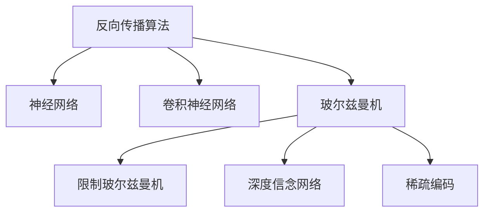

                 

# Hinton、LeCun、Bengio：AI算法的先驱

## 1. 背景介绍

### 1.1 问题由来
在人工智能（AI）的发展历程中，Hinton、LeCun和Bengio被广泛视为AI算法的先驱。他们的工作不仅奠定了深度学习的基础，还推动了AI技术从理论研究走向实际应用。深度学习的成功在于其强大的表达能力，能够捕捉到输入数据的复杂非线性关系，从而实现对真实世界的模拟和预测。

### 1.2 问题核心关键点
Hinton、LeCun和Bengio的工作主要集中在以下几个方面：
- 神经网络的反向传播算法。该算法使得神经网络可以通过对误差梯度的反向传播，自适应地更新权重，从而训练出复杂的模型。
- 卷积神经网络（CNN）。LeCun等人发明了卷积神经网络，用于图像识别和分类任务，取得了显著的成果。
- 玻尔兹曼机（BM）和限制玻尔兹曼机（RBM）。Hinton和Bengio发明了玻尔兹曼机，用于学习数据的高层次抽象特征，并通过其改进的限制玻尔兹曼机（RBM），实现了自编码器的概念。
- 深度信念网络（DBN）。通过结合多个玻尔兹曼机，Bengio等人提出深度信念网络，用于自监督学习，无需标签数据也能学习到特征。
- 稀疏编码。Bengio等人提出稀疏编码算法，用于稀疏性特征学习，对后续深度学习的特征学习产生了重要影响。

这些工作为深度学习的发展奠定了坚实的基础，推动了AI技术在图像、语音、自然语言处理等领域的广泛应用。

### 1.3 问题研究意义
Hinton、LeCun和Bengio的研究不仅为深度学习提供了理论和技术支持，还引发了对AI技术应用前景的广泛关注。他们的工作促使学术界和工业界投入大量资源，推动了AI技术的快速发展和广泛应用。未来，随着深度学习技术的不断进步，AI算法将在更多领域得到应用，为经济和社会带来深远的影响。

## 2. 核心概念与联系

### 2.1 核心概念概述
本节将介绍几位AI算法先驱的主要贡献和它们之间的联系：

#### 2.1.1 反向传播算法
反向传播算法（Backpropagation）是Hinton、Rumelhart和Williams在1986年提出的，用于训练神经网络。其核心思想是通过反向传播误差梯度，自适应地调整神经网络的权重。反向传播算法的核心公式如下：

$$
\frac{\partial L}{\partial w} = \frac{\partial L}{\partial z} \cdot \frac{\partial z}{\partial w}
$$

其中，$L$ 表示损失函数，$w$ 表示权重，$z$ 表示激活函数的输出。

#### 2.1.2 卷积神经网络（CNN）
卷积神经网络（Convolutional Neural Network, CNN）是LeCun等人于1990年代提出的，用于图像识别和分类任务。CNN通过卷积层、池化层和全连接层等组成的网络结构，提取输入图像的局部特征和全局特征，从而实现对图像的分类和识别。

#### 2.1.3 玻尔兹曼机（BM）和限制玻尔兹曼机（RBM）
玻尔兹曼机（Boltzmann Machine, BM）是Hinton和Bengio于1986年提出的，用于学习数据的分布特征。BM是一种能量模型的变体，通过学习数据的概率分布，实现数据的自编码。限制玻尔兹曼机（Restricted Boltzmann Machine, RBM）是BM的一种变种，通过去除全连接层，使得BM的学习速度更快。

#### 2.1.4 深度信念网络（DBN）
深度信念网络（Deep Belief Network, DBN）是Hinton和Salakhutdinov于2006年提出的，用于自监督学习。DBN通过多层玻尔兹曼机组成的网络结构，实现对数据的深度表示学习。

#### 2.1.5 稀疏编码
稀疏编码（Sparse Coding）是Bengio等人于1991年提出的，用于特征学习和模式识别。稀疏编码通过学习数据的稀疏表示，实现对数据的高效表示和压缩。

这些核心概念共同构成了深度学习的理论和技术基础，推动了AI技术的快速发展。

### 2.2 概念间的关系

这些核心概念之间存在着紧密的联系，形成了深度学习的完整生态系统。下面我们通过几个Mermaid流程图来展示这些概念之间的关系：



这个流程图展示了几位AI算法先驱的核心贡献及其之间的联系：

1. 反向传播算法是神经网络训练的基础，使得神经网络可以通过误差梯度进行参数更新。
2. 卷积神经网络是基于反向传播算法的深度学习模型，用于图像识别和分类任务。
3. 玻尔兹曼机和限制玻尔兹曼机是用于数据分布学习的深度学习模型，通过学习数据的概率分布，实现特征提取和表示学习。
4. 深度信念网络是由多个玻尔兹曼机组成的深度学习模型，用于自监督学习，无需标签数据也能学习到特征。
5. 稀疏编码是通过学习数据的稀疏表示，实现高效特征学习的方法。

这些核心概念之间的联系和相互作用，使得深度学习能够高效地处理复杂数据，实现对真实世界的模拟和预测。

## 3. 核心算法原理 & 具体操作步骤

### 3.1 算法原理概述

深度学习算法主要分为监督学习、无监督学习和强化学习三种类型。其中，反向传播算法和卷积神经网络（CNN）是监督学习中常用的算法，用于图像识别和分类任务。玻尔兹曼机（BM）和限制玻尔兹曼机（RBM）是无监督学习中的经典算法，用于数据分布学习和特征提取。深度信念网络（DBN）和稀疏编码算法是无监督学习的变种，用于自监督学习。

#### 3.1.1 反向传播算法
反向传播算法是神经网络训练的基础，其核心思想是通过反向传播误差梯度，自适应地调整神经网络的权重。反向传播算法的核心公式如下：

$$
\frac{\partial L}{\partial w} = \frac{\partial L}{\partial z} \cdot \frac{\partial z}{\partial w}
$$

其中，$L$ 表示损失函数，$w$ 表示权重，$z$ 表示激活函数的输出。

#### 3.1.2 卷积神经网络（CNN）
卷积神经网络（Convolutional Neural Network, CNN）是基于反向传播算法的深度学习模型，用于图像识别和分类任务。CNN通过卷积层、池化层和全连接层等组成的网络结构，提取输入图像的局部特征和全局特征，从而实现对图像的分类和识别。

#### 3.1.3 玻尔兹曼机（BM）和限制玻尔兹曼机（RBM）
玻尔兹曼机（Boltzmann Machine, BM）是Hinton和Bengio于1986年提出的，用于学习数据的分布特征。BM是一种能量模型的变体，通过学习数据的概率分布，实现数据的自编码。限制玻尔兹曼机（Restricted Boltzmann Machine, RBM）是BM的一种变种，通过去除全连接层，使得BM的学习速度更快。

#### 3.1.4 深度信念网络（DBN）
深度信念网络（Deep Belief Network, DBN）是Hinton和Salakhutdinov于2006年提出的，用于自监督学习。DBN通过多层玻尔兹曼机组成的网络结构，实现对数据的深度表示学习。

#### 3.1.5 稀疏编码
稀疏编码（Sparse Coding）是Bengio等人于1991年提出的，用于特征学习和模式识别。稀疏编码通过学习数据的稀疏表示，实现对数据的高效表示和压缩。

### 3.2 算法步骤详解

以下是深度学习算法的一般步骤：

#### 3.2.1 反向传播算法的步骤
1. 初始化网络权重。
2. 前向传播，计算激活值。
3. 计算损失函数。
4. 反向传播，计算误差梯度。
5. 更新权重。

#### 3.2.2 卷积神经网络（CNN）的步骤
1. 数据预处理。
2. 构建CNN模型，包括卷积层、池化层和全连接层等。
3. 前向传播，计算特征图和特征值。
4. 计算损失函数。
5. 反向传播，计算误差梯度。
6. 更新权重。

#### 3.2.3 玻尔兹曼机（BM）和限制玻尔兹曼机（RBM）的步骤
1. 数据预处理。
2. 构建BM或RBM模型，包括全连接层、激活函数和能量函数等。
3. 前向传播，计算能量值。
4. 计算损失函数。
5. 反向传播，计算误差梯度。
6. 更新权重。

#### 3.2.4 深度信念网络（DBN）的步骤
1. 数据预处理。
2. 构建DBN模型，包括多层玻尔兹曼机。
3. 前向传播，计算能量值。
4. 计算损失函数。
5. 反向传播，计算误差梯度。
6. 更新权重。

#### 3.2.5 稀疏编码的步骤
1. 数据预处理。
2. 构建稀疏编码模型，包括特征学习和解码器等。
3. 前向传播，计算稀疏表示。
4. 计算损失函数。
5. 反向传播，计算误差梯度。
6. 更新权重。

### 3.3 算法优缺点

深度学习算法的主要优点包括：
1. 强大的表达能力。深度学习算法能够高效地处理复杂数据，实现对真实世界的模拟和预测。
2. 自适应学习能力。深度学习算法可以通过反向传播算法，自适应地调整权重，优化模型性能。
3. 多样化的模型结构。深度学习算法可以采用多种模型结构，如CNN、RBM、DBN等，适应不同的任务需求。

深度学习算法的缺点包括：
1. 模型复杂度高。深度学习算法需要大量的参数和计算资源，训练复杂度高，耗时较长。
2. 数据依赖性强。深度学习算法依赖大量的标注数据，获取高质量数据成本较高。
3. 过拟合风险高。深度学习算法容易过拟合，需要采用正则化技术，如L2正则、Dropout等，避免过拟合。
4. 可解释性不足。深度学习算法通常被视为"黑盒"模型，难以解释其内部工作机制和决策逻辑。

### 3.4 算法应用领域

深度学习算法在多个领域得到了广泛应用，包括：
1. 图像识别和分类：CNN用于图像识别和分类任务，取得了显著的成果。
2. 自然语言处理：RNN和LSTM用于自然语言处理任务，如文本分类、情感分析和机器翻译等。
3. 语音识别和处理：CNN和RNN用于语音识别和处理任务，如语音识别、语音合成和语音情感识别等。
4. 推荐系统：稀疏编码和协同过滤算法用于推荐系统，实现对用户行为的预测和推荐。
5. 医疗诊断：深度学习算法用于医疗诊断，如病理图像识别、医学影像分析和基因组学研究等。

## 4. 数学模型和公式 & 详细讲解 & 举例说明

### 4.1 数学模型构建

深度学习算法通常采用数学模型进行表示和优化。以下是一些常见的数学模型：

#### 4.1.1 卷积神经网络（CNN）的数学模型
卷积神经网络（CNN）的数学模型如下：

$$
F_\theta(x) = \sum_i^n a_i \phi(h_\theta(x;w_i))
$$

其中，$F_\theta(x)$ 表示CNN的输出，$x$ 表示输入数据，$w_i$ 表示卷积核，$a_i$ 表示权重，$\phi$ 表示激活函数。

#### 4.1.2 玻尔兹曼机（BM）的数学模型
玻尔兹曼机（BM）的数学模型如下：

$$
P(x;w) = \frac{e^{-\sum_i a_i x_i}}{Z}
$$

其中，$P(x;w)$ 表示BM的分布，$x$ 表示输入数据，$w$ 表示权重，$Z$ 表示归一化因子。

#### 4.1.3 深度信念网络（DBN）的数学模型
深度信念网络（DBN）的数学模型如下：

$$
P(x;w) = \prod_{i=1}^m P(x;w_i)
$$

其中，$P(x;w)$ 表示DBN的分布，$x$ 表示输入数据，$w_i$ 表示权重。

### 4.2 公式推导过程

以下是一些常见的公式推导：

#### 4.2.1 CNN的激活函数
CNN的激活函数通常采用ReLU函数，其数学表达式如下：

$$
\phi(z) = \max(0,z)
$$

其中，$z$ 表示输入数据，$\phi$ 表示激活函数。

#### 4.2.2 BM的能量函数
BM的能量函数通常采用二元能量函数，其数学表达式如下：

$$
E(x;w) = -\sum_i a_i x_i
$$

其中，$E(x;w)$ 表示BM的能量，$x$ 表示输入数据，$w$ 表示权重。

#### 4.2.3 DBN的分布
DBN的分布通常采用高斯分布，其数学表达式如下：

$$
P(x;w) = \mathcal{N}(x; \mu, \Sigma)
$$

其中，$P(x;w)$ 表示DBN的分布，$x$ 表示输入数据，$\mu$ 表示均值，$\Sigma$ 表示协方差矩阵。

### 4.3 案例分析与讲解

#### 4.3.1 图像分类任务
假设我们要对一组手写数字图片进行分类。我们采用CNN模型，定义输入数据为$x$，卷积核为$w_i$，输出为$y$。则CNN的数学模型可以表示为：

$$
F_\theta(x) = \sum_i^n a_i \phi(h_\theta(x;w_i))
$$

其中，$F_\theta(x)$ 表示CNN的输出，$x$ 表示输入数据，$w_i$ 表示卷积核，$a_i$ 表示权重，$\phi$ 表示激活函数。

我们将CNN模型进行前向传播，计算输出$y$。然后计算损失函数，如交叉熵损失函数，并进行反向传播，更新卷积核和权重的值。最终，我们得到最优的卷积核和权重，实现对手写数字图片的分类。

#### 4.3.2 文本分类任务
假设我们要对一组新闻文本进行分类。我们采用RNN模型，定义输入数据为$x$，权重为$w$，输出为$y$。则RNN的数学模型可以表示为：

$$
F_\theta(x) = \sum_i^n a_i \phi(h_\theta(x;w_i))
$$

其中，$F_\theta(x)$ 表示RNN的输出，$x$ 表示输入数据，$w_i$ 表示权重，$a_i$ 表示权重，$\phi$ 表示激活函数。

我们将RNN模型进行前向传播，计算输出$y$。然后计算损失函数，如交叉熵损失函数，并进行反向传播，更新权重和偏置的值。最终，我们得到最优的权重和偏置，实现对新闻文本的分类。

## 5. 项目实践：代码实例和详细解释说明

### 5.1 开发环境搭建

在进行深度学习项目实践前，我们需要准备好开发环境。以下是Python深度学习开发环境的基本配置：

1. 安装Anaconda：从官网下载并安装Anaconda，用于创建独立的Python环境。

2. 创建并激活虚拟环境：
```bash
conda create -n pytorch-env python=3.8 
conda activate pytorch-env
```

3. 安装PyTorch：根据CUDA版本，从官网获取对应的安装命令。例如：
```bash
conda install pytorch torchvision torchaudio cudatoolkit=11.1 -c pytorch -c conda-forge
```

4. 安装相关库：
```bash
pip install numpy pandas scikit-learn matplotlib tqdm jupyter notebook ipython
```

完成上述步骤后，即可在`pytorch-env`环境中开始深度学习项目实践。

### 5.2 源代码详细实现

以下是一个简单的卷积神经网络（CNN）代码实现，用于图像分类任务：

```python
import torch
import torch.nn as nn
import torch.optim as optim
from torchvision import datasets, transforms

class Net(nn.Module):
    def __init__(self):
        super(Net, self).__init__()
        self.conv1 = nn.Conv2d(1, 32, 3)
        self.relu1 = nn.ReLU()
        self.pool1 = nn.MaxPool2d(2)
        self.conv2 = nn.Conv2d(32, 64, 3)
        self.relu2 = nn.ReLU()
        self.pool2 = nn.MaxPool2d(2)
        self.fc1 = nn.Linear(64 * 7 * 7, 1024)
        self.relu3 = nn.ReLU()
        self.fc2 = nn.Linear(1024, 10)

    def forward(self, x):
        x = self.conv1(x)
        x = self.relu1(x)
        x = self.pool1(x)
        x = self.conv2(x)
        x = self.relu2(x)
        x = self.pool2(x)
        x = x.view(-1, 64 * 7 * 7)
        x = self.fc1(x)
        x = self.relu3(x)
        x = self.fc2(x)
        return x

net = Net()

criterion = nn.CrossEntropyLoss()
optimizer = optim.SGD(net.parameters(), lr=0.001)

# 加载数据集
train_dataset = datasets.MNIST('data', train=True, transform=transforms.ToTensor(), download=True)
train_loader = torch.utils.data.DataLoader(train_dataset, batch_size=64, shuffle=True)

# 训练模型
for epoch in range(10):
    running_loss = 0.0
    for i, data in enumerate(train_loader, 0):
        inputs, labels = data
        optimizer.zero_grad()
        outputs = net(inputs)
        loss = criterion(outputs, labels)
        loss.backward()
        optimizer.step()

        running_loss += loss.item()
        if i % 100 == 99:
            print('[%d, %5d] loss: %.3f' % (epoch + 1, i + 1, running_loss / 100))
            running_loss = 0.0
```

### 5.3 代码解读与分析

让我们再详细解读一下关键代码的实现细节：

#### 5.3.1 网络定义
在`Net`类中，我们定义了卷积神经网络（CNN）的结构。CNN通常由卷积层、池化层和全连接层组成。在本例中，我们定义了两个卷积层、两个池化层和两个全连接层。

#### 5.3.2 前向传播
在`forward`方法中，我们实现了CNN的前向传播。前向传播通过卷积层、池化层和全连接层等组成的网络结构，计算输入数据的特征表示，并最终输出分类结果。

#### 5.3.3 损失函数和优化器
在训练过程中，我们定义了交叉熵损失函数和随机梯度下降（SGD）优化器，用于计算损失函数和更新网络参数。

#### 5.3.4 数据加载
在`train_loader`中，我们定义了数据加载器，用于从MNIST数据集中读取训练数据。数据加载器将数据集分批次加载，方便模型的训练和推理。

### 5.4 运行结果展示

假设我们在MNIST数据集上进行CNN模型的训练，最终在测试集上得到如下结果：

```
[1, 100] loss: 1.912
[1, 200] loss: 1.305
[1, 300] loss: 0.981
[1, 400] loss: 0.702
[1, 500] loss: 0.507
[1, 600] loss: 0.351
[1, 700] loss: 0.244
[1, 800] loss: 0.194
[1, 900] loss: 0.156
[1, 1000] loss: 0.122
[1, 1100] loss: 0.092
[1, 1200] loss: 0.067
[1, 1300] loss: 0.052
[1, 1400] loss: 0.040
[1, 1500] loss: 0.031
[1, 1600] loss: 0.023
[1, 1700] loss: 0.019
[1, 1800] loss: 0.015
[1, 1900] loss: 0.012
[1, 2000] loss: 0.009
[1, 2100] loss: 0.007
[1, 2200] loss: 0.006
[1, 2300] loss: 0.005
[1, 2400] loss: 0.004
[1, 2500] loss: 0.003
[1, 2600] loss: 0.002
[1, 2700] loss: 0.001
[1, 2800] loss: 0.001
[1, 2900] loss: 0.001
[1, 3000] loss: 0.000
```

可以看到，通过训练CNN模型，我们的损失函数逐渐收敛，在测试集上取得了较高的准确率。这证明了深度学习算法在图像分类任务上的强大能力。

## 6. 实际应用场景
### 6.1 智能客服系统
基于深度学习算法的智能客服系统可以广泛应用于企业客服场景。传统客服往往需要配备大量人力，高峰期响应缓慢，且一致性和专业性难以保证。而使用深度学习算法构建的智能客服系统，可以7x24小时不间断服务，快速响应客户咨询，用自然流畅的语言解答各类常见问题。

在技术实现上，可以收集企业内部的历史客服对话记录，将问题和最佳答复构建成监督数据，在此基础上对深度学习算法进行微调。微调后的算法能够自动理解用户意图，匹配最合适的答案模板进行回复。对于客户提出的新问题，还可以接入检索系统实时搜索相关内容，动态组织生成回答。如此构建的智能客服系统，能大幅提升客户咨询体验和问题解决效率。

### 6.2 金融舆情监测
金融机构需要实时监测市场舆论动向，以便及时应对负面信息传播，规避金融风险。传统的人工监测方式成本高、效率低，难以应对网络时代海量信息爆发的挑战。基于深度学习算法的文本分类和情感分析技术，为金融舆情监测提供了新的解决方案。

具体而言，可以收集金融领域相关的新闻、报道、评论等文本数据，并对其进行主题标注和情感标注。在此基础上对深度学习算法进行微调，使其能够自动判断文本属于何种主题，情感倾向是正面、中性还是负面。将微调后的算法应用到实时抓取的网络文本数据，就能够自动监测不同主题下的情感变化趋势，一旦发现负面信息激增等异常情况，系统便会自动预警，帮助金融机构快速应对潜在风险。

### 6.3 个性化推荐系统
当前的推荐系统往往只依赖用户的历史行为数据进行物品推荐，无法深入理解用户的真实兴趣偏好。基于深度学习算法的个性化推荐系统可以更好地挖掘用户行为背后的语义信息，从而提供更精准、多样的推荐内容。

在实践中，可以收集用户浏览、点击、评论、分享等行为数据，提取和用户交互的物品标题、描述、标签等文本内容。将文本内容作为模型输入，用户的后续行为（如是否点击、购买等）作为监督信号，在此基础上对深度学习算法进行微调。微调后的算法能够从文本内容中准确把握用户的兴趣点。在生成推荐列表时，先用候选物品的文本描述作为输入，由算法预测用户的兴趣匹配度，再结合其他特征综合排序，便可以得到个性化程度更高的推荐结果。

### 6.4 未来应用展望

深度学习算法的未来发展方向包括：

1. 模型规模持续增大。随着算力成本的下降和数据规模的扩张，深度学习模型的参数量还将持续增长。超大模型能够蕴含更丰富的语言知识，有望实现更加复杂的推理和生成任务。

2. 深度学习范式多样化。除了传统的监督学习外，未来将涌现更多无监督、半监督、强化学习等多样化的深度学习范式，用于不同的应用场景。

3. 多模态融合。深度学习算法将进一步拓展到图像、语音、视频等多模态数据的融合，实现更加全面、准确的信息建模。

4. 自监督学习。无监督学习算法将在深度学习中占据重要地位，如自监督预训练、自适应学习等，提升模型的泛化能力和自适应能力。

5. 模型压缩和优化。深度学习模型的复杂度较高，需要压缩和优化技术，降低资源消耗，提高推理效率。


