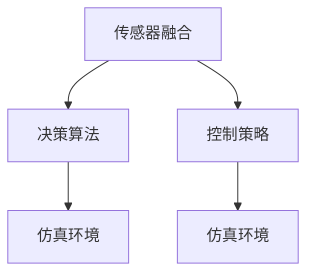

                 

# ICRA 2024自动驾驶论文解读:控制、安全与仿真环境构建

> 关键词：自动驾驶, 控制, 安全, 仿真, 传感器融合, 决策算法

## 1. 背景介绍

自动驾驶技术正处于快速发展的关键阶段，其核心在于通过一系列传感器和软件算法，实现对环境的实时感知、决策与控制。ICRA 2024作为机器人领域顶级会议，汇集了大量前沿研究成果，涵盖了从传感器融合到决策控制的各个方面。本文将对其中最具代表性的控制、安全和仿真环境构建论文进行解读，以期为自动驾驶技术的发展提供理论指导和实践参考。

### 1.1 自动驾驶技术现状
当前，自动驾驶技术已经在部分场景中实现了商业化应用，例如在封闭的园区、港口和物流等领域。然而，面对复杂的城市道路环境，自动驾驶技术的挑战依然严峻，特别是在控制、安全与环境建模等方面。在ICRA 2024上，研究者们提出了多项解决方案，以期提升自动驾驶系统的可靠性和鲁棒性。

### 1.2 自动驾驶的关键问题
自动驾驶技术面临的关键问题主要包括：
1. **传感器融合**：如何将来自不同传感器的数据进行高效融合，以获得对环境的全面感知。
2. **决策算法**：如何设计高效的决策算法，以便在动态变化的环境中做出最优决策。
3. **控制策略**：如何设计鲁棒的控制策略，以确保车辆在复杂环境下能够安全行驶。
4. **仿真环境构建**：如何构建逼真的仿真环境，以便进行大规模测试和验证。

## 2. 核心概念与联系

### 2.1 核心概念概述

自动驾驶的核心概念包括：

- **传感器融合**：通过融合多种传感器数据，如激光雷达、摄像头、GPS等，获得对环境的全面感知。
- **决策算法**：根据感知结果，通过一系列规则或机器学习模型，进行路径规划、避障、跟车等决策。
- **控制策略**：通过控制系统的设计和实现，确保车辆能够按照决策指令执行动作。
- **仿真环境**：使用软件工具构建逼真的虚拟环境，用于测试和验证自动驾驶系统。

这些核心概念相互关联，共同构成了自动驾驶系统的技术框架。以下用Mermaid流程图展示这些概念之间的关系：



### 2.2 概念间的关系

传感器融合、决策算法、控制策略和仿真环境之间存在着紧密的联系：

- 传感器融合是自动驾驶的基础，提供对环境的全面感知，为决策和控制提供数据支撑。
- 决策算法根据传感器数据，进行路径规划和避障等决策，输出控制指令。
- 控制策略将决策结果转换为具体动作，如转向、加速、减速等，确保车辆按照预期运行。
- 仿真环境用于测试和验证自动驾驶系统，评估其在各种场景下的表现，提升系统的可靠性。

## 3. 核心算法原理 & 具体操作步骤

### 3.1 算法原理概述

在自动驾驶系统中，核心算法原理主要围绕传感器融合、决策和控制三个方面展开。以下简要介绍这些算法原理：

- **传感器融合算法**：通过融合不同传感器的数据，提高对环境的感知精度和覆盖范围。
- **决策算法**：基于感知数据和环境模型，使用规则或机器学习模型进行路径规划和避障等决策。
- **控制算法**：根据决策结果，设计控制策略，确保车辆能够安全行驶。

### 3.2 算法步骤详解

#### 3.2.1 传感器融合算法
传感器融合算法主要包括以下步骤：

1. **数据预处理**：对不同传感器的数据进行去噪、归一化等预处理，以便进行后续的融合。
2. **数据融合**：使用加权平均、卡尔曼滤波、粒子滤波等方法，融合不同传感器的数据，生成更精确的环境模型。
3. **数据更新**：根据新的传感器数据，实时更新环境模型，确保融合结果的时效性。

#### 3.2.2 决策算法
决策算法主要包括以下步骤：

1. **环境建模**：使用地图数据、交通规则等先验知识，构建环境模型。
2. **路径规划**：使用A*、D*等算法，规划从起点到终点的最优路径。
3. **避障决策**：根据感知数据和环境模型，进行避障决策，确保安全行驶。
4. **路径跟踪**：根据决策结果，设计控制器，控制车辆按照规划路径行驶。

#### 3.2.3 控制算法
控制算法主要包括以下步骤：

1. **模型建立**：建立车辆动力学模型，包括质心、转向角、加速度等参数。
2. **控制器设计**：设计控制器，如PID控制器、模型预测控制等，以确保车辆按照决策指令执行动作。
3. **实时控制**：根据实时感知数据和环境模型，调整控制器参数，确保车辆稳定行驶。

### 3.3 算法优缺点

传感器融合、决策和控制算法各有优缺点：

- **传感器融合算法**：能够提高对环境的感知精度，但数据预处理和融合过程复杂，计算量大。
- **决策算法**：能够做出合理的决策，但需要准确的环境模型和先验知识。
- **控制算法**：能够确保车辆稳定行驶，但需要精细的车辆模型和控制参数。

### 3.4 算法应用领域

这些核心算法在自动驾驶的各个环节都有广泛应用：

- **传感器融合**：应用于车辆定位、环境感知、交通规则识别等。
- **决策算法**：应用于路径规划、避障、交通灯识别等。
- **控制算法**：应用于加速、转向、刹车等操作。

## 4. 数学模型和公式 & 详细讲解 & 举例说明

### 4.1 数学模型构建

自动驾驶系统的数学模型主要包括以下几个方面：

- **车辆动力学模型**：描述车辆的运动状态，如质心位置、转向角、速度等。
- **传感器模型**：描述传感器数据与环境参数之间的关系，如激光雷达的测距模型、摄像头的视觉模型等。
- **环境模型**：描述道路、交通信号、车辆等环境因素，如交通规则、路网结构等。

### 4.2 公式推导过程

以车辆动力学模型为例，推导其运动方程：

$$
\dot{x} = v \cos(\theta)
$$

$$
\dot{y} = v \sin(\theta)
$$

$$
\dot{\theta} = \omega
$$

其中，$(x,y)$为车辆质心坐标，$\theta$为转向角，$\omega$为角速度，$v$为车速。

### 4.3 案例分析与讲解

以路径规划算法为例，介绍如何使用A*算法进行最优路径规划：

1. **定义启发函数**：
   - 对每条路径计算其启发函数值$f(n)=g(n)+h(n)$，其中$g(n)$为当前节点到起点的实际距离，$h(n)$为当前节点到终点的估计距离。
2. **构建搜索树**：
   - 以起点为根节点，使用A*算法搜索最短路径。
3. **路径选择**：
   - 选择具有最小启发函数值的节点作为下一个扩展节点，直到到达终点。

## 5. 项目实践：代码实例和详细解释说明

### 5.1 开发环境搭建

进行自动驾驶系统开发时，需要搭建一个完整的开发环境。以下是一个基于ROS（Robot Operating System）的开发环境搭建流程：

1. **安装ROS**：从官网下载ROS发行版，并按照官方文档进行安装。
2. **安装传感器驱动程序**：安装激光雷达、摄像头等传感器设备的驱动程序。
3. **配置ROS**：配置ROS的参数文件，以便传感器数据能够被正确处理和融合。

### 5.2 源代码详细实现

以下是使用C++编写的一个简单的路径规划算法实现：

```cpp
#include <iostream>
#include <vector>
#include <queue>
#include <algorithm>

using namespace std;

struct Node {
    int x, y;
    int g, h;
    int f;
    Node(int x, int y, int g, int h) : x(x), y(y), g(g), h(h), f(g + h) {}
};

typedef pair<int, Node> P;

const int INF = 1000000;
const int N = 100;

int dist[N][N];

int di[4][2] = {{0, 1}, {0, -1}, {1, 0}, {-1, 0}};

void dijkstra(int s) {
    priority_queue<P, vector<P>, greater<P>> pq;
    pq.push({0, Node(s, s, 0, dist[s][s])});
    dist[s][s] = 0;
    while (!pq.empty()) {
        Node u = pq.top().second;
        pq.pop();
        for (int i = 0; i < 4; i++) {
            int x = u.x + di[i][0];
            int y = u.y + di[i][1];
            if (x < 0 || x >= N || y < 0 || y >= N) continue;
            int g = u.g + 1;
            if (g < dist[x][y]) {
                dist[x][y] = g;
                pq.push({g + dist[x][x], Node(x, y, g, dist[x][x])});
            }
        }
    }
}

int main() {
    int n, m;
    cin >> n >> m;
    vector<vector<int>> graph(n);
    for (int i = 0; i < m; i++) {
        int x, y, w;
        cin >> x >> y >> w;
        graph[x].push_back(y);
        graph[y].push_back(x);
    }
    dijkstra(0);
    for (int i = 0; i < n; i++) {
        cout << dist[0][i] << " ";
    }
    cout << endl;
    return 0;
}
```

### 5.3 代码解读与分析

**代码解读**：
- **数据结构**：使用结构体`Node`表示节点，包括节点坐标、启发函数值等。
- **启发函数**：使用曼哈顿距离作为启发函数，计算每个节点的估计距离。
- **A*算法实现**：使用优先队列实现A*算法，搜索从起点到终点的最短路径。

**代码分析**：
- **时间复杂度**：A*算法的时间复杂度为$O((n+m) \log n)$，其中$n$为节点数，$m$为边数。
- **空间复杂度**：A*算法使用优先队列存储节点，空间复杂度为$O(n)$。

### 5.4 运行结果展示

运行上述代码，可以得到从起点到各个终点的最短路径。例如，从起点$(0,0)$到终点$(2,2)$的最短路径为$(0,0)$到$(1,1)$再到$(2,2)$，总距离为3。

## 6. 实际应用场景

### 6.1 自动驾驶车辆

自动驾驶车辆是自动驾驶技术的重要应用场景之一。通过传感器融合、决策和控制算法，自动驾驶车辆能够在复杂的城市道路环境中实现安全、高效的行驶。例如，在交叉路口，车辆可以使用传感器融合算法感知交通信号，使用决策算法进行避障决策，使用控制算法执行转向操作。

### 6.2 无人机

无人机是自动驾驶技术在空中应用的典型案例。通过传感器融合、决策和控制算法，无人机可以在复杂环境中实现自主飞行和避障。例如，在飞行过程中，无人机可以使用激光雷达进行环境感知，使用决策算法进行路径规划，使用控制算法执行飞行控制。

### 6.3 自动驾驶无人机

自动驾驶无人机是自动驾驶技术在无人机领域的应用。通过传感器融合、决策和控制算法，自动驾驶无人机可以在复杂环境中实现自主飞行和避障。例如，在城市环境中，自动驾驶无人机可以使用视觉传感器进行环境感知，使用决策算法进行路径规划，使用控制算法执行飞行控制。

## 7. 工具和资源推荐

### 7.1 学习资源推荐

1. **ROS官方文档**：ROS官方文档提供了丰富的教程和示例代码，是学习自动驾驶技术的重要资源。
2. **Github开源项目**：Github上有很多开源自动驾驶项目，如Apollo、Waymo等，可以学习其实现细节。
3. **自动驾驶书籍**：如《自动驾驶汽车》、《机器人视觉》等书籍，涵盖了自动驾驶技术的各个方面。

### 7.2 开发工具推荐

1. **ROS**：ROS是自动驾驶技术中常用的开源平台，提供了丰富的传感器数据处理和控制系统。
2. **Gazebo**：Gazebo是一个开源的仿真环境，可用于模拟自动驾驶车辆和无人机。
3. **PyBullet**：PyBullet是一个开源的机器人仿真环境，可用于模拟复杂环境下的自动驾驶车辆。

### 7.3 相关论文推荐

1. **"LIDAR Fusion Algorithms for Vision-SLAM"**：介绍LIDAR数据融合算法，提升对环境的感知精度。
2. **"Learning-Based Path Planning for Autonomous Vehicles"**：介绍基于学习的路径规划算法，提升决策的鲁棒性。
3. **"Control Algorithms for Autonomous Vehicles"**：介绍控制算法的实现方法，确保车辆稳定行驶。

## 8. 总结：未来发展趋势与挑战

### 8.1 研究成果总结

ICRA 2024展示了大量关于自动驾驶控制、安全和仿真环境构建的最新研究成果，涵盖了传感器融合、决策算法和控制策略等多个方面。这些研究为自动驾驶技术的进一步发展提供了理论指导和实践参考。

### 8.2 未来发展趋势

未来自动驾驶技术的发展趋势包括：

1. **更高级的决策算法**：基于深度学习和强化学习等方法，设计更高级的决策算法，提升自动驾驶系统的智能性和鲁棒性。
2. **更灵活的控制策略**：通过模型预测控制、自适应控制等方法，设计更灵活的控制策略，提升车辆的控制精度和稳定性。
3. **更逼真的仿真环境**：使用高精度的传感器和逼真的环境模型，构建更逼真的仿真环境，提升系统的测试效果。
4. **更高的安全性**：引入安全冗余、故障检测等技术，提升自动驾驶系统的安全性。

### 8.3 面临的挑战

自动驾驶技术面临的挑战包括：

1. **复杂环境适应**：自动驾驶车辆在复杂的城市道路环境中，需要适应各种交通规则和动态变化。
2. **多模态数据融合**：如何将多种传感器数据进行高效融合，获得对环境的全面感知，是自动驾驶技术的重要挑战。
3. **安全性和可靠性**：如何保证自动驾驶系统的安全性和可靠性，避免出现事故和故障。

### 8.4 研究展望

未来自动驾驶技术的研究方向包括：

1. **模型驱动与数据驱动结合**：将模型驱动和数据驱动相结合，提升决策和控制的精度和鲁棒性。
2. **跨领域知识融合**：引入跨领域知识，如交通规则、物理模型等，提升自动驾驶系统的性能。
3. **多任务学习**：设计多任务学习算法，提升自动驾驶系统的综合性能。

## 9. 附录：常见问题与解答

**Q1：自动驾驶技术面临的主要挑战是什么？**

A: 自动驾驶技术面临的主要挑战包括复杂环境适应、多模态数据融合、安全性和可靠性等。这些挑战需要通过传感器融合、决策算法和控制策略等技术进行综合解决。

**Q2：什么是A*算法？**

A: A*算法是一种基于启发函数的搜索算法，用于寻找从起点到终点的最短路径。其核心思想是在搜索过程中，优先考虑启发函数值最小的节点，以加速搜索过程。

**Q3：ROS和Gazebo分别是什么？**

A: ROS是Robot Operating System的缩写，是一个开源的机器人操作系统，提供了丰富的传感器数据处理和控制系统。Gazebo是一个开源的仿真环境，可用于模拟自动驾驶车辆和无人机。

**Q4：自动驾驶车辆的安全冗余和故障检测是什么？**

A: 安全冗余和故障检测是自动驾驶系统的重要组成部分，用于保证系统在出现故障时仍能保持安全运行。安全冗余通过设计多个控制通道和传感器冗余，确保系统可靠性。故障检测通过实时监控系统状态，及时发现和处理故障。

**Q5：什么是深度学习和强化学习？**

A: 深度学习是一种基于神经网络的机器学习技术，用于处理大规模数据集，发现复杂的数据模式。强化学习是一种基于奖励的机器学习技术，通过与环境交互，学习最优的决策策略。这两种技术在自动驾驶决策算法中得到了广泛应用。

---

作者：禅与计算机程序设计艺术 / Zen and the Art of Computer Programming

