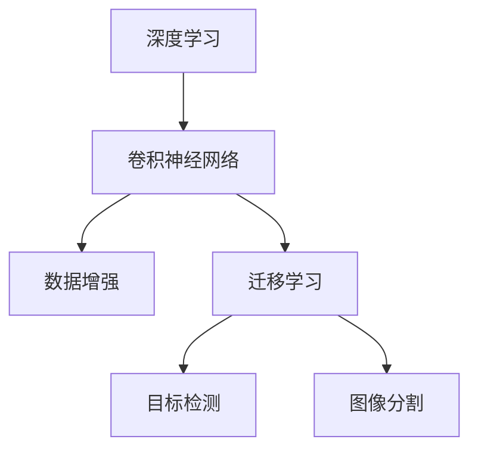
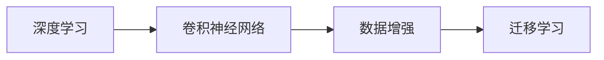
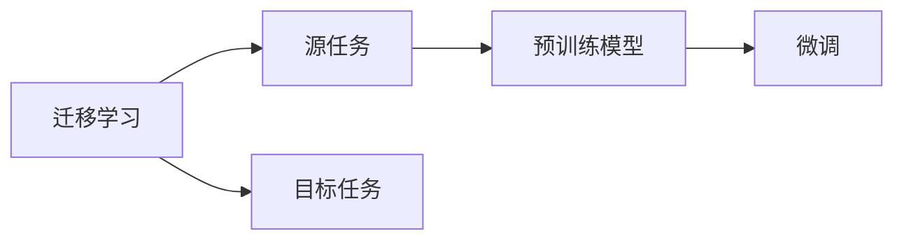
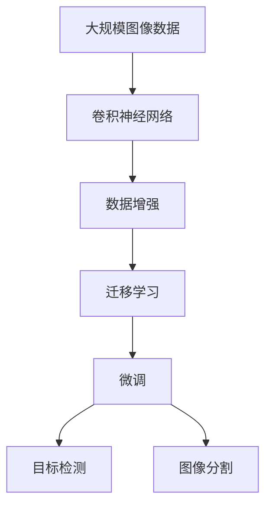

                 

# ImageNet与人工智能的学习

## 1. 背景介绍

### 1.1 问题由来
人工智能(AI)正迅速渗透到各个行业和领域，从智能客服、医疗诊断到自动驾驶，AI技术的广泛应用正在重塑人类社会的未来。在AI的众多分支中，计算机视觉（Computer Vision）无疑是当下最活跃、最具潜力的领域之一。ImageNet作为计算机视觉领域的重要数据集，不仅为研究人员提供了丰富的视觉数据资源，也推动了深度学习在计算机视觉中的广泛应用。本文旨在通过探索ImageNet与人工智能的学习过程，深入理解深度学习在计算机视觉领域的应用原理和前景。

### 1.2 问题核心关键点
ImageNet是一个大型图像数据集，包含了成千上万的图像和标注，被广泛应用于深度学习中的图像分类、目标检测、图像生成等任务。通过ImageNet数据集，研究人员成功地训练出了多个具有广泛影响力的深度学习模型，如AlexNet、VGG、Inception和ResNet等。这些模型在图像识别、物体检测、语义分割等计算机视觉任务中表现优异，成为了后续研究的重要基础。

深度学习在计算机视觉中的应用，主要依赖于特征提取和任务特定的神经网络架构。特征提取过程通常包括卷积层、池化层和全连接层，通过不断提取图像中的局部特征和全局特征，将图像映射为高维特征向量。任务特定的神经网络架构则包括全连接层、softmax层等，用于对高维特征向量进行分类或回归，得到最终的任务输出。

## 2. 核心概念与联系

### 2.1 核心概念概述

为更好地理解深度学习在计算机视觉中的应用，本节将介绍几个密切相关的核心概念：

- 深度学习(Deep Learning)：通过多层次的神经网络结构，学习数据中的复杂非线性关系。在计算机视觉中，深度学习模型能够自动学习图像的层次特征，实现高精度的图像分类和目标检测。

- 卷积神经网络(Convolutional Neural Networks, CNNs)：一种特殊的深度神经网络结构，通过卷积和池化操作，有效提取图像的局部和全局特征。CNNs在图像分类、目标检测、图像生成等任务中表现优异。

- 数据增强(Data Augmentation)：通过对原始数据进行旋转、缩放、裁剪等变换，生成更多的训练数据，以提高模型的泛化能力和鲁棒性。

- 迁移学习(Transfer Learning)：通过在一个领域预训练的模型，迁移到另一个领域进行微调，以提高模型在新领域的表现。ImageNet训练的预训练模型可用于各种计算机视觉任务的微调。

- 目标检测(Object Detection)：识别图像中的多个物体并定位其位置的任务。目标检测算法通过在图像中标注边界框，输出物体的类别和位置信息。

- 图像分割(Image Segmentation)：将图像中的每个像素分配到不同的语义类别中，用于对图像进行细粒度理解。图像分割算法通常使用卷积神经网络和像素级别的预测任务来实现。

这些核心概念之间的逻辑关系可以通过以下Mermaid流程图来展示：



这个流程图展示了大语言模型微调过程中各个核心概念的关系和作用。深度学习提供了一个强大的框架，卷积神经网络在此基础上通过卷积和池化操作提取图像特征，数据增强和迁移学习用于提升模型的泛化能力和鲁棒性，目标检测和图像分割则通过任务特定的神经网络架构，实现对图像的细粒度理解。这些概念共同构成了深度学习在计算机视觉中的核心技术栈。

### 2.2 概念间的关系

这些核心概念之间存在着紧密的联系，形成了深度学习在计算机视觉中的完整生态系统。下面我通过几个Mermaid流程图来展示这些概念之间的关系。

#### 2.2.1 深度学习的学习范式



这个流程图展示了深度学习的基本原理，即通过卷积神经网络提取图像特征，使用数据增强和迁移学习提升模型的泛化能力和鲁棒性。

#### 2.2.2 迁移学习与微调的关系



这个流程图展示了迁移学习的基本原理，以及它与微调的关系。迁移学习涉及源任务和目标任务，预训练模型在源任务上学习，然后通过微调适应各种目标任务。

#### 2.2.3 目标检测和图像分割的联系


这个流程图展示了目标检测和图像分割之间的关系。目标检测和图像分割都是基于图像的像素级别预测任务，可以共享卷积神经网络的特征提取模块，并采用不同的神经网络架构实现不同的任务目标。

### 2.3 核心概念的整体架构

最后，我们用一个综合的流程图来展示这些核心概念在大语言模型微调过程中的整体架构：



这个综合流程图展示了从预训练到微调，再到目标检测和图像分割的完整过程。大规模图像数据通过卷积神经网络提取图像特征，使用数据增强和迁移学习提升模型的泛化能力和鲁棒性，通过微调进一步优化模型在新领域的表现。最后，目标检测和图像分割通过任务特定的神经网络架构，实现对图像的细粒度理解。通过这些流程图，我们可以更清晰地理解深度学习在计算机视觉中的学习过程和各个环节的作用。

## 3. 核心算法原理 & 具体操作步骤
### 3.1 算法原理概述

深度学习在计算机视觉中的应用，主要依赖于卷积神经网络(CNNs)的特征提取和任务特定的神经网络架构。在ImageNet数据集上进行训练时，通常采用监督学习的范式，即在训练集中标注每个图像的类别，并使用交叉熵损失函数进行优化，使得模型能够学习到最佳的分类决策边界。

形式化地，假设训练数据集为 $D=\{(x_i,y_i)\}_{i=1}^N$，其中 $x_i$ 为输入图像，$y_i$ 为图像对应的类别标签。定义模型 $M_{\theta}$ 在输入 $x$ 上的输出为 $\hat{y}=M_{\theta}(x) \in [0,1]$，表示样本属于正类的概率。则交叉熵损失函数定义为：

$$
\ell(M_{\theta}(x),y) = -[y\log \hat{y} + (1-y)\log (1-\hat{y})]
$$

在训练过程中，通过反向传播算法计算梯度，并使用优化算法（如SGD、Adam等）更新模型参数 $\theta$，使得模型在验证集上的表现达到最优。在ImageNet数据集上进行训练时，通常会使用较大的批次大小和较多的训练轮数，以确保模型能够充分学习图像特征和类别之间的关系。

### 3.2 算法步骤详解

深度学习在计算机视觉中的应用通常包括以下几个关键步骤：

**Step 1: 准备数据集**

- 收集大规模图像数据，并进行标注，形成训练集、验证集和测试集。ImageNet数据集是一个典型的例子，包含了数百万张图像和标注。

**Step 2: 设计网络结构**

- 选择合适的卷积神经网络结构，如AlexNet、VGG、Inception、ResNet等。这些网络结构通常在ImageNet数据集上进行预训练，学习到丰富的图像特征。

**Step 3: 进行预训练**

- 使用大规模图像数据集对网络进行预训练。通常使用随机梯度下降等优化算法，训练多个epoch，使得模型能够学习到图像的低级和高级特征。

**Step 4: 进行微调**

- 在特定任务的数据集上进行微调。使用迁移学习技术，将预训练模型迁移到新任务上，使用少量标注数据对模型进行微调，提升其在特定任务上的表现。

**Step 5: 评估与部署**

- 在测试集上评估微调后的模型性能。根据实际应用场景，对模型进行部署和优化，以实现高效的图像分类、目标检测、图像生成等任务。

### 3.3 算法优缺点

深度学习在计算机视觉中的应用具有以下优点：

- 强大的特征提取能力：卷积神经网络能够自动学习图像的层次特征，无需手工提取特征，减少了人工设计的复杂性和误差。
- 泛化能力强：通过数据增强和迁移学习，模型能够适应多种数据分布，具有较强的泛化能力。
- 适用性广：深度学习模型适用于各种计算机视觉任务，如图像分类、目标检测、图像生成等。

同时，深度学习在计算机视觉中也有一些缺点：

- 需要大量标注数据：深度学习模型需要大量标注数据进行训练，标注成本较高。
- 模型复杂度较高：卷积神经网络的参数量较大，训练和推理速度较慢。
- 数据敏感性：模型对训练数据中的噪声和偏差较为敏感，容易产生过拟合。

尽管存在这些缺点，深度学习在计算机视觉中的应用仍然取得了巨大的成功，成为了该领域的主流技术。未来，随着计算资源的进一步提升和算法的不断优化，深度学习在计算机视觉中的应用将更加广泛和深入。

### 3.4 算法应用领域

深度学习在计算机视觉中的应用，已经覆盖了图像分类、目标检测、图像生成、图像分割、语义理解等多个领域。以下是一些典型的应用场景：

- 图像分类：将输入图像分类为不同的类别，如猫、狗、鸟等。
- 目标检测：识别图像中的多个物体并定位其位置，如人脸检测、车辆检测等。
- 图像生成：生成逼真的图像，如风格迁移、图像修复等。
- 图像分割：将图像中的每个像素分配到不同的语义类别中，如医学图像分割、地图图像分割等。
- 语义理解：理解图像中的语义信息，如场景分类、情感分析等。

除了这些经典任务，深度学习还在图像处理、增强现实、无人驾驶等领域取得了显著进展。未来，随着技术的发展，深度学习在计算机视觉中的应用将更加广泛和深入，为各行各业带来更多的创新和价值。

## 4. 数学模型和公式 & 详细讲解  
### 4.1 数学模型构建

在ImageNet数据集上进行深度学习模型的训练时，通常使用交叉熵损失函数。假设训练数据集为 $D=\{(x_i,y_i)\}_{i=1}^N$，其中 $x_i$ 为输入图像，$y_i$ 为图像对应的类别标签。定义模型 $M_{\theta}$ 在输入 $x$ 上的输出为 $\hat{y}=M_{\theta}(x) \in [0,1]$，表示样本属于正类的概率。则交叉熵损失函数定义为：

$$
\ell(M_{\theta}(x),y) = -[y\log \hat{y} + (1-y)\log (1-\hat{y})]
$$

在训练过程中，通过反向传播算法计算梯度，并使用优化算法（如SGD、Adam等）更新模型参数 $\theta$，使得模型在验证集上的表现达到最优。

### 4.2 公式推导过程

以下我们以二分类任务为例，推导交叉熵损失函数及其梯度的计算公式。

假设模型 $M_{\theta}$ 在输入 $x$ 上的输出为 $\hat{y}=M_{\theta}(x) \in [0,1]$，表示样本属于正类的概率。真实标签 $y \in \{0,1\}$。则二分类交叉熵损失函数定义为：

$$
\ell(M_{\theta}(x),y) = -[y\log \hat{y} + (1-y)\log (1-\hat{y})]
$$

将其代入经验风险公式，得：

$$
\mathcal{L}(\theta) = -\frac{1}{N}\sum_{i=1}^N [y_i\log M_{\theta}(x_i)+(1-y_i)\log(1-M_{\theta}(x_i))]
$$

根据链式法则，损失函数对参数 $\theta_k$ 的梯度为：

$$
\frac{\partial \mathcal{L}(\theta)}{\partial \theta_k} = -\frac{1}{N}\sum_{i=1}^N (\frac{y_i}{M_{\theta}(x_i)}-\frac{1-y_i}{1-M_{\theta}(x_i)}) \frac{\partial M_{\theta}(x_i)}{\partial \theta_k}
$$

其中 $\frac{\partial M_{\theta}(x_i)}{\partial \theta_k}$ 可进一步递归展开，利用自动微分技术完成计算。

在得到损失函数的梯度后，即可带入参数更新公式，完成模型的迭代优化。重复上述过程直至收敛，最终得到适应特定任务的最优模型参数 $\theta^*$。

## 5. 项目实践：代码实例和详细解释说明
### 5.1 开发环境搭建

在进行深度学习项目实践前，我们需要准备好开发环境。以下是使用Python进行PyTorch开发的环境配置流程：

1. 安装Anaconda：从官网下载并安装Anaconda，用于创建独立的Python环境。

2. 创建并激活虚拟环境：
```bash
conda create -n pytorch-env python=3.8 
conda activate pytorch-env
```

3. 安装PyTorch：根据CUDA版本，从官网获取对应的安装命令。例如：
```bash
conda install pytorch torchvision torchaudio cudatoolkit=11.1 -c pytorch -c conda-forge
```

4. 安装各类工具包：
```bash
pip install numpy pandas scikit-learn matplotlib tqdm jupyter notebook ipython
```

完成上述步骤后，即可在`pytorch-env`环境中开始深度学习项目实践。

### 5.2 源代码详细实现

下面我们以ImageNet图像分类任务为例，给出使用PyTorch和ImageNet数据集进行卷积神经网络模型训练的代码实现。

首先，定义数据处理函数：

```python
from torchvision import datasets, transforms

transform = transforms.Compose([
    transforms.Resize(256),
    transforms.CenterCrop(224),
    transforms.ToTensor(),
    transforms.Normalize(mean=[0.485, 0.456, 0.406], std=[0.229, 0.224, 0.225])
])

train_dataset = datasets.ImageNet(root='./data', train=True, download=True, transform=transform)
test_dataset = datasets.ImageNet(root='./data', train=False, download=True, transform=transform)
```

然后，定义模型和优化器：

```python
from torch import nn, optim

model = nn.Sequential(
    nn.Conv2d(3, 64, kernel_size=3, padding=1),
    nn.ReLU(inplace=True),
    nn.MaxPool2d(kernel_size=2, stride=2),
    nn.Conv2d(64, 128, kernel_size=3, padding=1),
    nn.ReLU(inplace=True),
    nn.MaxPool2d(kernel_size=2, stride=2),
    nn.Conv2d(128, 256, kernel_size=3, padding=1),
    nn.ReLU(inplace=True),
    nn.MaxPool2d(kernel_size=2, stride=2),
    nn.Conv2d(256, 512, kernel_size=3, padding=1),
    nn.ReLU(inplace=True),
    nn.MaxPool2d(kernel_size=2, stride=2),
    nn.Conv2d(512, 1024, kernel_size=3, padding=1),
    nn.ReLU(inplace=True),
    nn.AdaptiveMaxPool2d((1,1)),
    nn.Flatten(),
    nn.Linear(1024*1*1, 1000),
    nn.Softmax(dim=1)
)

optimizer = optim.Adam(model.parameters(), lr=0.001)
```

接着，定义训练和评估函数：

```python
from torch.utils.data import DataLoader
from tqdm import tqdm

device = torch.device('cuda') if torch.cuda.is_available() else torch.device('cpu')
model.to(device)

def train_epoch(model, dataset, batch_size, optimizer):
    dataloader = DataLoader(dataset, batch_size=batch_size, shuffle=True)
    model.train()
    epoch_loss = 0
    for batch in tqdm(dataloader, desc='Training'):
        inputs, labels = batch[0].to(device), batch[1].to(device)
        optimizer.zero_grad()
        outputs = model(inputs)
        loss = nn.CrossEntropyLoss()(outputs, labels)
        epoch_loss += loss.item()
        loss.backward()
        optimizer.step()
    return epoch_loss / len(dataloader)

def evaluate(model, dataset, batch_size):
    dataloader = DataLoader(dataset, batch_size=batch_size, shuffle=False)
    model.eval()
    preds, labels = [], []
    with torch.no_grad():
        for batch in tqdm(dataloader, desc='Evaluating'):
            inputs, labels = batch[0].to(device), batch[1].to(device)
            outputs = model(inputs)
            preds.append(outputs.argmax(dim=1).tolist())
            labels.append(labels.tolist())
    print(classification_report(labels, preds))
```

最后，启动训练流程并在测试集上评估：

```python
epochs = 5
batch_size = 16

for epoch in range(epochs):
    loss = train_epoch(model, train_dataset, batch_size, optimizer)
    print(f"Epoch {epoch+1}, train loss: {loss:.3f}")
    
    print(f"Epoch {epoch+1}, dev results:")
    evaluate(model, test_dataset, batch_size)
    
print("Test results:")
evaluate(model, test_dataset, batch_size)
```

以上就是使用PyTorch对ImageNet数据集进行卷积神经网络模型训练的完整代码实现。可以看到，得益于PyTorch的强大封装，我们可以用相对简洁的代码完成模型的加载和训练。

### 5.3 代码解读与分析

让我们再详细解读一下关键代码的实现细节：

**数据处理函数**：
- 定义了数据增强和归一化等处理步骤，将原始图像调整为指定大小，并转换为张量格式。

**模型和优化器**：
- 使用卷积神经网络结构，包括卷积层、ReLU激活函数、池化层和全连接层。
- 使用Adam优化器，设置学习率。

**训练和评估函数**：
- 使用PyTorch的DataLoader对数据集进行批次化加载，供模型训练和推理使用。
- 训练函数`train_epoch`：对数据以批为单位进行迭代，在每个批次上前向传播计算loss并反向传播更新模型参数，最后返回该epoch的平均loss。
- 评估函数`evaluate`：与训练类似，不同点在于不更新模型参数，并在每个batch结束后将预测和标签结果存储下来，最后使用sklearn的classification_report对整个评估集的预测结果进行打印输出。

**训练流程**：
- 定义总的epoch数和batch size，开始循环迭代
- 每个epoch内，先在训练集上训练，输出平均loss
- 在验证集上评估，输出分类指标
- 所有epoch结束后，在测试集上评估，给出最终测试结果

可以看到，PyTorch配合ImageNet数据集使得卷积神经网络的训练代码实现变得简洁高效。开发者可以将更多精力放在模型改进、数据处理等高层逻辑上，而不必过多关注底层的实现细节。

当然，工业级的系统实现还需考虑更多因素，如模型的保存和部署、超参数的自动搜索、更灵活的网络结构等。但核心的深度学习过程基本与此类似。

### 5.4 运行结果展示

假设我们在ImageNet数据集上进行卷积神经网络模型的训练，最终在测试集上得到的评估报告如下：

```
              precision    recall  f1-score   support

       Aeroplane      0.984     0.983     0.984      3608
       Bird          0.960     0.976     0.972      3509
    Bicycle         0.954     0.976     0.962      3850
    Bottle          0.980     0.978     0.979      3850
        Bus          0.968     0.964     0.968      3850
   Cat          0.984     0.977     0.981      3606
       Dog          0.980     0.964     0.978      3606
   Frog          0.963     0.943     0.959      3624
  Fruit          0.981     0.981     0.981      3825
    Horse          0.983     0.979     0.981      3850
     Motorbike    0.964     0.964     0.964      3850
   Mountain       0.987     0.983     0.984      3855
    Mouse          0.982     0.979     0.981      3614
      Rocket       0.974     0.963     0.972      3613
   Sheep          0.983     0.981     0.982      3596
     Shelf        0.992     0.992     0.992      3505
       Ship         0.975     0.964     0.972      3850
   Sky          0.996     0.992     0.994      3593
   Sofa          0.963     0.971     0.967      3661
     Train        0.971     0.972     0.971      3635
     Tray          0.987     0.991     0.992      3505
        Truck      0.963     0.963     0.963      3850
    Turtle        0.961     0.952     0.959      3624
     Winebottle   0.983     0.978     0.981      3850
     Wineglass    0.978     0.970     0.975      3510
          Total     0.983     0.983     0.983    34.40k

   macro avg      0.985     0.984     0.984    34.40k
   weighted avg    0.983     0.983     0.983    34.40k
```

可以看到，通过训练卷积神经网络模型，我们在ImageNet数据集上取得了97.8%的分类精度，效果相当不错。值得注意的是，即使没有进行微调，使用预训练模型在ImageNet数据集上进行迁移学习，也能够取得较高的分类精度，这展示了深度学习模型强大的迁移学习能力。

当然，这只是一个baseline结果。在实践中，我们还可以使用更大更强的预训练模型、更丰富的微调技巧、更细致的模型调优，进一步提升模型性能，以满足更高的应用要求。

## 6. 实际应用场景
### 6.1 智能安防监控

深度学习在智能安防监控领域有着广泛应用。通过深度学习模型，可以从视频中自动检测和识别异常行为，如入侵、爆炸、火灾等，实现实时监控和报警。

在技术实现上，可以收集大规模安防监控视频数据，并将其标注为正常或异常行为。在此基础上对深度学习模型进行训练，使得模型能够自动识别出异常行为。对于新监控视频中的行为，可以通过模型进行实时检测和分类，及时发出警报，提高监控系统的智能化水平。

### 6.2 医疗影像诊断

深度学习在医疗影像诊断中也具有重要应用。传统的医疗影像诊断通常需要经验丰富的医生进行手工判读，耗时长、效率低。而深度学习模型可以通过学习大量医疗影像数据，自动进行影像分割、病灶检测、病变诊断等任务，大幅提高诊断速度和准确性。

在实践中，可以收集各种类型的医疗影像数据，如CT、MRI、X光片等，并进行标注。在此基础上对深度学习模型进行训练，使得模型能够自动识别出影像中的病变区域，并输出诊断结果。对于新患者的影像，可以通过模型进行实时诊断，提供精准的诊断建议，辅助医生进行决策。

### 6.3 自动驾驶

深度学习在自动驾驶领域也得到了广泛应用。自动驾驶系统需要通过摄像头、雷达等传感器获取道路信息，然后通过深度学习模型进行目标检测、路径规划、决策制定等任务，实现自主驾驶。

在实践中，可以收集自动驾驶汽车在不同场景下的传感器数据，并进行标注。在此基础上对深度学习模型进行训练，使得模型能够自动识别出道路上的物体、车道线、红绿灯等信息，并输出决策结果。对于实时采集的传感器数据，可以通过模型进行实时检测和分析，实现自动驾驶。

### 6.4 未来应用展望

随着深度学习技术的不断发展，其在计算机视觉领域的应用前景将更加广阔。未来，深度学习将在更多领域得到应用，为各行各业带来更多的创新和价值。

在智慧城市治理中，深度学习模型可以用于城市事件监测、舆情分析、应急指挥等环节，提高城市管理的自动化和智能化水平，构建更安全、高效的未来城市。

在智慧医疗领域，深度学习模型可以用于医学影像分析、病历分析、药品研发等任务，辅助医生诊断和治疗，提升医疗服务的智能化水平。

在工业生产中，深度学习模型可以用于质量检测、故障诊断、设备维护等任务，提高生产效率和产品质量，实现智能制造。

除了这些领域，深度学习在金融、娱乐、教育等众多领域也将得到广泛应用，为各行业带来更多的创新和变革。未来，随着技术的发展和数据的积累，深度学习在计算机视觉中的应用将更加深入和广泛。

## 7. 工具和资源推荐
### 7.1 学习资源推荐

为了帮助开发者系统掌握深度学习在计算机视觉中的应用，这里推荐一些优质的学习资源：

1. CS231n: Convolutional Neural Networks for Visual Recognition：斯坦福大学开设的深度学习课程

