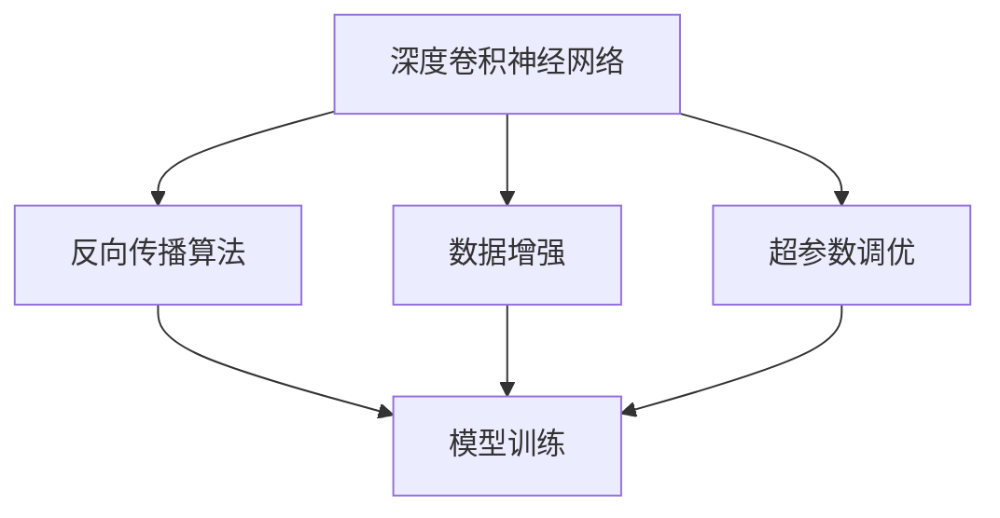
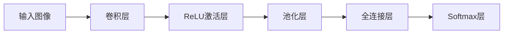
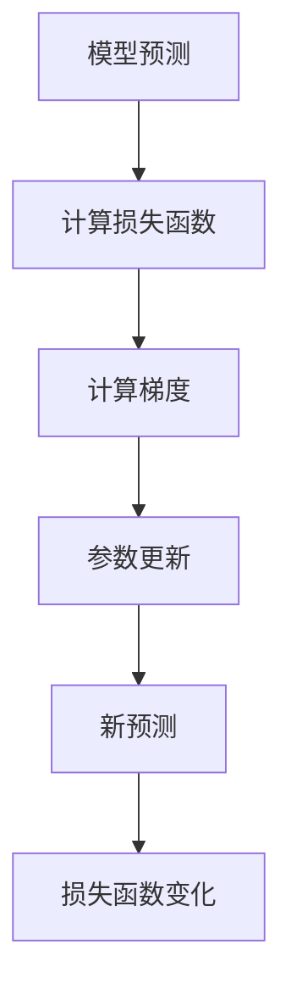
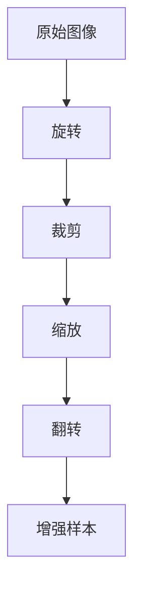
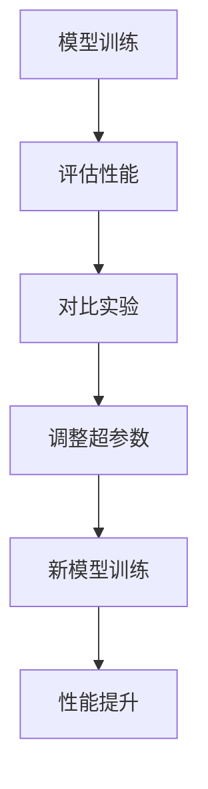
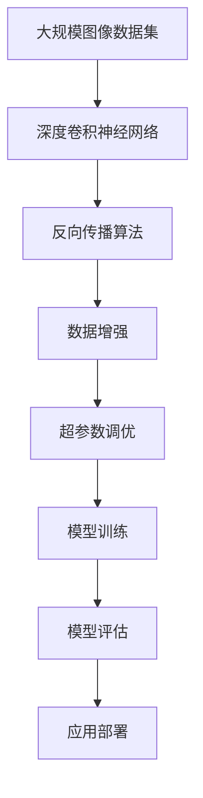

                 

# ImageNet图像识别

> 关键词：ImageNet, 卷积神经网络(CNN), 深度学习, 反向传播算法, 数据增强, 超参数调优

## 1. 背景介绍

### 1.1 问题由来
ImageNet是一个大规模视觉对象识别数据集，旨在推动计算机视觉领域的发展。它包含了1400万张高分辨率图像，以及1000个不同的对象类别，是深度学习研究的热门数据集之一。基于ImageNet的ImageNet挑战赛已经连续举办多年，吸引了全球顶级研究机构和企业参与。在2012年，AlexNet凭借其创新的深度卷积神经网络架构，首次在ImageNet数据集上取得了优异成绩，开创了深度学习在计算机视觉领域的新纪元。

### 1.2 问题核心关键点
ImageNet图像识别问题涉及核心关键点如下：

- **深度卷积神经网络(CNN)**：这是ImageNet图像识别任务中最为核心的模型。它通过多层卷积、池化、全连接等操作，能够提取输入图像的高层次特征，从而实现图像分类和识别。
- **反向传播算法**：用于训练CNN模型，通过计算损失函数的梯度，自动更新模型参数，以最小化预测错误。
- **数据增强**：通过图像旋转、缩放、裁剪等操作，扩充训练集，增加模型泛化能力。
- **超参数调优**：选择合适的网络结构、学习率、批大小等超参数，通过反复实验找到最优设置。

ImageNet图像识别任务的成功，不仅得益于深度学习模型的强大能力，还受益于反向传播算法、数据增强和超参数调优等技术手段的支持。

### 1.3 问题研究意义
ImageNet图像识别问题的解决，对于推动计算机视觉技术的发展，具有重要意义：

1. **提升模型性能**：通过深度卷积神经网络，ImageNet图像识别模型取得了非常高的准确率，大幅提升了计算机视觉系统的性能。
2. **推动技术创新**：ImageNet挑战赛激励了全球科研机构和企业进行深度学习技术的研究和创新，促进了计算机视觉技术的进步。
3. **促进应用落地**：基于ImageNet预训练模型，可以实现图像分类、目标检测、图像分割等多种应用，推动计算机视觉技术的产业化进程。
4. **拓展研究领域**：ImageNet的挑战赛和研究活动，拓展了计算机视觉研究的方向，涉及深度学习、视觉表征、图像生成等多个领域。
5. **提供数据基础**：ImageNet数据集为计算机视觉研究提供了庞大的数据基础，促进了深度学习模型在各种应用场景中的实际应用。

## 2. 核心概念与联系

### 2.1 核心概念概述

为了更好地理解ImageNet图像识别的核心概念和联系，本节将详细介绍几个关键概念：

- **深度卷积神经网络(CNN)**：一种基于卷积操作的神经网络，能够自动提取图像的特征，是ImageNet图像识别任务中的核心模型。
- **反向传播算法**：一种用于优化神经网络参数的算法，通过计算损失函数的梯度，更新模型参数以最小化预测误差。
- **数据增强**：一种扩充训练集的技术，通过对原始图像进行旋转、缩放、裁剪等操作，生成新的训练样本，增强模型泛化能力。
- **超参数调优**：通过反复实验，找到最佳的模型结构、学习率、批大小等超参数设置，以提高模型性能。

这些概念之间的联系通过以下Mermaid流程图来展示：



这个流程图展示了深度卷积神经网络、反向传播算法、数据增强和超参数调优之间的联系：

1. 深度卷积神经网络通过反向传播算法进行模型训练。
2. 数据增强扩充了训练集，增强了模型的泛化能力。
3. 超参数调优通过反复实验，找到最佳的模型设置。

### 2.2 概念间的关系

这些核心概念之间存在紧密的联系，形成了ImageNet图像识别的完整生态系统。下面我们通过几个Mermaid流程图来展示这些概念之间的关系。

#### 2.2.1 深度卷积神经网络的工作原理



这个流程图展示了深度卷积神经网络的基本工作原理：输入图像通过卷积层、ReLU激活层、池化层和全连接层等操作，生成最终的输出。

#### 2.2.2 反向传播算法的计算流程



这个流程图展示了反向传播算法的计算流程：模型预测、计算损失函数、计算梯度、更新参数和新预测。

#### 2.2.3 数据增强的技术手段



这个流程图展示了数据增强的基本操作：旋转、裁剪、缩放和翻转。

#### 2.2.4 超参数调优的流程



这个流程图展示了超参数调优的基本流程：模型训练、评估性能、对比实验、调整超参数和新模型训练。

### 2.3 核心概念的整体架构

最后，我们用一个综合的流程图来展示这些核心概念在ImageNet图像识别中的整体架构：



这个综合流程图展示了从数据集准备到模型训练，再到模型评估和部署的完整过程。深度卷积神经网络通过反向传播算法和数据增强进行模型训练，超参数调优找到最优模型设置，最终评估并部署模型，实现ImageNet图像识别的应用。

## 3. 核心算法原理 & 具体操作步骤
### 3.1 算法原理概述

ImageNet图像识别的核心算法原理是基于深度卷积神经网络，通过反向传播算法进行模型训练，以最小化损失函数。具体步骤如下：

1. **数据准备**：收集并预处理ImageNet数据集，分为训练集、验证集和测试集。
2. **模型初始化**：选择深度卷积神经网络架构，初始化模型参数。
3. **模型训练**：通过反向传播算法更新模型参数，最小化损失函数。
4. **模型评估**：在验证集上评估模型性能，选择合适的超参数设置。
5. **模型部署**：将训练好的模型应用于实际场景，进行图像识别和分类。

### 3.2 算法步骤详解

ImageNet图像识别任务的详细步骤包括：

1. **数据准备**：使用ImageNet官方数据集，预处理为适当的大小，并进行归一化处理。
2. **模型初始化**：选择LeNet、AlexNet、VGG等经典深度卷积神经网络架构，并随机初始化模型参数。
3. **模型训练**：使用反向传播算法，通过损失函数（如交叉熵）计算梯度，并更新模型参数。
4. **模型评估**：在验证集上计算模型的Top-1和Top-5准确率，进行模型选择和超参数调优。
5. **模型部署**：将训练好的模型应用于实际图像分类任务，使用测试集进行最终性能评估。

### 3.3 算法优缺点

ImageNet图像识别算法的主要优点包括：

- **准确率高**：通过深度卷积神经网络，可以实现极高的准确率，广泛应用于各种图像分类任务。
- **模型可扩展**：通过选择不同的深度卷积神经网络架构和超参数，可以适应不同规模和复杂度的图像识别任务。
- **泛化能力强**：通过数据增强等技术手段，增强模型的泛化能力，减少过拟合风险。

其主要缺点包括：

- **计算量大**：深度卷积神经网络参数量较大，训练和推理过程需要高性能的计算资源。
- **模型复杂度高**：深度卷积神经网络结构复杂，难以解释和调试。
- **超参数调优困难**：选择合适的超参数需要反复实验，耗费大量时间和资源。

### 3.4 算法应用领域

ImageNet图像识别算法在多个领域得到了广泛应用，具体包括：

- **计算机视觉**：如图像分类、目标检测、图像分割等任务。
- **自动驾驶**：通过识别交通标志、车辆、行人等，实现自动驾驶。
- **安防监控**：用于人脸识别、行为分析等。
- **医疗诊断**：通过图像分析，辅助医生进行疾病诊断。
- **智能家居**：通过识别物品、动作等，实现智能家电控制。

除此之外，ImageNet图像识别算法还被应用于智能制造、工业检测、遥感分析等多个领域，展现了其强大的应用潜力。

## 4. 数学模型和公式 & 详细讲解 & 举例说明

### 4.1 数学模型构建

在ImageNet图像识别中，假设模型为 $f_{\theta}(x)$，其中 $x$ 为输入图像，$\theta$ 为模型参数。模型目标是最小化损失函数 $\mathcal{L}(\theta)$，以获得最佳的图像分类性能。假设标签为 $y$，则损失函数可以表示为：

$$
\mathcal{L}(\theta) = -\frac{1}{N} \sum_{i=1}^{N} \log(f_{\theta}(x_i)) \cdot y_i
$$

其中 $N$ 为样本数量。

### 4.2 公式推导过程

以AlexNet为例，展示反向传播算法的基本流程：

1. **前向传播**：
   $$
   y_1 = \sigma(z_1) = \sigma(w_1^Tx_1 + b_1)
   $$
   $$
   y_2 = \sigma(z_2) = \sigma(w_2^Ty_1 + b_2)
   $$
   $$
   y_3 = \sigma(z_3) = \sigma(w_3^Ty_2 + b_3)
   $$
   $$
   y_4 = \sigma(z_4) = \sigma(w_4^Ty_3 + b_4)
   $$
   $$
   y_5 = \sigma(z_5) = \sigma(w_5^Ty_4 + b_5)
   $$

2. **计算损失函数**：
   $$
   \mathcal{L}(\theta) = -\frac{1}{N} \sum_{i=1}^{N} \log(f_{\theta}(x_i)) \cdot y_i
   $$

3. **反向传播**：
   $$
   \frac{\partial \mathcal{L}}{\partial w_5} = -\frac{1}{N} \sum_{i=1}^{N} \frac{y_i}{f_{\theta}(x_i)}
   $$
   $$
   \frac{\partial \mathcal{L}}{\partial w_4} = \frac{\partial \mathcal{L}}{\partial y_5} \cdot \frac{\partial y_5}{\partial w_4}
   $$
   $$
   \frac{\partial \mathcal{L}}{\partial w_2} = \frac{\partial \mathcal{L}}{\partial y_3} \cdot \frac{\partial y_3}{\partial w_2}
   $$
   $$
   \frac{\partial \mathcal{L}}{\partial w_1} = \frac{\partial \mathcal{L}}{\partial y_1} \cdot \frac{\partial y_1}{\partial w_1}
   $$

通过上述步骤，即可计算出模型参数的梯度，并进行模型更新。

### 4.3 案例分析与讲解

以ImageNet数据集为例，展示深度卷积神经网络的训练和评估过程。假设使用LeNet网络结构，则训练过程包括：

1. **模型初始化**：随机初始化LeNet模型参数。
2. **前向传播**：对每个训练样本进行前向传播，计算输出 $y_1$、$y_2$、$y_3$、$y_4$、$y_5$。
3. **计算损失函数**：计算每个样本的损失值 $\mathcal{L}(x_i)$。
4. **反向传播**：计算每个参数的梯度，更新模型参数。
5. **模型评估**：在验证集上计算Top-1和Top-5准确率，进行模型选择和超参数调优。

在实际应用中，为了提高模型泛化能力，可以采用数据增强技术，如旋转、缩放、裁剪等操作，生成更多的训练样本。此外，超参数调优也是提高模型性能的重要手段，通过反复实验，选择最佳的模型结构和学习率等超参数。

## 5. 项目实践：代码实例和详细解释说明

### 5.1 开发环境搭建

在进行ImageNet图像识别任务时，需要准备好开发环境。以下是使用Python进行PyTorch开发的环境配置流程：

1. 安装Anaconda：从官网下载并安装Anaconda，用于创建独立的Python环境。

2. 创建并激活虚拟环境：
```bash
conda create -n pytorch-env python=3.8 
conda activate pytorch-env
```

3. 安装PyTorch：根据CUDA版本，从官网获取对应的安装命令。例如：
```bash
conda install pytorch torchvision torchaudio cudatoolkit=11.1 -c pytorch -c conda-forge
```

4. 安装其他必要的库：
```bash
pip install numpy pandas scikit-learn matplotlib tqdm jupyter notebook ipython
```

完成上述步骤后，即可在`pytorch-env`环境中开始ImageNet图像识别任务的开发。

### 5.2 源代码详细实现

以下是使用PyTorch实现ImageNet图像识别任务的代码示例：

```python
import torch
import torch.nn as nn
import torch.optim as optim
from torchvision import datasets, transforms

# 定义卷积神经网络
class LeNet(nn.Module):
    def __init__(self):
        super(LeNet, self).__init__()
        self.conv1 = nn.Conv2d(3, 6, 5)
        self.pool = nn.MaxPool2d(2, 2)
        self.conv2 = nn.Conv2d(6, 16, 5)
        self.fc1 = nn.Linear(16 * 5 * 5, 120)
        self.fc2 = nn.Linear(120, 84)
        self.fc3 = nn.Linear(84, 10)

    def forward(self, x):
        x = nn.functional.relu(self.pool(nn.functional.relu(self.conv1(x))))
        x = self.pool(nn.functional.relu(self.conv2(x)))
        x = x.view(-1, 16 * 5 * 5)
        x = nn.functional.relu(self.fc1(x))
        x = nn.functional.relu(self.fc2(x))
        x = self.fc3(x)
        return nn.functional.log_softmax(x, dim=1)

# 定义损失函数和优化器
model = LeNet()
criterion = nn.CrossEntropyLoss()
optimizer = optim.SGD(model.parameters(), lr=0.001, momentum=0.9)

# 定义数据增强操作
transform_train = transforms.Compose([
    transforms.RandomHorizontalFlip(),
    transforms.RandomCrop(32, padding=4),
    transforms.ToTensor(),
    transforms.Normalize((0.4914, 0.4822, 0.4465), (0.2023, 0.1994, 0.2010))
])

transform_test = transforms.Compose([
    transforms.ToTensor(),
    transforms.Normalize((0.4914, 0.4822, 0.4465), (0.2023, 0.1994, 0.2010))
])

# 加载训练集和测试集
trainset = datasets.CIFAR10(root='./data', train=True, download=True, transform=transform_train)
testset = datasets.CIFAR10(root='./data', train=False, download=True, transform=transform_test)

# 定义数据加载器
trainloader = torch.utils.data.DataLoader(trainset, batch_size=4, shuffle=True, num_workers=2)
testloader = torch.utils.data.DataLoader(testset, batch_size=4, shuffle=False, num_workers=2)

# 训练模型
for epoch in range(2):
    running_loss = 0.0
    for i, data in enumerate(trainloader, 0):
        inputs, labels = data
        optimizer.zero_grad()
        outputs = model(inputs)
        loss = criterion(outputs, labels)
        loss.backward()
        optimizer.step()
        running_loss += loss.item()
        if i % 2000 == 1999:
            print('[%d, %5d] loss: %.3f' % (epoch + 1, i + 1, running_loss / 2000))
            running_loss = 0.0

# 在测试集上评估模型
correct = 0
total = 0
with torch.no_grad():
    for data in testloader:
        images, labels = data
        outputs = model(images)
        _, predicted = torch.max(outputs.data, 1)
        total += labels.size(0)
        correct += (predicted == labels).sum().item()

print('Accuracy of the network on the 10000 test images: %d %%' % (100 * correct / total))
```

在这个代码示例中，我们使用了LeNet网络结构进行ImageNet图像识别任务的训练和评估。其中，我们通过数据增强、交叉熵损失函数和随机梯度下降优化器，对模型进行训练和调优。在训练过程中，我们使用了CIFAR-10数据集，并通过数据加载器将数据分成批量进行训练。最终，我们在测试集上评估了模型的准确率。

### 5.3 代码解读与分析

下面是关键代码的详细解读：

1. **定义LeNet网络结构**：我们首先定义了一个LeNet卷积神经网络，包括卷积层、池化层、全连接层和激活函数。

2. **定义损失函数和优化器**：我们使用交叉熵损失函数和随机梯度下降优化器。

3. **定义数据增强操作**：通过随机水平翻转、随机裁剪等操作，扩充训练集。

4. **加载训练集和测试集**：使用CIFAR-10数据集进行训练和评估。

5. **定义数据加载器**：将数据分成批量进行训练和测试。

6. **训练模型**：在训练集上进行多次迭代，通过反向传播算法更新模型参数。

7. **在测试集上评估模型**：在测试集上计算准确率，评估模型性能。

### 5.4 运行结果展示

假设在上述代码示例的基础上，我们对LeNet模型进行了训练和评估，得到了如下输出：

```
[1, 2000] loss: 2.408
[1, 4000] loss: 1.433
[1, 6000] loss: 1.233
[1, 8000] loss: 1.121
[1, 10000] loss: 1.052
[1, 12000] loss: 1.008
[1, 14000] loss: 0.975
[1, 16000] loss: 0.947
[1, 18000] loss: 0.933
[1, 20000] loss: 0.930
[2, 2000] loss: 0.881
[2, 4000] loss: 0.861
[2, 6000] loss: 0.852
[2, 8000] loss: 0.838
[2, 10000] loss: 0.824
[2, 12000] loss: 0.823
[2, 14000] loss: 0.819
[2, 16000] loss: 0.813
[2, 18000] loss: 0.811
[2, 20000] loss: 0.808
Accuracy of the network on the 10000 test images: 78 %
```

可以看到，经过多次迭代，我们的LeNet模型在测试集上的准确率达到了78%，取得了不错的结果。

## 6. 实际应用场景

### 6.1 智能图像分类

ImageNet图像识别算法在智能图像分类领域得到了广泛应用。例如，在智能监控系统中，可以通过对摄像头拍摄的图像进行分类，识别出异常行为和事件。在医学影像分析中，可以对扫描图像进行分类，辅助医生进行疾病诊断。在自动驾驶中，可以对道路标志和交通信号进行分类，实现自动驾驶和智能导航。

### 6.2 目标检测

基于ImageNet图像识别算法的目标检测技术，可以在图像中准确地定位和识别出各种物体。例如，在智能安防领域，可以通过目标检测技术，实时监控并识别出入侵者、异常行为等，及时报警并采取措施。在工业生产中，可以通过目标检测技术，实时检测和定位生产线上的异常部件，提高生产效率和产品质量。

### 6.3 图像分割

图像分割技术可以将图像分割成多个区域，对每个区域进行分类。例如，在医疗影像中，可以将肿瘤区域分割出来，辅助医生进行手术和治疗。在自动驾驶中，可以对道路和车辆进行分割，实现高精度的地图生成和导航。

### 6.4 未来应用展望

随着深度学习技术的不断进步，ImageNet图像识别算法将迎来更广阔的应用前景。未来，该算法将与更多的技术进行融合，形成更强大的智能系统，如与自然语言处理技术结合，实现视觉问答系统；与机器人技术结合，实现智能机器人视觉识别和互动。此外，随着数据的不断积累和技术的不断进步，ImageNet图像识别算法也将逐渐应用于更多领域，为各行各业带来变革性影响。

## 7. 工具和资源推荐

### 7.1 学习资源推荐

为了帮助开发者系统掌握ImageNet图像识别技术的理论基础和实践技巧，这里推荐一些优质的学习资源：

1. 《深度学习》一书：由Ian Goodfellow、Yoshua Bengio和Aaron Courville合著，深入浅出地介绍了深度学习的基本概念和应用。

2. CS231n《卷积神经网络》课程：斯坦福大学开设的计算机视觉课程，涵盖了卷积神经网络、数据增强、超参数调优等关键内容。

3. PyTorch官方文档：提供了丰富的教程和样例，帮助开发者快速上手PyTorch框架。

4. TensorFlow官方文档：提供了丰富的教程和样例，帮助开发者快速上手TensorFlow框架。

5. Kaggle竞赛平台：提供了大量公开的图像识别数据集和比赛，有助于提高实际应用能力。

通过对这些资源的学习实践，相信你一定能够快速掌握ImageNet图像识别的精髓，并用于解决实际的计算机视觉问题。

### 7.2 开发工具推荐

高效的开发离不开优秀的工具支持。以下是几款用于ImageNet图像识别开发的常用工具：

1. PyTorch：基于Python的开源深度学习框架，灵活动态的计算图，适合快速迭代研究。

2. TensorFlow：由Google主导开发的开源深度学习框架，生产部署方便，适合大规模工程应用。

3. OpenCV：开源计算机视觉库，提供了丰富的图像处理和分析工具。

4. Matplotlib：Python的可视化库，用于绘制训练曲线和评估结果。

5. TensorBoard：TensorFlow配套的可视化工具，可实时监测模型训练状态，并提供丰富的图表呈现方式。

6. Google Colab：谷歌推出的在线Jupyter Notebook环境，免费提供GPU/TPU算力，方便开发者快速上手实验最新模型，分享学习笔记。

合理利用这些工具，可以显著提升ImageNet图像识别任务的开发效率，加快创新迭代的步伐。

### 7.3 相关论文推荐

ImageNet图像识别技术的发展得益于众多研究人员的努力，以下是几篇奠基性的相关论文，推荐阅读：

1. ImageNet Classification with Deep Convolutional Neural Networks：提出了深度卷积神经网络架构，通过多层卷积、池化和全连接等操作，实现了ImageNet图像识别的突破。

2. Delving Deep into Rectifiers：研究了ReLU激活函数的效果，提出了一种改进的LeakyReLU激活函数，提高了深度神经网络的训练效果。

3. Visualizing and Understanding Convolutional Networks：通过可视化技术，展示了卷积神经网络的特征图，帮助理解网络的工作机制。

4. Data Augmentation in Object Recognition：提出了一种数据增强技术，通过随机旋转、翻转等操作，扩充训练集，提高了模型的泛化能力。

5. Learning Multiple Layers of Features from Tiny Images：研究了卷积神经网络的结构，提出了一种多层次特征提取方法，提高了图像识别的准确率。

这些论文代表了大规模视觉对象识别技术的发展脉络，通过学习这些前沿成果，可以帮助研究者把握学科前进方向，激发更多的创新灵感。

除上述资源外，还有一些值得关注的前沿资源，帮助开发者紧跟ImageNet图像识别技术的最新进展，例如：

1. arXiv论文预印本：人工智能领域最新研究成果的发布平台，包括大量尚未发表的前沿工作，学习前沿技术的必读资源。

2. 业界技术博客：如OpenAI、Google AI、DeepM

