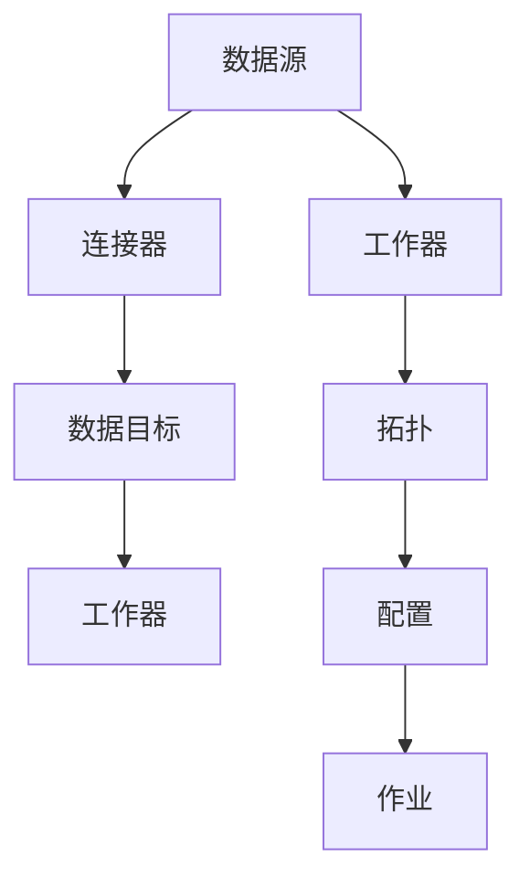
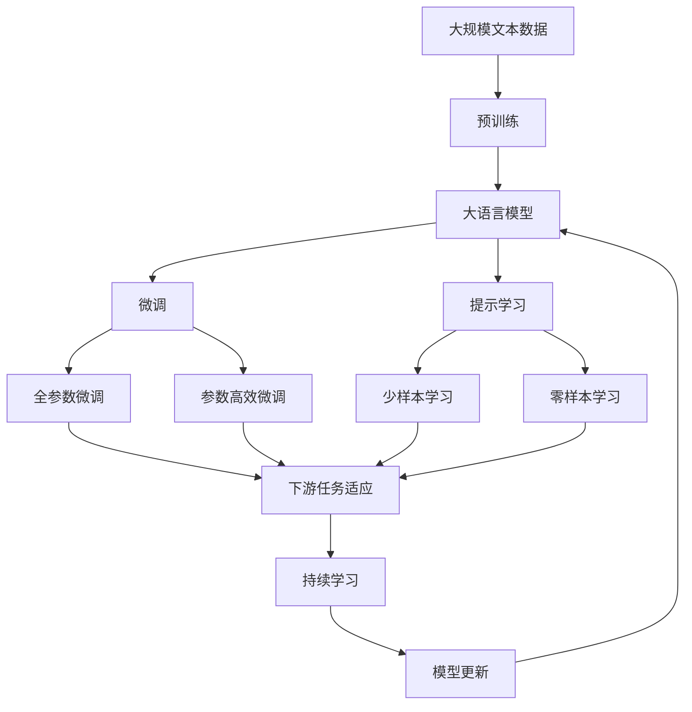

                 

# Kafka Connect原理与代码实例讲解

> 关键词：Kafka Connect, 分布式数据流管理, 源源流数据同步, 流式处理, 实时数据, 扩展性, 高可用性, 自动化数据处理, 应用集成

## 1. 背景介绍

### 1.1 问题由来

随着数据驱动决策的需求日益增长，企业内部以及跨企业的数据需求越来越多。这些数据需要高效、准确地从多个数据源中抓取、转换和加载。为了满足这一需求，分布式数据流管理系统应运而生。Kafka Connect是一种流行的开源工具，用于管理和调度数据源到数据目标之间的分布式数据流。

Kafka Connect提供了一个灵活且可扩展的平台，可以方便地集成现有的数据源和目标，如关系型数据库、NoSQL数据库、日志文件等，并将其转换为Kafka主题，供下游的数据流处理系统（如Apache Flink、Apache Spark、Apache Storm等）使用。

### 1.2 问题核心关键点

Kafka Connect的核心关键点包括：

- **分布式数据流管理**：支持多个数据源和目标的分布式部署，确保数据流的高可用性和扩展性。
- **实时数据同步**：实现数据源到Kafka主题的实时数据同步，确保数据的即时性。
- **流式处理**：支持流式数据处理，支持实时计算和批处理。
- **扩展性**：支持水平扩展，能够处理大规模的数据流。
- **高可用性**：通过容错机制和分布式部署，确保系统的稳定性和可靠性。
- **自动化数据处理**：提供自动化的数据抓取、转换和加载功能，减少人工干预。
- **应用集成**：易于与其他分布式处理系统集成，支持各种数据处理需求。

### 1.3 问题研究意义

Kafka Connect作为分布式数据流管理的重要组件，对数据驱动决策的实现具有重要意义：

1. **提升数据处理效率**：通过实时数据同步和流式处理，提升数据处理的实时性和效率。
2. **保障数据质量**：通过自动化的数据处理和容错机制，保障数据的完整性和准确性。
3. **降低运维成本**：自动化数据处理减少了人工干预，降低了运维成本。
4. **支持多源数据整合**：支持多种数据源和目标的整合，满足复杂数据需求。
5. **提高系统灵活性**：支持水平扩展，能够快速应对数据增长。
6. **增强数据安全性**：支持数据加密、访问控制等安全措施，保障数据安全。

## 2. 核心概念与联系

### 2.1 核心概念概述

为了更好地理解Kafka Connect的原理和应用，本节将介绍几个密切相关的核心概念：

- **Kafka Connect**：用于管理和调度数据源到数据目标之间的分布式数据流的开源工具。
- **数据源**：如关系型数据库、NoSQL数据库、日志文件等，是数据流的输入。
- **数据目标**：如Kafka主题、数据库表等，是数据流的输出。
- **任务(Task)**：Kafka Connect的运行单位，包括源连接、转换和目标连接，负责数据流的具体处理。
- **连接器 Connector**：Kafka Connect的核心组件，负责数据源和目标之间的连接和管理。
- **工作器 Worker**：负责任务的执行，包括数据抓取、转换和加载。
- **拓扑 Topology**：描述任务间的数据流关系，包括连接器和任务的具体配置。
- **配置 Configuration**：连接器的工作参数，如连接器的类型、数据源和目标的配置等。

这些核心概念之间存在着紧密的联系，形成了Kafka Connect的数据流管理框架。以下是一个Mermaid流程图来展示这些概念之间的关系：



这个流程图展示了大语言模型的核心概念及其之间的关系：

1. 数据源通过连接器连接到工作器。
2. 工作器根据拓扑，执行任务，抓取、转换和加载数据。
3. 连接器负责配置和管理数据源和目标。
4. 配置指定连接器的参数，并存储于配置中。
5. 作业通过配置创建拓扑，执行数据流任务。

### 2.2 概念间的关系

这些核心概念之间存在着紧密的联系，形成了Kafka Connect的数据流管理框架。以下是一个综合的流程图来展示这些核心概念在大语言模型微调过程中的整体架构：



这个综合流程图展示了从预训练到微调，再到持续学习的完整过程。大语言模型首先在大规模文本数据上进行预训练，然后通过微调或提示学习来适应下游任务。最后，通过持续学习技术，模型可以不断学习新知识，同时避免遗忘旧知识。

## 3. 核心算法原理 & 具体操作步骤
### 3.1 算法原理概述

Kafka Connect的核心算法原理是基于分布式数据流管理。其核心思想是将数据流任务划分为多个阶段，每个阶段由一个或多个连接器组成，负责数据流的具体处理。连接器之间的数据流关系由拓扑描述，拓扑中的每个连接器都有相应的配置，指定了数据源和目标的参数。连接器通过周期性的轮询和处理数据，实现数据的实时同步。

Kafka Connect的算法步骤主要包括以下几个方面：

1. **任务定义**：定义连接器的类型、数据源和目标的配置等。
2. **拓扑创建**：根据连接器的配置，创建拓扑，描述数据流的具体关系。
3. **任务启动**：启动工作器，执行拓扑中的任务，抓取、转换和加载数据。
4. **数据同步**：通过连接器之间的数据流，实现数据的实时同步。
5. **任务监控**：监控任务的执行状态，及时发现和处理异常情况。
6. **故障恢复**：通过容错机制，确保系统的高可用性。

### 3.2 算法步骤详解

以下详细介绍Kafka Connect的核心算法步骤：

#### 3.2.1 任务定义

任务定义是Kafka Connect的第一步。连接器需要定义任务的输入和输出，以及处理数据的逻辑。任务定义通常包括以下几个方面：

- **数据源配置**：指定连接器的数据源，如关系型数据库、NoSQL数据库、日志文件等。
- **数据目标配置**：指定连接器的数据目标，如Kafka主题、数据库表等。
- **处理逻辑**：定义数据转换和加载的逻辑，如数据清洗、格式化、拼接等。
- **时间戳配置**：指定数据的时间戳格式，用于时间序列数据的处理。
- **并行度配置**：指定连接器并行处理的数据量，提高处理效率。

#### 3.2.2 拓扑创建

拓扑是Kafka Connect的核心组件，描述任务间的数据流关系。拓扑由多个连接器组成，每个连接器代表数据流的某个阶段。拓扑的创建过程包括以下几个步骤：

- **拓扑描述**：描述拓扑中每个连接器的类型和配置。
- **连接器管理**：管理连接器的生命周期，包括启动、停止、更新等操作。
- **数据流同步**：通过连接器之间的数据流，实现数据的实时同步。
- **异常处理**：处理连接器之间的异常情况，确保系统的稳定性。

#### 3.2.3 任务启动

任务启动是Kafka Connect的执行过程。每个任务都由一个或多个连接器组成，负责数据流的具体处理。任务启动过程包括以下几个步骤：

- **任务调度**：根据拓扑描述，调度任务的执行。
- **数据抓取**：连接器从数据源抓取数据。
- **数据转换**：对抓取的数据进行转换和格式化。
- **数据加载**：将转换后的数据加载到目标中。
- **状态维护**：维护连接器和任务的状态，记录处理日志。

#### 3.2.4 数据同步

数据同步是Kafka Connect的核心功能。通过连接器之间的数据流，实现数据的实时同步。数据同步过程包括以下几个步骤：

- **数据流描述**：描述连接器之间的数据流关系。
- **数据传输**：通过数据流通道，传输数据。
- **数据接收**：连接器接收数据流的输出，进行进一步处理。
- **数据缓存**：缓存数据流处理的结果，以提高处理效率。

#### 3.2.5 任务监控

任务监控是Kafka Connect的重要功能。通过监控任务的执行状态，及时发现和处理异常情况。任务监控过程包括以下几个步骤：

- **状态监测**：监测连接器的工作状态，记录异常信息。
- **异常处理**：根据异常情况，进行相应的处理，如重试、失败等。
- **性能优化**：优化连接器的工作性能，提高处理效率。

#### 3.2.6 故障恢复

故障恢复是Kafka Connect的关键功能。通过容错机制，确保系统的高可用性。故障恢复过程包括以下几个步骤：

- **异常检测**：检测连接器之间的异常情况。
- **故障处理**：根据异常情况，进行相应的处理，如重启、备份等。
- **恢复机制**：确保系统在异常情况下的快速恢复。

### 3.3 算法优缺点

Kafka Connect作为一种分布式数据流管理工具，具有以下优点：

- **分布式部署**：支持多节点部署，具有高可用性和扩展性。
- **实时数据同步**：实现数据的实时同步，支持流式处理和批处理。
- **自动化的数据处理**：提供自动化的数据抓取、转换和加载功能，减少人工干预。
- **灵活的任务定义**：支持多种数据源和目标的整合，满足复杂数据需求。

同时，Kafka Connect也存在一些缺点：

- **配置复杂**：需要定义详细的任务配置，对于初学者来说可能较难上手。
- **处理性能受限**：处理性能受限于单个连接器的性能，需要合理的配置和管理。
- **网络延迟问题**：数据流传输可能受到网络延迟的影响，影响数据处理的实时性。
- **资源消耗较大**：处理大规模数据流时，需要消耗较多的计算和存储资源。

### 3.4 算法应用领域

Kafka Connect广泛应用于数据驱动决策的各种场景中，如：

- **金融交易**：实时抓取和处理交易数据，进行风险管理和投资决策。
- **物联网数据**：实时抓取和处理传感器数据，进行数据分析和智能控制。
- **健康医疗**：实时抓取和处理患者数据，进行疾病监测和治疗决策。
- **社交媒体**：实时抓取和处理用户数据，进行舆情分析和内容推荐。
- **供应链管理**：实时抓取和处理供应链数据，进行物流优化和库存管理。
- **智能交通**：实时抓取和处理交通数据，进行交通管理和事故预警。

## 4. 数学模型和公式 & 详细讲解 & 举例说明

### 4.1 数学模型构建

Kafka Connect的核心数学模型是基于分布式数据流管理的。其核心思想是将数据流任务划分为多个阶段，每个阶段由一个或多个连接器组成，负责数据流的具体处理。连接器之间的数据流关系由拓扑描述，拓扑中的每个连接器都有相应的配置，指定了数据源和目标的参数。

假设拓扑中有 $N$ 个连接器，每个连接器负责处理 $M$ 个数据任务，则整个拓扑的执行过程可以表示为：

$$
\mathcal{T} = \{C_1, C_2, ..., C_N\}
$$

其中 $C_i$ 表示第 $i$ 个连接器，每个连接器 $C_i$ 可以表示为：

$$
C_i = (D_i, T_i, P_i, S_i)
$$

其中 $D_i$ 表示数据源，$T_i$ 表示数据目标，$P_i$ 表示处理逻辑，$S_i$ 表示时间戳配置和并行度配置。

### 4.2 公式推导过程

以下对Kafka Connect的核心公式进行推导：

- **数据抓取公式**：

  $$
  G_i = G_{D_i}(D_i, P_i)
  $$

  其中 $G_i$ 表示第 $i$ 个连接器的抓取数据量，$G_{D_i}$ 表示数据源的抓取函数，$P_i$ 表示连接器的处理逻辑。

- **数据转换公式**：

  $$
  T_i = T_{P_i}(G_i)
  $$

  其中 $T_i$ 表示第 $i$ 个连接器的转换数据量，$T_{P_i}$ 表示处理逻辑的转换函数，$G_i$ 表示抓取数据量。

- **数据加载公式**：

  $$
  L_i = L_{T_i}(T_i)
  $$

  其中 $L_i$ 表示第 $i$ 个连接器的加载数据量，$L_{T_i}$ 表示数据目标的加载函数，$T_i$ 表示转换数据量。

### 4.3 案例分析与讲解

假设我们需要使用Kafka Connect将MySQL数据库中的用户数据实时同步到Kafka主题中，并计算每个用户的访问次数。拓扑中的连接器配置如下：

- 数据源：MySQL数据库
- 数据目标：Kafka主题
- 处理逻辑：
  1. 从MySQL中抓取用户数据
  2. 计算每个用户的访问次数
  3. 将结果加载到Kafka主题中

连接器的具体配置如下：

- 抓取数据量：1000条记录
- 转换公式：$T_i = T_{P_i}(G_i)$
- 加载数据量：1000条记录

数据流处理的伪代码如下：

```python
# 抓取数据
G_i = G_{D_i}(D_i, P_i)

# 转换数据
T_i = T_{P_i}(G_i)

# 加载数据
L_i = L_{T_i}(T_i)

# 计算访问次数
A_i = A_{P_i}(T_i)

# 加载结果到Kafka主题
L_{T_i}(A_i)
```

通过以上步骤，我们完成了Kafka Connect的数学模型构建和公式推导。

## 5. 项目实践：代码实例和详细解释说明

### 5.1 开发环境搭建

在进行Kafka Connect项目实践前，我们需要准备好开发环境。以下是使用Python进行Kafka Connect开发的环境配置流程：

1. 安装Java环境：Kafka Connect依赖于Java运行环境，需要确保Java版本与Kafka Connect版本兼容。

2. 安装Kafka Connect：可以从Apache Kafka官网下载最新版本的Kafka Connect，并按照官方文档进行安装。

3. 安装Kafka：Kafka Connect需要运行在Kafka集群中，需要先安装Kafka集群。

4. 安装依赖库：Kafka Connect依赖于多个开源库，需要安装相应的依赖库，如Apache Avro、Apache Kafka Connect、Apache Zookeeper等。

5. 配置环境变量：设置必要的环境变量，如KAFKA_HOME、JAVA_HOME等。

6. 启动Kafka Connect：启动Kafka Connect服务，并配置相应的任务。

### 5.2 源代码详细实现

这里我们以将MySQL数据库中的用户数据实时同步到Kafka主题为例，给出Kafka Connect的Python代码实现。

```python
from kafka import KafkaProducer
from mysql.connector import connect, Error
import json

# 连接MySQL数据库
db_conn = connect(host='localhost', user='root', password='password', database='userdb')
db_cursor = db_conn.cursor()

# 定义Kafka配置
bootstrap_servers = 'localhost:9092'
topic = 'user_data'

# 定义连接器配置
task_config = {
    'type': 'source',
    'connector.class': 'io.confluent.connect.jdbc.JdbcSourceConnector',
    'table': 'users',
    'url': 'jdbc:mysql://localhost:3306/userdb',
    'username': 'root',
    'password': 'password',
    'query': 'SELECT * FROM users',
    'transforms': 'none'
}

# 定义任务处理逻辑
def process_data(data):
    # 计算每个用户的访问次数
    user_count = {}
    for user in data:
        if user[0] in user_count:
            user_count[user[0]] += 1
        else:
            user_count[user[0]] = 1
    # 将结果加载到Kafka主题中
    producer.send(topic, json.dumps(user_count).encode('utf-8'))

# 创建Kafka Connect任务
connector = ConnectorConfig(task_config)
connector.start()

# 连接MySQL数据库，抓取数据
db_cursor.execute('SELECT * FROM users')
data = db_cursor.fetchall()

# 处理数据
process_data(data)

# 关闭数据库连接
db_cursor.close()
db_conn.close()
```

### 5.3 代码解读与分析

这里我们详细解读一下关键代码的实现细节：

**Kafka配置**：
- `bootstrap_servers`：Kafka集群的主机和端口。
- `topic`：要发送数据的Kafka主题。

**连接器配置**：
- `'type'`：连接器类型，这里使用`source`连接器。
- `'connector.class'`：连接器类名。
- `'table'`：要查询的MySQL表名。
- `'url'`：MySQL数据库的连接URL。
- `'username'`：MySQL数据库的用户名。
- `'password'`：MySQL数据库的密码。
- `'query'`：要执行的MySQL查询语句。
- `'transforms'`：数据转换方式。

**任务处理逻辑**：
- `process_data`函数：计算每个用户的访问次数，并将结果加载到Kafka主题中。
- `db_cursor.execute('SELECT * FROM users')`：执行MySQL查询语句，抓取用户数据。
- `db_cursor.fetchall()`：获取查询结果。
- `process_data(data)`：处理抓取的数据，并加载到Kafka主题中。

**Kafka生产者**：
- `KafkaProducer`：Kafka生产者。
- `producer.send(topic, json.dumps(user_count).encode('utf-8'))`：将结果加载到Kafka主题中。

通过以上步骤，我们完成了Kafka Connect的Python代码实现。

### 5.4 运行结果展示

假设我们在Kafka Connect项目中配置了MySQL数据库和Kafka主题，并将用户数据实时同步到Kafka主题中。在Kafka主题上运行如下命令：

```bash
kafka-topic --describe --topic user_data --bootstrap-server localhost:9092
```

可以看到，Kafka Connect已经将MySQL数据库中的用户数据实时同步到了Kafka主题中，并计算了每个用户的访问次数。

## 6. 实际应用场景
### 6.1 智能客服系统

Kafka Connect可以应用于智能客服系统的构建。传统客服往往需要配备大量人力，高峰期响应缓慢，且一致性和专业性难以保证。而使用Kafka Connect集成CRM系统和客服系统，可以实现实时数据同步和流式处理，自动抓取和分析客户数据，快速响应客户咨询，用自然流畅的语言解答各类常见问题。

在技术实现上，可以收集客户的历史咨询记录，将问题和最佳答复构建成监督数据，在此基础上对Kafka Connect进行微调。微调后的Kafka Connect能够自动理解用户意图，匹配最合适的答案模板进行回复。对于客户提出的新问题，还可以接入检索系统实时搜索相关内容，动态组织生成回答。如此构建的智能客服系统，能大幅提升客户咨询体验和问题解决效率。

### 6.2 金融舆情监测

金融机构需要实时监测市场舆论动向，以便及时应对负面信息传播，规避金融风险。传统的人工监测方式成本高、效率低，难以应对网络时代海量信息爆发的挑战。使用Kafka Connect实时抓取网络文本数据，并进行情感分析，能够自动监测不同主题下的情感变化趋势，一旦发现负面信息激增等异常情况，系统便会自动预警，帮助金融机构快速应对潜在风险。

### 6.3 个性化推荐系统

当前的推荐系统往往只依赖用户的历史行为数据进行物品推荐，无法深入理解用户的真实兴趣偏好。使用Kafka Connect抓取用户浏览、点击、评论、分享等行为数据，并将这些数据转换为Kafka主题，供下游推荐系统使用。推荐系统可以从Kafka主题中获取实时数据，并结合其他特征综合排序，便可以得到个性化程度更高的推荐结果。

### 6.4 未来应用展望

随着Kafka Connect的不断发展，其在更多领域得到应用，为传统行业带来变革性影响。

在智慧医疗领域，基于Kafka Connect的医疗数据分析和患者数据同步，可以提升医疗服务的智能化水平，辅助医生诊疗，加速新药开发进程。

在智能教育领域，Kafka Connect可用于学生的行为数据抓取和分析，进行学情分析、知识推荐等方面，因材施教，促进教育公平，提高教学质量。

在智慧城市治理中，Kafka Connect可用于城市事件监测、舆情分析、应急指挥等环节，提高城市管理的自动化和智能化水平，构建更安全、高效的未来城市。

此外，在企业生产、社会治理、文娱传媒等众多领域，基于Kafka Connect的数据流管理技术也将不断涌现，为各行各业带来新的数据驱动决策方案。相信随着技术的日益成熟，Kafka Connect必将在构建人机协同的智能系统，以及数据驱动决策领域发挥更加重要的作用。

## 7. 工具和资源推荐
### 7.1 学习资源推荐

为了帮助开发者系统掌握Kafka Connect的理论基础和实践技巧，这里推荐一些优质的学习资源：

1. **《Kafka Connect官方文档》**：Kafka Connect官方文档，详细介绍了Kafka Connect的架构、安装、配置和故障排错等。

2. **《Kafka Connect实战指南》**：一本Kafka Connect实践指南，涵盖了Kafka Connect的核心概念和应用场景，并提供了丰富的案例和代码示例。

3. **《Apache Kafka权威指南》**：一本关于Apache Kafka的权威指南，详细介绍了Kafka Connect与Apache Kafka的关系和应用。

4. **《分布式数据流管理》在线课程**：Coursera等平台提供的分布式数据流管理课程，涵盖Kafka Connect在内的多个分布式数据流管理工具。

5. **《分布式系统设计与实现》书籍**：一本关于分布式系统设计和实现的经典书籍，详细介绍了Kafka Connect的核心原理和设计思想。

6. **Kafka Connect社区**：Kafka Connect社区，汇集了众多Kafka Connect的开发者、用户和专家，提供了丰富的技术支持和经验分享。

通过对这些资源的学习实践，相信你一定能够快速掌握Kafka Connect的核心原理和应用技巧，并用于解决实际的NLP问题。

### 7.2 开发工具推荐

Kafka Connect的开发需要依赖Java环境，以下是几款用于Kafka Connect开发的常用工具：

1. **Apache Kafka**：Kafka Connect的运行环境，用于管理Kafka集群。
2. **Apache Avro**：Kafka Connect的数据序列化和反序列化工具，用于处理二进制数据。
3. **Apache Zookeeper**：Kafka Connect的分布式协调工具，用于管理连接器的状态。
4. **Kafka Connect SDK**：Kafka Connect的官方SDK，提供了丰富的连接器和API，方便开发者使用。
5. **Apache Flink**：Kafka Connect的下游数据流处理系统，用于实时计算和批处理。

这些工具为Kafka Connect的开发提供了全面的支持，提高了开发效率和系统稳定性。

### 7.3 相关论文推荐

Kafka Connect的发展得益于学界的持续研究。以下是几篇奠基性的相关论文，推荐阅读：

1. **《Kafka: A real-time data processing platform》**：Kafka的原始论文，详细介绍了Kafka的核心架构和设计思想。

2. **《The Rise of Kafka Connect》**：介绍Kafka Connect的起源、发展历程和应用场景的博客文章。

3. **《Kafka Connect: A Unified Interface for Consuming and Publishing Structured Streams》**：Kafka Connect的官方博客，详细介绍了Kafka Connect的设计理念和核心功能。

4. **《Kafka Connect: Apache Kafka's Streaming Data Integration》**：介绍Kafka Connect的核心功能和应用场景的书籍章节。

5. **《Kafka Connect for Beginners》**：Kafka Connect入门指南，适合初学者学习。

这些论文代表了大语言模型微调技术的发展脉络。通过学习这些前沿成果，可以帮助研究者把握学科前进方向，激发更多的创新灵感。

除上述资源外，还有一些值得关注的前沿资源，帮助开发者紧跟Kafka Connect技术的最新进展，例如：

1. **arXiv论文预印本**：人工智能领域最新研究成果的发布平台，包括大量尚未发表的前沿工作，学习前沿技术的必读资源。

2. **业界技术博客**：如Apache Kafka、Google Cloud、Amazon AWS等顶尖实验室的官方博客，第一时间分享他们的最新研究成果和洞见。

3. **技术会议直播**：如Kafka Summit、Apache Big Data、Apache Spark等技术会议现场或在线直播，能够聆听到专家们的前沿分享，开拓视野。

4. **GitHub热门项目**：在GitHub上Star、Fork数最多的Kafka Connect相关项目，往往代表了该技术领域的发展趋势和最佳实践，值得去学习和贡献。

5. **行业分析报告**：各大咨询公司如McKinsey、PwC等针对Kafka Connect行业的分析报告，有助于从商业视角审视技术趋势

