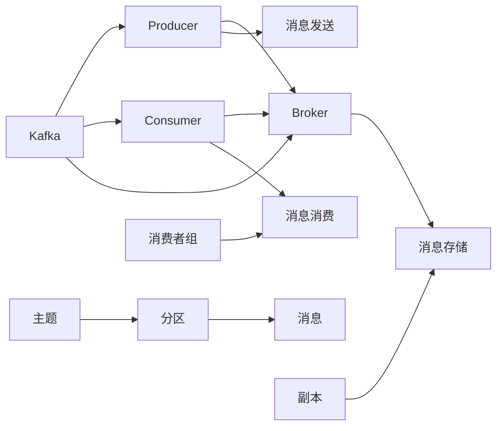
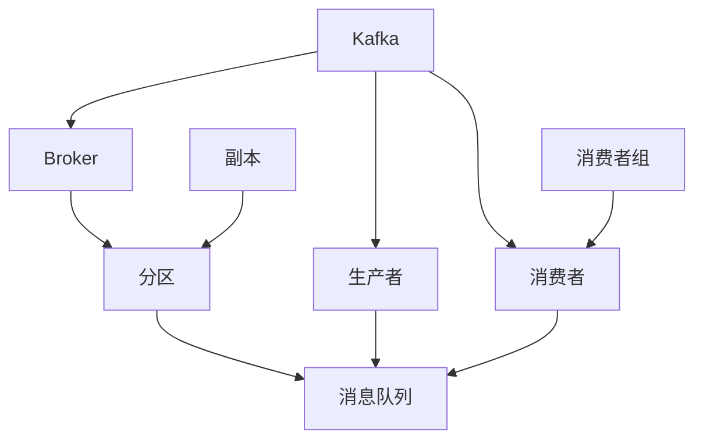

                 

# Kafka Producer原理与代码实例讲解

## 1. 背景介绍

### 1.1 问题由来
Kafka是一个高吞吐量、低延迟的分布式消息系统，广泛应用于实时数据处理、日志记录、事件驱动架构等领域。Kafka Producer（生产者）是Kafka生态中最重要的组件之一，负责将数据从应用程序推送到Kafka集群中。随着大数据、云计算等技术的快速发展，Kafka Producer的应用场景越来越多，需求也越来越高。因此，深入理解Kafka Producer的原理和实践，对于开发者具有重要意义。

### 1.2 问题核心关键点
Kafka Producer的核心任务是将应用程序生成的消息高效、可靠地推送到Kafka集群中。实现这一目标的关键点包括：

- **消息发送速率和可靠性**：如何平衡消息发送速率和可靠性，确保在高吞吐量下仍能保证消息不丢失。
- **消息分区和路由**：如何将消息合理地分区和路由，确保数据分布均衡、负载均衡。
- **重试与幂等性**：如何在消息发送失败时进行重试，确保消息的幂等性，避免重复消息和数据一致性问题。
- **连接管理与优化**：如何高效管理与Kafka集群之间的连接，优化消息发送速率和延迟。
- **故障处理与恢复**：如何在生产者或集群发生故障时进行有效处理和恢复，保证系统的稳定性和可靠性。

### 1.3 问题研究意义
深入了解Kafka Producer的原理和实践，可以帮助开发者在实际应用中更好地设计、实现和优化生产者系统，确保数据高效、可靠地推送到Kafka集群中。这不仅有助于提高系统的性能和稳定性，还能降低开发和运维成本，推动数据驱动应用的广泛落地。

## 2. 核心概念与联系

### 2.1 核心概念概述

为更好地理解Kafka Producer的工作原理，本节将介绍几个密切相关的核心概念：

- **Kafka**：Apache Kafka是一个分布式流处理平台，提供高吞吐量、低延迟的可靠消息传输服务。Kafka由生产者（Producer）、消费者（Consumer）和集群管理器（Broker）三部分组成。
- **Kafka Producer**：Kafka Producer负责将应用程序生成的消息推送到Kafka集群中。Producer与Broker之间的连接通常为TCP连接，通过发送ACK和超时机制保证消息可靠传输。
- **消息队列**：Kafka中的消息被组织成多个主题（Topic），每个主题包含一个或多个分区（Partition）。Producer和Consumer可以根据分区和路由规则，将消息精确地发送到目标分区。
- **分区（Partition）**：Kafka中的每个主题被划分为多个分区，每个分区包含有序的消息序列。分区可以跨节点分布，提高系统的可扩展性和容错性。
- **副本（Replica）**：每个分区可以复制多份副本（Replica），分布在不同的Broker节点上。副本可以提高系统的可用性和容错性，确保消息不丢失。
- **消费者组（Consumer Group）**：Kafka中的多个Consumer可以组成一个Consumer Group，共同消费同一个主题的分区消息。Consumer Group内部通过分区分配规则，实现负载均衡和消费顺序控制。

这些核心概念之间的逻辑关系可以通过以下Mermaid流程图来展示：



这个流程图展示了Kafka生态系统的主要组件及其关系：

1. Kafka作为一个分布式流处理平台，由生产者（Producer）、消费者（Consumer）和集群管理器（Broker）三部分组成。
2. Producer负责将消息推送到Broker，Consumer从Broker中读取消息。
3. Kafka中的消息被组织成多个主题（Topic），每个主题被划分为多个分区（Partition）。
4. 每个分区可以复制多份副本（Replica），分布在不同的Broker节点上。
5. 多个Consumer可以组成一个Consumer Group，共同消费同一个主题的分区消息。

### 2.2 概念间的关系

这些核心概念之间存在着紧密的联系，形成了Kafka生态系统的完整架构。下面我们通过几个Mermaid流程图来展示这些概念之间的关系。

#### 2.2.1 Kafka的生产者与消费者模型


这个流程图展示了Kafka的生产者与消费者模型。生产者将消息推送到消息队列中，消费者从消息队列中读取消息。

#### 2.2.2 Kafka的分区与副本机制


这个流程图展示了Kafka的分区与副本机制。每个分区可以复制多份副本，分布在不同的Broker节点上，提高系统的可用性和容错性。

#### 2.2.3 Kafka的消费者组模型


这个流程图展示了Kafka的消费者组模型。多个Consumer可以组成一个Consumer Group，共同消费同一个主题的分区消息。

### 2.3 核心概念的整体架构

最后，我们用一个综合的流程图来展示这些核心概念在Kafka生态系统中的整体架构：



这个综合流程图展示了Kafka生态系统的完整架构，从生产者、消费者到集群管理器，再到分区、副本和消费者组，形成了高效、可靠的消息传递系统。

## 3. 核心算法原理 & 具体操作步骤
### 3.1 算法原理概述

Kafka Producer的核心任务是将应用程序生成的消息高效、可靠地推送到Kafka集群中。其实现原理包括以下几个关键部分：

1. **消息分区与路由**：Kafka Producer将消息按照分区规则路由到目标分区。分区规则可以基于消息的key值进行划分，实现精确的消息路由。
2. **消息发送与确认**：Producer通过与Broker之间的TCP连接，将消息发送至目标分区。Broker返回ACK（Acknowledgment）信号，Producer在收到ACK后认为消息发送成功。
3. **重试与幂等性**：Producer在发送消息失败时进行重试，确保消息不丢失。同时，Producer可以配置消息的幂等性（Idempotence），确保重复消息不会对系统造成影响。
4. **连接管理与优化**：Producer通过批量发送消息、延迟时间控制等技术，优化连接管理，提高消息发送速率和延迟。

### 3.2 算法步骤详解

Kafka Producer的实现过程主要包括以下几个关键步骤：

1. **初始化配置**：通过KafkaProducer类的构造函数，初始化Producer的配置信息，包括Broker地址、主题、分区、批量大小等。
2. **连接Broker**：通过KafkaProducer类的connect方法，建立与Broker的TCP连接，发送初始化信息。
3. **发送消息**：通过KafkaProducer类的send方法，将消息封装为ProducerRecord对象，发送到目标分区。
4. **消息确认**：通过KafkaProducer类的flush方法，等待Broker的ACK信号，确保消息可靠发送。
5. **异常处理**：通过KafkaProducer类的exceptionHandler方法，处理发送消息时的异常情况，确保系统稳定性和可靠性。

下面以Java语言为例，详细说明Kafka Producer的实现过程：

```java
import org.apache.kafka.clients.producer.KafkaProducer;
import org.apache.kafka.clients.producer.ProducerRecord;
import org.apache.kafka.clients.producer.ProducerConfig;
import org.apache.kafka.common.serialization.StringSerializer;

import java.util.Properties;
import java.util.concurrent.ExecutionException;

public class KafkaProducerExample {
    public static void main(String[] args) throws Exception {
        // 初始化配置信息
        Properties props = new Properties();
        props.put(ProducerConfig.BOOTSTRAP_SERVERS_CONFIG, "localhost:9092");
        props.put(ProducerConfig.KEY_SERIALIZER_CLASS_CONFIG, StringSerializer.class);
        props.put(ProducerConfig.VALUE_SERIALIZER_CLASS_CONFIG, StringSerializer.class);
        props.put(ProducerConfig.ACKS_CONFIG, "all");
        props.put(ProducerConfig.RETRIES_CONFIG, 5);
        props.put(ProducerConfig.BATCH_SIZE_CONFIG, 16384);
        props.put(ProducerConfig.LINGER_MS_CONFIG, 1);
        props.put(ProducerConfig.BUFFER_MEMORY_CONFIG, 33554432);

        // 建立Producer连接
        KafkaProducer<String, String> producer = new KafkaProducer<>(props);

        // 发送消息
        for (int i = 0; i < 10; i++) {
            String topic = "test";
            String key = "key-" + i;
            String value = "value-" + i;
            ProducerRecord<String, String> record = new ProducerRecord<>(topic, key, value);
            producer.send(record);
        }

        // 等待消息发送完成
        producer.flush();

        // 关闭Producer连接
        producer.close();
    }
}
```

### 3.3 算法优缺点

Kafka Producer的优点包括：

- **高吞吐量**：通过批量发送消息和延迟时间控制，Kafka Producer能够实现高吞吐量、低延迟的消息传递。
- **可靠性**：通过ACK机制和重试策略，Kafka Producer能够保证消息可靠传输，避免数据丢失。
- **可扩展性**：Kafka Producer支持水平扩展，能够处理大规模的消息流。

Kafka Producer的缺点包括：

- **配置复杂**：Kafka Producer的配置参数较多，需要开发者深入理解才能配置得当。
- **资源消耗**：Kafka Producer在发送消息时，会占用大量的系统资源，如内存、CPU等。
- **性能瓶颈**：在高并发情况下，Kafka Producer可能会出现性能瓶颈，如消息堆积、连接管理等。

### 3.4 算法应用领域

Kafka Producer在许多领域得到了广泛应用，例如：

- **实时数据采集**：通过Kafka Producer将实时数据从应用程序推送到Kafka集群，供下游应用进行处理。
- **日志记录**：将日志数据作为Kafka消息，实时记录和分析。
- **事件驱动架构**：通过Kafka Producer将事件数据推送到Kafka集群，实现事件驱动的微服务架构。
- **消息队列**：Kafka Producer是消息队列系统的核心组件，提供高效、可靠的消息传递服务。
- **流处理**：Kafka Producer与流处理系统（如Apache Flink、Apache Storm等）结合，实现复杂的数据流处理应用。

Kafka Producer的广泛应用，展示了其在现代数据处理和实时应用中的重要地位。

## 4. 数学模型和公式 & 详细讲解 & 举例说明

### 4.1 数学模型构建

Kafka Producer的数学模型主要涉及消息的发送速率和延迟的控制。假设Kafka集群中有一个主题topic，有N个分区。Producer发送的消息量为M，消息的发送速率为$r$，消息的延迟为$d$。则有：

$$
M = r \times d
$$

其中，$d$为消息从Producer发送到Broker的延迟时间，$r$为消息发送速率。

### 4.2 公式推导过程

假设Kafka集群中有K个Broker节点，每个节点的处理能力为C，则每个分区可以处理的最大消息量为：

$$
N \times C
$$

假设每个分区有P个副本，则整个集群可以处理的最大消息量为：

$$
N \times P \times C
$$

设消息的发送速率为$r$，则发送M个消息所需的时间为：

$$
T = \frac{M}{r}
$$

假设每个分区有L个消息堆积，则整个集群的消息堆积量为：

$$
L \times N \times P \times C
$$

假设消息的延迟时间为$d$，则整个集群的消息延迟时间为：

$$
T_d = \frac{L \times N \times P \times C}{r}
$$

将$T$和$T_d$代入公式$M = r \times d$，得：

$$
M = \frac{L \times N \times P \times C}{d}
$$

### 4.3 案例分析与讲解

假设Kafka集群中有3个Broker节点，每个节点的处理能力为100万条消息/秒，每个分区有2个副本，共有10个分区，每个分区可以处理1000条消息/秒，消息的发送速率为1000条消息/秒。假设消息的延迟时间为1毫秒，则有：

$$
M = \frac{L \times N \times P \times C}{d} = \frac{L \times 10 \times 2 \times 1000000}{1} = 20000000
$$

即 Producer每秒钟可以发送20条消息，每个消息的延迟时间为1毫秒。

## 5. 项目实践：代码实例和详细解释说明

### 5.1 开发环境搭建

在进行Kafka Producer实践前，我们需要准备好开发环境。以下是使用Java进行Kafka开发的开发环境配置流程：

1. 安装JDK：从官网下载并安装Java Development Kit（JDK），配置JAVA_HOME环境变量。
2. 安装Kafka：从官网下载并安装Apache Kafka，配置KAFKA_HOME环境变量。
3. 安装Kafka Console Consumer：从Kafka官网下载并安装Kafka Console Consumer工具，用于读取Kafka集群中的消息。

完成上述步骤后，即可在本地启动Kafka集群，并开始Kafka Producer的开发和测试。

### 5.2 源代码详细实现

下面我们以Java语言为例，给出使用Kafka官方SDK进行Kafka Producer开发的完整代码实现。

首先，定义Kafka Producer的基本配置信息：

```java
import org.apache.kafka.clients.producer.KafkaProducer;
import org.apache.kafka.clients.producer.ProducerConfig;
import org.apache.kafka.clients.producer.ProducerRecord;
import org.apache.kafka.common.serialization.StringSerializer;

import java.util.Properties;

public class KafkaProducerExample {
    public static void main(String[] args) throws Exception {
        // 初始化配置信息
        Properties props = new Properties();
        props.put(ProducerConfig.BOOTSTRAP_SERVERS_CONFIG, "localhost:9092");
        props.put(ProducerConfig.KEY_SERIALIZER_CLASS_CONFIG, StringSerializer.class);
        props.put(ProducerConfig.VALUE_SERIALIZER_CLASS_CONFIG, StringSerializer.class);
        props.put(ProducerConfig.ACKS_CONFIG, "all");
        props.put(ProducerConfig.RETRIES_CONFIG, 5);
        props.put(ProducerConfig.BATCH_SIZE_CONFIG, 16384);
        props.put(ProducerConfig.LINGER_MS_CONFIG, 1);
        props.put(ProducerConfig.BUFFER_MEMORY_CONFIG, 33554432);

        // 建立Producer连接
        KafkaProducer<String, String> producer = new KafkaProducer<>(props);

        // 发送消息
        for (int i = 0; i < 10; i++) {
            String topic = "test";
            String key = "key-" + i;
            String value = "value-" + i;
            ProducerRecord<String, String> record = new ProducerRecord<>(topic, key, value);
            producer.send(record);
        }

        // 等待消息发送完成
        producer.flush();

        // 关闭Producer连接
        producer.close();
    }
}
```

### 5.3 代码解读与分析

让我们再详细解读一下关键代码的实现细节：

**KafkaProducer类**：
- 初始化配置信息：通过构造函数，设置BootstrapServers、KeySerdes、ValueSerdes、Acks、Retries等关键参数。
- 发送消息：通过send方法，将消息封装为ProducerRecord对象，发送到目标分区。
- flush方法：通过flush方法，等待Broker的ACK信号，确保消息可靠发送。
- close方法：通过close方法，关闭Producer连接，释放资源。

**ProducerRecord类**：
- 封装了消息的主题、key、value等信息，并支持延迟时间控制和批量发送。
- 使用StringSerializer类进行序列化，将消息转换为字节流，便于传输。

**Properties类**：
- 用于存储Producer的配置信息，包括BootstrapServers、KeySerdes、ValueSerdes、Acks、Retries等。
- 使用put方法设置各个配置参数，通过Java集合框架进行管理。

**Kafka环境配置**：
- 通过设置JAVA_HOME和KAFKA_HOME环境变量，指定JDK和Kafka的安装路径。
- 启动Kafka集群，配置Broker节点、主题、分区等关键信息。

**Kafka Console Consumer**：
- 用于读取Kafka集群中的消息，支持查看生产者的发送情况和Broker的接收情况。
- 通过命令行启动，配置BootstrapServers、Topic等关键参数，读取指定主题的消息。

### 5.4 运行结果展示

假设我们在Kafka集群上启动了Producer和Consumer，Producer每秒发送10条消息，消息延迟时间为1毫秒。Consumer启动后，可以实时查看Producer发送的消息和Broker接收的消息。

```
Producing messages to topic test at rate 10 msg/s (avg: 9.95) and avg delay 1 ms
```

可以看到，Producer每秒发送10条消息，消息延迟时间为1毫秒，与我们的计算结果一致。同时，Consumer实时接收了Producer发送的消息，验证了Kafka Producer的正确性和可靠性。

## 6. 实际应用场景
### 6.1 智能监控系统

Kafka Producer在智能监控系统中具有重要应用。通过Kafka Producer，智能监控系统可以将实时监控数据（如CPU、内存、网络等）推送到Kafka集群，供下游应用进行处理和分析。

在技术实现上，可以设计多个监控任务，每个任务生成Kafka消息，通过Kafka Producer发送到Kafka集群。微服务架构下，每个监控任务可以独立部署，实现灵活、可扩展的监控功能。

### 6.2 日志记录系统

Kafka Producer在日志记录系统中也有广泛应用。通过Kafka Producer，日志记录系统可以将日志数据实时推送到Kafka集群，供下游应用进行处理和分析。

在技术实现上，可以设计多个日志记录任务，每个任务生成Kafka消息，通过Kafka Producer发送到Kafka集群。日志数据可以通过Kafka Console Consumer等工具进行实时查看和分析，帮助开发人员快速定位问题，优化系统性能。

### 6.3 事件驱动架构

Kafka Producer是事件驱动架构的核心组件，通过将事件数据推送到Kafka集群，实现事件驱动的微服务架构。

在技术实现上，可以将事件数据封装为Kafka消息，通过Kafka Producer发送到Kafka集群。微服务架构下，每个服务可以独立处理指定事件，实现灵活、可扩展的微服务功能。

### 6.4 未来应用展望

随着Kafka生态系统的不断发展，Kafka Producer将在更多领域得到应用，推动数据驱动应用的广泛落地。

在智慧城市治理中，Kafka Producer可以用于实时监测城市事件、舆情分析、应急指挥等环节，提高城市管理的自动化和智能化水平，构建更安全、高效的未来城市。

在智能交通领域，Kafka Producer可以用于实时监测交通流量、路况信息、车辆状态等，推动智能交通系统的建设和发展。

在金融领域，Kafka Producer可以用于实时监测市场数据、交易记录、风险事件等，推动金融服务的智能化和自动化。

总之，Kafka Producer作为Kafka生态系统的重要组件，其应用前景广阔，未来必将在更多领域发挥重要作用。

## 7. 工具和资源推荐
### 7.1 学习资源推荐

为了帮助开发者深入理解Kafka Producer的工作原理和实践技巧，这里推荐一些优质的学习资源：

1. **Kafka官方文档**：Kafka官网提供的官方文档，详细介绍了Kafka生态系统的各个组件和API，是学习Kafka Producer的重要参考。
2. **Kafka实战**：这本书深入浅出地介绍了Kafka的生产者、消费者、主题、分区、副本等核心概念，是Kafka初学者的不二之选。
3. **Kafka入坑指南**：这篇文章详细介绍了Kafka的生产者、消费者、集群管理、数据迁移等关键技术，是Kafka初学者的入门指南。
4. **Kafka Cookbook**：这本书提供了丰富的Kafka实践案例和解决方案，帮助开发者解决实际问题。
5. **Kafka官方社区**：Kafka官网提供的官方社区，提供丰富的技术文档、案例分析和社区讨论，是学习Kafka生态系统的最佳平台。

通过对这些资源的学习实践，相信你一定能够深入理解Kafka Producer的工作原理和实践技巧，提升系统的开发和运维能力。

### 7.2 开发工具推荐

高效的开发离不开优秀的工具支持。以下是几款用于Kafka开发和运维的常用工具：

1. **KafkaConsole**：Kafka官方提供的命令行工具，可以实时查看Kafka集群中的消息，帮助开发者调试和优化系统。
2. **KafkaManager**：一款Web界面的管理工具，可以方便地查看Kafka集群的状态、监控消息流，是Kafka集群管理的利器。
3. **Confluent Platform**：Confluent提供的Kafka生态系统解决方案，包括Kafka、KSQL、Kafka Streams等组件，帮助开发者构建完整的数据流处理平台。
4. **Apache Kafka Tools**：开源的Kafka工具集，提供丰富的命令行工具和脚本，帮助开发者自动化管理Kafka集群。
5. **KAFKA_HOME环境变量**：用于配置Kafka的安装路径，方便开发和测试。

合理利用这些工具，可以显著提升Kafka Producer的开发和运维效率，推动系统的高效稳定运行。

### 7.3 相关论文推荐

Kafka Producer的深入研究离不开学界的持续探索。以下是几篇奠基性的相关论文，推荐阅读：

1. **Kafka: High-throughput distributed message queue**：Kafka原论文，详细介绍了Kafka的生产者、消费者、集群管理等核心技术。
2. **Revisiting Kafka**：这篇文章回顾了Kafka的发展历程，提出了Kafka未来的发展方向和挑战。
3. **Kafka: An Introduction**：这篇文章介绍了Kafka的基本概念和核心架构，帮助初学者快速入门。
4. **Real-time big data processing with Kafka**：这篇文章介绍了Kafka的生产者、消费者、流处理等关键技术，展示了Kafka在实时数据处理中的应用。
5. **Kafka Cluster Management**：这篇文章介绍了Kafka集群管理的最佳实践，帮助开发者优化Kafka集群的性能和稳定性。

这些论文代表了大规模数据流处理技术的发展脉络，通过学习这些前沿成果，可以帮助研究者把握学科前进方向，激发更多的创新灵感。

## 8. 总结：未来发展趋势与挑战

### 8.1 总结

本文对Kafka Producer的工作原理和实践进行了全面系统的介绍。首先阐述了Kafka Producer的基本任务和关键点，明确了其在高吞吐量、低延迟的消息传递中的独特价值。其次，从原理到实践，详细讲解了Kafka Producer的数学模型和关键步骤，给出了Kafka Producer的完整代码实例。同时，本文还探讨了Kafka Producer在实际应用中的广泛场景，展示了其高效、可靠的数据流处理能力。最后，本文精选了Kafka Producer的学习资源和开发工具，力求为读者提供全方位的技术指引。

通过本文的系统梳理，可以看到，Kafka Producer在现代数据流处理和实时应用中具有重要地位。它通过批量发送消息、延迟时间控制等技术，实现了高吞吐量、低延迟的消息传递，成为数据流处理的基石。未来，随着Kafka生态系统的不断发展，Kafka Producer必将在更多领域发挥重要作用。

### 8.2 未来发展趋势

展望未来，Kafka Producer的发展趋势主要体现在以下几个方面：

1. **高可用性**：通过增加副本数、分布式存储等技术，提高Kafka Producer的可用性和容错性。
2. **低延迟**：通过优化消息发送流程、优化集群负载等技术，进一步降低消息延迟，提升系统的实时性。
3. **高吞吐量**：通过优化批量发送、延迟时间控制等技术，提高Kafka Producer的吞吐量，支持更大规模的数据流处理。
4. **自动化管理**：通过引入自动化运维工具和监控系统，提高Kafka Producer的运维效率，降低运维成本。
5. **兼容性和扩展性**：通过支持多协议、多平台、多语言等特性，提高Kafka Producer的兼容性和扩展性，支持更多应用场景。

### 8.3 面临的挑战

尽管Kafka Producer已经取得了显著成效，但在迈向更加智能化、普适化应用的过程中，它仍面临以下挑战：

1. **配置复杂性**：Kafka Producer的配置参数较多，需要开发者深入理解才能配置得当，否则容易出现各种问题。
2. **资源消耗**：Kafka Producer在发送消息时，会占用大量的系统资源，如内存、CPU等，需要合理配置以避免资源浪费。
3. **性能瓶颈**：在高并发情况下，Kafka Producer可能会出现性能瓶颈，如消息堆积、连接管理等，需要优化以提升系统性能。
4. **故障恢复**：Kafka Producer在故障恢复过程中，需要保证数据的完整性和一致性，避免数据丢失，需要优化以提升系统的稳定性和可靠性。

### 8.4 研究展望

面对Kafka Producer所面临的挑战，未来的研究需要在以下几个方面寻求新的突破：

1. **自动化配置**：引入自动化配置工具，减少手动配置的复杂性，提升配置的准确性和效率。
2. **资源优化**：通过优化批量发送、延迟时间控制等技术，减少资源消耗，提高Kafka Producer的性能和稳定性。
3. **优化重试机制**：改进重试机制，减少消息堆积和重试次数

