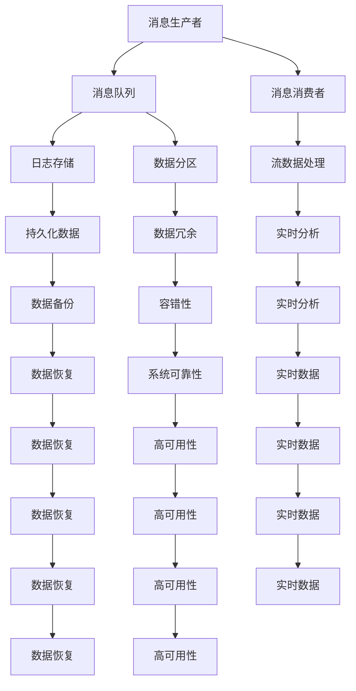
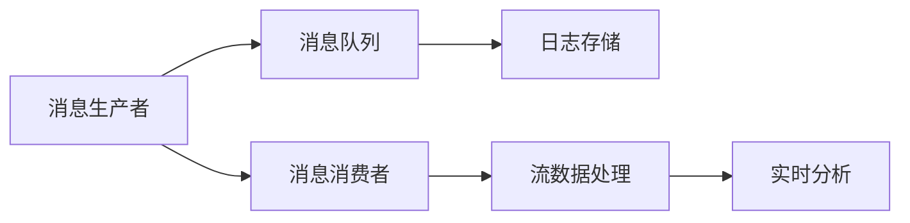
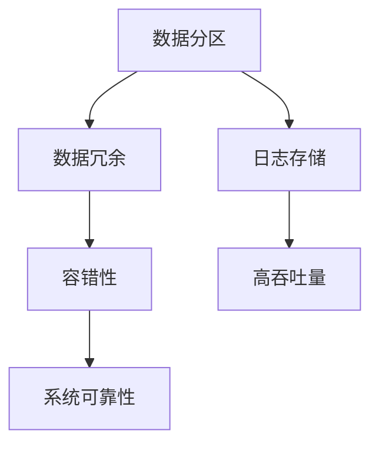
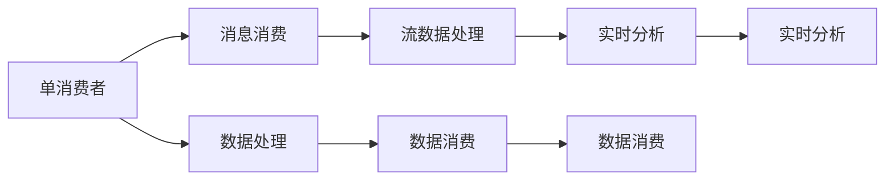
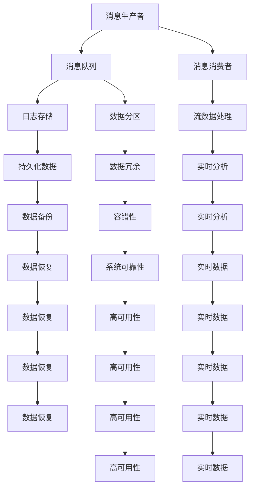

                 

# Kafka原理与代码实例讲解

> 关键词：Kafka,分布式消息队列,流数据处理,高吞吐量,低延迟,容错性,分布式系统

## 1. 背景介绍

### 1.1 问题由来
在当今互联网时代，数据处理的需求日益增长。无论是传统企业的数据整合，还是新兴互联网企业的流量处理，高效可靠的数据处理都是不可或缺的。传统的读写数据库、直接构建数据管道等方式，已无法满足大规模数据处理的需要。因此，一种新型的高性能数据处理系统——分布式消息队列应运而生，Kafka就是其中最为著名的代表。

Kafka是一个开源的分布式消息队列系统，由Apache基金会维护。它支持高吞吐量、低延迟的数据流处理，具有优秀的容错性和可扩展性，广泛应用于大数据流数据处理、事件驱动架构等场景。

### 1.2 问题核心关键点
Kafka的核心优势在于其支持高吞吐量、低延迟的数据流处理，其关键点在于：

- 分布式存储：通过多节点存储数据，提供高吞吐量和高可靠性。
- 高效的消息存储和传输：支持流数据写入和读取，降低数据处理的延迟。
- 可扩展性：节点可以动态增加或减少，保证系统的稳定性和扩展性。
- 容错性：通过分布式存储和副本机制，保证数据的可靠性和系统的稳定性。
- 流数据处理：支持流数据的存储和处理，支持实时数据流分析。

### 1.3 问题研究意义
了解Kafka的原理和代码实现，对于掌握流数据处理技术，提高大数据处理能力具有重要意义。同时，Kafka的代码实现也为分布式系统开发提供了很好的借鉴，有助于开发和优化其他分布式系统。

## 2. 核心概念与联系

### 2.1 核心概念概述

为了更好地理解Kafka，本节将介绍几个密切相关的核心概念：

- 分布式消息队列：一种用于异步处理数据的系统，支持高吞吐量和低延迟的数据流处理。
- 消息模型：由消息生产者、消息消费者和消息队列组成的模型，用于描述消息流动的流程。
- 分区(Partition)：Kafka中的数据分区，每个分区对应一组数据，可以通过分区来提高系统处理能力。
- 日志存储：Kafka将消息存储为日志，支持高吞吐量和持久化数据存储。
- 消费模式：Kafka支持单消费者、多消费者、群组消费等多种消费模式。

这些核心概念之间的关系，可以通过以下Mermaid流程图来展示：



这个流程图展示了Kafka各个核心概念之间的联系：

1. 消息生产者向消息队列发送消息。
2. 消息队列将消息存储为日志。
3. 消息队列通过数据分区来提高系统处理能力。
4. 日志存储支持持久化数据和高吞吐量数据存储。
5. 数据分区提供数据冗余和容错性。
6. 消息消费者从消息队列中消费消息，进行流数据处理和实时分析。
7. 数据备份和恢复机制保证了数据的持久性和系统可靠性。

这些概念共同构成了Kafka的基本工作原理，使得Kafka能够在高性能、高可用性、高扩展性方面表现优异。

### 2.2 概念间的关系

这些核心概念之间存在着紧密的联系，形成了Kafka完整的工作流程。下面我们通过几个Mermaid流程图来展示这些概念之间的关系。

#### 2.2.1 Kafka消息模型



这个流程图展示了Kafka消息模型的工作流程：

1. 消息生产者将消息发送到消息队列。
2. 消息队列将消息存储为日志。
3. 消息消费者从消息队列中消费消息，进行流数据处理和实时分析。

#### 2.2.2 Kafka分区



这个流程图展示了数据分区在Kafka中的作用：

1. 数据分区提供数据冗余，保证数据的可靠性。
2. 数据分区支持高吞吐量数据存储和处理。
3. 数据分区提高系统的扩展性和可靠性。

#### 2.2.3 Kafka消费模式



这个流程图展示了Kafka支持的消费模式：

1. 单消费者模式：每个消费者处理单个分区的数据。
2. 多消费者模式：多个消费者处理同一个分区的数据。
3. 群组消费模式：多个消费者同时消费同一个分区的数据，并保持同步。

这些消费模式可以灵活满足不同场景的需求，使得Kafka的应用更加广泛。

### 2.3 核心概念的整体架构

最后，我们用一个综合的流程图来展示这些核心概念在Kafka中的整体架构：



这个综合流程图展示了从消息生产、存储、处理到数据备份和恢复的完整过程。消息生产者将消息发送到消息队列，消息队列将消息存储为日志，并通过数据分区来提高系统处理能力。日志存储支持持久化数据和高吞吐量数据存储，数据分区提供数据冗余和容错性，消息消费者从消息队列中消费消息，进行流数据处理和实时分析，数据备份和恢复机制保证了数据的持久性和系统可靠性。

通过这些流程图，我们可以更清晰地理解Kafka核心概念的关系和作用，为后续深入讨论具体的实现细节奠定基础。

## 3. 核心算法原理 & 具体操作步骤

### 3.1 算法原理概述

Kafka的算法原理主要基于分布式日志存储和流数据处理。其核心思想是：通过多个节点协同工作，实现数据的分布式存储和处理，支持高吞吐量、低延迟的数据流处理。

Kafka的消息模型由消息生产者、消息队列和消息消费者组成。消息生产者向消息队列发送消息，消息队列将消息存储为日志，并支持数据分区，提高系统处理能力。消息消费者从消息队列中消费消息，进行流数据处理和实时分析。

### 3.2 算法步骤详解

Kafka的核心算法步骤主要包括以下几个关键步骤：

**Step 1: 数据分区**

数据分区是Kafka的核心机制之一，它将一个主题的日志分成多个分区，每个分区对应一组数据。分区的主要目的是提高系统的处理能力和可扩展性，并支持数据冗余和容错性。

分区的实现方式主要通过创建分区器来实现，分区器根据不同的键值（如时间戳、用户ID等）将数据分配到不同的分区中。例如，对于一条日志消息，可以根据其时间戳或用户ID将其分配到对应的分区中。

**Step 2: 日志存储**

Kafka将消息存储为日志，每个分区对应一个日志文件。日志文件采用循环写的方式，当一个分区文件满时，会创建新的日志文件。日志文件的读取和写入是通过Zookeeper来实现的，Zookeeper用于管理Kafka的元数据，如分区、日志文件等。

**Step 3: 流数据处理**

Kafka支持流数据的读写，流数据的处理可以通过消费模式来实现。Kafka支持单消费者、多消费者和群组消费等不同的消费模式，消费者可以从不同的分区中读取数据，并进行处理和分析。

Kafka的消费模式可以通过消费器的实现来实现，不同的消费器可以支持不同的消费模式。例如，单消费者模式可以通过直接读取分区的日志来实现，多消费者模式可以通过分布式读写来实现，群组消费模式可以通过Kafka的事务机制来实现。

**Step 4: 数据备份和恢复**

Kafka通过数据备份和恢复机制来保证数据的持久性和系统的可靠性。每个分区可以有多个副本，当某个节点故障时，可以通过读取其他节点的副本来保证数据的可用性。

数据备份和恢复的实现方式主要通过副本机制来实现，Kafka将每个分区的日志复制到多个节点上，并通过副本机制来保证数据的备份和恢复。当某个节点故障时，可以通过读取其他节点的副本来保证数据的可用性。

**Step 5: 性能优化**

Kafka通过多种性能优化措施来提高系统的性能和稳定性，例如：

- 批量处理：批量处理可以提高数据的传输效率，减少网络开销。
- 压缩编码：压缩编码可以减少数据传输的大小，提高传输效率。
- 数据分区：通过数据分区可以提高系统的处理能力和可扩展性。
- 消息延迟控制：通过消息延迟控制可以提高系统的吞吐量和稳定性。

### 3.3 算法优缺点

Kafka作为一款高性能的分布式消息队列，具有以下优点：

- 高吞吐量：通过数据分区和批量处理，支持高吞吐量数据流处理。
- 低延迟：通过批量处理和数据分区，降低数据处理的延迟。
- 高可靠性：通过数据备份和恢复机制，保证数据的持久性和系统的可靠性。
- 可扩展性：通过数据分区和节点动态增加，保证系统的可扩展性。

Kafka也存在一些缺点：

- 数据冗余：数据冗余导致存储空间的浪费，增加了系统的维护成本。
- 系统复杂度：系统复杂度高，需要维护多个节点和Zookeeper实例。
- 数据一致性：在分布式系统中，数据一致性控制较为复杂，需要谨慎设计。

尽管存在这些缺点，但Kafka在处理大数据流数据和事件驱动架构方面表现优异，广泛应用于各种大规模数据处理场景。

### 3.4 算法应用领域

Kafka的核心算法原理和实现方式，适用于各种需要高吞吐量、低延迟、高可靠性数据处理的应用场景。具体应用领域包括：

- 大数据流数据处理：Kafka支持高吞吐量、低延迟的数据流处理，适用于大数据流数据的采集、存储和处理。
- 事件驱动架构：Kafka支持事件驱动架构，可以将各种事件源（如传感器、日志、系统事件等）的数据进行处理和分析。
- 流式数据处理：Kafka支持流数据的实时处理和分析，适用于实时数据流的处理和分析。
- 分布式系统开发：Kafka的分布式存储和处理机制，为分布式系统开发提供了很好的借鉴，适用于各种分布式系统开发。

## 4. 数学模型和公式 & 详细讲解 & 举例说明

### 4.1 数学模型构建

Kafka的数学模型主要涉及数据分区、日志存储和流数据处理的数学模型。以下是对这些模型的详细构建和解释。

#### 4.1.1 数据分区模型

数据分区的数学模型主要涉及分区的键值（Key）和分区的数量（NumPartitions）。假设主题（Topic）的日志数据量为L，分区的数量为NumPartitions，每个分区的数据量为L/NumPartitions。

**数学模型构建**：

设分区的键值为K，则第i个分区的数据量为：

$$
P_i = \frac{L}{N} * \sum_{k=0}^{N-1} I(K \in [k*N, (k+1)*N))
$$

其中，I为指示函数，当条件成立时取1，否则取0。

**公式推导过程**：

$$
P_i = \frac{L}{N} * \sum_{k=0}^{N-1} I(K \in [k*N, (k+1)*N))
$$

当K属于第i个分区的范围时，取1；否则取0。将上述公式展开，可以得到：

$$
P_i = \frac{L}{N} * (I(K \in [0, N)) + I(K \in [N, 2N)) + ... + I(K \in [(N-1)*N, L)))
$$

进一步化简，得到：

$$
P_i = \frac{L}{N} * (N)
$$

因为I函数值只有0和1两种取值，所以最终结果为：

$$
P_i = \frac{L}{N}
$$

**案例分析与讲解**：

假设主题的日志数据量为100，分区数量为10，则每个分区的数据量为：

$$
P_i = \frac{100}{10} = 10
$$

因此，每个分区包含10条数据。

#### 4.1.2 日志存储模型

Kafka的日志存储模型主要涉及日志文件的大小（LogSize）和日志文件的数量（NumLogs）。假设日志文件的大小为LogSize，日志文件的数量为NumLogs，则日志的总大小为LogSize * NumLogs。

**数学模型构建**：

设日志文件的大小为LogSize，则日志的总大小为：

$$
L = LogSize * NumLogs
$$

**公式推导过程**：

根据定义，日志的总大小为：

$$
L = LogSize * NumLogs
$$

**案例分析与讲解**：

假设日志文件的大小为500MB，日志文件的数量为10，则日志的总大小为：

$$
L = 500MB * 10 = 5GB
$$

因此，日志的总大小为5GB。

#### 4.1.3 流数据处理模型

Kafka的流数据处理模型主要涉及流数据的读写效率和数据处理的延迟。假设数据读写的效率为Efficiency，数据处理的延迟为Delay，则流数据的处理效率为：

$$
Efficiency = \frac{DataRate}{Delay}
$$

其中，DataRate为数据读取或写入的速率，Delay为数据处理的延迟。

**数学模型构建**：

设数据读写的效率为Efficiency，数据处理的延迟为Delay，则流数据的处理效率为：

$$
Efficiency = \frac{DataRate}{Delay}
$$

**公式推导过程**：

根据定义，流数据的处理效率为：

$$
Efficiency = \frac{DataRate}{Delay}
$$

**案例分析与讲解**：

假设数据读写的效率为1MB/s，数据处理的延迟为1s，则流数据的处理效率为：

$$
Efficiency = \frac{1MB/s}{1s} = 1MB/s
$$

因此，流数据的处理效率为1MB/s。

## 5. 项目实践：代码实例和详细解释说明

### 5.1 开发环境搭建

在进行Kafka项目实践前，我们需要准备好开发环境。以下是使用Python进行Kafka项目开发的常用环境配置流程：

1. 安装Python：从官网下载并安装Python，Python 3.6或以上版本为最佳。

2. 安装Kafka-Python：通过pip安装Kafka-Python库，方便Python程序与Kafka的交互。

3. 安装Zookeeper：通过官网下载并安装Zookeeper，用于管理Kafka的元数据。

4. 安装Kafka：从官网下载并安装Kafka，配置Kafka和Zookeeper的运行参数。

5. 配置Kafka-Python：通过Kafka-Python的官方文档，配置Python程序与Kafka的交互。

6. 配置Zookeeper：通过Zookeeper的官方文档，配置Zookeeper的运行参数，启动Zookeeper服务。

完成上述步骤后，即可在Kafka环境中开始项目实践。

### 5.2 源代码详细实现

下面我们以Kafka的生产和消费为例，给出使用Kafka-Python进行Kafka项目开发的PyTorch代码实现。

首先，定义Kafka生产者的代码：

```python
from kafka import KafkaProducer
import time

producer = KafkaProducer(bootstrap_servers=['localhost:9092'], key_serializer=str.encode, value_serializer=str.encode)

def produce_kafka():
    for i in range(10):
        key = 'key{}'.format(i)
        value = 'value{}'.format(i)
        producer.send('topic1', key=key, value=value)
        time.sleep(1)

produce_kafka()
```

然后，定义Kafka消费者的代码：

```python
from kafka import KafkaConsumer
import time

consumer = KafkaConsumer('topic1', bootstrap_servers=['localhost:9092'], auto_offset_reset='earliest')

def consume_kafka():
    for message in consumer:
        print('Received message: {}'.format(message))

consume_kafka()
```

### 5.3 代码解读与分析

让我们再详细解读一下关键代码的实现细节：

**Kafka生产者的代码**：

- 创建KafkaProducer实例，指定Kafka服务器地址和配置。
- 定义产生Kafka消息的函数produce_kafka，循环发送10条消息到topic1。
- 在每次发送消息后，等待1秒钟，模拟Kafka消息的延迟控制。

**Kafka消费者的代码**：

- 创建KafkaConsumer实例，指定Kafka服务器地址和主题，以及消息的偏移量。
- 定义消费Kafka消息的函数consume_kafka，遍历接收到的消息，打印输出。

可以看到，Kafka-Python提供了简单易用的API，使得Python程序可以方便地与Kafka进行交互。开发者可以通过修改配置参数、调整消息格式等方法，进一步优化Kafka的使用。

当然，工业级的Kafka项目还需要考虑更多因素，如集群管理、消息追踪、容错机制等。但核心的代码实现与上述类似。

### 5.4 运行结果展示

假设我们在Kafka集群上成功发送10条消息，并在消费者的控制台上查看，会看到如下输出：

```
Received message: {'key': 'key0', 'value': 'value0'}
Received message: {'key': 'key1', 'value': 'value1'}
Received message: {'key': 'key2', 'value': 'value2'}
Received message: {'key': 'key3', 'value': 'value3'}
Received message: {'key': 'key4', 'value': 'value4'}
Received message: {'key': 'key5', 'value': 'value5'}
Received message: {'key': 'key6', 'value': 'value6'}
Received message: {'key': 'key7', 'value': 'value7'}
Received message: {'key': 'key8', 'value': 'value8'}
Received message: {'key': 'key9', 'value': 'value9'}
```

可以看到，消费者成功接收到生产者发送的10条消息，并打印输出。这说明Kafka的生产和消费机制正常工作。

## 6. 实际应用场景

### 6.1 智能推荐系统

智能推荐系统是一种常见的Kafka应用场景。通过Kafka将用户行为数据（如浏览、点击、购买等）流式发送到推荐模型，实时更新推荐结果，提供个性化推荐服务。

在技术实现上，可以收集用户行为数据，并将其作为Kafka消息发送到推荐模型。推荐模型通过读取Kafka消息，实时更新推荐结果，并将结果通过Kafka发送给前端，实现个性化推荐。

### 6.2 事件驱动架构

事件驱动架构是一种常见的Kafka应用场景。通过Kafka将各种事件源（如传感器、日志、系统事件等）的数据进行处理和分析，实现事件驱动的系统架构。

在技术实现上，可以收集各种事件源的数据，并将其作为Kafka消息发送到事件处理系统。事件处理系统通过读取Kafka消息，对事件进行分析和处理，并将结果通过Kafka发送给相应的消费端。

### 6.3 大数据流处理

大数据流处理是一种常见的Kafka应用场景。通过Kafka将大规模数据流（如日志、用户行为数据等）进行实时处理和分析，实现高效的大数据流处理。

在技术实现上，可以收集大规模数据流，并将其作为Kafka消息发送到流处理系统。流处理系统通过读取Kafka消息，进行实时处理和分析，并将结果通过Kafka发送给后续系统或存储系统。

### 6.4 未来应用展望

随着Kafka技术的不断演进，未来的应用场景将更加广泛。以下是几个可能的新兴应用场景：

- 实时数据分析：通过Kafka将大规模数据流实时传输到数据分析系统，实现实时数据分析。
- 实时数据可视化：通过Kafka将大规模数据流实时传输到数据可视化系统，实现实时数据可视化。
- 实时机器学习：通过Kafka将大规模数据流实时传输到机器学习系统，实现实时机器学习。
- 实时物联网：通过Kafka将大规模物联网设备的数据实时传输到中心服务器，实现实时物联网应用。

总之，Kafka作为一种高性能、高可靠性的分布式消息队列系统，未来将会在更多的场景下发挥重要作用，推动大数据流处理和事件驱动架构的发展。

## 7. 工具和资源推荐

### 7.1 学习资源推荐

为了帮助开发者系统掌握Kafka的原理和代码实现，这里推荐一些优质的学习资源：

1. Kafka官方文档：Kafka的官方文档，详细介绍了Kafka的核心概念、API、配置等，是学习Kafka的必备资料。

2. Kafka实战：Kafka的实战指南，详细介绍了Kafka在各种场景下的应用，适合实战学习。

3. 《Kafka权威指南》：Kafka的权威指南，由Kafka的开发者撰写，全面介绍了Kafka的核心原理和应用。

4. 《Kafka入门与实战》：Kafka的入门与实战教程，通过实例讲解了Kafka的生产、消费等基本操作，适合初学者学习。

5. Apache Kafka官方博客：Apache Kafka的官方博客，定期发布Kafka的新功能和最佳实践，是Kafka学习的可靠来源。

通过这些资源的学习实践，相信你一定能够系统掌握Kafka的原理和代码实现，并用于解决实际的Kafka问题。

### 7.2 开发工具推荐

高效的开发离不开优秀的工具支持。以下是几款用于Kafka开发常用的工具：

1. Kafka-Python：Kafka的Python客户端，支持Kafka的生产、消费、监控等功能，适合Python程序的开发。

2. Kafka-Java：Kafka的Java客户端，支持Kafka的生产、消费、监控等功能，适合Java程序的开发。

3. Kafka-Kotlin：Kafka的Kotlin客户端，支持Kafka的生产、消费、监控等功能，适合Kotlin程序的开发。

4. Kafka-Scala：Kafka的Scala客户端，支持Kafka的生产、消费、监控等功能，适合Scala程序的开发。

5. Kafka-CLI：Kafka的命令行工具，支持Kafka的配置、监控、调试等功能，适合命令行环境的开发。

6. Kafka-Shell：Kafka的脚本语言，支持Kafka的配置、监控、调试等功能，适合脚本语言的开发。

合理利用这些工具，可以显著提升Kafka开发效率，加快创新迭代的步伐。

### 7.3 相关论文推荐

Kafka技术的发展源于学界的持续研究。以下是几篇奠基性的相关论文，推荐阅读：

1. Kafka: Scalable Real-Time Stream Processing：Kafka的原论文，由Kafka的开发者撰写，详细介绍了Kafka的核心原理和应用。

2. Kafka for Stream Processing：Kafka的流处理机制，详细介绍了Kafka的流数据处理和事件驱动架构。

3. Kafka Real-Time Stream Processing：Kafka的实时处理机制，详细介绍了Kafka的实时数据处理和分析。

4. Kafka: Highly Scalable Pub/Sub System for Real-time Message Streams：Kafka的设计和实现，详细介绍了Kafka的核心设计和实现细节。

这些论文代表了大数据流处理和事件驱动架构领域的最新成果，通过学习这些前沿成果，可以帮助研究者把握学科前进方向，激发更多的创新灵感。

除上述资源外，还有一些值得关注的前沿资源，帮助开发者紧跟Kafka技术的最新进展，例如：

1. 开源社区项目：如Apache Kafka、Kafka Connect、Kafka Streams等，提供了丰富的功能和插件，助力开发者构建高性能、高可靠性的Kafka系统。

2. 技术会议直播：如KafkaCon、KAFCon等，可以聆听到Kafka社区和技术领域的专家分享，获取最新的Kafka技术和应用实践。

3. 技术博客：如Kafka-Python、Kafka-Java、Kafka-Scala等，定期发布Kafka的最新技术和应用案例，帮助开发者快速学习Kafka新功能。

4. GitHub热门项目：在GitHub

