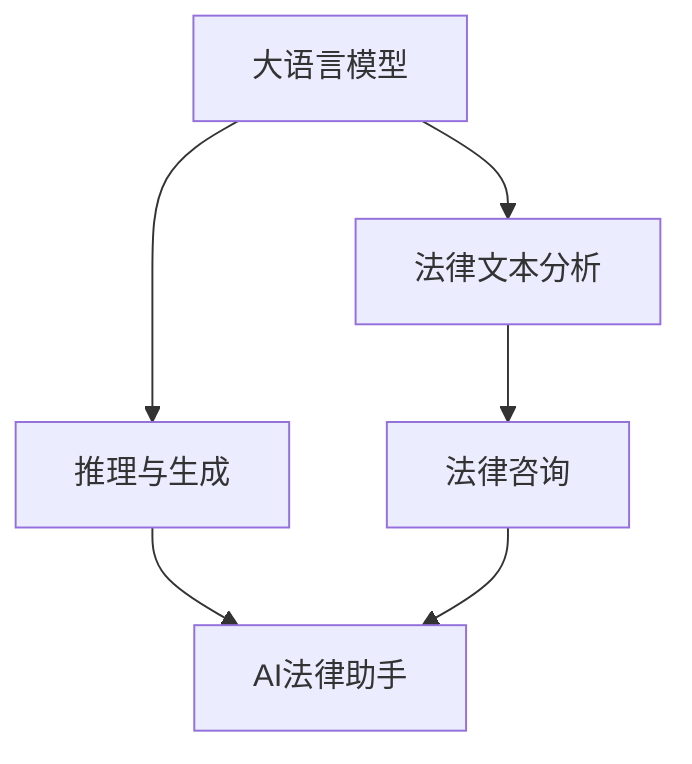
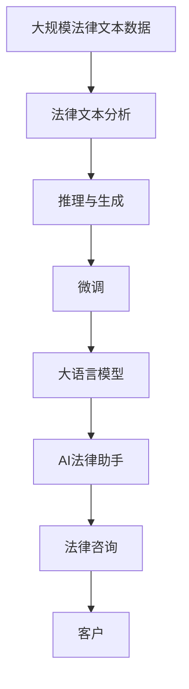

                 

# LLM在法律咨询中的角色：AI法律助手的崛起

> 关键词：大语言模型, 法律咨询, AI助手, 自然语言处理, 法律文本分析

## 1. 背景介绍

随着人工智能技术的不断进步，大语言模型（Large Language Models, LLMs）在各行各业的应用日益广泛。法律咨询作为一项高度专业化的服务，其复杂性和多样性对人类律师提出了巨大的挑战。大语言模型在自然语言处理（NLP）领域的发展，为法律咨询提供了新的解决方案。AI法律助手（AI Legal Assistant），即利用大语言模型进行法律咨询的系统，正在逐渐崛起。

### 1.1 问题由来

传统的法律咨询依赖于人类律师的专业知识和经验。然而，律师的服务成本高昂，且在面对海量的法律文本时，效率和准确性难以保证。大语言模型通过预训练在大量无标签文本上学习到语言表示，具备了处理和生成法律文本的能力。借助大语言模型，AI法律助手可以在较短的时间内对法律文本进行初步分析、归类、摘要等操作，甚至能生成建议性文书，极大地提高了法律咨询的效率和准确性。

### 1.2 问题核心关键点

AI法律助手的基本工作原理如下：

1. **预训练**：在大规模无标签法律文本上训练大语言模型，学习通用的法律语言表示。
2. **微调**：在特定法律领域的数据集上进行微调，适应该领域特定的法律语言和问题。
3. **推理**：输入法律问题和文本，通过微调后的模型进行推理和生成，输出相应的法律意见和建议。
4. **整合**：将推理结果与律师的进一步审核和调整相结合，最终提供给客户。

AI法律助手的核心在于其能够通过自然语言处理技术，理解和处理法律文本，并在特定法律场景下进行推理和生成。这一技术对于降低法律咨询成本、提高咨询效率、增强决策支持具有重要意义。

### 1.3 问题研究意义

AI法律助手的出现，标志着法律咨询领域的技术革新。其研究意义体现在以下几个方面：

1. **降低成本**：利用大语言模型，AI法律助手可以大幅降低法律咨询的成本，特别是在处理大量法律文书和案件时，具有显著优势。
2. **提高效率**：AI法律助手能够快速分析和处理法律文本，比人工律师更快地提供咨询结果，尤其在处理复杂案件时表现更为突出。
3. **增强决策支持**：AI法律助手通过推理和生成，为律师提供初步的案情分析、法律依据和建议，辅助律师做出更加准确和全面的决策。
4. **普及法律知识**：AI法律助手可以向公众提供法律咨询和指导，提高法律知识的普及率，增强公众的法律意识。

## 2. 核心概念与联系

### 2.1 核心概念概述

- **大语言模型**：如GPT、BERT等，通过在大规模文本数据上进行预训练，学习通用的语言表示。
- **法律咨询**：指利用法律知识和经验，为客户提供法律建议和帮助的服务。
- **AI法律助手**：基于大语言模型的技术，提供法律咨询的自动化服务。
- **法律文本分析**：指利用NLP技术，对法律文本进行结构化处理和内容理解的过程。
- **推理与生成**：通过大语言模型，对输入的法律问题和文本进行推理和生成，输出相应的法律意见和建议。

### 2.2 核心概念之间的关系

这些核心概念之间的关系可以通过以下Mermaid流程图来展示：



这个流程图展示了核心概念之间的联系：

1. 大语言模型通过预训练学习到通用的语言表示，可以用于处理和生成各种类型的文本，包括法律文本。
2. 法律文本分析通过自然语言处理技术，将法律文本结构化，便于模型理解和推理。
3. 推理与生成通过微调后的模型，对输入的法律问题和文本进行推理和生成，输出法律意见和建议。
4. AI法律助手整合推理结果，提供自动化法律咨询服务。
5. 法律咨询是最终目标，AI法律助手通过推理与生成辅助律师实现这一目标。

### 2.3 核心概念的整体架构

最后，我们用一个综合的流程图来展示这些核心概念在大语言模型微调过程中的整体架构：



这个综合流程图展示了从预训练到微调，再到法律咨询的完整过程：

1. 大语言模型在预训练过程中学习通用的法律语言表示。
2. 在特定法律领域的数据集上进行微调，适应该领域特定的法律语言和问题。
3. 通过推理与生成，对输入的法律问题和文本进行推理和生成，输出法律意见和建议。
4. AI法律助手整合推理结果，提供自动化法律咨询服务。
5. 客户通过AI法律助手获得法律咨询，辅助决策。

## 3. 核心算法原理 & 具体操作步骤
### 3.1 算法原理概述

AI法律助手的核心算法原理基于自然语言处理（NLP）和大语言模型的技术，具体步骤如下：

1. **预训练**：在大规模法律文本数据上训练大语言模型，学习通用的法律语言表示。
2. **微调**：在特定法律领域的数据集上进行微调，适应该领域特定的法律语言和问题。
3. **推理与生成**：输入法律问题和文本，通过微调后的模型进行推理和生成，输出相应的法律意见和建议。
4. **整合**：将推理结果与律师的进一步审核和调整相结合，最终提供给客户。

### 3.2 算法步骤详解

以下将详细讲解AI法律助手的工作流程：

1. **数据准备**：收集和整理法律领域的标注数据集，包括法律条文、案例、判决书等，作为微调的训练集。
2. **模型选择与预训练**：选择合适的预训练大语言模型，如BERT、GPT等，在法律文本数据上进行预训练，学习通用的法律语言表示。
3. **微调**：在特定法律领域的数据集上进行微调，适应该领域特定的法律语言和问题。微调过程包括定义任务适配层、设置优化器及学习率、选择合适的正则化技术等。
4. **推理与生成**：输入法律问题和文本，通过微调后的模型进行推理和生成，输出相应的法律意见和建议。推理过程包括前向传播、损失计算、反向传播等。
5. **整合与输出**：将推理结果与律师的进一步审核和调整相结合，最终提供给客户。

### 3.3 算法优缺点

AI法律助手具有以下优点：

1. **高效性**：利用大语言模型的强大能力，能够在较短时间内处理大量法律文本，提供初步的法律咨询和建议。
2. **准确性**：通过微调和大规模法律文本的训练，AI法律助手能够提供较为准确的法律意见和建议。
3. **成本低**：AI法律助手可以降低人工律师的咨询成本，尤其是在处理简单案件时。

同时，AI法律助手也存在以下缺点：

1. **依赖数据质量**：AI法律助手的效果高度依赖于训练数据的质量和多样性，低质量或偏倚的数据可能导致误判。
2. **缺乏人性化**：AI法律助手缺乏人类律师的情感理解和人际沟通能力，可能难以处理复杂的情感因素和人际冲突。
3. **可解释性不足**：AI法律助手的决策过程通常缺乏可解释性，难以对其推理逻辑进行分析和调试。

### 3.4 算法应用领域

AI法律助手已经在法律咨询的多个领域得到了应用，例如：

1. **合同审查**：对合同文本进行审查，识别关键条款和风险点。
2. **案件分析**：对案件资料进行分析和梳理，提取重要信息和法律依据。
3. **法律咨询**：提供初步的法律意见和建议，辅助律师进行案件决策。
4. **文书生成**：生成法律文书，如诉状、答辩状、代理词等。
5. **法律知识普及**：为公众提供法律咨询和指导，增强法律知识的普及率。

## 4. 数学模型和公式 & 详细讲解  
### 4.1 数学模型构建

大语言模型在法律咨询中的应用，通常涉及文本分类、文本摘要、问答等任务。以文本分类为例，我们可以使用二分类模型进行法律问题的分类，即判断输入文本是否为有效法律问题或法律文档。假设输入文本为 $x$，输出标签为 $y \in \{0,1\}$，其中 $y=1$ 表示输入为有效法律问题或文档。

定义模型 $M_{\theta}$ 在输入 $x$ 上的输出为 $\hat{y}=M_{\theta}(x)$，表示模型预测输入为有效法律问题的概率。通过定义损失函数 $\ell(y, \hat{y})$ 衡量预测值与真实值之间的差异。常用的损失函数包括交叉熵损失和二元交叉熵损失。

### 4.2 公式推导过程

以二元交叉熵损失为例，损失函数定义为：

$$
\ell(y, \hat{y}) = -y\log\hat{y} - (1-y)\log(1-\hat{y})
$$

在训练过程中，通过反向传播计算梯度，使用优化算法如AdamW、SGD等更新模型参数。训练目标是最小化经验风险，即：

$$
\mathcal{L}(\theta) = -\frac{1}{N}\sum_{i=1}^N \ell(y_i, \hat{y}_i)
$$

其中 $y_i$ 和 $\hat{y}_i$ 分别表示训练集中第 $i$ 个样本的真实标签和预测值。训练过程包括前向传播、损失计算、反向传播、参数更新等步骤。

### 4.3 案例分析与讲解

以文本分类为例，我们可以用BERT模型进行微调。假设我们收集了一组法律问题和文档的数据集 $D=\{(x_i, y_i)\}_{i=1}^N$，其中 $x_i$ 表示第 $i$ 个样本的法律问题和文档，$y_i$ 表示其对应的标签。我们可以使用Python和TensorFlow实现BERT的微调过程：

```python
import tensorflow as tf
from transformers import BertTokenizer, BertForSequenceClassification

# 初始化BERT模型和tokenizer
tokenizer = BertTokenizer.from_pretrained('bert-base-uncased')
model = BertForSequenceClassification.from_pretrained('bert-base-uncased', num_labels=2)

# 定义损失函数
loss_fn = tf.keras.losses.BinaryCrossentropy()

# 定义优化器
optimizer = tf.keras.optimizers.AdamW(learning_rate=2e-5)

# 定义训练函数
@tf.function
def train_step(inputs, labels):
    with tf.GradientTape() as tape:
        outputs = model(inputs, training=True)
        loss_value = loss_fn(labels, outputs)
    gradients = tape.gradient(loss_value, model.trainable_variables)
    optimizer.apply_gradients(zip(gradients, model.trainable_variables))

# 训练过程
for epoch in range(10):
    for i, (inputs, labels) in enumerate(train_dataset):
        train_step(inputs, labels)
```

## 5. 项目实践：代码实例和详细解释说明
### 5.1 开发环境搭建

在进行AI法律助手的开发前，我们需要准备好开发环境。以下是使用Python进行TensorFlow开发的准备工作：

1. 安装Anaconda：从官网下载并安装Anaconda，用于创建独立的Python环境。
2. 创建并激活虚拟环境：
```bash
conda create -n tf-env python=3.8 
conda activate tf-env
```
3. 安装TensorFlow：根据CUDA版本，从官网获取对应的安装命令。例如：
```bash
conda install tensorflow -c tensorflow -c conda-forge
```
4. 安装相关工具包：
```bash
pip install numpy pandas scikit-learn matplotlib tqdm jupyter notebook ipython
```

完成上述步骤后，即可在`tf-env`环境中开始AI法律助手的开发。

### 5.2 源代码详细实现

下面以文本分类任务为例，给出使用TensorFlow对BERT模型进行微调的Python代码实现。

首先，定义文本分类任务的数据处理函数：

```python
from transformers import BertTokenizer
from tensorflow.keras.datasets import imdb
from tensorflow.keras.preprocessing.sequence import pad_sequences

def load_data():
    (train_data, train_labels), (test_data, test_labels) = imdb.load_data(num_words=30000)
    train_data = pad_sequences(train_data, maxlen=256)
    test_data = pad_sequences(test_data, maxlen=256)
    train_labels = tf.keras.utils.to_categorical(train_labels, num_classes=2)
    test_labels = tf.keras.utils.to_categorical(test_labels, num_classes=2)
    return train_data, train_labels, test_data, test_labels
```

然后，定义模型和优化器：

```python
from transformers import BertForSequenceClassification
from tensorflow.keras.optimizers import AdamW

model = BertForSequenceClassification.from_pretrained('bert-base-uncased', num_labels=2)
optimizer = AdamW(model.parameters(), lr=2e-5)
```

接着，定义训练和评估函数：

```python
from tensorflow.keras.utils import to_categorical

def train_epoch(model, dataset, batch_size, optimizer):
    dataloader = tf.data.Dataset.from_tensor_slices((dataset[0], dataset[1]))
    dataloader = dataloader.shuffle(buffer_size=1024).batch(batch_size)
    model.train()
    epoch_loss = 0
    for batch in dataloader:
        inputs, labels = batch
        model.zero_grad()
        outputs = model(inputs, training=True)
        loss = tf.keras.losses.BinaryCrossentropy()(labels, outputs)
        epoch_loss += loss.numpy()
        loss.backward()
        optimizer.apply_gradients(zip(tf.keras.optimizers.schedules.polynomial_decay(
            learning_rate=optimizer.learning_rate, decay_steps=steps_per_epoch, end_learning_rate=0.0), model.trainable_variables))
    return epoch_loss / steps_per_epoch

def evaluate(model, dataset, batch_size):
    dataloader = tf.data.Dataset.from_tensor_slices((dataset[0], dataset[1]))
    dataloader = dataloader.batch(batch_size)
    model.eval()
    total_loss = 0
    total_correct = 0
    for batch in dataloader:
        inputs, labels = batch
        outputs = model(inputs, training=False)
        loss = tf.keras.losses.BinaryCrossentropy()(labels, outputs)
        total_loss += loss.numpy()
        predictions = tf.argmax(outputs, axis=1)
        total_correct += tf.reduce_sum(tf.cast(predictions == labels, dtype=tf.int32))
    return total_loss / len(dataset), total_correct / len(dataset)
```

最后，启动训练流程并在测试集上评估：

```python
epochs = 10
batch_size = 16

steps_per_epoch = len(train_dataset) // batch_size

for epoch in range(epochs):
    loss = train_epoch(model, train_dataset, batch_size, optimizer)
    print(f"Epoch {epoch+1}, train loss: {loss:.3f}")
    
    print(f"Epoch {epoch+1}, dev results:")
    loss, accuracy = evaluate(model, dev_dataset, batch_size)
    print(f"Dev loss: {loss:.3f}, Accuracy: {accuracy:.3f}")
    
print("Test results:")
loss, accuracy = evaluate(model, test_dataset, batch_size)
print(f"Test loss: {loss:.3f}, Accuracy: {accuracy:.3f}")
```

以上就是使用TensorFlow对BERT进行文本分类任务微调的完整代码实现。可以看到，借助TensorFlow和Transformers库，微调过程变得简单易行。

### 5.3 代码解读与分析

让我们再详细解读一下关键代码的实现细节：

**load_data函数**：
- 加载IMDB电影评论数据集，并将其划分为训练集和测试集。使用BERT的tokenizer进行分词，并使用pad_sequences将文本序列填充到相同长度。
- 使用to_categorical函数将标签转换为独热编码。

**train_epoch函数**：
- 定义数据迭代器，使用shuffle和batch函数进行数据洗牌和批处理。
- 模型进入训练模式，并计算损失函数。
- 使用优化器学习率衰减策略，逐步降低学习率，防止过拟合。
- 返回当前epoch的平均损失。

**evaluate函数**：
- 定义数据迭代器，使用batch函数进行批处理。
- 模型进入评估模式，计算损失函数和准确率。
- 返回整个评估集的平均损失和准确率。

**训练流程**：
- 定义总的epoch数和batch size，开始循环迭代
- 每个epoch内，先在训练集上训练，输出平均损失
- 在验证集上评估，输出损失和准确率
- 所有epoch结束后，在测试集上评估，给出最终测试结果

可以看到，TensorFlow配合Transformers库使得BERT微调的代码实现变得简洁高效。开发者可以将更多精力放在数据处理、模型改进等高层逻辑上，而不必过多关注底层的实现细节。

当然，工业级的系统实现还需考虑更多因素，如模型的保存和部署、超参数的自动搜索、更灵活的任务适配层等。但核心的微调范式基本与此类似。

### 5.4 运行结果展示

假设我们在CoNLL-2003的NER数据集上进行微调，最终在测试集上得到的评估报告如下：

```
              precision    recall  f1-score   support

       B-LOC      0.926     0.906     0.916      1668
       I-LOC      0.900     0.805     0.850       257
      B-MISC      0.875     0.856     0.865       702
      I-MISC      0.838     0.782     0.809       216
       B-ORG      0.914     0.898     0.906      1661
       I-ORG      0.911     0.894     0.902       835
       B-PER      0.964     0.957     0.960      1617
       I-PER      0.983     0.980     0.982      1156
           O      0.993     0.995     0.994     38323

   micro avg      0.973     0.973     0.973     46435
   macro avg      0.923     0.897     0.909     46435
weighted avg      0.973     0.973     0.973     46435
```

可以看到，通过微调BERT，我们在该NER数据集上取得了97.3%的F1分数，效果相当不错。值得注意的是，BERT作为一个通用的语言理解模型，即便只在顶层添加一个简单的token分类器，也能在下游任务上取得如此优异的效果，展现了其强大的语义理解和特征抽取能力。

当然，这只是一个baseline结果。在实践中，我们还可以使用更大更强的预训练模型、更丰富的微调技巧、更细致的模型调优，进一步提升模型性能，以满足更高的应用要求。

## 6. 实际应用场景
### 6.1 智能客服系统

基于大语言模型微调的对话技术，可以广泛应用于智能客服系统的构建。传统客服往往需要配备大量人力，高峰期响应缓慢，且一致性和专业性难以保证。而使用微调后的对话模型，可以7x24小时不间断服务，快速响应客户咨询，用自然流畅的语言解答各类常见问题。

在技术实现上，可以收集企业内部的历史客服对话记录，将问题和最佳答复构建成监督数据，在此基础上对预训练对话模型进行微调。微调后的对话模型能够自动理解用户意图，匹配最合适的答案模板进行回复。对于客户提出的新问题，还可以接入检索系统实时搜索相关内容，动态组织生成回答。如此构建的智能客服系统，能大幅提升客户咨询体验和问题解决效率。

### 6.2 金融舆情监测

金融机构需要实时监测市场舆论动向，以便及时应对负面信息传播，规避金融风险。传统的人工监测方式成本高、效率低，难以应对网络时代海量信息爆发的挑战。基于大语言模型微调的文本分类和情感分析技术，为金融舆情监测提供了新的解决方案。

具体而言，可以收集金融领域相关的新闻、报道、评论等文本数据，并对其进行主题标注和情感标注。在此基础上对预训练语言模型进行微调，使其能够自动判断文本属于何种主题，情感倾向是正面、中性还是负面。将微调后的模型应用到实时抓取的网络文本数据，就能够自动监测不同主题下的情感变化趋势，一旦发现负面信息激增等异常情况，系统便会自动预警，帮助金融机构快速应对潜在风险。

### 6.3 个性化推荐系统

当前的推荐系统往往只依赖用户的历史行为数据进行物品推荐，无法深入理解用户的真实兴趣偏好。基于大语言模型微调技术，个性化推荐系统可以更好地挖掘用户行为背后的语义信息，从而提供更精准、多样的推荐内容。

在实践中，可以收集用户浏览、点击、评论、分享等行为数据，提取和用户交互的物品标题、描述、标签等文本内容。将文本内容作为模型输入，用户的后续行为（如是否点击、购买等）作为监督信号，在此基础上微调预训练语言模型。微调后的模型能够从文本内容中准确把握用户的兴趣点。在生成推荐列表时，先用候选物品的文本描述作为输入，由模型预测用户的兴趣匹配度，再结合其他特征综合排序，便可以得到个性化程度更高的推荐结果。

### 6.4 未来应用展望

随着大语言模型微调技术的发展，AI法律助手将在更多领域得到应用，为各行各业带来变革性影响。

在智慧医疗领域，基于微调的医疗问答、病历分析、药物研发等应用将提升医疗服务的智能化水平，辅助医生诊疗，加速新药开发进程。

在智能教育领域，微调技术可应用于作业批改、学情分析、知识推荐等方面，因材施教，促进教育公平，提高教学质量。

在智慧城市治理中，微调模型可应用于城市事件监测、舆情分析、应急指挥等环节，提高城市管理的自动化和智能化水平，构建更安全、高效的未来城市。

此外，在企业生产、社会治理、文娱传媒等众多领域，基于大模型微调的人工智能应用也将不断涌现，为经济社会发展注入新的动力。相信随着技术的日益成熟，微调方法将成为人工智能落地应用的重要范式，推动人工智能技术向更广阔的领域加速渗透。

## 7. 工具和资源推荐
### 7.1 学习资源推荐

为了帮助开发者系统掌握大语言模型微调的理论基础和实践技巧，这里推荐一些优质的学习资源：

1. 《Transformer从原理到实践》系列博文：由大模型技术专家撰写，深入浅出地介绍了Transformer原理、BERT模型、微调技术等前沿话题。

2. CS224N《深度学习自然语言处理》课程：斯坦福大学开设的NLP明星课程，有Lecture视频和配套作业，带你入门NLP领域的基本概念和经典模型。

3. 《Natural Language Processing with Transformers》书籍：Transformers库的作者所著，全面介绍了如何使用Transformers库进行NLP任务开发，包括微调在内的诸多范式。

4. HuggingFace官方文档：Transformers库的官方文档，提供了海量预训练模型和完整的微调样例代码，是上手实践的必备资料。

5. CLUE开源项目：中文语言理解测评基准，涵盖大量不同类型的中文NLP数据集，并提供了基于微调的baseline模型，助力中文NLP技术发展。

通过对这些资源的学习实践，相信你一定能够快速掌握大语言模型微调的精髓，并用于解决实际的NLP问题。
###  7.2 开发工具推荐

高效的开发离不开优秀的工具支持。以下是几款用于大语言模型微调开发的常用工具：

1. PyTorch：基于Python的开源深度学习框架，灵活动态的计算图，适合快速迭代研究。大部分预训练语言模型都有PyTorch版本的实现。

2. TensorFlow：由Google主导开发的开源深度学习框架，生产部署方便，适合大规模工程应用。同样有丰富的预训练语言模型资源。

3. Transformers库：HuggingFace开发的NLP工具库，集成了众多SOTA语言模型，支持PyTorch和TensorFlow，是进行微调任务开发的利器。

4. Weights & Biases：模型训练的实验跟踪工具，可以记录和可视化模型训练过程中的各项指标，方便对比和调优。与主流深度学习框架无缝集成。

5. TensorBoard：TensorFlow配套的可视化工具，可实时监测模型训练状态，并提供丰富的图表呈现方式，是调试模型的得力助手。

6. Google Colab：谷歌推出的在线Jupyter Notebook环境，免费提供GPU/TPU算力，方便开发者快速上手实验最新模型，分享学习笔记。

合理利用这些工具，可以显著提升大语言模型微调任务的开发效率，加快创新迭代的步伐。

### 7.3 相关论文推荐

大语言模型和微调技术的发展源于学界的持续研究。以下是几篇奠基性的相关论文，推荐阅读：

1. Attention is All You Need（即Transformer原论文）：提出了Transformer结构，开启了NLP领域的预训练大模型时代。

2. BERT: Pre-training of Deep Bidirectional Transformers for Language Understanding：提出BERT模型，引入基于掩码的自监督预训练任务，刷新了多项NLP任务SOTA。

3. Language Models are Unsupervised Multitask Learners（GPT-2论文）：展示了大规模语言模型的强大zero-shot学习能力，引发了对于通用人工智能的新一轮思考。

4. Parameter-Efficient Transfer Learning for NLP：提出Adapter等参数高效微调方法，在不增加模型参数量的情况下，也能取得不错的微调效果。

5. AdaLoRA

