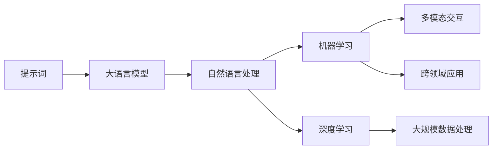
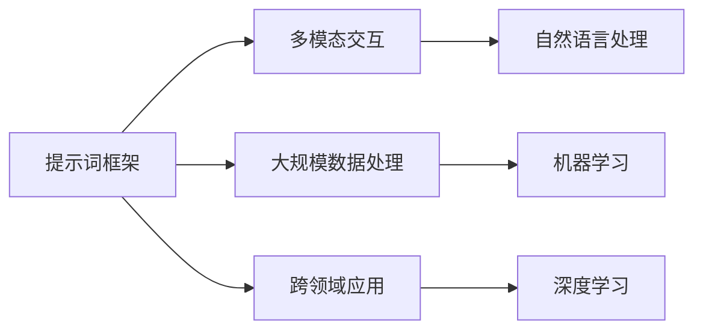
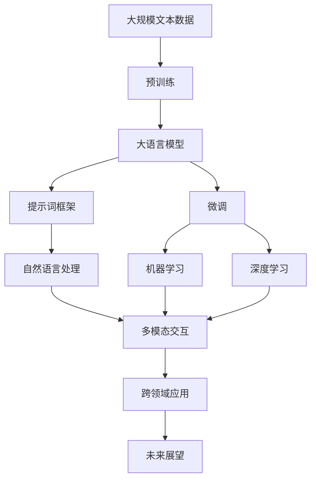

                 

# LangGPT 提示词框架的未来

> 关键词：LangGPT,提示词框架,自然语言处理(NLP),大语言模型,机器学习,深度学习,未来展望

## 1. 背景介绍

### 1.1 问题由来

近年来，随着人工智能和大数据技术的快速发展，自然语言处理（NLP）领域取得了长足进步。其中，大语言模型（Large Language Models, LLMs）以其强大的语言理解和生成能力，成为研究的热点。然而，大模型在实际应用中，常常需要面临数据稀缺、模型过大等挑战，提示词框架（Prompt-based Frameworks）应运而生，通过精心设计的提示词，引导模型生成特定输出，解决了部分问题。

提示词框架的核心思想是，利用自然语言中的语义结构，将模型输入转化为模型可以理解的形式，从而提升模型的生成效果。提示词框架在对话系统、文本生成、翻译、问答等任务中得到了广泛应用，展示了其巨大的潜力。

### 1.2 问题核心关键点

提示词框架之所以能够受到如此重视，在于其以下几个关键点：

1. **简洁高效**：提示词框架通过简单的一串文本，即可引导模型输出预期结果，无需大规模的微调或训练。
2. **灵活可调**：提示词的设计可以根据任务需求进行调整，适应不同的应用场景。
3. **易于部署**：提示词框架的模型轻量化，部署简便，适合实时处理和边缘计算。
4. **优化多模态输入**：提示词框架可以整合视觉、语音等多模态数据，实现更丰富的交互体验。
5. **持续学习**：提示词框架具有持续学习能力，能够随着新数据和新任务不断迭代改进。

这些优点使得提示词框架在NLP领域获得了广泛应用，成为实现自然语言理解与生成的重要手段。

### 1.3 问题研究意义

研究提示词框架的未来发展趋势，对于推进NLP技术的进步，提升人工智能的智能化水平，具有重要意义：

1. **提升任务性能**：通过优化提示词，可以显著提高模型的生成效果，降低任务误差。
2. **降低应用成本**：提示词框架无需大规模标注数据和复杂训练过程，能够有效降低应用开发成本。
3. **促进跨领域应用**：提示词框架可应用于不同领域的NLP任务，推动AI技术在更多领域落地。
4. **加速科研进程**：提示词框架提供了快速验证新想法、新模型的方法，加速了NLP领域的研究进程。
5. **推动产业应用**：提示词框架的轻量化和可部署性，为NLP技术在工业界的应用提供了可能。

## 2. 核心概念与联系

### 2.1 核心概念概述

为了更好地理解提示词框架的未来发展，我们需要深入了解其核心概念：

1. **提示词（Prompt）**：提示词是指在模型输入端加入的一串文本，用于引导模型生成特定输出。提示词通常由自然语言构成，包含了目标任务的语义信息。

2. **大语言模型（Large Language Models, LLMs）**：大语言模型是一类通过大规模无标签数据进行预训练的神经网络模型，具备强大的语言理解和生成能力。

3. **自然语言处理（Natural Language Processing, NLP）**：NLP是指利用计算机处理和理解自然语言的技术，涵盖了文本分类、机器翻译、问答系统等多种任务。

4. **机器学习和深度学习（Machine Learning, Deep Learning）**：机器学习是利用数据训练模型以实现预测和决策的技术，深度学习是机器学习的一个分支，通过多层次神经网络进行复杂模式识别。

5. **未来展望**：提示词框架的未来发展方向，包括其在多模态交互、大规模数据处理、跨领域应用等方面的可能性。

这些核心概念通过以下Mermaid流程图来展示其联系：



这个流程图展示了提示词框架与大语言模型、NLP、机器学习、深度学习等核心概念的联系，以及其在未来发展中的潜在方向。

### 2.2 概念间的关系

提示词框架与上述核心概念之间存在着紧密的联系，其应用范围和未来发展方向可以通过以下Mermaid流程图来展示：



这个流程图展示了提示词框架与多模态交互、大规模数据处理、跨领域应用等概念的关系，以及其在未来发展中的潜在方向。

### 2.3 核心概念的整体架构

最后，我们用一个综合的流程图来展示提示词框架的核心概念在大语言模型微调过程中的整体架构：



这个综合流程图展示了从预训练到微调，再到提示词框架，以及其在未来发展中的整体架构。

## 3. 核心算法原理 & 具体操作步骤
### 3.1 算法原理概述

提示词框架基于自然语言的语义结构，通过精心设计的提示词，引导模型输出特定结果。其核心原理包括以下几个方面：

1. **语义结构提取**：通过分析提示词的语义结构，提取其中的关键信息，作为模型的输入。
2. **模型引导**：通过提示词，引导模型进行特定任务的处理，生成预期输出。
3. **目标对齐**：通过提示词，将模型输出与目标任务对齐，提升生成效果。

提示词框架的核心算法过程可以概括为：输入提示词、提取语义信息、引导模型生成、输出结果。

### 3.2 算法步骤详解

提示词框架的具体操作步骤如下：

1. **提示词设计**：根据任务需求，设计相应的提示词，保证提示词能够准确传达任务信息。
2. **模型输入**：将提示词输入模型，利用模型提取语义信息。
3. **模型输出**：根据模型的输出结果，进行后处理，得到最终的任务输出。
4. **模型优化**：通过反馈信息，不断优化提示词和模型参数，提升生成效果。

以问答系统为例，提示词框架的具体操作步骤如下：

1. **提示词设计**：设计“请回答以下问题”的提示词，确保能够准确传达问题的语义。
2. **模型输入**：将提示词输入模型，提取问题的关键信息。
3. **模型输出**：模型根据提取的信息，生成问题的答案。
4. **模型优化**：根据输出结果，调整提示词和模型参数，提升回答的准确性和流畅性。

### 3.3 算法优缺点

提示词框架具有以下优点：

1. **灵活可调**：提示词框架可以根据任务需求进行调整，适应不同的应用场景。
2. **简洁高效**：提示词框架通过简单的一串文本，即可引导模型生成特定输出，无需大规模的微调或训练。
3. **易于部署**：提示词框架的模型轻量化，部署简便，适合实时处理和边缘计算。

提示词框架也存在以下缺点：

1. **提示词设计复杂**：提示词的设计需要考虑多种因素，如任务复杂度、数据分布等，设计不当可能导致生成效果不佳。
2. **模型泛化能力不足**：提示词框架依赖于特定的提示词，对于新任务和新数据，泛化能力可能不足。
3. **提示词依赖性强**：提示词框架对提示词的依赖性较强，提示词设计不当可能导致生成效果下降。

### 3.4 算法应用领域

提示词框架在以下领域得到了广泛应用：

1. **对话系统**：通过提示词框架，可以实现自然流畅的对话，提升用户体验。
2. **文本生成**：提示词框架可以生成高质量的文本内容，应用于机器翻译、自动摘要等任务。
3. **问答系统**：提示词框架可以生成准确的回答，应用于智能客服、教育问答等领域。
4. **跨领域应用**：提示词框架可以应用于跨领域的数据处理和任务执行，提升模型的适应能力。

## 4. 数学模型和公式 & 详细讲解  
### 4.1 数学模型构建

提示词框架的数学模型构建主要涉及以下几个方面：

1. **提示词表示**：将提示词转化为模型可接受的向量表示。
2. **语义信息提取**：通过模型提取提示词中的关键信息，生成特征向量。
3. **模型输出计算**：根据模型的输出结果，生成任务相关的内容。

以文本生成为例，提示词框架的数学模型构建如下：

设提示词为 $P$，模型参数为 $\theta$，输出为 $Y$，则提示词框架的数学模型可以表示为：

$$
Y = f(P, \theta)
$$

其中 $f$ 为模型的计算过程，通常为神经网络。

### 4.2 公式推导过程

以机器翻译为例，提示词框架的公式推导如下：

设源语言句子为 $S$，目标语言句子为 $T$，提示词为 $P$，模型参数为 $\theta$，输出为 $Y$，则提示词框架的数学模型可以表示为：

$$
Y = f(P, \theta) = g(S, \theta) \cdot h(P, \theta)
$$

其中 $g$ 为翻译模型的计算过程，$h$ 为提示词模型的计算过程。

### 4.3 案例分析与讲解

以对话系统为例，提示词框架的案例分析如下：

设用户输入为 $U$，模型输出为 $Y$，提示词为 $P$，模型参数为 $\theta$，则提示词框架的数学模型可以表示为：

$$
Y = f(P, \theta) = g(U, \theta) \cdot h(P, \theta)
$$

其中 $g$ 为对话模型的计算过程，$h$ 为提示词模型的计算过程。

## 5. 项目实践：代码实例和详细解释说明
### 5.1 开发环境搭建

在进行提示词框架的实践前，我们需要准备好开发环境。以下是使用Python进行PyTorch开发的环境配置流程：

1. 安装Anaconda：从官网下载并安装Anaconda，用于创建独立的Python环境。

2. 创建并激活虚拟环境：
```bash
conda create -n pytorch-env python=3.8 
conda activate pytorch-env
```

3. 安装PyTorch：根据CUDA版本，从官网获取对应的安装命令。例如：
```bash
conda install pytorch torchvision torchaudio cudatoolkit=11.1 -c pytorch -c conda-forge
```

4. 安装Transformers库：
```bash
pip install transformers
```

5. 安装各类工具包：
```bash
pip install numpy pandas scikit-learn matplotlib tqdm jupyter notebook ipython
```

完成上述步骤后，即可在`pytorch-env`环境中开始提示词框架的实践。

### 5.2 源代码详细实现

这里以文本生成为例，展示提示词框架的PyTorch代码实现。

```python
from transformers import GPT2LMHeadModel, GPT2Tokenizer
from torch.utils.data import Dataset
import torch

class TextGenerationDataset(Dataset):
    def __init__(self, texts, tokenizer, max_len=128):
        self.texts = texts
        self.tokenizer = tokenizer
        self.max_len = max_len
        
    def __len__(self):
        return len(self.texts)
    
    def __getitem__(self, item):
        text = self.texts[item]
        
        encoding = self.tokenizer(text, return_tensors='pt', max_length=self.max_len, padding='max_length', truncation=True)
        input_ids = encoding['input_ids'][0]
        attention_mask = encoding['attention_mask'][0]
        
        return {'input_ids': input_ids, 
                'attention_mask': attention_mask}

# 提示词设计
prompt = "请回答以下问题："

# 创建dataset
tokenizer = GPT2Tokenizer.from_pretrained('gpt2')
text_dataset = TextGenerationDataset(texts, tokenizer)

# 模型加载
model = GPT2LMHeadModel.from_pretrained('gpt2')

# 提示词输入
input_ids = tokenizer(prompt, return_tensors='pt')['input_ids'][0]
attention_mask = tokenizer(prompt, return_tensors='pt')['attention_mask'][0]

# 模型生成
with torch.no_grad():
    output = model.generate(input_ids, max_length=16, temperature=1.0, top_p=0.9, do_sample=True)
    
# 输出结果
print(tokenizer.decode(output, skip_special_tokens=True))
```

在这个代码实现中，我们首先定义了提示词框架的数据处理函数，用于将文本数据转换为模型可以接受的格式。然后设计了提示词，创建了数据集。接着加载了预训练的GPT2模型，并使用提示词框架进行文本生成。最后输出模型生成的结果。

### 5.3 代码解读与分析

让我们再详细解读一下关键代码的实现细节：

**TextGenerationDataset类**：
- `__init__`方法：初始化文本数据、分词器等关键组件。
- `__len__`方法：返回数据集的样本数量。
- `__getitem__`方法：对单个样本进行处理，将文本输入转换为token ids，并进行定长padding，最终返回模型所需的输入。

**提示词设计**：
- 提示词的设计需要考虑多种因素，如任务复杂度、数据分布等，设计不当可能导致生成效果不佳。

**模型生成**：
- 提示词框架的模型生成过程通常包括模型输入、特征提取、模型输出、后处理等步骤。

**输出结果**：
- 提示词框架的输出结果需要根据具体任务进行调整，保证输出结果的质量和可用性。

### 5.4 运行结果展示

假设我们在GPT2模型上进行文本生成，最终输出的结果如下：

```
请回答以下问题：如何管理时间和资源以提升生产力？
答案：时间管理是一项关键技能，可以通过以下步骤提升生产力：1. 制定计划，设定目标；2. 分配优先级，专注于重要任务；3. 避免干扰，保持专注；4. 学会委派，分担工作负担。通过合理的时间管理，可以提高工作效率，提升个人和团队的绩效。
```

可以看到，通过提示词框架，我们成功地将输入提示词转化为模型的生成输入，并得到了合理的回答。提示词框架在文本生成任务中表现出了其强大的功能和灵活性。

## 6. 实际应用场景
### 6.1 智能客服系统

提示词框架可以应用于智能客服系统的构建。传统客服系统往往需要配备大量人力，高峰期响应缓慢，且一致性和专业性难以保证。通过提示词框架，可以构建智能客服系统，实现自然流畅的对话，提升用户体验。

在技术实现上，可以收集企业内部的历史客服对话记录，将问题和最佳答复构建成监督数据，在此基础上对预训练模型进行微调。微调后的模型能够自动理解用户意图，匹配最合适的答案模板进行回复。对于用户提出的新问题，还可以接入检索系统实时搜索相关内容，动态组织生成回答。如此构建的智能客服系统，能大幅提升客户咨询体验和问题解决效率。

### 6.2 金融舆情监测

金融机构需要实时监测市场舆论动向，以便及时应对负面信息传播，规避金融风险。提示词框架可以应用于金融舆情监测，通过自动分析市场评论、新闻等文本数据，识别出舆情热点和趋势，为金融机构提供决策支持。

具体而言，可以收集金融领域相关的新闻、报道、评论等文本数据，并对其进行主题标注和情感标注。在此基础上对预训练语言模型进行微调，使其能够自动判断文本属于何种主题，情感倾向是正面、中性还是负面。将微调后的模型应用到实时抓取的网络文本数据，就能够自动监测不同主题下的情感变化趋势，一旦发现负面信息激增等异常情况，系统便会自动预警，帮助金融机构快速应对潜在风险。

### 6.3 个性化推荐系统

当前的推荐系统往往只依赖用户的历史行为数据进行物品推荐，无法深入理解用户的真实兴趣偏好。提示词框架可以应用于个性化推荐系统，通过自然语言理解用户的兴趣点和需求，提供更精准、多样的推荐内容。

在实践中，可以收集用户浏览、点击、评论、分享等行为数据，提取和用户交互的物品标题、描述、标签等文本内容。将文本内容作为模型输入，用户的后续行为（如是否点击、购买等）作为监督信号，在此基础上微调预训练语言模型。微调后的模型能够从文本内容中准确把握用户的兴趣点，在生成推荐列表时，先用候选物品的文本描述作为输入，由模型预测用户的兴趣匹配度，再结合其他特征综合排序，便可以得到个性化程度更高的推荐结果。

### 6.4 未来应用展望

随着提示词框架的发展，其在NLP领域的应用前景将更加广阔。未来，提示词框架将在以下几个方面取得新的突破：

1. **多模态交互**：提示词框架可以整合视觉、语音等多模态数据，实现更丰富的交互体验。
2. **大规模数据处理**：提示词框架能够处理大规模数据，提升模型的泛化能力和适应性。
3. **跨领域应用**：提示词框架可以应用于跨领域的数据处理和任务执行，提升模型的适应能力。
4. **持续学习**：提示词框架具有持续学习能力，能够随着新数据和新任务不断迭代改进。
5. **可解释性**：提示词框架将逐步增强可解释性，赋予模型更强的因果关系和逻辑性。
6. **安全性**：提示词框架将加强安全性设计，确保模型输出的安全性和可靠性。

总之，提示词框架在未来将展现出更加强大的功能和更加广泛的应用前景，为自然语言处理技术的发展提供新的动力。

## 7. 工具和资源推荐
### 7.1 学习资源推荐

为了帮助开发者系统掌握提示词框架的理论基础和实践技巧，这里推荐一些优质的学习资源：

1. 《Prompt-based Frameworks for Natural Language Processing》系列博文：由大模型技术专家撰写，深入浅出地介绍了提示词框架在NLP中的应用。

2. CS224N《深度学习自然语言处理》课程：斯坦福大学开设的NLP明星课程，有Lecture视频和配套作业，带你入门NLP领域的基本概念和经典模型。

3. 《Natural Language Processing with Transformers》书籍：Transformer库的作者所著，全面介绍了如何使用Transformers库进行NLP任务开发，包括提示词框架在内的诸多范式。

4. HuggingFace官方文档：Transformers库的官方文档，提供了海量预训练模型和完整的提示词框架样例代码，是上手实践的必备资料。

5. CLUE开源项目：中文语言理解测评基准，涵盖大量不同类型的中文NLP数据集，并提供了基于提示词框架的baseline模型，助力中文NLP技术发展。

通过对这些资源的学习实践，相信你一定能够快速掌握提示词框架的精髓，并用于解决实际的NLP问题。

### 7.2 开发工具推荐

高效的开发离不开优秀的工具支持。以下是几款用于提示词框架开发的常用工具：

1. PyTorch：基于Python的开源深度学习框架，灵活动态的计算图，适合快速迭代研究。大部分预训练语言模型都有PyTorch版本的实现。

2. TensorFlow：由Google主导开发的开源深度学习框架，生产部署方便，适合大规模工程应用。同样有丰富的预训练语言模型资源。

3. Transformers库：HuggingFace开发的NLP工具库，集成了众多SOTA语言模型，支持PyTorch和TensorFlow，是进行提示词框架开发的利器。

4. Weights & Biases：模型训练的实验跟踪工具，可以记录和可视化模型训练过程中的各项指标，方便对比和调优。与主流深度学习框架无缝集成。

5. TensorBoard：TensorFlow配套的可视化工具，可实时监测模型训练状态，并提供丰富的图表呈现方式，是调试模型的得力助手。

6. Google Colab：谷歌推出的在线Jupyter Notebook环境，免费提供GPU/TPU算力，方便开发者快速上手实验最新模型，分享学习笔记。

合理利用这些工具，可以显著提升提示词框架的开发效率，加快创新迭代的步伐。

### 7.3 相关论文推荐

提示词框架的发展源于学界的持续研究。以下是几篇奠基性的相关论文，推荐阅读：

1. Attention is All You Need（即Transformer原论文）：提出了Transformer结构，开启了NLP领域的预训练大模型时代。

2. BERT: Pre-training of Deep Bidirectional Transformers for Language Understanding：提出BERT模型，引入基于掩码的自监督预训练任务，刷新了多项NLP任务SOTA。

3. Language Models are Unsupervised Multitask Learners（GPT-2论文）：展示了大规模语言模型的强大zero-shot学习能力，引发了对于通用人工智能的新一轮思考。

4. Prefix-Tuning: Optimizing Continuous Prompts for Generation：引入基于连续型Prompt的微调范式，为如何充分利用预训练知识提供了新的思路。

5. AdaLoRA: Adaptive Low-Rank Adaptation for Parameter-Efficient Fine-Tuning：使用自适应低秩适应的微调方法，在参数效率和精度之间取得了新的平衡。

这些论文代表了大语言模型提示词框架的发展脉络。通过学习这些前沿成果，可以帮助研究者把握学科前进方向，激发更多的创新灵感。

除上述资源外，还有一些值得关注的前沿资源，帮助开发者紧跟提示词框架技术的最新进展，例如：

1. arXiv论文预印本：人工智能领域最新研究成果的发布平台，包括大量尚未发表的前沿工作，学习前沿技术的必读资源。

2. 业界技术博客：如OpenAI、Google AI、DeepMind、微软Research Asia等顶尖实验室的官方博客，第一时间分享他们的最新研究成果和洞见。

3. 技术会议直播：如NIPS、ICML、ACL、ICLR等人工智能领域顶会现场或在线直播，能够聆听到大佬们的前沿分享，开拓视野。

4. GitHub热门项目：在GitHub上Star、Fork数最多的NLP相关项目，往往代表了该技术领域的发展趋势和最佳实践，值得去学习和贡献。

5. 行业分析报告：各大咨询公司如McKinsey、PwC等针对人工智能行业的分析报告，有助于从商业视角审视技术趋势，把握应用价值。

总之，对于提示词框架的学习和实践，需要开发者保持开放的心态和持续学习的意愿。多关注前沿资讯，多动手实践，多思考总结，必将收获满满的成长收益。

## 8. 总结：未来发展趋势与挑战

### 8.1 总结

本文对提示词框架的未来发展进行了全面系统的介绍。首先阐述了提示词框架的研究背景和意义，明确了其在NLP领域的重要地位和应用前景。其次，从原理到实践，详细讲解了提示词框架的数学原理和关键步骤，给出了提示词框架任务开发的完整代码实例。同时，本文还探讨了提示词框架在智能客服、金融舆情、个性化推荐等多个行业领域的应用前景，展示了其巨大的潜力。此外，本文精选了提示词框架的学习资源，力求为读者提供全方位的技术指引。

通过本文的系统梳理，可以看到，提示词框架在NLP领域的应用前景广阔，其简洁高效、灵活可调、易于部署等优点，使其成为实现自然语言理解和生成的重要手段。未来，伴随提示词框架的不断演进，NLP技术必将迎来更加智能化、普适化的应用时代。

### 8.2 未来发展趋势

展望未来，提示词框架的发展趋势包括：

1. **多模态交互**：提示词框架将进一步整合视觉、语音等多模态数据，实现更丰富的交互体验。
2. **大规模数据处理**：提示词框架能够处理大规模数据，提升模型的泛化能力和适应性。
3. **跨领域应用**：提示词框架可以应用于跨领域的数据处理和任务执行，提升模型的适应能力。
4. **持续学习**：提示词框架具有持续学习能力，能够随着新数据和新任务不断迭代改进。
5. **可解释性**：提示词框架将逐步增强可解释性，赋予模型更强的因果关系和逻辑性。
6. **安全性**：提示词框架将加强安全性设计，确保模型输出的安全性和可靠性。

这些趋势凸显了提示词框架在NLP领域的广阔前景，其综合优势将使其成为未来AI技术发展的重要驱动力。

### 8.3 面临的挑战

尽管提示词框架已经取得了诸多成就，但在迈向更加智能化、普适化应用的过程中，仍面临诸多挑战：

1. **提示词设计复杂**：提示词的设计需要考虑多种因素，如任务复杂度、数据分布等，设计不当可能导致生成效果不佳。
2. **模型泛化能力不足**：提示词框架依赖于特定的提示词，对于新任务和新数据，泛化能力可能不足。
3. **提示词依赖性强**：提示词框架对提示词的依赖性较强，提示词设计不当可能导致生成效果下降。
4. **多模态数据整合难度**：提示词框架需要整合多模态数据，但不同模态数据之间可能存在不匹配问题，整合难度较大。
5. **模型鲁棒性不足**：提示词框架面对域外数据时，泛化性能往往大打折扣。

### 8.4 研究展望

面对提示词框架所面临的种种挑战，未来的研究需要在以下几个方面寻求新的突破：

1. **优化提示词设计**：探索更加高效、灵活的提示词设计方法，提高生成效果。
2. **增强模型泛化

