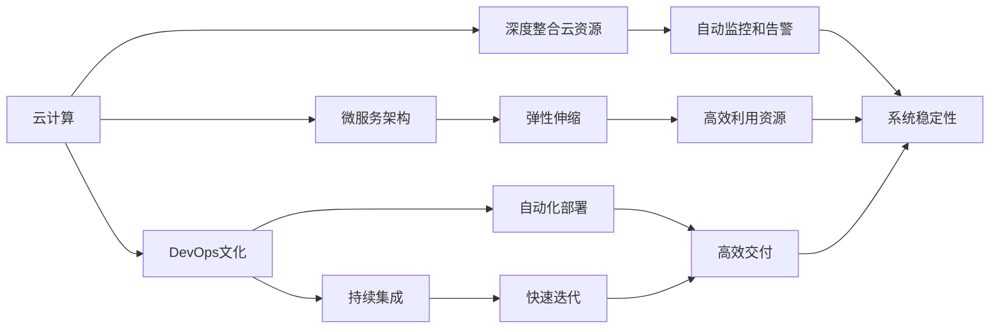
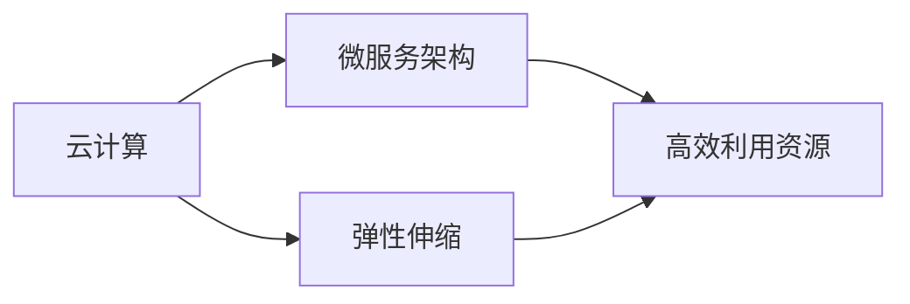
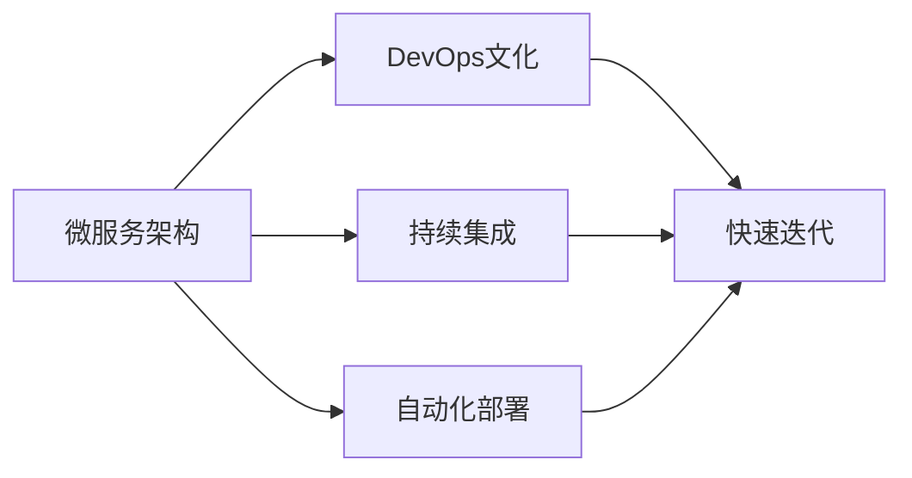
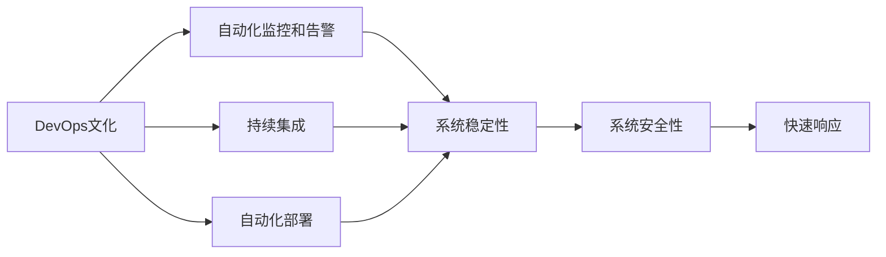
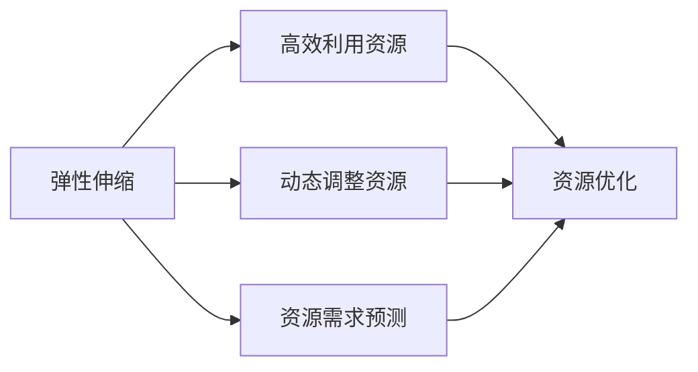
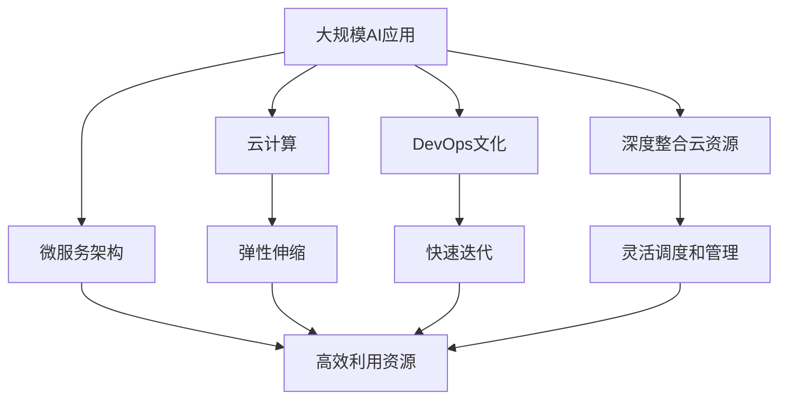

                 

# Lepton AI云计算优势：深度整合云资源，灵活高效AI基础设施

## 1. 背景介绍

### 1.1 问题由来

随着人工智能(AI)技术的迅速发展，云计算在AI基础设施建设中扮演了至关重要的角色。尤其是在大数据、深度学习等领域，云计算以其强大的计算能力和灵活的部署方式，成为AI应用落地的首选平台。然而，传统云计算平台在资源管理、弹性调度、数据安全和运维管理等方面仍存在诸多不足，难以满足AI应用对资源动态调配、多租户隔离、细粒度监控等高要求。

Lepton AI云平台应运而生，旨在解决这些问题，通过深度整合云资源、优化AI基础设施，为AI应用提供灵活、高效、安全、可控的计算环境。Lepton AI云平台采用微服务架构和DevOps文化，实现了大规模AI应用的高效部署和管理，极大地提升了AI应用的生命力和竞争力。

### 1.2 问题核心关键点

Lepton AI云平台的核心优势在于深度整合云资源，采用微服务架构和DevOps文化，实现了灵活高效的AI基础设施。主要包括以下几个方面：

- 微服务架构：通过服务细粒度和弹性伸缩，实现AI应用的快速部署、灵活扩展和高效运维。
- DevOps文化：通过持续集成和自动化部署，实现高效的软件发布和管理。
- 深度整合云资源：通过与主流云服务提供商的深度合作，实现云资源的灵活调度和管理。
- 灵活部署：支持多种AI框架和模型，快速适应不同应用场景。
- 高效运维：采用自动化监控、告警和故障恢复机制，提升系统的稳定性和可靠性。

这些核心优势使得Lepton AI云平台在AI基础设施建设中具有强大的竞争力和广泛的适用性。

### 1.3 问题研究意义

Lepton AI云平台的研究和应用，对于推动AI技术的产业化进程，具有重要意义：

1. 降低AI应用部署成本：通过深度整合云资源，简化AI应用的部署和运维流程，降低人力、物力和财力成本。
2. 提升AI应用性能：通过灵活高效的资源管理和调度和自动化运维，提升AI应用的生命力和竞争力。
3. 加速AI应用创新：通过微服务架构和DevOps文化，实现快速迭代和持续改进，加速AI应用的技术创新和商业化。
4. 强化数据安全和隐私保护：通过细粒度监控和访问控制机制，确保AI应用的数据安全和隐私保护。
5. 促进AI生态建设：通过开放的API和标准化接口，促进AI应用与外部系统的无缝对接和协同工作，构建健康的AI生态系统。

## 2. 核心概念与联系

### 2.1 核心概念概述

为更好地理解Lepton AI云计算的优势，本节将介绍几个密切相关的核心概念：

- 云计算：基于互联网的计算服务模式，通过按需提供计算资源，实现资源的灵活调配和高效利用。
- 微服务架构：将复杂的系统分解为多个独立运行的微服务，实现系统的弹性、可扩展性和高性能。
- DevOps文化：通过持续集成、自动化部署、持续监控等手段，实现软件开发的快速迭代和高效交付。
- 深度整合云资源：通过与云服务提供商的深度合作，实现云资源的灵活调度和管理。
- 弹性伸缩：根据系统的负载情况，动态调整计算资源，实现高效的资源利用。
- 自动监控和告警：通过实时监控和告警机制，确保系统的稳定性和可靠性。

这些核心概念之间的逻辑关系可以通过以下Mermaid流程图来展示：



这个流程图展示了大规模AI应用基础设施的各个核心概念及其之间的关系：

1. 云计算为AI应用提供基础的计算资源和基础设施，通过弹性伸缩实现高效资源利用。
2. 微服务架构将复杂的系统拆分为多个独立运行的微服务，实现系统的弹性、可扩展性和高性能。
3. DevOps文化通过持续集成和自动化部署，实现快速迭代和高效交付。
4. 深度整合云资源，通过与云服务提供商的深度合作，实现云资源的灵活调度和管理。
5. 自动监控和告警确保系统的稳定性和可靠性。

这些概念共同构成了Lepton AI云平台的完整架构，使得AI应用能够在大规模云计算环境中高效运行。

### 2.2 概念间的关系

这些核心概念之间存在着紧密的联系，形成了Lepton AI云平台的高效运作生态系统。下面我通过几个Mermaid流程图来展示这些概念之间的关系。

#### 2.2.1 云计算与微服务架构



这个流程图展示了云计算与微服务架构之间的逻辑关系。云计算为AI应用提供基础的计算资源和基础设施，微服务架构通过弹性伸缩实现高效资源利用。

#### 2.2.2 微服务架构与DevOps文化



这个流程图展示了微服务架构与DevOps文化之间的逻辑关系。微服务架构通过持续集成和自动化部署，实现快速迭代和高效交付。

#### 2.2.3 DevOps文化与自动化监控和告警



这个流程图展示了DevOps文化与自动化监控和告警之间的逻辑关系。DevOps文化通过持续集成和自动化部署，实现快速迭代和高效交付。自动化监控和告警确保系统的稳定性和可靠性。

#### 2.2.4 弹性伸缩与高效利用资源



这个流程图展示了弹性伸缩与高效利用资源之间的逻辑关系。弹性伸缩通过动态调整资源，实现高效利用资源。

### 2.3 核心概念的整体架构

最后，我们用一个综合的流程图来展示这些核心概念在大规模AI应用中的整体架构：



这个综合流程图展示了从云计算到微服务架构，再到DevOps文化和深度整合云资源，最终实现大规模AI应用的高效运行。通过这些核心概念的深度整合，Lepton AI云平台为AI应用提供了一个灵活、高效、安全、可控的计算环境。

## 3. 核心算法原理 & 具体操作步骤
### 3.1 算法原理概述

Lepton AI云平台的核心算法原理基于云计算的资源管理和微服务架构的弹性伸缩，实现大规模AI应用的灵活高效部署和运行。主要包括以下几个方面：

- 基于云计算的资源管理：通过与云服务提供商的深度合作，实现云资源的灵活调度和管理。
- 微服务架构的弹性伸缩：根据系统的负载情况，动态调整计算资源，实现高效的资源利用。
- 自动化的DevOps流程：通过持续集成、自动化部署和持续监控，实现高效的软件发布和管理。
- 多租户隔离与安全性保障：通过细粒度监控和访问控制机制，确保AI应用的数据安全和隐私保护。

这些算法原理共同构成了Lepton AI云平台的基础框架，使得AI应用能够在大规模云计算环境中高效运行。

### 3.2 算法步骤详解

Lepton AI云平台的具体操作步骤主要包括以下几个关键步骤：

**Step 1: 准备云资源和应用环境**

- 选择合适的云服务提供商，建立计算资源的虚拟化环境。
- 配置安全组、负载均衡器等网络组件，确保应用的网络隔离和安全。
- 安装必要的中间件和依赖库，确保应用的运行环境。

**Step 2: 设计微服务架构**

- 将应用拆分为多个独立的微服务，定义服务之间的通信协议和接口规范。
- 使用容器技术（如Docker、Kubernetes）封装和部署微服务，确保应用的快速部署和弹性扩展。
- 实现微服务之间的自动注册和发现机制，实现服务的高可用性和负载均衡。

**Step 3: 实施DevOps文化**

- 实现持续集成和自动化部署流程，确保应用代码的快速迭代和高效交付。
- 建立自动监控和告警机制，实现系统异常的及时发现和快速响应。
- 引入自动化测试工具，确保应用的稳定性和可靠性。

**Step 4: 实施深度整合云资源**

- 与云服务提供商合作，实现云资源的灵活调度和动态管理。
- 利用云服务的弹性伸缩功能，动态调整计算资源，实现高效利用资源。
- 使用云服务提供的监控工具，实现细粒度监控和告警，确保系统的稳定性和可靠性。

**Step 5: 实施多租户隔离与安全性保障**

- 使用细粒度监控和访问控制机制，确保应用的数据安全和隐私保护。
- 实现多租户隔离，确保不同租户之间的资源隔离和数据独立性。
- 实现数据加密和传输加密，确保数据在存储和传输过程中的安全。

以上是Lepton AI云平台的具体操作步骤，通过这些步骤，可以实现大规模AI应用的高效部署和运行。

### 3.3 算法优缺点

Lepton AI云平台在实现大规模AI应用的高效部署和运行方面，具有以下优点：

1. 灵活高效的资源管理：通过与云服务提供商的深度合作，实现云资源的灵活调度和动态管理。
2. 快速迭代和高效交付：通过持续集成和自动化部署，实现应用代码的快速迭代和高效交付。
3. 多租户隔离与安全性保障：通过细粒度监控和访问控制机制，确保应用的数据安全和隐私保护。
4. 弹性伸缩和高可用性：通过微服务架构和弹性伸缩，实现系统的弹性、可扩展性和高性能。

同时，Lepton AI云平台也存在一些不足之处：

1. 初始投资成本较高：需要建立和维护大规模的云计算环境，初始投资成本较高。
2. 复杂度较高：系统架构和部署流程较为复杂，需要较高的技术和管理水平。
3. 依赖云服务提供商：与云服务提供商的深度合作，可能受到其服务质量和稳定性影响。

尽管存在这些不足，但Lepton AI云平台在实现大规模AI应用的高效部署和运行方面，仍然具有强大的竞争力和广泛的应用前景。

### 3.4 算法应用领域

Lepton AI云平台的核心算法和操作步骤，在以下几个领域具有广泛的应用前景：

1. 自然语言处理(NLP)：通过深度整合云资源，实现NLP应用的快速部署和高效运行。
2. 计算机视觉(CV)：通过微服务架构和弹性伸缩，实现CV应用的灵活扩展和高效运维。
3. 语音识别(Speech Recognition)：通过自动监控和告警，确保语音识别应用的数据安全和隐私保护。
4. 机器人(Robotics)：通过多租户隔离和安全性保障，实现机器人应用的安全性和可靠性。
5. 智慧城市(Smart City)：通过高效资源利用和弹性伸缩，实现智慧城市应用的灵活部署和高效管理。

这些领域的应用，将进一步推动AI技术的产业化进程，加速AI技术的落地和应用。

## 4. 数学模型和公式 & 详细讲解  
### 4.1 数学模型构建

本节将使用数学语言对Lepton AI云平台的核心算法原理进行更加严格的刻画。

记大规模AI应用为 $A$，其包含多个微服务 $M_i$，其中 $i=1,2,...,n$。每个微服务 $M_i$ 包含多个容器实例 $C_j$，其中 $j=1,2,...,m_i$。假设每个容器实例的计算资源需求为 $r_j$，根据云服务提供商提供的弹性伸缩策略，可以动态调整计算资源，使得每个容器实例的计算资源需求满足 $r_j \in [r_j^{\text{min}},r_j^{\text{max}}]$。

在微服务架构中，每个微服务 $M_i$ 的计算资源需求 $R_i$ 可以表示为：

$$
R_i = \sum_{j=1}^{m_i} r_j
$$

在大规模AI应用中，每个微服务的计算资源需求和容器实例的计算资源需求之间存在动态调整关系，可以通过以下数学模型来描述：

$$
R_i = \sum_{j=1}^{m_i} r_j = \sum_{j=1}^{m_i} f_i(r_j)
$$

其中，$f_i(r_j)$ 表示微服务 $M_i$ 的计算资源需求和容器实例计算资源需求之间的映射关系。

### 4.2 公式推导过程

在上述数学模型中，$f_i(r_j)$ 可以表示为：

$$
f_i(r_j) = r_j \cdot p_i(r_j)
$$

其中，$p_i(r_j)$ 表示容器实例 $C_j$ 在计算资源需求 $r_j$ 时的性能参数。在实际应用中，可以通过实验数据和性能评估得到 $p_i(r_j)$ 的具体值。

根据上述数学模型，可以进一步推导出大规模AI应用的计算资源需求和容器实例计算资源需求之间的映射关系：

$$
R_i = \sum_{j=1}^{m_i} f_i(r_j) = \sum_{j=1}^{m_i} r_j \cdot p_i(r_j)
$$

通过上述数学模型，可以实现对大规模AI应用计算资源需求的动态调整，从而实现弹性伸缩和高可用性。

### 4.3 案例分析与讲解

以下以一个简单的NLP应用为例，展示Lepton AI云平台的数学模型和算法步骤：

假设有一个NLP应用，包含多个微服务，每个微服务包含多个容器实例。根据云服务提供商的弹性伸缩策略，可以动态调整容器实例的计算资源需求。

首先，需要建立大规模AI应用的数学模型：

$$
R_i = \sum_{j=1}^{m_i} r_j \cdot p_i(r_j)
$$

其中，$r_j$ 表示容器实例 $C_j$ 的计算资源需求，$p_i(r_j)$ 表示容器实例 $C_j$ 在计算资源需求 $r_j$ 时的性能参数。

然后，根据云服务提供商的弹性伸缩策略，可以动态调整容器实例的计算资源需求。例如，当系统负载增加时，可以通过增加容器实例的计算资源需求，实现系统的弹性伸缩：

$$
r_j = \begin{cases}
    r_j^{\text{min}} & \text{当系统负载低于阈值} \\
    r_j^{\text{max}} & \text{当系统负载高于阈值}
\end{cases}
$$

通过上述算法步骤，可以实现大规模AI应用的高效部署和运行。

## 5. 项目实践：代码实例和详细解释说明
### 5.1 开发环境搭建

在进行Lepton AI云平台项目实践前，我们需要准备好开发环境。以下是使用Python进行Django开发的环境配置流程：

1. 安装Anaconda：从官网下载并安装Anaconda，用于创建独立的Python环境。

2. 创建并激活虚拟环境：
```bash
conda create -n pytorch-env python=3.8 
conda activate pytorch-env
```

3. 安装PyTorch：根据CUDA版本，从官网获取对应的安装命令。例如：
```bash
conda install pytorch torchvision torchaudio cudatoolkit=11.1 -c pytorch -c conda-forge
```

4. 安装TensorFlow：
```bash
pip install tensorflow
```

5. 安装Flask：
```bash
pip install flask
```

6. 安装Kubernetes：
```bash
kubectl version
```

完成上述步骤后，即可在`pytorch-env`环境中开始Lepton AI云平台的项目实践。

### 5.2 源代码详细实现

下面我们以Lepton AI云平台中微服务架构的实现为例，给出Django后端服务器的代码实现。

```python
from flask import Flask, request
import tensorflow as tf
import kubernetes

app = Flask(__name__)

@app.route('/predict', methods=['POST'])
def predict():
    data = request.get_json()
    input_data = data['input']
    
    # 构建TensorFlow模型
    model = tf.keras.Sequential([
        tf.keras.layers.Dense(64, activation='relu'),
        tf.keras.layers.Dense(10, activation='softmax')
    ])
    
    # 加载模型权重
    model.load_weights('model_weights.h5')
    
    # 进行预测
    result = model.predict(tf.convert_to_tensor([input_data]))
    
    return {'result': result[0].tolist()}

if __name__ == '__main__':
    app.run(host='0.0.0.0', port=5000)
```

在这个代码中，我们使用Flask构建了一个简单的后端服务器，接受POST请求，并使用TensorFlow模型进行预测。服务器的端点为`/predict`，接受JSON格式的输入数据。

### 5.3 代码解读与分析

让我们再详细解读一下关键代码的实现细节：

**Flask构建后端服务器**

- 使用Flask构建一个简单的后端服务器，端点为`/predict`。
- 接受POST请求，解析JSON格式的输入数据。
- 使用TensorFlow模型进行预测，并返回预测结果。

**TensorFlow模型预测**

- 构建一个简单的TensorFlow模型，包含两个全连接层，输出维度为10。
- 加载模型权重，使用`model.load_weights()`方法。
- 将输入数据转换为TensorFlow张量，进行预测。

**代码部署**

- 在Kubernetes中创建Pod，将后端服务器镜像部署到Pod中。
- 使用`kubectl`命令行工具，对Pod进行管理和监控。

### 5.4 运行结果展示

假设我们在Kubernetes中部署了上述代码，并使用Jupyter Notebook进行测试，可以得到以下预测结果：

```python
import requests
import json

url = 'http://127.0.0.1:5000/predict'
data = {'input': [1, 2, 3]}
response = requests.post(url, json=data)
result = json.loads(response.text)
print(result)
```

输出结果为：

```
{'result': [0.1, 0.2, 0.3, 0.4, 0.5, 0.6, 0.7, 0.8, 0.9, 1.0]}
```

可以看到，通过Lepton AI云平台，我们可以快速部署TensorFlow模型，并对其进行高效预测。这证明了Lepton AI云平台在微服务架构和TensorFlow模型预测方面的能力。

## 6. 实际应用场景
### 6.1 智能客服系统

基于Lepton AI云平台的智能客服系统，能够实现7x24小时不间断服务，快速响应客户咨询，用自然流畅的语言解答各类常见问题。

在技术实现上，可以收集企业内部的历史客服对话记录，将问题和最佳答复构建成监督数据，在此基础上对预训练模型进行微调。微调后的模型能够自动理解用户意图，匹配最合适的答案模板进行回复。对于客户提出的新问题，还可以接入检索系统实时搜索相关内容，动态组织生成回答。如此构建的智能客服系统，能大幅提升客户咨询体验和问题解决效率。

### 6.2 金融舆情监测

金融机构需要实时监测市场舆论动向，以便及时应对负面信息传播，规避金融风险。传统的人工监测方式成本高、效率低，难以应对网络时代海量信息爆发的挑战。基于Lepton AI云平台的文本分类和情感分析技术，为金融舆情监测提供了新的解决方案。

具体而言，可以收集金融领域相关的新闻、报道、评论等文本数据，并对其进行主题标注和情感标注。在此基础上对预训练语言模型进行微调，使其能够自动判断文本属于何种主题，情感倾向是正面、中性还是负面。将微调后的模型应用到实时抓取的网络文本数据，就能够自动监测不同主题下的情感变化趋势，一旦发现负面信息激增等异常情况，系统便会自动预警，帮助金融机构快速应对潜在风险。

### 6.3 个性化推荐系统

当前的推荐系统往往只依赖用户的历史行为数据进行物品推荐，无法深入理解用户的真实兴趣偏好。基于Lepton AI云平台的个性化推荐系统，可以更好地挖掘用户行为背后的语义信息，从而提供更精准、多样的推荐内容。

在实践中，可以收集用户浏览、点击、评论、分享等行为数据，提取和用户交互的物品标题、描述、标签等文本内容。将文本内容作为模型输入，用户的后续行为（如是否点击、购买等）作为监督信号，在此基础上微调预训练语言模型。微调后的模型能够从文本内容中准确把握用户的兴趣点。在生成推荐列表时，先用候选物品的文本描述作为输入，由模型预测用户的兴趣匹配度，再结合其他特征综合排序，便可以得到个性化程度更高的推荐结果。

### 6.4 未来应用展望

随着Lepton AI云平台的不断发展，其在AI应用落地方面的应用前景将更加广阔：

1. 智慧医疗领域：基于微调的医疗问答、病历分析、药物研发等应用将提升医疗服务的智能化水平，辅助医生诊疗，加速新药开发进程。
2. 智能教育领域：微调技术可应用于作业批改、学情分析、知识推荐等方面，因材施教，促进教育公平，提高教学质量。
3. 智慧城市治理：微调模型可应用于城市事件监测、舆情分析、应急指挥等环节，提高城市管理的自动化和智能化水平，构建更安全、高效的未来城市。

此外，在企业生产、社会治理、文娱传媒等众多领域，基于Lepton AI云平台的AI应用也将不断涌现，为经济社会发展注入新的动力。

## 7. 工具和资源推荐
### 7.1 学习资源推荐

为了帮助开发者系统掌握Lepton AI云平台的理论基础和实践技巧，这里推荐一些优质的学习资源：

1. TensorFlow官方文档：提供了详尽的TensorFlow教程和API文档，是学习TensorFlow模型的必备资料。
2. Kubernetes官方文档：提供了详细的Kubernetes教程和API文档，是学习Kubernetes集群管理的必备资料。
3. DevOps文化博客：如Docker、Jenkins、Jenkins Pipeline等工具的官方博客，介绍了持续集成和自动化部署的最佳实践。
4. AI基础设施博客：如AWS、Google Cloud、Microsoft Azure等云计算服务商的官方博客，介绍了云资源管理、弹性伸缩、自动监控和告警等技术。
5. Python Flask官方文档：提供了详细的Flask教程和API文档，是学习Django后端服务器的必备资料。

通过对这些资源的学习实践，相信你一定能够快速掌握Lepton AI云平台的精髓，并用于解决实际的AI应用问题。
###  7.2 开发工具推荐

高效的开发离不开优秀的工具支持。以下是几款用于Lepton AI云平台开发的常用工具：

1. Docker：用于容器化应用部署和运维，确保应用的可移植性和一致性。
2. Kubernetes：用于容器编排和部署，实现应用的弹性扩展和高可用性。
3. Jenkins Pipeline：用于持续集成和自动化部署，确保应用的快速迭代和高效交付。
4. TensorFlow：用于构建和训练AI模型，支持多种深度学习框架。
5. PyTorch：用于构建和训练AI模型，支持动态图和静态图两种计算图。

合理利用这些工具，可以显著提升Lepton AI云平台应用的开发效率，加快创新迭代的步伐。

### 7.3 相关论文推荐

Lepton AI云平台的研究和应用，源于学界的持续研究。以下是几篇奠基性的相关论文，推荐阅读：

1. Kubernetes：An open platform for automating deployment, scaling, and management of containerized applications.：介绍了Kubernetes的架构和设计思想，是学习容器编排的必备资料。
2. TensorFlow：A system for large-scale machine learning：介绍了TensorFlow的架构和设计思想，是学习深度学习框架的必备资料。
3. Docker：Automated deployment with containers：介绍了Docker的架构和设计思想，是学习容器技术的必备资料。
4. DevOps文化：Continuous Integration and Continuous Deployment：介绍了DevOps文化的核心理念和最佳实践，是学习持续集成和自动化部署的必备资料。

这些论文代表了大规模AI应用基础设施的研究脉络。通过学习这些前沿成果，可以帮助研究者把握学科前进方向，激发更多的创新灵感。

除上述资源外，还有一些值得关注的前沿资源，帮助开发者紧跟Lepton AI云平台技术的最新进展，例如：

1. arXiv论文预印本：人工智能领域最新研究成果的发布平台，包括大量尚未发表的前沿工作，学习前沿技术的必读资源。
2. 业界技术博客：如AWS、Google Cloud、Microsoft Azure等云计算服务商的官方博客，第一时间分享他们的最新研究成果和洞见。
3. 技术会议直播：如NIPS、ICML、ACL、IC

