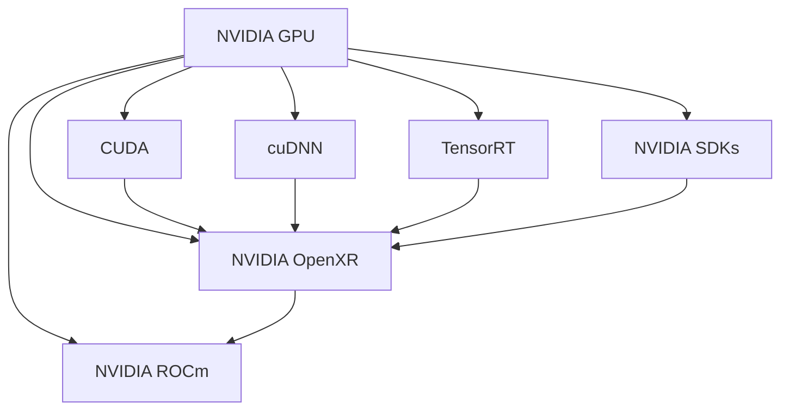
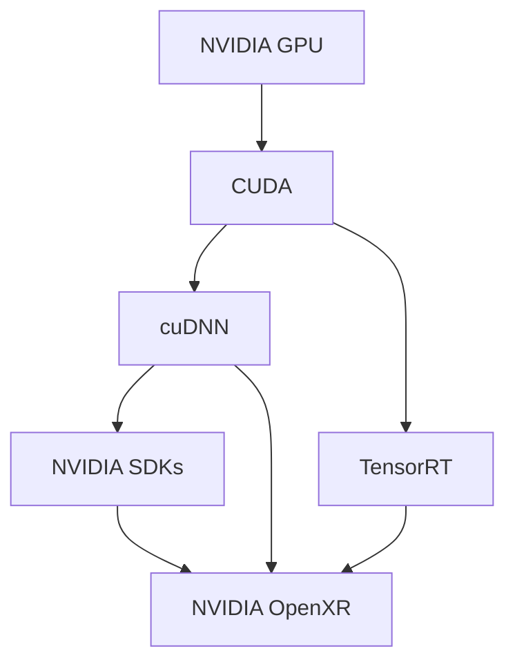
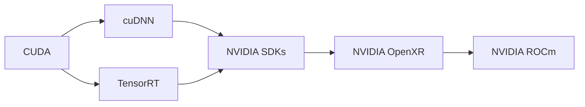
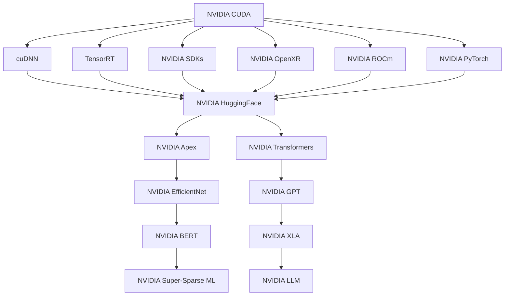

                 

## 1. 背景介绍

随着深度学习技术的迅速发展，大规模运算成为推动人工智能发展的关键因素。作为全球领先的人工智能硬件公司，NVIDIA在GPU、TPU等运算硬件和相关软件工具的开发方面，做出了巨大贡献，推动了大规模运算技术的普及与应用。

NVIDIA在GPU计算、深度学习、自动驾驶、游戏等多个领域表现出色，其硬件和软件技术在全球范围内被广泛应用。NVIDIA的CUDA和cuDNN等软件工具，为深度学习和大规模运算提供了强有力的支持，推动了AI技术的快速发展。

本文将深入探讨NVIDIA在大规模运算领域的支持，包括其硬件架构、软件工具、开源项目等，并分析其对深度学习和人工智能发展的贡献。

## 2. 核心概念与联系

### 2.1 核心概念概述

为更好地理解NVIDIA在大规模运算方面的支持，本节将介绍几个密切相关的核心概念：

- NVIDIA GPU：NVIDIA生产的图形处理单元，具有强大的并行计算能力，被广泛应用于深度学习和人工智能领域。
- CUDA：NVIDIA开发的并行计算平台和编程模型，旨在加速GPU上的计算任务，支持C++、Python等多种语言。
- cuDNN：NVIDIA开发的深度神经网络库，提供了高效的深度学习算法实现，支持多种深度学习框架。
- TensorRT：NVIDIA开发的优化深度学习模型推理的工具，可以大幅提高模型推理速度。
- NVIDIA SDKs：NVIDIA提供的软件开发者套件，包括深度学习库、图形渲染库、虚拟现实库等。
- NVIDIA OpenXR：NVIDIA开发的虚拟现实平台，支持跨平台、跨设备的VR/AR应用开发。
- NVIDIA ROCm：NVIDIA开发的GPU计算平台，支持RISC-V指令集，用于深度学习、科学计算等领域。

这些核心概念之间的逻辑关系可以通过以下Mermaid流程图来展示：



这个流程图展示了大规模运算相关核心概念及其之间的关系：

1. NVIDIA GPU是基础硬件平台。
2. CUDA、cuDNN、TensorRT、NVIDIA SDKs、NVIDIA OpenXR、NVIDIA ROCm是软硬件工具和平台，分别提供GPU计算、深度学习、模型推理、开发者工具、虚拟现实、计算平台等方面的支持。
3. 这些工具和平台共同构成了NVIDIA在大规模运算领域的完整生态系统，涵盖了从硬件到软件、从研发到应用的各个环节。

### 2.2 概念间的关系

这些核心概念之间存在着紧密的联系，形成了NVIDIA在大规模运算领域的完整生态系统。下面我通过几个Mermaid流程图来展示这些概念之间的关系。

#### 2.2.1 硬件与软件的相互支持



这个流程图展示了NVIDIA硬件与软件之间的相互支持关系：

1. NVIDIA GPU提供了强大的并行计算能力，是CUDA、cuDNN、TensorRT等软件工具的基础。
2. CUDA提供了GPU并行计算的编程模型，支持深度学习、图形渲染、虚拟现实等应用开发。
3. cuDNN提供了高效的深度学习算法实现，进一步加速了深度学习任务的计算。
4. TensorRT提供了模型推理优化工具，提高了深度学习模型的推理速度。
5. NVIDIA SDKs和NVIDIA OpenXR等平台工具，基于CUDA和cuDNN等软件框架，提供了应用开发的基础支持。

#### 2.2.2 软件工具之间的协同工作



这个流程图展示了不同软件工具之间的协同工作关系：

1. CUDA、cuDNN、TensorRT等软件工具基于NVIDIA GPU硬件平台，提供了深度学习、模型推理等计算任务的支持。
2. NVIDIA SDKs提供了应用开发的基础工具，如图形渲染、虚拟现实等。
3. NVIDIA OpenXR是基于CUDA等软件框架的虚拟现实平台，支持跨平台、跨设备的VR/AR应用开发。
4. NVIDIA ROCm是基于RISC-V指令集的GPU计算平台，支持深度学习、科学计算等领域。

#### 2.2.3 开源项目与商业应用的结合



这个流程图展示了NVIDIA开源项目与商业应用的结合关系：

1. CUDA、cuDNN、TensorRT、NVIDIA SDKs、NVIDIA OpenXR、NVIDIA ROCm等软件工具是NVIDIA开放的平台和框架，提供了广泛的应用支持。
2. NVIDIA PyTorch、NVIDIA HuggingFace、NVIDIA Transformers等开源项目基于NVIDIA软件平台，提供了深度学习、模型推理等功能的实现。
3. NVIDIA Apex、NVIDIA EfficientNet、NVIDIA GPT、NVIDIA BERT、NVIDIA XLA、NVIDIA Super-Sparse ML、NVIDIA LLM等商业产品，基于NVIDIA软件平台，提供了高性能、易用的计算能力。
4. 这些开源项目与商业应用共同构成了NVIDIA在大规模运算领域的完整生态系统，推动了深度学习、图形渲染、虚拟现实、科学计算等领域的广泛应用。

### 2.3 核心概念的整体架构

最后，我们用一个综合的流程图来展示这些核心概念在大规模运算领域的整体架构：

```mermaid
graph TB
    A[NVIDIA GPU] --> B[CUDA]
    B --> C[cuDNN]
    B --> D[TensorRT]
    C --> E[NVIDIA SDKs]
    C --> F[NVIDIA OpenXR]
    D --> F
    E --> F
    A --> G[NVIDIA ROCm]
    G --> H[NVIDIA PyTorch]
    G --> I[NVIDIA HuggingFace]
    G --> J[NVIDIA Transformers]
    H --> I
    I --> J
    A --> K[NVIDIA Apex]
    A --> L[NVIDIA EfficientNet]
    A --> M[NVIDIA GPT]
    A --> N[NVIDIA BERT]
    A --> O[NVIDIA XLA]
    A --> P[NVIDIA Super-Sparse ML]
    A --> Q[NVIDIA LLM]
    H --> R[NVIDIA Apex]
    H --> S[NVIDIA EfficientNet]
    H --> T[NVIDIA GPT]
    H --> U[NVIDIA BERT]
    H --> V[NVIDIA XLA]
    H --> W[NVIDIA Super-Sparse ML]
    H --> X[NVIDIA LLM]
    I --> Y[NVIDIA Apex]
    I --> Z[NVIDIA EfficientNet]
    I --> AA[NVIDIA GPT]
    I --> BB[NVIDIA BERT]
    I --> CC[NVIDIA XLA]
    I --> DD[NVIDIA Super-Sparse ML]
    I --> EE[NVIDIA LLM]
    J --> FF[NVIDIA Apex]
    J --> GG[NVIDIA EfficientNet]
    J --> HH[NVIDIA GPT]
    J --> II[NVIDIA BERT]
    J --> JJ[NVIDIA XLA]
    J --> KK[NVIDIA Super-Sparse ML]
    J --> LL[NVIDIA LLM]
    K --> MM[NVIDIA Apex]
    K --> NN[NVIDIA EfficientNet]
    K --> OO[NVIDIA GPT]
    K --> PP[NVIDIA BERT]
    K --> QQ[NVIDIA XLA]
    K --> RR[NVIDIA Super-Sparse ML]
    K --> SS[NVIDIA LLM]
    L --> TT[NVIDIA Apex]
    L --> UU[NVIDIA EfficientNet]
    L --> VV[NVIDIA GPT]
    L --> WW[NVIDIA BERT]
    L --> XX[NVIDIA XLA]
    L --> YY[NVIDIA Super-Sparse ML]
    L --> ZZ[NVIDIA LLM]
    M --> WW[NVIDIA Apex]
    M --> XX[NVIDIA EfficientNet]
    M --> YY[NVIDIA GPT]
    M --> ZZ[NVIDIA BERT]
    M --> AA[NVIDIA XLA]
    M --> BB[NVIDIA Super-Sparse ML]
    M --> CC[NVIDIA LLM]
    N --> DD[NVIDIA Apex]
    N --> EE[NVIDIA EfficientNet]
    N --> FF[NVIDIA GPT]
    N --> GG[NVIDIA BERT]
    N --> HH[NVIDIA XLA]
    N --> II[NVIDIA Super-Sparse ML]
    N --> JJ[NVIDIA LLM]
    O --> II[NVIDIA Apex]
    O --> JJ[NVIDIA EfficientNet]
    O --> KK[NVIDIA GPT]
    O --> LL[NVIDIA BERT]
    O --> MM[NVIDIA XLA]
    O --> NN[NVIDIA Super-Sparse ML]
    O --> OO[NVIDIA LLM]
    P --> NN[NVIDIA Apex]
    P --> OO[NVIDIA EfficientNet]
    P --> PP[NVIDIA GPT]
    P --> QQ[NVIDIA BERT]
    P --> RR[NVIDIA XLA]
    P --> SS[NVIDIA Super-Sparse ML]
    P --> TT[NVIDIA LLM]
    Q --> SS[NVIDIA Apex]
    Q --> TT[NVIDIA EfficientNet]
    Q --> UU[NVIDIA GPT]
    Q --> VV[NVIDIA BERT]
    Q --> WW[NVIDIA XLA]
    Q --> XX[NVIDIA Super-Sparse ML]
    Q --> YY[NVIDIA LLM]
    R --> VV[NVIDIA Apex]
    R --> WW[NVIDIA EfficientNet]
    R --> XX[NVIDIA GPT]
    R --> YY[NVIDIA BERT]
    R --> ZZ[NVIDIA XLA]
    R --> AA[NVIDIA Super-Sparse ML]
    R --> BB[NVIDIA LLM]
    S --> AA[NVIDIA Apex]
    S --> BB[NVIDIA EfficientNet]
    S --> CC[NVIDIA GPT]
    S --> DD[NVIDIA BERT]
    S --> EE[NVIDIA XLA]
    S --> FF[NVIDIA Super-Sparse ML]
    S --> GG[NVIDIA LLM]
    T --> FF[NVIDIA Apex]
    T --> GG[NVIDIA EfficientNet]
    T --> HH[NVIDIA GPT]
    T --> II[NVIDIA BERT]
    T --> JJ[NVIDIA XLA]
    T --> KK[NVIDIA Super-Sparse ML]
    T --> LL[NVIDIA LLM]
    U --> JJ[NVIDIA Apex]
    U --> KK[NVIDIA EfficientNet]
    U --> LL[NVIDIA GPT]
    U --> MM[NVIDIA BERT]
    U --> NN[NVIDIA XLA]
    U --> OO[NVIDIA Super-Sparse ML]
    U --> PP[NVIDIA LLM]
    V --> KK[NVIDIA Apex]
    V --> LL[NVIDIA EfficientNet]
    V --> MM[NVIDIA GPT]
    V --> NN[NVIDIA BERT]
    V --> OO[NVIDIA XLA]
    V --> PP[NVIDIA Super-Sparse ML]
    V --> QQ[NVIDIA LLM]
    W --> LL[NVIDIA Apex]
    W --> MM[NVIDIA EfficientNet]
    W --> NN[NVIDIA GPT]
    W --> OO[NVIDIA BERT]
    W --> PP[NVIDIA XLA]
    W --> QQ[NVIDIA Super-Sparse ML]
    W --> RR[NVIDIA LLM]
    X --> NN[NVIDIA Apex]
    X --> OO[NVIDIA EfficientNet]
    X --> PP[NVIDIA GPT]
    X --> QQ[NVIDIA BERT]
    X --> RR[NVIDIA XLA]
    X --> SS[NVIDIA Super-Sparse ML]
    X --> TT[NVIDIA LLM]
    Y --> PP[NVIDIA Apex]
    Y --> QQ[NVIDIA EfficientNet]
    Y --> RR[NVIDIA GPT]
    Y --> SS[NVIDIA BERT]
    Y --> TT[NVIDIA XLA]
    Y --> UU[NVIDIA Super-Sparse ML]
    Y --> VV[NVIDIA LLM]
    Z --> QQ[NVIDIA Apex]
    Z --> RR[NVIDIA EfficientNet]
    Z --> SS[NVIDIA GPT]
    Z --> TT[NVIDIA BERT]
    Z --> UU[NVIDIA XLA]
    Z --> VV[NVIDIA Super-Sparse ML]
    Z --> WW[NVIDIA LLM]
    AA --> TT[NVIDIA Apex]
    AA --> UU[NVIDIA EfficientNet]
    AA --> VV[NVIDIA GPT]
    AA --> WW[NVIDIA BERT]
    AA --> XX[NVIDIA XLA]
    AA --> YY[NVIDIA Super-Sparse ML]
    AA --> ZZ[NVIDIA LLM]
    BB --> VV[NVIDIA Apex]
    BB --> WW[NVIDIA EfficientNet]
    BB --> XX[NVIDIA GPT]
    BB --> YY[NVIDIA BERT]
    BB --> ZZ[NVIDIA XLA]
    BB --> AA[NVIDIA Super-Sparse ML]
    BB --> BB[NVIDIA LLM]
    CC --> WW[NVIDIA Apex]
    CC --> XX[NVIDIA EfficientNet]
    CC --> YY[NVIDIA GPT]
    CC --> ZZ[NVIDIA BERT]
    CC --> AA[NVIDIA XLA]
    CC --> BB[NVIDIA Super-Sparse ML]
    CC --> CC[NVIDIA LLM]
    DD --> BB[NVIDIA Apex]
    DD --> CC[NVIDIA EfficientNet]
    DD --> DD[NVIDIA GPT]
    DD --> EE[NVIDIA BERT]
    DD --> FF[NVIDIA XLA]
    DD --> GG[NVIDIA Super-Sparse ML]
    DD --> HH[NVIDIA LLM]
    EE --> CC[NVIDIA Apex]
    EE --> DD[NVIDIA EfficientNet]
    EE --> EE[NVIDIA GPT]
    EE --> FF[NVIDIA BERT]
    EE --> GG[NVIDIA XLA]
    EE --> HH[NVIDIA Super-Sparse ML]
    EE --> II[NVIDIA LLM]
    FF --> DD[NVIDIA Apex]
    FF --> EE[NVIDIA EfficientNet]
    FF --> FF[NVIDIA GPT]
    FF --> GG[NVIDIA BERT]
    FF --> HH[NVIDIA XLA]
    FF --> II[NVIDIA Super-Sparse ML]
    FF --> JJ[NVIDIA LLM]
    GG --> EE[NVIDIA Apex]
    GG --> FF[NVIDIA EfficientNet]
    GG --> GG[NVIDIA GPT]
    GG --> HH[NVIDIA BERT]
    GG --> II[NVIDIA XLA]
    GG --> JJ[NVIDIA Super-Sparse ML]
    GG --> KK[NVIDIA LLM]
    HH --> FF[NVIDIA Apex]
    HH --> GG[NVIDIA EfficientNet]
    HH --> HH[NVIDIA GPT]
    HH --> II[NVIDIA BERT]
    HH --> JJ[NVIDIA XLA]
    HH --> KK[NVIDIA Super-Sparse ML]
    HH --> LL[NVIDIA LLM]
    II --> JJ[NVIDIA Apex]
    II --> KK[NVIDIA EfficientNet]
    II --> LL[NVIDIA GPT]
    II --> MM[NVIDIA BERT]
    II --> NN[NVIDIA XLA]
    II --> OO[NVIDIA Super-Sparse ML]
    II --> PP[NVIDIA LLM]
    JJ --> KK[NVIDIA Apex]
    JJ --> LL[NVIDIA EfficientNet]
    JJ --> MM[NVIDIA GPT]
    JJ --> NN[NVIDIA BERT]
    JJ --> OO[NVIDIA XLA]
    JJ --> PP[NVIDIA Super-Sparse ML]
    JJ --> QQ[NVIDIA LLM]
    KK --> LL[NVIDIA Apex]
    KK --> MM[NVIDIA EfficientNet]
    KK --> NN[NVIDIA GPT]
    KK --> OO[NVIDIA BERT]
    KK --> PP[NVIDIA XLA]
    KK --> QQ[NVIDIA Super-Sparse ML]
    KK --> RR[NVIDIA LLM]
    LL --> MM[NVIDIA Apex]
    LL --> NN[NVIDIA EfficientNet]
    LL --> OO[NVIDIA GPT]
    LL --> PP[NVIDIA BERT]
    LL --> QQ[NVIDIA XLA]
    LL --> RR[NVIDIA Super-Sparse ML]
    LL --> SS[NVIDIA LLM]
    MM --> NN[NVIDIA Apex]
    MM --> OO[NVIDIA EfficientNet]
    MM --> PP[NVIDIA GPT]
    MM --> QQ[NVIDIA BERT]
    MM --> RR[NVIDIA XLA]
    MM --> SS[NVIDIA Super-Sparse ML]
    MM --> TT[NVIDIA LLM]
    NN --> OO[NVIDIA Apex]
    NN --> PP[NVIDIA EfficientNet]
    NN --> QQ[NVIDIA GPT]
    NN --> RR[NVIDIA BERT]
    NN --> SS[NVIDIA XLA]
    NN --> TT[NVIDIA Super-Sparse ML]
    NN --> UU[NVIDIA LLM]
    OO --> PP[NVIDIA Apex]
    OO --> QQ[NVIDIA EfficientNet]
    OO --> RR[NVIDIA GPT]
    OO --> SS[NVIDIA BERT]
    OO --> TT[NVIDIA XLA]
    OO --> UU[NVIDIA Super-Sparse ML]
    OO --> VV[NVIDIA LLM]
    PP --> QQ[NVIDIA Apex]
    PP --> RR[NVIDIA EfficientNet]
    PP --> SS[NVIDIA GPT]
    PP --> TT[NVIDIA BERT]
    PP --> UU[NVIDIA XLA]
    PP --> VV[NVIDIA Super-Sparse ML]
    PP --> WW[NVIDIA LLM]
    QQ --> RR[NVIDIA Apex]
    QQ --> SS[NVIDIA EfficientNet]
    QQ --> TT[NVIDIA GPT]
    QQ --> UU[NVIDIA BERT]
    QQ --> VV[NVIDIA XLA]
    QQ --> WW[NVIDIA Super-Sparse ML]
    QQ --> XX[NVIDIA LLM]
    RR --> SS[NVIDIA Apex]
    RR --> TT[NVIDIA EfficientNet]
    RR --> UU[NVIDIA GPT]
    RR --> VV[NVIDIA BERT]
    RR --> WW[NVIDIA XLA]
    RR --> XX[NVIDIA Super-Sparse ML]
    RR --> YY[NVIDIA LLM]
    SS --> TT[NVIDIA Apex]
    SS --> UU[NVIDIA EfficientNet]
    SS --> VV[NVIDIA GPT]
    SS --> WW[NVIDIA BERT]
    SS --> XX[NVIDIA XLA]
    SS --> YY[NVIDIA Super-Sparse ML]
    SS --> ZZ[NVIDIA LLM]
    TT --> UU[NVIDIA Apex]
    TT --> VV[NVIDIA EfficientNet]
    TT --> WW[NVIDIA GPT]
    TT --> XX[NVIDIA BERT]
    TT --> YY[NVIDIA XLA]
    TT --> ZZ[NVIDIA Super-Sparse ML]
    TT --> AA[NVIDIA LLM]
    UU --> VV[NVIDIA Apex]
    UU --> WW[NVIDIA EfficientNet]
    UU --> XX[NVIDIA GPT]
    UU --> YY[NVIDIA BERT]
    UU --> ZZ[NVIDIA XLA]
    UU --> AA[NVIDIA Super-Sparse ML]
    UU --> BB[NVIDIA LLM]
    VV --> WW[NVIDIA Apex]
    VV --> XX[NVIDIA EfficientNet]
    VV --> YY[NVIDIA GPT]
    VV --> ZZ[NVIDIA BERT]
    VV --> AA[NVIDIA XLA]
    VV --> BB[NVIDIA Super-Sparse ML]
    VV --> CC[NVIDIA LLM]
    WW --> XX[NVIDIA Apex]
    WW --> YY[NVIDIA EfficientNet]
    WW --> ZZ[NVIDIA GPT]
    WW --> AA[NVIDIA BERT]
    WW --> BB[NVIDIA XLA]
    WW --> CC[NVIDIA Super-Sparse ML]
    WW --> DD[NVIDIA LLM]
    XX --> YY[NVIDIA Apex]
    XX --> ZZ[NVIDIA EfficientNet]
    XX --> AA[NVIDIA GPT]
    XX --> BB[NVIDIA BERT]
    XX --> CC[NVIDIA XLA]
    XX --> DD[NVIDIA Super-Sparse ML]
    XX --> EE[NVIDIA LLM]
    YY --> ZZ[NVIDIA Apex]
    YY --> AA[NVIDIA EfficientNet]
    YY --> BB[NVIDIA GPT]
    YY --> CC[NVIDIA BERT]
    YY --> DD[NVIDIA XLA]
    YY --> EE[NVIDIA Super-Sparse ML]
    YY --> FF[NVIDIA LLM]
    ZZ --> AA[NVIDIA Apex]
    ZZ --> BB[NVIDIA EfficientNet]
    ZZ --> CC[NVIDIA GPT]
    ZZ --> DD[NVIDIA BERT]
    ZZ --> EE[NVIDIA XLA]
    ZZ --> FF[NVIDIA Super-Sparse ML]
    ZZ --> GG[NVIDIA LLM]
    AA --> BB[NVIDIA Apex]
    AA --> CC[NVIDIA EfficientNet]
    AA --> DD[NVIDIA GPT]
    AA --> EE[NVIDIA BERT]
    AA --> FF[NVIDIA XLA]
    AA --> GG[NVIDIA Super-Sparse ML]
    AA --> HH[NVIDIA LLM]
    BB --> CC[NVIDIA Apex]
    BB --> DD[NVIDIA EfficientNet]
    BB --> EE[NVIDIA GPT]
    BB --> FF[NVIDIA BERT]
    BB --> GG[NVIDIA XLA]
    BB --> HH[NVIDIA Super-Sparse ML]
    BB --> II[NVIDIA LLM]
    CC --> DD[NVIDIA Apex]
    CC --> EE[NVIDIA EfficientNet]
    CC --> FF[NVIDIA GPT]
    CC --> GG[NVIDIA BERT]
    CC --> HH[NVIDIA XLA]
    CC --> II[NVIDIA Super-Sparse ML]
    CC --> JJ[NVIDIA LLM]
    DD --> EE[NVIDIA Apex]
    DD --> FF[NVIDIA EfficientNet]
    DD --> GG[NVIDIA GPT]
    DD --> HH[NVIDIA BERT]
    DD --> II[NVIDIA XLA]
    DD --> JJ[NVIDIA Super-Sparse ML]
    DD --> KK[NVIDIA LLM]
    EE --> FF[NVIDIA Apex]
    EE --> GG[NVIDIA EfficientNet]
    EE --> HH[NVIDIA GPT]
    EE --> II[NVIDIA BERT]
    EE --> JJ[NVIDIA XLA]
    EE --> KK[NVIDIA Super-Sparse ML]
    EE --> LL[NVIDIA LLM]
    FF --> GG[NVIDIA Apex]
    FF --> HH[NVIDIA EfficientNet]
    FF --> II[NVIDIA GPT]
    FF --> JJ[NVIDIA BERT]
    FF --> KK[NVIDIA XLA]
    FF --> LL[NVIDIA Super-Sparse ML]
    FF --> MM[NVIDIA LLM]
    GG --> HH[NVIDIA Apex]
    GG --> II[NVIDIA EfficientNet]
    GG --> JJ[NVIDIA GPT]
    GG --> KK[NVIDIA BERT]
    GG --> LL[NVIDIA XLA]
    GG --> MM[NVIDIA Super-Sparse ML]
    GG --> NN[NVIDIA LLM]
    HH --> II[NVIDIA Apex]
    HH --> JJ[NVIDIA EfficientNet]
    HH --> KK[NVIDIA GPT]
    HH --> LL[NVIDIA BERT]
    HH --> MM[NVIDIA XLA]
    HH --> NN[NVIDIA Super-Sparse ML]
    HH --> OO[NVIDIA LLM]
    II --> JJ[NVIDIA Apex]
    II --> KK[NVIDIA EfficientNet]
    II --> LL[NVIDIA GPT]
    II --> MM[NVIDIA BERT]
    II --> NN[NVIDIA XLA]
    II --> OO[NVIDIA Super-Sparse ML]
    II --> PP[NVIDIA LLM]
    JJ --> KK[NVIDIA Apex]
    JJ --> LL[NVIDIA EfficientNet]
    JJ --> MM[NVIDIA GPT]
    JJ --> NN[NVIDIA BERT]
    JJ --> OO[NVIDIA XLA]
    JJ --> PP[NVIDIA Super-Sparse ML]
    JJ --> QQ[NVIDIA LLM]
    KK --> LL[NVIDIA Apex]
    KK --> MM[NVIDIA EfficientNet]
    KK --> NN[NVIDIA GPT]
    KK --> OO[NVIDIA BERT]
    KK --> PP[NVIDIA XLA]
    KK --> QQ[NVIDIA Super-Sparse ML]
    KK --> RR[NVIDIA LLM]
    LL --> MM[NVIDIA Apex]
    LL --> NN[NVIDIA EfficientNet]
    LL --> OO[NVIDIA GPT]
    LL --> PP[NVIDIA BERT]
    LL --> QQ[NVIDIA XLA]
    LL --> RR[NVIDIA Super-Sparse ML]
    LL --> SS[NVIDIA LLM]
    MM --> NN[NVIDIA Apex]
    MM --> OO[NVIDIA EfficientNet]
    MM --> PP[NVIDIA GPT]
    MM --> QQ[NVIDIA BERT]
    MM --> RR[NVIDIA XLA]
    MM --> SS[NVIDIA Super-Sparse ML]
    MM --> TT[NVIDIA LLM]
    NN --> OO[NVIDIA Apex]
    NN --> PP[NVIDIA EfficientNet]
    NN --> QQ[NVIDIA GPT]
    NN --> RR[NVIDIA BERT]
    NN --> SS[NVIDIA XLA]
    NN --> TT[NVIDIA Super-Sparse ML]
    NN --> UU[NVIDIA LLM]
    OO --> PP[NVIDIA Apex]
    OO --> QQ[NVIDIA EfficientNet]
    OO --> RR[NVIDIA GPT]
    OO --> SS[NVIDIA BERT]
    OO --> TT[NVIDIA XLA]
    OO --> UU[NVIDIA Super-Sparse ML]
    OO --> VV[NVIDIA LLM]
    PP --> QQ[NVIDIA Apex]
    PP --> RR[NVIDIA EfficientNet]
    PP --> SS[NVIDIA GPT]
    PP --> TT[NVIDIA BERT]
    PP --> UU[NVIDIA XLA]
    PP --> VV[NVIDIA Super-Sparse ML]
    PP --> WW[NVIDIA LLM]
    QQ --> RR[NVIDIA Apex]
    QQ --> SS[NVIDIA EfficientNet]
    QQ --> TT[NVIDIA GPT]
    QQ --> UU[NVIDIA B

