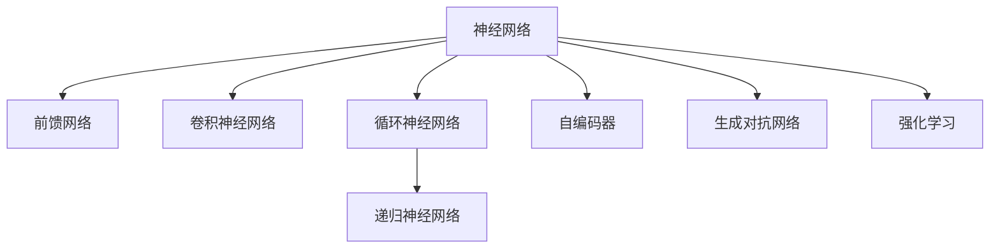
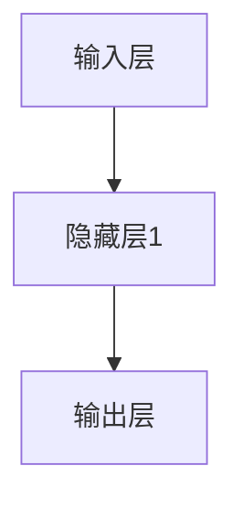
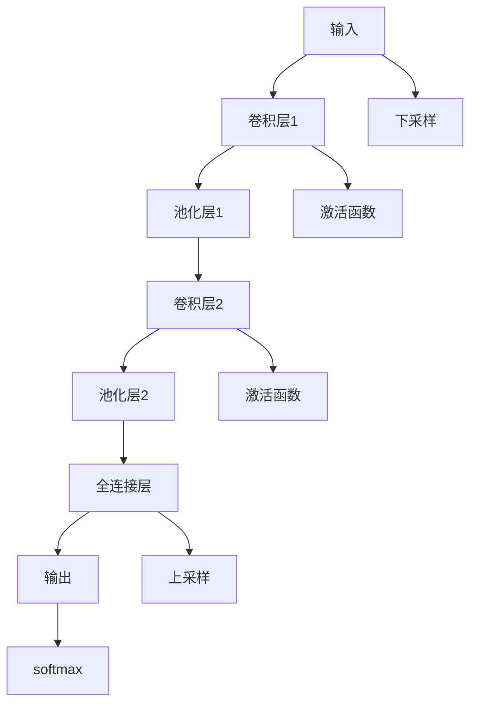
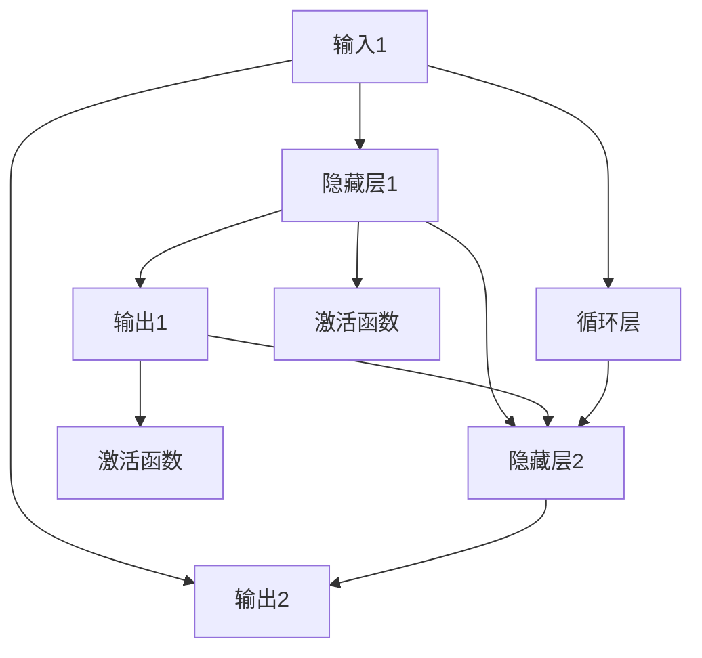
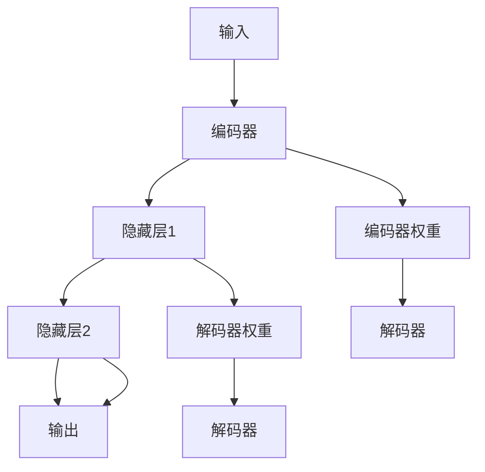
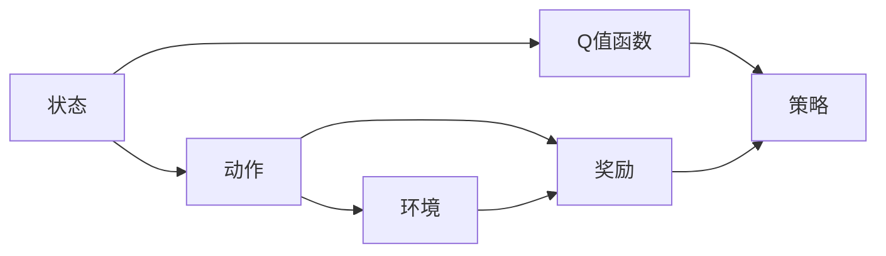
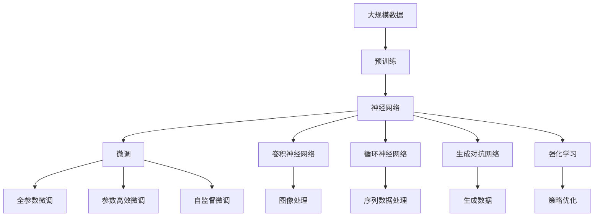

                 

# Neural Network

> 关键词：神经网络,深度学习,前馈网络,卷积神经网络,循环神经网络,递归神经网络,自编码器,生成对抗网络,强化学习

## 1. 背景介绍

### 1.1 问题由来
随着计算机科学和人工智能技术的迅猛发展，人工智能的应用领域越来越广泛。从图像识别、语音识别、自然语言处理到机器人控制，人工智能技术正在逐渐渗透到社会的各个角落。神经网络作为一种重要的机器学习模型，已经成为了人工智能技术的核心基础。

神经网络是一种模仿人类大脑工作机制的计算模型，通过多层神经元的连接和激活，实现数据的自动学习和处理。它最早由生物学家和认知科学家提出，并经过多次演变和改进，逐渐成为了深度学习领域的重要工具。

## 2. 核心概念与联系

### 2.1 核心概念概述
为更好地理解神经网络的工作原理和应用场景，本节将介绍几个密切相关的核心概念：

- 神经网络(Neural Network, NN)：通过多层神经元连接的计算模型，可以用于分类、回归、聚类等多种机器学习任务。
- 前馈网络(Feedforward Neural Network, FNN)：最简单的神经网络类型，数据从输入层单向传递到输出层，不存在循环连接。
- 卷积神经网络(Convolutional Neural Network, CNN)：用于图像识别和计算机视觉任务，通过卷积和池化等操作提取图像特征。
- 循环神经网络(Recurrent Neural Network, RNN)：用于序列数据处理，如自然语言处理和语音识别，通过循环连接实现时间上的信息传递。
- 递归神经网络(Recurrent Neural Network, RNN)：一种特殊的循环神经网络，适用于序列数据的处理，但存在梯度消失和梯度爆炸等问题。
- 自编码器(Autoder_ENCODER)：一种无监督学习模型，通过重构输入数据来学习特征表示，常用于降维和数据压缩。
- 生成对抗网络(Generator Adversarial Network, GAN)：一种生成模型，通过生成器和判别器的对抗训练生成高质量的图像、语音等数据。
- 强化学习(Reinforcement Learning, RL)：一种通过奖励和惩罚来优化策略的学习方式，常用于游戏、机器人控制等任务。

这些核心概念之间的逻辑关系可以通过以下Mermaid流程图来展示：

这个流程图展示了几类主要的神经网络类型以及它们之间的关系：

1. 神经网络是所有其他网络类型的总称。
2. 前馈网络是最简单的神经网络类型，没有循环连接。
3. 卷积神经网络用于图像处理，通过卷积和池化操作提取图像特征。
4. 循环神经网络用于序列数据处理，通过循环连接实现时间上的信息传递。
5. 递归神经网络是循环神经网络的一种特殊形式，适用于序列数据的处理，但存在梯度消失和梯度爆炸等问题。
6. 自编码器是一种无监督学习模型，通过重构输入数据来学习特征表示。
7. 生成对抗网络是一种生成模型，通过生成器和判别器的对抗训练生成高质量的图像、语音等数据。
8. 强化学习是一种通过奖励和惩罚来优化策略的学习方式，常用于游戏、机器人控制等任务。

### 2.2 概念间的关系

这些核心概念之间存在着紧密的联系，形成了神经网络的应用框架。下面我们通过几个Mermaid流程图来展示这些概念之间的关系。

#### 2.2.1 神经网络的层次结构

这个流程图展示了神经网络的基本层次结构，数据从输入层通过隐藏层，最终输出到输出层。

#### 2.2.2 前馈网络与反向传播

这个流程图展示了前馈网络和反向传播的基本过程。前向传播通过隐藏层对输入进行计算，输出结果与真实标签进行对比，计算损失函数；反向传播则通过链式法则计算梯度，更新模型参数。

#### 2.2.3 卷积神经网络的结构

这个流程图展示了卷积神经网络的基本结构，包括卷积层、池化层、全连接层和激活函数等。

#### 2.2.4 循环神经网络的结构

这个流程图展示了循环神经网络的基本结构，包括循环层、隐藏层、激活函数等。

#### 2.2.5 自编码器的结构

这个流程图展示了自编码器的基本结构，包括编码器、隐藏层和解码器等。

#### 2.2.6 生成对抗网络的结构

这个流程图展示了生成对抗网络的基本结构，包括生成器和判别器。

#### 2.2.7 强化学习的结构

这个流程图展示了强化学习的基本结构，包括状态、动作、环境和策略等。

### 2.3 核心概念的整体架构

最后，我们用一个综合的流程图来展示这些核心概念在大神经网络微调过程中的整体架构：

这个综合流程图展示了从预训练到微调，再到特定领域任务的微调过程。神经网络通过大规模数据进行预训练，然后通过微调在特定领域进行优化，使其能够适应不同的应用场景。同时，不同类型的神经网络可以应用于不同的任务，如图像处理、序列数据处理、生成数据处理和策略优化等。通过这些不同类型的神经网络，我们可以更好地解决实际问题。

## 3. 核心算法原理 & 具体操作步骤
### 3.1 算法原理概述

神经网络的微调算法是一种有监督的训练过程，其主要目标是通过少量的标注数据，对预训练模型进行微调，使其在特定任务上获得更好的性能。

神经网络的微调过程通常包括以下几个步骤：

1. 准备数据集：收集包含标注的训练集和验证集，数据集应当包含足够的样本，以覆盖所有可能的输入和输出。

2. 选择合适的模型：选择合适的神经网络模型，并根据任务类型设计合适的网络结构。

3. 微调模型的参数：通过反向传播算法，更新模型的权重和偏置，以最小化预测结果与真实标签之间的误差。

4. 评估模型性能：在验证集上评估模型的性能，以避免过拟合。

5. 微调完成：当模型在验证集上的性能不再提升时，微调完成。

### 3.2 算法步骤详解

以下是基于神经网络的微调过程的具体操作步骤：

**Step 1: 准备数据集**

- 收集标注数据集，并将其划分为训练集和验证集。训练集用于训练模型，验证集用于评估模型性能，避免过拟合。
- 对数据进行预处理，包括数据清洗、归一化、数据增强等操作。

**Step 2: 选择模型**

- 根据任务类型选择合适的神经网络模型，如卷积神经网络用于图像识别，循环神经网络用于自然语言处理。
- 设计网络结构，包括输入层、隐藏层和输出层的层数和神经元数量。

**Step 3: 初始化模型**

- 对模型进行初始化，包括权重和偏置的初始化。通常使用随机初始化或者预训练模型进行初始化。

**Step 4: 训练模型**

- 使用训练集对模型进行训练，采用反向传播算法更新模型的参数。
- 在每个epoch后，在验证集上评估模型性能，避免过拟合。

**Step 5: 微调完成**

- 当模型在验证集上的性能不再提升时，微调完成。此时可以将模型用于实际应用中。

### 3.3 算法优缺点

神经网络微调算法具有以下优点：

- 能够在特定任务上快速提升模型性能，适合小规模数据集。
- 可以保持预训练模型的特征表示，减少训练时间。

同时，神经网络微调算法也存在以下缺点：

- 对标注数据的依赖较大，标注数据的获取成本较高。
- 容易过拟合，需要更多的正则化技术来避免过拟合。
- 计算资源需求较大，需要高性能的计算设备。

### 3.4 算法应用领域

神经网络的微调算法在多个领域得到了广泛的应用，如：

- 图像识别：通过卷积神经网络在特定任务上进行微调，如物体检测、人脸识别等。
- 自然语言处理：通过循环神经网络或Transformer模型在特定任务上进行微调，如语言翻译、情感分析等。
- 语音识别：通过循环神经网络或卷积神经网络在特定任务上进行微调，如语音转文本等。
- 推荐系统：通过神经网络模型在特定任务上进行微调，如协同过滤、基于内容的推荐等。

## 4. 数学模型和公式 & 详细讲解 & 举例说明

### 4.1 数学模型构建

神经网络的数学模型通常由以下几个部分组成：

1. 输入层：接收输入数据，并将其传递给隐藏层。
2. 隐藏层：对输入数据进行处理，并传递给输出层。
3. 输出层：根据隐藏层的输出，计算出预测结果。

神经网络的数学模型可以表示为：

$$
\hat{y} = f(\mathbf{W}_1\mathbf{x} + \mathbf{b}_1) + \mathbf{b}_2
$$

其中，$\mathbf{W}_1$ 和 $\mathbf{b}_1$ 为隐藏层的权重和偏置，$\mathbf{W}_2$ 和 $\mathbf{b}_2$ 为输出层的权重和偏置，$f$ 为激活函数，$\mathbf{x}$ 为输入数据，$\hat{y}$ 为预测结果。

### 4.2 公式推导过程

神经网络的反向传播算法是微调的核心算法之一。其基本思想是通过链式法则计算梯度，更新模型参数。

假设当前训练样本的输入为 $\mathbf{x}$，目标输出为 $\mathbf{y}$，当前神经网络的预测结果为 $\hat{\mathbf{y}}$。损失函数为均方误差，表示为：

$$
L = \frac{1}{2}(\mathbf{y} - \hat{\mathbf{y}})^2
$$

神经网络的前向传播过程为：

$$
\begin{align*}
\mathbf{a}_1 &= \mathbf{x} \\
\mathbf{h}_1 &= \mathbf{W}_1\mathbf{a}_1 + \mathbf{b}_1 \\
\mathbf{a}_2 &= f(\mathbf{h}_1) \\
\mathbf{h}_2 &= \mathbf{W}_2\mathbf{a}_2 + \mathbf{b}_2 \\
\hat{\mathbf{y}} &= f(\mathbf{h}_2)
\end{align*}
$$

其中，$\mathbf{a}_1$ 为输入数据，$\mathbf{h}_1$ 为隐藏层的输出，$\mathbf{a}_2$ 为隐藏层的激活值，$\mathbf{h}_2$ 为输出层的输入，$\hat{\mathbf{y}}$ 为输出层的激活值。

神经网络的反向传播过程为：

$$
\begin{align*}
\frac{\partial L}{\partial \mathbf{y}} &= \mathbf{y} - \hat{\mathbf{y}} \\
\frac{\partial L}{\partial \mathbf{h}_2} &= \frac{\partial L}{\partial \hat{\mathbf{y}}} \cdot \frac{\partial \hat{\mathbf{y}}}{\partial \mathbf{h}_2} \\
\frac{\partial L}{\partial \mathbf{a}_2} &= \frac{\partial L}{\partial \mathbf{h}_2} \cdot \frac{\partial \mathbf{h}_2}{\partial \mathbf{a}_2} \\
\frac{\partial L}{\partial \mathbf{h}_1} &= \frac{\partial L}{\partial \mathbf{a}_2} \cdot \frac{\partial \mathbf{a}_2}{\partial \mathbf{h}_1} \\
\frac{\partial L}{\partial \mathbf{W}_1} &= \frac{\partial L}{\partial \mathbf{h}_1} \cdot \mathbf{a}_1^T \\
\frac{\partial L}{\partial \mathbf{b}_1} &= \frac{\partial L}{\partial \mathbf{h}_1} \\
\frac{\partial L}{\partial \mathbf{W}_2} &= \frac{\partial L}{\partial \mathbf{a}_2} \cdot \mathbf{a}_2^T \\
\frac{\partial L}{\partial \mathbf{b}_2} &= \frac{\partial L}{\partial \mathbf{a}_2}
\end{align*}
$$

其中，$\frac{\partial L}{\partial \mathbf{y}}$ 为损失函数对输出的梯度，$\frac{\partial L}{\partial \mathbf{h}_2}$ 为损失函数对输出层的梯度，$\frac{\partial L}{\partial \mathbf{a}_2}$ 为损失函数对隐藏层的梯度，$\frac{\partial L}{\partial \mathbf{h}_1}$ 为损失函数对隐藏层的梯度，$\frac{\partial L}{\partial \mathbf{W}_1}$ 为损失函数对隐藏层权重的梯度，$\frac{\partial L}{\partial \mathbf{b}_1}$ 为损失函数对隐藏层偏置的梯度，$\frac{\partial L}{\partial \mathbf{W}_2}$ 为损失函数对输出层权重的梯度，$\frac{\partial L}{\partial \mathbf{b}_2}$ 为损失函数对输出层偏置的梯度。

### 4.3 案例分析与讲解

下面以卷积神经网络(CNN)为例，介绍其在图像识别任务上的微调过程。

假设我们的任务是对手写数字进行分类，预训练的模型是VGG16。具体步骤如下：

1. 准备数据集：收集手写数字图像，并将其划分为训练集和验证集。
2. 选择模型：选择VGG16作为预训练模型。
3. 初始化模型：使用随机初始化对模型进行初始化。
4. 训练模型：使用训练集对模型进行训练，采用反向传播算法更新模型参数。
5. 微调完成：当模型在验证集上的性能不再提升时，微调完成。

假设我们的预训练模型为VGG16，其基本结构为：

$$
\begin{align*}
\mathbf{h}_1 &= \mathbf{W}_1\mathbf{x} + \mathbf{b}_1 \\
\mathbf{a}_1 &= f(\mathbf{h}_1) \\
\mathbf{h}_2 &= \mathbf{W}_2\mathbf{a}_1 + \mathbf{b}_2 \\
\mathbf{a}_2 &= f(\mathbf{h}_2) \\
\mathbf{h}_3 &= \mathbf{W}_3\mathbf{a}_2 + \mathbf{b}_3 \\
\mathbf{a}_3 &= f(\mathbf{h}_3) \\
\mathbf{h}_4 &= \mathbf{W}_4\mathbf{a}_3 + \mathbf{b}_4 \\
\mathbf{a}_4 &= f(\mathbf{h}_4) \\
\mathbf{h}_5 &= \mathbf{W}_5\mathbf{a}_4 + \mathbf{b}_5 \\
\mathbf{a}_5 &= f(\mathbf{h}_5) \\
\mathbf{h}_6 &= \mathbf{W}_6\mathbf{a}_5 + \mathbf{b}_6 \\
\mathbf{a}_6 &= f(\mathbf{h}_6) \\
\mathbf{h}_7 &= \mathbf{W}_7\mathbf{a}_6 + \mathbf{b}_7 \\
\mathbf{a}_7 &= f(\mathbf{h}_7) \\
\mathbf{h}_8 &= \mathbf{W}_8\mathbf{a}_7 + \mathbf{b}_8 \\
\mathbf{a}_8 &= f(\mathbf{h}_8) \\
\mathbf{h}_9 &= \mathbf{W}_9\mathbf{a}_8 + \mathbf{b}_9 \\
\mathbf{a}_9 &= f(\mathbf{h}_9) \\
\mathbf{h}_{10} &= \mathbf{W}_{10}\mathbf{a}_9 + \mathbf{b}_{10} \\
\mathbf{a}_{10} &= f(\mathbf{h}_{10}) \\
\mathbf{h}_{11} &= \mathbf{W}_{11}\mathbf{a}_{10} + \mathbf{b}_{11} \\
\mathbf{a}_{11} &= f(\mathbf{h}_{11}) \\
\mathbf{h}_{12} &= \mathbf{W}_{12}\mathbf{a}_{11} + \mathbf{b}_{12} \\
\mathbf{a}_{12} &= f(\mathbf{h}_{12}) \\
\mathbf{h}_{13} &= \mathbf{W}_{13}\mathbf{a}_{12} + \mathbf{b}_{13} \\
\mathbf{a}_{13} &= f(\mathbf{h}_{13}) \\
\mathbf{h}_{14} &= \mathbf{W}_{14}\mathbf{a}_{13} + \mathbf{b}_{14} \\
\mathbf{a}_{14} &= f(\mathbf{h}_{14}) \\
\mathbf{h}_{15} &= \mathbf{W}_{15}\mathbf{a}_{14} + \mathbf{b}_{15} \\
\mathbf{a}_{15} &= f(\mathbf{h}_{15}) \\
\mathbf{h}_{16} &= \mathbf{W}_{16}\mathbf{a}_{15} + \mathbf{b}_{16} \\
\mathbf{a}_{16} &= f(\mathbf{h}_{16}) \\
\mathbf{h}_{17} &= \mathbf{W}_{17}\mathbf{a}_{16} + \mathbf{b}_{17} \\
\mathbf{a}_{17} &= f(\mathbf{h}_{17}) \\
\mathbf{h}_{18} &= \mathbf{W}_{18}\mathbf{a}_{17} + \mathbf{b}_{18} \\
\mathbf{a}_{18} &= f(\mathbf{h}_{18}) \\
\mathbf{h}_{19} &= \mathbf{W}_{19}\mathbf{a}_{18} + \mathbf{b}_{19} \\
\mathbf{a}_{19} &= f(\mathbf{h}_{19}) \\
\mathbf{h}_{20} &= \mathbf{W}_{20}\mathbf{a}_{19} + \mathbf{b}_{20} \\
\mathbf{a}_{20} &= f(\mathbf{h}_{20}) \\
\mathbf{h}_{21} &= \mathbf{W}_{21}\mathbf{a}_{20} + \mathbf{b}_{21} \\
\mathbf{a}_{21} &= f(\mathbf{h}_{21}) \\
\mathbf{h}_{22} &= \mathbf{W}_{22}\mathbf{a}_{21} + \mathbf{b}_{22} \\
\mathbf{a}_{22} &= f(\mathbf{h}_{22}) \\
\mathbf{h}_{23} &= \mathbf{W}_{23}\mathbf{a}_{22} + \mathbf{b}_{23} \\
\mathbf{a}_{23} &= f(\mathbf{h}_{23}) \\
\mathbf{h}_{24} &= \mathbf{W}_{24}\mathbf{a}_{23} + \mathbf{b}_{24} \\
\mathbf{a}_{24} &= f(\mathbf{h}_{24}) \\
\mathbf{h}_{25} &= \mathbf{W}_{25}\mathbf{a}_{24} + \mathbf{b}_{25} \\
\mathbf{a}_{25} &= f(\mathbf{h}_{25}) \\
\mathbf{h}_{26} &= \mathbf{W}_{26}\mathbf{a}_{25} + \mathbf{b}_{26} \\
\mathbf{a}_{26} &= f(\mathbf{h}_{26}) \\
\mathbf{h}_{27} &= \mathbf{W}_{27}\mathbf{a}_{26} + \mathbf{b}_{27} \\
\mathbf{a}_{27} &= f(\mathbf{h}_{27}) \\
\mathbf{h}_{28} &= \mathbf{W}_{28}\mathbf{a}_{27} + \mathbf{b}_{28} \\
\mathbf{a}_{28} &= f(\mathbf{h}_{28}) \\
\mathbf{h}_{29} &= \mathbf{W}_{29}\mathbf{a}_{28} + \mathbf{b}_{29} \\
\mathbf{a}_{29} &= f(\mathbf{h}_{29}) \\
\mathbf{h}_{30} &= \mathbf{W}_{30}\mathbf{a}_{29} + \mathbf{b}_{30} \\
\mathbf{a}_{30} &= f(\mathbf{h}_{30}) \\
\mathbf{h}_{31} &= \mathbf{W}_{31}\mathbf{a}_{30} + \mathbf{b}_{31} \\
\mathbf{a}_{31} &= f(\mathbf{h}_{31}) \\
\mathbf{h}_{32} &= \mathbf{W}_{32}\mathbf{a}_{31} + \mathbf{b}_{32} \\
\mathbf{a}_{32} &= f(\mathbf{h}_{32}) \\
\mathbf{h}_{33} &= \mathbf{W}_{33}\mathbf{a}_{32} + \mathbf{b}_{33} \\
\mathbf{a}_{33} &= f(\mathbf{h}_{33}) \\
\mathbf{h}_{34} &= \mathbf{W}_{34}\mathbf{a}_{33} + \mathbf{b}_{34} \\
\mathbf{a}_{34} &= f(\mathbf{h}_{34}) \\
\mathbf{h}_{35} &= \mathbf{W}_{35}\mathbf{a}_{34} + \mathbf{b}_{35} \\
\mathbf{a}_{35} &= f(\mathbf{h}_{35}) \\
\mathbf{h}_{36} &= \mathbf{W}_{36}\mathbf{a}_{35} + \mathbf{b}_{36} \\
\mathbf{a}_{36} &= f(\mathbf{h}_{36}) \\
\mathbf{h}_{37} &= \mathbf{W}_{37}\mathbf{a}_{36} + \mathbf{b}_{37

