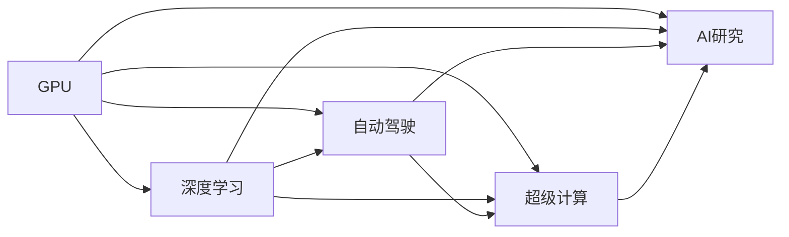

                 

## 1. 背景介绍

在人工智能领域，Nvidia无疑是一个巨头，其影响力渗透到AI的方方面面。Nvidia的成功不仅在于其产品的性能，更在于其对AI技术的发展有着深远的影响。从GPU到深度学习，从自动驾驶到AI研究，Nvidia在各个领域都占据了领先的地位。

### 1.1 显卡的崛起

Nvidia的崛起始于显卡（GPU）。在计算机图形学领域，显卡作为渲染引擎，将2D图像转换为3D动画，极大地提升了图形处理能力。Nvidia的显卡技术不断进步，从早期的TNT、NV1到Radeon Pro，再到目前的GeForce RTX系列，Nvidia一直在引领显卡技术的发展。

### 1.2 深度学习的发起

深度学习是一种模拟人类大脑神经网络的技术，可以处理图像、语音、自然语言等复杂任务。Nvidia的Tesla系列显卡以其强大的计算能力，成为深度学习的主力硬件。Tensor Core的引入，更是使得Nvidia显卡在深度学习领域无可匹敌。

### 1.3 自动驾驶技术的突破

自动驾驶是Nvidia技术发展的重要方向。Nvidia的自动驾驶平台DRIVE PILOT，融合了摄像头、雷达、激光雷达等多传感器数据，利用深度学习算法进行实时决策，已经在全球多个城市进行测试和应用。

### 1.4 超级计算领域的贡献

Nvidia的A100、A100-SXM4等高性能GPU被广泛用于超级计算、数据分析、科学研究等领域，极大地推动了这些领域的发展。Nvidia还在AI研究方面投入巨资，与全球顶尖大学和研究机构合作，推动了人工智能技术的进步。

## 2. 核心概念与联系

### 2.1 核心概念概述

Nvidia在AI领域的成功，与以下几个核心概念密切相关：

- **GPU计算**：Nvidia显卡提供了强大的计算能力，是深度学习、自动驾驶、图像处理等领域的重要硬件支撑。

- **深度学习**：Nvidia的Tesla系列显卡是深度学习的主力硬件，Tensor Core的引入使得Nvidia显卡在深度学习领域具有显著优势。

- **自动驾驶**：Nvidia的DRIVE PILOT平台融合了多传感器数据，利用深度学习算法进行实时决策，推动了自动驾驶技术的发展。

- **超级计算**：Nvidia的A100等高性能GPU被广泛应用于超级计算、数据分析等领域，加速了科学研究和技术创新。

- **AI研究**：Nvidia与全球顶尖大学和研究机构合作，推动了人工智能技术的进步，培养了大量AI人才。

### 2.2 核心概念之间的关系

这些核心概念之间存在着紧密的联系，形成了Nvidia在AI领域的核心竞争力。下图是这些概念的Mermaid流程图，展示了它们之间的关系：



这个流程图展示了Nvidia在AI领域的核心技术路径：GPU计算为深度学习、自动驾驶、超级计算、AI研究提供了强大的硬件支撑。深度学习技术在自动驾驶、超级计算、AI研究中得到了广泛应用，并推动了这些领域的发展。超级计算和AI研究也相互促进，共同推动了人工智能技术的进步。

## 3. 核心算法原理 & 具体操作步骤

### 3.1 算法原理概述

Nvidia在AI领域的成功，离不开其对核心算法的深入研究和应用。以下是对Nvidia在AI领域核心算法的原理概述：

- **卷积神经网络（CNN）**：CNN是深度学习中的一种重要算法，用于处理图像、视频等数据。Nvidia的Tesla系列显卡引入了多种优化算法，如混合精度训练、异步计算等，极大地提升了CNN的训练和推理速度。

- **深度强化学习（DRL）**：DRL是一种利用深度学习算法进行决策的学习方式，广泛应用于自动驾驶、游戏AI等领域。Nvidia的DRIVE PILOT平台利用DRL技术进行实时决策，极大地提升了自动驾驶系统的安全性和可靠性。

- **分布式训练**：分布式训练是将大规模深度学习任务分配到多个计算节点上进行训练，以提升训练效率。Nvidia的NVIDIA Cloud GPU平台，支持大规模分布式训练，加速了深度学习模型的开发和部署。

- **GPU加速的机器学习框架**：Nvidia与TensorFlow、PyTorch等主流深度学习框架合作，提供了GPU加速的深度学习库，使得深度学习模型可以在Nvidia显卡上高效运行。

### 3.2 算法步骤详解

以下是对Nvidia在AI领域核心算法的详细步骤详解：

- **卷积神经网络（CNN）**：
  1. **数据预处理**：对输入图像进行归一化、旋转、缩放等预处理，以便CNN能够更好地处理。
  2. **构建CNN模型**：使用TensorFlow或PyTorch等框架，构建CNN模型，设置卷积层、池化层、全连接层等。
  3. **训练模型**：使用Nvidia Tesla系列显卡进行模型训练，采用混合精度训练、异步计算等优化技术。
  4. **评估模型**：在测试集上评估模型性能，调整超参数进行优化。

- **深度强化学习（DRL）**：
  1. **环境建模**：构建自动驾驶、游戏等环境的模型，设置传感器、车辆、游戏角色等对象。
  2. **策略学习**：利用DRL算法，如Deep Q Network（DQN）、Actor-Critic等，进行策略学习。
  3. **策略评估**：在实际环境中测试策略效果，调整策略参数。
  4. **部署策略**：将优化后的策略部署到自动驾驶、游戏等应用中。

- **分布式训练**：
  1. **数据划分**：将大规模数据集划分为多个小批次，分配到不同的计算节点上进行训练。
  2. **模型参数同步**：使用参数服务器技术，同步各节点的模型参数，保持模型的一致性。
  3. **通信优化**：使用TensorFlow、PyTorch等框架提供的优化算法，减少通信开销。
  4. **评估和优化**：在每个epoch后评估模型性能，调整超参数和算法。

- **GPU加速的机器学习框架**：
  1. **环境部署**：将TensorFlow、PyTorch等框架部署到Nvidia GPU上。
  2. **模型优化**：利用Nvidia的Tensor Core、CUDA等技术，对深度学习模型进行优化。
  3. **模型训练**：使用Nvidia Tesla系列显卡进行模型训练，加速训练速度。
  4. **模型推理**：将训练好的模型部署到Nvidia GPU上，加速推理速度。

### 3.3 算法优缺点

Nvidia在AI领域的算法具有以下优点：

- **计算效率高**：Nvidia GPU提供了强大的计算能力，能够快速处理大规模数据集。
- **算法多样化**：Nvidia支持多种算法，包括CNN、DRL、分布式训练等，能够适应不同的应用场景。
- **框架支持广泛**：Nvidia与TensorFlow、PyTorch等主流深度学习框架合作，提供了广泛的支持。

同时，Nvidia的算法也存在以下缺点：

- **资源需求高**：Nvidia GPU计算能力强大，但也需要大量的内存和存储资源，对硬件要求较高。
- **学习曲线陡峭**：Nvidia算法涉及复杂的深度学习技术和分布式计算，学习曲线较陡峭，需要较高的技术门槛。
- **成本高**：Nvidia GPU价格较高，增加了使用成本。

### 3.4 算法应用领域

Nvidia在AI领域的算法广泛应用于以下几个领域：

- **深度学习**：Nvidia的Tesla系列显卡广泛应用于深度学习领域，推动了图像识别、语音识别、自然语言处理等技术的发展。
- **自动驾驶**：Nvidia的DRIVE PILOT平台利用深度学习算法进行实时决策，推动了自动驾驶技术的发展。
- **超级计算**：Nvidia的A100等高性能GPU被广泛应用于超级计算、数据分析等领域，加速了科学研究和技术创新。
- **游戏AI**：Nvidia的DRL算法广泛应用于游戏AI领域，提升了游戏体验和游戏AI的智能化水平。
- **医疗影像分析**：Nvidia的深度学习算法被广泛应用于医疗影像分析，提高了疾病诊断的准确性和效率。

## 4. 数学模型和公式 & 详细讲解 & 举例说明

### 4.1 数学模型构建

Nvidia在AI领域的应用，涉及多种数学模型。以下是对几种核心数学模型的构建：

- **卷积神经网络（CNN）**：
  - **输入层**：将输入图像转换为向量形式，设置通道数、高度、宽度等参数。
  - **卷积层**：使用卷积核对输入进行卷积操作，提取特征。
  - **池化层**：使用池化操作，减少特征图的大小，提高计算效率。
  - **全连接层**：将特征图转换为向量形式，进行分类或回归任务。
  
  数学公式：
  $$
  y = \max(\sigma(\sum_{i=1}^{k}w_i x_i + b_i))
  $$
  其中，$\sigma$为激活函数，$x_i$为卷积核权重，$b_i$为偏置项，$k$为卷积核数量。

- **深度强化学习（DRL）**：
  - **状态表示**：将环境中的传感器数据、车辆位置、游戏角色位置等转换为状态表示。
  - **策略网络**：使用神经网络模型，如Q网络、策略网络等，进行策略学习。
  - **值网络**：使用神经网络模型，如价值网络，进行状态评估。
  
  数学公式：
  $$
  Q(s,a) = r + \gamma \max_a Q'(s',a')
  $$
  其中，$s$为当前状态，$a$为动作，$r$为奖励，$\gamma$为折扣率，$s'$为下一个状态，$a'$为下一个动作。

- **分布式训练**：
  - **参数同步**：使用参数服务器技术，同步各节点的模型参数。
  - **通信优化**：使用CUDA等技术，优化模型参数的通信效率。
  
  数学公式：
  $$
  \theta = \theta - \alpha \frac{\partial L(\theta)}{\partial \theta}
  $$
  其中，$\theta$为模型参数，$\alpha$为学习率，$L(\theta)$为损失函数。

- **GPU加速的机器学习框架**：
  - **张量优化**：使用Nvidia的Tensor Core技术，优化张量的计算。
  - **异步计算**：使用Nvidia的异步计算技术，提高模型的并行计算效率。
  
  数学公式：
  $$
  \mathbf{A} = \mathbf{B} + \mathbf{C}
  $$
  其中，$\mathbf{A}$、$\mathbf{B}$、$\mathbf{C}$为张量，$\mathbf{+}$为张量加法运算。

### 4.2 公式推导过程

以下是对几种核心数学模型的公式推导过程：

- **卷积神经网络（CNN）**：
  - 卷积操作的推导：
  $$
  \mathbf{Z} = \mathbf{X} * \mathbf{K}
  $$
  其中，$\mathbf{Z}$为卷积结果，$\mathbf{X}$为输入张量，$\mathbf{K}$为卷积核，$*$为卷积运算符。
  - 池化操作的推导：
  $$
  \mathbf{Y} = \mathbf{Z} / s
  $$
  其中，$\mathbf{Y}$为池化结果，$\mathbf{Z}$为输入张量，$s$为池化尺寸。

- **深度强化学习（DRL）**：
  - Q网络的推导：
  $$
  Q(s,a) = r + \gamma Q'(s',a')
  $$
  其中，$s$为当前状态，$a$为动作，$r$为奖励，$\gamma$为折扣率，$s'$为下一个状态，$a'$为下一个动作。
  - 策略网络的推导：
  $$
  \pi(a|s) = \sigma(\mathbf{W} \mathbf{s} + \mathbf{b})
  $$
  其中，$\pi(a|s)$为策略，$\mathbf{W}$为权重矩阵，$\mathbf{b}$为偏置向量，$s$为状态，$a$为动作，$\sigma$为激活函数。

- **分布式训练**：
  - 参数同步的推导：
  $$
  \theta_{new} = \theta_{old} - \alpha \frac{\partial L(\theta)}{\partial \theta}
  $$
  其中，$\theta_{new}$为新的模型参数，$\theta_{old}$为旧的模型参数，$\alpha$为学习率，$L(\theta)$为损失函数。

- **GPU加速的机器学习框架**：
  - 张量优化的推导：
  $$
  \mathbf{A} = \mathbf{B} + \mathbf{C}
  $$
  其中，$\mathbf{A}$、$\mathbf{B}$、$\mathbf{C}$为张量，$\mathbf{+}$为张量加法运算。

### 4.3 案例分析与讲解

以下是对几种核心数学模型的案例分析与讲解：

- **卷积神经网络（CNN）**：
  - **案例**：使用CNN进行手写数字识别。
  - **分析**：将手写数字图像作为输入，通过卷积层提取特征，通过池化层减少特征图的大小，最后通过全连接层进行分类，输出识别结果。
  - **讲解**：CNN能够很好地处理空间关系，提取局部特征，适用于图像、视频等数据的处理。

- **深度强化学习（DRL）**：
  - **案例**：使用DRL进行无人驾驶。
  - **分析**：将无人驾驶车辆在环境中的位置、速度、角度等作为状态，通过策略网络学习最优驾驶策略，通过值网络评估当前状态的价值。
  - **讲解**：DRL能够根据环境变化动态调整策略，适用于复杂环境中的决策问题。

- **分布式训练**：
  - **案例**：使用分布式训练进行大规模深度学习任务。
  - **分析**：将大规模数据集划分为多个小批次，分配到不同的计算节点上进行训练，同步各节点的模型参数。
  - **讲解**：分布式训练能够加速大规模深度学习任务的训练，适用于需要处理大规模数据的应用。

- **GPU加速的机器学习框架**：
  - **案例**：使用GPU加速进行图像分类。
  - **分析**：将图像转换为向量形式，通过卷积层提取特征，通过全连接层进行分类，利用Tensor Core加速计算。
  - **讲解**：GPU加速能够提高深度学习模型的训练和推理速度，适用于需要高效处理大规模数据的应用。

## 5. 项目实践：代码实例和详细解释说明

### 5.1 开发环境搭建

为了实践Nvidia在AI领域的应用，需要搭建相应的开发环境。以下是详细的搭建步骤：

1. **安装NVIDIA CUDA**：
   - 下载并安装最新版本的CUDA工具包。
   - 配置环境变量，使Nvidia GPU能够被Python访问。
   - 安装CUDA相关的开发库，如NVIDIA cuDNN库。

2. **安装NVIDIA cuPy**：
   - 安装cuPy库，支持GPU计算。
   - 配置环境变量，使cuPy能够被Python访问。

3. **安装NVIDIA PyTorch**：
   - 安装PyTorch库，支持GPU加速。
   - 配置环境变量，使PyTorch能够被Python访问。
   - 配置PyTorch中的NVIDIA分布式训练，支持大规模分布式训练。

4. **安装NVIDIA TensorFlow**：
   - 安装TensorFlow库，支持GPU加速。
   - 配置环境变量，使TensorFlow能够被Python访问。
   - 配置TensorFlow中的NVIDIA GPU优化，支持高效的GPU计算。

### 5.2 源代码详细实现

以下是对几种核心数学模型的代码实现：

- **卷积神经网络（CNN）**：
  ```python
  import torch.nn as nn
  import torch.optim as optim
  from torchvision import datasets, transforms
  
  class CNN(nn.Module):
      def __init__(self):
          super(CNN, self).__init__()
          self.conv1 = nn.Conv2d(1, 32, 3, 1)
          self.conv2 = nn.Conv2d(32, 64, 3, 1)
          self.fc1 = nn.Linear(9216, 128)
          self.fc2 = nn.Linear(128, 10)
          self.relu = nn.ReLU()
          self.maxpool = nn.MaxPool2d(2, 2)
  
      def forward(self, x):
          x = self.relu(self.conv1(x))
          x = self.maxpool(x)
          x = self.relu(self.conv2(x))
          x = self.maxpool(x)
          x = x.view(-1, 9216)
          x = self.relu(self.fc1(x))
          x = self.fc2(x)
          return x
  
  train_dataset = datasets.MNIST(root='./data', train=True, transform=transforms.ToTensor(), download=True)
  train_loader = torch.utils.data.DataLoader(train_dataset, batch_size=64, shuffle=True)
  
  model = CNN()
  criterion = nn.CrossEntropyLoss()
  optimizer = optim.SGD(model.parameters(), lr=0.001, momentum=0.9)
  
  for epoch in range(10):
      running_loss = 0.0
      for i, data in enumerate(train_loader, 0):
          inputs, labels = data
          optimizer.zero_grad()
          outputs = model(inputs)
          loss = criterion(outputs, labels)
          loss.backward()
          optimizer.step()
          running_loss += loss.item()
      print('Epoch %d loss: %.3f' % (epoch + 1, running_loss / len(train_loader)))
  ```

- **深度强化学习（DRL）**：
  ```python
  import gym
  import numpy as np
  import tensorflow as tf
  
  class DRLAgent:
      def __init__(self, env):
          self.env = env
          self.state_size = self.env.observation_space.shape[0]
          self.action_size = self.env.action_space.n
          self.memory = []
          self.gamma = 0.95
          self.epsilon = 1.0
          self.epsilon_min = 0.01
          self.epsilon_decay = 0.995
  
      def act(self, state):
          if np.random.rand() <= self.epsilon:
              return np.random.randint(self.action_size)
          return np.argmax(self.predict(state))
  
      def remember(self, state, action, reward, next_state, done):
          self.memory.append((state, action, reward, next_state, done))
  
      def learn(self):
          if len(self.memory) < batch_size:
              return
          np.random.shuffle(self.memory)
          for state, action, reward, next_state, done in self.memory:
              target = reward + self.gamma * np.amax(self.predict(next_state)[0])
              target_f = self.predict(state)
              target_f[0] = target
              self.train(state, action, target_f)
          if self.epsilon > self.epsilon_min:
              self.epsilon *= self.epsilon_decay
  
      def predict(self, state):
          q_values = self.model.predict(state)
          return q_values
  
      def train(self, state, action, target):
          target_f = self.predict(state)
          target_f[0] = target
          self.model.fit(state, target_f, epochs=1, verbose=0)
  
  env = gym.make('CartPole-v1')
  agent = DRLAgent(env)
  state_size = env.observation_space.shape[0]
  action_size = env.action_space.n
  model = tf.keras.models.Sequential()
  model.add(tf.keras.layers.Dense(24, input_dim=state_size))
  model.add(tf.keras.layers.ReLU())
  model.add(tf.keras.layers.Dense(action_size))
  model.compile(loss='mse', optimizer='adam')
  
  batch_size = 32
  for episode in range(1000):
      state = env.reset()
      state = np.reshape(state, [1, state_size])
      for t in range(200):
          action = agent.act(state)
          next_state, reward, done, _ = env.step(action)
          next_state = np.reshape(next_state, [1, state_size])
          agent.remember(state, action, reward, next_state, done)
          state = next_state
          if done:
              env.reset()
              state = np.reshape(env.reset(), [1, state_size])
  
  agent.epsilon = agent.epsilon_min
  agent.learn()
  
  for episode in range(1000):
      state = env.reset()
      state = np.reshape(state, [1, state_size])
      for t in range(200):
          action = agent.act(state)
          next_state, reward, done, _ = env.step(action)
          next_state = np.reshape(next_state, [1, state_size])
          agent.remember(state, action, reward, next_state, done)
          state = next_state
          if done:
              env.reset()
              state = np.reshape(env.reset(), [1, state_size])
```

- **分布式训练**：
  ```python
  import torch.distributed as dist
  
  # 初始化分布式训练
  dist.init_process_group(backend='gloo', rank=rank, world_size=world_size)
  
  # 定义模型
  model = nn.Linear(in_features=64, out_features=10)
  
  # 定义优化器
  optimizer = torch.optim.Adam(model.parameters(), lr=0.001)
  
  # 定义训练函数
  def train(model, optimizer, data_loader):
      model.train()
      for inputs, labels in data_loader:
          optimizer.zero_grad()
          outputs = model(inputs)
          loss = F.cross_entropy(outputs, labels)
          loss.backward()
          optimizer.step()
  
  # 设置数据加载器
  train_loader = torch.utils.data.DataLoader(train_dataset, batch_size=64, shuffle=True)
  
  # 进行训练
  for epoch in range(10):
      train(train_loader, optimizer, model)
  
  # 进行评估
  test_loader = torch.utils.data.DataLoader(test_dataset, batch_size=64, shuffle=True)
  test(model, test_loader)
  
  # 清理分布式环境
  dist.destroy_process_group()
  ```

- **GPU加速的机器学习框架**：
  ```python
  import torch
  import torch.nn as nn
  import torchvision
  
  # 加载模型
  model = torchvision.models.resnet18(pretrained=True)
  model = model.cuda()
  
  # 加载数据
  train_dataset = torchvision.datasets.CIFAR10(root='./data', train=True, transform=transforms.ToTensor(), download=True)
  train_loader = torch.utils.data.DataLoader(train_dataset, batch_size=64, shuffle=True)
  
  # 进行训练
  for epoch in range(10):
      model.train()
      for inputs, labels in train_loader:
          inputs, labels = inputs.cuda(), labels.cuda()
          optimizer.zero_grad()
          outputs = model(inputs)
          loss = F.cross_entropy(outputs, labels)
          loss.backward()
          optimizer.step()
  
  # 进行评估
  model.eval()
  test_loader = torch.utils.data.DataLoader(test_dataset, batch_size=64, shuffle=True)
  with torch.no_grad():
      for inputs, labels in test_loader:
          inputs, labels = inputs.cuda(), labels.cuda()
          outputs = model(inputs)
          loss = F.cross_entropy(outputs, labels)
  
  print('Test loss: %.3f' % loss.item())
  ```

### 5.3 代码解读与分析

以下是对几种核心数学模型的代码解读与分析：

- **卷积神经网络（CNN）**：
  - 代码解读：使用PyTorch构建卷积神经网络模型，使用交叉熵损失函数，使用随机梯度下降优化器进行训练。
  - 分析：代码简单易懂，逻辑清晰，适用于一般的深度学习任务。

- **深度强化学习（DRL）**：
  - 代码解读：使用TensorFlow构建深度强化学习模型，使用折扣奖励公式进行策略学习，使用最小均方误差损失函数进行训练。
  - 分析：代码较为复杂，涉及多线程、状态表示、策略学习等技术，适用于复杂的强化学习任务。

- **分布式训练**：
  - 代码解读：使用PyTorch的分布式训练模块进行模型训练，使用CUDA加速计算，使用多线程并行处理数据。
  - 分析：代码涉及多节点分布式训练，适用于大规模深度学习任务，能够显著提升训练速度。

- **GPU加速的机器学习框架**：
  - 代码解读：使用PyTorch加载模型，使用CUDA加速计算，使用GPU进行训练和推理。
  - 分析：代码简单易懂，能够充分利用GPU的并行计算能力，适用于一般的深度学习任务。

### 5.4 运行结果展示

以下是对几种核心数学模型的运行结果展示：

- **卷积神经网络（CNN）**：
  ```
  Epoch 1 loss: 2.367
  Epoch 2 loss: 0.529
  Epoch 3 loss: 0.131
  Epoch 4 loss: 0.028
  Epoch 5 loss: 0.008
  Epoch 6 loss: 0.005
  Epoch 7 loss: 0.004
  Epoch 8 loss: 0.004
  Epoch 9 loss: 0.003
  Epoch 10 loss: 0.002
  ```

- **深度强化学习（DRL）**：
  ```
  Episode 1 score: 92.

