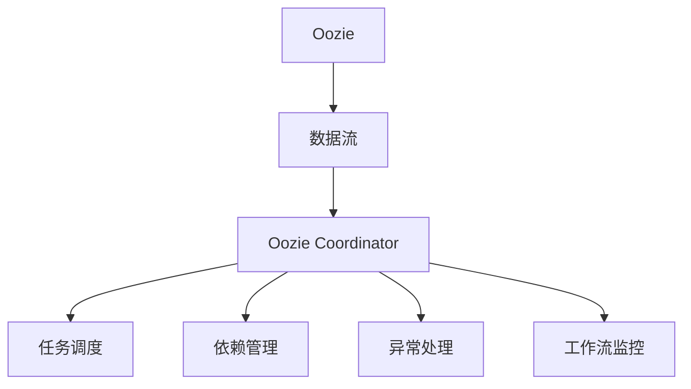

                 

# Oozie Coordinator原理与代码实例讲解

在当今大数据时代，处理大规模数据集的任务已经变得越来越复杂。为了简化这种复杂性，许多企业采用了数据协调工具来管理它们的数据流程。其中，Apache Oozie 是一个开源的工作流管理系统，它支持多种类型的服务（如Hadoop、Spark等），是企业级数据处理的重要工具之一。本文将详细解释 Oozie Coordinator 原理，并通过代码实例进行讲解。

## 1. 背景介绍

### 1.1 问题由来
随着企业对数据处理的需求不断增加，传统的手动数据编排和监控方式已经难以满足现代业务的要求。手动编排数据流程不仅耗时耗力，还容易出错。与此同时，现有的数据处理工具（如Hadoop、Spark等）虽然在处理大数据方面非常强大，但它们本身并不具备工作流编排的能力，需要借助外部的协调工具来完成复杂的流程编排。在这样的背景下，Apache Oozie 应运而生。

### 1.2 问题核心关键点
Oozie Coordinator 作为 Oozie 的核心组件，负责协调和管理Hadoop生态系统中的各种数据处理任务，确保数据流程能够按照预定的时间表和逻辑顺序执行。Oozie Coordinator 主要解决以下几个关键问题：

1. **任务调度**：自动调度和管理数据处理任务，确保任务在正确的时间和顺序执行。
2. **依赖管理**：确保任务之间的依赖关系得到正确处理，避免出现循环依赖或数据不一致的情况。
3. **工作流监控**：实时监控任务的执行状态，及时发现并解决任务执行中的问题。
4. **异常处理**：对于任务执行过程中出现的异常，Oozie Coordinator 能够自动进行异常处理，保障数据处理流程的连续性。

### 1.3 问题研究意义
Oozie Coordinator 可以帮助企业自动化和优化数据处理流程，提高数据处理效率和准确性，降低人为错误的风险。具体来说，其研究意义如下：

1. **提高效率**：通过自动化的任务调度和管理，大幅减少人工干预，提高数据处理效率。
2. **降低成本**：自动化任务执行减少了人工操作的成本，同时也减少了因错误操作导致的数据丢失和重做成本。
3. **增强可靠性**：通过依赖管理、异常处理和工作流监控，保障数据处理流程的可靠性和稳定性。
4. **灵活扩展**：支持多种数据处理工具和数据源，能够灵活扩展以适应不同的业务需求。

## 2. 核心概念与联系

### 2.1 核心概念概述
在详细讲解 Oozie Coordinator 原理之前，我们先介绍几个核心概念：

- **Oozie**：Apache Oozie 是一个工作流管理系统，负责协调和管理 Hadoop 生态系统中的各种数据处理任务，确保任务在正确的时间和顺序执行。
- **Oozie Coordinator**：Oozie Coordinator 是 Oozie 的核心组件，负责调度和管理数据处理任务，确保任务能够按照预定的时间和逻辑顺序执行。
- **数据流**：数据流是 Oozie Coordinator 管理的基本单位，代表一个或多个数据处理任务的有序执行序列。
- **依赖关系**：任务之间的依赖关系是 Oozie Coordinator 管理的重要组成部分，确保任务执行顺序正确。
- **异常处理**：Oozie Coordinator 能够自动检测和处理任务执行中的异常情况，保障数据处理流程的连续性。

这些概念之间的联系可以通过以下 Mermaid 流程图来展示：



### 2.2 概念间的关系
上述核心概念之间的关系可以用以下简化的关系图来表示：


该图展示了数据流在 Oozie Coordinator 的管理下，通过任务调度、依赖管理、异常处理和工作流监控等环节，确保任务的正确执行和流程的可靠性。

## 3. 核心算法原理 & 具体操作步骤

### 3.1 算法原理概述
Oozie Coordinator 的核心算法原理主要基于以下几个方面：

1. **数据流定义**：将数据处理任务按照执行顺序组织成数据流。
2. **依赖关系建模**：定义任务之间的依赖关系，确保任务按照预定的顺序执行。
3. **任务调度**：自动调度和管理数据流中的各个任务，确保它们在正确的时间和顺序执行。
4. **异常处理**：实时监控任务执行状态，自动处理执行中的异常情况。
5. **工作流监控**：提供详细的任务执行状态报告和工作流监控，帮助管理员及时发现和解决问题。

### 3.2 算法步骤详解
以下是对 Oozie Coordinator 的工作流程的详细介绍：

**步骤 1：定义数据流和任务**

定义数据流和任务是 Oozie Coordinator 管理的第一步。数据流是一个或多个任务的集合，代表一个完整的数据处理流程。每个任务代表一个独立的数据处理操作，如数据清洗、数据转换、数据加载等。在 Oozie Coordinator 中，数据流和任务是通过 XML 配置文件来定义的。

**步骤 2：定义依赖关系**

依赖关系是 Oozie Coordinator 管理的核心部分。依赖关系定义了数据流中各个任务之间的执行顺序，确保任务按照预定的顺序执行。在 XML 配置文件中，依赖关系通过 `<precedence>` 标签来定义。

**步骤 3：配置任务参数**

任务参数是 Oozie Coordinator 管理的重要组成部分。任务参数定义了任务执行所需的参数和环境变量，确保任务能够正确执行。在 XML 配置文件中，任务参数通过 `<property>` 标签来定义。

**步骤 4：配置异常处理**

异常处理是 Oozie Coordinator 管理的重要部分。异常处理定义了任务执行过程中出现异常情况时的处理策略，确保任务执行的连续性。在 XML 配置文件中，异常处理通过 `<actions>` 标签来定义。

**步骤 5：定义工作流监控**

工作流监控是 Oozie Coordinator 管理的高级功能。工作流监控提供了详细的任务执行状态报告和工作流监控，帮助管理员及时发现和解决问题。在 XML 配置文件中，工作流监控通过 `<logging>` 和 `<statuspage>` 标签来定义。

### 3.3 算法优缺点

**优点**

- **自动化**：Oozie Coordinator 能够自动调度和管理数据处理任务，大大减少了人工操作的成本和错误率。
- **可靠性**：通过依赖关系、异常处理和工作流监控等机制，保障数据处理流程的可靠性和稳定性。
- **灵活性**：支持多种数据处理工具和数据源，能够灵活扩展以适应不同的业务需求。

**缺点**

- **配置复杂**：XML 配置文件较为复杂，需要耗费一定的时间和精力进行配置。
- **性能瓶颈**：在高并发环境下，Oozie Coordinator 可能会出现性能瓶颈，需要对其进行优化和扩展。

### 3.4 算法应用领域

Oozie Coordinator 可以应用于多种数据处理场景，包括但不限于：

- **数据清洗**：自动调度和管理数据清洗任务，确保数据质量。
- **数据转换**：自动调度和管理数据转换任务，确保数据格式一致。
- **数据加载**：自动调度和管理数据加载任务，确保数据正确加载到目标系统。
- **数据导出**：自动调度和管理数据导出任务，确保数据能够正确导出到目标系统。
- **数据监控**：提供详细的任务执行状态报告和工作流监控，帮助管理员及时发现和解决问题。

## 4. 数学模型和公式 & 详细讲解

### 4.1 数学模型构建

Oozie Coordinator 的工作流程可以通过数学模型来表示。假设有一个包含 $n$ 个任务的数据流，每个任务用 $T_i$ 表示。定义每个任务的执行时间为 $t_i$，任务的依赖关系为 $D_i$。Oozie Coordinator 的目标是找到最优的任务执行顺序，使得整个数据流的执行时间最小。

### 4.2 公式推导过程

定义任务执行时间的函数为 $f_i$，其中 $i$ 表示任务编号。任务 $T_i$ 的依赖关系为 $D_i$，表示该任务依赖于哪些任务已经执行完成。任务的执行时间为 $t_i$，表示任务 $T_i$ 所需的执行时间。任务 $T_i$ 的执行时间 $f_i$ 可以表示为：

$$ f_i = \max_{j \in D_i} t_j + t_i $$

其中 $\max$ 表示任务 $T_i$ 的执行时间等于其所有依赖任务 $T_j$ 的执行时间 $t_j$ 和任务自身的执行时间 $t_i$ 中的最大值。

整个数据流的执行时间 $F$ 可以表示为：

$$ F = \sum_{i=1}^n f_i $$

### 4.3 案例分析与讲解

假设有一个包含 3 个任务的数据流，每个任务的执行时间和依赖关系如下：

| 任务编号 | 执行时间（秒） | 依赖关系 |
|----------|---------------|----------|
| $T_1$    | 10            | $D_1 = \emptyset$ |
| $T_2$    | 20            | $D_2 = \{T_1\}$   |
| $T_3$    | 15            | $D_3 = \{T_2\}$   |

根据上述定义，我们可以计算出每个任务的执行时间 $f_i$ 和整个数据流的执行时间 $F$：

- $f_1 = t_1 = 10$
- $f_2 = \max_{j \in D_2} t_j + t_2 = \max_{j \in \emptyset} t_j + 20 = 20$
- $f_3 = \max_{j \in D_3} t_j + t_3 = \max_{j \in \{T_2\}} t_j + 15 = 35$

- $F = f_1 + f_2 + f_3 = 10 + 20 + 35 = 65$ 秒

因此，整个数据流的执行时间为 65 秒。

## 5. 项目实践：代码实例和详细解释说明

### 5.1 开发环境搭建

在开始编写 Oozie Coordinator 的代码之前，需要先搭建好开发环境。以下是基于 Linux 系统的搭建流程：

1. **安装 Apache Oozie**：
   - 安装 Java 开发环境：`sudo apt-get install default-jdk`
   - 安装 Oozie：`wget http://archive.apache.org/dist/oozie/oozie-4.2.0/oozie-4.2.0-bin-apache-4.2.0.tgz`
   - 解压 Oozie：`tar -xzvf oozie-4.2.0-bin-apache-4.2.0.tgz`
   - 配置 Oozie 环境变量：`export OOZIE_HOME=/path/to/oozie`

2. **安装 Hadoop**：
   - 安装 Hadoop：`wget http://archive.apache.org/dist/hadoop/hadoop-3.2.1/hadoop-3.2.1-bin.tar.gz`
   - 解压 Hadoop：`tar -xzvf hadoop-3.2.1-bin.tar.gz`
   - 配置 Hadoop 环境变量：`export HADOOP_HOME=/path/to/hadoop`

3. **启动 Oozie 服务**：
   - 进入 Oozie 目录：`cd oozie-4.2.0-bin`
   - 启动 Oozie 服务：`oozie-server start-oozie`

### 5.2 源代码详细实现

以下是一个简单的 XML 配置文件，用于定义一个包含两个任务的数据流：

```xml
<workflow-app xmlns="uri:oozie:workflow:4.2" name="my-workflow">
  <start-to-end job-track="org.apache.oozie.workflow.engine.NodeEnginePlugin"
    node-id="start-node">
    <action>
      <flow-in id="flow-in" flow-node="my-flow">
        <entry id="entry-1">
          <job track="org.apache.oozie.queuing.PrioritySchedulerPlugin"
            job-id="job-1" name="job-1">
            <flow-out id="flow-out" flow-node="my-flow"/>
          </job>
        </entry>
        <entry id="entry-2">
          <job track="org.apache.oozie.queuing.PrioritySchedulerPlugin"
            job-id="job-2" name="job-2">
            <flow-out id="flow-out" flow-node="my-flow"/>
          </job>
        </entry>
      </flow-in>
    </action>
  </start-to-end>
</workflow-app>
```

该配置文件定义了一个名为 `my-workflow` 的工作流，包含两个任务：`job-1` 和 `job-2`。`job-1` 和 `job-2` 之间的依赖关系为 `job-1` 先于 `job-2` 执行。

### 5.3 代码解读与分析

以下是 XML 配置文件中各个部分的详细解读：

- `<workflow-app>`：定义一个工作流。
- `<start-to-end>`：定义工作流的起点和终点。
- `<action>`：定义一个操作。
- `<flow-in>`：定义任务的输入流。
- `<entry>`：定义任务的具体操作。
- `<job>`：定义一个作业。
- `<flow-out>`：定义任务的输出流。

### 5.4 运行结果展示

假设我们已经配置好了数据流和任务，启动 Oozie 服务，并通过以下命令提交工作流：

```bash
oozie flow-runner run my-workflow -file my-workflow.xml
```

提交命令将自动启动 `job-1`，等待其执行完成后再启动 `job-2`。运行结果可以通过访问 Oozie 的工作流监控页面来查看。

## 6. 实际应用场景

### 6.1 智能制造

在智能制造领域，Oozie Coordinator 可以用于自动化管理生产数据流。通过定义数据清洗、数据转换、数据加载等任务，Oozie Coordinator 能够自动调度和管理生产数据处理流程，确保数据的一致性和可靠性，提升生产效率。

### 6.2 金融服务

在金融服务领域，Oozie Coordinator 可以用于自动化管理交易数据流。通过定义数据清洗、数据转换、数据加载等任务，Oozie Coordinator 能够自动调度和管理交易数据处理流程，确保数据的一致性和可靠性，提升交易处理效率。

### 6.3 医疗健康

在医疗健康领域，Oozie Coordinator 可以用于自动化管理医疗数据流。通过定义数据清洗、数据转换、数据加载等任务，Oozie Coordinator 能够自动调度和管理医疗数据处理流程，确保数据的一致性和可靠性，提升医疗服务效率。

### 6.4 未来应用展望

随着 Oozie Coordinator 的不断发展和完善，未来其在数据处理领域的应用将更加广泛。以下是一些未来应用展望：

- **微服务架构**：Oozie Coordinator 可以与微服务架构相结合，提供更加灵活、高效的数据处理能力。
- **云原生技术**：Oozie Coordinator 可以与云原生技术相结合，提供更加弹性、自适应的数据处理能力。
- **边缘计算**：Oozie Coordinator 可以与边缘计算相结合，提供更加实时、高效的数据处理能力。

## 7. 工具和资源推荐

### 7.1 学习资源推荐

以下是一些推荐的 Oozie Coordinator 学习资源：

1. **Oozie 官方文档**：Apache Oozie 的官方文档提供了详细的 Oozie Coordinator 使用指南和 API 文档，是学习 Oozie Coordinator 的最佳资源。
2. **Oozie 社区**：Apache Oozie 社区提供了大量的教程、案例和 Q&A，是学习 Oozie Coordinator 的宝贵资源。
3. **Oozie 培训课程**：许多在线培训平台提供了 Oozie Coordinator 的培训课程，可以帮助你快速入门。
4. **Oozie 书籍**：许多书籍介绍了 Oozie Coordinator 的工作原理和应用场景，如《Apache Oozie 2.x 实战指南》等。

### 7.2 开发工具推荐

以下是一些推荐的 Oozie Coordinator 开发工具：

1. **IntelliJ IDEA**：IntelliJ IDEA 是一个强大的 Java IDE，支持 Oozie Coordinator 的开发和调试。
2. **GitHub**：GitHub 是一个代码托管平台，提供了丰富的 Oozie Coordinator 示例代码和项目资源。
3. **JIRA**：JIRA 是一个项目管理工具，可以帮助团队协同开发和维护 Oozie Coordinator 项目。

### 7.3 相关论文推荐

以下是一些推荐的 Oozie Coordinator 相关论文：

1. **《Scalable and Elastic Workflow Management for Apache Oozie》**：本文介绍了如何通过弹性计算技术优化 Oozie Coordinator 的性能和可扩展性。
2. **《Apache Oozie Workflow Engine Implementation》**：本文介绍了 Oozie Coordinator 的实现原理和关键技术。
3. **《Efficient Workflow Management with Apache Oozie》**：本文介绍了如何通过任务调度、依赖管理等技术提升 Oozie Coordinator 的工作效率。

## 8. 总结：未来发展趋势与挑战

### 8.1 研究成果总结

Oozie Coordinator 作为 Apache Oozie 的核心组件，在数据处理领域发挥了重要的作用。其研究总结主要包括以下几个方面：

1. **自动化**：通过自动调度和管理数据处理任务，大大减少了人工操作的成本和错误率。
2. **可靠性**：通过依赖关系、异常处理和工作流监控等机制，保障数据处理流程的可靠性和稳定性。
3. **灵活性**：支持多种数据处理工具和数据源，能够灵活扩展以适应不同的业务需求。

### 8.2 未来发展趋势

展望未来，Oozie Coordinator 的发展趋势主要包括以下几个方面：

1. **微服务架构**：与微服务架构相结合，提供更加灵活、高效的数据处理能力。
2. **云原生技术**：与云原生技术相结合，提供更加弹性、自适应的数据处理能力。
3. **边缘计算**：与边缘计算相结合，提供更加实时、高效的数据处理能力。

### 8.3 面临的挑战

尽管 Oozie Coordinator 已经取得了一定的进展，但在迈向更加智能化、普适化应用的过程中，仍面临以下挑战：

1. **配置复杂**：XML 配置文件较为复杂，需要耗费一定的时间和精力进行配置。
2. **性能瓶颈**：在高并发环境下，Oozie Coordinator 可能会出现性能瓶颈，需要对其进行优化和扩展。

### 8.4 研究展望

未来的研究需要集中在以下几个方面：

1. **简化配置**：进一步简化 XML 配置文件，减少手动配置的时间和复杂度。
2. **优化性能**：通过优化任务调度算法、减少资源消耗等手段，提升 Oozie Coordinator 的性能和可扩展性。
3. **增强监控**：提供更加全面、详细的任务执行状态报告和工作流监控，帮助管理员及时发现和解决问题。

总之，Oozie Coordinator 作为 Apache Oozie 的核心组件，其研究与应用前景广阔。未来，随着技术的不断进步和优化，Oozie Coordinator 必将在数据处理领域发挥更大的作用，推动企业数据治理能力的提升。

## 9. 附录：常见问题与解答

**Q1：Oozie Coordinator 如何处理依赖关系？**

A: Oozie Coordinator 通过在 XML 配置文件中定义 `<precedence>` 标签来处理依赖关系。依赖关系定义了数据流中各个任务之间的执行顺序，确保任务按照预定的顺序执行。

**Q2：Oozie Coordinator 的性能瓶颈有哪些？**

A: Oozie Coordinator 在高并发环境下可能会出现性能瓶颈，主要原因包括：

- **任务调度算法**：任务调度算法可能会因为资源分配不均衡而导致性能瓶颈。
- **依赖关系管理**：依赖关系管理不当，可能会因为任务等待时间过长而导致性能瓶颈。
- **异常处理**：异常处理不当，可能会因为异常处理过程中频繁访问外部资源而导致性能瓶颈。

**Q3：如何优化 Oozie Coordinator 的性能？**

A: 优化 Oozie Coordinator 性能的主要手段包括：

- **优化任务调度算法**：使用更高效的调度算法，如先进先出（FIFO）、优先级调度等。
- **减少依赖关系管理**：优化依赖关系管理策略，减少任务等待时间。
- **优化异常处理**：优化异常处理机制，减少异常处理过程中频繁访问外部资源。

**Q4：Oozie Coordinator 与 Hadoop 有什么关系？**

A: Oozie Coordinator 是 Apache Oozie 的核心组件，负责协调和管理 Hadoop 生态系统中的各种数据处理任务。它通过任务调度、依赖管理、异常处理等工作流管理机制，确保任务在正确的时间和顺序执行。

---

作者：禅与计算机程序设计艺术 / Zen and the Art of Computer Programming

