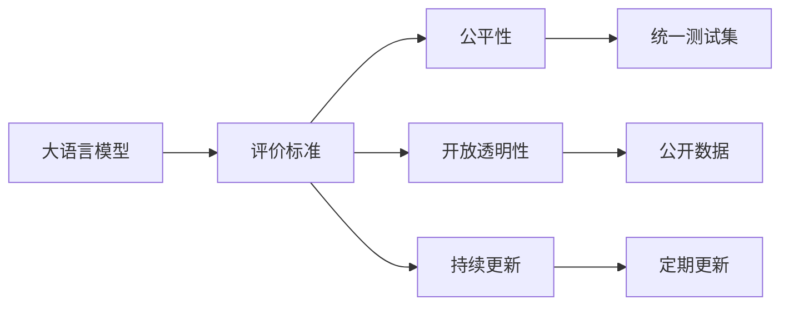
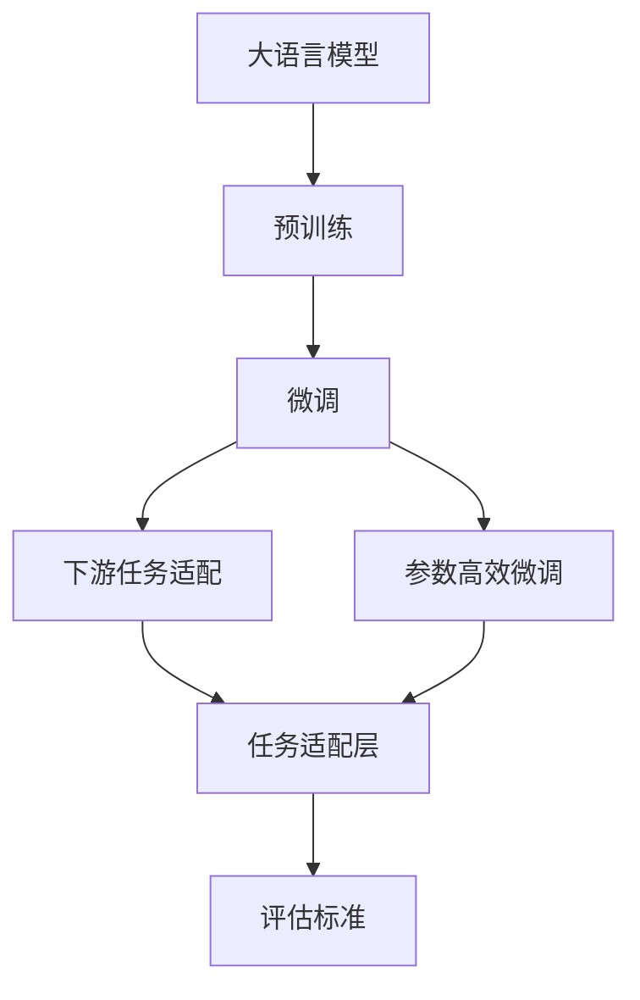
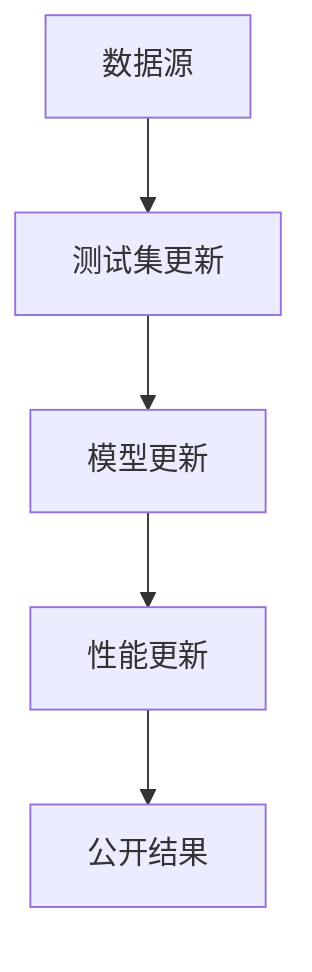
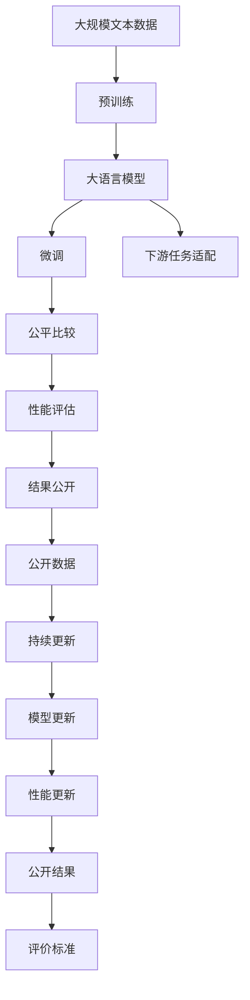

                 

# Open LLM Leaderboard(大模型天梯榜)

> 关键词：大模型,天梯榜,评估,评价,标准,比较,性能,公平,可信度,开放

## 1. 背景介绍

### 1.1 问题由来
大语言模型（Large Language Models, LLMs）在过去几年取得了巨大的进步，代表模型如GPT-3、BERT、T5等，展现出强大的语言生成和理解能力。这些模型在各种自然语言处理（NLP）任务上取得了最先进的结果，但不同模型之间性能的直接比较仍存在挑战。由于没有统一的标准和评价指标，导致结果的可比性差，难以准确评估不同模型的性能。

### 1.2 问题核心关键点
Open LLM Leaderboard（大模型天梯榜）应运而生，旨在提供一个权威、公正的评价平台，帮助开发者、研究者、产业界准确比较和评估大语言模型的性能。其核心关键点包括：

- **统一评价标准**：建立统一的标准和评价指标，包括不同任务的性能表现、模型的公平性、鲁棒性等。
- **公平比较机制**：保证所有参与模型在相同的测试集上进行公平比对，消除数据偏差。
- **开放透明性**：所有参与模型和评估结果公开透明，增强可信度。
- **持续更新**：定期更新模型库和测试集，保证数据的时效性和模型的最新表现。

### 1.3 问题研究意义
Open LLM Leaderboard的建立，对大语言模型的研究和应用具有重要意义：

- **提升模型对比公平性**：提供一个公平的评估平台，消除数据偏差，使不同模型的比较更具有说服力。
- **促进模型性能提升**：开发者和研究者可以根据评估结果，有针对性地优化模型，提升性能。
- **加速模型落地应用**：统一评价标准和测试集，降低应用门槛，加速大语言模型在各行业的部署。
- **推动技术进步**：平台不断更新模型库和测试集，推动大语言模型技术的发展和应用。
- **增强模型可信度**：公开透明的评价过程和结果，增强模型的可信度，建立公众对大语言模型的信任。

## 2. 核心概念与联系

### 2.1 核心概念概述

Open LLM Leaderboard的核心概念包括：

- **大语言模型（Large Language Models, LLMs）**：指能够进行复杂自然语言处理任务的语言模型，如GPT-3、BERT、T5等。
- **评价标准（Evaluation Criteria）**：用于评估模型性能的统一指标体系，包括精度、召回率、F1分数等。
- **公平性（Fairness）**：保证所有参与模型在相同的测试集上进行公平比较，避免数据偏差。
- **开放透明性（Transparency）**：所有参与模型和评估结果公开透明，增强可信度。
- **持续更新（Continual Updating）**：定期更新模型库和测试集，保证数据的时效性和模型的最新表现。

这些核心概念之间的关系可以通过以下Mermaid流程图来展示：



### 2.2 概念间的关系

这些核心概念之间存在着紧密的联系，形成了Open LLM Leaderboard的整体生态系统。下面我通过几个Mermaid流程图来展示这些概念之间的关系。

#### 2.2.1 大语言模型的学习范式



这个流程图展示了大语言模型的三种主要学习范式：预训练、微调和下游任务适配。预训练使得模型学习到语言的通用表示，而微调和下游任务适配则是使模型适应特定任务的过程。

#### 2.2.2 公平比较机制


这个流程图展示了公平比较机制的基本原理，即所有参与模型在相同的测试集上进行公平比对，消除数据偏差。

#### 2.2.3 持续更新



这个流程图展示了持续更新的基本流程，即定期更新测试集，确保模型在最新数据上进行评估，并公开结果以增强可信度。

### 2.3 核心概念的整体架构

最后，我们用一个综合的流程图来展示这些核心概念在大模型天梯榜中的整体架构：



这个综合流程图展示了从预训练到评估、更新、公开的完整过程，以及各环节之间的联系。

## 3. 核心算法原理 & 具体操作步骤
### 3.1 算法原理概述

Open LLM Leaderboard的核心算法原理主要围绕以下几个方面展开：

- **统一评价标准**：建立一套统一的评价指标体系，涵盖不同NLP任务，如分类、匹配、生成等。
- **公平比较机制**：保证所有参与模型在相同的测试集上进行公平比对，消除数据偏差。
- **性能评估**：根据统一标准，对各模型的性能进行评估，包括精度、召回率、F1分数等。
- **结果公开**：所有参与模型和评估结果公开透明，增强可信度。
- **持续更新**：定期更新模型库和测试集，保证数据的时效性和模型的最新表现。

### 3.2 算法步骤详解

1. **建立统一评价标准**：根据不同NLP任务的特性，设计统一的评价指标体系，涵盖精度、召回率、F1分数等。

2. **选择测试集**：选取与各NLP任务最相关的基准测试集，确保公平比对。

3. **模型提交**：开发者将自有的模型提交到平台，确保在相同的测试集上进行公平比对。

4. **公平比较**：平台对所有提交的模型进行公平比较，消除数据偏差，保证结果的公正性。

5. **性能评估**：根据统一标准，对各模型的性能进行评估，生成综合性能报告。

6. **结果公开**：将评估结果和模型代码公开透明，增强可信度。

7. **持续更新**：定期更新模型库和测试集，保证数据的时效性和模型的最新表现。

### 3.3 算法优缺点

**优点**：

- **统一标准**：提供公平的评价平台，消除数据偏差，使不同模型的比较更具有说服力。
- **公开透明**：所有参与模型和评估结果公开透明，增强可信度。
- **持续更新**：定期更新模型库和测试集，保证数据的时效性和模型的最新表现。

**缺点**：

- **复杂度**：设计统一的评价标准和公平比较机制较为复杂，需要大量的专家参与。
- **计算资源**：评估平台需要高性能计算资源，成本较高。
- **数据质量**：依赖于基准测试集的数据质量，数据偏差可能影响结果。

### 3.4 算法应用领域

Open LLM Leaderboard的应用领域主要涵盖以下几个方面：

- **学术研究**：提供公平的评价平台，促进学术界对大语言模型的研究和讨论。
- **工业应用**：帮助产业界选择最先进的模型，加速大语言模型的部署和应用。
- **开源社区**：增强开源社区的贡献度和信任度，推动大语言模型技术的发展。

## 4. 数学模型和公式 & 详细讲解 & 举例说明

### 4.1 数学模型构建

Open LLM Leaderboard的数学模型主要围绕以下几个方面展开：

- **评价指标**：定义不同NLP任务的评价指标，如分类任务的准确率、召回率、F1分数等。
- **公平比较**：确保所有模型在相同的测试集上进行公平比对，消除数据偏差。
- **性能评估**：根据统一标准，对各模型的性能进行评估，生成综合性能报告。

### 4.2 公式推导过程

以分类任务为例，我们定义模型的评价指标为精度（Precision）和召回率（Recall）。假设模型对正类样本的预测概率为 $P_{pos}$，负类样本的预测概率为 $P_{neg}$，则精度和召回率的计算公式如下：

$$
\text{Precision} = \frac{TP}{TP + FP} = \frac{TP}{TP + TN + FP}
$$

$$
\text{Recall} = \frac{TP}{TP + FN}
$$

其中，$TP$ 表示真正样本（True Positive），$FP$ 表示假正样本（False Positive），$TN$ 表示真负样本（True Negative），$FN$ 表示假负样本（False Negative）。

### 4.3 案例分析与讲解

假设我们有一个二分类模型，其对正类样本的预测概率为 $P_{pos} = 0.8$，负类样本的预测概率为 $P_{neg} = 0.2$。根据上述公式，该模型的精度为：

$$
\text{Precision} = \frac{TP}{TP + FP} = \frac{0.8}{0.8 + 0.2} = 0.8
$$

召回率为：

$$
\text{Recall} = \frac{TP}{TP + FN} = \frac{0.8}{0.8 + 0.1} = 0.88
$$

F1分数为：

$$
F1 = 2 \times \frac{Precision \times Recall}{Precision + Recall} = 2 \times \frac{0.8 \times 0.88}{0.8 + 0.88} = 0.84
$$

## 5. 项目实践：代码实例和详细解释说明

### 5.1 开发环境搭建

进行Open LLM Leaderboard的开发，需要以下开发环境：

1. **Python**：选用Python 3.x版本，提供强大的编程语言支持和丰富的第三方库。
2. **PyTorch**：选用PyTorch作为深度学习框架，支持高效的计算图和模型训练。
3. **TensorFlow**：选用TensorFlow作为另一个主流深度学习框架，支持分布式训练和生产部署。
4. **Numpy**：选用Numpy进行科学计算，提供高效的多维数组操作。
5. **Pandas**：选用Pandas进行数据处理和分析，提供强大的数据操作功能。
6. **Scikit-learn**：选用Scikit-learn进行机器学习模型的评估和分析，提供丰富的机器学习算法和工具。

### 5.2 源代码详细实现

以下是一个简单的模型提交示例代码：

```python
import torch
import torch.nn as nn
import torch.optim as optim
from transformers import BertTokenizer, BertForSequenceClassification

class BertClassifier(nn.Module):
    def __init__(self, num_labels):
        super(BertClassifier, self).__init__()
        self.num_labels = num_labels
        self.bert = BertForSequenceClassification.from_pretrained('bert-base-uncased', num_labels=num_labels)

    def forward(self, input_ids, attention_mask):
        return self.bert(input_ids, attention_mask=attention_mask)

# 加载数据
tokenizer = BertTokenizer.from_pretrained('bert-base-uncased')
train_data = ...
val_data = ...
test_data = ...

# 加载模型
model = BertClassifier(num_labels)
model.load_state_dict(torch.load('model.pth'))

# 训练模型
optimizer = optim.Adam(model.parameters(), lr=1e-5)
train_loader = ...
val_loader = ...
test_loader = ...

for epoch in range(epochs):
    for batch in train_loader:
        input_ids, attention_mask, labels = batch
        output = model(input_ids, attention_mask=attention_mask)
        loss = criterion(output, labels)
        optimizer.zero_grad()
        loss.backward()
        optimizer.step()

    val_loss = ...
    test_loss = ...

# 提交模型
model.eval()
with open('model_state.pth', 'wb') as f:
    torch.save(model.state_dict(), f)

# 提交到平台
platform.submit(model_state.pth, num_labels)
```

### 5.3 代码解读与分析

这段代码实现了一个简单的Bert分类器模型，用于处理二分类任务。模型包括BERT作为特征提取器，以及线性分类器作为预测输出。模型在训练集上进行训练，并在验证集和测试集上进行评估，最终将模型状态提交到平台进行公开。

## 6. 实际应用场景

### 6.1 智能客服系统

基于Open LLM Leaderboard的评价平台，智能客服系统能够快速比较不同模型在客户服务中的表现。通过收集用户反馈和历史数据，系统可以选择最优的模型进行部署，提升客户满意度。

### 6.2 金融舆情监测

在金融舆情监测中，Open LLM Leaderboard可以用于评估不同模型对金融新闻的情感分析和主题分类能力。通过比较不同模型的鲁棒性和准确性，系统可以选择最优模型进行实时监测，及时发现市场动向，规避金融风险。

### 6.3 个性化推荐系统

Open LLM Leaderboard还可以用于评估不同模型在个性化推荐中的性能。通过比较不同模型的用户行为分析和推荐效果，系统可以选择最优模型进行推荐，提升用户满意度。

### 6.4 未来应用展望

未来，Open LLM Leaderboard将进一步扩展其应用场景，覆盖更多NLP任务和领域，如医疗、法律、教育等。平台也将引入更多评价指标，如模型公平性、鲁棒性、可解释性等，全面提升模型评估的科学性和实用性。

## 7. 工具和资源推荐

### 7.1 学习资源推荐

为了帮助开发者深入学习Open LLM Leaderboard的使用方法，推荐以下学习资源：

1. **官方文档**：Open LLM Leaderboard的官方文档提供了平台的使用指南、评价标准和测试集等详细信息，是开发者学习的基础。
2. **GitHub项目**：Open LLM Leaderboard的GitHub项目提供了平台的代码实现和示例，开发者可以从中学习到平台的架构和实现细节。
3. **学术论文**：相关的学术论文和会议报告提供了平台的设计思想和评估方法，开发者可以从中获得理论支持。

### 7.2 开发工具推荐

以下工具推荐用于Open LLM Leaderboard的开发和部署：

1. **Jupyter Notebook**：用于数据处理和模型训练，提供交互式编程环境。
2. **TensorBoard**：用于模型训练和推理过程中的可视化，帮助开发者调试模型。
3. **Weights & Biases**：用于记录和可视化模型训练过程中的各项指标，帮助开发者监控和优化模型。
4. **PyTorch Lightning**：用于构建高效的模型训练框架，支持分布式训练和自动日志记录。
5. **Horovod**：用于分布式深度学习训练，支持多GPU和多机器的训练。

### 7.3 相关论文推荐

以下是几篇推荐阅读的相关论文：

1. **BERT: Pre-training of Deep Bidirectional Transformers for Language Understanding**：BERT模型的设计思想和训练方法，奠定了现代大语言模型的基础。
2. **GPT-3: Language Models are Unsupervised Multitask Learners**：GPT-3模型的创新点和实验结果，展示了大规模语言模型的潜力。
3. **AdaLoRA: Adaptive Low-Rank Adaptation for Parameter-Efficient Fine-Tuning**：AdaLoRA方法的介绍和实验结果，展示了参数高效微调的重要性和效果。
4. **Parameter-Efficient Transfer Learning for NLP**：讨论了参数高效微调的多种方法，展示了微调模型在高性能和低资源需求之间的平衡。
5. **Superb: A Survey on Supervised and Semi-supervised Benchmarks for Sequence Generation Models**：对NLP任务基准的全面综述，介绍了不同任务的评估指标和方法。

## 8. 总结：未来发展趋势与挑战

### 8.1 研究成果总结

Open LLM Leaderboard的建立为大语言模型的评估提供了统一的标准和平台，促进了学术界和产业界的交流与合作。通过平台比较，不同模型在各个任务上的表现得到了量化评估，开发者和研究者可以基于评估结果进行针对性的优化和改进。

### 8.2 未来发展趋势

未来，Open LLM Leaderboard将持续扩展其应用场景和评价指标，成为大语言模型评估的标准平台。平台还将引入更多的评价指标，如模型公平性、鲁棒性、可解释性等，全面提升模型评估的科学性和实用性。

### 8.3 面临的挑战

尽管Open LLM Leaderboard已经取得了一定的成就，但仍面临以下挑战：

1. **数据质量**：依赖于基准测试集的数据质量，数据偏差可能影响结果。
2. **计算资源**：评估平台需要高性能计算资源，成本较高。
3. **模型公平性**：确保所有模型在相同的测试集上进行公平比对，消除数据偏差。
4. **模型可解释性**：评估平台需要支持模型的可解释性，增强模型的可信度。
5. **持续更新**：定期更新模型库和测试集，保证数据的时效性和模型的最新表现。

### 8.4 研究展望

为了应对以上挑战，Open LLM Leaderboard需要在以下几个方面进行研究：

1. **数据增强**：通过数据增强技术，消除数据偏差，提高评估结果的公平性。
2. **计算优化**：优化平台的计算资源使用，降低成本，提高评估效率。
3. **模型公平性**：引入更多评价指标，如模型公平性、鲁棒性、可解释性等，全面提升模型评估的科学性和实用性。
4. **模型可解释性**：支持模型的可解释性，增强模型的可信度，帮助开发者进行模型优化和调试。
5. **持续更新**：定期更新模型库和测试集，保证数据的时效性和模型的最新表现。

Open LLM Leaderboard的持续发展和改进，将为大语言模型评估提供更加公平、科学和可信赖的评价平台，推动大语言模型技术的不断进步。

## 9. 附录：常见问题与解答

**Q1: Open LLM Leaderboard的主要目的是什么？**

A: Open LLM Leaderboard的主要目的是提供一个权威、公正的评价平台，帮助开发者、研究者、产业界准确比较和评估大语言模型的性能。通过建立统一评价标准、公平比较机制和持续更新，平台确保所有模型在相同的测试集上进行公平比对，消除数据偏差，使不同模型的比较更具有说服力。

**Q2: Open LLM Leaderboard的评价标准是什么？**

A: Open LLM Leaderboard的评价标准涵盖不同NLP任务，如分类、匹配、生成等。包括精度、召回率、F1分数等指标，用于评估模型在不同任务上的性能表现。平台还引入更多评价指标，如模型公平性、鲁棒性、可解释性等，全面提升模型评估的科学性和实用性。

**Q3: 如何提交模型到Open LLM Leaderboard？**

A: 开发者需要将自有的模型状态以文件形式提交到平台。模型状态包括模型参数和优化器状态等，平台将模型在相同的测试集上进行公平比对，并生成综合性能报告。所有提交的模型和评估结果公开透明，增强可信度。

**Q4: Open LLM Leaderboard的测试集是如何更新的？**

A: Open LLM Leaderboard的测试集定期更新，确保模型在最新数据上进行评估。测试集的选择和更新由平台管理员和领域专家共同决定，保证数据的时效性和模型的最新表现。

**Q5: Open LLM Leaderboard的计算资源要求高吗？**

A: Open LLM Leaderboard的计算资源要求较高，需要高性能计算资源，如GPU/TPU等。平台支持分布式训练和自动日志记录，优化了计算资源的利用效率。开发者需要确保有足够的计算资源进行模型训练和评估。

---

作者：禅与计算机程序设计艺术 / Zen and the Art of Computer Programming

