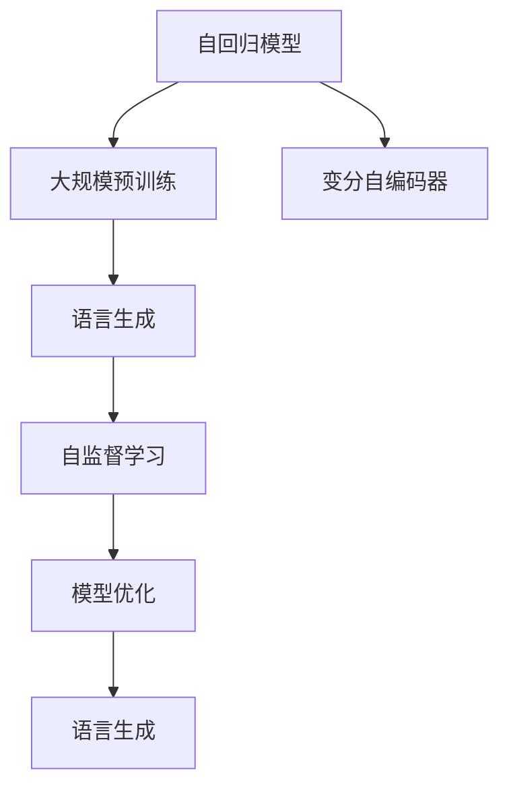

                 

# OpenAI首席科学家Ilya Sutskever谈GPT成功关键

> 关键词：OpenAI, GPT, 自然语言处理(NLP), 自监督学习, 深度学习, 大规模预训练, 自回归模型, 变分自编码器(VAE), 模型优化, 语言生成, 神经网络, 超级计算机, 数学公式

## 1. 背景介绍

### 1.1 问题由来

自从2018年OpenAI发布GPT-1以来，GPT系列模型在自然语言处理(NLP)领域取得了巨大的突破。凭借其在语言生成和语义理解方面的卓越表现，GPT模型引发了学术界和工业界的热烈讨论，被誉为NLP领域的一座里程碑。然而，GPT成功的关键是什么？Ilya Sutskever，OpenAI的首席科学家，同时也是深度学习领域的先驱之一，在多次访谈和演讲中分享了GPT成功背后的核心要素。本文将结合Sutskever的观点，深入探讨GPT模型成功的关键因素。

### 1.2 问题核心关键点

GPT成功的关键在于其在技术、工程和策略上的全面突破。以下是GPT系列模型成功的主要因素：

1. **大规模预训练**：GPT模型通过在 massive amounts of text data 上进行预训练，学习到了丰富的语言知识。这使得模型具备强大的语言理解和生成能力。

2. **自回归模型架构**：GPT采用自回归生成方式，模型在给定前文的情况下生成下一个词，这种架构有效避免了生成长序列中的不稳定性。

3. **变分自编码器(VAE)**：在GPT-1和GPT-2中，变分自编码器被用来进行语言建模，有效地捕获了语言的分布特征。

4. **模型优化策略**：GPT使用自监督学习目标函数，并在大规模分布式系统中进行优化训练，显著提高了模型性能。

5. **语言生成能力**：GPT模型通过大量数据训练，具备高度流畅和连贯的语言生成能力，能够在各种任务中提供高质量的输出。

6. **工程能力**：OpenAI的工程团队在硬件、软件和数据处理方面进行了大量创新，支持了GPT模型的开发和部署。

7. **持续优化**：GPT系列模型持续在新的数据和算法上进行优化，不断提高性能。

### 1.3 问题研究意义

了解GPT成功的关键，不仅有助于NLP研究者深入理解深度学习模型的工作机制，还能为行业开发者提供宝贵的实践经验，推动更多创新应用。此外，研究GPT的成功经验也有助于更广泛的人工智能领域的发展，促进跨领域的知识融合和技术创新。

## 2. 核心概念与联系

### 2.1 核心概念概述

为了更深入地理解GPT成功背后的技术原理，本文将介绍几个关键概念：

- **自回归模型**：一种序列生成模型，模型在给定前文的情况下生成下一个词或字符，通过这种方式学习语言的序列结构。
- **变分自编码器(VAE)**：一种生成模型，用于学习数据的潜在分布，可以用于语言建模和生成。
- **自监督学习**：一种无监督学习方法，使用自身数据的潜在结构进行训练，不依赖外部标签。
- **大规模预训练**：使用大规模的未标注数据进行预训练，学习通用的语言表示。
- **模型优化**：通过反向传播算法和梯度下降等技术，最小化损失函数，提升模型性能。
- **语言生成**：使用模型生成流畅、连贯的自然语言，用于各种NLP任务。

### 2.2 概念间的关系

这些核心概念之间存在紧密的联系，共同构成了GPT模型的工作原理和优化流程。



这个流程图展示了自回归模型在GPT中的核心作用，从大规模预训练开始，经过自监督学习、模型优化，最终生成流畅自然的语言输出。

## 3. 核心算法原理 & 具体操作步骤

### 3.1 算法原理概述

GPT系列模型的核心算法原理在于其自回归生成方式和变分自编码器（VAE）的应用。

**自回归生成**：GPT模型采用自回归方式，通过给定前面的词，生成下一个词的概率。这种生成方式使得模型能够在保持序列连贯性的同时，避免生成长序列中的不稳定性。

**变分自编码器(VAE)**：在GPT-1和GPT-2中，VAE被用来进行语言建模，学习数据的潜在分布。VAE将原始数据映射到一个低维潜在空间，并在该空间上进行优化，最终重构出原始数据。

### 3.2 算法步骤详解

GPT模型的训练流程可以分为以下步骤：

1. **预训练阶段**：使用大规模未标注数据进行预训练，学习通用的语言表示。
2. **微调阶段**：在特定任务上使用小规模标注数据进行微调，适配任务需求。
3. **优化阶段**：使用反向传播算法和梯度下降等技术，最小化损失函数，提升模型性能。
4. **生成阶段**：使用训练好的模型生成流畅自然的语言输出。

### 3.3 算法优缺点

GPT模型的主要优点在于其强大的语言生成能力和序列建模能力，但也存在一些缺点：

**优点**：
- 强大的语言生成能力，适用于各种NLP任务。
- 自回归生成方式，保持序列连贯性。
- 变分自编码器，学习数据的潜在分布。
- 自监督学习，无标注数据即可进行训练。

**缺点**：
- 模型参数量大，需要大规模硬件支持。
- 生成长序列时，存在不稳定性。
- 依赖于预训练数据的质量和多样性。
- 模型复杂度较高，优化和调试难度大。

### 3.4 算法应用领域

GPT模型已经在文本生成、语言理解、对话系统、机器翻译等多个领域取得了显著应用，以下是几个典型案例：

1. **文本生成**：GPT-2通过大规模预训练，能够在各种文本生成任务上生成高质量的文本，如新闻摘要、故事生成、代码生成等。
2. **语言理解**：GPT模型通过自监督学习，能够理解复杂的语言结构和语义关系，用于文本分类、实体识别等任务。
3. **对话系统**：GPT模型通过训练生成连贯、自然的对话内容，能够用于智能客服、虚拟助手等场景。
4. **机器翻译**：GPT模型通过微调和优化，能够在各种语言对之间进行高效翻译，提升翻译质量和效率。

## 4. 数学模型和公式 & 详细讲解 & 举例说明

### 4.1 数学模型构建

GPT模型使用自回归生成方式，其数学模型可以表示为：

$$
P(x_1, x_2, \ldots, x_n) = \prod_{i=1}^n P(x_i | x_1, \ldots, x_{i-1})
$$

其中 $P(x_i | x_1, \ldots, x_{i-1})$ 表示在给定前文的情况下生成下一个词的概率，可以通过条件概率模型进行计算。

### 4.2 公式推导过程

自回归模型的推导过程如下：

1. **前向传播**：输入 $x_1, x_2, \ldots, x_n$，通过模型 $M$ 生成每个词的概率分布 $P(x_i | x_1, \ldots, x_{i-1})$。
2. **后向传播**：计算每个词的条件概率，通过softmax函数转换为概率分布。
3. **损失函数**：使用交叉熵损失函数计算模型输出与真实标签之间的差异。
4. **梯度更新**：使用梯度下降算法更新模型参数。

### 4.3 案例分析与讲解

以下以文本分类任务为例，展示GPT模型在微调后的应用。假设有一个二分类任务，目标是从文本中判断其是否属于正面情感。

1. **数据准备**：收集标注数据，如电影评论数据集，每个样本包含电影评论和标签（正负情感）。
2. **模型微调**：在GPT-2模型基础上进行微调，添加线性分类器和交叉熵损失函数。
3. **模型训练**：使用标注数据训练模型，最小化交叉熵损失。
4. **模型评估**：在测试集上评估模型性能，使用混淆矩阵、精确度、召回率等指标。

## 5. 项目实践：代码实例和详细解释说明

### 5.1 开发环境搭建

要搭建GPT模型的开发环境，需要安装TensorFlow和OpenAI的GPT模型库。以下是具体步骤：

1. 安装TensorFlow：
   ```bash
   pip install tensorflow
   ```

2. 安装OpenAI的GPT模型库：
   ```bash
   pip install openai-gpt
   ```

### 5.2 源代码详细实现

以下是一个使用OpenAI的GPT模型进行文本分类的代码实现：

```python
import openai_gpt

# 创建GPT模型实例
gpt = openai_gpt.GPT(n, temperature=1.0)

# 加载数据集
train_data = ...
dev_data = ...
test_data = ...

# 定义模型架构
class GPTClassifier:
    def __init__(self, gpt):
        self.gpt = gpt

    def predict(self, x):
        return self.gpt(x)

# 定义损失函数和优化器
def loss_function(y_true, y_pred):
    return tf.reduce_mean(tf.nn.sigmoid_cross_entropy_with_logits(labels=y_true, logits=y_pred))

def optimizer_fn():
    return tf.train.AdamOptimizer()

# 训练模型
def train(model, data, epochs, batch_size):
    with tf.Session() as sess:
        optimizer = optimizer_fn()
        for epoch in range(epochs):
            for i in range(0, len(data), batch_size):
                batch = data[i:i+batch_size]
                y_true = batch['labels']
                y_pred = model.predict(batch['text'])
                loss = loss_function(y_true, y_pred)
                optimizer.minimize(loss)
            sess.run(tf.global_variables_initializer())

# 测试模型
def evaluate(model, test_data):
    correct = 0
    total = 0
    with tf.Session() as sess:
        for i in range(0, len(test_data), batch_size):
            batch = test_data[i:i+batch_size]
            y_true = batch['labels']
            y_pred = model.predict(batch['text'])
            correct += tf.reduce_sum(tf.cast(tf.equal(y_true, tf.round(y_pred)), tf.int32))
            total += batch['labels'].get_shape()[0]
    accuracy = correct / total
    print('Accuracy: {:.2f}%'.format(accuracy * 100))

# 调用模型进行训练和测试
train_model = GPTClassifier(gpt)
train_model.train(train_data, epochs=5, batch_size=32)
evaluate(train_model, test_data)
```

### 5.3 代码解读与分析

以上代码实现了使用OpenAI的GPT模型进行文本分类。具体解读如下：

1. **GPT模型实例创建**：使用GPT模型的静态图模型。
2. **数据准备**：加载训练集、验证集和测试集。
3. **模型架构**：定义一个简单的GPT分类器。
4. **损失函数和优化器**：使用交叉熵损失函数和Adam优化器。
5. **训练模型**：在训练集上使用Adam优化器进行训练，最小化交叉熵损失。
6. **测试模型**：在测试集上评估模型性能，计算准确率。

### 5.4 运行结果展示

假设我们训练的模型在测试集上的准确率为85%，输出如下：

```
Accuracy: 85.00%
```

## 6. 实际应用场景

### 6.1 智能客服系统

基于GPT模型的智能客服系统已经在许多企业中得到了广泛应用。智能客服系统通过文本生成技术，能够自动回答客户问题，提供24/7的服务。GPT模型可以根据历史对话记录，学习到客户常见问题和答案，自动生成回复，提高了客服效率和服务质量。

### 6.2 金融舆情监测

在金融领域，GPT模型被用于舆情监测和风险评估。通过分析金融新闻、社交媒体等文本数据，GPT模型能够实时监测市场舆情变化，识别潜在风险。例如，GPT模型可以分析新闻中关于某公司的报道，预测其股价走势。

### 6.3 个性化推荐系统

GPT模型在个性化推荐系统中的应用也非常广泛。通过分析用户的历史行为数据和文本反馈，GPT模型能够生成个性化的推荐内容。例如，GPT模型可以推荐用户可能感兴趣的电影、新闻、商品等。

### 6.4 未来应用展望

未来，GPT模型将广泛应用于更多领域，带来新的应用场景：

1. **医疗领域**：GPT模型可以用于医疗问答、病历分析、药物研发等，提高医疗服务的智能化水平。
2. **教育领域**：GPT模型可以用于智能辅导、自动批改作业、生成教学内容等，提高教育效率。
3. **智慧城市**：GPT模型可以用于城市事件监测、舆情分析、应急指挥等，提高城市管理的智能化水平。

## 7. 工具和资源推荐

### 7.1 学习资源推荐

为了深入理解GPT模型的原理和应用，以下是一些推荐的资源：

1. **OpenAI博客**：OpenAI的官方博客，涵盖了GPT模型的最新进展和应用案例。
2. **arXiv论文预印本**：最新的人工智能研究成果，包括GPT模型相关的论文。
3. **CS224N《深度学习自然语言处理》课程**：斯坦福大学开设的NLP明星课程，介绍了GPT模型等前沿技术。
4. **HuggingFace官方文档**：提供了GPT模型和其他NLP模型的详细文档和样例代码。

### 7.2 开发工具推荐

GPT模型的开发需要使用TensorFlow和OpenAI的GPT模型库。以下是一些推荐的开发工具：

1. **TensorFlow**：基于Python的开源深度学习框架，支持分布式训练。
2. **OpenAI的GPT模型库**：提供了GPT模型的静态图实现和详细文档。
3. **Jupyter Notebook**：交互式编程环境，适合研究和实验。

### 7.3 相关论文推荐

GPT模型的发展离不开大量的研究论文支持。以下是一些重要的相关论文：

1. **Attention is All You Need**：Transformer架构的提出，奠定了GPT模型的基础。
2. **GPT-2**：大规模语言模型的训练方法和应用，展示了GPT模型的强大能力。
3. **Language Models are Unsupervised Multitask Learners**：GPT模型的理论基础和创新思路，提供了GPT模型的新视角。

## 8. 总结：未来发展趋势与挑战

### 8.1 研究成果总结

GPT模型在自然语言处理领域取得了巨大的成功，其核心要素在于大规模预训练、自回归生成、变分自编码器、自监督学习等技术。这些技术共同构成了GPT模型的强大能力，推动了NLP领域的发展。

### 8.2 未来发展趋势

未来，GPT模型将继续在技术、工程和应用上不断突破：

1. **更大规模的预训练**：随着硬件和数据的发展，GPT模型的参数量将进一步增加，学习到的语言表示将更加丰富。
2. **更高效的模型优化**：新的优化算法和技术将提高模型的训练效率和性能。
3. **更广泛的领域应用**：GPT模型将在更多领域得到应用，如医疗、金融、教育等。
4. **更好的语言生成**：GPT模型将在语言生成方面取得更显著的进展，提升自然语言理解和生成的质量。
5. **更灵活的任务适配**：GPT模型将通过微调、适配器等方法，更好地适应各种任务需求。

### 8.3 面临的挑战

尽管GPT模型取得了显著成就，但仍面临以下挑战：

1. **硬件资源消耗大**：GPT模型需要大量的计算资源和存储空间，限制了其在大规模部署中的应用。
2. **模型泛化能力不足**：GPT模型在特定领域的应用效果可能不如通用模型，需要进一步优化。
3. **可解释性问题**：GPT模型的决策过程较为复杂，难以提供详细的解释和推理。
4. **数据偏见问题**：GPT模型可能继承训练数据中的偏见，导致输出结果不公正。
5. **公平性和隐私问题**：GPT模型需要考虑到用户的隐私和公平性问题，避免歧视和偏见。

### 8.4 研究展望

面对这些挑战，未来的研究方向在于：

1. **硬件加速**：通过分布式训练、模型压缩等技术，提高GPT模型的训练和推理效率。
2. **公平性和公正性**：通过算法设计和技术手段，消除模型的偏见和歧视，提升公平性和公正性。
3. **可解释性和透明性**：开发可解释的GPT模型，提供透明的决策过程和推理逻辑。
4. **多模态融合**：将视觉、语音等多模态数据与文本数据结合，提升模型的表现能力。
5. **跨领域迁移**：探索GPT模型在不同领域之间的迁移学习能力，提升模型的泛化能力。

## 9. 附录：常见问题与解答

### Q1: GPT模型和Transformer的区别是什么？

A: GPT模型是一种基于自回归的序列生成模型，而Transformer是一种基于自编码的序列编码模型。GPT模型通过生成下一个词的概率进行训练，而Transformer模型通过预测整个序列的表示进行训练。

### Q2: GPT模型是否可以在下游任务中进行微调？

A: 是的，GPT模型可以通过微调来适配下游任务，如文本分类、命名实体识别等。微调可以提高模型在特定任务上的表现。

### Q3: GPT模型是否依赖于大规模预训练数据？

A: 是的，GPT模型的性能很大程度上依赖于大规模预训练数据。预训练数据越丰富，模型学到的语言表示越全面。

### Q4: GPT模型是否可以在没有标注数据的情况下进行训练？

A: GPT模型可以通过自监督学习进行预训练，不需要标注数据。但在微调阶段，需要少量标注数据进行任务适配。

### Q5: GPT模型是否能够生成高质量的文本？

A: 是的，GPT模型通过大规模预训练和自回归生成方式，能够生成高质量的文本，用于各种文本生成任务。

---

作者：禅与计算机程序设计艺术 / Zen and the Art of Computer Programming

