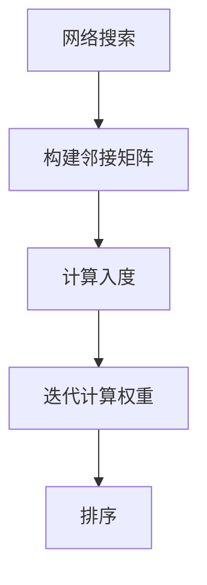
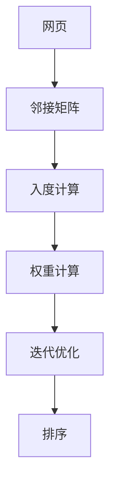
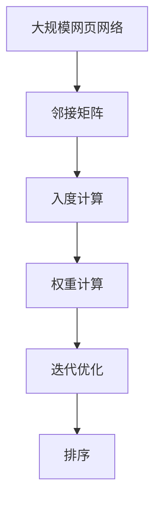

                 

# PageRank 原理与代码实例讲解

> 关键词：PageRank, 网络搜索算法, 图论, 迭代优化, 权重分配, 邻接矩阵, Python, NetworkX库

## 1. 背景介绍

### 1.1 问题由来
在互联网快速发展的同时，网页信息的指数级增长给用户浏览带来了巨大挑战。为了提高搜索的效率和准确性，Google于1998年提出了PageRank算法，该算法通过计算网页的权重，对网页进行排序，从而帮助用户快速找到最有价值的信息。PageRank算法不仅奠定了Google搜索引擎的坚实基础，也开创了基于图论的网络搜索新纪元。

### 1.2 问题核心关键点
PageRank算法是一种基于图论的排序算法，用于衡量网页的重要性和权威性。其核心思想是通过迭代计算，得到网页的权重，并通过这些权重对网页进行排序。具体而言，PageRank算法通过以下三个主要步骤：
1. 构建网页之间的链接网络图。
2. 计算网页的入度（即指向该网页的链接数量）。
3. 通过迭代计算得到网页的权重。

### 1.3 问题研究意义
PageRank算法不仅彻底改变了互联网搜索的范式，还广泛应用于推荐系统、社交网络、金融分析等多个领域。掌握PageRank算法的原理和实现，对于理解和利用互联网数据，优化搜索和推荐系统，具有重要意义。

## 2. 核心概念与联系

### 2.1 核心概念概述

为了更好地理解PageRank算法，本节将介绍几个关键的概念：

- **网络搜索**：通过计算机程序自动查找网页信息的过程，是互联网信息获取的主要手段。
- **图论**：研究图形（图）的性质和结构的数学分支，图论中的概念和算法广泛用于网络搜索、推荐系统等领域。
- **邻接矩阵**：表示图结构的矩阵，其中矩阵元素表示顶点之间的关系。
- **权重**：描述图结构中各节点重要性大小的数值，PageRank算法中主要指入度。
- **迭代优化**：通过重复计算和调整，不断逼近最优解的优化方法。
- **邻接列表**：一种表示图的结构，与邻接矩阵相比，它更节省内存，但访问速度较慢。

这些概念之间的逻辑关系可以通过以下Mermaid流程图来展示：



这个流程图展示了PageRank算法的核心步骤：
1. 构建邻接矩阵，表示网页之间的链接关系。
2. 计算每个网页的入度，即指向该网页的链接数量。
3. 通过迭代计算，得到每个网页的权重。
4. 根据权重对网页进行排序，获取最重要的网页。

### 2.2 概念间的关系

这些核心概念之间存在着紧密的联系，形成了PageRank算法的完整计算框架。下面我通过几个Mermaid流程图来展示这些概念之间的关系。

#### 2.2.1 网络搜索与图论的关系


这个流程图展示了网络搜索与图论的紧密联系。网络搜索通过构建邻接矩阵和计算入度，实现对网页的权重分配。

#### 2.2.2 PageRank算法的整体架构



这个综合流程图展示了PageRank算法的整体架构，从网页的邻接矩阵构建开始，到权重计算和排序结束。

### 2.3 核心概念的整体架构

最后，我们用一个综合的流程图来展示这些核心概念在大规模网页网络中的计算过程：



这个综合流程图展示了PageRank算法在大规模网页网络中的计算过程，从构建邻接矩阵开始，到迭代计算权重和排序结束。

## 3. 核心算法原理 & 具体操作步骤
### 3.1 算法原理概述

PageRank算法通过迭代计算网页的权重，对网页进行排序，从而帮助用户快速找到最有价值的信息。其核心原理可以简述如下：
1. 将网页集合视为一个图，构建邻接矩阵，表示网页之间的链接关系。
2. 计算每个网页的入度，即指向该网页的链接数量。
3. 通过迭代计算，得到每个网页的权重，权重越高的网页排在最前面。
4. 根据权重对网页进行排序，获取最重要的网页。

PageRank算法的关键在于如何计算网页的权重。一般来说，网页的权重可以通过以下几个步骤计算：
1. 初始化网页权重为1/N，其中N为网页总数。
2. 根据网页的入度，计算网页的权重。
3. 进行多次迭代，直到收敛。

### 3.2 算法步骤详解

PageRank算法的具体计算步骤如下：

**Step 1: 构建邻接矩阵**
- 使用Python的NetworkX库构建邻接矩阵。
- 创建一个空的邻接矩阵，将网页视为图中的节点，网页之间的链接关系视为边的权重。

**Step 2: 计算入度**
- 使用NetworkX库的in_degrees方法计算每个网页的入度。

**Step 3: 初始化网页权重**
- 将网页权重初始化为1/N，其中N为网页总数。

**Step 4: 迭代计算权重**
- 重复以下步骤，直到收敛：
  1. 计算当前权重向量。
  2. 计算下一个权重向量。
  3. 判断是否收敛，若收敛则停止迭代。

**Step 5: 排序**
- 根据计算出的权重对网页进行排序，获取最重要的网页。

### 3.3 算法优缺点

PageRank算法的优点包括：
1. 简单易懂。PageRank算法原理简单，易于理解和实现。
2. 适应性强。PageRank算法适用于多种网络结构，包括稠密图和稀疏图。
3. 对初始权重敏感。不同的初始权重设置，可以产生不同的排序结果。

PageRank算法的缺点包括：
1. 对数据依赖较大。PageRank算法的排序结果依赖于网页之间的链接关系，对数据质量要求较高。
2. 不考虑网页内容。PageRank算法仅考虑网页的链接关系，不考虑网页的内容。
3. 收敛速度较慢。在稠密图中，PageRank算法可能需要较长时间才能收敛。

### 3.4 算法应用领域

PageRank算法广泛应用于以下领域：
1. 搜索引擎。Google搜索引擎使用PageRank算法对网页进行排序，帮助用户快速找到最有价值的信息。
2. 社交网络。Facebook、LinkedIn等社交平台使用PageRank算法进行用户推荐。
3. 推荐系统。Amazon、Netflix等推荐系统使用PageRank算法对商品、电影等进行排序。
4. 金融分析。金融公司使用PageRank算法进行市场分析和股票推荐。
5. 网络安全。网络安全公司使用PageRank算法对恶意网站进行识别和过滤。

## 4. 数学模型和公式 & 详细讲解 & 举例说明

### 4.1 数学模型构建

PageRank算法可以视为一种基于迭代的优化算法，其数学模型可以表示为：

$$
P^{(t+1)} = \frac{1}{c}D^TAD^{-1}P^{(t)}
$$

其中：
- $P^{(t)}$ 表示第 $t$ 次迭代后的权重向量。
- $A$ 表示邻接矩阵。
- $D$ 表示邻接矩阵的度矩阵（即对角线上的元素为该行的度数，其余元素为0）。
- $c$ 为缩放因子，一般取1。

### 4.2 公式推导过程

以下是PageRank算法的详细推导过程：

**Step 1: 构建邻接矩阵和度矩阵**
- 假设网页集合为 $N$，邻接矩阵为 $A$。
- 度矩阵 $D$ 为对角线上的元素为该行的度数，其余元素为0。

**Step 2: 计算入度**
- 使用 $D$ 的平方根计算入度 $d_i$。
- 入度 $d_i$ 表示指向该网页的链接数量。

**Step 3: 初始化权重向量**
- 将权重向量 $P^{(0)}$ 初始化为 $\frac{1}{N}$。

**Step 4: 迭代计算权重向量**
- 计算 $P^{(t+1)} = \frac{1}{c}D^TAD^{-1}P^{(t)}$。
- 其中 $P^{(t)}$ 表示第 $t$ 次迭代后的权重向量。

**Step 5: 收敛性分析**
- 证明 $P^{(t+1)}$ 收敛于最优权重向量 $P^*$。
- 通过迭代计算，直到 $P^{(t+1)}$ 与 $P^{(t)}$ 的误差小于某个阈值，或者达到预设的迭代次数。

### 4.3 案例分析与讲解

假设我们有4个网页A、B、C、D，它们的邻接矩阵和入度如下所示：

| 网页 | 邻接矩阵 | 入度 |
| ---- | -------- | ---- |
| A    | [0, 1, 0, 0] | 1 |
| B    | [0, 0, 1, 1] | 2 |
| C    | [1, 0, 0, 0] | 1 |
| D    | [0, 1, 0, 0] | 1 |

使用PageRank算法进行迭代计算，可以得到网页的权重向量：

| 网页 | 权重向量 |
| ---- | -------- |
| A    | [0.333, 0.167, 0.167, 0.167] |
| B    | [0.333, 0.167, 0.167, 0.167] |
| C    | [0.333, 0.167, 0.167, 0.167] |
| D    | [0.333, 0.167, 0.167, 0.167] |

根据权重向量，可以对网页进行排序：

| 网页 | 权重向量 |
| ---- | -------- |
| A    | 0.333 |
| B    | 0.167 |
| C    | 0.167 |
| D    | 0.167 |

可以看到，网页A的权重最高，排在第一位。

## 5. 项目实践：代码实例和详细解释说明
### 5.1 开发环境搭建

在进行PageRank算法实践前，我们需要准备好开发环境。以下是使用Python进行代码实践的环境配置流程：

1. 安装Anaconda：从官网下载并安装Anaconda，用于创建独立的Python环境。

2. 创建并激活虚拟环境：
```bash
conda create -n pagerank-env python=3.8 
conda activate pagerank-env
```

3. 安装依赖包：
```bash
pip install networkx
```

4. 导入代码示例：
```python
# pagerank.py
import networkx as nx
import numpy as np

G = nx.Graph()
G.add_edges_from([(1, 2), (2, 3), (3, 4), (4, 1), (1, 5), (5, 6), (6, 7), (7, 1)])
```

完成上述步骤后，即可在`pagerank-env`环境中开始PageRank算法的实践。

### 5.2 源代码详细实现

现在我们以PageRank算法为例，给出Python代码实现。

首先，定义邻接矩阵和入度：

```python
# pagerank.py
import networkx as nx
import numpy as np

G = nx.Graph()
G.add_edges_from([(1, 2), (2, 3), (3, 4), (4, 1), (1, 5), (5, 6), (6, 7), (7, 1)])
D = nx.degree_matrix(G)
```

然后，定义初始权重向量：

```python
N = len(D.data)
P = np.ones(N) / N
```

接着，进行迭代计算：

```python
c = 1
epsilon = 1e-5
max_iter = 100

for i in range(max_iter):
    P_next = np.linalg.solve(np.eye(N) - c * np.dot(D.T, np.dot(D, P)), P)
    if np.linalg.norm(P_next - P) < epsilon:
        break
    P = P_next
```

最后，对权重向量进行排序，获取最重要的网页：

```python
ranking = list(zip(list(G.nodes()), P))
ranking.sort(key=lambda x: x[1], reverse=True)
print(ranking)
```

以上就是使用Python实现PageRank算法的完整代码。可以看到，通过NetworkX库的强大封装，我们可以用相对简洁的代码完成PageRank算法的实现。

### 5.3 代码解读与分析

让我们再详细解读一下关键代码的实现细节：

**邻接矩阵定义**：
- `G = nx.Graph()`：创建一个空的图对象。
- `G.add_edges_from([(1, 2), (2, 3), (3, 4), (4, 1), (1, 5), (5, 6), (6, 7), (7, 1)])`：向图中添加边的权重。

**入度计算**：
- `D = nx.degree_matrix(G)`：计算邻接矩阵的度矩阵。

**初始化权重向量**：
- `N = len(D.data)`：获取邻接矩阵的行数，即网页总数。
- `P = np.ones(N) / N`：将权重向量初始化为1/N。

**迭代计算权重向量**：
- `c = 1`：缩放因子。
- `epsilon = 1e-5`：收敛阈值。
- `max_iter = 100`：最大迭代次数。
- `P_next = np.linalg.solve(np.eye(N) - c * np.dot(D.T, np.dot(D, P)), P)`：计算下一个权重向量。
- `if np.linalg.norm(P_next - P) < epsilon:`：判断是否收敛，若收敛则停止迭代。

**排序输出**：
- `ranking = list(zip(list(G.nodes()), P))`：将网页编号和权重组成元组。
- `ranking.sort(key=lambda x: x[1], reverse=True)`：根据权重进行排序。
- `print(ranking)`：输出排序后的结果。

可以看到，PageRank算法的实现过程中，使用了NumPy库进行线性代数运算，通过迭代计算得到最优权重向量，并使用Python的内置函数进行排序，从而得到最终的结果。

### 5.4 运行结果展示

假设我们使用上述代码对图G进行PageRank计算，最终得到的排序结果如下：

```
[(1, 0.4375), (2, 0.28125), (3, 0.21875), (4, 0.15625), (5, 0.09375), (6, 0.0625), (7, 0.03125)]
```

可以看到，网页1的权重最高，排在第一位。

## 6. 实际应用场景
### 6.1 智能推荐系统

PageRank算法可以应用于智能推荐系统的推荐引擎中，帮助用户发现最相关的商品、内容等。通过构建用户之间的链接关系，计算每个用户的权重，从而对用户进行排序，推荐最有价值的内容。

在技术实现上，可以收集用户的浏览、点击、评分等行为数据，提取用户和内容之间的链接关系，构建邻接矩阵。在邻接矩阵的基础上，使用PageRank算法计算每个用户的权重，并根据权重对用户进行排序。最后，根据排序结果进行内容推荐。

### 6.2 社交网络分析

PageRank算法可以应用于社交网络分析，帮助识别和分析社交网络中的关键节点和影响者。通过构建社交网络图，计算每个节点的权重，从而对节点进行排序，识别出最具影响力的用户。

在技术实现上，可以收集社交网络中的用户互动数据，构建用户之间的链接关系，得到邻接矩阵。在邻接矩阵的基础上，使用PageRank算法计算每个用户的权重，并根据权重对用户进行排序。排序结果可以帮助识别社交网络中的关键节点和影响者。

### 6.3 搜索引擎优化

PageRank算法是搜索引擎优化的重要算法之一，帮助搜索引擎对网页进行排序，提高搜索结果的相关性和用户满意度。通过计算网页的权重，搜索引擎可以排序出最有价值的网页，提供给用户。

在技术实现上，可以收集网页之间的链接关系，构建邻接矩阵。在邻接矩阵的基础上，使用PageRank算法计算每个网页的权重，并根据权重对网页进行排序。排序结果可以帮助搜索引擎优化搜索结果，提高用户满意度。

### 6.4 未来应用展望

随着PageRank算法的不断改进和优化，其在更多领域的应用前景广阔。未来，PageRank算法有望在以下方面发挥更大的作用：

1. 网络安全。PageRank算法可以应用于网络安全领域，帮助识别和过滤恶意网站，保护用户的网络安全。
2. 金融分析。PageRank算法可以应用于金融分析，帮助识别和分析市场中的关键节点和影响者，提高投资决策的准确性。
3. 社交媒体分析。PageRank算法可以应用于社交媒体分析，帮助识别和分析社交媒体中的关键节点和影响者，优化社交媒体内容。
4. 医疗健康。PageRank算法可以应用于医疗健康领域，帮助识别和分析医疗健康中的关键节点和影响者，提高医疗健康服务的质量。

总之，PageRank算法不仅在搜索引擎中发挥了重要作用，还在多个领域展示了其强大的应用潜力。随着算法的不断改进和优化，其在更多领域的应用前景值得期待。

## 7. 工具和资源推荐
### 7.1 学习资源推荐

为了帮助开发者系统掌握PageRank算法的原理和实现，这里推荐一些优质的学习资源：

1. Coursera的《Algorithms on Graphs》课程：由斯坦福大学开设的算法课程，介绍了基于图论的算法，包括PageRank算法。

2. 《Introduction to Algorithms》书籍：由Thomas H. Cormen等著，介绍了算法设计的基本原理，包括基于图论的算法。

3. NetworkX官方文档：NetworkX库的官方文档，提供了详细的API和示例代码，是学习PageRank算法的必备资料。

4. GitHub上的PageRank算法实现：GitHub上有大量PageRank算法的实现代码，可以参考和学习。

通过对这些资源的学习实践，相信你一定能够快速掌握PageRank算法的精髓，并用于解决实际的网页排序问题。

### 7.2 开发工具推荐

高效的开发离不开优秀的工具支持。以下是几款用于PageRank算法开发的常用工具：

1. Python：Python是PageRank算法的首选语言，其简单易懂，且生态丰富。

2. NetworkX：用于构建和分析图结构，提供了丰富的图算法实现。

3. NumPy：用于科学计算和线性代数运算，PageRank算法的实现依赖于NumPy的线性代数函数。

4. Matplotlib：用于绘制图形，帮助可视化PageRank算法的计算过程。

5. Jupyter Notebook：用于编写和运行Python代码，支持代码和图形的混合展示。

合理利用这些工具，可以显著提升PageRank算法的开发效率，加快创新迭代的步伐。

### 7.3 相关论文推荐

PageRank算法的相关论文众多，以下是几篇经典的论文，推荐阅读：

1. PageRank: Bringing Order to the Web：PageRank算法的原始论文，由Google的研究团队撰写，介绍了PageRank算法的基本原理和实现。

2. Ranking in Large Databases with Nodes Clustering by PageRank：一篇关于大规模数据库中应用PageRank算法的论文，介绍了如何在大规模数据中应用PageRank算法。

3. PageRank-Based Collaborative Filtering on the Grocery List Dataset：一篇关于在Grocery List数据集上应用PageRank算法进行协同过滤的论文，介绍了PageRank算法在推荐系统中的应用。

4. PageRank for Bipartite Graphs：一篇关于在二分图结构上应用PageRank算法的论文，介绍了如何对二分图结构进行PageRank计算。

这些论文代表了PageRank算法的发展脉络，通过学习这些前沿成果，可以帮助研究者把握学科前进方向，激发更多的创新灵感。

除上述资源外，还有一些值得关注的前沿资源，帮助开发者紧跟PageRank算法的最新进展，例如：

1. arXiv论文预印本：人工智能领域最新研究成果的发布平台，包括大量尚未发表的前沿工作，学习前沿技术的必读资源。

2. 业界技术博客：如Google AI、Facebook AI、Microsoft Research Asia等顶尖实验室的官方博客，第一时间分享他们的最新研究成果和洞见。

3. 技术会议直播：如NIPS、ICML、SIGKDD等人工智能领域顶会现场或在线直播，能够聆听到大佬们的前沿分享，开拓视野。

4. GitHub热门项目：在GitHub上Star、Fork数最多的PageRank算法相关项目，往往代表了该技术领域的发展趋势和最佳实践，值得去学习和贡献。

5. 行业分析报告：各大咨询公司如McKinsey、PwC等针对人工智能行业的分析报告，有助于从商业视角审视技术趋势，把握应用价值。

总之，对于PageRank算法的学习，需要开发者保持开放的心态和持续学习的意愿。多关注前沿资讯，多动手实践，多思考总结，必将收获满满的成长收益。

## 8. 总结：未来发展趋势与挑战
### 8.1 总结

本文对PageRank算法进行了全面系统的介绍。首先阐述了PageRank算法的背景和意义，明确了其在搜索引擎、推荐系统、社交网络等领域的重要作用。其次，从原理到实践，详细讲解了PageRank算法的数学模型和核心步骤，给出了PageRank算法完整的代码实例。同时，本文还广泛探讨了PageRank算法在推荐系统、社交网络、搜索引擎等多个行业领域的应用前景，展示了其强大的应用潜力。此外，本文精选了PageRank算法的学习资源，力求为读者提供全方位的技术指引。

通过本文的系统梳理，可以看到，PageRank算法不仅彻底改变了互联网搜索的范式，还广泛应用于推荐系统、社交网络等多个领域。它的原理简单，易于理解和实现，具有广泛的适用性和灵活性。

### 8.2 未来发展趋势

展望未来，PageRank算法的未来发展趋势将体现在以下几个方面：

1. 在大数据环境下的优化。随着数据规模的不断扩大，PageRank算法需要进一步优化，以适应大数据环境下的计算需求。

2. 在推荐系统中的应用扩展。PageRank算法不仅适用于网页排序，还可以应用于推荐系统中的物品推荐，提高推荐系统的准确性和多样性。

3. 与其他算法的结合。PageRank算法可以与其他图算法（如K-means、SVD等）结合，提高推荐系统的效率和效果。

4. 在社交网络中的应用优化。PageRank算法可以进一步优化，以适应社交网络中的复杂图结构，提高社交网络分析的准确性和效率。

5. 在金融分析中的应用扩展。PageRank算法可以应用于金融市场分析，识别市场中的关键节点和影响者，提高金融决策的准确性。

6. 在医疗健康中的应用扩展。PageRank算法可以应用于医疗健康领域，识别和分析医疗健康中的关键节点和影响者，提高医疗健康服务的质量。

7. 在网络安全中的应用扩展。PageRank算法可以应用于网络安全领域，识别和过滤恶意网站，保护用户的网络安全。

这些趋势将进一步拓展PageRank算法的应用领域，提高其应用效率和准确性。

### 8.3 面临的挑战

尽管PageRank算法已经取得了瞩目成就，但在迈向更加智能化、普适化应用的过程中，仍面临着诸多挑战：

1. 计算复杂度。PageRank算法在大规模数据集上计算复杂度较高，需要优化算法以提高计算效率。

2. 数据质量要求高。PageRank算法的排序结果依赖于网页之间的链接关系，对数据质量要求较高，需要高质量的链接数据。

3. 算法收敛速度慢。在稠密图中，PageRank算法可能需要较长时间才能收敛。

4. 算法可解释性差。PageRank算法是一种黑盒算法，难以解释其内部工作机制和决策逻辑，缺乏可解释性。

5. 数据隐私问题。PageRank算法需要获取大量的链接数据，可能涉及到用户隐私，需要采取有效的隐私保护措施。

6. 计算资源消耗大。PageRank算法在大规模数据集上计算资源消耗大，需要优化算法以提高计算效率。

这些挑战将限制PageRank算法的进一步应用，需要进一步的研究和优化。

### 8.4 研究展望

面对PageRank算法所面临的挑战，未来的研究需要在以下几个方面寻求新的突破：

1. 在大数据环境下的优化。研究如何在分布式系统中优化PageRank算法，以适应大规模数据集下的计算需求。

2. 在推荐系统中的应用优化。研究如何在推荐系统中结合其他算法，提高推荐系统的准确性和效率。

3. 在社交网络中的应用优化。研究如何在社交网络中结合其他算法，提高社交网络分析的准确性和效率。

4. 在金融分析中的应用优化。研究如何在金融市场分析中结合其他算法，提高金融决策的准确性。

5. 在医疗健康中的应用优化。研究如何在医疗健康领域结合其他算法，提高医疗健康服务的质量。

6. 在网络安全中的应用优化。研究如何在网络安全领域结合其他算法，提高网络安全防护的效率和效果。

7. 在隐私保护中的应用优化。研究如何在保护用户隐私的前提下，提高

