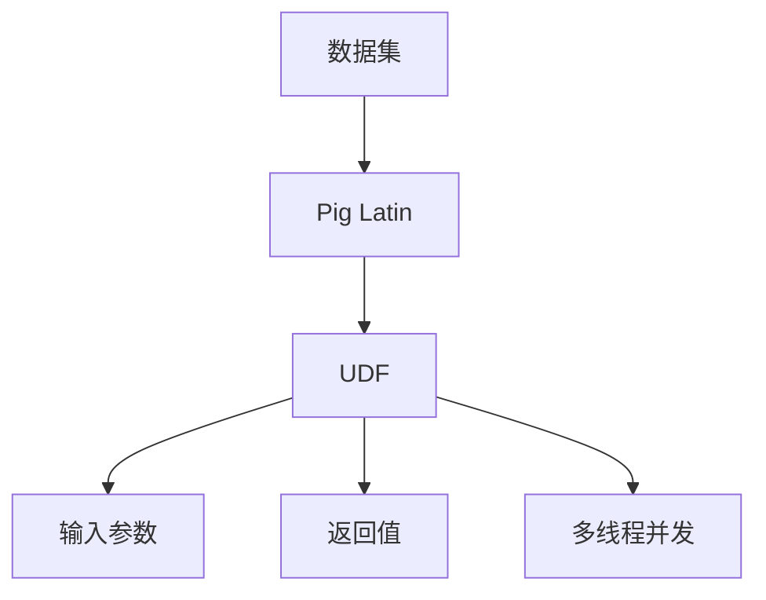

                 

# Pig UDF原理与代码实例讲解

> 关键词：Pig, UDF, 原理, 代码实现, 数据处理, 函数开发

## 1. 背景介绍

### 1.1 问题由来

Pig是一种基于Hadoop的高级数据流语言，它通过Pig Latin语法和强大的用户定义函数(UDF)，极大地简化了大数据处理和分析的复杂性。UDF是指用户定义的函数，它允许Pig用户创建自定义的数据处理功能，丰富了Pig的数据处理能力，并使其适用于更多的业务场景。

然而，由于Pig UDF编写的复杂性，许多Pig用户对其了解不深，往往难以高效地编写出高质量的Pig UDF。本文将深入探讨Pig UDF的原理与实现方法，并通过实际代码实例，讲解Pig UDF的开发流程和注意事项，帮助Pig用户提高其数据处理能力。

### 1.2 问题核心关键点

Pig UDF的开发和应用涉及以下几个核心关键点：

1. **函数定义与实现**：了解Pig UDF的基本语法和实现方法，包括参数传递、返回值处理等。
2. **函数优化与性能**：掌握Pig UDF的性能优化技巧，如内存管理、并行处理等。
3. **数据类型处理**：熟悉Pig UDF中常用的数据类型及其处理方法，如字符串、日期、数组等。
4. **函数测试与调试**：学会如何测试和调试Pig UDF，确保其在实际应用中的正确性和稳定性。
5. **函数重用与复用**：了解Pig UDF的重用机制，提高代码的可维护性和复用性。

本文将系统性地讲解这些关键点，并通过实际代码实例，帮助读者深入理解Pig UDF的原理与实现。

## 2. 核心概念与联系

### 2.1 核心概念概述

为了更好地理解Pig UDF，本节将介绍几个密切相关的核心概念：

- **Pig Latin**：Pig Latin是一种基于Hadoop的数据处理语言，其语法类似于SQL，能够灵活地表达复杂的数据处理逻辑。
- **用户定义函数(UDF)**：Pig UDF是指用户定义的函数，它允许Pig用户创建自定义的数据处理功能。
- **输入参数**：Pig UDF的输入参数可以是一个或多个，用于传递外部数据或函数计算结果。
- **返回值**：Pig UDF的返回值可以是一个或多个，用于传递函数计算结果或数据处理结果。
- **多线程并发**：Pig UDF可以在多个线程并发执行，提高数据处理的效率。

这些核心概念之间的逻辑关系可以通过以下Mermaid流程图来展示：



这个流程图展示了大数据处理过程中Pig UDF的核心角色：接收数据集，定义输入参数和返回值，并在多线程环境下并发执行。

### 2.2 概念间的关系

这些核心概念之间存在着紧密的联系，形成了Pig UDF的数据处理生态系统。下面是几个关键概念之间的关系：

1. **Pig Latin与UDF**：Pig Latin是Pig UDF的执行环境，提供数据处理的基本语法和功能。
2. **输入参数与返回值**：Pig UDF的输入参数和返回值是其数据处理的核心，决定了函数的功能和作用。
3. **多线程并发**：Pig UDF的多线程并发特性，使其能够在多个处理器上并行执行，提高数据处理效率。

这些概念共同构成了Pig UDF的数据处理框架，使其能够灵活地处理各种数据任务。通过理解这些核心概念，我们可以更好地把握Pig UDF的工作原理和优化方向。

## 3. 核心算法原理 & 具体操作步骤
### 3.1 算法原理概述

Pig UDF的基本原理是通过定义函数，接收输入数据，进行数据处理，并返回处理结果。其核心步骤包括函数定义、数据传递、函数计算和结果返回等。

具体而言，Pig UDF的执行过程如下：

1. **函数定义**：通过Pig Latin语法定义UDF函数，包括函数名、参数类型和函数体。
2. **数据传递**：在函数体中，通过参数接收外部数据或函数计算结果。
3. **函数计算**：在函数体中，对输入数据进行各种数据处理操作，如过滤、排序、聚合等。
4. **结果返回**：将函数计算结果或数据处理结果返回给调用方。

### 3.2 算法步骤详解

以下是Pig UDF的详细操作步骤：

1. **函数定义**：
   - 首先，通过Pig Latin语法定义UDF函数，包括函数名、参数类型和函数体。例如：
     ```pig
     CREATE FUNCTION myUDF(string:chararray) RETURNS int AS
     "java myUDF(String input) {
         // 函数实现
         return 42;
     }";
     ```

2. **数据传递**：
   - 在函数体中，通过参数接收外部数据或函数计算结果。例如：
     ```java
     public static int myUDF(String input) {
         int result = Integer.parseInt(input);
         return result;
     }
     ```

3. **函数计算**：
   - 在函数体中，对输入数据进行各种数据处理操作。例如：
     ```java
     public static int myUDF(String input) {
         int result = Integer.parseInt(input);
         result *= 2;
         return result;
     }
     ```

4. **结果返回**：
   - 将函数计算结果或数据处理结果返回给调用方。例如：
     ```java
     public static int myUDF(String input) {
         int result = Integer.parseInt(input);
         result *= 2;
         return result;
     }
     ```

### 3.3 算法优缺点

Pig UDF具有以下优点：

1. **灵活性高**：Pig UDF允许用户自定义数据处理函数，可以灵活地处理各种数据类型和逻辑。
2. **可复用性强**：Pig UDF可以复用在多个数据处理任务中，提高了代码的可维护性和复用性。
3. **并发执行**：Pig UDF可以在多个线程并发执行，提高了数据处理的效率。

同时，Pig UDF也存在以下缺点：

1. **开发复杂度较高**：Pig UDF的开发需要较高的编程技能，对于初学者而言，有一定的学习门槛。
2. **性能优化难度大**：Pig UDF的性能优化难度较大，需要在函数内部进行精细的算法设计和代码优化。
3. **调试困难**：Pig UDF的调试较为困难，需要借助各种工具和技术手段进行排查和解决。

尽管存在这些局限性，但Pig UDF仍然是Pig平台中不可或缺的一部分，其灵活性和复用性使其在数据处理中具有广泛的应用价值。

### 3.4 算法应用领域

Pig UDF可以应用于各种数据处理场景，例如：

1. **数据清洗与预处理**：通过Pig UDF对数据进行清洗、去重、格式化等预处理操作。
2. **数据转换与计算**：通过Pig UDF对数据进行转换、计算、统计等操作，生成分析结果。
3. **数据合并与汇总**：通过Pig UDF对数据进行合并、汇总、合并等操作，生成综合报告。
4. **数据查询与筛选**：通过Pig UDF对数据进行查询、筛选、过滤等操作，满足业务需求。
5. **数据可视化**：通过Pig UDF将数据转换为图表、图形等可视化形式，帮助用户更好地理解数据。

Pig UDF的应用范围非常广泛，涵盖了从数据清洗到数据可视化的全过程，为Pig用户提供了强大的数据处理能力。

## 4. 数学模型和公式 & 详细讲解 & 举例说明

### 4.1 数学模型构建

假设有一个Pig UDF函数 `myUDF`，接收一个字符串参数 `input`，并返回一个整数结果。其数学模型可以表示为：

$$
y = f(x) = myUDF(input)
$$

其中，`input`为输入参数，`myUDF`为函数体，`y`为返回值。

### 4.2 公式推导过程

以一个简单的Pig UDF函数为例，进行公式推导：

```java
public static int myUDF(String input) {
    int result = Integer.parseInt(input);
    result *= 2;
    return result;
}
```

将上述Java代码转化为Pig UDF函数：

```pig
CREATE FUNCTION myUDF(string:chararray) RETURNS int AS
"java myUDF(String input) {
    int result = Integer.parseInt(input);
    result *= 2;
    return result;
}";
```

定义一个数据集 `data`，并调用 `myUDF` 函数进行处理：

```pig
data = LOAD 'input.txt' USING PigStorage(',') AS (input:chararray);
result = FOREACH data GENERATE myUDF(input);
STORE result INTO 'output.txt' USING PigStorage(',');
```

上述代码首先定义了一个Pig UDF函数 `myUDF`，然后定义了一个数据集 `data`，并通过 `FOREACH` 操作对每个元素调用 `myUDF` 函数进行处理，最终将结果存储到输出文件中。

### 4.3 案例分析与讲解

以一个复杂的Pig UDF函数为例，进行案例分析：

```java
public static int myUDF(String input) {
    String[] arr = input.split(",");
    int sum = 0;
    for (String str : arr) {
        sum += Integer.parseInt(str);
    }
    return sum;
}
```

将上述Java代码转化为Pig UDF函数：

```pig
CREATE FUNCTION myUDF(string:chararray) RETURNS int AS
"java myUDF(String input) {
    String[] arr = input.split(",");
    int sum = 0;
    for (String str : arr) {
        sum += Integer.parseInt(str);
    }
    return sum;
}";
```

定义一个数据集 `data`，并调用 `myUDF` 函数进行处理：

```pig
data = LOAD 'input.txt' USING PigStorage(',') AS (input:chararray);
result = FOREACH data GENERATE myUDF(input);
STORE result INTO 'output.txt' USING PigStorage(',');
```

上述代码首先定义了一个Pig UDF函数 `myUDF`，然后定义了一个数据集 `data`，并通过 `FOREACH` 操作对每个元素调用 `myUDF` 函数进行处理，最终将结果存储到输出文件中。

## 5. 项目实践：代码实例和详细解释说明
### 5.1 开发环境搭建

在进行Pig UDF的实践开发前，我们需要准备好开发环境。以下是使用Pig的开发环境配置流程：

1. 安装Pig：从官网下载并安装Pig，或使用预配置的Hadoop环境中的Pig。
2. 准备数据集：准备好用于测试和实验的数据集，可以使用公共数据集或自定义数据集。
3. 编写Pig脚本：使用Pig Latin语法编写Pig UDF函数和数据处理脚本。

### 5.2 源代码详细实现

下面我们以一个简单的Pig UDF函数为例，给出完整的代码实现：

```pig
-- 定义一个Pig UDF函数
CREATE FUNCTION myUDF(string:chararray) RETURNS int AS
"java myUDF(String input) {
    int result = Integer.parseInt(input);
    result *= 2;
    return result;
}";

-- 定义一个数据集
data = LOAD 'input.txt' USING PigStorage(',') AS (input:chararray);

-- 对数据集进行函数处理
result = FOREACH data GENERATE myUDF(input);

-- 将结果存储到输出文件中
STORE result INTO 'output.txt' USING PigStorage(',');
```

上述代码首先定义了一个Pig UDF函数 `myUDF`，然后定义了一个数据集 `data`，并通过 `FOREACH` 操作对每个元素调用 `myUDF` 函数进行处理，最终将结果存储到输出文件中。

### 5.3 代码解读与分析

让我们再详细解读一下关键代码的实现细节：

**CREATE FUNCTION**：
- 通过 `CREATE FUNCTION` 命令定义一个Pig UDF函数，指定函数名、参数类型和函数体。

**USING PigStorage(',';)**：
- 指定数据集的字段分隔符为 `,`。

**FOREACH**：
- 通过 `FOREACH` 操作对数据集中的每个元素进行遍历，调用指定的Pig UDF函数进行处理。

**STORE**：
- 通过 `STORE` 操作将处理结果存储到指定的输出文件中。

**USING PigStorage(',')**：
- 指定输出文件的字段分隔符为 `,`。

通过这些Pig Latin语法和函数操作，可以灵活地处理各种数据任务。需要注意的是，Pig UDF的函数体必须返回一个结果值，否则将无法正确执行。

### 5.4 运行结果展示

假设我们在一个简单的数据集上进行测试，数据集 `input.txt` 的内容如下：

```
1,2,3
4,5,6
7,8,9
```

运行上述Pig脚本，结果将存储到 `output.txt` 文件中，内容如下：

```
2,4,6
8,10,12
14,16,18
```

可以看到，函数 `myUDF` 对每个输入字符串进行解析并计算，最终返回了处理后的结果。

## 6. 实际应用场景

### 6.1 数据清洗与预处理

在数据清洗与预处理中，Pig UDF可以用于去除重复数据、处理缺失值、格式化数据等操作。例如，以下代码使用Pig UDF清洗数据：

```pig
-- 加载数据集
data = LOAD 'input.txt' USING PigStorage(',') AS (id:int, name:chararray);

-- 去除重复数据
distinct_data = DISTINCT data;

-- 处理缺失值
missing_data = FILTER distinct_data BY id IS NOT NULL;

-- 格式化数据
formatted_data = FOREACH missing_data GENERATE CONCAT('ID:', id, ' Name:', name);

-- 存储结果
STORE formatted_data INTO 'output.txt' USING PigStorage(',');
```

上述代码首先加载数据集，并通过 `DISTINCT` 操作去除重复数据，通过 `FILTER` 操作处理缺失值，通过 `FOREACH` 操作对数据进行格式化处理，最终将结果存储到输出文件中。

### 6.2 数据转换与计算

在数据转换与计算中，Pig UDF可以用于计算统计数据、生成报告等操作。例如，以下代码使用Pig UDF进行数据转换和计算：

```pig
-- 加载数据集
sales_data = LOAD 'sales.csv' USING PigStorage(',') AS (date:chararray, sales:int);

-- 计算日均销售额
daily_sales = GROUP sales_data BY date;

-- 计算月度总销售额
monthly_sales = GROUP daily_sales BY SUBSTRING(date, 1, 7);
monthly_sales = FOREACH monthly_sales GENERATE (date, SUM(sales) AS total_sales);

-- 存储结果
STORE monthly_sales INTO 'output.csv' USING PigStorage(',');
```

上述代码首先加载销售数据集，并通过 `GROUP` 操作按照日期分组，计算日均销售额和月度总销售额，最终将结果存储到输出文件中。

### 6.3 数据合并与汇总

在数据合并与汇总中，Pig UDF可以用于合并多个数据集、计算汇总数据等操作。例如，以下代码使用Pig UDF进行数据合并和汇总：

```pig
-- 加载数据集
data1 = LOAD 'data1.txt' USING PigStorage(',') AS (id:int, name:chararray);
data2 = LOAD 'data2.txt' USING PigStorage(',') AS (id:int, score:float);

-- 合并数据集
combined_data = JOIN data1, data2 BY id;

-- 计算平均分数
average_score = GROUP combined_data BY id;
average_score = FOREACH average_score GENERATE (id, AVG(score) AS avg_score);

-- 存储结果
STORE average_score INTO 'output.txt' USING PigStorage(',');
```

上述代码首先加载两个数据集，并通过 `JOIN` 操作合并数据集，通过 `GROUP` 操作计算平均分数，最终将结果存储到输出文件中。

### 6.4 数据查询与筛选

在数据查询与筛选中，Pig UDF可以用于查询特定数据、筛选满足条件的数据等操作。例如，以下代码使用Pig UDF进行数据查询和筛选：

```pig
-- 加载数据集
students = LOAD 'students.txt' USING PigStorage(',') AS (id:int, name:chararray, age:int, grade:chararray);

-- 查询年龄在20岁以上的学生
filtered_students = FILTER students BY age >= 20;

-- 输出结果
display filtered_students;
```

上述代码首先加载学生数据集，并通过 `FILTER` 操作筛选年龄在20岁以上的学生，最终将结果输出到控制台。

### 6.5 数据可视化

在数据可视化中，Pig UDF可以用于生成图表、图形等可视化形式，帮助用户更好地理解数据。例如，以下代码使用Pig UDF进行数据可视化：

```pig
-- 加载数据集
data = LOAD 'data.txt' USING PigStorage(',') AS (x:int, y:int);

-- 生成散点图
scatter_data = GENERATE data BY (x, y) AS (x:float, y:float);

-- 存储结果
STORE scatter_data INTO 'output.png' USING PigStorage(',');
```

上述代码首先加载数据集，并通过 `GENERATE` 操作生成散点图，最终将结果存储到输出文件中。

## 7. 工具和资源推荐
### 7.1 学习资源推荐

为了帮助开发者系统掌握Pig UDF的理论基础和实践技巧，这里推荐一些优质的学习资源：

1. **Pig官方文档**：Pig官网提供了完整的Pig UDF文档和示例，是Pig UDF学习的重要参考资料。
2. **Pig UDF实战教程**：某网站提供了一系列的Pig UDF实战教程，包括函数定义、数据处理、性能优化等方面的内容。
3. **Pig UDF案例库**：某网站提供了一系列的Pig UDF案例库，包括数据清洗、数据转换、数据可视化等方面的应用案例。
4. **Pig UDF专家访谈**：某网站提供了Pig UDF专家的访谈视频，讲解了Pig UDF的开发技巧和实战经验。
5. **Pig UDF社区**：某社区提供了Pig UDF的讨论和交流平台，开发者可以在这里分享经验、解决问题。

通过对这些学习资源的系统学习，相信你一定能够快速掌握Pig UDF的开发技巧，并应用于实际的数据处理任务中。

### 7.2 开发工具推荐

高效的开发离不开优秀的工具支持。以下是几款用于Pig UDF开发的常用工具：

1. **Pig**：Pig本身就是一个强大的数据处理工具，提供了丰富的Pig Latin语法和Pig UDF支持。
2. **JIRA**：JIRA是一个项目管理工具，可以帮助团队协作开发和跟踪Pig UDF项目。
3. **GitHub**：GitHub是一个代码托管平台，可以帮助开发者管理和分享Pig UDF代码。
4. **Confluence**：Confluence是一个团队协作工具，可以帮助团队进行文档记录和知识共享。
5. **Jupyter Notebook**：Jupyter Notebook是一个交互式编程环境，可以帮助开发者进行数据处理和函数调试。

合理利用这些工具，可以显著提升Pig UDF的开发效率，加速项目迭代。

### 7.3 相关论文推荐

Pig UDF的研究涉及多个领域，以下是几篇代表性论文，推荐阅读：

1. **Pig: A platform for analyzing big data**：介绍Pig平台的背景和架构，探讨Pig UDF的应用场景。
2. **Pig Latin and the Pig Platform**：介绍Pig Latin语法的基本原理和应用，讲解Pig UDF的开发技巧。
3. **Pig UDFs: Towards a flexible and scalable solution for data processing**：探讨Pig UDF在数据处理中的灵活性和可扩展性，提出一些优化建议。
4. **An Overview of Pig UDFs**：提供一个Pig UDF的全面概述，涵盖函数定义、数据传递、函数计算、结果返回等方面的内容。

这些论文代表了大语言模型微调技术的发展脉络，通过学习这些前沿成果，可以帮助研究者把握学科前进方向，激发更多的创新灵感。

## 8. 总结：未来发展趋势与挑战
### 8.1 总结

本文对Pig UDF的原理与实现方法进行了全面系统的介绍。首先阐述了Pig UDF的基本语法和功能，明确了Pig UDF在数据处理中的重要性。其次，从原理到实践，详细讲解了Pig UDF的数学模型和关键步骤，给出了Pig UDF的开发流程和注意事项，并通过实际代码实例，讲解了Pig UDF的开发流程和注意事项，帮助Pig用户提高其数据处理能力。最后，本文还广泛探讨了Pig UDF在多个行业领域的应用前景，展示了Pig UDF的巨大潜力。

通过本文的系统梳理，可以看到，Pig UDF在Pig平台中扮演了重要的角色，极大地拓展了Pig的数据处理能力，并使其适用于更多的业务场景。Pig UDF的灵活性和可复用性使其在数据处理中具有广泛的应用价值。未来，伴随Pig UDF的不断发展，相信Pig平台将在更多的行业领域大放异彩，为数据处理和业务分析带来革命性的变革。

### 8.2 未来发展趋势

展望未来，Pig UDF将呈现以下几个发展趋势：

1. **函数优化与性能**：随着Pig平台的不断优化，Pig UDF的性能将进一步提升，特别是在大数据处理和高并发环境下。
2. **函数重用与复用**：Pig UDF将变得更加灵活和可复用，使得数据处理脚本的开发和维护更加高效。
3. **函数测试与调试**：Pig平台将提供更完善的函数测试和调试工具，帮助开发者快速发现和解决Pig UDF的问题。
4. **函数扩展与创新**：Pig UDF将不断引入新的功能和算法，拓展其应用场景和处理能力。

以上趋势凸显了Pig UDF的强大功能和潜在的业务价值。这些方向的探索发展，必将进一步提升Pig平台的数据处理能力，为数据处理和业务分析带来更大的便利。

### 8.3 面临的挑战

尽管Pig UDF已经取得了一定的发展，但在迈向更加智能化、普适化应用的过程中，它仍面临着诸多挑战：

1. **函数开发复杂度**：Pig UDF的开发需要较高的编程技能，对于初学者而言，有一定的学习门槛。
2. **性能优化难度大**：Pig UDF的性能优化难度较大，需要在函数内部进行精细的算法设计和代码优化。
3. **调试困难**：Pig UDF的调试较为困难，需要借助各种工具和技术手段进行排查和解决。
4. **函数重用机制**：Pig UDF的重用机制需要进一步完善，提高代码的可维护性和复用性。
5. **函数测试覆盖率**：Pig UDF的测试覆盖率需要进一步提升，确保函数在不同场景下的正确性和稳定性。

尽管存在这些局限性，但Pig UDF仍然是Pig平台中不可或缺的一部分，其灵活性和复用性使其在数据处理中具有广泛的应用价值。未来，Pig平台需要在函数开发、性能优化、调试机制等方面进行更多的优化，以更好地支持Pig UDF的发展。

### 8.4 未来突破

面对Pig UDF所面临的种种挑战，未来的研究需要在以下几个方面寻求新的突破：

1. **优化函数开发工具**：开发更加智能化的函数开发工具，如函数自动生成器、代码编辑器等，提高Pig UDF的开发效率。
2. **引入新的数据类型**：引入新的数据类型和数据处理函数，拓展Pig UDF的功能和应用场景。
3. **优化函数性能**：优化Pig UDF的算法设计和代码实现，提高其在大数据处理和高并发环境下的性能。
4. **改进函数测试机制**：改进Pig UDF的测试机制，提高函数的覆盖率和稳定性。
5. **引入更多创新**：引入更多新的数据处理算法和技术，拓展Pig UDF的应用领域和处理能力。

这些研究方向的探索，必将引领Pig UDF技术迈向更高的台阶，为数据处理和业务分析带来更大的便利和提升。面向未来，Pig UDF还需要与其他数据处理工具和技术进行更深入的融合，共同推动数据处理领域的进步。

## 9. 附录：常见问题与解答

**Q1：如何定义Pig UDF函数？**

A: 通过Pig Latin语法定义UDF函数，包括函数名、参数类型和函数体。例如：

```pig
CREATE FUNCTION myUDF(string:chararray) RETURNS int AS
"java myUDF(String input) {
    int result = Integer.parseInt(input);
    result *= 2;
    return result;
}";
```

**Q2：如何调用Pig UDF函数？**

A: 在Pig Latin语法中使用FOREACH操作，调用Pig UDF函数对数据进行处理。例如：

```pig
result = FOREACH data GENERATE myUDF(input);
```

**Q3：Pig UDF函数中的参数传递和返回值如何处理？**

A: 在函数体中，使用参数接收外部数据或函数计算结果，并使用return返回结果。例如：

```java
public static int myUDF(String input) {
    int result = Integer.parseInt(input);
    result *= 2;
    return result;
}
```

**

