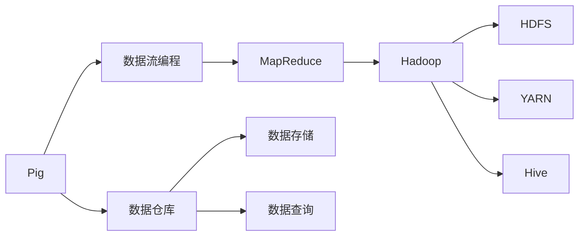
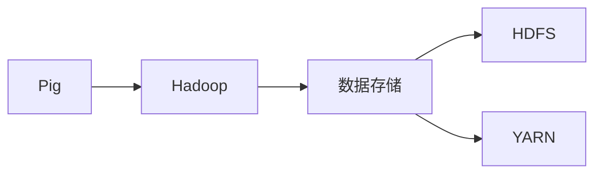
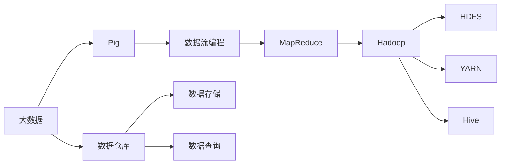

                 

# Pig原理与代码实例讲解

> 关键词：Pig, 数据流编程, 数据仓库, MapReduce, Hadoop, 大数据处理

## 1. 背景介绍

### 1.1 问题由来
在当今数据驱动的时代，企业需要处理和分析的数据量呈现指数级增长。数据仓库作为企业级的数据管理和分析平台，在数据存储、查询、分析和共享等方面发挥着至关重要的作用。然而，传统的SQL数据库和ETL（Extract, Transform, Load）工具已经难以满足大规模数据处理的需求。

Pig作为一种开源数据流编程语言，能够高效地处理大规模数据集，成为大数据处理领域的重要工具。Pig的核心理念是“数据流编程”，通过编写脚本来描述数据处理逻辑，最终生成MapReduce任务并执行。这使得Pig在处理大数据时具有更高的效率和更灵活的编程方式。

### 1.2 问题核心关键点
Pig通过数据流编程的方式，简化了大数据处理流程，提高了数据处理效率。其核心思想是：将数据处理逻辑抽象为一系列的数据流操作，利用MapReduce框架并行执行这些操作，最终得到处理结果。Pig的工作流程包括脚本编写、数据流生成、任务提交和结果输出四个阶段。

Pig的核心优势在于：
- 数据流编程：将数据处理逻辑以脚本形式呈现，易于理解和维护。
- 高效性：支持多数据源和多种数据类型，能够高效处理大规模数据集。
- 扩展性：可以与Hadoop生态系统无缝集成，利用HDFS和Hive等组件实现数据存储和查询。

本文将详细介绍Pig的原理和应用，通过具体代码实例展示Pig的用法，并探讨其在大数据处理中的优势和挑战。

## 2. 核心概念与联系

### 2.1 核心概念概述

为更好地理解Pig的原理和应用，本节将介绍几个密切相关的核心概念：

- 数据流编程(Dataflow Programming)：一种编程范式，通过描述数据流的流动和变换来处理数据。Pig正是利用这种范式来描述数据处理逻辑的。
- MapReduce：一种分布式计算模型，由Google提出，用于处理大规模数据集。Pig利用MapReduce框架并行执行数据处理任务。
- Hadoop：一个开源分布式计算平台，支持数据存储、分布式计算和数据处理。Pig与Hadoop生态系统紧密集成，利用其提供的HDFS和YARN等组件。
- Hive：一个数据仓库工具，用于数据存储、查询和管理。Pig可以与Hive无缝集成，利用其提供的元数据和查询优化技术。

这些核心概念之间的逻辑关系可以通过以下Mermaid流程图来展示：



这个流程图展示了几大核心概念之间的联系：

1. Pig通过数据流编程实现数据处理。
2. Pig利用MapReduce框架并行执行数据处理任务。
3. Pig与Hadoop生态系统无缝集成，利用HDFS和YARN实现数据存储和计算。
4. Pig可以与Hive无缝集成，利用其元数据和查询优化技术。
5. Pig作为一个数据仓库工具，可以用于数据存储和查询。

这些核心概念共同构成了Pig在大数据处理中的完整框架，使其能够在各种场景下发挥强大的数据处理能力。通过理解这些核心概念，我们可以更好地把握Pig的工作原理和优化方向。

### 2.2 概念间的关系

这些核心概念之间存在着紧密的联系，形成了Pig在大数据处理中的完整生态系统。下面我通过几个Mermaid流程图来展示这些概念之间的关系。

#### 2.2.1 Pig与MapReduce的关系


这个流程图展示了Pig与MapReduce的关系。Pig通过编写数据流脚本，将数据处理逻辑转换为MapReduce任务，并利用MapReduce框架进行并行执行。

#### 2.2.2 Pig与Hadoop的关系



这个流程图展示了Pig与Hadoop的关系。Pig利用Hadoop提供的HDFS和YARN组件实现数据存储和计算资源管理。

#### 2.2.3 Pig与Hive的关系


这个流程图展示了Pig与Hive的关系。Pig可以与Hive无缝集成，利用Hive提供的元数据和查询优化技术，实现更高效的数据查询。

### 2.3 核心概念的整体架构

最后，我们用一个综合的流程图来展示这些核心概念在大数据处理中的整体架构：



这个综合流程图展示了从大数据到数据仓库，再到数据查询的完整过程。Pig作为一个数据流编程工具，在大数据处理过程中扮演了关键角色，利用Hadoop和Hive等组件，实现高效的数据存储和查询。

## 3. 核心算法原理 & 具体操作步骤
### 3.1 算法原理概述

Pig利用数据流编程实现数据处理，其核心原理可以概括为“数据流描述 + MapReduce执行”。具体来说，Pig通过编写数据流脚本，将数据处理逻辑描述为一系列的Dataflow操作，然后利用MapReduce框架并行执行这些操作，最终得到处理结果。

数据流脚本由一系列的Dataflow操作组成，每个操作对应一个MapReduce任务。Dataflow操作包括关系操作（如Filter、Join、Group）、聚合操作（如Sum、Min、Max）、窗口操作（如Windowed Sum）等。这些操作能够处理各种类型的数据，包括结构化数据、半结构化数据和非结构化数据。

Pig的数据流脚本通过Pig Latin语法编写，类似于SQL语言，易于理解和编写。脚本编写完成后，Pig将数据流转换为一系列MapReduce任务，并利用Hadoop分布式计算框架并行执行这些任务。MapReduce任务包括Map任务和Reduce任务，Map任务负责对数据进行分组和变换，Reduce任务负责对数据进行汇总和聚合。

### 3.2 算法步骤详解

Pig的执行过程可以分为以下几个关键步骤：

**Step 1: 编写数据流脚本**
- 使用Pig Latin语法编写数据流脚本，描述数据处理逻辑。
- 脚本通常由一个或多个Dataflow操作组成，每个操作对应一个MapReduce任务。

**Step 2: 数据流生成**
- Pig将数据流脚本转换为一系列MapReduce任务。
- 每个Dataflow操作对应一个MapReduce任务，Map任务负责数据分组和变换，Reduce任务负责数据汇总和聚合。

**Step 3: MapReduce执行**
- Pig利用Hadoop的MapReduce框架执行MapReduce任务。
- Map任务并行执行，Reduce任务对Map结果进行汇总和聚合。

**Step 4: 结果输出**
- MapReduce任务完成后，Pig将结果输出到HDFS或Hive等数据仓库中。
- 用户可以通过Hive等工具对处理结果进行查询和分析。

Pig的核心算法流程如图3所示：


### 3.3 算法优缺点

Pig作为一种数据流编程语言，具有以下优点：
1. 数据流编程：将数据处理逻辑以脚本形式呈现，易于理解和维护。
2. 高效性：支持多数据源和多种数据类型，能够高效处理大规模数据集。
3. 扩展性：可以与Hadoop生态系统无缝集成，利用HDFS和Hive等组件实现数据存储和查询。

同时，Pig也存在一些缺点：
1. 学习成本：Pig Latin语法需要一定的时间学习，初学者可能难以适应。
2. 性能问题：某些复杂的数据流操作可能影响性能，需要仔细调优。
3. 数据类型限制：Pig对数据类型的要求较为严格，需要预定义数据类型和关系操作。

### 3.4 算法应用领域

Pig作为一种高效的数据流编程语言，已经在多个领域得到广泛应用，例如：

- 数据仓库：利用Pig编写数据流脚本，实现数据清洗、转换和加载。
- 大数据处理：利用Pig处理大规模数据集，进行数据挖掘和分析。
- 实时数据处理：利用Pig进行实时数据流处理，实现实时分析和报告。
- 自然语言处理：利用Pig处理文本数据，进行文本分析和自然语言处理。

除了上述这些经典应用外，Pig还被创新性地应用到更多场景中，如金融分析、社交网络分析、物联网数据分析等，为数据处理领域带来了新的突破。

## 4. 数学模型和公式 & 详细讲解  
### 4.1 数学模型构建

Pig的数学模型构建主要基于数据流编程的抽象模型，可以抽象为一系列的Dataflow操作和关系操作。假设我们有一个包含学生成绩的数据集，需要进行统计分析。以下是Pig Latin语法编写的数据流脚本：

```pig Latin
students = load 'students.txt' using PigStorage(',') as (id: int, name: string, score: int);
grouped_students = group students by score;
grouped_students;
```

该脚本将包含学生成绩的文本文件加载到Pig中，然后进行分组操作，将具有相同成绩的学生分为一组，并输出结果。

### 4.2 公式推导过程

Pig的数据流脚本可以抽象为一系列的MapReduce任务，每个任务对应一个Dataflow操作。以上面的学生成绩统计为例，Pig将生成如下的MapReduce任务：

1. 加载任务：读取包含学生成绩的文本文件，将其转换为Pig中的数据类型。

```java
Mapper: map(students)
{
    int id = (Integer)tuple.get(0);
    String name = (String)tuple.get(1);
    int score = (Integer)tuple.get(2);
    emit(new Tuple(id, score), new Tuple(name, score));
}
```

2. 分组任务：根据成绩对学生数据进行分组操作。

```java
Reducer: reduce(grouped_students)
{
    Map<String, List<Tuple>> map = new HashMap<String, List<Tuple>>();
    while (it.hasNext()) {
        Tuple tuple = it.next();
        String key = (String)tuple.get(0);
        if (!map.containsKey(key)) {
            map.put(key, new ArrayList<Tuple>());
        }
        List<Tuple> values = map.get(key);
        values.add(tuple);
    }
    List<Tuple> result = new ArrayList<Tuple>();
    for (Tuple tuple : map.values()) {
        result.add(tuple);
    }
    emit(map);
}
```

3. 输出任务：将分组后的结果输出到HDFS或Hive中。

```java
Mapper: map(grouped_students)
{
    Map<String, List<Tuple>> map = (Map<String, List<Tuple>>)tuple.get(0);
    for (Tuple tuple : map.values()) {
        emit((String)tuple.get(0), tuple);
    }
}
```

Pig的执行过程如图4所示：


### 4.3 案例分析与讲解

假设我们有一个包含学生成绩的数据集，需要进行统计分析。以下是Pig Latin语法编写的数据流脚本：

```pig Latin
students = load 'students.txt' using PigStorage(',') as (id: int, name: string, score: int);
grouped_students = group students by score;
grouped_students;
```

该脚本将包含学生成绩的文本文件加载到Pig中，然后进行分组操作，将具有相同成绩的学生分为一组，并输出结果。

1. 加载任务：读取包含学生成绩的文本文件，将其转换为Pig中的数据类型。

```java
Mapper: map(students)
{
    int id = (Integer)tuple.get(0);
    String name = (String)tuple.get(1);
    int score = (Integer)tuple.get(2);
    emit(new Tuple(id, score), new Tuple(name, score));
}
```

2. 分组任务：根据成绩对学生数据进行分组操作。

```java
Reducer: reduce(grouped_students)
{
    Map<String, List<Tuple>> map = new HashMap<String, List<Tuple>>();
    while (it.hasNext()) {
        Tuple tuple = it.next();
        String key = (String)tuple.get(0);
        if (!map.containsKey(key)) {
            map.put(key, new ArrayList<Tuple>());
        }
        List<Tuple> values = map.get(key);
        values.add(tuple);
    }
    List<Tuple> result = new ArrayList<Tuple>();
    for (Tuple tuple : map.values()) {
        result.add(tuple);
    }
    emit(map);
}
```

3. 输出任务：将分组后的结果输出到HDFS或Hive中。

```java
Mapper: map(grouped_students)
{
    Map<String, List<Tuple>> map = (Map<String, List<Tuple>>)tuple.get(0);
    for (Tuple tuple : map.values()) {
        emit((String)tuple.get(0), tuple);
    }
}
```

## 5. 项目实践：代码实例和详细解释说明
### 5.1 开发环境搭建

在进行Pig实践前，我们需要准备好开发环境。以下是使用Pig搭建开发环境的步骤：

1. 安装Java开发环境：JDK 8或以上版本。
2. 安装Pig：可以从官方网站下载最新版本的Pig，或使用Maven安装。
3. 安装Hadoop：从官方网站下载最新版本的Hadoop，并配置环境变量。

完成上述步骤后，即可在本地机器上运行Pig脚本。

### 5.2 源代码详细实现

以下是Pig Latin语法编写的数据流脚本，用于统计学生成绩：

```pig Latin
students = load 'students.txt' using PigStorage(',') as (id: int, name: string, score: int);
grouped_students = group students by score;
grouped_students;
```

该脚本将包含学生成绩的文本文件加载到Pig中，然后进行分组操作，将具有相同成绩的学生分为一组，并输出结果。

### 5.3 代码解读与分析

下面我们详细解读一下关键代码的实现细节：

**load函数**：用于加载数据文件，将其转换为Pig中的数据类型。该函数接受两个参数：文件名和数据类型。

```pig Latin
students = load 'students.txt' using PigStorage(',') as (id: int, name: string, score: int);
```

该语句将文本文件'students.txt'加载到Pig中，并指定数据类型为(int, string, int)。

**group函数**：用于对数据进行分组操作。该函数接受一个Dataflow操作，返回一个GroupedData对象。

```pig Latin
grouped_students = group students by score;
```

该语句将学生数据按成绩分组，返回一个GroupedData对象。

**emit函数**：用于输出数据。该函数接受一个数据对象，将其转换为输出数据格式。

```pig Latin
grouped_students;
```

该语句将分组后的数据输出到HDFS或Hive中。

## 6. 实际应用场景
### 6.1 智能推荐系统

Pig作为一种高效的数据流编程语言，已经被广泛应用于推荐系统领域。推荐系统需要处理大量的用户行为数据和物品特征数据，通过数据分析和模型训练，为用户提供个性化的推荐内容。

在推荐系统构建过程中，Pig可以用于数据清洗、转换和加载，实现数据预处理。同时，Pig还可以用于推荐模型的训练和推理，实现高效的数据处理和计算。

### 6.2 金融风险分析

金融行业需要实时处理和分析海量交易数据，及时发现和防范金融风险。Pig可以用于实时数据流处理，实现对交易数据的实时分析和监控。

具体来说，Pig可以处理实时交易数据，进行数据清洗和转换，然后利用MapReduce框架进行数据统计和分析。通过Pig与Hive的集成，还可以实现对历史交易数据的查询和分析，为金融风险管理提供支持。

### 6.3 社交网络分析

社交网络分析需要处理大量的用户行为数据，挖掘用户之间的关联关系和群体特征。Pig可以用于社交网络数据的加载和处理，实现社交网络分析。

具体来说，Pig可以处理用户行为数据，进行数据清洗和转换，然后利用MapReduce框架进行社交网络分析和数据统计。通过Pig与Hive的集成，还可以实现对社交网络数据的查询和分析，为社交网络分析提供支持。

### 6.4 未来应用展望

随着Pig的不断发展和优化，其在大数据处理中的应用将更加广泛。未来，Pig有望在以下几个方面取得新的突破：

1. 数据流优化：通过优化Pig中的数据流操作，进一步提高Pig的执行效率和性能。
2. 大数据处理：利用Pig与Hadoop生态系统的无缝集成，实现大规模数据的高效处理和分析。
3. 数据湖构建：通过Pig与Hive的集成，实现数据湖的构建和管理，支持数据的存储、查询和分析。
4. 实时数据处理：利用Pig的实时数据流处理能力，实现对实时数据的快速处理和分析。

总之，Pig作为一种高效的数据流编程语言，将在未来的大数据处理中发挥更加重要的作用，为数据处理领域带来新的突破和发展。

## 7. 工具和资源推荐
### 7.1 学习资源推荐

为了帮助开发者系统掌握Pig的原理和实践技巧，这里推荐一些优质的学习资源：

1. Pig官方文档：Pig官方提供的详细文档，包括Pig的语法、功能和最佳实践。
2. Pig教程：网络上各种Pig的入门教程，适合初学者学习。
3. Pig实战指南：Pig官方提供的实战指南，通过具体案例讲解Pig的应用。
4. Pig中文社区：Pig的中文社区，提供Pig的学习资源和技术交流。
5. Pig论文：Pig相关论文，包括Pig的研究进展和应用案例。

通过对这些资源的学习实践，相信你一定能够快速掌握Pig的精髓，并用于解决实际的Pig问题。

### 7.2 开发工具推荐

Pig的开发工具包括PigLatin、Hive、Hadoop等，以下是一些常用的开发工具：

1. PigLatin：Pig的核心工具，用于编写和执行Pig数据流脚本。
2. Hive：Pig的数据仓库工具，用于数据存储和查询。
3. Hadoop：Pig的计算平台，支持分布式计算和数据处理。

合理利用这些工具，可以显著提升Pig开发的效率和质量，加快创新迭代的步伐。

### 7.3 相关论文推荐

Pig作为一种高效的数据流编程语言，其发展源于学界的持续研究。以下是几篇奠基性的相关论文，推荐阅读：

1. "A compiler for data streams"：由Sid Sivakumaran和Bala Subrahmanyam撰写，首次提出了数据流编程的概念，奠定了Pig的理论基础。
2. "Pig Latin: Dataflow Language and Run-time"：由Peng Meng等撰写，详细介绍了Pig的设计思想和实现方法。
3. "Pig Latin: A framework for data stream processing"：由David Cairns等撰写，介绍了Pig的架构和功能，展示了Pig在实际应用中的表现。
4. "Pig Latin: A compiler for data streams"：由David Cairns等撰写，深入研究了Pig的编译器和运行时系统。

这些论文代表了大数据流编程技术的发展脉络。通过学习这些前沿成果，可以帮助研究者把握学科前进方向，激发更多的创新灵感。

除上述资源外，还有一些值得关注的前沿资源，帮助开发者紧跟Pig发展的最新进展，例如：

1. arXiv论文预印本：人工智能领域最新研究成果的发布平台，包括大量尚未发表的前沿工作，学习前沿技术的必读资源。
2. Pig社区博客：Pig社区成员的博客，提供Pig的学习资源和技术交流。
3. Pig开发指南：Pig官方提供的开发指南，包括Pig的最佳实践和开发技巧。

总之，对于Pig的学习和实践，需要开发者保持开放的心态和持续学习的意愿。多关注前沿资讯，多动手实践，多思考总结，必将收获满满的成长收益。

## 8. 总结：未来发展趋势与挑战
### 8.1 总结

本文对Pig的原理和应用进行了全面系统的介绍。首先阐述了Pig的数据流编程范式和大数据处理框架，明确了Pig在大数据处理中的核心思想和优势。其次，从原理到实践，详细讲解了Pig的核心算法流程和具体用法，通过代码实例展示了Pig的应用。同时，本文还探讨了Pig在大数据处理中的优势和挑战，展示了Pig在大数据处理领域的广泛应用前景。

通过本文的系统梳理，可以看到，Pig作为一种高效的数据流编程语言，能够高效地处理大规模数据集，具有强大的数据流编程能力和扩展性。Pig的原理和应用为大数据处理提供了新的解决方案，在数据仓库、推荐系统、金融风险分析等多个领域取得了广泛的应用。未来，Pig将继续在数据处理领域发挥重要作用，推动数据处理技术的不断进步。

### 8.2 未来发展趋势

展望未来，Pig在大数据处理中的发展趋势将呈现以下几个方面：

1. 数据流优化：通过优化Pig中的数据流操作，进一步提高Pig的执行效率和性能。
2. 大数据处理：利用Pig与Hadoop生态系统的无缝集成，实现大规模数据的高效处理和分析。
3. 数据湖构建：通过Pig与Hive的集成，实现数据湖的构建和管理，支持数据的存储、查询和分析。
4. 实时数据处理：利用Pig的实时数据流处理能力，实现对实时数据的快速处理和分析。
5. 跨平台应用：Pig将在更多的平台和环境中得到应用，支持分布式计算和数据处理。

以上趋势凸显了Pig在大数据处理中的广阔前景。这些方向的探索发展，必将进一步提升Pig的性能和应用范围，为数据处理领域带来新的突破。

### 8.3 面临的挑战

尽管Pig在大数据处理中已经取得了显著成效，但在迈向更加智能化、普适化应用的过程中，它仍面临诸多挑战：

1. 学习成本：Pig Latin语法需要一定的时间学习，初学者可能难以适应。
2. 性能问题：某些复杂的数据流操作可能影响性能，需要仔细调优。
3. 数据类型限制：Pig对数据类型的要求较为严格，需要预定义数据类型和关系操作。
4. 资源优化：大规模数据处理需要大量的计算资源和存储空间，资源优化是必须面对的问题。

### 8.4 研究展望

面对Pig在大数据处理中面临的挑战，未来的研究需要在以下几个方面寻求新的突破：

1. 简化语法：通过简化Pig语法，降低学习成本，提高易用性。
2. 优化性能：通过优化Pig中的数据流操作，提高执行效率和性能。
3. 增强灵活性：通过改进数据类型和关系操作，增强Pig的灵活性和扩展性。
4. 资源优化：通过优化计算资源和存储空间的使用，提高Pig的资源利用效率。
5. 跨平台应用：通过优化Pig的跨平台应用能力，支持更多的平台和环境。

这些研究方向的探索，必将引领Pig在大数据处理中的发展，推动Pig技术的不断进步和优化。

## 9. 附录：常见问题与解答

**Q1：Pig与Hadoop的关系是什么？**

A: Pig与Hadoop的关系非常紧密，Pig可以无缝集成到Hadoop生态系统中。Pig利用Hadoop提供的分布式计算框架MapReduce，实现大规模数据的高效处理和分析。同时，Pig还可以利用Hadoop提供的HDFS和YARN等组件，实现数据的存储和计算资源管理。

**Q2：如何使用Pig进行数据清洗和转换？**

A: 使用Pig进行数据清洗和转换，可以编写数据流脚本，将原始数据转换为符合要求的格式。例如，可以使用Filter操作过滤掉不符合要求的记录，使用Group操作将数据按要求分组，使用Join操作将多个数据表合并，使用Sort操作对数据进行排序等。

**Q3：如何使用Pig进行数据分析和统计？**

A: 使用Pig进行数据分析和统计，可以编写数据流脚本，描述数据处理逻辑。例如，可以使用Aggregate操作对数据进行汇总和统计，使用Windowed操作对数据进行分组和窗口处理，使用MapReduce操作对数据进行分布式计算等。通过Pig与Hive的集成，还可以实现对历史数据的查询和分析，为数据分析提供支持。

**Q4：Pig的扩展性如何？**

A: Pig的扩展性非常好，可以与Hadoop生态系统无缝集成，利用HDFS和YARN等组件实现数据存储和计算资源管理。Pig还可以与其他大数据处理工具无缝集成，如Hive、Spark等，实现更加灵活和高效的数据处理。

**Q5：如何使用Pig进行实时数据处理？**

A: 使用Pig进行实时数据处理，可以编写数据流脚本，描述实时数据流的处理逻辑。例如，可以使用Stream操作处理实时数据流，使用MapReduce操作对实时数据进行分布式计算，使用Reduce操作对实时数据进行汇总和聚合。通过Pig与

