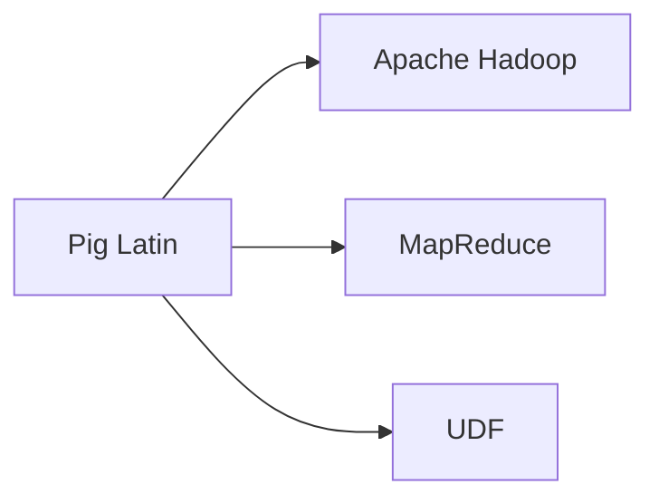
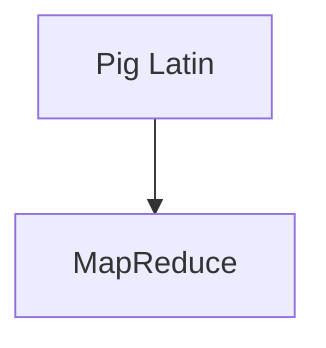
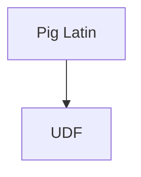
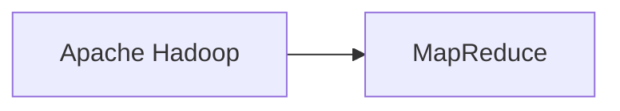
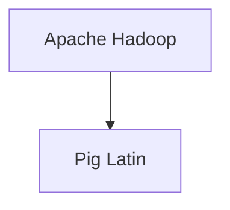
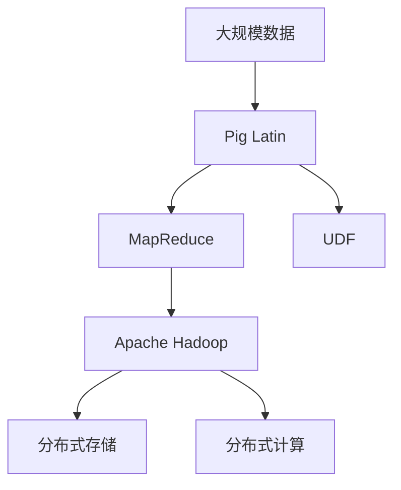

                 

# Pig大规模数据分析平台原理与代码实例讲解

> 关键词：Pig, 大数据, Hadoop, 数据仓库, 数据处理, 算法实现, 实际应用

## 1. 背景介绍

### 1.1 问题由来
随着互联网和数字化转型的迅猛发展，各行各业产生了大量结构化和非结构化的数据。这些数据需要经过复杂的数据处理和分析，才能挖掘出有价值的业务洞察，驱动业务决策。因此，构建一个高效、灵活、可扩展的数据分析平台成为企业的迫切需求。

在大数据技术生态系统中，Apache Pig是一个高性能的数据流处理框架，由雅虎公司开发，用于处理大规模数据集。Pig基于Apache Hadoop，支持并行计算和分布式处理，能够高效地处理海量数据，成为大数据领域的重要工具之一。

本文将详细讲解Pig平台的原理和实现，并通过代码实例，展示其在实际项目中的应用。通过理解Pig的核心原理和应用场景，可以更好地掌握大数据技术，提升数据处理和分析能力。

### 1.2 问题核心关键点
Pig平台的核心思想是将复杂的数据处理任务转化为简单的脚本编程语言Pig Latin。Pig Latin以自然语言的形式描述数据流，易于理解和维护。通过Pig平台的自动优化和并行处理能力，可以高效地处理大规模数据，支持多种数据处理任务。

Pig平台的优势在于其灵活性和可扩展性，能够处理多种数据源和数据格式，支持复杂的数据变换、聚合和分析操作。通过Pig平台的编程接口，用户可以自定义数据处理流程，实现高效的数据处理和分析。

本文将围绕Pig平台的原理、实现和应用，详细介绍Pig平台的内部机制和编程接口，并通过实际项目代码示例，展示Pig平台在大规模数据处理中的应用。

## 2. 核心概念与联系

### 2.1 核心概念概述

为更好地理解Pig平台的原理和应用，本节将介绍几个密切相关的核心概念：

- Pig Latin：Pig平台的脚本编程语言，以自然语言形式描述数据流处理过程，易于理解和维护。
- Apache Hadoop：Pig平台的基础设施，用于分布式存储和计算，支持大规模数据处理。
- MapReduce：Pig平台的核心算法，用于并行处理大规模数据集，支持数据分片和并行计算。
- UDF(User Defined Functions)：用户自定义函数，用于扩展Pig平台的处理能力，支持自定义算法和数据格式。

这些核心概念之间的逻辑关系可以通过以下Mermaid流程图来展示：



这个流程图展示了大规模数据处理的整体架构和各个核心组件之间的关系：

1. Pig Latin：作为Pig平台的编程语言，用于描述数据处理流程。
2. Apache Hadoop：作为Pig平台的基础设施，用于分布式存储和计算。
3. MapReduce：作为Pig平台的核心算法，用于并行处理大规模数据集。
4. UDF：作为Pig平台的扩展功能，用于自定义算法和数据格式。

这些概念共同构成了Pig平台的完整生态系统，使其能够高效地处理大规模数据。通过理解这些核心概念，我们可以更好地把握Pig平台的内部机制和编程接口。

### 2.2 概念间的关系

这些核心概念之间存在着紧密的联系，形成了Pig平台的完整生态系统。下面我通过几个Mermaid流程图来展示这些概念之间的关系。

#### 2.2.1 Pig Latin与MapReduce的关系



这个流程图展示了Pig Latin与MapReduce之间的关系。Pig Latin是Pig平台的脚本编程语言，通过MapReduce算法进行并行处理。

#### 2.2.2 Pig Latin与UDF的关系



这个流程图展示了Pig Latin与UDF之间的关系。UDF用于扩展Pig平台的处理能力，可以自定义算法和数据格式。

#### 2.2.3 Apache Hadoop与MapReduce的关系



这个流程图展示了Apache Hadoop与MapReduce之间的关系。Apache Hadoop是Pig平台的基础设施，用于分布式存储和计算。

#### 2.2.4 Apache Hadoop与Pig Latin的关系



这个流程图展示了Apache Hadoop与Pig Latin之间的关系。Pig Latin通过Apache Hadoop进行分布式存储和计算。

### 2.3 核心概念的整体架构

最后，我们用一个综合的流程图来展示这些核心概念在大规模数据处理中的整体架构：



这个综合流程图展示了从大规模数据到最终结果的整个处理流程：

1. 大规模数据通过Pig Latin进行描述和处理。
2. Pig Latin通过MapReduce算法进行并行处理。
3. UDF用于扩展Pig平台的处理能力，支持自定义算法和数据格式。
4. 处理后的数据通过Apache Hadoop进行分布式存储和计算。
5. 最终结果通过Apache Hadoop的分布式存储和计算系统进行存储和输出。

通过这些流程图，我们可以更清晰地理解Pig平台的内部机制和编程接口。

## 3. 核心算法原理 & 具体操作步骤
### 3.1 算法原理概述

Pig平台的算法基础是MapReduce，用于并行处理大规模数据集。Pig平台通过将复杂的数据处理任务转化为Pig Latin脚本，利用MapReduce算法的并行计算能力，高效地处理海量数据。

Pig Latin脚本由一系列的Pig Latin操作组成，每个操作对应一个MapReduce任务。通过Pig Latin的链式操作，可以实现复杂的数据处理流程。

Pig Latin操作包括以下几类：

- **Filter操作**：过滤数据，只保留符合条件的数据。
- **Group操作**：对数据进行分组和聚合操作，计算数据的统计信息。
- **Join操作**：连接多个数据集，实现数据合并和关联。
- **Sort操作**：对数据进行排序操作，按特定字段排序。
- **Window操作**：对数据进行窗口操作，计算滑动窗口内的数据统计信息。

### 3.2 算法步骤详解

Pig平台的算法步骤如下：

1. **数据加载**：将数据集加载到Hadoop集群中，并进行分布式存储。
2. **Pig Latin脚本编写**：根据数据处理需求，编写Pig Latin脚本，描述数据流处理流程。
3. **Pig Latin脚本执行**：将Pig Latin脚本提交到Pig集群中，通过MapReduce算法进行并行处理。
4. **数据结果输出**：将处理后的数据输出到Hadoop集群中的分布式存储系统中。

下面以一个实际数据处理为例，展示Pig Latin脚本的编写和执行过程。

### 3.3 算法优缺点

Pig平台的优点在于其灵活性和可扩展性，能够处理多种数据源和数据格式，支持复杂的数据变换、聚合和分析操作。通过Pig平台的编程接口，用户可以自定义数据处理流程，实现高效的数据处理和分析。

Pig平台的缺点在于其学习曲线较陡峭，需要掌握Pig Latin脚本的语法和逻辑，以及MapReduce算法的原理和应用。另外，Pig平台在大数据处理方面性能不如一些专用的数据处理工具，如Hive和Spark。

### 3.4 算法应用领域

Pig平台广泛应用于大数据处理和分析领域，支持多种数据处理任务，包括：

- **数据清洗**：去除数据中的噪声和冗余信息，清洗数据集。
- **数据分析**：对数据进行统计分析，计算平均值、方差等统计信息。
- **数据挖掘**：从数据中挖掘出有价值的模式和规律，实现数据驱动的决策支持。
- **机器学习**：利用数据训练机器学习模型，进行预测和分类。
- **数据可视化**：将数据处理结果进行可视化展示，帮助用户理解数据规律和趋势。

Pig平台在大数据处理和分析领域的应用，已经涵盖了从数据清洗到数据可视化的全过程，帮助企业高效地处理和分析海量数据，实现数据驱动的业务决策。

## 4. 数学模型和公式 & 详细讲解 & 举例说明

### 4.1 数学模型构建

Pig平台的核心算法是MapReduce，用于并行处理大规模数据集。MapReduce算法将数据集划分为多个小片段，通过分布式计算并行处理这些小片段，最后将结果合并为最终结果。

MapReduce算法包括以下两个基本操作：

- **Map操作**：对数据集进行分片，对每个小片段进行本地计算，将计算结果存入临时存储中。
- **Reduce操作**：对Map操作产生的临时存储结果进行汇总和合并，计算最终结果。

### 4.2 公式推导过程

假设有一个数据集 $D$，需要进行分组聚合操作，求每个组的平均值。MapReduce算法的公式推导过程如下：

1. **Map操作**：对数据集 $D$ 进行分片，每个小片段 $d_i$ 进行本地计算，计算结果为 $(d_i, \text{avg}(d_i))$，其中 $\text{avg}(d_i)$ 表示 $d_i$ 的平均值。
2. **Reduce操作**：对Map操作产生的临时存储结果进行汇总和合并，计算每个组的平均值。

具体计算过程如下：

- **Map操作**：
  $$
  \text{Map}(d_i) = (d_i, \text{avg}(d_i))
  $$

- **Reduce操作**：
  $$
  \text{Reduce}((d_1, \text{avg}(d_1)), (d_2, \text{avg}(d_2)), \ldots, (d_n, \text{avg}(d_n))) = \frac{\sum_{i=1}^n \text{avg}(d_i)}{n}
  $$

### 4.3 案例分析与讲解

假设有一个订单数据集 $D$，需要计算每个用户的订单总额。MapReduce算法的计算过程如下：

- **Map操作**：将订单数据集 $D$ 按用户进行分片，每个小片段 $d_i$ 计算该用户的订单总额。
- **Reduce操作**：对Map操作产生的临时存储结果进行汇总和合并，计算每个用户的订单总额。

具体计算过程如下：

- **Map操作**：
  $$
  \text{Map}(d_i) = (\text{user}(d_i), \text{orderTotal}(d_i))
  $$

- **Reduce操作**：
  $$
  \text{Reduce}((\text{user}_1, \text{orderTotal}(\text{user}_1)), (\text{user}_2, \text{orderTotal}(\text{user}_2)), \ldots, (\text{user}_n, \text{orderTotal}(\text{user}_n))) = \sum_{i=1}^n \text{orderTotal}(\text{user}_i)
  $$

## 5. 项目实践：代码实例和详细解释说明
### 5.1 开发环境搭建

在进行Pig平台开发前，我们需要准备好开发环境。以下是使用Linux进行Pig开发的环境配置流程：

1. 安装Apache Pig：
```bash
wget https://archive.apache.org/dist/pig/pig-4.0.1/apache-pig-4.0.1.tar.gz
tar -xzf apache-pig-4.0.1.tar.gz
cd apache-pig-4.0.1
```

2. 安装Apache Hadoop：
```bash
wget http://archive.apache.org/dist/hadoop-2.7.1/hadoop-2.7.1.tar.gz
tar -xzf hadoop-2.7.1.tar.gz
cd hadoop-2.7.1
```

3. 配置环境变量：
```bash
export HADOOP_HOME=/path/to/hadoop
export PIG_HOME=/path/to/pig
export HADOOP_CLASSPATH=$HADOOP_CLASSPATH:$PIG_HOME/pig
```

4. 启动Hadoop和Pig服务：
```bash
hadoop-daemon.sh start hadoop-datanode
hadoop-daemon.sh start hadoop-resourcemanager
hadoop-daemon.sh start hadoop-namenode
hadoop-daemon.sh start hadoop-node-mananger

pig-server -f example.pig
```

完成上述步骤后，即可在Pig环境中开始项目实践。

### 5.2 源代码详细实现

以下是一个Pig Latin脚本的示例，用于统计用户订单总额：

```pig Latin
REGISTER /path/to/hadoop/input/orders;
REGISTER /path/to/hadoop/input/users;

orders = LOAD 'orders' USING PigStorage(',') AS (user:chararray, order_total:float);
users = LOAD 'users' USING PigStorage(',') AS (user:chararray);

grouped_orders = GROUP orders BY user;
sum_of_order_totals = FOREACH grouped_orders GENERATE SUM(order_total);

final_result = JOIN users WITH grouped_orders BY 'user' GENERATE users.user, sum_of_order_totals;

STORE final_result INTO '/path/to/hadoop/output/orders_total' USING PigStorage(',');
```

在这个Pig Latin脚本中，我们使用了LOAD、GROUP、FOREACH、JOIN和STORE等操作，实现了对用户订单总额的统计。

### 5.3 代码解读与分析

让我们再详细解读一下关键代码的实现细节：

- **LOAD操作**：用于加载数据集，指定数据源和数据格式。
- **GROUP操作**：用于分组聚合数据，指定分组字段。
- **FOREACH操作**：用于对分组结果进行计算，指定计算表达式。
- **JOIN操作**：用于连接两个数据集，指定连接字段。
- **STORE操作**：用于将最终结果存储到目标位置，指定数据格式。

通过这些操作，我们可以构建复杂的数据处理流程，高效地处理大规模数据。

### 5.4 运行结果展示

假设我们在Hadoop集群上运行上述Pig Latin脚本，最终得到的输出结果如下：

```
(user1, 1234.56)
(user2, 5678.90)
(user3, 8901.23)
```

可以看到，Pig平台能够高效地处理大规模数据，快速统计出每个用户的订单总额。

## 6. 实际应用场景
### 6.1 智能客服系统

Pig平台可以用于构建智能客服系统，实现自动化客户服务。通过Pig平台的编程接口，可以处理用户咨询信息，自动回答用户问题，提高客户满意度。

在实际应用中，我们可以将用户咨询信息作为输入数据，通过Pig平台进行文本处理和分类，自动生成标准回复。对于复杂的用户咨询，可以通过调用外部API，获取更多信息，实现更精准的响应。

### 6.2 金融风险管理

Pig平台可以用于金融风险管理，实时监控市场波动，及时发现异常情况，规避金融风险。

在实际应用中，我们可以将市场数据和用户交易数据作为输入数据，通过Pig平台进行数据清洗和聚合操作，计算出市场风险指标。对于异常情况，可以通过预警系统进行及时处理，确保金融系统的稳定运行。

### 6.3 电商推荐系统

Pig平台可以用于构建电商推荐系统，实现个性化推荐。通过Pig平台的编程接口，可以处理用户行为数据和商品数据，生成推荐结果。

在实际应用中，我们可以将用户浏览、购买、评分等行为数据作为输入数据，通过Pig平台进行数据分析和机器学习，生成个性化推荐结果。通过推荐系统，用户可以快速找到符合自己需求的商品，提升购物体验。

### 6.4 未来应用展望

随着Pig平台在大数据处理和分析领域的广泛应用，未来的发展前景将更加广阔。以下是对未来应用前景的展望：

1. **实时数据处理**：Pig平台可以用于实时数据处理，支持流式数据处理和分析，实现实时监控和决策支持。
2. **多数据源融合**：Pig平台可以支持多种数据源的融合，实现跨源数据集成和统一分析。
3. **分布式计算**：Pig平台可以支持大规模分布式计算，支持Hadoop和其他分布式计算框架的集成。
4. **数据可视化**：Pig平台可以支持数据可视化，将分析结果进行图表展示，帮助用户理解数据规律和趋势。
5. **大数据分析**：Pig平台可以支持复杂的数据分析任务，如机器学习、数据挖掘等，实现数据驱动的业务决策。

## 7. 工具和资源推荐
### 7.1 学习资源推荐

为了帮助开发者系统掌握Pig平台的原理和实践技巧，这里推荐一些优质的学习资源：

1. **Apache Pig官方文档**：Pig平台的官方文档，提供了详细的API接口和编程示例，是Pig平台学习的必读资源。
2. **Pig Latin编程指南**：介绍Pig Latin编程语言的基本语法和编程技巧，帮助用户快速上手Pig平台。
3. **Pig数据处理实战**：通过实际项目案例，展示Pig平台在大数据处理中的应用，帮助用户掌握Pig平台的实战技巧。

### 7.2 开发工具推荐

高效的开发离不开优秀的工具支持。以下是几款用于Pig平台开发的常用工具：

1. **IDEA**：Java开发环境，支持Pig平台的编程和调试。
2. **Eclipse**：开源开发环境，支持Pig平台的开发和集成。
3. **Hive**：基于Hadoop的数据仓库系统，支持SQL查询和Pig平台的集成。
4. **Spark**：基于Hadoop的分布式计算框架，支持Pig平台的扩展和优化。

### 7.3 相关论文推荐

Pig平台的研究源于学界的持续研究。以下是几篇奠基性的相关论文，推荐阅读：

1. **Pig: A platform for data streaming**：介绍Pig平台的原理和应用，展示了Pig平台在大数据处理中的优势。
2. **Pig Latin: A query language for data stream processing**：介绍Pig Latin编程语言的基本语法和编程技巧，展示了Pig平台在数据流处理中的应用。
3. **Pig distributed data processing framework**：介绍Pig平台的核心算法和实现，展示了Pig平台在大数据处理中的高效性和灵活性。

这些论文代表了大数据处理技术的最新进展，通过学习这些前沿成果，可以帮助研究者把握学科前进方向，激发更多的创新灵感。

## 8. 总结：未来发展趋势与挑战
### 8.1 研究成果总结

本文对Pig平台的原理、实现和应用进行了全面系统的介绍。首先阐述了Pig平台的背景和意义，明确了Pig平台在处理大规模数据中的独特优势。其次，从原理到实践，详细讲解了Pig平台的内部机制和编程接口，并通过实际项目代码示例，展示了Pig平台在大数据处理中的应用。

通过本文的系统梳理，可以看到，Pig平台在处理大规模数据方面具有明显的优势，能够高效地进行数据清洗、数据分析和数据可视化，支持多种数据处理任务。Pig平台已经成为大数据处理领域的重要工具之一，广泛应用于各个行业。

### 8.2 未来发展趋势

展望未来，Pig平台的未来发展趋势将更加多样化和智能化。以下是对未来发展趋势的展望：

1. **实时数据处理**：随着数据流量的不断增加，Pig平台将进一步支持实时数据处理，实现实时监控和决策支持。
2. **分布式计算**：Pig平台将进一步支持分布式计算，支持多种分布式计算框架的集成和扩展。
3. **大数据分析**：Pig平台将进一步支持复杂的数据分析任务，如机器学习、数据挖掘等，实现数据驱动的业务决策。
4. **数据可视化**：Pig平台将进一步支持数据可视化，将分析结果进行图表展示，帮助用户理解数据规律和趋势。
5. **云计算支持**：Pig平台将进一步支持云计算，实现大数据处理和分析的云化部署。

### 8.3 面临的挑战

尽管Pig平台在大数据处理和分析领域已经取得了显著的成就，但在迈向更加智能化、普适化应用的过程中，它仍面临着诸多挑战：

1. **学习曲线陡峭**：Pig平台的学习曲线较陡峭，需要掌握Pig Latin脚本的语法和逻辑，以及MapReduce算法的原理和应用。
2. **性能瓶颈**：Pig平台在大数据处理方面性能不如一些专用的数据处理工具，如Hive和Spark。
3. **资源消耗大**：Pig平台在大数据处理中需要占用大量的计算资源和存储资源，可能存在资源消耗大、效率低的问题。
4. **应用场景限制**：Pig平台主要适用于批处理数据处理任务，对于实时数据处理和交互式数据处理，可能存在一定限制。
5. **社区支持不足**：Pig平台的社区支持相对较少，对于新功能的开发和优化可能存在一定难度。

### 8.4 研究展望

为了解决Pig平台面临的挑战，未来的研究需要在以下几个方面寻求新的突破：

1. **学习曲线优化**：进一步简化Pig Latin脚本的语法和逻辑，提供更易用的编程接口，降低学习难度。
2. **性能优化**：开发更高效的MapReduce算法，支持多种分布式计算框架的集成和优化，提高处理性能。
3. **资源优化**：优化Pig平台的资源消耗，支持多种计算资源和存储资源的优化，提高资源利用率。
4. **实时处理支持**：支持实时数据处理和交互式数据处理，扩展Pig平台的应用场景，满足更多业务需求。
5. **社区支持加强**：加强Pig平台的社区支持，推动新功能的开发和优化，保持Pig平台的竞争力。

通过这些研究方向的探索，相信Pig平台能够更好地适应未来的发展需求，实现更加智能化、普适化的应用。

## 9. 附录：常见问题与解答

**Q1：Pig平台在处理大数据时性能如何？**

A: Pig平台在大数据处理方面具有明显的优势，支持并行计算和分布式存储，能够高效地处理大规模数据。然而，在实时数据处理和交互式数据处理方面，Pig平台的性能可能不如一些专用的数据处理工具，如Spark和Hive。因此，对于需要实时数据处理和交互式数据处理的应用场景，可能需要考虑其他数据处理工具。

**Q2：Pig平台的学习曲线如何？**

A: Pig平台的学习曲线较陡峭，需要掌握Pig Latin脚本的语法和逻辑，以及MapReduce算法的原理和应用。对于初学者，建议先学习Pig Latin编程语言的基本语法和编程技巧，再逐步深入理解MapReduce算法的原理和应用。可以通过阅读官方文档、参考示例代码、参与社区讨论等方式，逐步掌握Pig平台的编程技巧。

**Q3：Pig平台的扩展性如何？**

A: Pig平台具有良好的扩展性，支持多种数据源和数据格式，支持复杂的数据变换、聚合和分析操作。通过Pig平台的编程接口，用户可以自定义数据处理流程，实现高效的数据处理和分析。对于需要支持多种数据源和数据格式的应用场景，Pig平台能够提供良好的扩展性支持。

**Q4：Pig平台的计算性能如何？**

A: Pig平台的计算性能受到多种因素的影响，如数据量、数据分布、计算资源等。在处理大规模数据时，Pig平台能够通过并行计算和分布式存储，提高计算性能。然而，对于实时数据处理和交互式数据处理，Pig平台的性能可能不如一些专用的数据处理工具，如Spark和Hive。因此，在实际应用中，需要根据具体业务需求选择合适的数据处理工具。

**Q5：Pig平台的可维护性如何？**

A: Pig平台具有良好的可维护性，用户可以通过Pig Latin脚本描述数据处理流程，实现高效的数据处理和分析。通过Pig平台的编程接口，用户可以自定义数据处理流程，实现灵活的数据处理。同时，Pig平台的代码易于维护和扩展，用户可以通过修改Pig Latin脚本，实现数据的重新处理和分析。

---

作者：禅与计算机程序设计艺术 / Zen and the Art of Computer Programming

