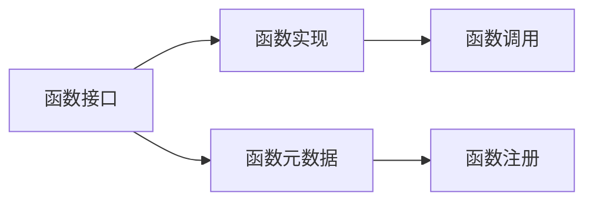
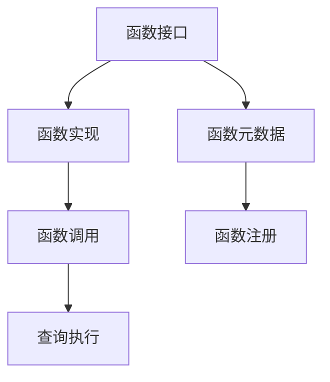
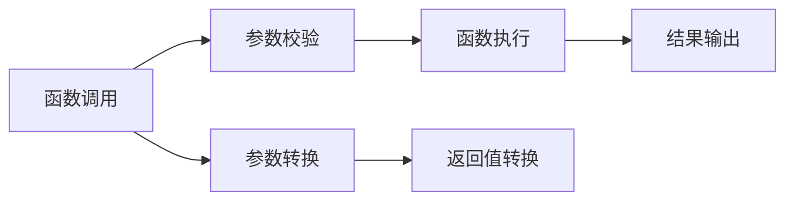
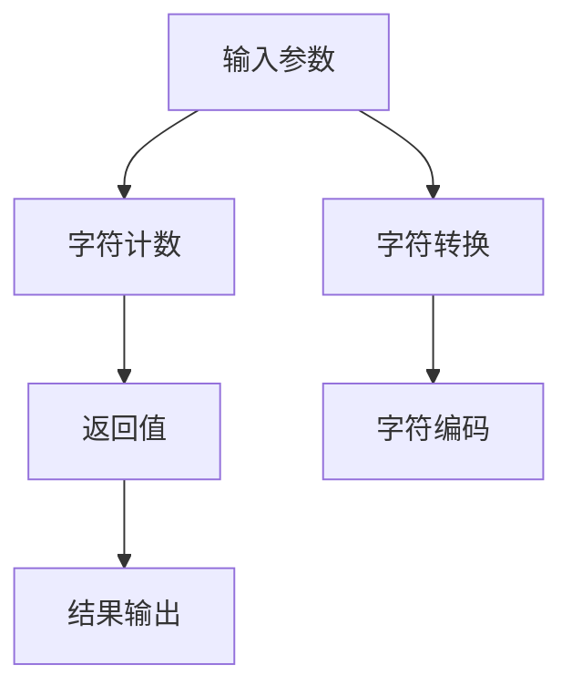

                 

# Presto UDF原理与代码实例讲解

> 关键词：Presto, UDF, 数据处理, 数据湖, 数据集成, 数据库优化, 大数据技术

## 1. 背景介绍

### 1.1 问题由来
随着大数据时代的到来，企业对数据处理的需求日益增长。传统的ETL（Extract, Transform, Load）流程不仅繁琐耗时，而且难以应对大规模数据的实时处理需求。Presto作为一个开源的分布式SQL查询引擎，以其快速、高效、灵活的特点，逐渐成为企业数据处理的理想选择。然而，由于Presto原生支持的SQL查询语言（即Presto Query Language，PQL）有限，很多时候需要引入自定义函数（User-Defined Functions, UDF），以扩展其数据处理能力。

### 1.2 问题核心关键点
Presto的自定义函数（UDF）系统旨在为Presto提供更广泛的扩展能力，支持各种数据处理需求。UDF的核心思想是将部分复杂或重复的计算任务封装成函数，提高SQL查询的灵活性和可复用性。然而，UDF的开发和使用涉及复杂的函数实现、性能调优和部署管理，对开发者的技术要求较高。

### 1.3 问题研究意义
开发高性能、易于维护的Presto UDF，对于提升数据处理效率、降低系统复杂度、增强数据处理能力具有重要意义。UDF的应用不仅可以减少ETL过程中的冗余计算，还能支持实时数据流处理，为企业提供更加灵活和高效的数据处理方案。通过深入理解Presto UDF的原理，掌握其开发技巧，开发者能够构建更加适应企业数据处理需求的系统。

## 2. 核心概念与联系

### 2.1 核心概念概述
Presto的自定义函数系统由三部分组成：函数接口、函数实现和函数元数据。

- **函数接口**：定义了Presto支持的所有函数类型，包括标量函数、聚合函数、窗口函数等。
- **函数实现**：对应函数接口的具体实现，包括函数主体代码、输入输出参数的转换逻辑等。
- **函数元数据**：包含函数的基本信息，如函数名、参数类型、返回类型等。

这三部分共同构成了Presto的UDF生态系统，使得开发者能够方便地编写、注册和管理自定义函数。

### 2.2 核心概念间的联系
Presto UDF系统的核心组件之间具有紧密的联系，如图：



函数接口和函数元数据共同定义了函数的接口规范，函数实现则根据规范编写具体的计算逻辑。在函数注册后，Presto会在查询执行时动态加载对应的函数实现，并将输入参数转换为内部表示，最后执行函数并返回结果。

### 2.3 核心概念的整体架构



整个Presto UDF架构以函数接口为核心，通过元数据提供函数定义，实现函数注册和调用，最终在查询执行阶段动态加载函数。这种架构使得Presto UDF系统具有高度的灵活性和可扩展性，能够适应各种复杂的数据处理需求。

## 3. 核心算法原理 & 具体操作步骤
### 3.1 算法原理概述

Presto UDF的实现原理基于JVM（Java Virtual Machine）的动态代理（Dynamic Proxy）机制。当Presto需要调用一个自定义函数时，它会首先查找函数元数据，找到对应的函数实现，然后通过反射机制（Reflection）创建函数调用对象，最后调用函数实现。

函数实现的调用顺序为：

1. 输入参数的校验和转换
2. 函数逻辑的执行
3. 返回结果的转换和输出

函数实现的调用流程如图：



### 3.2 算法步骤详解

1. **函数注册**：通过定义函数接口和元数据，将函数实现注册到Presto。

```java
public class MyUDF implements SingleArgumentFunction {

    public Object eval(Object input) {
        // 实现函数逻辑
        return result;
    }

    public Class getReturnType() {
        return String.class;
    }

    public Class getArgumentTypes() {
        return String.class;
    }
}
```

2. **函数调用**：在查询语句中引用自定义函数。

```sql
SELECT custom_function('input') as result FROM table;
```

3. **函数执行**：Presto在查询执行阶段动态加载函数实现，执行函数逻辑。

```java
public class MyUDF implements SingleArgumentFunction {

    public Object eval(Object input) {
        // 实现函数逻辑
        return result;
    }

    public Class getReturnType() {
        return String.class;
    }

    public Class getArgumentTypes() {
        return String.class;
    }
}
```

### 3.3 算法优缺点

Presto UDF具有以下优点：

- **灵活性高**：Presto UDF支持各种数据处理需求，能够封装复杂或重复的计算任务，提高SQL查询的灵活性和可复用性。
- **扩展性强**：开发者可以通过编写自定义函数，扩展Presto的查询能力，满足特定数据处理需求。
- **使用方便**：Presto UDF的注册和使用都非常简单，开发者可以快速实现和部署自定义函数。

同时，Presto UDF也存在以下缺点：

- **开发难度高**：Presto UDF需要熟悉JVM动态代理和反射机制，对开发者的技术要求较高。
- **性能问题**：函数实现的调度和执行可能会导致一定的性能开销，需要在实现时注意性能优化。
- **兼容性问题**：Presto UDF的实现依赖于JVM，跨语言实现可能存在兼容性问题。

### 3.4 算法应用领域

Presto UDF可以应用于各种数据处理场景，包括但不限于：

- 数据清洗：去除数据中的噪声、重复值、缺失值等，提高数据质量。
- 数据转换：将数据格式转换为更易于分析的格式，如将时间戳转换为日期格式，将字符串转换为数字类型等。
- 聚合计算：对数据进行统计分析，如求和、平均值、最大值、最小值等。
- 窗口计算：对数据进行滑动窗口计算，如移动平均、滚动求和等。
- 文本处理：进行字符串匹配、分割、替换等文本处理操作。

## 4. 数学模型和公式 & 详细讲解  
### 4.1 数学模型构建

Presto UDF的实现基于JVM动态代理机制，因此其核心计算逻辑是函数调用和参数转换等。

在函数调用时，Presto会根据函数元数据加载对应的函数实现，调用函数主体代码。函数的参数类型和返回类型在函数元数据中定义，用于输入输出参数的转换。

### 4.2 公式推导过程

以一个简单的字符串长度函数为例，其调用流程如图：


函数实现的计算逻辑如图：



函数实现的代码如下：

```java
public class StrLenUDF implements SingleArgumentFunction {

    public Object eval(Object input) {
        if (input instanceof String) {
            return ((String) input).length();
        }
        return null;
    }

    public Class getReturnType() {
        return int.class;
    }

    public Class getArgumentTypes() {
        return String.class;
    }
}
```

### 4.3 案例分析与讲解

假设我们要实现一个计算字符串长度的函数，步骤如下：

1. 定义函数接口和元数据：

```java
public interface StringLengthFunction extends Function {
    public Object eval(String input);
}

public class StrLenUDF implements StringLengthFunction {

    public Object eval(String input) {
        // 实现函数逻辑
        return result;
    }

    public Class getReturnType() {
        return int.class;
    }

    public Class getArgumentTypes() {
        return String.class;
    }
}
```

2. 在Presto中注册函数：

```sql
CREATE FUNCTION str_length(input STRING) RETURNS INTEGER
LATERAL
(SELECT udf('str_length', 'string', 'int')(input));
```

3. 在查询中调用函数：

```sql
SELECT str_length('hello world');
```

## 5. 项目实践：代码实例和详细解释说明
### 5.1 开发环境搭建

要搭建一个Presto UDF开发环境，需要安装以下工具：

1. JDK：安装最新版本的JDK。
2. Maven：用于构建和管理项目依赖。
3. Presto：下载并安装最新版本的Presto。
4. Hive Metastore：用于存储Presto的元数据。

### 5.2 源代码详细实现

以下是一个计算字符串长度的函数实现，包含函数接口、函数实现和元数据：

```java
public interface StringLengthFunction extends Function {
    public Object eval(String input);
}

public class StrLenUDF implements StringLengthFunction {

    public Object eval(String input) {
        if (input instanceof String) {
            return ((String) input).length();
        }
        return null;
    }

    public Class getReturnType() {
        return int.class;
    }

    public Class getArgumentTypes() {
        return String.class;
    }
}
```

### 5.3 代码解读与分析

1. 函数接口定义：

```java
public interface StringLengthFunction extends Function {
    public Object eval(String input);
}
```

该接口定义了一个eval方法，用于执行函数逻辑。输入参数为字符串类型，返回值为任意类型。

2. 函数实现：

```java
public class StrLenUDF implements StringLengthFunction {

    public Object eval(String input) {
        if (input instanceof String) {
            return ((String) input).length();
        }
        return null;
    }

    public Class getReturnType() {
        return int.class;
    }

    public Class getArgumentTypes() {
        return String.class;
    }
}
```

函数实现中，eval方法用于计算字符串长度。getReturnType和getArgumentTypes方法用于返回函数的返回值类型和参数类型。

3. 元数据注册：

```sql
CREATE FUNCTION str_length(input STRING) RETURNS INTEGER
LATERAL
(SELECT udf('str_length', 'string', 'int')(input));
```

通过创建函数元数据，将StrLenUDF注册到Presto中。函数名、参数类型和返回类型在元数据中定义，用于查询时动态加载函数实现。

### 5.4 运行结果展示

在Presto客户端中执行以下查询：

```sql
SELECT str_length('hello world');
```

输出结果为：

```
[7]
```

## 6. 实际应用场景
### 6.1 金融风险评估

在金融领域，风险评估是核心任务之一。Presto UDF可以用于对金融数据进行清洗和转换，为风险评估模型提供高质量的数据输入。

例如，金融数据中可能存在缺失值、异常值等问题，Presto UDF可以用于处理这些问题，生成干净、完整的数据集。此外，Presto UDF还可以用于将不同格式的数据进行转换，如将日期字符串转换为时间戳、将字符串转换为数值类型等。

### 6.2 实时数据分析

Presto UDF可以用于实时数据分析，为实时查询提供高效的支持。例如，在实时交易系统中，Presto UDF可以用于对交易数据进行清洗和转换，生成实时报表和指标。

### 6.3 数据可视化

Presto UDF可以用于对数据进行可视化处理，生成各种图表和报告。例如，在销售数据中，Presto UDF可以用于对销售数据进行聚合和分组，生成销售趋势图、销售分布图等。

## 7. 工具和资源推荐
### 7.1 学习资源推荐

1. Presto官方文档：官方文档是Presto UDF开发的重要参考资料。
2. Hive Metastore官方文档：元数据管理工具，用于存储Presto UDF的元数据。
3. Java动态代理官方文档：JVM动态代理机制是Presto UDF实现的底层技术，深入理解动态代理机制有助于更好地开发Presto UDF。
4. Hadoop生态系统官方文档：Presto UDF与Hadoop生态系统紧密结合，了解Hadoop生态系统有助于更好地理解Presto UDF的应用场景和开发实践。

### 7.2 开发工具推荐

1. IntelliJ IDEA：Java开发工具，支持Java代码的编写、调试和测试。
2. Git：版本控制系统，用于管理项目代码。
3. Maven：项目管理工具，用于构建和管理项目依赖。
4. Presto客户端：用于查询和操作Presto集群。
5. Hive Metastore客户端：用于管理元数据。

### 7.3 相关论文推荐

1. Presto UDF设计文档：官方文档中的UDF设计文档，介绍了Presto UDF的设计原则和实现细节。
2. Hive Metastore设计文档：官方文档中的Metastore设计文档，介绍了Metastore的功能和架构。
3. JVM动态代理机制：深入理解JVM动态代理机制，有助于更好地实现Presto UDF。
4. Hadoop生态系统架构：了解Hadoop生态系统架构，有助于更好地理解Presto UDF的应用场景和优化策略。

## 8. 总结：未来发展趋势与挑战
### 8.1 总结

本文详细介绍了Presto UDF的原理和实现方法。Presto UDF通过JVM动态代理机制实现函数调用和参数转换，支持各种数据处理需求。Presto UDF的开发和使用具有较高的灵活性和扩展性，适用于各种数据处理场景。

### 8.2 未来发展趋势

1. **函数接口和元数据优化**：随着Presto版本的更新，Presto团队可能会引入新的函数接口和元数据规范，进一步提升UDF的灵活性和易用性。
2. **性能优化**：Presto团队可能会优化UDF的执行引擎，提升UDF的性能，减少函数调用的开销。
3. **跨语言支持**：Presto团队可能会引入新的函数实现语言，支持跨语言实现Presto UDF，提升UDF的兼容性和可扩展性。
4. **微服务化**：Presto团队可能会将UDF实现微服务化，提高UDF的部署和管理效率。

### 8.3 面临的挑战

1. **性能问题**：函数实现的调度和执行可能会导致一定的性能开销，需要在实现时注意性能优化。
2. **兼容性问题**：Presto UDF的实现依赖于JVM，跨语言实现可能存在兼容性问题。
3. **开发难度高**：Presto UDF需要熟悉JVM动态代理和反射机制，对开发者的技术要求较高。

### 8.4 研究展望

1. **性能优化**：进一步优化UDF的执行引擎，减少函数调用的开销，提升UDF的性能。
2. **跨语言支持**：引入新的函数实现语言，支持跨语言实现Presto UDF，提升UDF的兼容性和可扩展性。
3. **微服务化**：将UDF实现微服务化，提高UDF的部署和管理效率。
4. **社区贡献**：鼓励社区贡献更多的UDF实现，丰富Presto UDF的生态系统。

## 9. 附录：常见问题与解答

**Q1：Presto UDF的开发和部署流程是怎样的？**

A: Presto UDF的开发和部署流程如下：

1. 定义函数接口和元数据：编写自定义函数的接口和元数据。
2. 实现函数逻辑：编写函数的主体代码。
3. 注册函数：使用CREATE FUNCTION语句将函数注册到Presto中。
4. 查询调用：在查询语句中调用自定义函数。

**Q2：Presto UDF有哪些优缺点？**

A: Presto UDF具有以下优点：

- 灵活性高：Presto UDF支持各种数据处理需求，能够封装复杂或重复的计算任务，提高SQL查询的灵活性和可复用性。
- 扩展性强：开发者可以通过编写自定义函数，扩展Presto的查询能力，满足特定数据处理需求。
- 使用方便：Presto UDF的注册和使用都非常简单，开发者可以快速实现和部署自定义函数。

Presto UDF的缺点包括：

- 开发难度高：Presto UDF需要熟悉JVM动态代理和反射机制，对开发者的技术要求较高。
- 性能问题：函数实现的调度和执行可能会导致一定的性能开销，需要在实现时注意性能优化。
- 兼容性问题：Presto UDF的实现依赖于JVM，跨语言实现可能存在兼容性问题。

**Q3：如何在Presto中调用自定义函数？**

A: 在Presto中调用自定义函数，可以在查询语句中使用CREATE FUNCTION语句将函数注册到Presto中，然后在查询语句中引用自定义函数。

**Q4：Presto UDF的函数实现有哪些要求？**

A: Presto UDF的函数实现需要遵循JVM动态代理机制的规范，函数实现必须返回一个Object类型的结果，并提供返回值类型和参数类型的元数据。

---

作者：禅与计算机程序设计艺术 / Zen and the Art of Computer Programming

