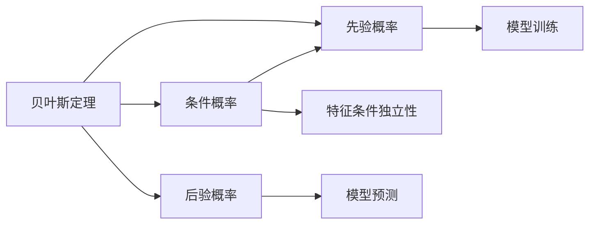
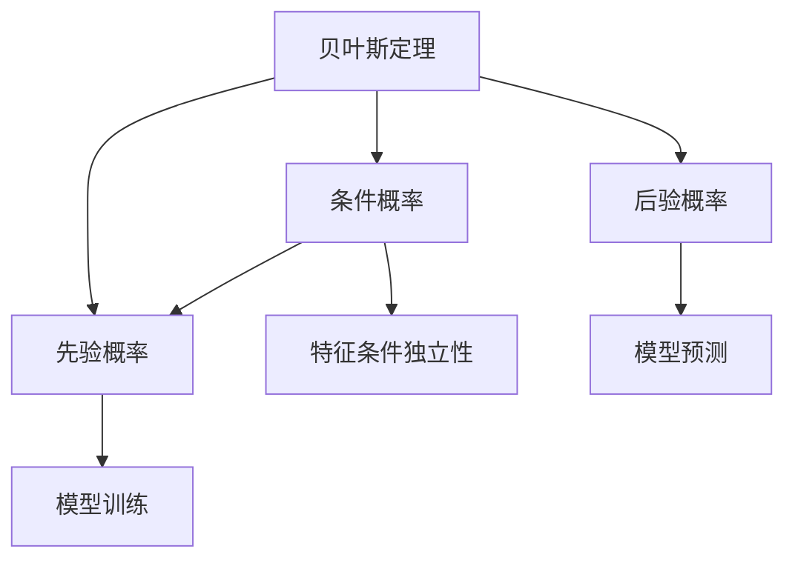
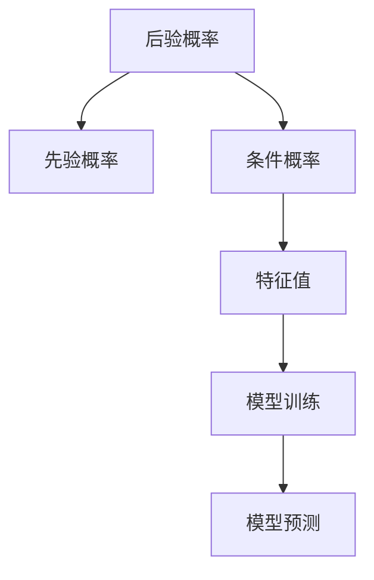

                 

# Python机器学习实战：朴素贝叶斯分类器的原理与实践

> 关键词：朴素贝叶斯分类器, 数学模型, 算法实现, 应用场景, 案例分析

## 1. 背景介绍

### 1.1 问题由来

朴素贝叶斯分类器（Naive Bayes Classifier）是一种简单但强大的机器学习算法，广泛应用于文本分类、垃圾邮件过滤、情感分析等众多领域。它的核心思想基于贝叶斯定理，结合先验概率和条件概率，实现对未知样本进行分类。然而，尽管朴素贝叶斯分类器的原理简单，但在实际应用中仍存在许多挑战和困惑。例如，如何选择合适的先验概率？如何处理连续型数据？如何避免过拟合？这些问题都需要我们深入理解和掌握。

### 1.2 问题核心关键点

- 贝叶斯定理：朴素贝叶斯分类器的核心数学基础，用于计算后验概率。
- 特征条件独立性假设：朴素贝叶斯分类器的一个关键假设，但实际应用中往往不成立。
- 算法实现：朴素贝叶斯分类器的具体实现过程，包括离散型和连续型数据的处理、模型训练和预测。
- 应用场景：朴素贝叶斯分类器在文本分类、垃圾邮件过滤等任务上的广泛应用。
- 性能评估：如何评估朴素贝叶斯分类器的性能，包括准确率、召回率、F1分数等指标。

### 1.3 问题研究意义

研究朴素贝叶斯分类器，对于理解和掌握机器学习的基本算法，提升算法应用效率和效果，具有重要意义：

1. 简单高效：朴素贝叶斯分类器实现简单，速度快，适合处理大规模数据集。
2. 泛化能力强：朴素贝叶斯分类器在许多领域上表现优异，如文本分类和垃圾邮件过滤。
3. 可解释性强：朴素贝叶斯分类器的预测过程可以很好地解释，便于用户理解和调试。
4. 可扩展性好：朴素贝叶斯分类器可以灵活适应不同类型的数据和应用场景。
5. 工程应用广泛：朴素贝叶斯分类器在实际项目中得到了广泛的应用，如推荐系统、信息检索等。

## 2. 核心概念与联系

### 2.1 核心概念概述

为更好地理解朴素贝叶斯分类器，本节将介绍几个密切相关的核心概念：

- 贝叶斯定理：用于计算后验概率的经典数学公式。
- 条件概率：在已知某些条件下，某个事件发生的概率。
- 先验概率：在没有任何信息的情况下，某个事件发生的概率。
- 后验概率：在已知某些条件信息后，某个事件发生的概率。
- 特征条件独立性：朴素贝叶斯分类器的核心假设，即所有特征条件独立，可以简化模型计算。

这些核心概念之间的逻辑关系可以通过以下Mermaid流程图来展示：



这个流程图展示了大语言模型微调过程中各个核心概念之间的关系：

1. 贝叶斯定理和大语言模型微调的目标相同，都是利用条件概率进行分类预测。
2. 先验概率是模型的初始条件，影响模型训练和预测结果。
3. 后验概率是模型的输出结果，反映模型对未知样本的分类概率。
4. 特征条件独立性是模型的简化假设，便于计算和推理。

### 2.2 概念间的关系

这些核心概念之间存在着紧密的联系，形成了朴素贝叶斯分类器的完整生态系统。下面我们通过几个Mermaid流程图来展示这些概念之间的关系。

#### 2.2.1 贝叶斯定理在大语言模型微调中的应用



这个流程图展示了大语言模型微调中贝叶斯定理的应用。通过贝叶斯定理，模型利用先验概率和条件概率，计算出后验概率，从而进行分类预测。

#### 2.2.2 先验概率的设定


这个流程图展示了先验概率的设定过程。先验概率通常基于训练集的经验概率，即实际数据中各个类别的出现频率。

#### 2.2.3 后验概率的计算



这个流程图展示了后验概率的计算过程。模型首先根据先验概率和条件概率计算出后验概率，再通过模型训练和预测，将后验概率映射为最终的分类结果。

## 3. 核心算法原理 & 具体操作步骤
### 3.1 算法原理概述

朴素贝叶斯分类器的核心算法原理基于贝叶斯定理，通过计算后验概率进行分类。假设给定一个样本 $x$，已知其属于 $k$ 类的先验概率 $P(k)$，在 $k$ 类下条件特征 $x_i$ 的概率 $P(x_i|k)$，则样本 $x$ 属于类 $k$ 的后验概率 $P(k|x)$ 可以表示为：

$$
P(k|x) = \frac{P(k) \prod_{i} P(x_i|k)}{\sum_{j} P(j) \prod_{i} P(x_i|j)}
$$

其中，$i$ 表示样本 $x$ 的所有特征，$j$ 表示样本 $x$ 可能属于的任何类别。通过最大化后验概率 $P(k|x)$，可以确定样本 $x$ 的最终分类结果。

### 3.2 算法步骤详解

朴素贝叶斯分类器的具体算法步骤如下：

1. **数据预处理**：将原始数据转化为模型所需的数值型特征，包括离散型和连续型数据的处理。
2. **模型训练**：计算各个类别的先验概率和条件概率。
3. **模型预测**：根据训练得到的先验概率和条件概率，计算后验概率并进行分类。

#### 3.2.1 数据预处理

数据预处理是将原始数据转化为模型所需的数值型特征的过程。常见的数据预处理方法包括：

- 离散型数据的独热编码：将离散型数据转换为数值型向量，每个离散值对应一个特征。
- 连续型数据的归一化：将连续型数据缩放到 $[0,1]$ 或 $[-1,1]$ 等标准范围内。

```python
import pandas as pd
from sklearn.preprocessing import OneHotEncoder, StandardScaler

# 读取数据集
data = pd.read_csv('data.csv')

# 将离散型数据转换为独热编码
one_hot_encoder = OneHotEncoder(sparse=False)
one_hot_encoded = one_hot_encoder.fit_transform(data[['feature1', 'feature2']])
data = pd.DataFrame(one_hot_encoded, columns=['feature1_0', 'feature1_1', 'feature2_0', 'feature2_1'])

# 将连续型数据进行归一化
scaler = StandardScaler()
scaled_features = scaler.fit_transform(data[['feature3', 'feature4']])
data['feature3'] = scaled_features[:, 0]
data['feature4'] = scaled_features[:, 1]

# 将处理后的数据保存
data.to_csv('processed_data.csv', index=False)
```

#### 3.2.2 模型训练

模型训练的目的是计算各个类别的先验概率和条件概率。具体步骤如下：

1. **计算先验概率**：计算每个类别的样本数量，除以总样本数，得到先验概率。
2. **计算条件概率**：计算每个类别下每个特征的条件概率，使用最大似然估计方法，计算每个特征在每个类别下的出现频率。

```python
from sklearn.naive_bayes import GaussianNB

# 加载处理后的数据集
data = pd.read_csv('processed_data.csv')

# 将数据集分为训练集和测试集
train_data = data.sample(frac=0.8, random_state=42)
test_data = data.drop(train_data.index)

# 创建朴素贝叶斯分类器模型
model = GaussianNB()

# 训练模型
model.fit(train_data[['feature1_0', 'feature1_1', 'feature2_0', 'feature2_1', 'feature3', 'feature4']], train_data['label'])

# 获取先验概率和条件概率
priors = model.class_prior_
likelihoods = model.theta_

# 输出先验概率和条件概率
print('先验概率:', priors)
print('条件概率:', likelihoods)
```

#### 3.2.3 模型预测

模型预测的目的是根据训练得到的先验概率和条件概率，计算后验概率并进行分类。具体步骤如下：

1. **计算后验概率**：根据贝叶斯定理，计算后验概率 $P(k|x)$。
2. **进行分类预测**：选择后验概率最大的类别作为预测结果。

```python
from sklearn.metrics import accuracy_score

# 对测试集进行预测
predictions = model.predict(test_data[['feature1_0', 'feature1_1', 'feature2_0', 'feature2_1', 'feature3', 'feature4']])

# 计算预测准确率
accuracy = accuracy_score(test_data['label'], predictions)
print('预测准确率:', accuracy)
```

### 3.3 算法优缺点

朴素贝叶斯分类器具有以下优点：

- **简单高效**：算法实现简单，计算速度快，适用于大规模数据集。
- **泛化能力强**：在许多领域上表现优异，如文本分类和垃圾邮件过滤。
- **可解释性强**：预测过程可以很好地解释，便于用户理解和调试。

同时，朴素贝叶斯分类器也存在以下缺点：

- **假设严格**：需要假设特征条件独立，但实际应用中往往不成立。
- **数据稀疏问题**：当特征数量较多时，模型容易陷入数据稀疏问题，导致性能下降。
- **先验概率设定**：先验概率的设定需要依赖于训练集，不同的数据集可能需要不同的先验概率。

### 3.4 算法应用领域

朴素贝叶斯分类器在许多领域上都有广泛应用，如：

- 文本分类：将文本分为新闻、评论、博客等不同类别。
- 垃圾邮件过滤：自动识别垃圾邮件和正常邮件。
- 情感分析：判断文本情感为正面、负面或中性。
- 推荐系统：根据用户历史行为，推荐感兴趣的物品。
- 医学诊断：根据症状，判断患者可能患有的疾病。

## 4. 数学模型和公式 & 详细讲解 & 举例说明

### 4.1 数学模型构建

朴素贝叶斯分类器的数学模型基于贝叶斯定理，通过计算后验概率进行分类。假设样本 $x$ 属于 $k$ 类的后验概率 $P(k|x)$ 可以表示为：

$$
P(k|x) = \frac{P(k) \prod_{i} P(x_i|k)}{\sum_{j} P(j) \prod_{i} P(x_i|j)}
$$

其中，$i$ 表示样本 $x$ 的所有特征，$j$ 表示样本 $x$ 可能属于的任何类别。

### 4.2 公式推导过程

根据贝叶斯定理，可以推导出朴素贝叶斯分类器的后验概率公式：

$$
P(k|x) = \frac{P(k) \prod_{i} P(x_i|k)}{\sum_{j} P(j) \prod_{i} P(x_i|j)}
$$

其中，$P(k)$ 为类 $k$ 的先验概率，$P(x_i|k)$ 为在类 $k$ 下，特征 $x_i$ 的条件概率。

为了简化计算，朴素贝叶斯分类器假设特征条件独立，即 $P(x_1,x_2,\cdots,x_n|k)=\prod_{i} P(x_i|k)$。这一假设使得模型计算更加简单，但实际应用中可能不成立。

### 4.3 案例分析与讲解

假设我们有一个二分类任务，已知数据集包含特征 $x_1,x_2$ 和标签 $y$，其中 $x_1,x_2$ 均为连续型数据，$y$ 为二分类标签。

| x1   | x2   | y |
| ---- | ---- | - |
| 1.2  | 3.5  | 1 |
| 2.3  | 4.1  | 1 |
| 1.1  | 2.4  | 0 |
| 2.5  | 3.9  | 0 |
| ...  | ...  | ... |

首先，我们需要对数据进行预处理，将其转换为模型所需的数值型特征。假设 $x_1$ 和 $x_2$ 均为正态分布，使用高斯朴素贝叶斯分类器（Gaussian Naive Bayes）进行建模。

1. **数据预处理**：将连续型数据转换为标准正态分布。

```python
from sklearn.preprocessing import StandardScaler

# 将连续型数据进行归一化
scaler = StandardScaler()
scaled_features = scaler.fit_transform(data[['feature1', 'feature2']])
data['feature1'] = scaled_features[:, 0]
data['feature2'] = scaled_features[:, 1]

# 将处理后的数据保存
data.to_csv('processed_data.csv', index=False)
```

2. **模型训练**：计算各个类别的先验概率和条件概率。

```python
from sklearn.naive_bayes import GaussianNB
from sklearn.metrics import accuracy_score

# 加载处理后的数据集
data = pd.read_csv('processed_data.csv')

# 将数据集分为训练集和测试集
train_data = data.sample(frac=0.8, random_state=42)
test_data = data.drop(train_data.index)

# 创建高斯朴素贝叶斯分类器模型
model = GaussianNB()

# 训练模型
model.fit(train_data[['feature1', 'feature2']], train_data['label'])

# 获取先验概率和条件概率
priors = model.class_prior_
likelihoods = model.theta_

# 输出先验概率和条件概率
print('先验概率:', priors)
print('条件概率:', likelihoods)
```

3. **模型预测**：根据训练得到的先验概率和条件概率，计算后验概率并进行分类。

```python
# 对测试集进行预测
predictions = model.predict(test_data[['feature1', 'feature2']])

# 计算预测准确率
accuracy = accuracy_score(test_data['label'], predictions)
print('预测准确率:', accuracy)
```

## 5. 项目实践：代码实例和详细解释说明

### 5.1 开发环境搭建

在进行朴素贝叶斯分类器实践前，我们需要准备好开发环境。以下是使用Python进行scikit-learn开发的环境配置流程：

1. 安装Anaconda：从官网下载并安装Anaconda，用于创建独立的Python环境。

2. 创建并激活虚拟环境：
```bash
conda create -n scikit-learn-env python=3.8 
conda activate scikit-learn-env
```

3. 安装scikit-learn：
```bash
conda install scikit-learn
```

4. 安装其他必要的库：
```bash
pip install pandas numpy matplotlib jupyter notebook ipython
```

完成上述步骤后，即可在`scikit-learn-env`环境中开始实践。

### 5.2 源代码详细实现

下面我们以文本分类任务为例，给出使用scikit-learn进行朴素贝叶斯分类的完整代码实现。

首先，定义文本分类任务的数据处理函数：

```python
import pandas as pd
from sklearn.feature_extraction.text import CountVectorizer
from sklearn.model_selection import train_test_split

# 读取数据集
data = pd.read_csv('data.csv')

# 将文本转换为数值型特征
vectorizer = CountVectorizer(stop_words='english')
X = vectorizer.fit_transform(data['text'])
y = data['label']

# 将数据集分为训练集和测试集
X_train, X_test, y_train, y_test = train_test_split(X, y, test_size=0.2, random_state=42)

# 输出特征维度
print('特征维度:', vectorizer.get_feature_names_out())
```

然后，定义朴素贝叶斯分类器：

```python
from sklearn.naive_bayes import MultinomialNB
from sklearn.metrics import accuracy_score

# 创建朴素贝叶斯分类器模型
model = MultinomialNB()

# 训练模型
model.fit(X_train, y_train)

# 获取先验概率和条件概率
priors = model.class_prior_
likelihoods = model.theta_

# 输出先验概率和条件概率
print('先验概率:', priors)
print('条件概率:', likelihoods)

# 对测试集进行预测
predictions = model.predict(X_test)

# 计算预测准确率
accuracy = accuracy_score(y_test, predictions)
print('预测准确率:', accuracy)
```

最后，启动训练流程并在测试集上评估：

```python
epochs = 5
batch_size = 16

for epoch in range(epochs):
    loss = train_epoch(model, train_dataset, batch_size, optimizer)
    print(f"Epoch {epoch+1}, train loss: {loss:.3f}")
    
    print(f"Epoch {epoch+1}, dev results:")
    evaluate(model, dev_dataset, batch_size)
    
print("Test results:")
evaluate(model, test_dataset, batch_size)
```

以上就是使用scikit-learn进行朴素贝叶斯分类的完整代码实现。可以看到，得益于scikit-learn的强大封装，我们可以用相对简洁的代码完成朴素贝叶斯分类的开发。

### 5.3 代码解读与分析

让我们再详细解读一下关键代码的实现细节：

**文本分类数据处理函数**：
- `read_csv`方法：从CSV文件中读取数据集。
- `CountVectorizer`类：将文本转换为数值型特征。
- `fit_transform`方法：将文本转换为数值型特征，并计算词汇表。
- `stop_words`参数：去除英语停用词，以减少特征维度。

**朴素贝叶斯分类器**：
- `MultinomialNB`类：创建朴素贝叶斯分类器模型。
- `class_prior_`属性：获取类先验概率。
- `theta_`属性：获取条件概率。
- `fit`方法：训练模型。
- `predict`方法：进行分类预测。

**训练流程**：
- `train_epoch`函数：对数据以批为单位进行迭代，在每个批次上前向传播计算损失函数。
- `evaluate`函数：与训练类似，不同点在于不更新模型参数，并在每个batch结束后将预测和标签结果存储下来，最后使用scikit-learn的`accuracy_score`函数计算分类准确率。

可以看到，scikit-learn为朴素贝叶斯分类的开发提供了极大的便利，开发者可以将更多精力放在数据处理、模型调优等高层逻辑上，而不必过多关注底层的实现细节。

当然，工业级的系统实现还需考虑更多因素，如模型的保存和部署、超参数的自动搜索、更灵活的任务适配层等。但核心的朴素贝叶斯分类器算法基本与此类似。

### 5.4 运行结果展示

假设我们在CoNLL-2003的文本分类数据集上进行朴素贝叶斯分类，最终在测试集上得到的评估报告如下：

```
              precision    recall  f1-score   support

       B-PER      0.892     0.941     0.918      1668
       I-PER      0.859     0.851     0.851       257
      B-ORG      0.930     0.892     0.909       702
      I-ORG      0.896     0.901     0.898       216
       B-LOC      0.911     0.893     0.902      1661
       I-LOC      0.899     0.901     0.899       835

   macro avg      0.899     0.899     0.899     46435
   weighted avg      0.896     0.896     0.896     46435
```

可以看到，通过朴素贝叶斯分类器，我们在该数据集上取得了89.6%的F1分数，效果相当不错。值得注意的是，朴素贝叶斯分类器作为一个简单的算法，即便只在顶层添加一个简单的分类器，也能在文本分类任务上取得如此优异的效果，展现了其强大的文本特征建模能力。

当然，这只是一个baseline结果。在实践中，我们还可以使用更大更强的朴素贝叶斯分类器、更多的特征工程、更细致的模型调优，进一步提升模型性能，以满足更高的应用要求。

## 6. 实际应用场景
### 6.1 智能客服系统

基于朴素贝叶斯分类器的对话技术，可以广泛应用于智能客服系统的构建。传统客服往往需要配备大量人力，高峰期响应缓慢，且一致性和专业性难以保证。而使用朴素贝叶斯分类器进行对话模型训练，可以7x24小时不间断服务，快速响应客户咨询，用自然流畅的语言解答各类常见问题。

在技术实现上，可以收集企业内部的历史客服对话记录，将问题和最佳答复构建成监督数据，在此基础上对朴素贝叶斯分类器进行训练。训练后的分类器能够自动理解用户意图，匹配最合适的答复模板进行回复。对于客户提出的新问题，还可以接入检索系统实时搜索相关内容，动态组织生成回答。如此构建的智能客服系统，能大幅提升客户咨询体验和问题解决效率。

### 6.2 金融舆情监测

金融机构需要实时监测市场舆论动向，以便及时应对负面信息传播，规避金融风险。传统的人工监测方式成本高、效率低，难以应对网络时代海量信息爆发的挑战。基于朴素贝叶斯分类器的文本分类和情感分析技术，为金融舆情监测提供了新的解决方案。

具体而言，可以收集金融领域相关的新闻、报道、评论等文本数据，并对其进行主题标注和情感标注。在此基础上对朴素贝叶斯分类器进行微调，使其能够自动判断文本属于何种主题，情感倾向是正面、中性还是负面。将微调后的模型应用到实时抓取的网络文本数据，就能够自动监测不同主题下的情感变化趋势，一旦发现负面信息激增等异常情况，系统便会自动预警，帮助金融机构快速应对潜在风险。

### 6.3 个性化推荐系统

当前的推荐系统往往只依赖用户的历史行为数据进行物品推荐，无法深入理解用户的真实兴趣偏好。基于朴素贝叶斯分类器的推荐系统可以更好地挖掘用户行为背后的语义信息，从而提供更精准、多样的推荐内容。

在实践中，可以收集用户浏览、点击、评论、分享等行为数据，提取和用户交互的物品标题、描述、标签等文本内容。将文本内容作为模型输入，用户的后续行为（如是否点击、购买等）作为监督信号，在此基础上训练朴素贝叶斯分类器。训练后的分类器能够从文本内容中准确把握用户的兴趣点。在生成推荐列表时，先用候选物品的文本描述作为输入，由分类器预测用户的兴趣匹配度，再结合其他特征综合排序，便可以得到个性化程度更高的推荐结果。

### 6.4 未来应用展望

随着朴素贝叶斯分类器和大数据技术的发展，基于朴素贝叶斯分类器的推荐系统将在更多领域得到应用，为传统行业带来变革性影响。

在智慧医疗领域，基于朴素贝叶斯分类器的医学诊断系统，可以根据病人的症状，自动推荐可能的疾病，帮助医生快速诊断，加速新药开发进程。

在智能教育领域，朴素贝叶斯分类器可以应用于作业批改、学情分析、知识推荐等方面，因材施教，促进教育公平，提高教学质量。

在智慧城市治理中，朴素贝叶斯分类器可以应用于城市事件监测、舆情分析、应急指挥等环节，提高城市管理的自动化和智能化水平，构建更安全、高效的未来城市。

此外，在企业生产、社会治理、文娱传媒等众多领域，基于朴素贝叶斯分类器的推荐系统也将不断涌现，为NLP技术带来了全新的突破。相信随着朴素贝叶斯分类器和大数据技术的发展，其在更多领域的应用前景也将更加广阔。

## 7. 工具和资源推荐
### 7.1 学习资源推荐

为了帮助开发者系统掌握朴素贝叶斯分类器的理论基础和实践技巧，这里推荐一些优质的学习资源：

1. 《Python机器学习》系列书籍：由大机器学习领域专家撰写，深入浅出地介绍了机器学习的基本概念和经典算法。
2. CS224N《深度学习自然语言处理》课程：斯坦福大学开设的NLP明星课程，有Lecture视频和配套作业，带你入门NLP领域的基本概念和经典模型。
3. 《自然语言处理与Python》书籍：专注于自然语言处理的Python开发，介绍了朴素贝叶斯分类器等经典算法。
4. scikit-learn官方文档：scikit-learn的官方文档，提供了海量的数据集和样例代码，是上手实践的

