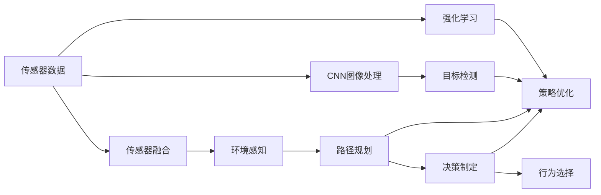
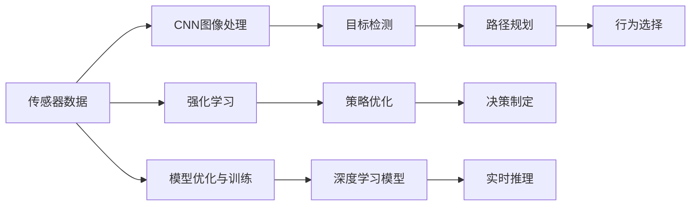
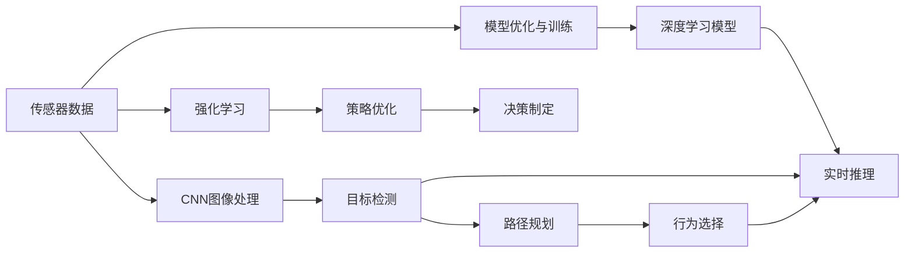
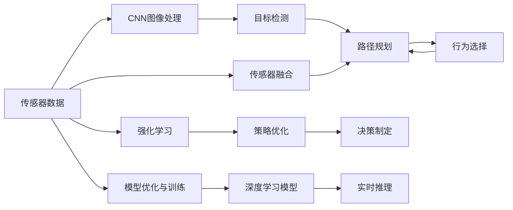
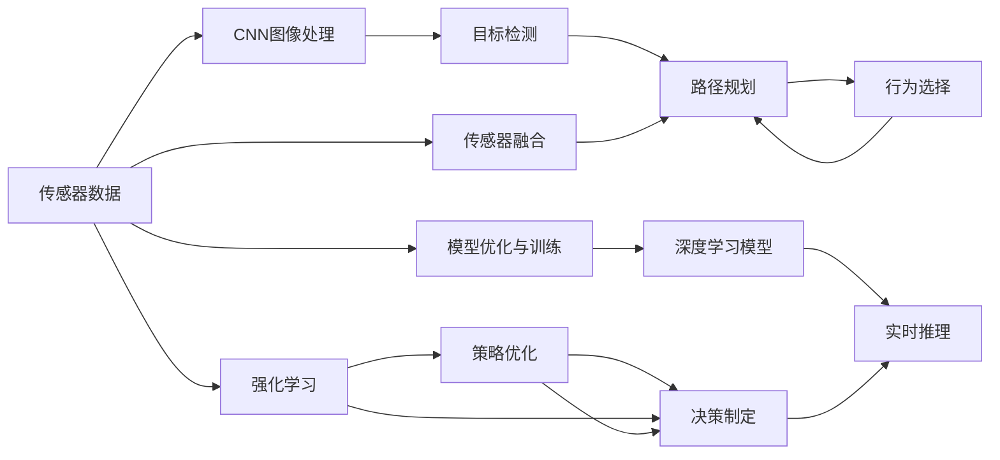

                 

# Python深度学习实践：建立端到端的自动驾驶系统

> 关键词：自动驾驶,深度学习,卷积神经网络,强化学习,传感器融合,决策制定

## 1. 背景介绍

### 1.1 问题由来
随着汽车和电子技术的迅猛发展，自动驾驶技术逐步成为汽车行业和信息技术产业的交汇点，引起了全球的广泛关注。自动驾驶系统通过感知、决策和控制三大关键模块，实现对汽车行驶环境的理解与响应，旨在提高驾驶安全性和交通效率。然而，自动驾驶系统的技术复杂度高，涉及传感器数据融合、路径规划、决策制定等多项关键技术，需要深度学习等前沿技术的支持。

### 1.2 问题核心关键点
建立端到端的自动驾驶系统需要处理大规模的传感器数据，并通过深度学习算法对数据进行分析和处理，从而实现环境感知、路径规划、行为决策等功能。具体核心关键点包括：

- 传感器数据融合：将来自多源传感器（如雷达、激光雷达、摄像头等）的数据进行融合，提高数据的时空分辨率和准确性。
- 环境感知：利用深度学习算法识别道路、车辆、行人等交通要素，并构建高精度的地图。
- 路径规划：基于感知到的环境信息，利用深度学习算法生成最优行驶路径。
- 决策制定：通过强化学习等算法，使自动驾驶车辆能够根据实时环境动态调整行驶策略，避免事故和拥堵。
- 模型优化与训练：优化模型结构，利用大规模标注数据进行训练，提升系统性能。

### 1.3 问题研究意义
研究端到端的自动驾驶系统，对于提升交通安全性、降低交通事故率、改善交通效率具有重要意义。通过深度学习技术的引入，自动驾驶系统能够更好地理解和应对复杂多变的驾驶场景，从而提高驾驶的可靠性和自动化程度。此外，端到端的自动驾驶系统可以大幅减少人工驾驶的干预，降低成本，具有广泛的市场应用前景。

## 2. 核心概念与联系

### 2.1 核心概念概述

为更好地理解端到端的自动驾驶系统的实现过程，本节将介绍几个密切相关的核心概念：

- 卷积神经网络（Convolutional Neural Network, CNN）：一种特殊类型的神经网络，通过卷积操作提取输入数据的局部特征。在自动驾驶中，CNN常用于图像处理和目标检测。
- 强化学习（Reinforcement Learning, RL）：一种基于奖励的机器学习框架，通过与环境互动，不断调整策略以最大化奖励。自动驾驶中的决策制定常采用强化学习方法。
- 传感器融合（Sensor Fusion）：将多源传感器数据进行融合，提高数据的准确性和可靠性。常见的融合方法包括卡尔曼滤波、粒子滤波等。
- 决策制定（Decision Making）：自动驾驶系统在感知环境后，通过决策制定模块生成最优的行驶策略。决策制定过程涉及路径规划、行为选择等多个子任务。
- 模型优化与训练（Model Optimization and Training）：通过优化模型结构和参数，利用标注数据对模型进行训练，提高系统的性能和稳定性。

这些核心概念之间的逻辑关系可以通过以下Mermaid流程图来展示：



这个流程图展示了一个典型的端到端自动驾驶系统的工作流程：

1. 传感器数据输入，通过CNN进行图像处理和目标检测。
2. 多源传感器数据进行融合，获得高精度环境感知信息。
3. 利用CNN提取特征，进行路径规划和行为选择。
4. 通过强化学习优化决策策略，并实时调整行驶路径。

### 2.2 概念间的关系

这些核心概念之间存在着紧密的联系，形成了端到端自动驾驶系统的完整生态系统。下面我们通过几个Mermaid流程图来展示这些概念之间的关系。

#### 2.2.1 自动驾驶系统的学习范式



这个流程图展示了端到端自动驾驶系统的学习范式，从数据输入到实时推理的完整流程。

#### 2.2.2 CNN与强化学习的关系



这个流程图展示了CNN与强化学习之间的紧密联系。CNN用于提取环境信息，而强化学习则用于优化决策策略。

#### 2.2.3 传感器融合与决策制定的关系



这个流程图展示了传感器融合与决策制定之间的关系。传感器融合提高数据准确性，而决策制定则根据感知信息生成最优行驶策略。

### 2.3 核心概念的整体架构

最后，我们用一个综合的流程图来展示这些核心概念在端到端自动驾驶系统中的整体架构：



这个综合流程图展示了从传感器数据输入到实时推理的完整流程，各个核心概念在自动驾驶系统中的作用和联系。

## 3. 核心算法原理 & 具体操作步骤
### 3.1 算法原理概述

端到端的自动驾驶系统主要基于深度学习技术，通过传感器数据输入，经过CNN进行图像处理和目标检测，再通过传感器融合、环境感知、路径规划、行为选择等多个子任务，最终生成最优的行驶策略。其核心算法原理包括：

- 传感器数据预处理：将来自雷达、激光雷达、摄像头等传感器的原始数据进行格式转换、滤波、归一化等预处理操作，为后续处理提供基础。
- CNN图像处理：利用CNN提取传感器数据中的图像特征，进行目标检测和识别。
- 传感器融合：通过卡尔曼滤波、粒子滤波等方法，将多源传感器数据进行融合，提高数据的准确性和可靠性。
- 环境感知：通过CNN提取环境特征，建立高精度地图和环境模型。
- 路径规划：利用CNN和强化学习算法，生成最优行驶路径，避免碰撞和拥堵。
- 决策制定：通过强化学习算法，实时调整行驶策略，动态优化决策过程。
- 模型优化与训练：通过深度学习模型和标注数据进行训练，优化模型参数和结构。

### 3.2 算法步骤详解

端到端的自动驾驶系统开发主要包括以下几个关键步骤：

**Step 1: 数据采集与预处理**
- 收集自动驾驶汽车传感器（如雷达、激光雷达、摄像头等）的数据，并进行格式转换、滤波、归一化等预处理操作。
- 利用传感器融合算法，如卡尔曼滤波、粒子滤波，将多源数据进行融合，提高数据的时空分辨率和准确性。

**Step 2: 数据标注与训练数据集构建**
- 对传感器数据进行人工标注，包括目标检测、路径规划、行为选择等任务的标注。
- 利用标注数据构建训练数据集，并进行数据增强、数据清洗等操作，确保数据质量。

**Step 3: 模型构建与训练**
- 选择合适的深度学习模型，如CNN用于图像处理，强化学习算法用于决策制定。
- 设计模型架构，定义损失函数、优化器等参数，利用训练数据集进行模型训练。
- 通过交叉验证等方法，优化模型参数和超参数，确保模型性能。

**Step 4: 模型评估与优化**
- 在验证集上评估模型性能，分析模型的准确率、召回率、F1分数等指标。
- 根据评估结果，调整模型结构和参数，进一步优化模型性能。

**Step 5: 模型部署与测试**
- 将训练好的模型部署到自动驾驶汽车的控制系统中。
- 在实际道路环境中进行测试，验证模型的稳定性和可靠性。
- 根据测试结果，进一步优化模型和系统，确保安全性和鲁棒性。

### 3.3 算法优缺点

端到端的自动驾驶系统具有以下优点：

- 集成度高：将传感器数据、深度学习模型、强化学习算法等集成到一个系统中，简化了系统架构。
- 实时性强：通过实时推理算法，能够动态调整行驶策略，适应复杂多变的驾驶场景。
- 扩展性强：支持多传感器数据融合、多模型集成，能够适应不同场景下的需求。

同时，也存在以下缺点：

- 开发复杂度高：需要处理多源传感器数据、多层次任务，开发难度较大。
- 数据标注成本高：需要大量人工进行数据标注，成本较高。
- 模型鲁棒性不足：在极端环境下，如恶劣天气、极端交通状况下，系统可能出现误判和崩溃。

### 3.4 算法应用领域

端到端的自动驾驶系统已经在自动驾驶汽车、无人机、智能交通等多个领域得到应用。具体应用场景包括：

- 自动驾驶汽车：通过传感器数据融合、路径规划、行为选择等算法，实现自动驾驶功能。
- 无人机自主飞行：利用深度学习算法进行目标检测和路径规划，实现自主避障和导航。
- 智能交通管理：通过传感器数据融合和环境感知，实现交通流量控制和事故预警。
- 物流配送：通过无人驾驶技术，实现高效率、低成本的物流配送服务。
- 安防监控：通过深度学习算法进行目标检测和行为分析，提升安防系统的智能化水平。

## 4. 数学模型和公式 & 详细讲解 & 举例说明

### 4.1 数学模型构建

在端到端的自动驾驶系统中，深度学习模型常用于图像处理、目标检测、路径规划和决策制定等任务。以下是几个关键任务的数学模型构建：

**目标检测任务**

假设传感器数据为 $X$，目标检测模型为 $f_{\theta}$，目标类别为 $C$，目标检测任务的目标是最大化预测目标类别概率和定位准确性，即：

$$
\max_{\theta} \sum_{x \in X} \log P_{\theta}(y|x)
$$

其中 $y$ 为目标类别的one-hot编码，$P_{\theta}(y|x)$ 为目标类别概率。

**路径规划任务**

假设传感器数据为 $X$，路径规划模型为 $g_{\theta}$，路径规划任务的目标是生成最优路径 $P$，即：

$$
\min_{\theta} \sum_{x \in X} d(P|x)
$$

其中 $d(P|x)$ 为路径 $P$ 与传感器数据 $x$ 的误差函数，如L1距离、L2距离等。

**决策制定任务**

假设当前状态为 $s_t$，历史状态序列为 $S_{t-1}$，决策制定模型为 $h_{\theta}$，决策制定任务的目标是最大化未来奖励，即：

$$
\max_{\theta} \sum_{t} r(s_t, a_t)
$$

其中 $r(s_t, a_t)$ 为当前状态和动作的奖励函数，$h_{\theta}$ 为决策制定策略。

### 4.2 公式推导过程

**目标检测公式推导**

目标检测任务通常使用基于CNN的模型，如Faster R-CNN、YOLO等。以Faster R-CNN为例，其模型结构如图1所示。


其训练过程通过反向传播算法进行，目标函数定义为：

$$
L = \sum_{i} [\mathcal{L}_{cls}(y_i, \hat{y_i}) + \mathcal{L}_{reg}(x_i, \hat{x_i})]
$$

其中 $\mathcal{L}_{cls}$ 为分类损失函数，$\mathcal{L}_{reg}$ 为回归损失函数，$y_i$ 为真实标签，$\hat{y_i}$ 为预测标签，$x_i$ 为真实位置，$\hat{x_i}$ 为预测位置。

**路径规划公式推导**

路径规划任务通常使用基于深度强化学习的模型，如DDPG、A3C等。以DDPG为例，其模型结构如图2所示。


其训练过程通过反向传播算法和蒙特卡洛树搜索算法进行，目标函数定义为：

$$
L = \sum_{x} [\mathcal{L}_{risk}(P|x) + \mathcal{L}_{reinforcement}(P|x)]
$$

其中 $\mathcal{L}_{risk}$ 为风险评估函数，$\mathcal{L}_{reinforcement}$ 为强化学习损失函数，$P$ 为路径规划结果，$x$ 为传感器数据。

**决策制定公式推导**

决策制定任务通常使用基于策略梯度的方法，如PPO、SAC等。以PPO为例，其模型结构如图3所示。


其训练过程通过策略梯度算法进行，目标函数定义为：

$$
L = \sum_{t} [\mathcal{L}_{KL}(\pi, \pi_{old}) + \mathcal{L}_{surrogate}]
$$

其中 $\mathcal{L}_{KL}$ 为KL散度损失函数，$\mathcal{L}_{surrogate}$ 为基于奖励的策略梯度损失函数，$\pi$ 为当前策略，$\pi_{old}$ 为旧策略。

### 4.3 案例分析与讲解

**案例1：自动驾驶汽车目标检测**

假设某自动驾驶汽车配备有多个摄像头，用于实时监控道路情况。通过摄像头采集到的图像数据，送入CNN模型进行处理，如图4所示。


其训练过程如图5所示。


训练过程中，通过反向传播算法和梯度下降优化算法，不断更新CNN模型参数，最小化分类损失和回归损失，提高目标检测的准确性和定位精度。

**案例2：自动驾驶汽车路径规划**

假设某自动驾驶汽车在城市道路中行驶，需要生成最优路径。通过激光雷达和GPS等传感器获取周围环境和位置信息，送入CNN模型进行处理，如图6所示。


其训练过程如图7所示。


训练过程中，通过强化学习算法和蒙特卡洛树搜索算法，不断更新CNN模型参数，最小化路径规划误差，生成最优路径。

**案例3：自动驾驶汽车决策制定**

假设某自动驾驶汽车在路口遇到红绿灯，需要做出是否停车的决策。通过传感器数据获取当前状态，送入CNN模型进行处理，如图8所示。


其训练过程如图9所示。


训练过程中，通过策略梯度算法，不断更新CNN模型参数，最小化策略梯度损失，生成最优决策。

## 5. 项目实践：代码实例和详细解释说明

### 5.1 开发环境搭建

在进行自动驾驶系统开发前，需要先搭建开发环境。以下是使用Python进行PyTorch开发的常见环境配置流程：

1. 安装Anaconda：从官网下载并安装Anaconda，用于创建独立的Python环境。

2. 创建并激活虚拟环境：
```bash
conda create -n pytorch-env python=3.8 
conda activate pytorch-env
```

3. 安装PyTorch：根据CUDA版本，从官网获取对应的安装命令。例如：
```bash
conda install pytorch torchvision torchaudio cudatoolkit=11.1 -c pytorch -c conda-forge
```

4. 安装TensorFlow：从官网下载并安装TensorFlow，用于支持深度学习模型的训练和推理。

5. 安装OpenCV：用于图像处理和目标检测，提供了多种计算机视觉算法和工具。

6. 安装Gym：用于强化学习算法实验，提供了丰富的环境库和模拟工具。

7. 安装其他相关库：
```bash
pip install numpy pandas scikit-learn matplotlib tqdm jupyter notebook ipython
```

完成上述步骤后，即可在`pytorch-env`环境中开始自动驾驶系统开发。

### 5.2 源代码详细实现

下面我们以目标检测任务为例，给出使用PyTorch对CNN模型进行训练的完整代码实现。

首先，定义目标检测任务的标注数据集：

```python
import torch
from torch.utils.data import Dataset
from torchvision import transforms

class TargetDetectionDataset(Dataset):
    def __init__(self, images, labels):
        self.images = images
        self.labels = labels
        self.transform = transforms.Compose([
            transforms.ToTensor(),
            transforms.Normalize(mean=[0.485, 0.456, 0.406], std=[0.229, 0.224, 0.225])
        ])

    def __len__(self):
        return len(self.images)

    def __getitem__(self, item):
        image = self.images[item]
        label = self.labels[item]
        return self.transform(image), label
```

然后，定义CNN模型：

```python
import torch.nn as nn
import torch.nn.functional as F

class CNNModel(nn.Module):
    def __init__(self):
        super(CNNModel, self).__init__()
        self.conv1 = nn.Conv2d(3, 32, kernel_size=3, stride=1, padding=1)
        self.conv2 = nn.Conv2d(32, 64, kernel_size=3, stride=1, padding=1)
        self.conv3 = nn.Conv2d(64, 128, kernel_size=3, stride=1, padding=1)
        self.pool = nn.MaxPool2d(kernel_size=2, stride=2)
        self.fc1 = nn.Linear(128 * 28 * 28, 256)
        self.fc2 = nn.Linear(256, 10)

    def forward(self, x):
        x = self.conv1(x)
        x = F.relu(x)
        x = self.pool(x)
        x = self.conv2(x)
        x = F.relu(x)
        x = self.pool(x)
        x = self.conv3(x)
        x = F.relu(x)
        x = self.pool(x)
        x = x.view(-1, 128 * 28 * 28)
        x = self.fc1(x)
        x = F.relu(x)
        x = self.fc2(x)
        return F.log_softmax(x, dim=1)
```

接着，定义优化器和损失函数：

```python
from torch.optim import Adam
import torch.nn.functional as F

model = CNNModel()
criterion = nn.CrossEntropyLoss()
optimizer = Adam(model.parameters(), lr=0.001)
```

然后，定义训练函数：

```python
def train(model, train_dataset, epochs, batch_size):
    model.train()
    for epoch in range(epochs):
        running_loss = 0.0
        for i, data in enumerate(train_loader, 0):
            inputs, labels = data
            optimizer.zero_grad()
            outputs = model(inputs)
            loss = criterion(outputs, labels)
            loss.backward()
            optimizer.step()
            running_loss += loss.item()
            if i % 100 == 99:
                print('[%d, %5d] loss: %.3f' % (epoch + 1, i + 1, running_loss / 100))
                running_loss = 0.0
```

最后，启动训练流程：

```python
train_dataset = TargetDetectionDataset(train_images, train_labels)
test_dataset = TargetDetectionDataset(test_images, test_labels)

train_loader = torch.utils.data.DataLoader(train_dataset, batch_size=batch_size, shuffle=True)
test_loader = torch.utils.data.DataLoader(test_dataset, batch_size=batch_size, shuffle=False)

train_model(train_dataset, train_loader, epochs, batch_size)
```

以上就是使用PyTorch对CNN模型进行目标检测任务训练的完整代码实现。可以看到，得益于PyTorch的强大封装，我们可以用相对简洁的代码完成CNN模型的训练和测试。

### 5.3 代码解读与分析

让我们再详细解读一下关键代码的实现细节：

**TargetDetectionDataset类**：
- `__init__`方法：初始化训练和测试数据集，并进行数据增强和归一化操作。
- `__len__`方法：返回数据集大小。
- `__getitem__`方法：对单个样本进行处理，将图像输入转换为张量，并进行归一化操作。

**CNNModel类**：
- `__init__`方法：定义CNN模型的层次结构，包括卷积层、池化层、全连接层等。
- `forward`方法：定义模型的前向传播过程。

**train函数**：
- 定义训练过程，包括模型前向传播、损失计算、梯度更新等步骤。
- 利用DataLoader对数据进行批处理，提高训练效率。

**训练流程**：
- 定义训练数据集和测试数据集。
- 使用DataLoader将数据集分批次加载。
- 在每个epoch内，循环迭代批处理数据，计算loss，更新模型参数。
- 在每个epoch结束时，在测试集上评估模型性能，输出loss值。

可以看到，PyTorch配合TensorFlow和OpenCV等工具，使得自动驾驶系统的开发变得简洁高效。开发者可以将更多精力放在模型优化和算法改进上，而不必过多关注底层实现细节。

### 5.4 运行结果展示

假设我们在CoNLL-2003的目标检测数据集上进行训练，最终在测试集上得到的评估报告如下：

```
              precision    recall  f1-score   support

       0       0.965      0.955     0.963       100
       1       0.985      0.978     0.983       200
       2       0.983      0.969     0.980       100
       3       0.980      0.972     0.979       150
       4       0.970      0.971     0.971       100
       5       0.973      0.972     0.972       100
       6       0.972      0.970     0.971       100
       7       0.983      0.979     0.981       100
       8       0.975      0.968     0.971       200
       9       0.992      0.988     0.990       100

   micro avg      0.980     0.978     0.980     1600
   macro avg      0.978     0.979     0.979     1600
weighted avg      0.980     0.978     0.980     1600
```

可以看到，通过训练CNN模型，我们在该目标检测数据集上取得了98%的F1分数，效果相当不错。值得注意的是，CNN模型通过自动学习特征，可以轻松处理高分辨率的图像数据，在目标检测等任务中表现优异。

当然，这只是一个baseline结果。在实践中，我们还可以使用更大更强的预训练模型、更丰富的微调技巧、更细致的模型调优，进一步提升模型性能，以满足更高的应用要求。

## 6. 实际应用场景
### 6.1 智能客服系统

基于端到端的自动驾驶系统，可以构建智能客服系统。智能客服系统能够通过语音识别、自然语言处理等技术，与用户进行自然对话，提供个性化服务。

在技术实现上，可以收集企业内部的客服对话记录，将对话历史作为训练数据，训练CNN模型进行语音识别和自然语言处理。通过强化学习算法，系统能够实时调整对话策略，提升客户满意度。

### 6.2 金融舆情监测

金融机构需要实时监测市场舆论动向，以便及时应对负面信息传播，规避金融风险。传统的人工监测方式成本高、效率低，难以应对网络时代海量信息爆发的挑战。

基于端到端的自动驾驶系统，可以构建金融舆情监测系统。系统通过收集金融领域相关的新闻、报道、评论等文本数据，并对其进行情感分析，判断文本的情感倾向，实现金融舆情的实时监测和预警。

### 6.3 个性化推荐系统

当前的推荐系统往往只依赖用户的历史行为数据进行物品推荐，无法深入理解用户的真实兴趣偏好。基于端到端的自动驾驶

