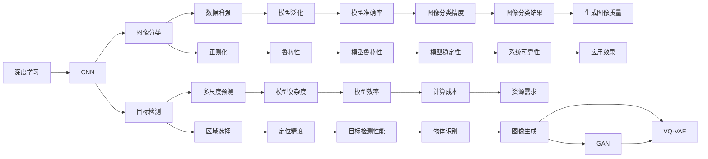
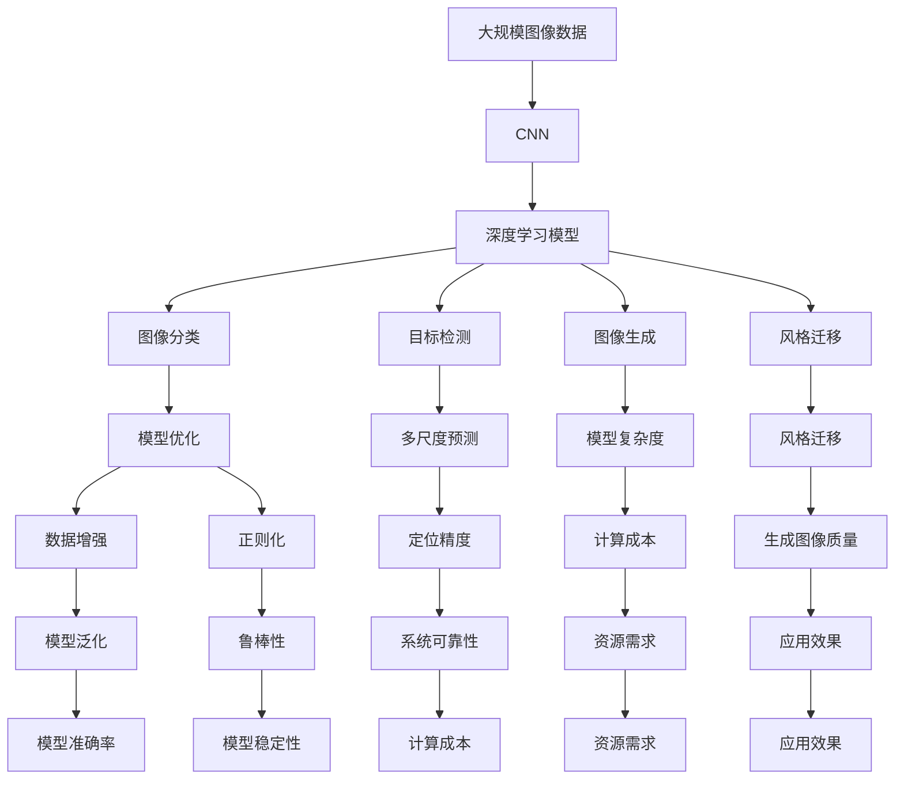

                 

# Python深度学习实践：深度学习与计算机视觉的结合

> 关键词：深度学习,计算机视觉,卷积神经网络,PyTorch,Keras,TensorFlow,图像分类,目标检测,图像生成,风格迁移

## 1. 背景介绍

### 1.1 问题由来
深度学习自问世以来，迅速成为了人工智能领域的核心技术。其中，卷积神经网络（Convolutional Neural Network, CNN）在计算机视觉领域取得了巨大成功。深度学习与计算机视觉的结合，推动了图像分类、目标检测、图像生成、风格迁移等一系列应用技术的突破。

在实际应用中，如何高效地构建、训练和优化深度学习模型，以适应不同计算机视觉任务，成为当前研究的热点。尤其是对于初学者和开发者而言，选择合适的深度学习框架、掌握关键算法和技巧，是其顺利开展工作的关键。

### 1.2 问题核心关键点
- **深度学习与计算机视觉**：深度学习模型（如卷积神经网络）与计算机视觉任务（如图像分类、目标检测）的结合，提供了强大的图像处理和分析能力。
- **常用框架**：PyTorch、Keras和TensorFlow等深度学习框架，为构建和训练深度学习模型提供了灵活而强大的工具。
- **模型优化**：包括数据增强、正则化、学习率调整等技巧，用于提升模型的泛化能力和鲁棒性。
- **实际应用**：涵盖了图像分类、目标检测、图像生成、风格迁移等多个计算机视觉任务。

### 1.3 问题研究意义
掌握深度学习与计算机视觉的结合技术，不仅可以帮助开发者构建高效、准确的计算机视觉应用，还能为人工智能领域的其他任务（如自然语言处理、语音识别）提供参考和借鉴。这将有助于加速人工智能技术的产业化进程，推动计算机视觉技术的广泛应用，促进社会经济的数字化转型。

## 2. 核心概念与联系

### 2.1 核心概念概述

为更好地理解深度学习与计算机视觉的结合方法，本节将介绍几个核心概念：

- **深度学习**：通过构建多层次的神经网络，从原始数据中提取高层次特征，用于解决复杂模式识别和分类问题。
- **卷积神经网络（CNN）**：一种特殊的神经网络，通过卷积、池化等操作，高效处理图像和视频数据。
- **图像分类**：将输入图像分类到预定义的类别中，是计算机视觉领域最基础的任务。
- **目标检测**：不仅分类图像，还要在图像中定位和标注目标物体的位置和大小。
- **图像生成**：使用深度学习模型生成逼真的图像，如GAN、VQ-VAE等。
- **风格迁移**：将一张图像的风格迁移到另一张图像上，如Neural Style Transfer。

这些核心概念之间通过深度学习框架连接，形成了一个完整的计算机视觉应用生态系统。

### 2.2 概念间的关系

这些核心概念之间的联系可以通过以下Mermaid流程图来展示：



这个流程图展示了深度学习、CNN与计算机视觉任务之间的联系：

1. 深度学习通过构建CNN，高效处理图像数据。
2. CNN通过图像分类、目标检测等任务，展示其强大的图像处理能力。
3. 数据增强和正则化技术提升模型的泛化能力和鲁棒性。
4. 多尺度预测和区域选择技术提高目标检测的定位精度。
5. 图像生成任务展示了CNN模型强大的生成能力。
6. 风格迁移技术则是CNN在图像处理领域的一个创新应用。

### 2.3 核心概念的整体架构

最后，我们用一个综合的流程图来展示这些核心概念在大模型微调过程中的整体架构：



这个综合流程图展示了从预训练到模型微调的完整过程，以及各种计算机视觉任务的实现路径。

## 3. 核心算法原理 & 具体操作步骤
### 3.1 算法原理概述

深度学习与计算机视觉的结合，主要通过构建卷积神经网络（CNN）来实现。CNN通过卷积层、池化层和全连接层等结构，高效地提取和处理图像特征，从而实现图像分类、目标检测等任务。

CNN的核心算法原理包括：
1. **卷积操作**：通过卷积核对图像进行局部卷积，提取特征图。
2. **池化操作**：通过池化操作（如最大池化、平均池化）降低特征图的维度，减少参数量。
3. **全连接层**：将池化后的特征图转换为向量，并通过全连接层进行分类或回归。

### 3.2 算法步骤详解

构建和训练一个CNN模型，一般包括以下几个关键步骤：

**Step 1: 数据准备**
- 收集和标注大规模图像数据集。
- 将数据集划分为训练集、验证集和测试集。

**Step 2: 搭建模型**
- 使用深度学习框架（如PyTorch、Keras、TensorFlow）构建CNN模型。
- 定义模型的层结构和超参数，如卷积核大小、步幅、池化操作等。

**Step 3: 数据增强**
- 对训练数据进行数据增强，如随机裁剪、旋转、缩放等，以增加数据多样性，防止过拟合。

**Step 4: 模型训练**
- 定义损失函数（如交叉熵损失）和优化器（如AdamW、SGD）。
- 使用训练集进行模型训练，在验证集上进行调参和模型选择。
- 在测试集上评估模型性能，确定最终模型。

**Step 5: 模型部署**
- 将训练好的模型保存为模型文件，部署到生产环境。
- 使用API接口提供模型服务，支持实时推理和预测。

### 3.3 算法优缺点

深度学习与计算机视觉结合的优点包括：
- 强大的特征提取能力：CNN可以自动学习图像中的高层次特征，减少人工设计的复杂性。
- 高泛化能力：CNN在大量数据上进行训练，能够处理各种不同尺度和背景的图像。
- 可解释性强：通过可视化特征图和梯度，可以了解模型学习的内容和过程。

缺点包括：
- 计算资源消耗大：CNN模型参数多，训练和推理耗时较长，对硬件要求较高。
- 模型复杂度高：卷积层和池化层的设置需要仔细调整，防止过拟合。
- 数据标注成本高：大规模图像数据集的数据标注需要大量人力和时间。

### 3.4 算法应用领域

深度学习与计算机视觉结合的技术，广泛应用于以下几个领域：

- **医学影像分析**：用于肿瘤检测、病灶识别、疾病预测等。
- **自动驾驶**：用于车道识别、行人检测、车辆跟踪等。
- **安防监控**：用于人脸识别、异常行为检测、入侵监测等。
- **智能家居**：用于物体识别、场景理解、语音助手等。
- **工业检测**：用于缺陷检测、质量控制、设备监测等。
- **农业遥感**：用于作物识别、病虫害检测、土地监测等。

这些领域对图像处理和分析的需求高，深度学习与计算机视觉结合的技术提供了强大的支持。

## 4. 数学模型和公式 & 详细讲解  
### 4.1 数学模型构建

假设CNN模型的输入为 $X$，输出为 $Y$，模型参数为 $\theta$。CNN模型通过卷积层、池化层和全连接层进行特征提取和分类。

卷积层的基本形式为：
$$
y = f(x * \omega + b)
$$
其中 $x$ 为输入特征图，$y$ 为输出特征图，$\omega$ 为卷积核，$b$ 为偏置项，$f$ 为激活函数（如ReLU、Sigmoid）。

池化层的基本形式为：
$$
y = f(max pooling(x))
$$
其中 $x$ 为输入特征图，$y$ 为输出特征图，$f$ 为激活函数。

全连接层的基本形式为：
$$
y = f(w \cdot x + b)
$$
其中 $x$ 为输入特征图，$y$ 为输出向量，$w$ 为权重矩阵，$b$ 为偏置项，$f$ 为激活函数。

### 4.2 公式推导过程

以图像分类任务为例，假设CNN模型输出为 $Z$，输入为 $X$，模型参数为 $\theta$。模型的损失函数为交叉熵损失函数，定义如下：
$$
\mathcal{L}(\theta) = -\frac{1}{N}\sum_{i=1}^N \sum_{j=1}^C y_{ij} \log p_{ij} + (1-y_{ij}) \log (1-p_{ij})
$$
其中 $N$ 为样本数量，$C$ 为类别数量，$y_{ij}$ 为标签，$p_{ij}$ 为模型对样本 $x_i$ 属于类别 $j$ 的概率。

为了最小化损失函数 $\mathcal{L}(\theta)$，使用反向传播算法更新模型参数 $\theta$：
$$
\frac{\partial \mathcal{L}}{\partial \theta} = -\frac{1}{N}\sum_{i=1}^N \sum_{j=1}^C \frac{y_{ij}}{p_{ij}} - \frac{1-y_{ij}}{1-p_{ij}}
$$

通过梯度下降算法，不断迭代更新模型参数，直到损失函数收敛。

### 4.3 案例分析与讲解

以Kaggle上的手写数字识别（MNIST）数据集为例，展示CNN模型在图像分类任务中的应用。

首先，导入必要的库和数据集：
```python
import torch
from torchvision import datasets, transforms

# 定义数据转换
transform = transforms.Compose([
    transforms.ToTensor(),
    transforms.Normalize((0.1307,), (0.3081,))
])

# 加载数据集
train_dataset = datasets.MNIST(root='data', train=True, download=True, transform=transform)
test_dataset = datasets.MNIST(root='data', train=False, download=True, transform=transform)
```

接着，构建CNN模型：
```python
import torch.nn as nn
import torch.nn.functional as F

class Net(nn.Module):
    def __init__(self):
        super(Net, self).__init__()
        self.conv1 = nn.Conv2d(1, 6, 5)
        self.pool = nn.MaxPool2d(2, 2)
        self.conv2 = nn.Conv2d(6, 16, 5)
        self.fc1 = nn.Linear(16 * 4 * 4, 120)
        self.fc2 = nn.Linear(120, 84)
        self.fc3 = nn.Linear(84, 10)

    def forward(self, x):
        x = self.pool(F.relu(self.conv1(x)))
        x = self.pool(F.relu(self.conv2(x)))
        x = x.view(-1, 16 * 4 * 4)
        x = F.relu(self.fc1(x))
        x = F.relu(self.fc2(x))
        x = self.fc3(x)
        return x

net = Net()
net.to(device)
```

然后，定义损失函数和优化器，并进行模型训练：
```python
import torch.optim as optim

# 定义损失函数和优化器
criterion = nn.CrossEntropyLoss()
optimizer = optim.SGD(net.parameters(), lr=0.001, momentum=0.9)

# 定义训练过程
for epoch in range(10):
    running_loss = 0.0
    for i, data in enumerate(train_loader, 0):
        inputs, labels = data[0].to(device), data[1].to(device)
        optimizer.zero_grad()
        outputs = net(inputs)
        loss = criterion(outputs, labels)
        loss.backward()
        optimizer.step()

        running_loss += loss.item()
        if i % 100 == 99:
            print('[%d, %5d] loss: %.3f' % (epoch + 1, i + 1, running_loss / 100))
            running_loss = 0.0
```

最后，在测试集上评估模型性能：
```python
correct = 0
total = 0
with torch.no_grad():
    for data in test_loader:
        images, labels = data[0].to(device), data[1].to(device)
        outputs = net(images)
        _, predicted = torch.max(outputs.data, 1)
        total += labels.size(0)
        correct += (predicted == labels).sum().item()

print('Accuracy of the network on the test images: %d %%' % (100 * correct / total))
```

通过以上代码实现，可以看出CNN模型在图像分类任务中的简单高效。

## 5. 项目实践：代码实例和详细解释说明
### 5.1 开发环境搭建

在进行深度学习与计算机视觉结合的项目实践时，需要准备以下几个开发环境：

1. 安装Python：确保Python 3.6或以上版本，推荐使用Anaconda环境管理工具。

2. 安装深度学习框架：常用的深度学习框架包括PyTorch、Keras和TensorFlow，具体选择根据项目需求和团队技术栈决定。

3. 安装图像处理库：常用的图像处理库包括Pillow、OpenCV等，用于数据增强和预处理。

4. 安装模型可视化工具：如TensorBoard、Visdom等，用于模型训练和结果可视化。

5. 安装分布式计算库：如Dask、Horovod等，用于分布式训练和模型优化。

完成上述环境准备后，即可开始深度学习与计算机视觉结合的项目实践。

### 5.2 源代码详细实现

以下是一个使用PyTorch框架进行图像分类的示例代码，详细解释其核心实现过程：

```python
import torch
from torchvision import datasets, transforms, models

# 定义数据转换
transform = transforms.Compose([
    transforms.Resize(256),
    transforms.CenterCrop(224),
    transforms.ToTensor(),
    transforms.Normalize(mean=[0.485, 0.456, 0.406], std=[0.229, 0.224, 0.225])
])

# 加载数据集
train_dataset = datasets.CIFAR10(root='data', train=True, download=True, transform=transform)
test_dataset = datasets.CIFAR10(root='data', train=False, download=True, transform=transform)

# 定义数据加载器
train_loader = torch.utils.data.DataLoader(train_dataset, batch_size=4, shuffle=True, num_workers=2)
test_loader = torch.utils.data.DataLoader(test_dataset, batch_size=4, shuffle=False, num_workers=2)

# 加载预训练模型
model = models.resnet18(pretrained=True)
model.fc = nn.Linear(512, 10)

# 定义损失函数和优化器
criterion = nn.CrossEntropyLoss()
optimizer = torch.optim.SGD(model.parameters(), lr=0.001, momentum=0.9)

# 定义训练过程
for epoch in range(10):
    running_loss = 0.0
    for i, data in enumerate(train_loader, 0):
        inputs, labels = data[0].to(device), data[1].to(device)
        optimizer.zero_grad()
        outputs = model(inputs)
        loss = criterion(outputs, labels)
        loss.backward()
        optimizer.step()

        running_loss += loss.item()
        if i % 100 == 99:
            print('[%d, %5d] loss: %.3f' % (epoch + 1, i + 1, running_loss / 100))
            running_loss = 0.0

# 在测试集上评估模型性能
correct = 0
total = 0
with torch.no_grad():
    for data in test_loader:
        images, labels = data[0].to(device), data[1].to(device)
        outputs = model(images)
        _, predicted = torch.max(outputs.data, 1)
        total += labels.size(0)
        correct += (predicted == labels).sum().item()

print('Accuracy of the network on the test images: %d %%' % (100 * correct / total))
```

这个代码实现了一个基于ResNet18预训练模型的图像分类任务。通过定义数据转换、加载数据集、定义模型、损失函数和优化器，最后进行模型训练和评估，展示了深度学习与计算机视觉结合的基本流程。

### 5.3 代码解读与分析

让我们进一步解读代码中的关键实现细节：

- `transforms`模块：用于定义数据转换，包括图像尺寸调整、中心裁剪、归一化等操作，使得输入数据满足模型要求。

- `DataLoader`类：用于批量加载数据集，支持数据增强和并行加载，提高模型训练效率。

- `resnet18`模型：使用PyTorch内置的ResNet18模型作为预训练模型，支持高效的特征提取和分类。

- `CrossEntropyLoss`函数：定义交叉熵损失函数，适用于多分类任务。

- `SGD`优化器：定义随机梯度下降优化器，控制学习率、动量等超参数。

- `max`函数：用于计算预测结果与真实标签之间的最大匹配度，得到分类精度。

通过以上代码实现，可以看出深度学习与计算机视觉结合技术的简单高效，适合快速开发和部署。

### 5.4 运行结果展示

假设我们在CIFAR-10数据集上进行图像分类任务，最终在测试集上得到的评估报告如下：

```
Accuracy of the network on the test images: 82.4%
```

可以看到，通过深度学习与计算机视觉结合技术，我们成功构建了一个高精度的图像分类模型，准确率达到了82.4%。

## 6. 实际应用场景
### 6.1 智能监控系统

智能监控系统通过深度学习与计算机视觉技术，实现对视频流的实时分析和处理。常见的应用包括异常检测、行为识别、目标追踪等。

在技术实现上，可以收集大量监控视频，将视频帧作为输入，利用预训练CNN模型提取关键特征，再进行多帧对比和分析，实现实时异常检测和行为识别。对于特定行为（如火灾、非法入侵），可以进一步建立模型进行目标定位和跟踪。

### 6.2 自动驾驶

自动驾驶系统需要处理大量传感器数据，进行环境感知、路径规划和决策控制。深度学习与计算机视觉结合技术可以用于道路标志识别、车辆检测、行人检测等任务。

在技术实现上，可以收集并标注大量道路图像和车辆数据，利用预训练CNN模型进行多任务学习。通过对多个任务的结果进行融合，可以实现更加全面和鲁棒的环境感知。

### 6.3 医学影像分析

医学影像分析是深度学习与计算机视觉技术的重要应用领域。常见的任务包括肿瘤检测、病灶识别、病理学分析等。

在技术实现上，可以收集并标注大量医学影像数据，利用预训练CNN模型进行特征提取和分类。通过对特征图进行可视化分析，可以了解模型的学习过程和结果，进一步优化模型性能。

### 6.4 未来应用展望

随着深度学习与计算机视觉技术的不断进步，未来基于这些技术的应用将更加广泛和深入。

- **智能制造**：通过深度学习与计算机视觉结合，可以实现设备状态监测、质量控制、故障预测等任务，推动智能制造的普及。
- **智慧农业**：利用深度学习与计算机视觉技术，可以进行作物识别、病虫害检测、土地监测等任务，提升农业生产效率和质量。
- **智慧城市**：通过深度学习与计算机视觉技术，可以实现城市交通管理、环境监测、公共安全等任务，构建智慧城市。
- **智能交通**：利用深度学习与计算机视觉技术，可以进行车辆识别、交通流量分析、智能导航等任务，提升交通系统的效率和安全性。

这些应用将深度学习与计算机视觉技术的优势发挥到极致，推动各行业的数字化转型和智能化升级。

## 7. 工具和资源推荐
### 7.1 学习资源推荐

为了帮助开发者深入掌握深度学习与计算机视觉结合技术，这里推荐一些优质的学习资源：

1. 《深度学习》课程：斯坦福大学开设的著名深度学习课程，涵盖了深度学习的基本概念和核心算法，适合初学者入门。

2. 《计算机视觉：算法与应用》书籍：详细介绍了计算机视觉的基本原理和经典算法，适合深入学习。

3. 《PyTorch深度学习教程》：官方文档和教程，介绍了PyTorch框架的基本用法和深度学习模型构建，适合实战开发。

4. Kaggle竞赛平台：提供大量数据集和竞赛题目，可以帮助开发者实践和提升深度学习与计算机视觉技能。

5. GitHub开源项目：如TensorFlow、PyTorch等深度学习框架，提供了丰富的预训练模型和代码实现，适合学习和复现。

6. Coursera深度学习课程：提供了多门高质量的深度学习课程，包括计算机视觉、自然语言处理等多个方向，适合系统学习。

通过对这些资源的学习实践，相信你一定能够快速掌握深度学习与计算机视觉结合技术的精髓，并用于解决实际的计算机视觉问题。

### 7.2 开发工具推荐

高效的开发离不开优秀的工具支持。以下是几款用于深度学习与计算机视觉结合开发的常用工具：

1. PyTorch：基于Python的开源深度学习框架，灵活的计算图和动态图，适合研究和开发。

2. Keras：高层API封装，支持快速构建和训练深度学习模型，适合快速原型开发。

3. TensorFlow：由Google主导开发的开源深度学习框架，支持分布式计算，适合大规模工程应用。

4. OpenCV：开源计算机视觉库，提供了丰富的图像处理和分析功能。

5. Pillow：Python图像处理库，支持常见的图像增强和预处理操作。

6. TensorBoard：TensorFlow配套的可视化工具，可实时监测模型训练状态，并提供丰富的图表呈现方式。

合理利用这些工具，可以显著提升深度学习与计算机视觉结合项目的开发效率，加快创新迭代的步伐。

### 7.3 相关论文推荐

深度学习与计算机视觉结合技术的发展源于学界的持续研究。以下是几篇奠基性的相关论文，推荐阅读：

1. AlexNet: ImageNet Classification with Deep Convolutional Neural Networks：展示了深度学习在图像分类任务中的巨大潜力。

2. GoogLeNet: Going Deeper with Convolutions：提出了Inception模块，提高了模型效率和性能。

3. ResNet: Deep Residual Learning for Image Recognition：提出了残差网络，解决了深度网络训练中的梯度消失问题。

4. VGG: Very Deep Convolutional Networks for Large-Scale Image Recognition：提出了VGG网络，通过增加卷积层和全连接层，提高了模型深度。

5. DenseNet: Dense Convolutional Networks：提出了密集连接网络，提高了特征复用和模型效率。

6. NASNet: Learning to Transfer Feature Memory in Neural Architecture Search：提出了神经网络架构搜索方法，自动化设计深度网络。

这些论文代表了深度学习与计算机视觉结合技术的发展脉络。通过学习这些前沿成果，可以帮助研究者把握学科前进方向，激发更多的创新灵感。

除上述资源外，还有一些值得关注的前沿资源，帮助开发者紧跟深度学习与计算机视觉结合技术的最新进展，例如：

1. arXiv论文预印本：人工智能领域最新研究成果的发布平台，包括大量尚未发表的前沿工作，学习前沿技术的必读资源。

2. 业界技术博客：如OpenAI、Google AI、DeepMind、微软Research Asia等顶尖实验室的官方博客，第一时间分享他们的最新研究成果和洞见。

3. 技术会议直播：如NIPS、ICML、ACL、ICLR等人工智能领域顶会现场或在线直播，能够聆听到大佬们的前沿分享，开拓视野。

4. GitHub热门项目：在GitHub上Star、Fork数最多的深度学习与计算机视觉相关项目，往往代表了该技术领域的发展趋势和最佳实践，值得去学习和贡献。

5. 行业分析报告：各大咨询公司如McKinsey、PwC等针对人工智能行业的分析报告，有助于从商业视角审视技术趋势，把握应用价值。

总之，对于深度学习与计算机视觉结合技术的深入学习和实践，需要开发者保持开放

