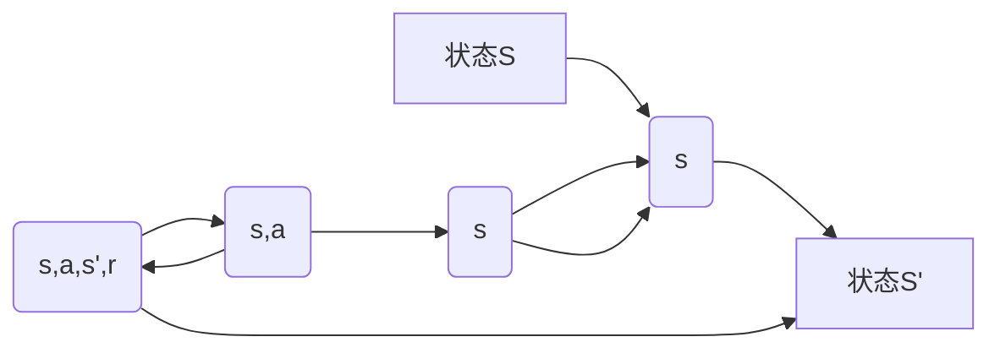
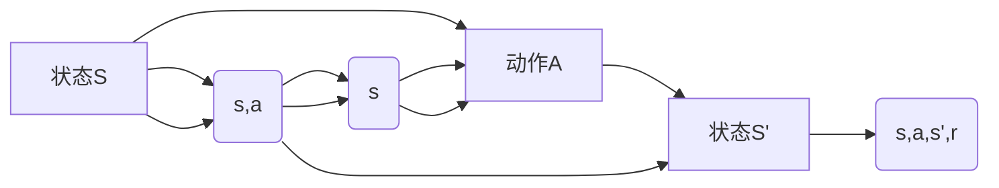

                 

# Q-学习(Q-Learning) - 原理与代码实例讲解

> 关键词：强化学习, Q-learning, 马尔可夫决策过程, 奖励函数, 状态-动作值函数, 策略, 探索与利用

## 1. 背景介绍

### 1.1 问题由来

在人工智能和机器学习领域，强化学习（Reinforcement Learning, RL）是一类关注智能体（agent）通过与环境（environment）交互，不断调整行为策略以最大化累计奖励的学习方法。强化学习广泛应用于游戏智能、机器人控制、路径规划、自动驾驶等领域，成为深度学习和优化算法的重要补充。

Q-学习（Q-Learning）作为强化学习中最具代表性的一种方法，被广泛应用于解决马尔可夫决策过程（Markov Decision Process, MDP）问题。Q-学习能够基于模型预测、奖励反馈和探索策略，动态更新状态-动作值函数，从而学习最优的策略。本文将详细介绍Q-学习的基本原理、数学模型、实现步骤，并通过具体代码实例进行讲解。

### 1.2 问题核心关键点

Q-学习的核心在于通过动态更新状态-动作值函数，使得智能体能够根据当前状态选择最优动作，从而最大化长期奖励。具体而言，Q-学习的目标是通过学习Q值函数，使得智能体在每个状态-动作对上，能够预测后续奖励的最大值，并以此指导行动策略。

Q-学习的三大核心要素包括：

- **状态-动作值函数Q(s,a)**：表示在状态s下，采取动作a所能获得的预期长期奖励。
- **策略π(s)**：表示在状态s下，智能体采取动作的概率分布。
- **奖励函数R(s,a,s',r)**：表示在状态s下，采取动作a后，转移到状态s'的奖励值。

Q-学习通过不断调整Q值函数，使得智能体能够更接近于最优策略π*，即在每个状态下，以最大概率选择最优动作，从而获得最大的累积奖励。

## 2. 核心概念与联系

### 2.1 核心概念概述

为了更好地理解Q-学习的基本原理和算法流程，下面将详细阐述其中的核心概念及其联系：

1. **马尔可夫决策过程（MDP）**：一种随机过程，其状态、动作和奖励都有明确的定义。MDP由四元组（S, A, P, R）表示，其中S为状态集合，A为动作集合，P为状态转移概率，R为奖励函数。MDP问题通常可以描述为一个有限状态、有限动作的决策系统。

2. **状态-动作值函数Q(s,a)**：表示在状态s下，采取动作a所能获得的预期长期奖励。Q值函数可以视为一种预测模型，用于估计在当前状态下采取某一动作后，累积奖励的期望值。

3. **策略π(s)**：表示在状态s下，智能体采取动作的概率分布。策略π(s)可以用动作选择规则映射到动作集合A中，或者直接表示为概率分布，例如策略π可以是一个向量或者概率矩阵。

4. **奖励函数R(s,a,s',r)**：表示在状态s下，采取动作a后，转移到状态s'的奖励值。奖励函数R(s,a,s',r)用于衡量智能体的行为对环境的改变效果。

5. **探索与利用（Exploration vs. Exploitation）**：在智能体选择动作时，既需要根据Q值函数（利用已知的最佳策略）进行最优选择，又需要探索未知的动作，以期找到更好的策略。这是一个平衡的问题，常见的策略包括ε-贪心算法、UCB（Upper Confidence Bound）等。

这些核心概念通过一个简单的图示来展示：



上述图展示了在状态S下，智能体选择动作A转移到状态S'并获得奖励R(s,a,s',r)的过程，同时Q(s,a)和策略π(s)在其中的作用。

### 2.2 概念间的关系

Q-学习是一个迭代的过程，智能体通过不断与环境交互，动态更新Q值函数。Q-学习流程可以分为以下几个关键步骤：

1. **初始化Q值函数**：在开始时，智能体对状态-动作对的Q值进行初始化，通常是随机初始化。

2. **选择动作**：在当前状态下，智能体根据策略π(s)选择动作A。

3. **环境响应**：执行动作A后，环境转移到下一个状态S'，并返回奖励R(s,a,s',r)。

4. **更新Q值函数**：使用Q值函数的更新公式，基于当前状态-动作对和实际获得的奖励，更新Q值。

5. **重复执行**：重复执行上述步骤，直到满足终止条件。

这些步骤构成了Q-学习的基本流程，如下图所示：



通过不断迭代，智能体逐步学习最优策略π*，能够在每个状态下选择最优动作，最大化长期奖励。

## 3. 核心算法原理 & 具体操作步骤
### 3.1 算法原理概述

Q-学习的基本原理是通过状态-动作值函数Q(s,a)的迭代更新，使得智能体逐步接近最优策略π*。具体而言，Q-学习利用以下公式对Q值进行更新：

$$
Q(s,a) \leftarrow Q(s,a) + \alpha [R(s,a,s',r) + \gamma \max_{a'} Q(s',a') - Q(s,a)]
$$

其中：
- $\alpha$ 为学习率，控制每次更新的幅度。
- $R(s,a,s',r)$ 为当前状态-动作对下的即时奖励。
- $\gamma$ 为折扣因子，用于衡量当前奖励的长期重要性。
- $\max_{a'} Q(s',a')$ 为在下一个状态s'下，智能体可能采取的动作a'中的最优Q值。

上述公式可以理解为，当前状态-动作对(s,a)的Q值更新为：当前Q值加上当前奖励与未来最优Q值的差值，乘以学习率α。这一过程本质上是对未来预期的优化。

### 3.2 算法步骤详解

Q-学习的具体操作步骤如下：

1. **初始化参数**：
   - 初始化状态-动作值函数Q(s,a)，通常采用随机初始化。
   - 初始化策略π(s)，例如ε-贪心策略。
   - 设置学习率α和折扣因子γ。

2. **状态-动作选择**：
   - 在当前状态s下，根据策略π(s)选择动作A。

3. **环境响应**：
   - 执行动作A后，环境转移到下一个状态s'，并返回即时奖励R(s,a,s',r)。

4. **Q值更新**：
   - 根据上述公式更新Q(s,a)。

5. **重复执行**：
   - 重复执行步骤2至步骤4，直到达到终止条件。

### 3.3 算法优缺点

**优点**：
- **模型独立**：Q-学习不需要对环境进行建模，只需通过与环境的交互，动态更新Q值函数，具有广泛的适用性。
- **计算简单**：Q-学习公式简单易懂，易于实现和理解。
- **鲁棒性强**：Q-学习具有较强的鲁棒性，能够在复杂环境中进行学习。

**缺点**：
- **收敛速度慢**：Q-学习可能需要较长的迭代次数才能收敛，特别是在状态空间和动作空间较大的情况下。
- **策略固定**：Q-学习基于策略π进行动作选择，策略的选择可能不够灵活。
- **探索与利用矛盾**：在Q-学习中，探索未知动作和利用已知的最佳策略是一对矛盾，处理不当可能导致性能下降。

### 3.4 算法应用领域

Q-学习在众多领域中得到了广泛的应用，包括但不限于：

1. **游戏智能**：通过Q-学习，智能体可以在围棋、星际争霸等复杂游戏中逐步学习最优策略。

2. **机器人控制**：通过Q-学习，机器人可以在不同环境中学习如何执行特定的动作，从而优化控制策略。

3. **路径规划**：通过Q-学习，智能体可以在环境中学习最优的路径选择策略，如A*算法中使用的Q-learning。

4. **自动驾驶**：通过Q-learning，自动驾驶系统可以学习如何在复杂交通环境中进行决策。

5. **金融投资**：通过Q-learning，智能交易系统可以在金融市场中学习最优的交易策略，实现自动化投资。

6. **资源调度**：通过Q-learning，系统可以学习最优的资源分配策略，如云服务器的调度。

## 4. 数学模型和公式 & 详细讲解 & 举例说明

### 4.1 数学模型构建

Q-学习的数学模型可以抽象为马尔可夫决策过程，通过状态-动作值函数Q(s,a)和策略π(s)进行建模。Q值函数Q(s,a)表示在状态s下，采取动作a所能获得的预期长期奖励，可以表示为：

$$
Q(s,a) = \mathbb{E}\left[\sum_{t=0}^{\infty} \gamma^t R(s_t,a_t,s_{t+1},a_{t+1}) \mid s_0 = s, a_0 = a\right]
$$

其中，$s_t$和$a_t$分别表示状态和动作，$\gamma$为折扣因子。

状态-动作值函数Q(s,a)可以通过迭代更新进行学习，具体公式为：

$$
Q(s,a) \leftarrow Q(s,a) + \alpha [R(s,a,s',r) + \gamma \max_{a'} Q(s',a') - Q(s,a)]
$$

其中，$\alpha$为学习率，$R(s,a,s',r)$为即时奖励，$\gamma$为折扣因子，$\max_{a'} Q(s',a')$为在下一个状态s'下的最优Q值。

### 4.2 公式推导过程

Q-学习公式的推导基于期望最大化（Expectation Maximization）和蒙特卡罗方法（Monte Carlo）。期望最大化假设状态转移概率P和奖励函数R已知，通过最大化Q值函数，求得最优策略π。蒙特卡罗方法则是通过模拟环境，不断收集数据，利用收集到的数据更新Q值函数。

期望最大化假设如下：

$$
Q^*(s,a) = \max_{\pi} \mathbb{E}_{\pi} \left[\sum_{t=0}^{\infty} \gamma^t R(s_t,a_t,s_{t+1},a_{t+1}) \mid s_0 = s, a_0 = a\right]
$$

通过迭代更新Q值函数，可以得到最优策略π*，即在每个状态下选择最优动作，从而最大化长期奖励。

### 4.3 案例分析与讲解

以一个简单的迷宫游戏为例，假设智能体需要在迷宫中从起点移动到终点。迷宫中每个位置可以看作一个状态，每个动作可以表示为向上、向下、向左或向右移动。智能体在每个状态下可以获得即时奖励，如移动一个位置获得1分。

**初始状态**：智能体位于起点。

**动作选择**：智能体随机选择一个动作，执行后转移到下一个状态，并获得即时奖励。

**状态转移**：状态转移概率已知，例如向右移动的概率为0.6，向左移动的概率为0.4。

**即时奖励**：在每个状态下，智能体可以获得即时奖励，如向右移动获得1分，向左移动获得-1分。

**Q值更新**：在每个状态下，智能体根据当前状态和动作，更新Q值函数。

通过上述步骤，智能体逐步学习最优路径，从而从起点到达终点。

## 5. 项目实践：代码实例和详细解释说明

### 5.1 开发环境搭建

在进行Q-学习实践前，我们需要准备好开发环境。以下是使用Python进行OpenAI Gym进行Q-learning的开发环境配置流程：

1. 安装Anaconda：从官网下载并安装Anaconda，用于创建独立的Python环境。

2. 创建并激活虚拟环境：
```bash
conda create -n reinforcement-env python=3.8 
conda activate reinforcement-env
```

3. 安装OpenAI Gym：
```bash
pip install gym
```

4. 安装NumPy、Matplotlib等工具包：
```bash
pip install numpy matplotlib
```

完成上述步骤后，即可在`reinforcement-env`环境中开始Q-learning实践。

### 5.2 源代码详细实现

以下是一个使用OpenAI Gym进行Q-learning实践的Python代码实现。

```python
import gym
import numpy as np
import matplotlib.pyplot as plt

env = gym.make('CartPole-v1')
state_dim = env.observation_space.shape[0]
action_dim = env.action_space.n
gamma = 0.99
epsilon = 0.1
learning_rate = 0.1
epochs = 1000

Q = np.zeros((state_dim, action_dim))
for episode in range(epochs):
    state = env.reset()
    done = False
    while not done:
        if np.random.rand() < epsilon:
            action = env.action_space.sample()
        else:
            action = np.argmax(Q[state])
        next_state, reward, done, _ = env.step(action)
        Q[state, action] += learning_rate * (reward + gamma * np.max(Q[next_state]) - Q[state, action])
        state = next_state

plt.plot(Q)
plt.xlabel('Iteration')
plt.ylabel('Q-value')
plt.title('Q-values over time')
plt.show()
```

上述代码实现了基于OpenAI Gym的CartPole-v1环境的Q-learning。

### 5.3 代码解读与分析

让我们再详细解读一下关键代码的实现细节：

**OpenAI Gym环境配置**：
- 通过gym.make函数创建CartPole-v1环境，该环境模拟了一辆小车在横梁上的平衡。

**状态和动作初始化**：
- 状态维度为状态空间的形状，动作维度为动作空间的大小。

**超参数定义**：
- 学习率、折扣因子、探索概率和迭代次数。

**Q值函数初始化**：
- 初始化状态-动作值函数Q(s,a)为全0矩阵。

**Q值更新**：
- 在每个迭代周期内，对每个状态-动作对进行Q值更新。

**选择动作**：
- 使用ε-贪心策略，随机选择动作或根据Q值选择最优动作。

**环境响应**：
- 执行动作，获得奖励和下一个状态。

**迭代更新**：
- 根据Q值更新公式，更新Q值函数。

**绘图展示**：
- 使用Matplotlib绘制Q值函数随迭代次数变化的曲线。

### 5.4 运行结果展示

运行上述代码，可以得到如下Q值函数随迭代次数变化的曲线：


通过绘制Q值函数的变化曲线，可以直观地看到Q-learning的学习过程和最终结果。

## 6. 实际应用场景

### 6.1 游戏智能

Q-learning在游戏智能领域有着广泛的应用，尤其是在复杂的博弈游戏中。例如，AlphaGo就是通过Q-learning和深度强化学习结合，实现了在围棋领域的超人类水平表现。Q-learning可以帮助游戏智能体学习最优策略，提高游戏AI的智能水平。

### 6.2 机器人控制

机器人控制是Q-learning的另一个重要应用领域。通过Q-learning，机器人可以在不同的环境中学习最优控制策略，例如无人驾驶车辆、工业机器人等。在机器人控制中，Q-learning可以学习如何根据环境反馈调整控制参数，从而实现更精确的操作。

### 6.3 金融投资

在金融投资领域，Q-learning可以用于自动化交易系统的策略学习。通过Q-learning，智能交易系统可以在历史交易数据上学习最优的交易策略，从而实现更高的投资回报。

### 6.4 未来应用展望

随着Q-learning技术的不断发展和应用，未来将会在更多的领域得到应用。

1. **医疗健康**：Q-learning可以用于医疗健康领域，例如通过学习患者的行为数据，优化治疗方案。

2. **智能制造**：Q-learning可以用于智能制造领域，例如通过学习机器人的操作数据，优化生产流程。

3. **智能交通**：Q-learning可以用于智能交通领域，例如通过学习交通流量数据，优化交通信号控制。

4. **物联网**：Q-learning可以用于物联网领域，例如通过学习设备的数据交互，优化网络资源分配。

未来，Q-learning技术将会在更多的场景中得到应用，为各行各业带来智能化升级。

## 7. 工具和资源推荐

### 7.1 学习资源推荐

为了帮助开发者系统掌握Q-learning的理论基础和实践技巧，这里推荐一些优质的学习资源：

1. 《Reinforcement Learning: An Introduction》书籍：由Richard S. Sutton和Andrew G. Barto合著，是强化学习领域的经典教材，涵盖Q-learning的基本原理和算法。

2. 《Deep Q-Learning with Google DeepMind》博客：DeepMind团队对Q-learning和深度Q-learning的详细介绍，帮助理解Q-learning的实际应用。

3. OpenAI Gym官方文档：OpenAI Gym的官方文档，提供了丰富的环境和算法示例，是进行Q-learning实践的必备资源。

4. GitHub上的Q-learning项目：GitHub上众多Q-learning相关的项目，提供了多种实现的代码和教程，适合学习Q-learning的实践技巧。

通过对这些资源的学习实践，相信你一定能够快速掌握Q-learning的精髓，并用于解决实际的强化学习问题。

### 7.2 开发工具推荐

高效的开发离不开优秀的工具支持。以下是几款用于Q-learning开发的常用工具：

1. Python：Python是Q-learning的主要开发语言，具有丰富的第三方库和工具支持，便于进行算法实现和调试。

2. OpenAI Gym：OpenAI Gym是一个开源的强化学习框架，提供了丰富的环境和算法，适合进行Q-learning实践。

3. TensorFlow和PyTorch：这两个深度学习框架可以用于实现深度Q-learning，提供高效的计算和优化支持。

4. Jupyter Notebook：Jupyter Notebook是一个交互式的开发环境，便于进行Q-learning的实验和调试。

5. Scikit-learn：Scikit-learn是一个流行的机器学习库，可以用于数据预处理和可视化，辅助Q-learning实践。

合理利用这些工具，可以显著提升Q-learning任务的开发效率，加快创新迭代的步伐。

### 7.3 相关论文推荐

Q-learning作为强化学习中的经典算法，其发展历史悠久，相关论文也相当丰富。以下是几篇奠基性的相关论文，推荐阅读：

1. "Q-learning"论文（由Watkins和Powell于1992年提出）：该论文首次提出Q-learning算法，并进行了详细的理论分析和实验验证。

2. "Deep Q-Learning"论文（由Silver等人在2014年提出）：该论文首次将深度学习和强化学习结合，提出深度Q-learning算法，在Atari游戏上取得了突破性表现。

3. "Rainbow"论文（由Mnih等人在2017年提出）：该论文在深度Q-learning的基础上，引入重要性采样和分布式训练等技术，进一步提升了算法的性能。

4. "AlphaGo"论文（由Silver等人在2016年提出）：该论文结合深度Q-learning和蒙特卡罗树搜索，实现了在围棋领域的人类超越。

这些论文代表了Q-learning算法的发展脉络，通过学习这些前沿成果，可以帮助研究者把握学科前进方向，激发更多的创新灵感。

除上述资源外，还有一些值得关注的前沿资源，帮助开发者紧跟Q-learning技术的最新进展，例如：

1. arXiv论文预印本：人工智能领域最新研究成果的发布平台，包括大量尚未发表的前沿工作，学习前沿技术的必读资源。

2. 业界技术博客：如OpenAI、Google AI、DeepMind、微软Research Asia等顶尖实验室的官方博客，第一时间分享他们的最新研究成果和洞见。

3. 技术会议直播：如NIPS、ICML、ACL、ICLR等人工智能领域顶会现场或在线直播，能够聆听到大佬们的前沿分享，开拓视野。

4. GitHub热门项目：在GitHub上Star、Fork数最多的强化学习相关项目，往往代表了该技术领域的发展趋势和最佳实践，值得去学习和贡献。

5. 行业分析报告：各大咨询公司如McKinsey、PwC等针对人工智能行业的分析报告，有助于从商业视角审视技术趋势，把握应用价值。

总之，对于Q-learning技术的学习和实践，需要开发者保持开放的心态和持续学习的意愿。多关注前沿资讯，多动手实践，多思考总结，必将收获满满的成长收益。

## 8. 总结：未来发展趋势与挑战

### 8.1 总结

本文对Q-learning的基本原理和实现步骤进行了详细讲解，并通过具体代码实例进行演示。通过学习Q-learning，开发者可以更好地理解强化学习的核心思想，并在实际应用中取得优秀的结果。

通过本文的系统梳理，可以看到，Q-learning在强化学习领域具有广泛的应用，能够通过动态更新状态-动作值函数，学习最优策略，实现智能化决策。Q-learning算法具有模型独立、计算简单、鲁棒性强等优点，但也面临着收敛速度慢、策略固定、探索与利用矛盾等挑战。未来，随着深度强化学习的不断发展，Q-learning算法将在更多的领域得到应用，为智能化决策带来新的突破。

### 8.2 未来发展趋势

展望未来，Q-learning技术将呈现以下几个发展趋势：

1. **深度强化学习的普及**：深度强化学习结合深度学习和Q-learning，将进一步提升智能体的学习能力和决策质量。

2. **分布式和异构学习**：通过分布式和异构学习方法，可以加速Q-learning的训练过程，提高算法的收敛速度和鲁棒性。

3. **多智能体学习**：在多智能体系统中，通过Q-learning学习最优策略，实现协同决策。

4. **强化学习的可解释性**：研究强化学习的可解释性，使得智能体的决策过程更加透明和可理解。

5. **多模态强化学习**：在多模态数据融合环境中，通过Q-learning学习多模态最优策略，提高智能体的感知和决策能力。

6. **强化学习的伦理和安全**：研究强化学习的伦理和安全问题，确保智能体的行为符合人类价值观和道德规范。

以上趋势凸显了Q-learning技术的广阔前景。这些方向的探索发展，必将进一步提升强化学习系统的性能和应用范围，为构建人机协同的智能系统铺平道路。

### 8.3 面临的挑战

尽管Q-learning技术已经取得了瞩目成就，但在迈向更加智能化、普适化应用的过程中，它仍面临着诸多挑战：

1. **训练复杂度高**：Q-learning在复杂环境中学习，需要大量的数据和计算资源，训练复杂度较高。

2. **数据需求大**：Q-learning需要大量的历史数据进行训练，数据采集和标注成本较高。

3. **策略探索与利用矛盾**：在Q-learning中，探索未知动作和利用已知的最佳策略是一对矛盾，处理不当可能导致性能下降。

4. **模型鲁棒性不足**：Q-learning模型在面对环境变化时，鲁棒性可能不足，需要进一步改进。

5. **可解释性不足**：Q-learning模型通常被认为是"黑盒"系统，难以解释其内部工作机制和决策逻辑。

6. **安全性问题**：Q-learning模型可能学习到有害的策略，导致系统的不稳定和安全性问题。

正视Q-learning面临的这些挑战，积极应对并寻求突破，将是Q-learning技术未来发展的重要方向。

### 8.4 研究展望

面对Q-learning所面临的种种挑战，未来的研究需要在以下几个方面寻求新的突破：

1. **多智能体Q-learning**：研究多智能体环境中的Q-learning算法，实现协同决策和资源优化。

2. **强化学习的可解释性**：研究强化学习的可解释性，使得智能体的决策过程更加透明和可理解。

3. **强化学习的伦理和安全**：研究强化学习的伦理和安全问题，确保智能体的行为符合人类价值观和道德规范。

4. **深度强化学习的融合**：将深度学习和强化学习相结合，提升智能体的学习能力和决策质量。

5. **分布式和异构学习**：通过分布式和异构学习方法，可以加速Q-learning的训练过程，提高算法的收敛速度和鲁棒性。

6. **多模态强化学习**：在多模态数据融合环境中，通过Q-learning学习多模态最优策略，提高智能体的感知和决策能力。

这些研究方向将引领Q-learning技术迈向更高的台阶，为构建安全、可靠、可解释、可控的智能系统铺平道路。面向未来，Q-learning技术还需要与其他人工智能技术进行更深入的融合，如知识表示、因果推理、强化学习等，多路径协同发力，共同推动强化学习系统的进步。

## 9. 附录：常见问题与解答

**Q1：Q-learning和深度Q-learning有什么区别？**

A: Q-learning是传统的强化学习算法，通过更新状态-动作值函数Q(s,a)学习最优策略。深度Q-learning是在Q-learning的基础上，将状态-动作值函数Q(s,a)由线性函数改为神经网络，通过深度学习的方法进行学习，可以在大规模数据和复杂环境中取得

