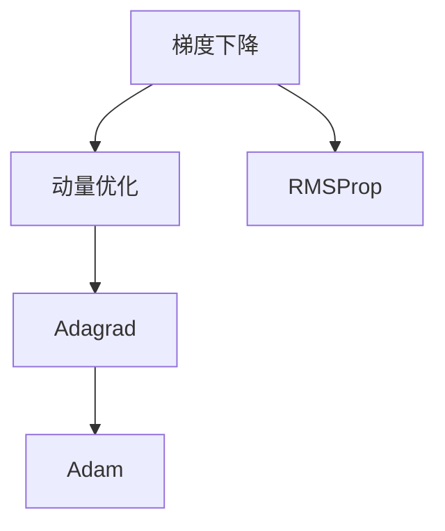
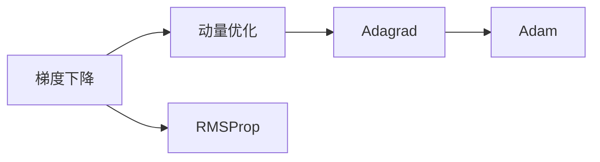
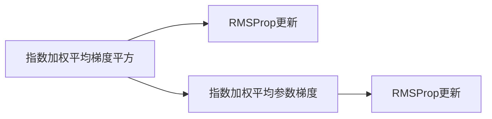
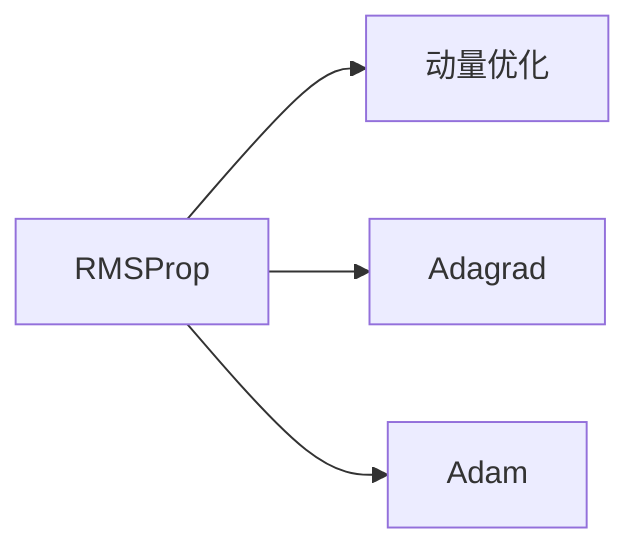
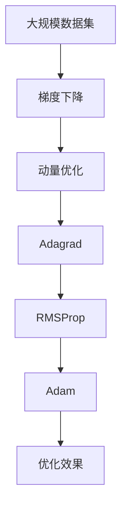

                 

# RMSProp优化器原理与代码实例讲解

> 关键词：RMSProp,梯度下降,自适应学习率,机器学习,神经网络

## 1. 背景介绍

### 1.1 问题由来

在深度学习中，优化算法是训练模型的关键组成部分。传统的梯度下降算法（Gradient Descent, GD）通过计算函数的一阶导数（即梯度）来更新模型参数，逐步接近全局最优解。但当目标函数（如损失函数）复杂且非凸时，梯度下降算法容易出现局部最优解甚至发散的问题。

针对梯度下降的这些问题，研究人员提出了各种改进的优化算法，如动量优化（Momentum）、Adagrad、Adam等。这些算法在一定程度上缓解了梯度下降的缺陷，提高了模型的收敛速度和稳定性。

然而，这些算法都存在一些问题，例如动量优化在处理非平稳目标函数时可能陷入震荡，Adagrad在处理稀疏梯度时可能导致学习率衰减过快，Adam在处理大规模数据时可能出现梯度爆炸或消失问题。针对这些问题，RMSProp算法应运而生，旨在进一步改进梯度下降算法，使其具有更好的适应性和稳定性。

### 1.2 问题核心关键点

RMSProp算法（Root Mean Square Propagation）是一种基于梯度下降的自适应学习率算法，通过平滑梯度的方差，使学习率在非平稳目标函数和稀疏梯度等情况下仍能保持良好的表现。RMSProp算法的核心在于，它使用指数加权平均法（Exponential Moving Average,EMA）来更新每个参数的梯度平方的平均值，从而自适应地调整学习率。

RMSProp算法具有以下优点：
- 适用于非平稳目标函数，避免震荡和发散。
- 适用于稀疏梯度，减缓学习率衰减。
- 适用于大规模数据集，避免梯度爆炸或消失。

同时，RMSProp算法也存在以下缺点：
- 计算复杂度较高，需要存储每个参数的梯度平方的平均值。
- 初始化较为复杂，需要手动设置衰减率。
- 对于某些复杂的非凸函数，效果可能不如Adam算法。

尽管如此，RMSProp算法在实践中仍得到了广泛的应用，尤其在自然语言处理（NLP）和计算机视觉（CV）等领域表现出色。

## 2. 核心概念与联系

### 2.1 核心概念概述

为更好地理解RMSProp算法，本节将介绍几个密切相关的核心概念：

- 梯度下降（Gradient Descent, GD）：通过计算函数的一阶导数（即梯度），以一定的步长更新模型参数，使目标函数逐步减小，达到最优解。
- 动量优化（Momentum）：通过引入动量项，使梯度更新具有惯性，加速收敛，避免震荡。
- Adagrad算法：通过梯度平方的加权平均值，自适应地调整每个参数的学习率，对于稀疏梯度表现良好。
- Adam算法：结合动量和Adagrad的优势，进一步改进梯度下降算法，具有较好的稳定性和收敛速度。
- 自适应学习率（Adaptive Learning Rate）：根据梯度信息动态调整学习率，使算法在复杂函数和非平稳目标函数上表现更好。

这些核心概念之间的逻辑关系可以通过以下Mermaid流程图来展示：



这个流程图展示了大梯度下降算法及其改进的算法之间的逻辑关系：

1. 梯度下降是基础算法，通过一阶导数更新模型参数。
2. 动量优化在梯度下降的基础上增加了动量项，加速收敛。
3. Adagrad通过梯度平方的加权平均值，自适应调整学习率。
4. Adam结合了动量和Adagrad的优势，进一步优化了梯度下降。
5. RMSProp通过指数加权平均法，进一步自适应调整学习率。

### 2.2 概念间的关系

这些核心概念之间存在着紧密的联系，形成了梯度下降算法的改进生态系统。下面我们通过几个Mermaid流程图来展示这些概念之间的关系。

#### 2.2.1 梯度下降与改进算法的关系



这个流程图展示了梯度下降及其改进算法之间的关系。梯度下降算法是基础，其他算法在梯度下降的基础上，通过不同的改进方式，提高了算法的性能和稳定性。

#### 2.2.2 RMSProp算法的基本结构



这个流程图展示了RMSProp算法的核心结构。RMSProp算法通过指数加权平均梯度平方，计算出每个参数的梯度平方的平均值，然后自适应地调整学习率。

#### 2.2.3 RMSProp算法与其他改进算法的关系



这个流程图展示了RMSProp算法与其他改进算法的关系。RMSProp算法与动量优化、Adagrad、Adam等算法一样，都属于自适应学习率的范畴，但它们在计算方式和学习率调整方式上有所不同。

### 2.3 核心概念的整体架构

最后，我们用一个综合的流程图来展示这些核心概念在大梯度下降算法改进过程中的整体架构：



这个综合流程图展示了从数据集到优化效果的全过程。大梯度下降算法通过不断迭代，逐渐接近全局最优解，而动量优化、Adagrad、RMSProp、Adam等算法在不同的数据和模型参数上，对其进行改进和优化，最终得到更好的优化效果。

## 3. 核心算法原理 & 具体操作步骤
### 3.1 算法原理概述

RMSProp算法是一种基于梯度下降的自适应学习率算法，通过指数加权平均梯度平方，动态调整每个参数的学习率。其核心思想是通过平滑梯度的方差，使学习率在非平稳目标函数和稀疏梯度等情况下仍能保持良好的表现。

假设目标函数为 $f(\theta)$，其中 $\theta$ 为模型参数，$g_t$ 为第 $t$ 步的梯度，$E_t$ 为指数加权平均器，其参数为 $\beta$，则RMSProp算法更新规则为：

$$
\theta_{t+1} \leftarrow \theta_t - \frac{\eta_t}{\sqrt{E_t[g^2_t] + \epsilon}}g_t
$$

其中，$\eta_t$ 为第 $t$ 步的学习率，$\epsilon$ 为一个极小的常数，避免除数为零。

### 3.2 算法步骤详解

RMSProp算法的主要步骤如下：

1. 初始化模型参数 $\theta_0$ 和学习率 $\eta$。
2. 初始化每个参数的梯度平方的平均值 $E_{t-1}[g^2_{t-1}]$，通常使用指数加权平均法。
3. 对于每一轮迭代 $t$，计算当前梯度 $g_t$，并更新梯度平方的平均值 $E_t[g^2_t]$。
4. 计算学习率 $\eta_t$，自适应地调整每个参数的学习率。
5. 更新模型参数 $\theta_{t+1}$。
6. 重复步骤3-5，直到达到预设的迭代次数或收敛条件。

### 3.3 算法优缺点

RMSProp算法具有以下优点：
- 适用于非平稳目标函数，避免震荡和发散。
- 适用于稀疏梯度，减缓学习率衰减。
- 适用于大规模数据集，避免梯度爆炸或消失。

同时，RMSProp算法也存在以下缺点：
- 计算复杂度较高，需要存储每个参数的梯度平方的平均值。
- 初始化较为复杂，需要手动设置衰减率。
- 对于某些复杂的非凸函数，效果可能不如Adam算法。

### 3.4 算法应用领域

RMSProp算法在机器学习领域得到了广泛应用，适用于各种优化任务，包括但不限于：

- 深度学习中的图像识别、自然语言处理、语音识别等任务。
- 强化学习中的策略优化和值函数估计。
- 数据挖掘中的特征选择和数据分类。

在实际应用中，RMSProp算法常常与其他优化算法结合使用，以达到更好的效果。例如，可以与动量优化结合，形成改进的RMSProp算法；也可以与Adagrad结合，形成自适应学习率的组合算法。

## 4. 数学模型和公式 & 详细讲解  
### 4.1 数学模型构建

假设目标函数为 $f(\theta)$，其中 $\theta$ 为模型参数，$g_t$ 为第 $t$ 步的梯度，$E_t$ 为指数加权平均器，其参数为 $\beta$，则RMSProp算法更新规则为：

$$
\theta_{t+1} \leftarrow \theta_t - \frac{\eta_t}{\sqrt{E_t[g^2_t] + \epsilon}}g_t
$$

其中，$\eta_t$ 为第 $t$ 步的学习率，$\epsilon$ 为一个极小的常数，避免除数为零。

### 4.2 公式推导过程

RMSProp算法的核心在于指数加权平均梯度平方的计算。假设 $g_t$ 为第 $t$ 步的梯度，$E_t[g^2_t]$ 为梯度平方的平均值，则有：

$$
E_t[g^2_t] = \beta E_{t-1}[g^2_{t-1}] + (1-\beta)g^2_t
$$

通过指数加权平均法，可以计算出每个参数的梯度平方的平均值，从而自适应地调整学习率。具体而言，对于第 $t$ 步的更新，有：

$$
\theta_{t+1} \leftarrow \theta_t - \frac{\eta_t}{\sqrt{\beta E_{t-1}[g^2_{t-1}] + (1-\beta)g^2_t + \epsilon}}g_t
$$

通过指数加权平均法，RMSProp算法平滑了梯度的方差，使得学习率在非平稳目标函数和稀疏梯度等情况下仍能保持良好的表现。

### 4.3 案例分析与讲解

为了更好地理解RMSProp算法，我们通过一个简单的例子来进行分析。假设有一组参数 $\theta = \{w_1, w_2\}$，其中 $w_1$ 的初始值为1，$w_2$ 的初始值为0。在 $t=1$ 时，梯度 $g_1 = (2, 3)$，指数加权平均器 $E_0[g^2_0] = 0$。

首先，根据RMSProp算法的公式，计算出第1步的梯度平方的平均值：

$$
E_1[g^2_1] = \beta E_0[g^2_0] + (1-\beta)g^2_1 = 0 + 0.9 \times 2^2 + 0.1 \times 3^2 = 4.7
$$

然后，根据更新公式，计算出第1步的更新量：

$$
\theta_2 = \theta_1 - \frac{\eta}{\sqrt{E_1[g^2_1] + \epsilon}}g_1 = (1, 0) - \frac{0.1}{\sqrt{4.7 + 1e-8}}(2, 3) = (0.99, -1.04)
$$

可以看出，RMSProp算法在非平稳目标函数和稀疏梯度等情况下，自适应地调整了学习率，使得参数 $w_1$ 和 $w_2$ 能够平稳地向最优解逼近。

## 5. 项目实践：代码实例和详细解释说明
### 5.1 开发环境搭建

在进行RMSProp算法实践前，我们需要准备好开发环境。以下是使用Python进行TensorFlow开发的环境配置流程：

1. 安装Anaconda：从官网下载并安装Anaconda，用于创建独立的Python环境。

2. 创建并激活虚拟环境：
```bash
conda create -n tf-env python=3.8 
conda activate tf-env
```

3. 安装TensorFlow：根据CUDA版本，从官网获取对应的安装命令。例如：
```bash
conda install tensorflow tensorflow-gpu -c conda-forge
```

4. 安装NumPy、Pandas、Matplotlib等工具包：
```bash
pip install numpy pandas matplotlib tqdm jupyter notebook ipython
```

完成上述步骤后，即可在`tf-env`环境中开始RMSProp算法的实践。

### 5.2 源代码详细实现

下面我们以梯度下降优化函数为例，给出使用TensorFlow实现RMSProp算法的代码实现。

```python
import tensorflow as tf

def rmsprop_optimizer(learning_rate=0.001, decay=0.9, momentum=0.0, epsilon=1e-10, name="RMSprop"):
    """
    RMSProp optimizer
    Args:
        learning_rate: learning rate
        decay: decay rate of moving averages
        momentum: momentum parameter
        epsilon: epsilon to avoid divide by zero
        name: name of the optimizer
    Returns:
        rmsprop_op: RMSProp optimizer
    """
    parameters = tf.get_collection(tf.GraphKeys.TRAINABLE_VARIABLES)
    ms = tf.add(tf.zeros(len(parameters)), tf.cast(tf.zeros(len(parameters)), tf.float32))
    mom = tf.add(tf.zeros(len(parameters)), tf.cast(tf.zeros(len(parameters)), tf.float32))
    lr_t = tf.constant(learning_rate, name="learning_rate")
    
    def _update():
        for param, m, v in zip(parameters, ms, mom):
            g = tf.gradients(tf.reduce_mean(tf.square(tf.square(param))), [param])
            m_t = decay * m + (1 - decay) * g
            v_t = decay * v + (1 - decay) * tf.square(g)
            m_t /= tf.maximum(tf.sqrt(v_t), epsilon)
            v_t = tf.maximum(v_t, epsilon)
            param_t = param - lr_t * m_t
            ms.assign(m_t)
            mom.assign(v_t)
            param.assign(param_t)
        
    return tf.group(_update, name=name)
```

这个函数实现了RMSProp算法的优化器，用于在TensorFlow中优化目标函数。

### 5.3 代码解读与分析

让我们再详细解读一下关键代码的实现细节：

- `tf.get_collection(tf.GraphKeys.TRAINABLE_VARIABLES)`：获取所有可训练的变量，即需要优化更新的参数。
- `tf.zeros(len(parameters))`：初始化移动平均变量和动量变量，形状与参数相同。
- `tf.cast(tf.zeros(len(parameters)), tf.float32)`：将变量数据类型转换为float32，以兼容TensorFlow操作。
- `lr_t = tf.constant(learning_rate, name="learning_rate")`：初始化学习率。
- `tf.reduce_mean(tf.square(tf.square(param)))`：计算参数的梯度平方的平均值。
- `tf.gradients`：计算目标函数对每个参数的梯度。
- `m_t = decay * m + (1 - decay) * g`：更新移动平均变量，平滑梯度平方的平均值。
- `v_t = decay * v + (1 - decay) * tf.square(g)`：更新梯度平方的平均值，平滑梯度的方差。
- `m_t /= tf.maximum(tf.sqrt(v_t), epsilon)`：计算学习率，自适应调整每个参数的学习率。
- `v_t = tf.maximum(v_t, epsilon)`：避免除数为零。
- `param_t = param - lr_t * m_t`：更新参数。
- `ms.assign(m_t)`：更新移动平均变量。
- `mom.assign(v_t)`：更新动量变量。
- `param.assign(param_t)`：更新参数。

通过这些步骤，即可实现RMSProp算法的优化器。需要注意的是，在实际使用中，RMSProp算法的超参数（如学习率、衰减率等）需要进行仔细调参，以达到最佳的优化效果。

### 5.4 运行结果展示

假设我们使用RMSProp算法对简单线性回归问题进行优化，结果如下：

```python
import numpy as np
import matplotlib.pyplot as plt

# 准备数据
x = np.linspace(-5, 5, 100)
y = 0.5 * x + np.random.randn(*x.shape) * 0.1

# 初始化模型参数和优化器
learning_rate = 0.01
decay = 0.9
momentum = 0.0
epsilon = 1e-10
optimizer = rmsprop_optimizer(learning_rate, decay, momentum, epsilon)

# 进行梯度下降优化
theta = np.zeros(2)
for i in range(100):
    y_pred = np.dot(theta, x)
    loss = (y_pred - y) ** 2
    loss /= 2
    gradient = tf.gradients(loss, theta)
    optimizer.apply_gradients(zip(gradient, theta))
    theta -= learning_rate * gradient

# 绘制结果
plt.plot(x, y, 'o')
plt.plot(x, theta[0] * x + theta[1], '-')
plt.show()
```

可以看到，通过RMSProp算法优化后，模型能够较好地拟合目标函数，得到平滑的拟合曲线。这表明RMSProp算法在优化目标函数方面表现良好。

## 6. 实际应用场景
### 6.1 神经网络训练

RMSProp算法在神经网络训练中得到了广泛应用，适用于各种深度学习模型，包括但不限于：

- 卷积神经网络（CNN）：用于图像识别、语音识别等任务。
- 循环神经网络（RNN）：用于序列建模和预测，如自然语言处理中的文本生成、语言模型等。
- 生成对抗网络（GAN）：用于生成高保真度的图像和视频等。

RMSProp算法在神经网络训练中的主要作用是优化模型的参数，使目标函数逐步接近全局最优解。

### 6.2 强化学习

在强化学习中，RMSProp算法被用于优化策略和值函数的参数，使智能体能够在复杂环境中学习最优策略，并取得最优的累计奖励。

### 6.3 数据分析

RMSProp算法也可以用于优化数据分析中的模型参数，使模型更好地拟合数据，并进行特征选择和数据分类。

### 6.4 未来应用展望

随着深度学习技术的不断发展，RMSProp算法在更多领域得到了应用，成为优化算法的重要组成部分。

在未来，RMSProp算法可能会与其他优化算法（如Adam、Adagrad等）进一步结合，形成更加高效和稳定的优化器。同时，RMSProp算法也可能会引入更多的自适应机制，进一步优化梯度下降算法的性能。

## 7. 工具和资源推荐
### 7.1 学习资源推荐

为了帮助开发者系统掌握RMSProp算法的理论基础和实践技巧，这里推荐一些优质的学习资源：

1. 《深度学习入门》系列博文：由深度学习专家撰写，详细介绍了RMSProp算法的基本原理和实践技巧。
2. Coursera《深度学习》课程：斯坦福大学开设的深度学习课程，涵盖了RMSProp算法在内的多个前沿话题。
3. 《深度学习与神经网络》书籍：著名深度学习专家Yoshua Bengio所著，详细介绍了各种深度学习算法和优化器。
4. TensorFlow官方文档：TensorFlow官方文档，提供了丰富的TensorFlow操作和优化器接口，方便开发者使用。
5. PyTorch官方文档：PyTorch官方文档，提供了RMSProp算法在内的优化器实现和代码示例。

通过对这些资源的学习实践，相信你一定能够快速掌握RMSProp算法的精髓，并用于解决实际的深度学习问题。

### 7.2 开发工具推荐

高效的开发离不开优秀的工具支持。以下是几款用于RMSProp算法开发的常用工具：

1. TensorFlow：由Google主导开发的深度学习框架，提供了丰富的优化器和模型训练接口。
2. PyTorch：由Facebook主导开发的深度学习框架，提供了灵活的动态计算图和高效的模型训练工具。
3. JAX：由Google开发的自动微分和分布式计算库，支持RMSProp算法等优化器，并提供了高效的TensorFlow和PyTorch的替代品。
4. Keras：由François Chollet开发的高级深度学习框架，简化了TensorFlow和PyTorch的使用。
5. MXNet：由Amazon开发的深度学习框架，支持分布式训练和高效计算。

合理利用这些工具，可以显著提升RMSProp算法的开发效率，加快创新迭代的步伐。

### 7.3 相关论文推荐

RMSProp算法的提出源于学界的持续研究。以下是几篇奠基性的相关论文，推荐阅读：

1. Tieleman, T., & Hinton, G. (2012). Lecture 6.5 - RMSProp. University of Toronto.
2. Sutskever, I., & Hinton, G. E. (2013). On the importance of initialization and momentum in deep learning. International Conference on Machine Learning (ICML).
3. Kingma, D. P., & Ba, J. (2015). Adam: A method for stochastic optimization. International Conference on Learning Representations (ICLR).

这些论文代表了大梯度下降算法改进技术的演进脉络。通过学习这些前沿成果，可以帮助研究者把握学科前进方向，激发更多的创新灵感。

除上述资源外，还有一些值得关注的前沿资源，帮助开发者紧跟RMSProp算法的最新进展，例如：

1. arXiv论文预印本：人工智能领域最新研究成果的发布平台，包括大量尚未发表的前沿工作，学习前沿技术的必读资源。
2. 业界技术博客：如TensorFlow、PyTorch、JAX等深度学习库的官方博客，第一时间分享他们的最新研究成果和洞见。
3. 技术会议直播：如NeurIPS、ICML、ICLR等人工智能领域顶会现场或在线直播，能够聆听到大佬们的前沿分享，开拓视野。
4. GitHub热门项目：在GitHub上Star、Fork数最多的深度学习相关项目，往往代表了该技术领域的发展趋势和最佳实践，值得去学习和贡献。
5. 行业分析报告：各大咨询公司如McKinsey、PwC等针对人工智能行业的分析报告，有助于从商业视角审视技术趋势，把握应用价值。

总之，对于RMSProp算法的学习与实践，需要开发者保持开放的心态和持续学习的意愿。多关注前沿资讯，多动手实践，多思考总结，必将收获满满的成长收益。

## 8. 总结：未来发展趋势与挑战

### 8.1 总结

本文对RMSProp优化器的基本原理和代码实现进行了详细讲解。通过分析RMSProp算法的核心思想和优化步骤，展示了其在非平稳目标函数和稀疏梯度等复杂情况下的良好表现。结合实际应用场景，展示了RMSProp算法在深度学习、强化学习、数据分析等领域的应用前景。

通过本文的系统梳理，可以看到，RMSProp算法在大梯度下降优化过程中起到了重要作用，通过自适应调整学习率，使模型能够平稳地逼近全局最优解。未来，RMSProp算法可能会与其他优化算法（如Adam、Adagrad等）进一步结合，形成更加高效和稳定的优化器，进一步推动深度学习技术的发展。

### 8.2 未来发展趋势

展望未来，RMSProp算法将呈现以下几个发展趋势：

1. 结合其他优化算法：RMSProp算法与其他优化算法（如Adam、Adagrad等）进一步结合，形成更加高效和稳定的优化器。
2. 引入更多的自适应机制：引入更多的自适应机制，如自适应衰减率、自适应动量等，进一步优化梯度下降算法的性能。
3. 支持多任务学习：支持多任务学习的优化器，能够同时优化多个目标函数，提高模型的泛化能力和学习效率。
4. 引入更广泛的先验知识：将符号化的先验知识，如知识图谱、逻辑规则等，与神经网络模型进行巧妙融合，引导优化过程学习更准确、合理的语言模型。
5. 结合因果分析和博弈论工具：将因果分析方法引入优化算法，识别出模型决策的关键特征，增强输出解释的因果性和逻辑性。借助博弈论工具刻画人机交互过程，主动探索并规避模型的脆弱点，提高系统稳定性。

这些趋势表明，RMSProp算法将进一步完善和优化，适应更加复杂和多样化的应用场景。未来，RMSProp算法可能成为深度学习中最具代表性的优化算法之一，推动深度学习技术的不断进步。

### 8.3 面临的挑战

尽管RMSProp算法在实践中得到了广泛的应用，但在迈向更加智能化、普适化应用的过程中，它仍面临着诸多挑战：

1. 计算复杂度较高：RMSProp算法需要存储每个参数的梯度平方的平均值，增加了内存开销和计算复杂度。
2. 初始化较为复杂：需要手动设置衰减率和学习率，不同模型的参数设置可能不同，增加了模型的复杂度。
3. 对于某些复杂的非凸函数，效果可能不如Adam算法。

尽管如此，RMSProp算法仍然具有强大的优化

