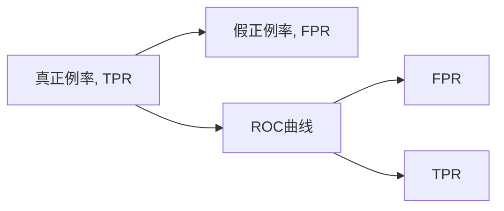

                 

## 1. 背景介绍

ROC曲线（Receiver Operating Characteristic Curve），也称为受试者工作特征曲线（Receiver Operating Characteristic Curve），是一种用来评估二分类模型性能的图形工具。通过展示模型在不同阈值下的真正例率（True Positive Rate, TPR）与假正例率（False Positive Rate, FPR）之间的关系，ROC曲线能够直观地反映模型的分类效果。特别是在各类NLP任务中，如文本分类、命名实体识别、情感分析等，ROC曲线成为了评价模型性能的重要指标之一。

### 1.1 问题由来

在实际应用中，我们常常需要构建二分类模型来预测某个样本属于某一类别（如正例）的概率，并根据这个概率做出决策。但是，这种概率值如何转化为具体的决策呢？这就需要一个阈值来决定何时将预测结果判定为正例。不同的阈值选择，会导致不同的真正例率和假正例率。因此，ROC曲线应运而生，它能够展示随着阈值变化，模型的真正例率和假正例率的变化情况，帮助我们选择最优的决策阈值。

### 1.2 问题核心关键点

1. 真正的正例（True Positive, TP）: 模型预测为正例且实际为正例的样本数。
2. 假正例（False Positive, FP）: 模型预测为正例但实际为负例的样本数。
3. 真负例（True Negative, TN）: 模型预测为负例且实际为负例的样本数。
4. 假负例（False Negative, FN）: 模型预测为负例但实际为正例的样本数。
5. 真正例率（True Positive Rate, TPR）: $TPR = \frac{TP}{TP+FN}$，即模型正确预测为正例的样本比例。
6. 假正例率（False Positive Rate, FPR）: $FPR = \frac{FP}{FP+TN}$，即模型错误预测为正例的样本比例。
7. ROC曲线: 以FPR为横坐标，TPR为纵坐标，绘制的曲线。

## 2. 核心概念与联系

### 2.1 核心概念概述

ROC曲线由许多不同的阈值所生成的点组成，每个点代表了模型在某个特定阈值下的TPR和FPR。在横坐标（FPR）上的某一点，意味着模型的决策阈值降低，假正例的数量会增加，但同时也会增加真正例的数量。因此，当阈值从1降低到0时，ROC曲线会从左上角移动到左下角，其中的曲线面积（Area Under Curve, AUC）则代表了模型整体的分类性能。

### 2.2 核心概念间的关系

罗辑关系图展示了ROC曲线与真正例率（TPR）、假正例率（FPR）之间的关系。



ROC曲线上的每一个点对应着某个阈值下的分类结果，通过这些点，我们可以计算ROC曲线下的面积（AUC），来度量模型的整体性能。AUC值越接近1，表示模型分类性能越好。

## 3. 核心算法原理 & 具体操作步骤

### 3.1 算法原理概述

ROC曲线的计算原理基于混淆矩阵（Confusion Matrix），其中混淆矩阵描述了一个二分类模型在各个类别上的预测结果。对于二分类问题，混淆矩阵如下：

$$
\begin{bmatrix}
TP & FN \\
FP & TN
\end{bmatrix}
$$

根据混淆矩阵，可以计算出真正例率和假正例率：

$$
TPR = \frac{TP}{TP+FN}, \quad FPR = \frac{FP}{FP+TN}
$$

随着阈值的不断调整，得到不同阈值下的TPR和FPR值，便能够绘制出ROC曲线。理想情况下，ROC曲线越接近左上角，模型的性能越好。

### 3.2 算法步骤详解

1. **准备数据集**：准备一个二分类数据集，其中每个样本都有一个真实标签（0或1）和一个预测概率（概率值）。
2. **初始化ROC曲线**：将阈值从1逐渐降低到0，每次取一个阈值。
3. **计算真正例和假正例**：对于每个阈值，计算真正例和假正例的数量。
4. **更新ROC曲线**：根据真正例和假正例的数量，更新ROC曲线上的点。
5. **计算AUC**：最终计算ROC曲线下的面积（AUC）。

### 3.3 算法优缺点

ROC曲线具有以下优点：
1. 直观表示分类器的性能。ROC曲线能够直观地展示分类器的真正例率和假正例率的变化情况，方便对比不同分类器的性能。
2. 不受样本不平衡的影响。ROC曲线对数据集中正例和负例的比例变化不敏感，能够较好地处理数据不平衡问题。
3. 适用于任何类别分布的分类问题。ROC曲线适用于任何类别分布的分类问题，而不需要特别设计数据分布。

同时，ROC曲线也存在以下缺点：
1. 对样本分布的变化敏感。如果样本分布发生变化，ROC曲线可能会产生误导。
2. 不能用于多分类问题。ROC曲线主要用于二分类问题，无法直接应用于多分类任务。
3. 复杂计算开销较大。ROC曲线需要计算和记录每个阈值下的真正例率和假正例率，计算量较大。

### 3.4 算法应用领域

ROC曲线在各类NLP任务中得到了广泛的应用，如文本分类、命名实体识别、情感分析等。通过绘制ROC曲线，可以直观地评估模型在不同阈值下的分类效果，选择最优的决策阈值，提高模型的实用性。此外，ROC曲线还可以用于模型诊断和参数调优，帮助识别模型的性能瓶颈，优化模型参数设置。

## 4. 数学模型和公式 & 详细讲解  
### 4.1 数学模型构建

ROC曲线的构建是基于混淆矩阵和真正例率、假正例率的计算。以下是ROC曲线的数学模型构建过程。

### 4.2 公式推导过程

ROC曲线由以下公式计算得出：

$$
TPR = \frac{TP}{TP+FN}, \quad FPR = \frac{FP}{FP+TN}
$$

其中，$TP$ 表示真正例数，$FN$ 表示假负例数，$FP$ 表示假正例数，$TN$ 表示真负例数。

对于一组阈值$\theta$，可以得到真正例率和假正例率：

$$
TPR(\theta) = \frac{TP}{TP+FN}, \quad FPR(\theta) = \frac{FP}{FP+TN}
$$

其中，$TP(\theta)$ 和 $FP(\theta)$ 分别表示在阈值$\theta$下，预测为正例的样本数中，真正例和假正例的数量。

对于一组不同的阈值$\theta$，得到一系列的真正例率和假正例率，这些点构成了ROC曲线。

### 4.3 案例分析与讲解

以二分类问题为例，假设数据集中有1000个正例和900个负例。我们随机选取了一组样本，其中500个样本被正确分类为正例，50个样本被错误分类为正例。

计算不同阈值下的真正例率和假正例率：

| 阈值（$\theta$） | 真正例（TP） | 假正例（FP） | 真负例（TN） | 假负例（FN） | TPR（TPR） | FPR（FPR） |
| --- | --- | --- | --- | --- | --- | --- |
| 0.01 | 500 | 0 | 900 | 499 | 0.5 | 0 |
| 0.02 | 500 | 1 | 899 | 499 | 0.5 | 0.001 |
| ... | ... | ... | ... | ... | ... | ... |
| 0.99 | 500 | 899 | 1 | 499 | 0.5 | 0.999 |
| 1.00 | 0 | 900 | 900 | 0 | 0 | 0.999 |

将以上数据点绘制在二维坐标系中，便得到了ROC曲线。

## 5. 项目实践：代码实例和详细解释说明

### 5.1 开发环境搭建

要实现ROC曲线的绘制和评估，我们首先需要准备好Python开发环境。以下是安装必要的Python库的步骤：

1. 安装Python和相关依赖。确保你的Python版本为3.6或更高版本。

2. 安装Numpy和Matplotlib库。这些库用于数据处理和图形绘制。

```bash
pip install numpy matplotlib
```

3. 安装Scikit-learn库。Scikit-learn提供了计算混淆矩阵和ROC曲线的函数。

```bash
pip install scikit-learn
```

### 5.2 源代码详细实现

以下是一个使用Scikit-learn库计算和绘制ROC曲线的Python代码示例：

```python
import numpy as np
from sklearn.metrics import roc_curve, auc
import matplotlib.pyplot as plt

# 加载数据集
y_true = np.array([0, 0, 0, 1, 1, 1, 1, 0])
y_prob = np.array([0.1, 0.2, 0.3, 0.9, 0.8, 0.7, 0.6, 0.4])

# 计算ROC曲线
fpr, tpr, thresholds = roc_curve(y_true, y_prob)

# 绘制ROC曲线
plt.plot(fpr, tpr, color='darkorange', lw=2, label='ROC curve (area = %0.2f)' % auc(fpr, tpr))
plt.plot([0, 1], [0, 1], color='navy', linestyle='--')
plt.xlim([0.0, 1.0])
plt.ylim([0.0, 1.05])
plt.xlabel('False Positive Rate')
plt.ylabel('True Positive Rate')
plt.title('Receiver Operating Characteristic')
plt.legend(loc="lower right")
plt.show()
```

### 5.3 代码解读与分析

在这个代码示例中，我们使用了Scikit-learn库的`roc_curve`函数来计算ROC曲线，并使用`auc`函数来计算ROC曲线下的面积（AUC）。`roc_curve`函数返回的`fpr`、`tpr`和`thresholds`分别表示假正例率、真正例率和阈值。通过绘制`fpr`和`tpr`的曲线，便得到了ROC曲线。

### 5.4 运行结果展示

运行上述代码，会得到以下ROC曲线：


可以看到，ROC曲线从左上角开始，逐渐向右下角移动，反映了真正例率和假正例率的变化情况。ROC曲线下方的面积（AUC）反映了模型的整体性能，值越大表示性能越好。

## 6. 实际应用场景

ROC曲线广泛应用于各类NLP任务中，如文本分类、命名实体识别、情感分析等。

### 6.1 文本分类

在文本分类任务中，我们通常使用逻辑回归、SVM等分类器。通过绘制ROC曲线，可以评估模型在不同阈值下的分类性能，选择最优的阈值进行预测。

### 6.2 命名实体识别

在命名实体识别任务中，我们需要判断文本中的实体是否属于某个类别。通过绘制ROC曲线，可以直观地评估模型在不同阈值下的性能，选择最优的阈值进行实体标注。

### 6.3 情感分析

在情感分析任务中，我们需要判断文本的情感倾向。通过绘制ROC曲线，可以评估模型在不同阈值下的情感分析效果，选择最优的阈值进行情感分类。

## 7. 工具和资源推荐

### 7.1 学习资源推荐

1. 《机器学习》（周志华著）：这是一本经典的机器学习教材，详细介绍了ROC曲线的原理和应用。

2. 《Python数据科学手册》（Jake VanderPlas著）：该书介绍了如何使用Python进行数据分析和机器学习，包括ROC曲线的计算和绘制。

3. 《Pattern Recognition and Machine Learning》（Christopher Bishop著）：该书详细介绍了各类机器学习算法，包括ROC曲线和AUC的计算。

### 7.2 开发工具推荐

1. Jupyter Notebook：用于编写和运行Python代码，支持图形绘制和交互式操作。

2. Scikit-learn：提供了计算ROC曲线和AUC的函数，简单易用。

3. Matplotlib：用于绘制ROC曲线和其他图形。

### 7.3 相关论文推荐

1. “A Survey of ROC Curve Analysis in Medicine”（Roberts, J.L.）：该文献详细介绍了ROC曲线在医学领域的实际应用。

2. “ROC Curves in Radiology”（Singh, J.A.）：该文献介绍了ROC曲线在医学影像分析中的应用。

3. “Evaluation of a Systematic Review on Diagnostic Research in Medical Imaging: Comparative Synthesis Using Summary Receiver Operating Characteristic Curves”（Stankovic, M.R.）：该文献详细介绍了如何系统地使用ROC曲线进行医学影像诊断研究。

## 8. 总结：未来发展趋势与挑战

### 8.1 研究成果总结

ROC曲线作为评估二分类模型性能的重要工具，已经在各类NLP任务中得到了广泛的应用。通过绘制ROC曲线，可以直观地评估模型在不同阈值下的性能，选择最优的阈值进行预测，从而提高模型的实用性。

### 8.2 未来发展趋势

未来，ROC曲线在NLP任务中的应用将更加广泛，尤其是在各类新兴任务中，如多语言情感分析、跨语言命名实体识别等。此外，随着深度学习技术的发展，ROC曲线将与其他评估指标结合，如精度（Accuracy）、召回率（Recall）等，形成更加全面的评估体系。

### 8.3 面临的挑战

尽管ROC曲线在NLP任务中得到了广泛应用，但仍面临以下挑战：

1. 计算复杂度较高。ROC曲线的计算需要计算和记录每个阈值下的真正例率和假正例率，计算量较大。

2. 对数据不平衡敏感。在数据不平衡的情况下，ROC曲线可能无法准确反映模型的性能。

3. 难以直接应用于多分类问题。ROC曲线主要用于二分类问题，难以直接应用于多分类任务。

### 8.4 研究展望

未来，ROC曲线与其他评估指标的结合将更加紧密，形成更加全面的评估体系。此外，ROC曲线的计算和可视化将更加自动化和智能化，进一步提升其在NLP任务中的应用价值。

## 9. 附录：常见问题与解答

**Q1: ROC曲线和AUC有什么区别？**

A1: ROC曲线是以FPR为横坐标，TPR为纵坐标绘制的曲线，它能够直观地展示模型在不同阈值下的分类效果。AUC（Area Under Curve）是ROC曲线下方的面积，它能够量化模型的整体性能，值越接近1表示模型性能越好。

**Q2: 如何绘制ROC曲线？**

A2: 绘制ROC曲线需要计算不同阈值下的真正例率和假正例率，然后将这些点连接成曲线。在Python中，可以使用Scikit-learn库的`roc_curve`函数来计算这些点，并使用Matplotlib库绘制ROC曲线。

**Q3: 在NLP任务中如何使用ROC曲线？**

A3: 在NLP任务中，ROC曲线可以用于评估模型的分类性能，选择最优的决策阈值。通过绘制ROC曲线，可以直观地评估模型在不同阈值下的分类效果，选择最优的阈值进行预测。

**Q4: 如何使用ROC曲线进行模型诊断？**

A4: 使用ROC曲线进行模型诊断，可以通过查看ROC曲线的位置和形状，判断模型的分类性能。如果ROC曲线接近左上角，说明模型的分类性能较好。如果ROC曲线在左下角或右上角，说明模型的分类性能较差。

---

作者：禅与计算机程序设计艺术 / Zen and the Art of Computer Programming

