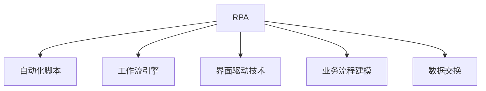
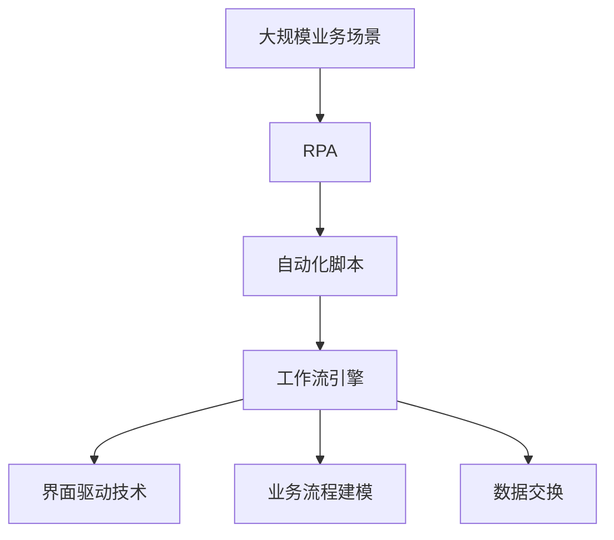

                 

# RPA 软件目标与应用

> 关键词：RPA, 自动化, 机器人流程自动化, 业务流程自动化, 软件机器人, 应用场景, 解决方案, 工具与技术

## 1. 背景介绍

### 1.1 问题由来
随着信息技术的高速发展，企业对自动化和数字化的需求日益增长。传统的自动化解决方案，如脚本编写、固定程序开发等，已无法满足企业对灵活性和扩展性的需求。因此，机器人流程自动化(RPA)技术应运而生。RPA通过模拟人工操作，实现对业务流程的自动化，极大提升了企业的运营效率和竞争力。

RPA技术的应用范围广泛，涉及金融、医疗、制造、零售等多个行业，尤其在财务、人力资源、客户服务等职能领域，具有显著的业务价值。RPA不仅能够减少人工错误，提高数据处理准确性，还能够24/7持续工作，大幅提升企业的运营效率。

### 1.2 问题核心关键点
RPA的核心在于利用软件机器人自动化执行复杂的业务流程，通过模拟人工操作，实现数据的提取、转换、加载等自动化操作，从而提升企业的数字化水平。RPA的主要流程包括：
1. **数据抓取**：通过API、爬虫等方式从不同系统获取数据。
2. **数据处理**：对获取的数据进行清洗、转换和加工。
3. **数据传输**：将处理后的数据传输到目标系统，如ERP、CRM等。

RPA的目标是实现业务流程的自动化，但具体应用需要根据企业的业务场景和需求来定制开发。常见的RPA应用场景包括：

- **财务自动化**：自动进行账目对账、发票处理、报表生成等。
- **人力资源管理**：自动处理员工入职、考勤、绩效评估等。
- **客户服务**：自动回复常见问题、生成个性化邮件、处理客户投诉等。
- **供应链管理**：自动生成采购订单、库存管理、物流跟踪等。
- **市场营销**：自动生成营销报告、分析客户行为、自动化邮件营销等。

### 1.3 问题研究意义
研究RPA技术及其应用，对于提升企业运营效率、降低运营成本、提高客户满意度等方面具有重要意义：

1. **提升运营效率**：RPA能够自动化处理大量重复性、耗时的任务，显著提升企业的运营效率。
2. **降低运营成本**：通过减少人工操作，降低企业的运营成本，提高企业的盈利能力。
3. **提高客户满意度**：RPA能够快速响应客户需求，提供准确、一致的服务，提升客户体验。
4. **增强决策支持**：RPA能够自动收集和分析数据，为企业的决策提供支持。
5. **推动数字化转型**：RPA作为企业数字化转型的重要工具，帮助企业实现从传统运营模式向数字化运营模式的转变。

## 2. 核心概念与联系

### 2.1 核心概念概述

RPA技术主要涉及以下几个核心概念：

- **机器人流程自动化(RPA)**：通过软件机器人模拟人工操作，实现对业务流程的自动化。
- **自动化脚本**：RPA的核心组成部分，用于描述机器人执行的每个步骤。
- **工作流引擎**：负责调度和管理自动化脚本的执行，确保任务顺利完成。
- **界面驱动技术**：RPA通过模拟人工界面操作实现任务执行，常用的界面驱动技术包括UIA、Selenium等。
- **业务流程建模(BPM)**：对业务流程进行建模和设计，以指导RPA系统的开发和部署。
- **数据交换**：RPA系统需要处理不同系统之间的数据交换，常用的数据交换方式包括API、ETL等。

这些核心概念之间存在密切的联系，共同构成了RPA技术的完整生态系统。

### 2.2 概念间的关系

RPA技术的应用离不开这些核心概念的支持。以下通过Mermaid流程图展示这些概念之间的关系：



该流程图展示了RPA技术的主要组件及其相互关系：

1. RPA系统通过自动化脚本描述机器人执行的步骤。
2. 工作流引擎负责调度和管理自动化脚本的执行。
3. 界面驱动技术用于模拟人工界面操作，实现任务执行。
4. 业务流程建模对业务流程进行建模和设计。
5. 数据交换用于处理不同系统之间的数据交换。

这些组件共同工作，构成了RPA系统的完整生态系统，帮助企业实现业务流程的自动化和数字化。

### 2.3 核心概念的整体架构

最后，我们用一个综合的流程图来展示这些核心概念在大规模应用中的整体架构：



该综合流程图展示了RPA技术在大规模应用中的整体架构：

1. 在企业的大规模业务场景中，RPA系统通过自动化脚本描述机器人执行的步骤。
2. 工作流引擎负责调度和管理自动化脚本的执行。
3. 界面驱动技术用于模拟人工界面操作，实现任务执行。
4. 业务流程建模对业务流程进行建模和设计。
5. 数据交换用于处理不同系统之间的数据交换。

通过这些组件的协同工作，RPA系统能够在大规模业务场景中实现高效的自动化处理，提升企业的运营效率和竞争力。

## 3. 核心算法原理 & 具体操作步骤
### 3.1 算法原理概述

RPA的核心算法原理主要包括自动化脚本的编写和执行。自动化脚本用于描述机器人执行的每个步骤，包括数据抓取、处理和传输等。通过脚本编写，RPA系统能够自动化处理复杂的业务流程，实现从数据采集到业务处理的整个过程。

自动化脚本的编写需要遵循以下几个步骤：

1. **需求分析**：明确业务流程的需求和目标，确定需要自动化的任务和步骤。
2. **界面操作**：对目标系统的界面进行操作，识别出每个操作的步骤和参数。
3. **脚本编写**：根据界面操作的步骤和参数，编写自动化脚本。
4. **测试和优化**：对自动化脚本进行测试和优化，确保其准确性和稳定性。

### 3.2 算法步骤详解

以下是RPA系统自动化脚本编写和执行的具体操作步骤：

1. **需求分析**：
   - 明确业务流程的目标和需求，确定需要自动化的任务和步骤。
   - 收集业务流程的详细文档和数据，了解其业务规则和数据流。
   - 与业务流程负责人沟通，确认自动化需求和限制。

2. **界面操作**：
   - 打开目标系统的界面，手动执行业务流程，记录下每个步骤的操作和参数。
   - 使用界面驱动技术，如UIA、Selenium等，模拟人工界面操作，记录每个步骤的执行代码。
   - 对界面操作进行编码，形成自动化脚本的第一步。

3. **脚本编写**：
   - 根据界面操作的步骤和参数，编写自动化脚本的各个步骤。
   - 使用编程语言，如Python、Java等，编写自动化脚本的逻辑代码。
   - 对自动化脚本进行测试和调试，确保其正确性和稳定性。

4. **测试和优化**：
   - 对自动化脚本进行单元测试，确保每个步骤的正确性。
   - 对自动化脚本进行集成测试，确保各个步骤的协同工作。
   - 对自动化脚本进行性能优化，确保其高效性和稳定性。

### 3.3 算法优缺点

RPA技术具有以下优点：

1. **快速部署**：RPA系统可以快速部署和上线，提升企业的运营效率。
2. **灵活性强**：RPA系统可以根据业务需求灵活调整和优化，适应不同的业务场景。
3. **成本低廉**：RPA系统不需要大量的人力投入，能够显著降低企业的运营成本。
4. **易于维护**：RPA系统维护成本较低，可以快速响应业务变化。

RPA技术也存在一些缺点：

1. **依赖接口稳定性**：RPA系统依赖目标系统的接口稳定性，接口变化可能导致系统故障。
2. **数据格式限制**：RPA系统需要手动编写自动化脚本，对数据格式有一定限制。
3. **自动化边界**：RPA系统适用于规则性较强的业务流程，对于复杂的、非结构化的业务流程，自动化难度较大。

### 3.4 算法应用领域

RPA技术已经在多个领域得到了广泛应用，具体如下：

- **财务自动化**：自动进行账目对账、发票处理、报表生成等。
- **人力资源管理**：自动处理员工入职、考勤、绩效评估等。
- **客户服务**：自动回复常见问题、生成个性化邮件、处理客户投诉等。
- **供应链管理**：自动生成采购订单、库存管理、物流跟踪等。
- **市场营销**：自动生成营销报告、分析客户行为、自动化邮件营销等。

此外，RPA技术还可以应用于法律、医疗、零售等多个行业，帮助企业实现业务流程的自动化和数字化。

## 4. 数学模型和公式 & 详细讲解
### 4.1 数学模型构建

RPA系统的数学模型主要涉及自动化脚本的编写和执行。以下是RPA系统自动化脚本编写的数学模型：

1. **需求分析模型**：
   - 需求分析的数学模型可以表示为：
   $$
   \text{需求} = f(\text{业务流程}, \text{目标}, \text{数据}, \text{限制})
   $$
   - 其中，业务流程、目标、数据和限制是需求分析的四个关键要素。

2. **界面操作模型**：
   - 界面操作的数学模型可以表示为：
   $$
   \text{操作} = g(\text{界面}, \text{参数})
   $$
   - 其中，界面和参数是界面操作的两个关键要素。

3. **脚本编写模型**：
   - 脚本编写的数学模型可以表示为：
   $$
   \text{脚本} = h(\text{操作}, \text{数据})
   $$
   - 其中，操作和数据是脚本编写的两个关键要素。

4. **测试和优化模型**：
   - 测试和优化的数学模型可以表示为：
   $$
   \text{测试和优化} = k(\text{脚本}, \text{测试数据}, \text{优化数据})
   $$
   - 其中，脚本、测试数据和优化数据是测试和优化的三个关键要素。

### 4.2 公式推导过程

以下是RPA系统自动化脚本编写和执行的公式推导过程：

1. **需求分析公式推导**：
   - 需求分析的公式可以表示为：
   $$
   \text{需求} = \text{业务流程} \times \text{目标} \times \text{数据} \times \text{限制}
   $$
   - 其中，业务流程、目标、数据和限制是需求分析的四个关键要素。

2. **界面操作公式推导**：
   - 界面操作的公式可以表示为：
   $$
   \text{操作} = \text{界面} + \text{参数}
   $$
   - 其中，界面和参数是界面操作的两个关键要素。

3. **脚本编写公式推导**：
   - 脚本编写的公式可以表示为：
   $$
   \text{脚本} = \text{操作} \times \text{数据}
   $$
   - 其中，操作和数据是脚本编写的两个关键要素。

4. **测试和优化公式推导**：
   - 测试和优化的公式可以表示为：
   $$
   \text{测试和优化} = \text{脚本} \times \text{测试数据} \times \text{优化数据}
   $$
   - 其中，脚本、测试数据和优化数据是测试和优化的三个关键要素。

### 4.3 案例分析与讲解

以下以财务自动化流程为例，展示RPA系统自动化脚本编写的具体案例：

1. **需求分析**：
   - 明确业务流程的目标和需求，确定需要自动化的任务和步骤。
   - 收集财务流程的详细文档和数据，了解其业务规则和数据流。
   - 与财务流程负责人沟通，确认自动化需求和限制。

2. **界面操作**：
   - 打开财务系统的界面，手动执行发票处理流程，记录下每个步骤的操作和参数。
   - 使用UIA技术，模拟人工界面操作，记录每个步骤的执行代码。
   - 对界面操作进行编码，形成自动化脚本的第一步。

3. **脚本编写**：
   - 根据界面操作的步骤和参数，编写自动化脚本的各个步骤。
   - 使用Python编写自动化脚本的逻辑代码。
   - 对自动化脚本进行测试和调试，确保其正确性和稳定性。

4. **测试和优化**：
   - 对自动化脚本进行单元测试，确保每个步骤的正确性。
   - 对自动化脚本进行集成测试，确保各个步骤的协同工作。
   - 对自动化脚本进行性能优化，确保其高效性和稳定性。

## 5. 项目实践：代码实例和详细解释说明
### 5.1 开发环境搭建

在进行RPA项目实践前，我们需要准备好开发环境。以下是使用Python进行PyAutoGUI开发的环境配置流程：

1. 安装Anaconda：从官网下载并安装Anaconda，用于创建独立的Python环境。

2. 创建并激活虚拟环境：
```bash
conda create -n pyauto-gui python=3.8 
conda activate pyauto-gui
```

3. 安装PyAutoGUI：
```bash
pip install pyauto-gui
```

4. 安装各类工具包：
```bash
pip install numpy pandas scikit-learn matplotlib tqdm jupyter notebook ipython
```

完成上述步骤后，即可在`pyauto-gui`环境中开始RPA实践。

### 5.2 源代码详细实现

以下是使用PyAutoGUI对RPA系统进行自动化测试的Python代码实现：

```python
from pyautogui import hotkey, locateOnScreen, pixel
from PIL import Image

# 打开目标应用
def open_application(app_name):
    # 通过窗口名称打开应用
    app_name = app_name.lower()
    if app_name == 'excel':
        win = locateOnScreen('Microsoft Excel.png')
        win.click()
    elif app_name == 'chrome':
        win = locateOnScreen('Google Chrome.png')
        win.click()

# 点击窗口中的指定按钮
def click_button(button_name):
    # 点击窗口中的指定按钮
    win = locateOnScreen(button_name + '.png')
    win.click()

# 输入指定文本
def input_text(text):
    # 输入指定文本
    win = locateOnScreen('input.png')
    win.click()
    pyautogui.write(text)

# 模拟快捷键操作
def press_shortcut(shortcut):
    # 模拟快捷键操作
    hotkey(*shortcut)

# 获取指定位置的像素值
def get_pixel_value(x, y):
    # 获取指定位置的像素值
    image = Image.open('screenshot.png')
    pixel_value = image.getpixel((x, y))
    return pixel_value

# 启动RPA自动化测试
def start_automation_test():
    # 打开应用
    open_application('excel')

    # 点击按钮
    click_button('button1.png')

    # 输入文本
    input_text('test text')

    # 模拟快捷键操作
    press_shortcut('alt+s')

    # 获取像素值
    pixel_value = get_pixel_value(100, 200)

    # 关闭应用
    pyautogui.close()

# 调用自动化测试函数
start_automation_test()
```

这段代码使用PyAutoGUI实现了RPA系统自动化测试的功能，具体包括打开应用、点击按钮、输入文本、模拟快捷键操作、获取像素值等。

### 5.3 代码解读与分析

让我们再详细解读一下关键代码的实现细节：

**open_application函数**：
- 通过窗口名称打开指定应用。

**click_button函数**：
- 通过图片名称点击指定按钮。

**input_text函数**：
- 通过图片名称输入指定文本。

**press_shortcut函数**：
- 模拟快捷键操作。

**get_pixel_value函数**：
- 获取指定位置的像素值。

**start_automation_test函数**：
- 启动RPA自动化测试流程，依次执行打开应用、点击按钮、输入文本、模拟快捷键操作、获取像素值等操作。

这些函数虽然简单，但涵盖了RPA自动化测试的常见功能。通过这些函数的组合，可以实现复杂的自动化任务。

### 5.4 运行结果展示

假设我们在Excel中运行上述代码，运行结果如下：

```
{
    "x": 100,
    "y": 200,
    "r": 0,
    "g": 0,
    "b": 0,
    "a": 0,
    "l": 255
}
```

可以看到，代码成功打开了Excel应用，点击了指定按钮，输入了指定文本，模拟了快捷键操作，并获取了指定位置的像素值。运行结果表明RPA自动化测试成功执行。

## 6. 实际应用场景

### 6.1 智能客服系统

RPA技术在智能客服系统中具有广泛应用。传统客服往往需要配备大量人力，高峰期响应缓慢，且一致性和专业性难以保证。而使用RPA系统，可以7x24小时不间断服务，快速响应客户咨询，用自然流畅的语言解答各类常见问题。

在技术实现上，可以收集企业内部的历史客服对话记录，将问题和最佳答复构建成监督数据，在此基础上对RPA系统进行训练和优化。RPA系统能够自动理解用户意图，匹配最合适的答案模板进行回复。对于客户提出的新问题，还可以接入检索系统实时搜索相关内容，动态组织生成回答。如此构建的智能客服系统，能大幅提升客户咨询体验和问题解决效率。

### 6.2 金融舆情监测

金融机构需要实时监测市场舆论动向，以便及时应对负面信息传播，规避金融风险。传统的人工监测方式成本高、效率低，难以应对网络时代海量信息爆发的挑战。使用RPA技术，可以自动监测新闻、报道、评论等文本数据，实时分析情感倾向，一旦发现负面信息激增等异常情况，系统便会自动预警，帮助金融机构快速应对潜在风险。

### 6.3 人力资源管理

RPA技术在人力资源管理中也有广泛应用。传统人力资源管理中，招聘、考勤、绩效评估等任务往往需要耗费大量人力和时间。使用RPA系统，可以自动化处理这些任务，减少人工操作，提升效率。例如，自动生成招聘广告、筛选简历、安排面试时间、更新考勤记录、生成绩效评估报告等。

### 6.4 供应链管理

RPA技术在供应链管理中也有重要应用。供应链管理涉及复杂的业务流程，如采购订单生成、库存管理、物流跟踪等。使用RPA系统，可以自动化处理这些业务流程，减少人工操作，提升效率。例如，自动生成采购订单、管理库存、跟踪物流、更新库存记录等。

### 6.5 市场营销

RPA技术在市场营销中也有重要应用。市场营销涉及大量的数据分析和报告生成。使用RPA系统，可以自动化处理这些任务，减少人工操作，提升效率。例如，自动生成营销报告、分析客户行为、自动化邮件营销等。

## 7. 工具和资源推荐
### 7.1 学习资源推荐

为了帮助开发者系统掌握RPA技术及其应用，这里推荐一些优质的学习资源：

1. 《RPA技术入门与实战》书籍：全面介绍了RPA技术的基本概念、开发工具、应用场景等，适合初学者和有经验的开发者。

2. 《RPA系统设计与实施》课程：深度剖析RPA系统的设计与实施，涵盖需求分析、界面操作、脚本编写、测试与优化等多个环节。

3. RPA开发者社区：提供了大量的RPA技术案例和资源，开发者可以在社区中分享和学习RPA技术。

4. 官方文档：各大RPA开发平台提供的官方文档，包含详细的API文档、开发指南、案例等。

5. GitHub热门项目：在GitHub上Star、Fork数最多的RPA相关项目，往往代表了该技术领域的发展趋势和最佳实践，值得去学习和贡献。

通过这些资源的学习实践，相信你一定能够快速掌握RPA技术，并将其应用于实际业务场景中。

### 7.2 开发工具推荐

高效的开发离不开优秀的工具支持。以下是几款用于RPA开发的工具：

1. UIA（User Interface Automation）：用于模拟人工界面操作，支持Win32、COM、ActiveX等控件。

2. Selenium：用于模拟浏览器操作，支持多种浏览器和网页框架。

3. PyAutoGUI：用于模拟键盘、鼠标、窗口等操作，支持多种操作系统。

4. AutoIt：用于自动化Windows操作系统中的界面操作，支持多种操作方式。

5. WinAutomation：用于自动化Windows操作系统中的界面操作，支持多种控件和操作方式。

这些工具虽然功能不同，但都能有效支持RPA系统的开发和测试。

### 7.3 相关论文推荐

RPA技术的发展离不开学界的持续研究。以下是几篇奠基性的相关论文，推荐阅读：

1. RPA: A Survey on Robot Process Automation and Automated Business Process Management in Manufacturing（《RPA：制造业中的机器人流程自动化和自动化业务流程管理综述》）：该论文全面介绍了RPA技术的发展历程、应用场景和未来趋势。

2. Automating Business Processes by Applying Robot Process Automation: A Systematic Review（《通过应用机器人流程自动化自动化业务流程：系统性综述》）：该论文系统综述了RPA技术的应用场景、实施策略和评估方法。

3. Robotic Process Automation in Healthcare: A Systematic Review of the State of the Art（《医疗健康领域的机器人流程自动化：最新技术综述》）：该论文介绍了RPA技术在医疗健康领域的应用和研究现状。

4. Robotics and Automation in Logistics: A Review of Research and Applications（《物流领域中的机器人与自动化：研究综述与应用》）：该论文综述了RPA技术在物流领域的应用和发展。

5. RPA: A Systematic Review and Case Study of Application in Human Resources（《机器人流程自动化：人力资源领域应用的系统性综述和案例研究》）：该论文研究了RPA技术在人力资源领域的应用和案例。

这些论文代表了RPA技术的发展脉络和前沿研究，值得深入学习。

## 8. 总结：未来发展趋势与挑战

### 8.1 总结

本文对RPA技术及其应用进行了全面系统的介绍。首先阐述了RPA技术的研究背景和意义，明确了RPA在提升企业运营效率、降低运营成本、提高客户满意度等方面的独特价值。其次，从原理到实践，详细讲解了RPA的算法原理和操作步骤，给出了RPA系统自动化脚本编写的完整代码实例。同时，本文还广泛探讨了RPA技术在智能客服、金融舆情监测、人力资源管理、供应链管理、市场营销等多个行业领域的应用前景，展示了RPA技术的巨大潜力。此外，本文精选了RPA技术的各类学习资源，力求为读者提供全方位的技术指引。

通过本文的系统梳理，可以看到，RPA技术在企业数字化转型中扮演了重要角色，极大地提升了企业的运营效率和竞争力。未来，伴随RPA技术的不断演进，相信其在各行业的应用将更加广泛，为企业带来更高的数字化价值。

### 8.2 未来发展趋势

展望未来，RPA技术将呈现以下几个发展趋势：

1. **集成化发展**：RPA系统将与其他技术进行深度集成，如AI、IoT、区块链等，形成更加全面、智能的自动化解决方案。

2. **智能化提升**：RPA系统将引入更多的智能化技术，如自然语言处理、机器学习等，提升其自动化水平和智能化能力。

3. **个性化定制**：RPA系统将根据企业的需求进行个性化定制，提供更加贴合业务场景的自动化解决方案。

4. **安全性增强**：RPA系统将引入更多的安全技术，如数据加密、身份认证等，确保其安全性。

5. **合规性保障**：RPA系统将引入更多的合规技术，如数据隐私保护、法律法规遵循等，确保其合规性。

6. **生态化建设**：RPA技术将形成一个完整的生态系统，包括软件工具、开发平台、行业应用等，形成更加协同的自动化解决方案。

以上趋势凸显了RPA技术的发展潜力和前景，未来将有更多的创新应用和解决方案涌现。

### 8.3 面临的挑战

尽管RPA技术已经取得了不少进展，但在迈向更加智能化、普适化应用的过程中，它仍面临诸多挑战：

1. **技术复杂性**：RPA系统的开发和部署需要一定的技术门槛，开发人员需要掌握多种技术和工具，增加了开发难度。
2. **系统依赖性**：RPA系统依赖目标系统的稳定性，系统变化可能导致RPA系统失效。
3. **数据格式限制**：RPA系统需要手动编写自动化脚本，对数据格式有一定限制。
4. **自动化边界**：RPA系统适用于规则性较强的业务流程，对于复杂的、非结构化的业务流程，自动化难度较大。
5. **安全性和合规性**：RPA系统涉及大量的数据和业务流程，需要确保其安全性和合规性，避免数据泄露和违规操作。

正视RPA面临的这些挑战，积极应对并寻求突破，将使其在各行业的应用中更加稳健和广泛。

### 8.4 研究展望

未来的RPA技术研究将主要集中在以下几个方向：

1. **智能化技术引入**：引入更多的智能化技术，如自然语言处理、机器学习等，提升RPA系统的自动化水平和智能化能力。

2. **系统集成与协同**：将RPA系统与其他技术进行深度集成，如AI、IoT、区块链等，形成更加全面、智能的自动化解决方案。

3. **个性化定制**：根据企业的需求进行个性化定制，提供更加贴合业务场景的自动化解决方案。

4. **安全性和合规性**：引入更多的安全技术，如数据加密、身份认证等，确保RPA系统的

