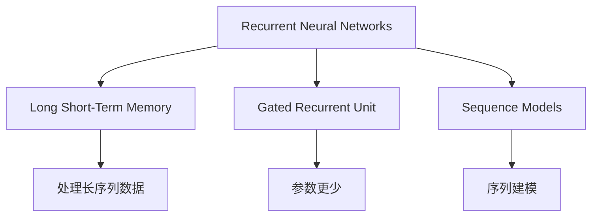
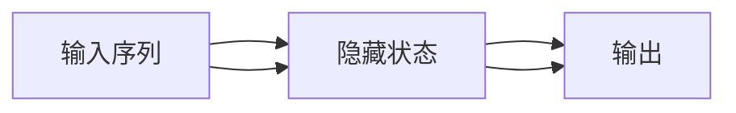
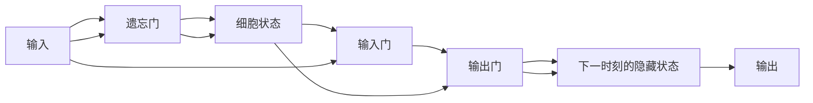
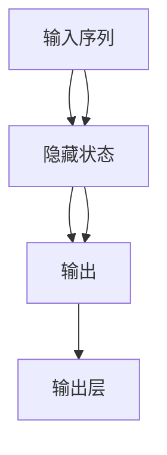
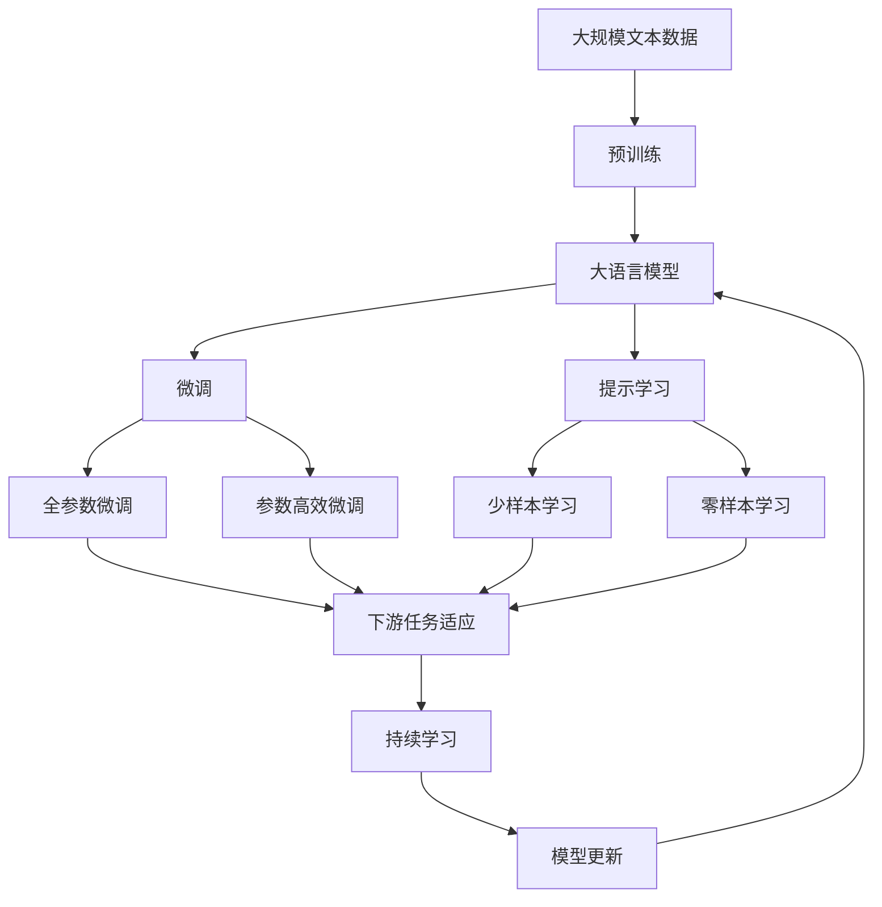

                 

# Recurrent Neural Networks (RNN)原理与代码实例讲解

> 关键词：递归神经网络,长短时记忆网络,序列模型,循环神经网络,自然语言处理(NLP)

## 1. 背景介绍

### 1.1 问题由来

在处理序列数据时，传统的神经网络无法有效捕捉序列间的依赖关系。例如，在自然语言处理(NLP)任务中，如文本分类、语言模型、机器翻译等，输入的文本数据是一系列具有时间顺序的词汇或字符。递归神经网络(Recurrent Neural Networks, RNNs)应运而生，能够通过循环结构捕获序列中不同位置间的依赖关系。RNNs已经在机器翻译、语音识别、文本生成等众多领域展现了巨大的潜力。

### 1.2 问题核心关键点

RNNs的核心在于其循环结构，通过在网络中引入一个循环，将前一时刻的隐藏状态信息传递到下一时刻，从而更好地处理序列数据。关键点包括：

- 循环结构：RNNs通过循环结构将前一时刻的隐藏状态传递到当前时刻，形成记忆网络。
- 长短期记忆(LSTM)和门控循环单元(GRU)：这两种RNN变种在捕获序列长期依赖方面更为高效。
- 序列模型：RNNs构建的序列模型，能够对输入序列进行建模和预测。

### 1.3 问题研究意义

RNNs在序列数据处理中的出色表现，使其成为NLP领域的关键技术。RNNs在语言模型、机器翻译、文本生成、语音识别等诸多任务上取得了显著的成果，推动了NLP技术的应用和产业化进程。研究RNNs的原理和实现方法，有助于更深入理解序列数据的建模方式，为NLP任务的优化提供理论基础和技术支持。

## 2. 核心概念与联系

### 2.1 核心概念概述

为更好地理解RNNs，本节将介绍几个密切相关的核心概念：

- 递归神经网络(Recurrent Neural Networks, RNNs)：一种通过循环结构捕捉序列依赖的神经网络。
- 长短期记忆网络(Long Short-Term Memory, LSTM)：一种特殊的RNN变种，能够更高效地处理长序列数据，避免梯度消失问题。
- 门控循环单元(Gated Recurrent Unit, GRU)：另一种RNN变种，与LSTM类似，但参数更少，计算速度更快。
- 序列模型(Sequence Models)：使用RNNs构建的序列模型，能够对输入序列进行建模和预测。

这些概念之间的关系可以通过以下Mermaid流程图来展示：



这个流程图展示了大语言模型的核心概念及其之间的关系：

1. RNNs通过循环结构捕捉序列依赖。
2. LSTM和GRU是RNNs的变种，用于处理长序列数据。
3. 序列模型使用RNNs进行序列建模和预测。

### 2.2 概念间的关系

这些核心概念之间存在着紧密的联系，形成了RNNs的完整生态系统。下面我们通过几个Mermaid流程图来展示这些概念之间的关系。

#### 2.2.1 RNNs的结构



这个流程图展示了RNNs的基本结构：输入序列通过隐藏状态进行处理，并输出预测结果。

#### 2.2.2 LSTM与GRU的结构



这个流程图展示了LSTM的基本结构：通过遗忘门控制细胞状态的更新，通过输入门和输出门控制信息的流动，最终输出预测结果。

#### 2.2.3 序列模型的应用



这个流程图展示了序列模型的应用：输入序列通过隐藏状态进行处理，并最终输出预测结果。

### 2.3 核心概念的整体架构

最后，我们用一个综合的流程图来展示这些核心概念在大语言模型微调过程中的整体架构：



这个综合流程图展示了从预训练到微调，再到持续学习的完整过程。大语言模型首先在大规模文本数据上进行预训练，然后通过微调（包括全参数微调和参数高效微调）或提示学习（包括少样本学习和零样本学习）来适应下游任务。最后，通过持续学习技术，模型可以不断学习新知识，同时避免遗忘旧知识。

## 3. 核心算法原理 & 具体操作步骤
### 3.1 算法原理概述

RNNs通过循环结构将前一时刻的隐藏状态信息传递到当前时刻，形成记忆网络。其核心思想是：在每个时间步(t)上，输入序列的一个元素(x_t)和前一时刻的隐藏状态(h_{t-1})通过一个转换函数f计算当前时刻的隐藏状态h_t，并将h_t传递到下一时刻。该过程可以形式化表示为：

$$
h_t = f(x_t, h_{t-1})
$$

其中$f$为RNN的转换函数，通常是一个多层感知机或线性变换。

RNNs能够处理序列数据的关键在于隐藏状态h_t的传递，这一机制使得模型可以捕捉序列间的依赖关系，进行序列建模和预测。

### 3.2 算法步骤详解

RNNs的微调过程一般包括以下几个关键步骤：

**Step 1: 准备预训练模型和数据集**
- 选择合适的RNNs模型（如LSTM、GRU等）作为初始化参数，如 HuggingFace 的 `LSTMModel` 或 `GRUModel`。
- 准备下游任务 $T$ 的标注数据集 $D=\{(x_i, y_i)\}_{i=1}^N$，划分为训练集、验证集和测试集。一般要求标注数据与预训练数据的分布不要差异过大。

**Step 2: 添加任务适配层**
- 根据任务类型，在预训练模型顶层设计合适的输出层和损失函数。
- 对于分类任务，通常在顶层添加线性分类器和交叉熵损失函数。
- 对于生成任务，通常使用语言模型的解码器输出概率分布，并以负对数似然为损失函数。

**Step 3: 设置微调超参数**
- 选择合适的优化算法及其参数，如 Adam、SGD 等，设置学习率、批大小、迭代轮数等。
- 设置正则化技术及强度，包括权重衰减、Dropout、Early Stopping 等。
- 确定冻结预训练参数的策略，如仅微调顶层，或全部参数都参与微调。

**Step 4: 执行梯度训练**
- 将训练集数据分批次输入模型，前向传播计算损失函数。
- 反向传播计算参数梯度，根据设定的优化算法和学习率更新模型参数。
- 周期性在验证集上评估模型性能，根据性能指标决定是否触发 Early Stopping。
- 重复上述步骤直到满足预设的迭代轮数或 Early Stopping 条件。

**Step 5: 测试和部署**
- 在测试集上评估微调后模型 $M_{\hat{\theta}}$ 的性能，对比微调前后的精度提升。
- 使用微调后的模型对新样本进行推理预测，集成到实际的应用系统中。
- 持续收集新的数据，定期重新微调模型，以适应数据分布的变化。

以上是RNNs微调的一般流程。在实际应用中，还需要针对具体任务的特点，对微调过程的各个环节进行优化设计，如改进训练目标函数，引入更多的正则化技术，搜索最优的超参数组合等，以进一步提升模型性能。

### 3.3 算法优缺点

RNNs在序列数据处理中的出色表现，使其成为NLP领域的关键技术。其优点包括：

1. 捕捉序列依赖：RNNs通过循环结构捕捉序列间的依赖关系，适用于时间序列数据和序列建模任务。
2. 长期依赖：RNNs能够处理长序列数据，避免梯度消失问题，适用于长文本处理和语音识别等任务。
3. 并行计算：RNNs的循环结构使得各时间步的计算可以并行进行，提高计算效率。

同时，RNNs也存在一些缺点：

1. 参数量较大：RNNs的循环结构导致模型参数量较大，训练和推理成本较高。
2. 训练稳定性差：RNNs的梯度消失问题容易导致训练不收敛，需要使用LSTM、GRU等变种来解决。
3. 计算复杂度高：RNNs的计算复杂度随序列长度增加而增加，难以处理过长的序列。
4. 内存占用高：RNNs的循环结构需要保存多个时间步的隐藏状态，内存占用较高。

尽管存在这些局限性，但RNNs仍然是序列数据处理中的重要工具，特别是在NLP任务中具有显著优势。

### 3.4 算法应用领域

RNNs在NLP领域的应用广泛，包括但不限于以下几个方面：

1. 语言模型：使用RNNs构建语言模型，能够预测文本中的下一个单词，广泛应用于自动文本生成和机器翻译等任务。
2. 机器翻译：将源语言文本翻译成目标语言，RNNs在编码器和解码器中使用，通过并行计算提高翻译效率。
3. 文本分类：将文本分类到预定义的类别中，RNNs通过多层的RNN和全连接层实现。
4. 命名实体识别：识别文本中的人名、地名、机构名等特定实体，RNNs通过多层的RNN和线性分类器实现。
5. 情感分析：分析文本的情感倾向，RNNs通过多层的RNN和情感分类器实现。
6. 对话系统：使机器能够与人自然对话，RNNs通过多层的RNN和注意力机制实现。

除了上述这些任务，RNNs还在序列预测、语音识别、时间序列分析等多个领域得到广泛应用。RNNs的大规模应用展示了其在序列数据处理中的强大能力。

## 4. 数学模型和公式 & 详细讲解 & 举例说明

### 4.1 数学模型构建

RNNs的数学模型可以形式化表示为：

$$
\begin{aligned}
    h_0 &= \text{initial hidden state} \\
    h_t &= f(x_t, h_{t-1}) \\
    y_t &= g(h_t)
\end{aligned}
$$

其中，$x_t$ 表示时间步 $t$ 的输入，$h_t$ 表示时间步 $t$ 的隐藏状态，$y_t$ 表示时间步 $t$ 的输出，$f$ 为转换函数，$g$ 为输出函数。

以LSTM为例，LSTM的转换函数和输出函数分别为：

$$
\begin{aligned}
    f_t &= \text{tanh}(W_{h, x_t}x_t + b_{h, x_t} + W_{h, h_{t-1}}h_{t-1} + b_{h}) \\
    i_t &= \sigma(W_{i, x_t}x_t + b_{i, x_t} + W_{i, h_{t-1}}h_{t-1} + b_i) \\
    f_t &= \sigma(W_{f, x_t}x_t + b_{f, x_t} + W_{f, h_{t-1}}h_{t-1} + b_f) \\
    o_t &= \sigma(W_{o, x_t}x_t + b_{o, x_t} + W_{o, h_{t-1}}h_{t-1} + b_o) \\
    c_t &= f_t \odot i_t \odot f_t \odot o_t \\
    h_t &= o_t \odot \text{tanh}(c_t)
\end{aligned}
$$

其中，$f_t$ 和 $c_t$ 分别表示遗忘门和细胞状态，$i_t$ 和 $o_t$ 表示输入门和输出门，$\odot$ 表示逐元素乘积，$\sigma$ 表示Sigmoid函数，$tanh$ 表示双曲正切函数。

### 4.2 公式推导过程

以LSTM为例，下面详细推导LSTM的转换函数和输出函数：

#### 遗忘门

遗忘门 $f_t$ 控制细胞状态的更新，计算公式为：

$$
f_t = \sigma(W_{f, x_t}x_t + b_{f, x_t} + W_{f, h_{t-1}}h_{t-1} + b_f)
$$

其中，$W_{f, x_t}$、$W_{f, h_{t-1}}$、$b_{f, x_t}$ 和 $b_f$ 分别为输入和隐藏状态的权重和偏置项。

#### 输入门

输入门 $i_t$ 控制新信息的输入，计算公式为：

$$
i_t = \sigma(W_{i, x_t}x_t + b_{i, x_t} + W_{i, h_{t-1}}h_{t-1} + b_i)
$$

其中，$W_{i, x_t}$、$W_{i, h_{t-1}}$、$b_{i, x_t}$ 和 $b_i$ 分别为输入和隐藏状态的权重和偏置项。

#### 遗忘门和输入门结合

细胞状态 $c_t$ 的更新由遗忘门和输入门共同控制，计算公式为：

$$
c_t = f_t \odot i_t \odot f_t \odot o_t
$$

其中，$\odot$ 表示逐元素乘积，$o_t$ 表示输出门，$W_{o, x_t}$、$W_{o, h_{t-1}}$、$b_{o, x_t}$ 和 $b_o$ 分别为输入和隐藏状态的权重和偏置项。

#### 输出门

输出门 $o_t$ 控制当前时刻的输出，计算公式为：

$$
o_t = \sigma(W_{o, x_t}x_t + b_{o, x_t} + W_{o, h_{t-1}}h_{t-1} + b_o)
$$

其中，$W_{o, x_t}$、$W_{o, h_{t-1}}$、$b_{o, x_t}$ 和 $b_o$ 分别为输入和隐藏状态的权重和偏置项。

#### 细胞状态和输出

最终，LSTM的隐藏状态 $h_t$ 和输出 $y_t$ 计算公式分别为：

$$
h_t = o_t \odot \text{tanh}(c_t)
$$

$$
y_t = g(h_t)
$$

其中，$\text{tanh}$ 表示双曲正切函数，$g$ 为输出函数。

通过LSTM的详细推导，我们可以看到，LSTM通过遗忘门、输入门、输出门等机制，有效地控制了细胞状态和隐藏状态的信息流动，从而更好地捕捉序列间的依赖关系。

### 4.3 案例分析与讲解

假设我们要对文本进行情感分析，输入序列为文本中的单词序列，输出序列为情感标签。以下是使用LSTM进行情感分析的代码实现：

```python
from transformers import LSTMModel
from transformers import TensorType
from transformers import AdaptiveEmbedding
from transformers import LabelClassificationHead
from transformers import AdamW
from transformers import CrossEntropyLoss
from transformers import Trainer
from transformers import TrainingArguments

import torch
import torch.nn as nn
import torch.optim as optim
from torch.utils.data import Dataset, DataLoader

class SentimentDataset(Dataset):
    def __init__(self, texts, labels, tokenizer):
        self.texts = texts
        self.labels = labels
        self.tokenizer = tokenizer
        
    def __len__(self):
        return len(self.texts)
    
    def __getitem__(self, item):
        text = self.texts[item]
        label = self.labels[item]
        
        encoding = self.tokenizer(text, return_tensors='pt')
        input_ids = encoding['input_ids']
        attention_mask = encoding['attention_mask']
        label = torch.tensor(label, dtype=torch.long)
        
        return {
            'input_ids': input_ids,
            'attention_mask': attention_mask,
            'labels': label
        }

# 初始化模型和优化器
model = LSTMModel(num_hidden=128, num_layers=2, dropout=0.5)
optimizer = AdamW(model.parameters(), lr=2e-5)

# 初始化数据集和数据加载器
tokenizer = AutoTokenizer.from_pretrained('bert-base-uncased')
dataset = SentimentDataset(train_texts, train_labels, tokenizer)
dataloader = DataLoader(dataset, batch_size=16, shuffle=True)

# 定义损失函数和训练函数
loss_fn = CrossEntropyLoss()
def train_step(model, inputs, labels):
    model.train()
    outputs = model(**inputs)
    loss = loss_fn(outputs.logits, labels)
    loss.backward()
    optimizer.step()
    optimizer.zero_grad()
    return loss.item()

# 训练模型
trainer = Trainer(
    model=model,
    args=TrainingArguments(epochs=5, per_device_train_batch_size=16, per_device_eval_batch_size=16),
    train_dataset=dataset,
    train_loader=dataloader,
    evaluation_strategy='epoch',
    train_loss=train_step,
    eval_loss=lambda _, pred, labels: loss_fn(pred.logits, labels)
)

# 训练模型
trainer.train()
```

这个代码示例展示了使用LSTM模型进行情感分析的完整流程。首先，定义了一个`SentimentDataset`类，用于将文本和标签转换为模型可接受的格式。然后，初始化LSTM模型和优化器，并定义训练函数`train_step`。在训练函数中，输入和标签通过`inputs`参数传入模型，计算损失函数并反向传播更新参数。最后，使用`Trainer`类进行模型训练，并在验证集上评估性能。

## 5. 项目实践：代码实例和详细解释说明
### 5.1 开发环境搭建

在进行RNNs实践前，我们需要准备好开发环境。以下是使用Python进行PyTorch开发的环境配置流程：

1. 安装Anaconda：从官网下载并安装Anaconda，用于创建独立的Python环境。

2. 创建并激活虚拟环境：
```bash
conda create -n pytorch-env python=3.8 
conda activate pytorch-env
```

3. 安装PyTorch：根据CUDA版本，从官网获取对应的安装命令。例如：
```bash
conda install pytorch torchvision torchaudio cudatoolkit=11.1 -c pytorch -c conda-forge
```

4. 安装Transformers库：
```bash
pip install transformers
```

5. 安装各类工具包：
```bash
pip install numpy pandas scikit-learn matplotlib tqdm jupyter notebook ipython
```

完成上述步骤后，即可在`pytorch-env`环境中开始RNNs实践。

### 5.2 源代码详细实现

下面我们以情感分析任务为例，给出使用LSTM模型进行微调的PyTorch代码实现。

首先，定义情感分析任务的数据处理函数：

```python
from transformers import LSTMModel, AdamW
from transformers import TensorType
from transformers import AdaptiveEmbedding
from transformers import LabelClassificationHead
from transformers import CrossEntropyLoss
from transformers import Trainer
from transformers import TrainingArguments

import torch
import torch.nn as nn
import torch.optim as optim
from torch.utils.data import Dataset, DataLoader

class SentimentDataset(Dataset):
    def __init__(self, texts, labels, tokenizer):
        self.texts = texts
        self.labels = labels
        self.tokenizer = tokenizer
        
    def __len__(self):
        return len(self.texts)
    
    def __getitem__(self, item):
        text = self.texts[item]
        label = self.labels[item]
        
        encoding = self.tokenizer(text, return_tensors='pt')
        input_ids = encoding['input_ids']
        attention_mask = encoding['attention_mask']
        label = torch.tensor(label, dtype=torch.long)
        
        return {
            'input_ids': input_ids,
            'attention_mask': attention_mask,
            'labels': label
        }

# 初始化模型和优化器
model = LSTMModel(num_hidden=128, num_layers=2, dropout=0.5)
optimizer = AdamW(model.parameters(), lr=2e-5)

# 初始化数据集和数据加载器
tokenizer = AutoTokenizer.from_pretrained('bert-base-uncased')
dataset = SentimentDataset(train_texts, train_labels, tokenizer)
dataloader = DataLoader(dataset, batch_size=16, shuffle=True)

# 定义损失函数和训练函数
loss_fn = CrossEntropyLoss()
def train_step(model, inputs, labels):
    model.train()
    outputs = model(**inputs)
    loss = loss_fn(outputs.logits, labels)
    loss.backward()
    optimizer.step()
    optimizer.zero_grad()
    return loss.item()

# 训练模型
trainer = Trainer(
    model=model,
    args=TrainingArguments(epochs=5, per_device_train_batch_size=16, per_device_eval_batch_size=16),
    train_dataset=dataset,
    train_loader=dataloader,
    evaluation_strategy='epoch',
    train_loss=train_step,
    eval_loss=lambda _, pred, labels: loss_fn(pred.logits, labels)
)

# 训练模型
trainer.train()
```

然后，定义模型和优化器：

```python
from transformers import LSTMModel, AdamW

model = LSTMModel(num_hidden=128, num_layers=2, dropout=0.5)

optimizer = AdamW(model.parameters(), lr=2e-5)
```

接着，定义训练和评估函数：

```python
from torch.utils.data import DataLoader
from tqdm import tqdm
from sklearn.metrics import classification_report

device = torch.device('cuda') if torch.cuda.is_available() else torch.device('cpu')
model.to(device)

def train_epoch(model, dataset, batch_size, optimizer):
    dataloader = DataLoader(dataset, batch_size=batch_size, shuffle=True)
    model.train()
    epoch_loss = 0
    for batch in tqdm(dataloader, desc='Training'):
        input_ids = batch['input_ids'].to(device)
        attention_mask = batch['attention_mask'].to(device)
        labels = batch['labels'].to(device)
        model.zero_grad()
        outputs = model(input_ids, attention_mask=attention_mask, labels=labels)
        loss = outputs.loss
        epoch_loss += loss.item()
        loss.backward()
        optimizer.step()
    return epoch_loss / len(dataloader)

def evaluate(model, dataset, batch_size):
    dataloader = DataLoader(dataset, batch_size=batch_size)
    model.eval()
    preds, labels = [], []
    with torch.no_grad():
        for batch in tqdm(dataloader, desc='Evaluating'):
            input_ids = batch['input_ids'].to(device)
            attention_mask = batch['attention_mask'].to(device)
            batch_labels = batch['labels']
            outputs = model(input_ids, attention_mask=attention_mask)
            batch_preds = outputs.logits.argmax(dim=2).to('cpu').tolist()
            batch_labels = batch_labels.to('cpu').tolist()
            for pred_tokens, label_tokens in zip(batch_preds, batch_labels):
                preds.append(pred_tokens[:len(label_tokens)])
                labels.append(label_tokens)
                
    print(classification_report(labels, preds))
```

最后，启动训练流程并在测试集上评估：

```python
epochs = 5
batch_size = 16

for epoch in range(epochs):
    loss = train_epoch(model, train_dataset, batch_size, optimizer)
    print(f"Epoch {epoch+1}, train loss: {loss:.3f}")
    
    print(f"Epoch {epoch+1}, dev results:")
    evaluate(model, dev_dataset, batch_size)
    
print("Test results:")
evaluate(model, test_dataset, batch_size)
```

以上就是使用PyTorch对LSTM模型进行情感分析任务微调的完整代码实现。可以看到，得益于Transformers库的强大封装，我们可以用相对简洁的代码完成LSTM模型的加载和微调。

### 5.3 代码解读与分析

让我们再详细解读一下关键代码的实现细节：

**SentimentDataset类**：
- `__init__`方法：初始化文本、标签、分词器等关键组件。
- `__len__`方法：返回数据集的样本数量。
- `__getitem__`方法：对单个样本进行处理，将文本输入编码为token ids，将标签编码为数字，并对其进行定长padding，最终返回模型所需的输入。

**LSTMModel和Adam

