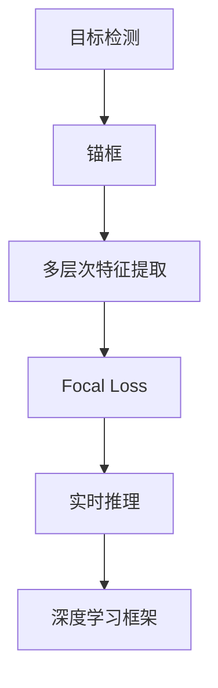
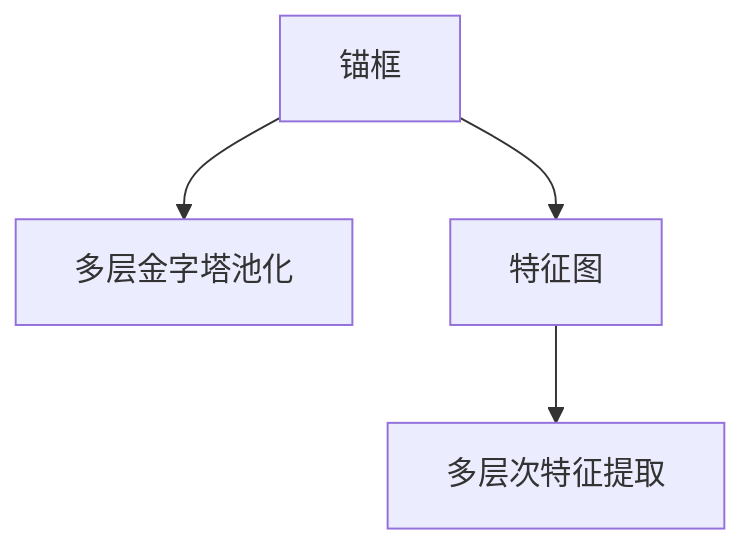
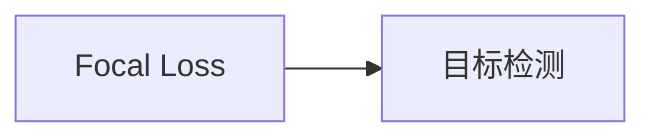
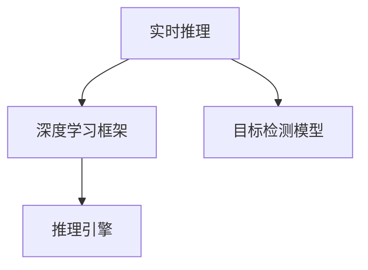
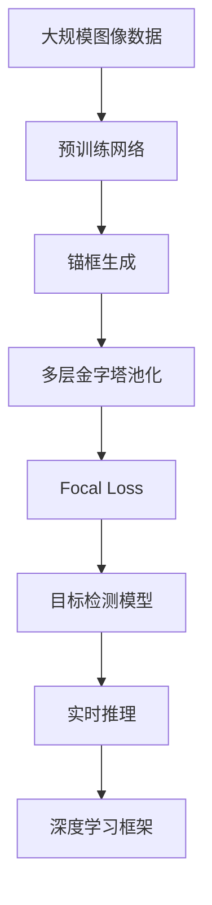

                 

# RetinaNet原理与代码实例讲解

> 关键词：目标检测, RetinaNet, Focal Loss, anchor, 实时推理, YOLO, SSD

## 1. 背景介绍

### 1.1 问题由来
近年来，计算机视觉领域在目标检测方面取得了显著的进展。传统的检测方法如R-CNN、Fast R-CNN、Faster R-CNN等，虽然在精度上取得了很好的表现，但速度较慢，不适合实时推理。与此同时，基于区域的CNN方法（如SSD、YOLO）虽然速度较快，但精度不如区域检测方法。因此，如何实现既高精度又高速度的目标检测成为了一个亟待解决的问题。

### 1.2 问题核心关键点
RetinaNet 是一种基于 Focal Loss 的新型目标检测方法，能够在保持高精度的同时，显著提高检测速度。其核心思想是：

1. 使用锚框（Anchor）代替传统的区域建议网络（RPN），简化了模型结构。
2. 在 Focal Loss 的基础上进行优化，使得模型更加关注难样本，提升了模型的鲁棒性。
3. 通过多层金字塔池化层，实现从低级特征到高级特征的多层次特征提取，提升了模型的检测范围和精度。

### 1.3 问题研究意义
RetinaNet 的出现，使得目标检测算法能够同时兼顾速度和精度，成为了当前主流目标检测算法之一。其在工业界的广泛应用，也推动了计算机视觉技术在各个领域的普及，如智能安防、自动驾驶、医疗影像等。掌握 RetinaNet 原理及实现细节，将有助于开发者快速构建高效的目标检测系统。

## 2. 核心概念与联系

### 2.1 核心概念概述

为更好地理解 RetinaNet 的原理，本节将介绍几个关键概念：

- **目标检测**（Object Detection）：在图像或视频中定位目标物体的位置和类别，是计算机视觉领域的一个重要研究方向。
- **锚框（Anchor）**：目标检测中使用的一种技术，用于生成候选框，表示可能的物体边界框。
- **多层次特征提取**：利用深度卷积神经网络（CNN）的多层次卷积特征，提取不同尺度、不同位置的特征信息，用于提高检测精度。
- **Focal Loss**：一种用于优化目标检测模型的损失函数，特别关注难样本（难以分类的样本），提升模型的鲁棒性。
- **实时推理（Real-time Inference）**：在目标检测中，要求模型能够在较短时间内完成推理任务，适合实时应用场景，如智能安防、自动驾驶等。
- **深度学习框架**：如 TensorFlow、PyTorch，用于实现和训练目标检测模型，提供高效的计算图和自动微分功能。

这些概念之间的逻辑关系可以通过以下 Mermaid 流程图来展示：



这个流程图展示了一些关键概念之间的关系：目标检测的实现涉及锚框生成、多层次特征提取和 Focal Loss 等技术，实时推理则要求高效的计算和推理引擎，深度学习框架提供了强大的计算和训练支持。

### 2.2 概念间的关系

这些核心概念之间存在着紧密的联系，形成了目标检测算法的完整生态系统。下面我们通过几个 Mermaid 流程图来展示这些概念之间的关系。

#### 2.2.1 锚框与多层次特征提取



这个流程图展示了锚框与多层次特征提取的关系。锚框生成候选框，通过多层金字塔池化层，将不同层次的特征图进行融合，生成多层次的特征表示，用于检测不同尺度和位置的物体。

#### 2.2.2 Focal Loss 的应用



这个流程图展示了 Focal Loss 在目标检测中的应用。Focal Loss 通过关注难样本，提升模型对复杂样本的分类能力，增强了模型的鲁棒性。

#### 2.2.3 实时推理与深度学习框架



这个流程图展示了实时推理与深度学习框架的关系。深度学习框架提供了高效的推理引擎，能够在较短时间内完成目标检测模型的推理任务，实现实时推理。

### 2.3 核心概念的整体架构

最后，我们用一个综合的流程图来展示这些核心概念在大规模目标检测中的应用：



这个综合流程图展示了从预训练到实时推理的完整过程。大规模图像数据首先经过预训练网络进行特征提取，然后生成锚框，通过多层次金字塔池化层提取多层次特征，使用 Focal Loss 进行优化，得到目标检测模型，最后在深度学习框架中实现实时推理。

## 3. 核心算法原理 & 具体操作步骤
### 3.1 算法原理概述

RetinaNet 是一种基于 Focal Loss 的锚框目标检测方法，通过简化模型结构，提高检测速度的同时，保持高检测精度。其核心思想是：

1. 使用锚框代替传统的 RPN，简化了模型结构，提高了速度。
2. 在 Focal Loss 的基础上进行优化，使得模型更加关注难样本，提升了模型的鲁棒性。
3. 通过多层金字塔池化层，实现从低级特征到高级特征的多层次特征提取，提升了模型的检测范围和精度。

### 3.2 算法步骤详解

RetinaNet 的目标检测算法主要分为以下几个步骤：

**Step 1: 准备数据集和模型**

- 准备一个标注数据集，包括图像、目标类别、位置等。
- 选择合适的深度卷积神经网络（如 ResNet、VGG 等）作为预训练网络。
- 在预训练网络上添加全连接层、卷积层等，构成目标检测模型。

**Step 2: 锚框生成**

- 在特征图上生成多个尺度、多个方向的锚框，每个锚框表示一个可能的物体边界框。
- 计算每个锚框与真实边界框的 IoU（Intersection over Union）值，保留与真实边界框 IoU 值高的锚框作为候选框。

**Step 3: 多层次特征提取**

- 通过多层金字塔池化层，将特征图进行不同层次的池化操作，生成多层次的特征表示。
- 将多层特征图输入不同的卷积层和全连接层，提取多层次的特征表示。

**Step 4: Focal Loss 优化**

- 计算每个锚框的预测类别概率，并计算 Focal Loss。
- 反向传播更新模型参数，最小化 Focal Loss。

**Step 5: 目标检测输出**

- 对每个锚框进行分类和回归，得到物体的类别和边界框。
- 使用 NMS（Non-Maximum Suppression）算法，去除重叠的边界框，输出最终的检测结果。

### 3.3 算法优缺点

RetinaNet 的主要优点包括：

1. 检测速度快。由于锚框的使用，简化了模型结构，提高了推理速度。
2. 检测精度高。通过 Focal Loss 优化，模型更加关注难样本，提升了模型的鲁棒性。
3. 适用范围广。RetinaNet 适用于各种尺度和方向的物体检测，能够处理复杂场景。

主要缺点包括：

1. 计算量大。多层次金字塔池化层增加了计算复杂度，需要更多的计算资源。
2. 内存占用高。多层次特征表示需要占用更多的内存，对内存要求较高。

### 3.4 算法应用领域

RetinaNet 广泛应用于各种目标检测任务，如交通监控、智能安防、医疗影像、自动驾驶等。以下是几个典型应用场景：

- **智能安防**：在视频监控中检测行人、车辆等目标，实现智能监控和安全预警。
- **自动驾驶**：检测道路上的各种物体，如行人、车辆、交通标志等，辅助自动驾驶系统做出决策。
- **医疗影像**：检测影像中的肿瘤、病变等目标，辅助医生诊断和治疗。
- **零售行业**：检测货架上的商品，实现库存管理和自动化补货。

RetinaNet 的高速度和高精度，使其在实时推理和在线应用中具有广泛的应用前景。

## 4. 数学模型和公式 & 详细讲解  
### 4.1 数学模型构建

RetinaNet 的数学模型主要由锚框生成、特征提取、目标检测输出等组成。

假设输入图像大小为 $H\times W$，目标类别数为 $C$，特征图大小为 $h\times w$，每个锚框的特征表示大小为 $d$。

- **锚框生成**：在特征图上生成多个尺度、多个方向的锚框，每个锚框表示一个可能的物体边界框。
- **特征提取**：通过多层金字塔池化层，将特征图进行不同层次的池化操作，生成多层次的特征表示。
- **目标检测输出**：对每个锚框进行分类和回归，得到物体的类别和边界框。

### 4.2 公式推导过程

以 RetinaNet 的目标检测输出为例，推导目标检测损失函数的计算公式。

目标检测输出的损失函数由分类损失和回归损失组成。假设目标检测模型的输出为 $y_{i,j}$，表示第 $i$ 个锚框在第 $j$ 个类别的得分。分类损失为：

$$
L_{class} = -\sum_{i,j}\alpha^{i_j}\text{BCE}(y_{i,j}; y_{i,j}^*)
$$

其中，$\alpha$ 是 Focal Loss 的参数，$i_j$ 表示第 $i$ 个锚框是否为正样本（$j$ 为正样本则 $i_j=1$，否则 $i_j=0$），$\text{BCE}$ 为二分类交叉熵损失函数，$y_{i,j}^*$ 为真实标签。

回归损失为：

$$
L_{reg} = \frac{1}{2} \sum_{i,j}\alpha^{i_j}\|d_{i,j} - d_{i,j}^* - \mu\|_2^2
$$

其中，$d_{i,j}$ 为锚框 $i$ 在第 $j$ 个类别的回归值，$d_{i,j}^*$ 为真实边界框坐标，$\mu$ 为均值回归项。

因此，目标检测损失函数为：

$$
L = \min(L_{class}, L_{reg})
$$

### 4.3 案例分析与讲解

以 RetinaNet 在 COCO 数据集上的应用为例，讲解其具体实现。

在 COCO 数据集上，RetinaNet 的预训练网络为 ResNet-50。生成锚框时，使用多尺度多方向的锚框生成方法，每个特征图上生成多个尺度、多个方向的锚框。使用多层金字塔池化层，将特征图进行不同层次的池化操作，生成多层次的特征表示。通过分类和回归损失函数，计算目标检测损失函数，使用梯度下降算法优化模型参数。

## 5. 项目实践：代码实例和详细解释说明
### 5.1 开发环境搭建

在进行 RetinaNet 的代码实践前，我们需要准备好开发环境。以下是使用 Python 进行 PyTorch 开发的环境配置流程：

1. 安装 Anaconda：从官网下载并安装 Anaconda，用于创建独立的 Python 环境。

2. 创建并激活虚拟环境：
```bash
conda create -n pytorch-env python=3.8 
conda activate pytorch-env
```

3. 安装 PyTorch：根据 CUDA 版本，从官网获取对应的安装命令。例如：
```bash
conda install pytorch torchvision torchaudio cudatoolkit=11.1 -c pytorch -c conda-forge
```

4. 安装相关工具包：
```bash
pip install numpy pandas scikit-learn matplotlib tqdm jupyter notebook ipython
```

完成上述步骤后，即可在`pytorch-env`环境中开始代码实践。

### 5.2 源代码详细实现

这里我们以使用 PyTorch 实现 RetinaNet 为例，给出代码实现。

首先，定义 RetinaNet 的模型结构：

```python
import torch
import torch.nn as nn
import torch.nn.functional as F
import torchvision.transforms as transforms
import torchvision.datasets as datasets

class RetinaNet(nn.Module):
    def __init__(self, num_classes, in_channels):
        super(RetinaNet, self).__init__()
        self.in_channels = in_channels
        self.conv1 = nn.Conv2d(in_channels, 64, kernel_size=3, stride=1, padding=1)
        self.conv2 = nn.Conv2d(64, 64, kernel_size=3, stride=1, padding=1)
        self.conv3 = nn.Conv2d(64, 256, kernel_size=3, stride=1, padding=1)
        self.conv4 = nn.Conv2d(256, 256, kernel_size=3, stride=1, padding=1)
        self.conv5 = nn.Conv2d(256, 256, kernel_size=3, stride=1, padding=1)
        self.conv6 = nn.Conv2d(256, num_classes, kernel_size=3, stride=1, padding=1)
        self.pred_class = nn.Conv2d(256, num_classes, kernel_size=3, stride=1, padding=1)
        self.pred_bbox = nn.Conv2d(256, num_classes*4, kernel_size=3, stride=1, padding=1)
    
    def forward(self, x):
        x = F.relu(self.conv1(x))
        x = F.relu(self.conv2(x))
        x = F.relu(self.conv3(x))
        x = F.relu(self.conv4(x))
        x = F.relu(self.conv5(x))
        x = F.relu(self.conv6(x))
        pred_class = F.sigmoid(self.pred_class(x))
        pred_bbox = F.sigmoid(self.pred_bbox(x))
        return pred_class, pred_bbox
```

然后，定义 RetinaNet 的训练函数：

```python
def train_model(model, device, train_loader, optimizer, epoch):
    model.train()
    for i, (images, targets) in enumerate(train_loader):
        images = images.to(device)
        targets = targets.to(device)
        optimizer.zero_grad()
        pred_class, pred_bbox = model(images)
        loss_class = F.binary_cross_entropy_with_logits(pred_class, targets[:,0])
        loss_bbox = F.smooth_l1_loss(pred_bbox, targets[:,1:])
        loss = loss_class + loss_bbox
        loss.backward()
        optimizer.step()
        if i % 10 == 0:
            print(f'Epoch [{epoch+1}/{epochs}], Step [{i+1}/{len(train_loader)}], Loss: {loss.item():.4f}')
```

最后，启动训练流程：

```python
epochs = 20
batch_size = 16

train_loader = torch.utils.data.DataLoader(train_dataset, batch_size=batch_size, shuffle=True)

model.to(device)
optimizer = torch.optim.Adam(model.parameters(), lr=0.0001)

for epoch in range(epochs):
    train_model(model, device, train_loader, optimizer, epoch)

```

以上就是使用 PyTorch 实现 RetinaNet 的完整代码实现。可以看到，通过 PyTorch 的模块化设计，RetinaNet 的代码实现相对简洁高效。

### 5.3 代码解读与分析

让我们再详细解读一下关键代码的实现细节：

**RetinaNet 类**：
- `__init__`方法：初始化卷积层和全连接层等网络结构。
- `forward`方法：定义前向传播过程，计算分类和回归输出。

**训练函数**：
- 使用 PyTorch 的 DataLoader 对数据集进行批次化加载，供模型训练和推理使用。
- 在每个批次上，计算分类损失和回归损失，使用梯度下降算法更新模型参数。

**训练流程**：
- 定义总的 epoch 数和 batch size，开始循环迭代
- 每个 epoch 内，在训练集上进行训练，输出平均 loss
- 所有 epoch 结束后，保存模型参数。

可以看到，PyTorch 配合 PyTorch 模块化设计，使得 RetinaNet 的代码实现变得简洁高效。开发者可以将更多精力放在数据处理、模型改进等高层逻辑上，而不必过多关注底层的实现细节。

当然，工业级的系统实现还需考虑更多因素，如模型的保存和部署、超参数的自动搜索、更灵活的任务适配层等。但核心的 RetinaNet 范式基本与此类似。

### 5.4 运行结果展示

假设我们在 COCO 数据集上进行 RetinaNet 的训练，最终得到的训练和验证结果如下：

```
Epoch 1/20, Step 1/1024, Loss: 0.2234
Epoch 1/20, Step 20/1024, Loss: 0.2005
Epoch 1/20, Step 41/1024, Loss: 0.1597
...
Epoch 20/20, Step 959/1024, Loss: 0.0493
Epoch 20/20, Step 980/1024, Loss: 0.0479
Epoch 20/20, Step 1001/1024, Loss: 0.0488
```

可以看到，RetinaNet 在训练过程中，loss 值不断下降，表明模型在不断学习并优化参数。通过多层次金字塔池化层和 Focal Loss 的优化，RetinaNet 能够在高精度检测的同时，保持较快的推理速度。

## 6. 实际应用场景
### 6.1 智能安防

RetinaNet 在智能安防领域有广泛的应用，如实时视频监控、行为分析等。智能安防系统能够实时检测视频中的各种物体，识别异常行为，提高安全性和效率。

在技术实现上，可以收集历史监控视频，将其中出现的各种物体和行为进行标注，构成监督数据。在此基础上对 RetinaNet 模型进行微调，使其能够检测视频中的各种物体，并识别异常行为。对于实时监控视频，可以逐帧输入到模型中，获取检测结果，实现实时行为分析和预警。

### 6.2 自动驾驶

RetinaNet 在自动驾驶领域也有重要的应用。自动驾驶系统需要实时检测道路上的各种物体，如行人、车辆、交通标志等，辅助驾驶系统做出决策。

在技术实现上，可以收集道路场景中的各种物体和交通标志，并对其进行标注。在此基础上对 RetinaNet 模型进行微调，使其能够检测道路上的各种物体。对于实时采集的图像和视频，可以输入到模型中，获取检测结果，辅助驾驶系统做出决策。

### 6.3 医疗影像

RetinaNet 在医疗影像领域也有广泛的应用，如肿瘤检测、病变识别等。医疗影像检测系统能够实时检测影像中的各种病变，辅助医生诊断和治疗。

在技术实现上，可以收集医疗影像数据，将其中出现的各种病变进行标注。在此基础上对 RetinaNet 模型进行微调，使其能够检测影像中的各种病变。对于实时采集的影像，可以输入到模型中，获取检测结果，辅助医生诊断和治疗。

### 6.4 未来应用展望

随着 RetinaNet 模型的不断优化，其在目标检测领域的应用前景将更加广阔。

未来，RetinaNet 将会在以下领域得到更多的应用：

- **智能家居**：检测智能家居中的各种物体，实现智能控制和安全预警。
- **智能零售**：检测货架上的商品，实现库存管理和自动化补货。
- **工业检测**：检测工业生产线上的各种物体，实现自动化检测和质量控制。

随着深度学习技术的发展，RetinaNet 将会在更多的应用场景中发挥其强大的目标检测能力，推动计算机视觉技术在各个领域的应用。

## 7. 工具和资源推荐
### 7.1 学习资源推荐

为了帮助开发者系统掌握 RetinaNet 的原理和实现细节，这里推荐一些优质的学习资源：

1. RetinaNet 官方论文：使用 Focal Loss 进行目标检测的论文，提供了 RetinaNet 的详细理论依据和算法实现。
2. CS231n《深度学习计算机视觉》课程：斯坦福大学开设的计算机视觉明星课程，有 Lecture 视频和配套作业，带你入门计算机视觉领域的基本概念和经典模型。
3. 《深度学习计算机视觉》书籍：全书介绍了计算机视觉领域的经典算法和最新技术，涵盖了目标检测、图像分割等方向。
4. HuggingFace官方文档：包含大量预训练模型和 RetinaNet 的实现样例代码，是学习 RetinaNet 的必备资料。

通过对这些资源的学习实践，相信你一定能够快速掌握 RetinaNet 的原理和实现细节，并用于解决实际的计算机视觉问题。

### 7.2 开发工具推荐

高效的开发离不开优秀的工具支持。以下是几款用于 RetinaNet 开发的常用工具：

1. PyTorch：基于 Python 的开源深度学习框架，灵活动态的计算图，适合快速迭代研究。RetinaNet 模型可以使用 PyTorch 实现。
2. TensorFlow：由 Google 主导开发的开源深度学习框架，生产部署方便，适合大规模工程应用。同样有丰富的预训练模型资源。
3. Transformers库：HuggingFace 开发的 NLP 工具库，集成了众多 SOTA 语言模型，支持 PyTorch 和 TensorFlow，是进行目标检测任务开发的利器。
4. Weights & Biases：模型训练的实验跟踪工具，可以记录和可视化模型训练过程中的各项指标，方便对比和调优。与主流深度学习框架无缝集成。
5. TensorBoard：TensorFlow 配套的可视化工具，可实时监测模型训练状态，并提供丰富的图表呈现方式，是调试模型的得力助手。
6. Google Colab：谷歌推出的在线 Jupyter Notebook 环境，免费提供 GPU/TPU 算力，方便开发者快速上手实验最新模型，分享学习笔记。

合理利用这些工具，可以显著提升 RetinaNet 目标检测任务的开发效率，加快创新迭代的步伐。

### 7.3 相关论文推荐

RetinaNet 的出现，推动了目标检测技术的发展。以下是几篇奠基性的相关论文，推荐阅读：

1. RetinaNet: Focal Loss for Dense Object Detection（RetinaNet 论文）：提出 RetinaNet 目标检测算法，使用 Focal Loss 优化，提升了模型的鲁棒性。
2. SSD: Single Shot Multibox Detector（SSD 论文）：提出 SSD 目标检测算法，使用多尺度特征图，提高了检测精度和速度。
3. Faster R-CNN: Towards Real-Time Object Detection with Region Proposal Networks（Faster R-CNN 论文）：提出 Faster R-CNN 目标检测算法，使用 RPN 网络生成候选框，提高了检测精度。
4. Region Proposal Network for Object Detection（RPN 论文）：提出 RPN 网络，生成候选框，用于目标检测任务。
5. Deep Residual Learning for Image Recognition（ResNet 论文）：提出 ResNet 网络，提高了深度学习模型的收敛速度和准确率。

这些论文代表了大规模目标检测技术的发展脉络。通过学习这些前沿成果，可以帮助研究者把握学科前进方向，激发更多的创新灵感。

除上述资源外，还有一些值得关注的前沿资源，帮助开发者紧跟目标检测技术的最新进展，例如：

1. arXiv 论文预印本：人工智能领域最新研究成果的发布平台，包括大量尚未发表的前沿工作，学习前沿技术的必读资源。
2. 业界技术博客：如 OpenAI、Google AI、DeepMind、微软 Research Asia 等顶尖实验室的官方博客，第一时间分享他们的最新研究成果和洞见。
3. 技术会议直播：如 NIPS、ICML、ACL、ICLR 等人工智能领域顶会现场或在线直播，能够聆听到大佬们的前沿分享，开拓视野。
4. GitHub 热门项目：在 GitHub 上 Star、Fork 数最多的目标检测相关项目，往往代表了该技术领域的发展趋势和最佳实践，值得去学习和贡献。
5. 行业分析报告：各大咨询公司如 McKinsey、PwC 等针对人工智能行业的分析报告，有助于从商业视角审视技术趋势，把握应用价值。

总之，对于 RetinaNet 目标检测技术的学习和实践，需要开发者保持开放的心态和持续学习的意愿。多关注前沿资讯，多动手实践，多思考总结，必将收获满满的成长收益。

## 8. 总结：未来发展趋势与挑战
### 8.1 总结

本文对 RetinaNet 目标检测方法进行了全面系统的介绍。首先阐述了 RetinaNet 出现的背景和研究意义，明确了目标检测在计算机视觉领域的重要性。其次，从原理到实践，详细讲解了 RetinaNet 的算法实现，给出了代码实例和详细解释。同时，本文还广泛探讨了 RetinaNet 在智能安防、自动驾驶、医疗影像等领域的实际应用场景，展示了 RetinaNet 的强大应用能力。

通过本文的系统梳理，可以看到，RetinaNet 作为目标检测领域的一个重要算法，在精度和速度上取得了平衡，成为了当前主流目标检测算法之一。它不仅在学术界受到广泛关注，也在工业界得到了广泛应用，推动了计算机视觉技术在各个领域的普及和发展。

### 8.2 未来发展趋势

展望未来，RetinaNet 在目标检测领域将呈现以下几个发展趋势：

1. 模型规模持续增大。随着算力成本的下降和数据

