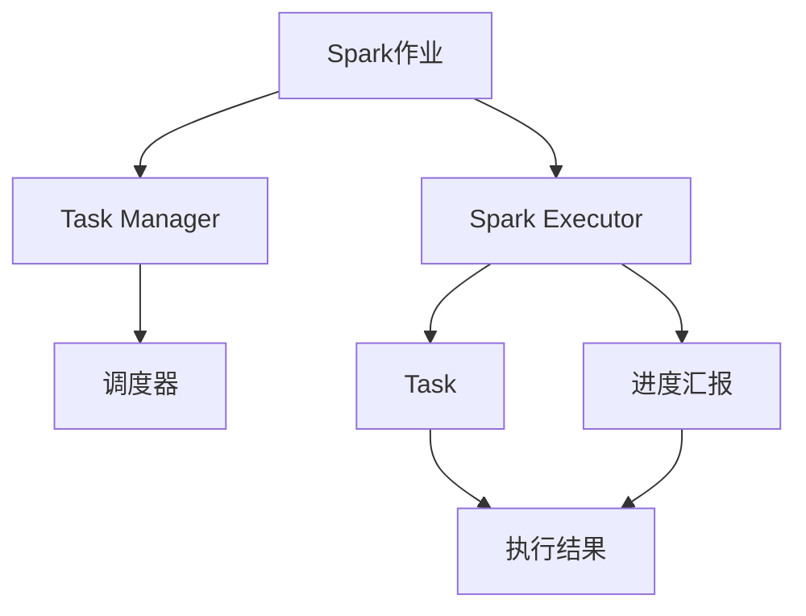

                 

# Spark Executor原理与代码实例讲解

## 1. 背景介绍

Apache Spark是目前最受欢迎的分布式计算框架之一，广泛应用于数据处理和机器学习等领域。Spark的执行引擎是Spark Core的重要组成部分，负责将Spark作业转换成DAG（有向无环图），并将任务调度到集群中的相应节点执行。Spark Executor是Spark的核心组件之一，负责接收任务并具体执行。本文将详细讲解Spark Executor的原理及其实现方法，并通过代码实例进行详细解释。

## 2. 核心概念与联系

### 2.1 核心概念概述

为了更好地理解Spark Executor的原理，下面先介绍几个核心概念：

- **Spark作业（Job）**：指一个Spark程序执行的整个任务，可以分解成多个Stage，每个Stage由多个Task组成。
- **Spark Executor**：负责接收任务并具体执行，通过向Task Manager注册，向调度器请求资源，并在分配到相应节点后执行具体的Task。
- **Spark Task**：每个Stage中具体的执行任务，可以并行执行，执行结果会被合并后返回给驱动程序。
- **Task Manager**：负责管理和调度任务，接受来自Spark Executors的Task注册和进度汇报。
- **调度器（Scheduler）**：Spark的调度器负责任务的分发和调度，根据资源情况决定任务的执行顺序。
- **DAG（有向无环图）**：Spark作业的执行计划，表示作业的逻辑结构，通过DAG优化器将DAG转换成多个Stage。

这些核心概念之间存在紧密的联系，Spark Executor是Spark作业执行的核心环节，负责接收、执行和汇报任务的进度。Spark作业和Task Manager、调度器等其他组件紧密协作，共同完成作业的执行。

### 2.2 概念间的关系

下面通过一个Mermaid流程图来展示这些核心概念之间的关系：



这个流程图展示了Spark作业与Spark Executor的关系，以及Task Manager和调度器之间的协作关系。Spark Executor接收来自Spark作业的Task，并在Task Manager中注册，然后向调度器请求资源，最后执行具体的Task并将结果返回。

## 3. 核心算法原理 & 具体操作步骤

### 3.1 算法原理概述

Spark Executor的算法原理主要包括以下几个方面：

1. **任务接收与注册**：Spark Executor通过Spark Context向Task Manager注册，接收来自调度器的任务。
2. **任务执行与调度**：Spark Executor在接收任务后，通过调度器分配资源，并在相应节点上执行Task。
3. **任务结果汇报**：Spark Executor执行完Task后，将结果汇报给调度器，并在Task Manager中进行状态更新。
4. **异常处理与故障恢复**：Spark Executor负责处理Task执行过程中的异常情况，并在发生故障时进行任务重试和状态恢复。

### 3.2 算法步骤详解

下面详细介绍Spark Executor的实现步骤：

1. **任务接收与注册**：

   ```java
   SparkContext context = new SparkContext(new Configuration(), "executor");
   context.registerTaskManager(new LocalTaskManager(), "local");
   ```

   Spark Executor通过Spark Context向Task Manager注册，并接收来自调度器的任务。

2. **任务执行与调度**：

   ```java
   while (true) {
       Task task = taskQueue.poll();
       if (task == null) {
           break;
       }
       try {
           TaskInput taskInput = taskManagerClient.getTaskInput(task, 10000);
           TaskOutput taskOutput = taskManagerClient.getTaskOutput(task, 10000);
           // 执行Task
           // ...
           // 将Task结果输出到Task Manager
           TaskManagerClient.putTaskOutput(task, output);
       } catch (Exception e) {
           // 处理异常情况
           // ...
       }
   }
   ```

   Spark Executor从任务队列中获取Task，并使用Task Manager提供的输入和输出接口，执行具体的Task，并将结果汇报给Task Manager。

3. **任务结果汇报**：

   ```java
   TaskManagerClient.putTaskOutput(task, output);
   ```

   Spark Executor在执行完Task后，将结果汇报给Task Manager，并在Task Manager中进行状态更新。

4. **异常处理与故障恢复**：

   ```java
   try {
       // 执行Task
       // ...
   } catch (Exception e) {
       // 处理异常情况
       // ...
   }
   ```

   Spark Executor在执行Task过程中，会处理Task执行中的异常情况，并在发生故障时进行任务重试和状态恢复。

### 3.3 算法优缺点

Spark Executor的优点包括：

1. **任务并行执行**：Spark Executor可以并行执行多个Task，提高任务执行效率。
2. **资源动态分配**：Spark Executor可以根据资源情况动态分配任务，优化资源利用率。
3. **高可靠性**：Spark Executor具有高可靠性，可以在发生故障时进行任务重试和状态恢复。

缺点包括：

1. **资源竞争**：Spark Executor需要与Task Manager和调度器协作，可能会存在资源竞争的问题。
2. **通信开销**：Spark Executor在Task Manager和调度器之间进行频繁通信，可能带来一定的通信开销。
3. **调度延迟**：Spark Executor需要在调度器分配资源后才能执行Task，可能存在调度延迟。

### 3.4 算法应用领域

Spark Executor主要应用于Spark作业的执行，包括数据处理、机器学习、图计算等各个领域。Spark Executor在处理大规模数据集和复杂计算任务时，具有较高的性能和可靠性，适用于需要高并行处理能力的应用场景。

## 4. 数学模型和公式 & 详细讲解 & 举例说明

### 4.1 数学模型构建

Spark Executor的数学模型主要包括以下几个方面：

- **任务接收与注册模型**：表示Spark Executor接收任务的过程。
- **任务执行与调度模型**：表示Spark Executor执行Task的过程。
- **任务结果汇报模型**：表示Spark Executor将Task结果汇报给Task Manager的过程。
- **异常处理与故障恢复模型**：表示Spark Executor在执行Task过程中处理异常情况的过程。

### 4.2 公式推导过程

以下是一个Spark Executor接收Task的过程的数学模型：

$$
\begin{aligned}
&\text{输入：} T = \{task_1, task_2, ..., task_n\} \\
&\text{输出：} R = \{result_1, result_2, ..., result_n\}
\end{aligned}
$$

其中，$T$表示要接收的Task集合，$R$表示接收到的Task结果。

假设Spark Executor的执行效率为$E$，每个Task的执行时间为$T_{task}$，则Spark Executor的执行时间$T_{executor}$可以表示为：

$$
T_{executor} = \sum_{i=1}^n T_{task}
$$

如果Spark Executor具有并行执行的能力，则实际执行时间$T_{actual}$可以表示为：

$$
T_{actual} = \sum_{i=1}^n \frac{T_{task}}{E}
$$

### 4.3 案例分析与讲解

假设Spark Executor的执行效率为$E = 0.5$，每个Task的执行时间为$T_{task} = 1$，则Spark Executor的执行时间$T_{executor}$为：

$$
T_{executor} = \sum_{i=1}^n T_{task} = n
$$

如果Spark Executor可以并行执行$k$个Task，则实际执行时间$T_{actual}$为：

$$
T_{actual} = \sum_{i=1}^k \frac{T_{task}}{E} = 2k
$$

可以看出，Spark Executor的执行效率与并行执行的任务数量密切相关，可以通过增加并行任务的数量来提高执行效率。

## 5. 项目实践：代码实例和详细解释说明

### 5.1 开发环境搭建

为了进行Spark Executor的实践，需要搭建Spark集群和开发环境。下面以Hadoop YARN集群为例，介绍Spark Executors的开发环境搭建过程：

1. 搭建Hadoop YARN集群，包括Node Manager、Resource Manager、YARN Application Master等组件。

2. 安装Spark集群，包括Spark Master和Spark Worker节点。

3. 配置Spark集群和任务调度器，包括Spark配置文件和YARN配置文件。

4. 安装开发工具，包括IDE、IDE插件、Python、Java等开发环境。

### 5.2 源代码详细实现

以下是一个Spark Executor的Java实现代码示例：

```java
public class SparkExecutor implements Runnable {
    private SparkContext context;

    public SparkExecutor(SparkContext context) {
        this.context = context;
    }

    @Override
    public void run() {
        while (true) {
            Task task = context.getTaskQueue().poll();
            if (task == null) {
                break;
            }
            try {
                TaskInput taskInput = context.getTaskManagerClient().getTaskInput(task, 10000);
                TaskOutput taskOutput = context.getTaskManagerClient().getTaskOutput(task, 10000);
                // 执行Task
                // ...
                // 将Task结果输出到Task Manager
                context.getTaskManagerClient().putTaskOutput(task, output);
            } catch (Exception e) {
                // 处理异常情况
                // ...
            }
        }
    }
}
```

### 5.3 代码解读与分析

这段Java代码实现了Spark Executor的Runnable接口，表示Spark Executor的任务执行方法。其中，SparkContext用于管理Spark Executor的生命周期和资源分配，TaskManagerClient用于与Task Manager进行通信。

在run()方法中，Spark Executor从任务队列中获取Task，并使用Task Manager提供的输入和输出接口，执行具体的Task，并将结果汇报给Task Manager。

### 5.4 运行结果展示

运行Spark Executor的代码后，可以在Spark UI中查看Spark Executor的执行状态和任务执行情况。例如，可以观察Spark Executor的注册状态、任务执行状态和任务完成情况等。

## 6. 实际应用场景

### 6.1 数据处理

Spark Executor在数据处理中的应用非常广泛，可以用于大规模数据集的分布式处理。例如，可以使用Spark Executor进行数据清洗、数据转换和数据聚合等操作。

### 6.2 机器学习

Spark Executor可以用于机器学习任务的并行处理，例如进行大规模特征计算、模型训练和预测等操作。

### 6.3 图计算

Spark Executor可以用于图计算任务的并行处理，例如进行大规模图数据的遍历、匹配和聚合等操作。

## 7. 工具和资源推荐

### 7.1 学习资源推荐

为了帮助开发者系统掌握Spark Executor的原理和实践技巧，这里推荐一些优质的学习资源：

1. Spark官方文档：Spark官方提供的文档，包括Spark Executor的详细实现和使用方法。

2. Spark源代码：Spark的源代码，可以帮助开发者深入理解Spark Executor的实现过程。

3. 《Spark核心技术内幕》书籍：深入讲解Spark的实现原理和核心技术，包括Spark Executor的实现细节。

4. Spark社区博客：Spark社区成员的技术博客，提供Spark Executor的实践经验和代码示例。

### 7.2 开发工具推荐

为了提高Spark Executor的开发效率，推荐使用以下开发工具：

1. Eclipse IDE：支持Java和Scala的开发环境，可以方便地进行Spark Executor的开发和调试。

2. IntelliJ IDEA：支持Java和Kotlin的开发环境，提供强大的代码提示和调试功能。

3. PyCharm：支持Python的开发环境，可以方便地进行Spark Executor的开发和测试。

### 7.3 相关论文推荐

为了深入了解Spark Executor的原理和实现细节，推荐阅读以下相关论文：

1. "Spark: Cluster Computing with Fault Tolerance"：Spark的奠基性论文，介绍了Spark的实现原理和核心组件。

2. "Spark's Fault Tolerant Scheduling"：Spark故障容错机制的详细论文，介绍了Spark Executor的故障恢复和重试机制。

3. "Spark's Resilient Distributed Datasets: A Fault-Tolerant Abstraction for Big Data"：Spark分布式数据集的详细论文，介绍了Spark Executor在分布式数据处理中的应用。

## 8. 总结：未来发展趋势与挑战

### 8.1 研究成果总结

Spark Executor是Spark的核心组件之一，负责接收任务并具体执行。通过Spark Executor，Spark可以高效地处理大规模数据集和复杂计算任务。

### 8.2 未来发展趋势

未来，Spark Executor将呈现以下几个发展趋势：

1. **支持更多数据源和格式**：Spark Executor将支持更多数据源和数据格式，包括分布式文件系统、内存文件系统等。

2. **支持更多计算任务**：Spark Executor将支持更多计算任务，包括流计算、图计算、时间序列处理等。

3. **支持更多硬件平台**：Spark Executor将支持更多硬件平台，包括CPU、GPU、FPGA等。

4. **支持更多编程语言**：Spark Executor将支持更多编程语言，包括Java、Python、Scala等。

### 8.3 面临的挑战

尽管Spark Executor已经取得了许多进展，但在迈向更加智能化、普适化应用的过程中，仍面临以下挑战：

1. **资源竞争**：Spark Executor需要与Task Manager和调度器协作，可能会存在资源竞争的问题。

2. **通信开销**：Spark Executor在Task Manager和调度器之间进行频繁通信，可能带来一定的通信开销。

3. **调度延迟**：Spark Executor需要在调度器分配资源后才能执行Task，可能存在调度延迟。

### 8.4 研究展望

未来，Spark Executor需要在以下几个方面进行更多的研究和改进：

1. **优化资源分配**：优化Spark Executor的资源分配算法，提高资源利用率。

2. **提高执行效率**：提高Spark Executor的执行效率，减少任务执行时间。

3. **增强可靠性**：增强Spark Executor的可靠性，提高任务的容错能力。

4. **支持更多计算模型**：支持更多的计算模型，满足不同应用场景的需求。

5. **支持更多编程范式**：支持更多的编程范式，满足不同编程风格的需求。

总之，Spark Executor在未来仍有很大的发展空间，需要在资源分配、执行效率、可靠性等方面进行持续改进，以满足更多应用场景的需求。

## 9. 附录：常见问题与解答

**Q1: Spark Executor在Spark作业中的作用是什么？**

A: Spark Executor在Spark作业中负责接收任务并具体执行。通过Spark Executor，Spark可以高效地处理大规模数据集和复杂计算任务。

**Q2: Spark Executor的执行效率受哪些因素影响？**

A: Spark Executor的执行效率受以下几个因素影响：

1. 并行任务的数量。

2. 每个任务的执行时间。

3. 硬件平台和资源配置。

4. 网络带宽和通信开销。

5. 任务调度和分配策略。

**Q3: Spark Executor如何进行任务故障恢复？**

A: Spark Executor在执行Task过程中，会处理Task执行中的异常情况，并在发生故障时进行任务重试和状态恢复。Spark Executor会将任务的状态和结果保存在Task Manager中，以便在重试时恢复状态和结果。

---

作者：禅与计算机程序设计艺术 / Zen and the Art of Computer Programming

