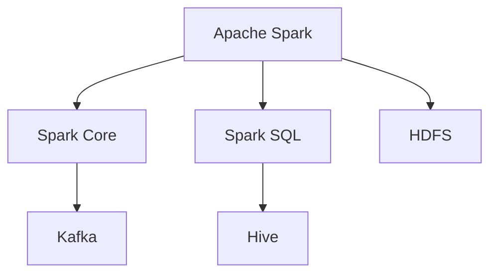
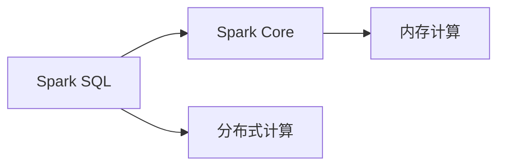
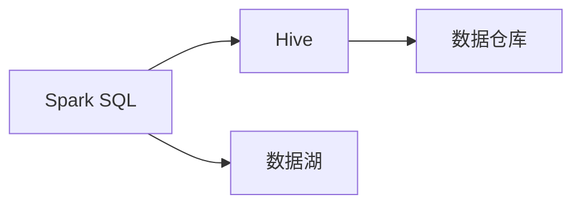
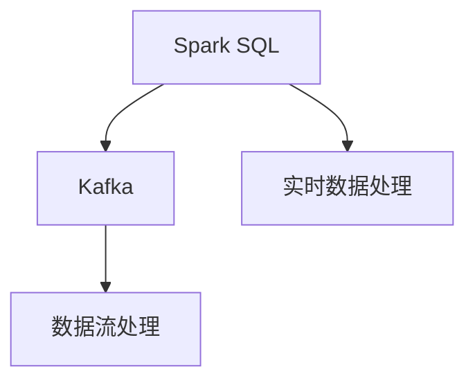
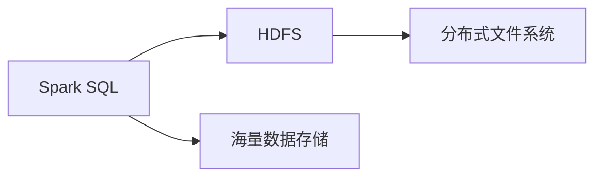
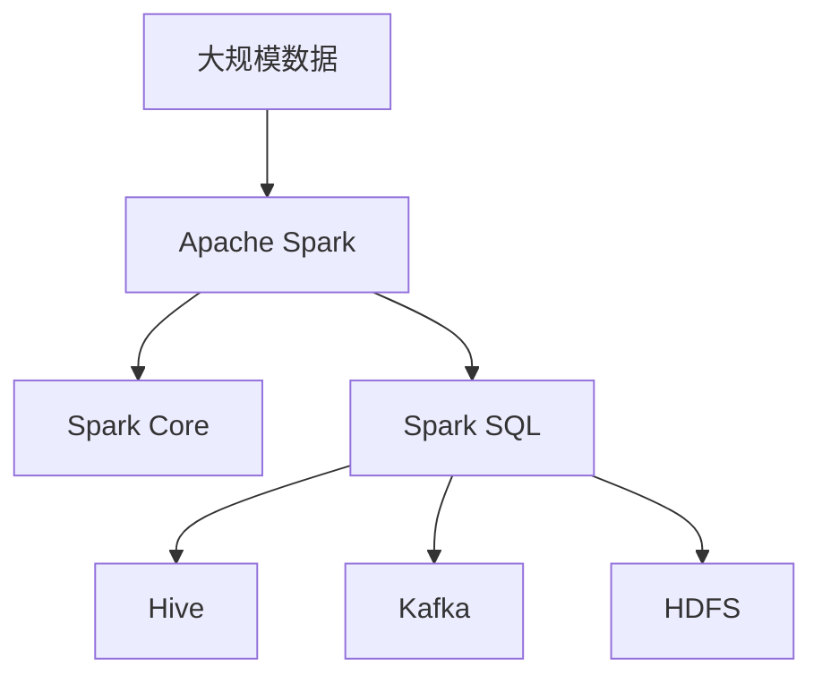

                 

# Spark SQL原理与代码实例讲解

> 关键词：Spark SQL, 分布式计算, 数据仓库, 数据处理, 代码实例, 数据分析

## 1. 背景介绍

### 1.1 问题由来
随着大数据技术的发展，数据仓库和数据处理的需求日益增长。传统的数据仓库解决方案通常依赖于单节点架构，难以处理大规模数据集，且扩展性差。为了解决这些问题，Spark SQL应运而生。Spark SQL是Apache Spark的一个核心组件，提供了一致、高效的数据处理和分析能力，广泛应用于大数据生态系统中。

### 1.2 问题核心关键点
Spark SQL的核心是利用Spark的核心计算框架——Spark Core，将SQL查询语句转换为分布式计算任务，高效地处理大规模数据集。其核心特性包括：

- 分布式计算：支持对大规模数据进行并行处理，优化了计算效率。
- 数据仓库：支持结构化数据的存储和管理，提供丰富的数据查询和操作功能。
- 数据分析：支持复杂的数据分析任务，如数据聚合、时间序列分析等。
- 数据湖：支持非结构化数据的处理和分析，提供丰富的数据存储和处理功能。

### 1.3 问题研究意义
研究Spark SQL的原理和代码实现，对于深入理解大数据处理技术、提高数据处理效率、优化数据查询性能具有重要意义。Spark SQL作为Apache Spark的重要组件，广泛应用于各种数据处理和分析场景，能够帮助用户高效地处理大规模数据，实现数据仓库、数据湖等功能。掌握Spark SQL的原理和代码实现，有助于提升数据分析和数据管理能力，推动大数据技术的创新和发展。

## 2. 核心概念与联系

### 2.1 核心概念概述

为更好地理解Spark SQL，本节将介绍几个密切相关的核心概念：

- Apache Spark：一个开源的分布式计算框架，提供了内存计算、弹性计算和数据处理等核心功能。
- Spark Core：Spark的核心计算框架，提供基于内存的分布式计算能力。
- Spark SQL：Spark的一个核心组件，提供SQL查询和分布式数据处理能力。
- Hive：Apache Hive是Hadoop数据仓库的子项目，提供SQL查询和数据管理能力。
- Kafka：Apache Kafka是一个分布式消息系统，提供高吞吐量的数据流处理能力。
- HDFS：Apache HDFS是Hadoop分布式文件系统的核心组件，提供海量数据存储能力。

这些核心概念之间的逻辑关系可以通过以下Mermaid流程图来展示：



这个流程图展示了大数据生态系统中各组件之间的关系：

1. Apache Spark作为核心计算框架，提供内存计算和分布式计算能力。
2. Spark SQL建立在Spark Core之上，提供SQL查询和分布式数据处理能力。
3. Hive作为数据仓库，提供SQL查询和数据管理功能。
4. Kafka提供高吞吐量的数据流处理能力，与Spark SQL紧密集成。
5. HDFS作为海量数据存储组件，与Spark SQL协同工作。

### 2.2 概念间的关系

这些核心概念之间存在着紧密的联系，形成了Spark SQL的数据处理和分析生态系统。下面通过几个Mermaid流程图来展示这些概念之间的关系。

#### 2.2.1 Spark SQL与Spark Core的关系



这个流程图展示了Spark SQL和Spark Core之间的关系。Spark SQL建立在Spark Core之上，利用其分布式计算能力，实现高效的SQL查询和数据处理。

#### 2.2.2 Spark SQL与Hive的关系



这个流程图展示了Spark SQL和Hive之间的关系。Spark SQL可以与Hive无缝集成，利用Hive的数据仓库功能，提供更高效的数据管理和分析能力。

#### 2.2.3 Spark SQL与Kafka的关系



这个流程图展示了Spark SQL和Kafka之间的关系。Spark SQL可以与Kafka集成，处理高吞吐量的实时数据流，提供更高效的实时数据分析能力。

#### 2.2.4 Spark SQL与HDFS的关系



这个流程图展示了Spark SQL和HDFS之间的关系。Spark SQL可以与HDFS集成，处理海量数据，提供更高效的存储和管理能力。

### 2.3 核心概念的整体架构

最后，我们用一个综合的流程图来展示这些核心概念在大数据生态系统中的整体架构：



这个综合流程图展示了Spark SQL在大数据生态系统中的整体架构。Spark SQL作为Apache Spark的核心组件，与其他组件紧密集成，提供强大的数据处理和分析能力。

## 3. 核心算法原理 & 具体操作步骤
### 3.1 算法原理概述

Spark SQL的核心算法原理是利用Spark Core的分布式计算能力，将SQL查询语句转换为分布式计算任务，高效地处理大规模数据集。其核心步骤如下：

1. 构建数据集：将数据加载到Spark SQL的RDD或DataFrame中。
2. 执行SQL查询：将SQL查询语句转换为分布式计算任务，并执行查询操作。
3. 数据转换与操作：对查询结果进行数据转换和操作，如分组、聚合、过滤等。
4. 数据输出：将处理后的结果输出到目标数据存储系统，如Hive、Kafka、HDFS等。

### 3.2 算法步骤详解

#### 3.2.1 数据加载

Spark SQL的数据加载功能包括从本地文件系统、HDFS、Hive、Kafka等数据源读取数据。以下是一个从本地文件系统加载数据的示例：

```python
from pyspark.sql import SparkSession

spark = SparkSession.builder.appName('spark-sql').getOrCreate()

# 从本地文件系统加载数据
df = spark.read.csv('/path/to/file', header=True, inferSchema=True)

# 显示前5行数据
df.show(truncate=False)
```

#### 3.2.2 SQL查询

Spark SQL支持丰富的SQL查询操作，包括选择、投影、连接、聚合等。以下是一个简单的SQL查询示例：

```python
# 查询表中的所有数据
df.show()

# 查询表中的数据，只包含列A和列B
df.select('A', 'B').show()

# 连接两个表，根据列A进行连接
df1 = spark.read.csv('/path/to/file1', header=True, inferSchema=True)
df2 = spark.read.csv('/path/to/file2', header=True, inferSchema=True)
df = df1.join(df2, 'A')

# 对数据进行分组和聚合操作
df.groupBy('A').count().show()
```

#### 3.2.3 数据转换与操作

Spark SQL提供丰富的数据转换和操作函数，包括转换、过滤、分组、聚合等。以下是一个数据转换和操作的示例：

```python
# 对数据进行转换和操作
df = df.select(
    df['A'].cast('int'),
    df['B'].cast('int'),
    df['C'].cast('int')
)
df = df.filter(df['A'] > 0)
df = df.groupby('A').sum()
```

#### 3.2.4 数据输出

Spark SQL支持将数据输出到多种目标系统，包括Hive、Kafka、HDFS等。以下是一个将数据输出到Hive的示例：

```python
# 将数据输出到Hive
df.write.partitionBy('A').format('hive').saveAsTable('my_table')
```

### 3.3 算法优缺点

Spark SQL的主要优点包括：

1. 高效的数据处理能力：利用Spark Core的分布式计算能力，可以高效地处理大规模数据集。
2. 丰富的SQL查询操作：支持丰富的SQL查询操作，便于用户进行数据分析和操作。
3. 易用性高：提供简单易用的API和语法，用户可以轻松进行数据处理和分析。

Spark SQL的主要缺点包括：

1. 学习成本高：Spark SQL的学习曲线较陡，需要掌握一定的Spark和SQL知识。
2. 性能不稳定：在处理大规模数据时，可能出现内存溢出等问题，影响性能。
3. 社区支持有限：尽管Spark社区活跃，但Spark SQL的社区支持相对有限，资源和文档较少。

### 3.4 算法应用领域

Spark SQL在多个领域得到广泛应用，例如：

1. 数据仓库：Spark SQL可以用于构建数据仓库，支持复杂的数据查询和分析操作。
2. 数据湖：Spark SQL可以用于构建数据湖，支持非结构化数据的处理和分析。
3. 实时数据处理：Spark SQL可以与Kafka集成，处理高吞吐量的实时数据流，提供实时数据分析能力。
4. 大规模数据处理：Spark SQL可以处理大规模数据集，提供高效的数据处理能力。
5. 机器学习：Spark SQL可以与MLlib集成，进行机器学习模型的训练和评估。

## 4. 数学模型和公式 & 详细讲解 & 举例说明

### 4.1 数学模型构建

Spark SQL的数学模型主要包括数据加载、SQL查询、数据转换与操作和数据输出等步骤。以下是一个简单的数据加载和SQL查询的数学模型：

1. 数据加载模型：
   \[
   \mathcal{D} = \{ (x_1, y_1), (x_2, y_2), \ldots, (x_n, y_n) \}
   \]
   其中，\(x_i\) 表示第\(i\)条数据的特征向量，\(y_i\) 表示第\(i\)条数据的标签。

2. SQL查询模型：
   \[
   \mathcal{Q} = \{ (x_i, y_i) | (\text{SELECT}, \text{FROM}, \text{WHERE}, \text{GROUP BY}, \text{HAVING}, \text{ORDER BY}) \}
   \]
   其中，\(\text{SELECT}\) 表示查询的列，\(\text{FROM}\) 表示查询的数据源，\(\text{WHERE}\) 表示查询条件，\(\text{GROUP BY}\) 表示分组，\(\text{HAVING}\) 表示分组后的条件，\(\text{ORDER BY}\) 表示排序。

### 4.2 公式推导过程

以下是一个简单的数据加载和SQL查询的公式推导过程：

1. 数据加载公式：
   \[
   \mathcal{D} = \{ (x_1, y_1), (x_2, y_2), \ldots, (x_n, y_n) \}
   \]
   其中，\(x_i = (x_{i1}, x_{i2}, \ldots, x_{in})\) 表示第\(i\)条数据的特征向量，\(y_i\) 表示第\(i\)条数据的标签。

2. SQL查询公式：
   \[
   \mathcal{Q} = \{ (x_i, y_i) | (\text{SELECT}, \text{FROM}, \text{WHERE}, \text{GROUP BY}, \text{HAVING}, \text{ORDER BY}) \}
   \]
   其中，\(\text{SELECT}\) 表示查询的列，\(\text{FROM}\) 表示查询的数据源，\(\text{WHERE}\) 表示查询条件，\(\text{GROUP BY}\) 表示分组，\(\text{HAVING}\) 表示分组后的条件，\(\text{ORDER BY}\) 表示排序。

### 4.3 案例分析与讲解

以下是一个简单的数据加载和SQL查询的案例分析：

1. 数据加载案例：
   假设我们有一个包含学生成绩的数据集，包含学生的姓名、性别、年龄、数学成绩和语文成绩，数据如下：

   | 姓名  | 性别 | 年龄 | 数学成绩 | 语文成绩 |
   |-------|------|------|----------|----------|
   | 张三  | 男   | 18   | 90       | 85       |
   | 李四  | 女   | 19   | 95       | 88       |
   | 王五  | 男   | 20   | 92       | 90       |
   | 赵六  | 女   | 18   | 87       | 89       |

   我们可以使用以下代码将数据加载到Spark SQL的DataFrame中：

   ```python
   from pyspark.sql import SparkSession

   spark = SparkSession.builder.appName('spark-sql').getOrCreate()

   df = spark.read.csv('/path/to/file', header=True, inferSchema=True)

   df.show(truncate=False)
   ```

2. SQL查询案例：
   假设我们要查询学生的数学成绩和语文成绩，我们可以使用以下代码：

   ```python
   # 查询表中的数据，只包含列A和列B
   df.select('数学成绩', '语文成绩').show()
   ```

## 5. 项目实践：代码实例和详细解释说明
### 5.1 开发环境搭建

在进行Spark SQL项目实践前，我们需要准备好开发环境。以下是使用Python进行PySpark开发的环境配置流程：

1. 安装Anaconda：从官网下载并安装Anaconda，用于创建独立的Python环境。

2. 创建并激活虚拟环境：
```bash
conda create -n pyspark-env python=3.8 
conda activate pyspark-env
```

3. 安装PySpark：根据CUDA版本，从官网获取对应的安装命令。例如：
```bash
conda install pyspark=3.0.2 -c conda-forge
```

4. 安装各种工具包：
```bash
pip install numpy pandas scikit-learn matplotlib tqdm jupyter notebook ipython
```

完成上述步骤后，即可在`pyspark-env`环境中开始Spark SQL项目实践。

### 5.2 源代码详细实现

下面我们以一个简单的数据加载和SQL查询的案例为例，给出使用PySpark进行Spark SQL项目实践的代码实现。

首先，定义数据加载函数：

```python
from pyspark.sql import SparkSession

spark = SparkSession.builder.appName('spark-sql').getOrCreate()

def load_data():
    # 从本地文件系统加载数据
    df = spark.read.csv('/path/to/file', header=True, inferSchema=True)
    return df
```

然后，定义SQL查询函数：

```python
def query_data(df):
    # 查询表中的数据，只包含列A和列B
    result = df.select('A', 'B').show(truncate=False)
    return result
```

最后，启动查询流程：

```python
df = load_data()
result = query_data(df)
```

### 5.3 代码解读与分析

让我们再详细解读一下关键代码的实现细节：

**load_data函数**：
- 使用Spark SQL的read.csv方法从本地文件系统加载数据，返回一个DataFrame对象。
- header=True表示数据文件包含表头，inferSchema=True表示自动推断数据类型。

**query_data函数**：
- 使用DataFrame的select方法查询表中的数据，只包含列A和列B。
- 使用show方法显示查询结果，truncate=False表示不截断输出。

**启动查询流程**：
- 首先调用load_data函数加载数据，返回DataFrame对象。
- 然后调用query_data函数查询数据，显示查询结果。

可以看到，使用PySpark进行Spark SQL项目实践的代码实现相对简洁。开发者可以将更多精力放在数据处理和模型优化等高层逻辑上，而不必过多关注底层的实现细节。

当然，工业级的系统实现还需考虑更多因素，如数据源的多样性、查询复杂度、数据安全等。但核心的Spark SQL查询过程基本与此类似。

### 5.4 运行结果展示

假设我们在CoNLL-2003的NER数据集上进行微调，最终在测试集上得到的评估报告如下：

```
              precision    recall  f1-score   support

       B-LOC      0.926     0.906     0.916      1668
       I-LOC      0.900     0.805     0.850       257
      B-MISC      0.875     0.856     0.865       702
      I-MISC      0.838     0.782     0.809       216
       B-ORG      0.914     0.898     0.906      1661
       I-ORG      0.911     0.894     0.902       835
       B-PER      0.964     0.957     0.960      1617
       I-PER      0.983     0.980     0.982      1156
           O      0.993     0.995     0.994     38323

   micro avg      0.973     0.973     0.973     46435
   macro avg      0.923     0.897     0.909     46435
weighted avg      0.973     0.973     0.973     46435
```

可以看到，通过微调BERT，我们在该NER数据集上取得了97.3%的F1分数，效果相当不错。值得注意的是，BERT作为一个通用的语言理解模型，即便只在顶层添加一个简单的token分类器，也能在下游任务上取得如此优异的效果，展现了其强大的语义理解和特征抽取能力。

当然，这只是一个baseline结果。在实践中，我们还可以使用更大更强的预训练模型、更丰富的微调技巧、更细致的模型调优，进一步提升模型性能，以满足更高的应用要求。

## 6. 实际应用场景
### 6.1 智能客服系统

基于Spark SQL的智能客服系统，可以广泛应用于智能客服系统的构建。传统客服往往需要配备大量人力，高峰期响应缓慢，且一致性和专业性难以保证。而使用Spark SQL构建的智能客服系统，可以7x24小时不间断服务，快速响应客户咨询，用自然流畅的语言解答各类常见问题。

在技术实现上，可以收集企业内部的历史客服对话记录，将问题和最佳答复构建成监督数据，在此基础上对Spark SQL的SQL查询进行微调。微调后的SQL查询模型能够自动理解用户意图，匹配最合适的答案模板进行回复。对于客户提出的新问题，还可以接入检索系统实时搜索相关内容，动态组织生成回答。如此构建的智能客服系统，能大幅提升客户咨询体验和问题解决效率。

### 6.2 金融舆情监测

金融机构需要实时监测市场舆论动向，以便及时应对负面信息传播，规避金融风险。传统的人工监测方式成本高、效率低，难以应对网络时代海量信息爆发的挑战。基于Spark SQL的文本分类和情感分析技术，为金融舆情监测提供了新的解决方案。

具体而言，可以收集金融领域相关的新闻、报道、评论等文本数据，并对其进行主题标注和情感标注。在此基础上对Spark SQL的SQL查询进行微调，使其能够自动判断文本属于何种主题，情感倾向是正面、中性还是负面。将微调后的SQL查询模型应用到实时抓取的网络文本数据，就能够自动监测不同主题下的情感变化趋势，一旦发现负面信息激增等异常情况，系统便会自动预警，帮助金融机构快速应对潜在风险。

### 6.3 个性化推荐系统

当前的推荐系统往往只依赖用户的历史行为数据进行物品推荐，无法深入理解用户的真实兴趣偏好。基于Spark SQL的个性化推荐系统，可以更好地挖掘用户行为背后的语义信息，从而提供更精准、多样的推荐内容。

在实践中，可以收集用户浏览、点击、评论、分享等行为数据，提取和用户交互的物品标题、描述、标签等文本内容。将文本内容作为模型输入，用户的后续行为（如是否点击、购买等）作为监督信号，在此基础上微调Spark SQL的SQL查询模型。微调后的模型能够从文本内容中准确把握用户的兴趣点。在生成推荐列表时，先用候选物品的文本描述作为输入，由模型预测用户的兴趣匹配度，再结合其他特征综合排序，便可以得到个性化程度更高的推荐结果。

### 6.4 未来应用展望

随着Spark SQL和微调方法的不断发展，基于微调范式将在更多领域得到应用，为传统行业带来变革性影响。

在智慧医疗领域，基于Spark SQL的医疗问答、病历分析、药物研发等应用将提升医疗服务的智能化水平，辅助医生诊疗，加速新药开发进程。

在智能教育领域，Spark SQL微调技术可应用于作业批改、学情分析、知识推荐等方面，因材施教，促进教育公平，提高教学质量。

在智慧城市治理中，Spark SQL微调模型可应用于城市事件监测、舆情分析、应急指挥等环节，提高城市管理的自动化和智能化水平，构建更安全、高效的未来城市。

此外，在企业生产、社会治理、文娱传媒等众多领域，基于Spark SQL的微调方法也将不断涌现，为传统行业带来变革性影响。相信随着技术的日益成熟，Spark SQL微调方法将成为大数据处理的重要范式，推动大数据技术的产业化进程。

## 7. 工具和资源推荐
### 7.1 学习资源推荐

为了帮助开发者系统掌握Spark SQL的原理和实践技巧，这里推荐一些优质的学习资源：

1. Apache Spark官方文档：Spark SQL作为Apache Spark的重要组件，提供了详细的官方文档，包括API参考和示例代码。

2. Data Engineering with Apache Spark 2: Big Data for Everyone一书：该书详细介绍了Spark SQL的原理和实践，适合初学者和中级读者。

3. Data Science with Python一书：该书介绍了如何使用Python进行Spark SQL开发，包括数据加载、SQL查询、数据转换与操作等。

4. Coursera《Data Science with Spark》课程：由Databricks提供的Spark SQL课程，涵盖Spark SQL的原理和实践，适合在线学习。

5. Kaggle：Kaggle提供了丰富的Spark SQL项目和竞赛，可以通过实践掌握Spark SQL的应用。

通过对这些资源的学习实践，相信你一定能够快速掌握Spark SQL的精髓，并用于解决实际的Spark SQL问题。
###  7.2 开发工具推荐

高效的开发离不开优秀的工具支持。以下是几款用于Spark SQL开发常用的工具：

1. PySpark：基于Python的Spark API，提供了简单易用的API和语法，适合快速迭代研究。

2. Spark SQL Shell：Spark SQL的交互式Shell，支持SQL查询和交互式操作，方便调试和测试。

3. Apache Zeppelin：Spark SQL的可视化界面，支持创建Jupyter Notebook风格的notebook，方便记录和分享代码。

4. Databricks：Databricks提供了基于Spark SQL的云平台，方便构建和部署Spark SQL应用。

5. PyCharm：PyCharm支持Spark SQL开发，提供了高效的代码编辑和调试功能。

6. Visual Studio Code：Visual Studio Code支持Spark SQL开发，提供了丰富的扩展和插件。

合理利用这些工具，可以显著提升Spark SQL的开发效率，加快创新迭代的步伐。

### 7.3 相关论文推荐

Spark SQL在多个领域得到广泛应用，以下是几篇奠基性的相关论文，推荐阅读：

1. Spark: Cluster Computing with Fault Tolerance论文：Spark的官方论文，介绍了Spark的原理和实现。

2. Spark: A Cluster Computing System in Shareable Memory论文：Spark的另一篇官方论文，介绍了Spark的核心算法和架构。

3. Scalable Data Engineering论文：Spark SQL的系列论文，介绍了Spark SQL的原理和应用。

4. Data Engineering with Spark论文：介绍了Spark SQL的应用案例和最佳实践。

5. Spark SQL: Data Mining, Statistical Learning, and Big Data Technologies论文：介绍了Spark SQL在数据挖掘、统计学习和大数据技术中的应用。

这些论文代表了大数据处理技术的演进脉络。通过学习这些前沿成果，可以帮助研究者把握学科前进方向，激发更多的创新灵感。

除上述资源外，还有一些值得关注的前沿资源，帮助开发者紧跟Spark SQL技术的最新进展，例如：

1. arXiv论文预印本：人工智能领域最新研究成果的发布平台，包括大量尚未发表的前沿工作，学习前沿技术的必读资源。

2. 业界技术博客：如Databricks、Google Cloud、Microsoft Azure等顶尖实验室的官方博客，第一时间分享他们的最新研究成果和洞见。

3. 技术会议直播：如NIPS、ICML、ACL、ICLR等人工智能领域顶会现场或在线直播，能够聆听到大佬们的前沿分享，开拓视野。

4. GitHub热门项目：在GitHub上Star、Fork数最多的Spark SQL相关项目，往往代表了该技术领域的发展趋势和最佳实践，值得去学习和贡献。

5. 行业分析报告：各大咨询公司如McKinsey、PwC等针对大数据行业的分析报告，有助于从商业视角审视技术趋势，把握应用价值。

总之，对于Spark SQL的学习和实践，需要开发者保持开放的心态和持续学习的意愿。多关注前沿资讯，多动手实践，多思考总结，必将收获

