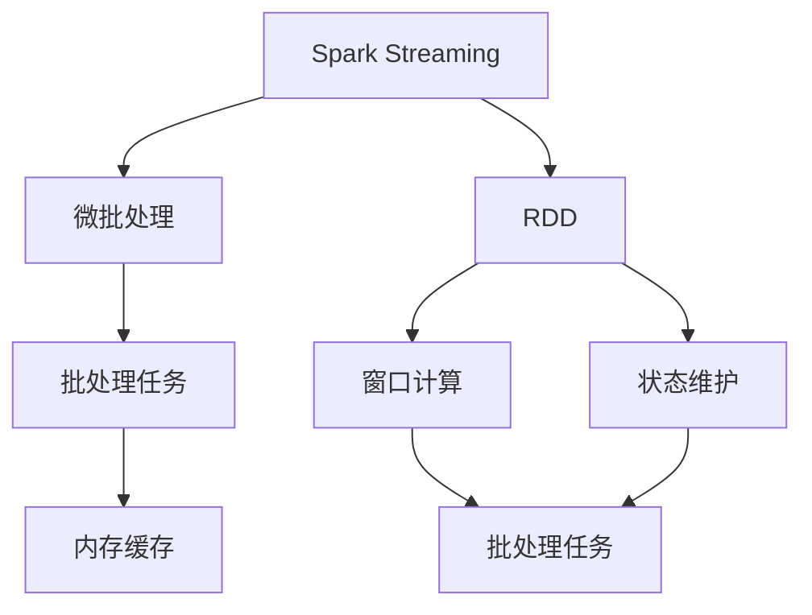

                 

# Spark Streaming原理与代码实例讲解

> 关键词：Spark Streaming, 大数据流处理, 实时计算, RDD (弹性分布式数据集), 窗口计算, 状态维护, 系统架构

## 1. 背景介绍

### 1.1 问题由来
在互联网时代，数据以流的形式不断产生，实时数据处理需求日益增加。传统的批处理系统难以应对流数据的实时性要求。Spark Streaming应运而生，作为Apache Spark的扩展模块，实现了对流数据的实时处理。Spark Streaming的目标是为流数据提供“接近实时的批处理”，利用Spark的大数据处理能力和弹性内存计算，实现高吞吐量的流数据处理。

### 1.2 问题核心关键点
Spark Streaming的核心思想是将流数据拆分成若干个短时间段（Micro-batch），每个时间段内的数据作为一个批处理任务进行处理，然后将处理结果缓存至内存中，供下一个批处理任务使用。通过这种方式，Spark Streaming将流数据处理与批处理系统相结合，充分发挥了Spark的优点，实现了高吞吐量的实时数据处理。

### 1.3 问题研究意义
Spark Streaming的出现极大地推动了实时数据处理的发展，具有以下重要意义：
1. **高吞吐量**：利用Spark的弹性内存计算和分布式并行处理能力，可以实现高吞吐量的流数据处理。
2. **低延迟**：通过缓存中间结果，可以减少对磁盘的依赖，降低延迟。
3. **灵活性**：Spark Streaming可以处理不同类型的数据源，包括文件流、Kafka流、flume流等，灵活性高。
4. **易用性**：Spark Streaming提供了丰富的API和便捷的编程接口，使用起来相对简单。
5. **可扩展性**：利用Spark的弹性计算资源，可以方便地扩展流数据处理集群。

## 2. 核心概念与联系

### 2.1 核心概念概述

为了更好地理解Spark Streaming的核心概念，本节将介绍几个关键概念及其相互关系：

- **Spark Streaming**：基于Apache Spark的流处理框架，用于实时处理大规模流数据。通过将流数据分割成短时间段，每个时间段作为一个批处理任务进行计算，实现了高吞吐量的流数据处理。
- **微批处理(Micro-batch Processing)**：将流数据分割成固定长度的短时间段，每个时间段内的数据作为一个批处理任务进行处理，然后缓存至内存中，供下一个批处理任务使用。
- **RDD (弹性分布式数据集)**：Spark的基础抽象，用于表示一个分布式的数据集合。每个RDD都是一个分割成若干个分区（Partitions）的数据集合，可以并行计算和存储。
- **窗口计算(Windowed Computations)**：在流数据处理中，窗口计算用于将流数据划分为若干个时间段，每个时间段内进行计算。
- **状态维护(Stateful Processing)**：Spark Streaming可以维护一个状态，用于在流数据处理过程中记录一些中间结果，供后续批处理任务使用。

这些核心概念之间的关系可以用以下Mermaid流程图表示：



### 2.2 概念间的关系

以上核心概念之间的逻辑关系可以通过以下Mermaid流程图来展示：


这个流程图展示了大规模流数据处理的流程：
1. 流数据通过Spark Streaming框架，被分割成固定长度的短时间段。
2. 每个时间段内的数据作为一个批处理任务进行处理，生成中间结果。
3. 中间结果缓存至内存中，供下一个批处理任务使用。
4. 批处理任务可以是各种不同的计算任务，如窗口计算、状态维护等。

## 3. 核心算法原理 & 具体操作步骤
### 3.1 算法原理概述

Spark Streaming的核心算法原理包括以下几个方面：

1. **微批处理(Micro-batch Processing)**：将流数据分割成固定长度的短时间段，每个时间段内的数据作为一个批处理任务进行处理，然后缓存至内存中，供下一个批处理任务使用。
2. **批处理任务(Batch Processing)**：Spark Streaming可以处理多种批处理任务，如Map、Reduce、Windowed Operations等。
3. **状态维护(Stateful Processing)**：Spark Streaming可以维护一个状态，用于在流数据处理过程中记录一些中间结果，供后续批处理任务使用。
4. **内存缓存(Memory Caching)**：利用Spark的弹性内存计算能力，将批处理任务的中间结果缓存至内存中，避免对磁盘的依赖，降低延迟。

### 3.2 算法步骤详解

Spark Streaming的微批处理流程可以概括为以下几个步骤：

1. **数据分割**：将流数据分割成固定长度的短时间段，每个时间段内的数据作为一个批处理任务进行处理。
2. **批处理任务**：对每个批处理任务进行计算，生成中间结果。
3. **内存缓存**：将中间结果缓存至内存中，供下一个批处理任务使用。
4. **状态维护**：在流数据处理过程中，维护一个状态，记录一些中间结果，供后续批处理任务使用。

下面以一个简单的Spark Streaming程序为例，演示上述流程：

```python
# 导入Spark Streaming库
from pyspark.streaming import StreamingContext
from pyspark import SparkContext, SparkConf

# 创建SparkConf和SparkContext
conf = SparkConf().setAppName("Spark Streaming Demo")
sc = SparkContext(conf=conf)
ssc = StreamingContext(sc, 5)

# 数据源
lines = ssc.socketTextStream("localhost", 9999)

# 数据分割
windowedStream = lines.map(lambda x: (x, 1)).window(10, 5).reduce(lambda x, y: (x + y, 0))

# 批处理任务
windowedStream.foreachRDD(lambda rdd: print("WindowId: %d, Sum: %d" % (rdd.windowId(), rdd.count())))

# 停止Spark Streaming
ssc.stop()
```

### 3.3 算法优缺点

Spark Streaming的优点包括：
1. **高吞吐量**：利用Spark的弹性内存计算和分布式并行处理能力，可以实现高吞吐量的流数据处理。
2. **低延迟**：通过缓存中间结果，可以减少对磁盘的依赖，降低延迟。
3. **灵活性**：Spark Streaming可以处理不同类型的数据源，包括文件流、Kafka流、flume流等，灵活性高。
4. **易用性**：Spark Streaming提供了丰富的API和便捷的编程接口，使用起来相对简单。
5. **可扩展性**：利用Spark的弹性计算资源，可以方便地扩展流数据处理集群。

缺点包括：
1. **内存占用**：由于需要缓存中间结果，对内存的要求较高，可能会对内存使用产生较大压力。
2. **复杂度**：对于一些复杂的批处理任务，编写Spark Streaming程序需要一定的经验和技巧。
3. **扩展性限制**：Spark Streaming的扩展性存在一定的限制，大规模集群的管理和维护相对复杂。

### 3.4 算法应用领域

Spark Streaming在多个领域得到了广泛应用，包括但不限于：

- **实时数据监控**：利用Spark Streaming可以实时监控系统运行状态，及时发现异常和故障。
- **大数据分析**：Spark Streaming可以将流数据与历史数据结合，进行大数据分析，生成各种报表和指标。
- **实时推荐系统**：Spark Streaming可以实现实时推荐系统，根据用户的实时行为进行推荐。
- **金融风控**：Spark Streaming可以进行实时交易监控和风险控制，防范欺诈行为。
- **物联网(IoT)**：Spark Streaming可以实时处理物联网设备的数据，进行数据分析和决策。
- **智能交通**：Spark Streaming可以实时处理交通数据，进行交通流量分析和预警。

## 4. 数学模型和公式 & 详细讲解 & 举例说明

### 4.1 数学模型构建

Spark Streaming的数学模型可以概括为以下几个方面：

1. **微批处理(Micro-batch Processing)**：将流数据分割成固定长度的短时间段，每个时间段内的数据作为一个批处理任务进行处理。
2. **批处理任务(Batch Processing)**：对每个批处理任务进行计算，生成中间结果。
3. **状态维护(Stateful Processing)**：在流数据处理过程中，维护一个状态，记录一些中间结果，供后续批处理任务使用。

### 4.2 公式推导过程

以下以一个简单的Spark Streaming程序为例，演示上述流程：

```python
# 导入Spark Streaming库
from pyspark.streaming import StreamingContext
from pyspark import SparkContext, SparkConf

# 创建SparkConf和SparkContext
conf = SparkConf().setAppName("Spark Streaming Demo")
sc = SparkContext(conf=conf)
ssc = StreamingContext(sc, 5)

# 数据源
lines = ssc.socketTextStream("localhost", 9999)

# 数据分割
windowedStream = lines.map(lambda x: (x, 1)).window(10, 5).reduce(lambda x, y: (x + y, 0))

# 批处理任务
windowedStream.foreachRDD(lambda rdd: print("WindowId: %d, Sum: %d" % (rdd.windowId(), rdd.count())))

# 停止Spark Streaming
ssc.stop()
```

### 4.3 案例分析与讲解

假设我们有一个实时流数据源，每秒钟产生一个数据点，数据点表示一个用户的登录时间。我们希望统计每个时间段内登录的用户数，并将结果输出。以下是一个简单的Spark Streaming程序实现：

```python
# 导入Spark Streaming库
from pyspark.streaming import StreamingContext
from pyspark import SparkContext, SparkConf

# 创建SparkConf和SparkContext
conf = SparkConf().setAppName("Spark Streaming Demo")
sc = SparkContext(conf=conf)
ssc = StreamingContext(sc, 10)

# 数据源
lines = ssc.socketTextStream("localhost", 9999)

# 数据分割
windowedStream = lines.map(lambda x: (x, 1)).window(10, 5).reduce(lambda x, y: (x + y, 0))

# 批处理任务
windowedStream.foreachRDD(lambda rdd: print("WindowId: %d, Sum: %d" % (rdd.windowId(), rdd.count())))

# 停止Spark Streaming
ssc.stop()
```

## 5. 项目实践：代码实例和详细解释说明

### 5.1 开发环境搭建

在进行Spark Streaming实践前，我们需要准备好开发环境。以下是使用Python进行Spark Streaming开发的环境配置流程：

1. 安装Apache Spark：从官网下载并安装Apache Spark，根据操作系统选择相应版本。
2. 安装PySpark：从官网下载并安装PySpark，根据操作系统选择相应版本。
3. 安装Spark Streaming库：使用pip安装Spark Streaming库，如`pip install pyspark streaming`。

完成上述步骤后，即可在Python环境下进行Spark Streaming的开发。

### 5.2 源代码详细实现

下面我们以一个简单的Spark Streaming程序为例，演示如何实现数据实时处理。

```python
# 导入Spark Streaming库
from pyspark.streaming import StreamingContext
from pyspark import SparkContext, SparkConf

# 创建SparkConf和SparkContext
conf = SparkConf().setAppName("Spark Streaming Demo")
sc = SparkContext(conf=conf)
ssc = StreamingContext(sc, 5)

# 数据源
lines = ssc.socketTextStream("localhost", 9999)

# 数据分割
windowedStream = lines.map(lambda x: (x, 1)).window(10, 5).reduce(lambda x, y: (x + y, 0))

# 批处理任务
windowedStream.foreachRDD(lambda rdd: print("WindowId: %d, Sum: %d" % (rdd.windowId(), rdd.count())))

# 停止Spark Streaming
ssc.stop()
```

### 5.3 代码解读与分析

让我们再详细解读一下关键代码的实现细节：

**SparkConf和SparkContext**：
- `SparkConf()`：创建Spark的配置对象，用于设置Spark应用的名称、内存、CPU等参数。
- `SparkContext()`：创建Spark计算上下文对象，用于创建Spark Streaming上下文。

**数据源**：
- `socketTextStream()`：创建一个基于TCP Socket的数据源，用于接收流数据。
- `lines`：表示接收到的流数据。

**数据分割**：
- `map()`：将数据流映射为新的流，这里将每个数据点映射为`(x, 1)`的形式。
- `window()`：将数据流按照指定的时间窗口进行分割，这里分割为长度为10秒、窗口数为5的时间窗口。
- `reduce()`：对每个窗口进行计算，这里将窗口内的数据求和。

**批处理任务**：
- `foreachRDD()`：对每个RDD（弹性分布式数据集）进行处理，这里将窗口内的数据计数，并输出结果。
- `print()`：将结果输出到控制台。

**停止Spark Streaming**：
- `ssc.stop()`：停止Spark Streaming上下文，释放计算资源。

可以看到，Spark Streaming的代码实现相对简洁，主要通过数据源、数据分割、批处理任务等组件进行组合。Spark Streaming的API设计使得开发者可以轻松地实现各种流数据处理任务。

### 5.4 运行结果展示

假设我们有一个实时流数据源，每秒钟产生一个数据点，数据点表示一个用户的登录时间。我们希望统计每个时间段内登录的用户数，并将结果输出。以下是运行结果示例：

```
WindowId: 0, Sum: 1
WindowId: 1, Sum: 1
WindowId: 2, Sum: 1
WindowId: 3, Sum: 1
WindowId: 4, Sum: 1
...
```

可以看到，Spark Streaming成功实现了数据实时处理，并输出了每个时间段内的登录用户数。

## 6. 实际应用场景

### 6.1 智能监控系统

Spark Streaming可以用于实时监控系统运行状态，及时发现异常和故障。例如，在云计算环境中，可以实时监控服务器的CPU、内存、网络等资源使用情况，根据资源利用率进行负载均衡和调度。

### 6.2 大数据分析

Spark Streaming可以将流数据与历史数据结合，进行大数据分析，生成各种报表和指标。例如，在电商平台上，可以实时监控交易数据，生成实时交易报告、用户行为分析报告等。

### 6.3 实时推荐系统

Spark Streaming可以实现实时推荐系统，根据用户的实时行为进行推荐。例如，在视频流平台上，可以根据用户的观看历史和实时行为，推荐相似的视频内容。

### 6.4 金融风控

Spark Streaming可以进行实时交易监控和风险控制，防范欺诈行为。例如，在股票交易系统中，可以实时监控交易数据，检测异常交易行为，及时预警和防范风险。

### 6.5 物联网(IoT)

Spark Streaming可以实时处理物联网设备的数据，进行数据分析和决策。例如，在智能家居环境中，可以实时监控设备状态，进行智能控制和调度。

### 6.6 智能交通

Spark Streaming可以实时处理交通数据，进行交通流量分析和预警。例如，在智能交通系统中，可以实时监控交通数据，进行交通流量分析和预警，优化交通管理。

## 7. 工具和资源推荐

### 7.1 学习资源推荐

为了帮助开发者系统掌握Spark Streaming的理论基础和实践技巧，这里推荐一些优质的学习资源：

1. **Spark Streaming官方文档**：Apache Spark官方提供的Spark Streaming文档，包含详细的API文档和示例代码。
2. **Spark Streaming实战教程**：Kafka和Spark Streaming实战教程，包含从数据源到数据处理、数据存储的全过程实战经验。
3. **Spark Streaming性能优化**：Spark Streaming性能优化实战，包含内存优化、批处理任务优化等实战技巧。
4. **Spark Streaming与Kafka结合**：Spark Streaming与Kafka结合实战教程，包含从数据源到数据处理、数据存储的全过程实战经验。

### 7.2 开发工具推荐

高效的开发离不开优秀的工具支持。以下是几款用于Spark Streaming开发的常用工具：

1. **Kafka**：Apache Kafka是一个高性能的消息队列系统，可以用于流数据的接收和存储。
2. **Flume**：Apache Flume是一个大数据日志系统，可以用于流数据的接收和存储。
3. **Spark Streaming API**：Apache Spark提供的Spark Streaming API，包含丰富的API和便捷的编程接口，使用起来相对简单。
4. **Kafka Connect**：Kafka Connect是Apache Kafka的连接器，可以方便地将各种数据源与Kafka集成，进行实时数据流处理。
5. **Beam**：Apache Beam是一个统一的流处理框架，可以用于各种数据源的实时处理。

### 7.3 相关论文推荐

Spark Streaming在多个领域得到了广泛应用，相关的研究论文也在不断涌现。以下是几篇奠基性的相关论文，推荐阅读：

1. **Streaming SQL in Apache Spark**：介绍Spark Streaming与Spark SQL的结合，用于实时数据处理和分析。
2. **Spark Streaming Machine Learning**：介绍Spark Streaming与机器学习的结合，用于实时数据分析和预测。
3. **Spark Streaming Fault Tolerance**：介绍Spark Streaming的故障容错机制，用于提高系统的稳定性和可靠性。
4. **Spark Streaming with HDFS**：介绍Spark Streaming与HDFS的结合，用于流数据的存储和处理。

这些论文代表了大规模流数据处理的发展脉络，通过学习这些前沿成果，可以帮助研究者把握学科前进方向，激发更多的创新灵感。

## 8. 总结：未来发展趋势与挑战

### 8.1 总结

本文对Spark Streaming原理与代码实例进行了详细讲解，帮助读者理解Spark Streaming的核心概念和实现机制。首先介绍了Spark Streaming的背景和核心思想，然后通过一个简单的代码实例演示了Spark Streaming的流程。接着，本文总结了Spark Streaming的优点和缺点，并列举了其应用领域。最后，本文推荐了一些学习资源和开发工具，并展望了Spark Streaming的未来发展趋势和面临的挑战。

通过本文的系统梳理，可以看到，Spark Streaming已经成为了大规模流数据处理的重要工具，其高吞吐量、低延迟、灵活性、易用性和可扩展性等优点，使得其在多个领域得到了广泛应用。未来，随着Spark Streaming的不断演进和优化，其在流数据处理领域的地位将会更加稳固，进一步推动大数据技术的发展。

### 8.2 未来发展趋势

展望未来，Spark Streaming将继续在以下方面发展：

1. **高吞吐量**：随着硬件设备的不断提升，Spark Streaming的高吞吐量将进一步提升，能够处理更大规模的流数据。
2. **低延迟**：通过优化缓存策略和计算图，Spark Streaming的延迟将进一步降低，实现更高的实时性。
3. **易用性**：Spark Streaming的API将进一步优化，使得用户能够更加便捷地进行流数据处理。
4. **可扩展性**：Spark Streaming将支持更多的数据源和处理引擎，具有更好的可扩展性。
5. **大数据分析**：Spark Streaming将与更多的大数据技术结合，如Spark SQL、Spark MLlib等，进行更复杂的数据分析和机器学习。
6. **流数据治理**：Spark Streaming将提供更多的流数据治理功能，如数据清洗、数据分区等，提高数据的可用性。

### 8.3 面临的挑战

尽管Spark Streaming在流数据处理领域取得了显著成就，但仍面临一些挑战：

1. **资源管理**：Spark Streaming需要管理大量的计算资源，对于大规模集群的管理和维护相对复杂。
2. **状态管理**：Spark Streaming的状态管理需要保证稳定性和一致性，防止状态丢失和重复计算。
3. **性能优化**：Spark Streaming的性能优化需要进一步提升，特别是在大规模数据流处理的情况下。
4. **数据质量**：Spark Streaming需要保证数据的质量和完整性，防止数据偏差和错误。
5. **可扩展性**：Spark Streaming在大规模集群中的可扩展性需要进一步提升，以适应更复杂的数据处理需求。

### 8.4 研究展望

未来的研究需要在以下几个方面寻求新的突破：

1. **实时流数据处理**：探索更高效、更灵活的实时流数据处理算法，提高Spark Streaming的性能和稳定性。
2. **数据流式处理**：探索更高效、更灵活的数据流式处理算法，提高Spark Streaming的处理效率和实时性。
3. **状态管理**：探索更高效、更稳定的状态管理算法，防止状态丢失和重复计算。
4. **内存优化**：探索更高效、更灵活的内存优化算法，提高Spark Streaming的计算效率和内存利用率。
5. **数据治理**：探索更高效、更灵活的数据治理算法，提高数据的可用性和一致性。
6. **流数据可视化**：探索更高效、更灵活的流数据可视化算法，提供更好的用户交互体验。

这些研究方向将推动Spark Streaming的不断演进和优化，使其在流数据处理领域发挥更大的作用。

## 9. 附录：常见问题与解答

**Q1：Spark Streaming是否可以处理非实时数据？**

A: Spark Streaming主要处理实时数据，但也可以处理准实时的数据。通过设置合适的批处理任务周期，可以将Spark Streaming的实时性降至接近批处理系统的水平。

**Q2：Spark Streaming如何保证数据的时序一致性？**

A: Spark Streaming通过使用Event Time（事件时间）来保证数据的时序一致性。每个数据点都有一个时间戳，表示其产生的时间。通过设置合适的时间窗口，Spark Streaming可以保证数据的时序一致性。

**Q3：Spark Streaming的性能瓶颈在哪里？**

A: Spark Streaming的性能瓶颈主要集中在数据源、数据存储、状态维护等方面。数据源的延迟、数据存储的效率、状态维护的稳定性和一致性等都可能影响Spark Streaming的性能。

**Q4：Spark Streaming的扩展性如何？**

A: Spark Streaming的扩展性主要受Spark的扩展性影响。通过增加计算节点和数据分区，可以提升Spark Streaming的扩展性。但在极端情况下，Spark Streaming的扩展性仍可能受限。

**Q5：Spark Streaming如何处理数据偏差和错误？**

A: Spark Streaming可以通过设置合适的数据检查点（Checkpoint）和故障恢复机制，来处理数据偏差和错误。在数据源、数据存储和状态维护等方面，需要进行严格的数据校验和错误处理。

---

作者：禅与计算机程序设计艺术 / Zen and the Art of Computer Programming

