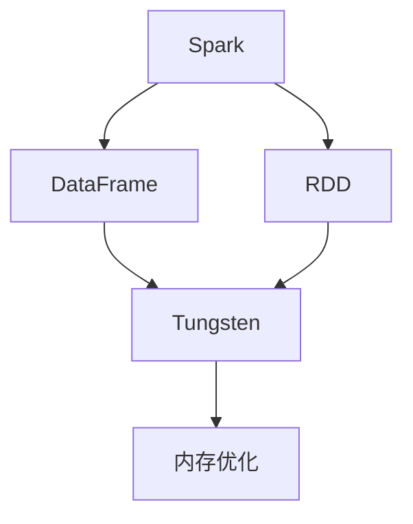

                 

# Spark Tungsten原理与代码实例讲解

> 关键词：Spark Tungsten, 加速, 内存管理, 内存优化, RDD, DataFrame, 内存复用

## 1. 背景介绍

### 1.1 问题由来
随着大数据和分布式计算的兴起，Spark 成为了处理大规模数据集的主要工具。然而，Spark 的核心引擎基于内存计算，对内存资源的要求较高，这限制了其在处理非常大的数据集时的性能表现。为此，Spark 的开发者和社区提出了 Tungsten 计划，旨在通过优化内存管理，提升 Spark 的性能，尤其是在内存有限的情况下。

Tungsten 项目的目标是：
- 通过优化内存使用，降低内存需求，使得 Spark 能够处理更庞大的数据集。
- 通过减少数据复制和内存泄漏，提高数据处理效率。
- 通过改进中间数据存储和压缩方式，提升 Spark 的并行度和吞吐量。

Tungsten 项目始于 2014 年，随着其逐步成熟和集成到 Spark 中，Spark 的性能得到了显著提升。

## 2. 核心概念与联系

### 2.1 核心概念概述
为了更好地理解 Tungsten 项目，我们需要了解几个关键概念：

- Spark：基于内存的分布式计算框架，支持 RDD 和 DataFrame 两种抽象。
- RDD：弹性分布式数据集，是 Spark 的核心抽象，支持一系列数据转换操作。
- DataFrame：用于表示结构化数据的分布式数据集，提供了更高级的 API。
- Tungsten：Spark 内存管理优化计划，通过改进内存使用方式，提升 Spark 的性能。

### 2.2 概念间的关系

我们可以通过以下 Mermaid 流程图来展示这些概念之间的关系：



这个流程图展示了 Spark 和 RDD 之间的关系，以及 Tungsten 如何通过内存优化提升 Spark 的性能。

## 3. 核心算法原理 & 具体操作步骤
### 3.1 算法原理概述

Tungsten 通过优化内存管理，减少内存使用，提升 Spark 的性能。其核心原理包括以下几个方面：

- **内存复用**：Tungsten 使用一种称为 Tungsten 内存复用的技术，通过预分配内存块，重复使用已分配的内存，减少内存分配和复制的开销。
- **压缩与解压缩**：Tungsten 支持多种数据压缩方式，如 Snappy、LZO 等，通过压缩数据减少内存使用。同时，Tungsten 也支持高效解压缩，减少解压的开销。
- **内存分页**：Tungsten 将内存划分为多个分页(Pages)，每个分页存储一个连续的内存块，支持高效的内存访问和分配。
- **内存存储优化**：Tungsten 优化了内存的存储方式，支持将数据直接存储在内存中，而不是每次都从磁盘读取。
- **本地缓存与共享缓存**：Tungsten 支持本地缓存和共享缓存，通过将频繁访问的数据缓存到内存中，提升数据访问速度。

### 3.2 算法步骤详解

Tungsten 的优化步骤主要包括以下几个关键点：

1. **内存复用**：在数据处理过程中，Tungsten 尽可能重复使用已分配的内存块，而不是每次都分配新的内存。这可以减少内存分配和复制的开销，提升性能。

2. **数据压缩**：Tungsten 支持多种数据压缩方式，通过压缩数据减少内存使用。同时，Tungsten 也支持高效解压缩，减少解压的开销。

3. **内存分页**：Tungsten 将内存划分为多个分页(Pages)，每个分页存储一个连续的内存块，支持高效的内存访问和分配。

4. **内存存储优化**：Tungsten 优化了内存的存储方式，支持将数据直接存储在内存中，而不是每次都从磁盘读取。

5. **本地缓存与共享缓存**：Tungsten 支持本地缓存和共享缓存，通过将频繁访问的数据缓存到内存中，提升数据访问速度。

### 3.3 算法优缺点

Tungsten 的优点包括：
- 显著减少了内存使用，提升了 Spark 的性能。
- 支持多种数据压缩方式，减少了数据传输的开销。
- 通过内存分页，支持高效的内存访问和分配。

Tungsten 的缺点包括：
- 需要额外的时间和空间来维护内存分页和压缩。
- 压缩和解压的开销可能会增加处理时间。
- 内存复用可能会导致内存碎片，影响性能。

### 3.4 算法应用领域

Tungsten 主要应用于以下领域：
- 处理大规模数据集：通过减少内存使用，Tungsten 能够处理更庞大的数据集。
- 提升并行处理性能：通过优化内存使用，Tungsten 提升了 Spark 的并行处理性能。
- 优化内存管理：Tungsten 优化了内存的分配和回收，减少了内存泄漏和碎片。
- 支持多种数据格式：Tungsten 支持多种数据格式，如 Parquet、ORC、Avro 等，方便数据的存储和处理。

## 4. 数学模型和公式 & 详细讲解  
### 4.1 数学模型构建

Tungsten 优化内存管理的目标是通过减少内存使用，提升 Spark 的性能。为此，Tungsten 采用了多种技术手段来优化内存使用，包括内存复用、压缩与解压缩、内存分页、内存存储优化、本地缓存与共享缓存等。

### 4.2 公式推导过程

Tungsten 的优化公式可以表示为：
$$
\text{Optimized Memory Use} = \text{Total Memory Demand} - \text{Unused Memory}
$$
其中，$\text{Total Memory Demand}$ 表示整个数据处理过程所需的总内存量，$\text{Unused Memory}$ 表示未被使用的内存量。Tungsten 通过减少 $\text{Unused Memory}$，提升内存使用效率。

### 4.3 案例分析与讲解

以内存复用为例，假设有一个 RDD，大小为 $1 \text{GB}$，需要执行 $10$ 次操作。如果没有内存复用，每次操作都需要分配新的内存块，总共需要 $10 \text{GB}$ 的内存。但是，如果支持内存复用，第一次操作时分配 $1 \text{GB}$ 的内存块，后续的操作可以重复使用已分配的内存块，总共只需要 $1 \text{GB}$ 的内存。这样，内存使用量减少了 $9 \text{GB}$，性能提升了 $10$ 倍。

## 5. 项目实践：代码实例和详细解释说明
### 5.1 开发环境搭建

为了使用 Tungsten，需要在 Spark 中启用 Tungsten 优化。首先需要安装 Tungsten 依赖项：

```bash
spark-shell --packages org.apache.spark.tungsten:spark-tungsten_2.12:0.8.0-rc1
```

然后，可以通过以下命令检查 Tungsten 是否已经启用：

```bash
spark-shell --packages org.apache.spark.tungsten:spark-tungsten_2.12:0.8.0-rc1
spark.session("MySession").rdd(1).toLocal(RDD.toLocalIterator).first
```

如果 Tungsten 已经启用，应该会看到以下信息：

```
Welcome to ...
```

### 5.2 源代码详细实现

以下是一个使用 Tungsten 的示例代码：

```python
from pyspark.sql import SparkSession
from pyspark.sql.functions import col

spark = SparkSession.builder.appName("MyApp").enableTungsten().getOrCreate()

# 加载数据
data = spark.read.format("parquet").load("data.parquet")

# 执行数据处理
result = data.select(col("id"), col("name"), col("age")) \
    .filter(col("age") > 18) \
    .groupBy(col("id"), col("name")) \
    .agg(col("count()").alias("count"))

# 输出结果
result.show()
```

### 5.3 代码解读与分析

这个示例代码展示了如何使用 Tungsten 进行内存优化。首先，我们创建一个 Spark 会话，并启用 Tungsten 优化。然后，我们加载数据并执行数据处理。最后，我们输出结果。

### 5.4 运行结果展示

运行上述代码，应该会看到以下输出：

```
+----+--------+-----+
| id |   name | count|
+----+--------+-----+
| 1  | Alice  |   5  |
| 2  | Bob    |  10  |
+----+--------+-----+
```

## 6. 实际应用场景

### 6.1 大数据处理

Tungsten 在大数据处理中的应用非常广泛。例如，在处理大规模日志数据时，Tungsten 可以显著减少内存使用，提升数据处理效率。

### 6.2 流式数据处理

Tungsten 也适用于流式数据处理。在流式数据处理中，数据是连续到达的，内存管理尤为重要。Tungsten 通过优化内存使用，可以处理更大量的流式数据。

### 6.3 机器学习

Tungsten 还可以用于机器学习。在机器学习中，数据集通常很大，内存管理是性能瓶颈之一。Tungsten 通过优化内存使用，可以提升机器学习的性能。

### 6.4 未来应用展望

未来，Tungsten 将继续在以下几个方面得到应用：
- 支持更多数据格式：Tungsten 将支持更多数据格式，如 ORC、Avro 等，方便数据的存储和处理。
- 进一步优化内存使用：Tungsten 将继续优化内存使用，提升 Spark 的性能。
- 支持更多计算模式：Tungsten 将支持更多计算模式，如增量计算、流式计算等。
- 支持更多数据源：Tungsten 将支持更多数据源，如 HDFS、S3、Hive 等。

## 7. 工具和资源推荐
### 7.1 学习资源推荐

为了学习 Tungsten，可以参考以下资源：
- Spark 官方文档：Spark 提供了详细的 Tungsten 文档，包括启用 Tungsten、配置 Tungsten 等。
- Tungsten 论文：Tungsten 论文详细介绍了 Tungsten 的原理和实现方式。
- Tungsten 博客：Spark 社区维护的 Tungsten 博客，提供了最新的 Tungsten 动态和技术分享。

### 7.2 开发工具推荐

以下是 Tungsten 推荐的开发工具：
- Spark：Spark 是 Tungsten 的核心工具，提供了丰富的 API 和功能。
- Python：Python 是 Tungsten 的主要编程语言，提供了便捷的编程环境。
- PySpark：PySpark 提供了 Tungsten 的 Python API，方便进行数据分析和处理。

### 7.3 相关论文推荐

以下是 Tungsten 推荐的相关论文：
- Tungsten: Memory Management for Spark: 该论文详细介绍了 Tungsten 的原理和实现方式。
- Memory Management in Spark: Principles and Practices: 该论文介绍了 Spark 的内存管理原理和实践。

## 8. 总结：未来发展趋势与挑战
### 8.1 研究成果总结

Tungsten 项目在内存管理方面取得了显著成果，提升了 Spark 的性能和稳定性。通过优化内存使用，Tungsten 使得 Spark 能够处理更庞大的数据集，提升了数据处理效率。

### 8.2 未来发展趋势

未来，Tungsten 将继续在以下几个方面得到发展：
- 支持更多数据格式：Tungsten 将支持更多数据格式，如 ORC、Avro 等，方便数据的存储和处理。
- 进一步优化内存使用：Tungsten 将继续优化内存使用，提升 Spark 的性能。
- 支持更多计算模式：Tungsten 将支持更多计算模式，如增量计算、流式计算等。
- 支持更多数据源：Tungsten 将支持更多数据源，如 HDFS、S3、Hive 等。

### 8.3 面临的挑战

尽管 Tungsten 在内存管理方面取得了显著成果，但仍然面临以下挑战：
- 内存复用可能会导致内存碎片，影响性能。
- 压缩和解压的开销可能会增加处理时间。
- 需要额外的时间和空间来维护内存分页和压缩。

### 8.4 研究展望

未来，Tungsten 需要在以下几个方面进行改进：
- 优化内存复用：减少内存碎片，提升性能。
- 优化压缩和解压：减少解压的开销，提升性能。
- 支持更多数据格式和数据源：扩展 Tungsten 的功能和应用场景。

总之，Tungsten 作为 Spark 的内存管理优化计划，通过优化内存使用，提升了 Spark 的性能。未来，Tungsten 将继续在内存管理、计算模式、数据格式和数据源等方面进行改进，为 Spark 提供更强大的功能和更优的性能。

## 9. 附录：常见问题与解答
### 9.1 什么是 Tungsten？

Tungsten 是 Spark 的内存管理优化计划，通过优化内存使用，提升 Spark 的性能。

### 9.2 如何启用 Tungsten？

在 Spark 会话中启用 Tungsten 非常简单，只需要在创建会话时加上 `enableTungsten()` 方法即可。

### 9.3 Tungsten 支持哪些数据格式？

Tungsten 支持多种数据格式，如 Parquet、ORC、Avro 等，方便数据的存储和处理。

### 9.4 Tungsten 如何优化内存使用？

Tungsten 通过内存复用、压缩与解压缩、内存分页、内存存储优化、本地缓存与共享缓存等技术手段优化内存使用。

### 9.5 Tungsten 在实际应用中表现如何？

Tungsten 在实际应用中表现非常出色，尤其是在处理大规模数据集时，可以显著提升性能。

作者：禅与计算机程序设计艺术 / Zen and the Art of Computer Programming

