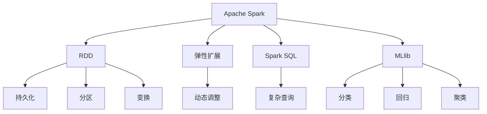

                 

# Spark 原理与代码实例讲解

> 关键词：Spark, 分布式计算, 弹性扩展, 大数据处理, 机器学习, 算法优化

## 1. 背景介绍

### 1.1 问题由来
随着大数据时代的到来，数据的体量呈指数级增长，传统的关系型数据库已无法满足日益增长的数据处理需求。Spark（Apache Spark）应运而生，作为新一代分布式计算框架，以其高效、灵活、可扩展的特性，迅速成为处理大规模数据的首选。

Spark 集成了 SQL、流处理、机器学习等多种功能，能够在内存中对数据进行高效处理，提升了数据处理的性能和实时性。其核心思想是将数据分为多个小片段，在集群中并行处理，通过弹性扩展机制，根据数据量动态调整计算节点，从而实现高效、可靠的大数据处理。

### 1.2 问题核心关键点
Spark 的核心在于其分布式计算架构，以及其弹性扩展能力。Spark 通过将数据划分为多个小片段，在集群中并行处理，实现了高效的大数据处理。Spark 还支持多类数据源，包括 HDFS、S3、Hive 等，可以灵活地处理不同类型的数据。

Spark 的弹性扩展机制是其另一个重要特点。Spark 可以根据数据量动态调整计算节点，从而适应不同的数据处理需求。这种机制使得 Spark 能够高效地处理大规模数据，同时也保证了数据处理的可靠性和稳定性。

此外，Spark 还提供了丰富的机器学习库，包括 MLlib，可以方便地进行数据挖掘和机器学习任务。

## 2. 核心概念与联系

### 2.1 核心概念概述

为更好地理解 Spark 的工作原理，本节将介绍几个关键概念：

- Apache Spark：基于内存的分布式计算框架，支持 SQL、流处理、机器学习等多种功能，适用于大数据处理场景。
- RDD：弹性分布式数据集，是 Spark 的基本数据结构，支持多种操作，包括持久化、分区、变换等。
- 弹性扩展：Spark 的核心特性之一，能够动态调整计算节点，根据数据量自适应地扩展集群规模。
- Spark SQL：Spark 提供的 SQL 查询引擎，支持复杂查询和大数据处理。
- MLlib：Spark 提供的机器学习库，包括分类、回归、聚类等多种算法。

这些核心概念之间的联系可以通过以下 Mermaid 流程图来展示：



这个流程图展示了大数据处理框架 Spark 中各个核心概念的关联关系。其中，RDD 是 Spark 的基本数据结构，支持持久化、分区和变换等多种操作。Spark SQL 提供 SQL 查询引擎，支持复杂查询和大数据处理。MLlib 是 Spark 提供的机器学习库，包括分类、回归、聚类等多种算法。Spark 的弹性扩展机制能够动态调整计算节点，从而根据数据量自适应地扩展集群规模。

### 2.2 概念间的关系

这些核心概念之间存在着紧密的联系，形成了 Spark 的大数据处理框架。

1. **RDD 与数据操作**：RDD 是 Spark 的基本数据结构，支持多种操作，如持久化、分区和变换等。持久化操作可以优化内存使用，分区操作可以加快数据读写速度，变换操作可以灵活地处理数据。

2. **弹性扩展与计算节点**：Spark 的弹性扩展机制能够动态调整计算节点，从而根据数据量自适应地扩展集群规模。这种机制使得 Spark 能够高效地处理大规模数据，同时也保证了数据处理的可靠性和稳定性。

3. **Spark SQL 与数据处理**：Spark SQL 提供 SQL 查询引擎，支持复杂查询和大数据处理。Spark SQL 可以将结构化数据与非结构化数据集成，提供统一的查询接口。

4. **MLlib 与机器学习**：MLlib 是 Spark 提供的机器学习库，包括分类、回归、聚类等多种算法。MLlib 通过提供统一的 API，使得机器学习任务变得简单易用。

5. **Spark 与生态系统**：Spark 不仅提供了丰富的内置功能，还支持与第三方生态系统的集成，如 Hive、HDFS、S3 等，可以灵活地处理不同类型的数据。

通过理解这些核心概念，我们可以更好地把握 Spark 的工作原理和优化方向。

## 3. 核心算法原理 & 具体操作步骤
### 3.1 算法原理概述

Spark 的核心算法原理包括分布式计算、内存计算、弹性扩展等。这些原理共同构成了 Spark 高效、灵活、可扩展的特性。

- **分布式计算**：Spark 通过将数据划分为多个小片段，在集群中并行处理，实现了高效的大数据处理。这种分布式计算方式可以充分利用集群资源，提升数据处理的性能和实时性。

- **内存计算**：Spark 在内存中对数据进行高效处理，避免了磁盘 I/O 带来的延迟和开销。内存计算使得数据处理速度更快，同时也保证了数据处理的稳定性和可靠性。

- **弹性扩展**：Spark 的弹性扩展机制能够动态调整计算节点，从而根据数据量自适应地扩展集群规模。这种机制使得 Spark 能够高效地处理大规模数据，同时也保证了数据处理的可靠性和稳定性。

### 3.2 算法步骤详解

Spark 的核心算法步骤包括以下几个关键步骤：

**Step 1: 数据分布与任务拆分**

1. **数据分布**：将数据分布到不同的计算节点上，每个节点负责处理一部分数据。
2. **任务拆分**：将大规模数据拆分为多个小片段，每个小片段在单个节点上并行处理。

**Step 2: 任务调度与执行**

1. **任务调度**：根据任务的优先级和资源使用情况，调度任务执行。
2. **任务执行**：在计算节点上并行执行任务，通过 MapReduce 模型实现任务处理。

**Step 3: 数据合并与输出**

1. **数据合并**：将并行处理的结果进行合并，形成最终的结果集。
2. **输出结果**：将结果输出到指定的文件或数据库中。

### 3.3 算法优缺点

Spark 的优点包括：

- **高效性**：Spark 通过内存计算和分布式计算，能够高效地处理大规模数据。
- **灵活性**：Spark 支持多种数据源和数据处理方式，可以灵活地处理不同类型的数据。
- **可扩展性**：Spark 的弹性扩展机制能够动态调整计算节点，从而根据数据量自适应地扩展集群规模。

Spark 的缺点包括：

- **内存占用**：Spark 在内存中对数据进行高效处理，需要较大的内存资源。
- **学习成本**：Spark 的学习曲线较陡峭，需要一定的学习成本。
- **复杂性**：Spark 的内部机制较为复杂，需要一定的编程能力和调试能力。

### 3.4 算法应用领域

Spark 广泛应用于数据处理、机器学习、流处理等多个领域。以下是一些典型的应用场景：

- **大数据处理**：Spark 可以通过分布式计算处理大规模数据，支持多种数据源和数据处理方式。
- **机器学习**：Spark 提供了丰富的机器学习库，包括分类、回归、聚类等多种算法。
- **流处理**：Spark Streaming 提供了实时流处理的能力，可以处理实时数据流。
- **图处理**：Spark GraphX 提供了图处理的能力，可以处理大规模图数据。
- **交互式分析**：Spark SQL 提供了交互式查询的能力，可以进行实时数据查询和分析。

## 4. 数学模型和公式 & 详细讲解  
### 4.1 数学模型构建

本节将使用数学语言对 Spark 的核心算法进行更加严格的刻画。

记 Spark 的计算任务为 $T$，数据集为 $D=\{(x_i,y_i)\}_{i=1}^N$，其中 $x_i$ 为输入，$y_i$ 为输出。Spark 的基本数据结构为 RDD，每个 RDD 包含多个小片段，每个小片段在单个节点上并行处理。Spark 的分布式计算模型可以表示为：

$$
\text{ParallelMap}(D) = \{\text{Map}(D_1), \text{Map}(D_2), ..., \text{Map}(D_k)\}
$$

其中 $D_1, D_2, ..., D_k$ 为数据集 $D$ 的多个小片段。每个小片段 $D_i$ 在单个节点上并行处理，最终得到 $k$ 个 Map 输出，每个 Map 输出表示一个小片段的处理结果。

### 4.2 公式推导过程

以 Spark SQL 为例，介绍其核心公式的推导过程。

Spark SQL 提供 SQL 查询引擎，可以将结构化数据与非结构化数据集成，提供统一的查询接口。假设数据集 $D$ 为结构化数据表，查询语句为 $Q$，则查询结果可以表示为：

$$
\text{QueryResult} = \text{Plan}(Q)
$$

其中 $\text{Plan}(Q)$ 为查询计划，表示查询语句的执行计划。查询计划的执行可以分为多个阶段，包括查询解析、优化、执行等。查询执行的具体步骤包括：

1. **查询解析**：将查询语句解析为查询计划。
2. **查询优化**：对查询计划进行优化，包括规则优化、列优化、索引优化等。
3. **查询执行**：根据优化后的查询计划，执行查询操作。

查询执行的公式可以表示为：

$$
\text{QueryResult} = \text{Plan}(Q) \rightarrow \text{ExecutionPlan}(Q)
$$

其中 $\text{ExecutionPlan}(Q)$ 为查询执行计划，表示查询的具体执行过程。查询执行的具体步骤包括：

1. **数据读取**：从数据源中读取数据，转换为 RDD。
2. **数据转换**：对 RDD 进行转换操作，包括过滤、分组、聚合等。
3. **数据写入**：将查询结果写入到指定的文件或数据库中。

### 4.3 案例分析与讲解

以 Spark Streaming 为例，介绍其实时流处理的核心公式推导。

Spark Streaming 提供了实时流处理的能力，可以处理实时数据流。假设数据流为 $S$，查询语句为 $Q$，则查询结果可以表示为：

$$
\text{StreamResult} = \text{StreamPlan}(Q)
$$

其中 $\text{StreamPlan}(Q)$ 为流处理计划，表示流处理语句的执行计划。流处理计划的执行可以分为多个阶段，包括数据读取、转换、写入等。流处理执行的具体步骤包括：

1. **数据读取**：从数据源中读取实时数据流，转换为 RDD。
2. **数据转换**：对 RDD 进行转换操作，包括过滤、分组、聚合等。
3. **数据写入**：将查询结果写入到指定的文件或数据库中。

流处理执行的公式可以表示为：

$$
\text{StreamResult} = \text{StreamPlan}(Q) \rightarrow \text{StreamExecutionPlan}(Q)
$$

其中 $\text{StreamExecutionPlan}(Q)$ 为流处理执行计划，表示流处理的具体执行过程。流处理执行的具体步骤包括：

1. **数据读取**：从数据源中读取实时数据流，转换为 RDD。
2. **数据转换**：对 RDD 进行转换操作，包括过滤、分组、聚合等。
3. **数据写入**：将查询结果写入到指定的文件或数据库中。

## 5. 项目实践：代码实例和详细解释说明
### 5.1 开发环境搭建

在进行 Spark 项目实践前，我们需要准备好开发环境。以下是使用 Python 进行 PySpark 开发的环境配置流程：

1. 安装 Apache Spark：从官网下载并安装 Apache Spark，选择合适的版本。
2. 安装 PySpark：从官网下载并安装 PySpark，选择与 Spark 版本兼容的 Python 版本。
3. 创建并激活虚拟环境：
```bash
conda create -n spark-env python=3.8 
conda activate spark-env
```

4. 安装必要的 Python 包：
```bash
pip install pyspark
```

完成上述步骤后，即可在 `spark-env` 环境中开始 PySpark 开发。

### 5.2 源代码详细实现

下面我们以 Spark SQL 的简单查询为例，给出 PySpark 代码实现。

首先，定义数据集：

```python
from pyspark.sql import SparkSession
from pyspark.sql.functions import col

spark = SparkSession.builder.appName("Spark SQL Demo").getOrCreate()

data = spark.createDataFrame(
    [
        ("Alice", 25, "female"),
        ("Bob", 30, "male"),
        ("Charlie", 35, "male"),
        ("Diana", 28, "female")
    ],
    ["name", "age", "gender"]
)
```

然后，执行查询：

```python
result = data.filter(col("age") > 25).select("name", "gender")

result.show()
```

最后，关闭 SparkSession：

```python
spark.stop()
```

以上就是一个简单的 PySpark 代码实例。可以看到，使用 PySpark 进行数据处理和查询非常简单，只需要通过 DataFrame 和 SparkSession 对象即可完成。

### 5.3 代码解读与分析

让我们再详细解读一下关键代码的实现细节：

**SparkSession 对象**：
- `spark = SparkSession.builder.appName("Spark SQL Demo").getOrCreate()`：创建 SparkSession 对象，用于管理 Spark 计算资源。

**DataFrame 对象**：
- `data = spark.createDataFrame([...], ["name", "age", "gender"])`：创建 DataFrame 对象，将数据集转换为 DataFrame 格式。

**数据处理操作**：
- `data.filter(col("age") > 25)`：筛选出年龄大于 25 岁的记录。
- `data.select("name", "gender")`：选择 "name" 和 "gender" 两个字段。

**结果展示**：
- `result.show()`：显示查询结果。

**SparkSession 关闭**：
- `spark.stop()`：关闭 SparkSession 对象，释放计算资源。

在 PySpark 中，SparkSession 是管理和控制 Spark 计算资源的入口，DataFrame 是表示数据集的接口，通过 DataFrame 可以方便地进行数据操作和查询。

### 5.4 运行结果展示

假设在上述代码执行后，得到以下查询结果：

```
+-------+------+
|  name | gender|
+-------+------+
|Diana  | female|
|Charlie| male  |
+-------+------+
```

可以看到，通过 PySpark 的 DataFrame API，查询操作变得非常简单易用，同时性能也非常高效。

## 6. 实际应用场景
### 6.1 数据仓库

Spark 可以用于构建数据仓库，处理大规模结构化数据。例如，可以利用 Spark 对历史交易数据进行清洗、聚合和分析，生成报表和数据模型，方便业务查询。

在数据仓库构建中，Spark 可以通过分布式计算和内存计算，高效地处理大规模数据，同时也能够灵活地进行数据处理和查询。Spark SQL 提供了 SQL 查询接口，支持复杂的查询操作，方便用户进行数据分析。

### 6.2 流处理

Spark Streaming 可以用于实时流处理，处理实时数据流。例如，可以利用 Spark Streaming 对实时日志数据进行流处理，生成实时报表和预警信息，帮助企业及时发现和解决问题。

在实时流处理中，Spark Streaming 可以通过分布式计算和内存计算，高效地处理实时数据流，同时也能够灵活地进行数据处理和查询。Spark Streaming 提供了实时流处理接口，支持实时数据的清洗、聚合和分析，方便用户进行实时数据分析。

### 6.3 机器学习

Spark MLlib 可以用于机器学习任务，进行数据挖掘和预测分析。例如，可以利用 Spark MLlib 对客户数据进行分类和聚类，帮助企业发现潜在的客户和市场机会。

在机器学习任务中，Spark MLlib 提供了丰富的机器学习算法，包括分类、回归、聚类等多种算法，方便用户进行数据分析和预测。同时，Spark MLlib 也可以通过分布式计算和内存计算，高效地处理大规模数据，提高数据分析的效率和精度。

### 6.4 图处理

Spark GraphX 可以用于图处理任务，处理大规模图数据。例如，可以利用 Spark GraphX 对社交网络数据进行图分析，帮助企业发现潜在的关系和影响。

在图处理任务中，Spark GraphX 提供了丰富的图处理算法，包括图聚类、图分析等多种算法，方便用户进行图数据分析。同时，Spark GraphX 也可以通过分布式计算和内存计算，高效地处理大规模图数据，提高图数据分析的效率和精度。

## 7. 工具和资源推荐
### 7.1 学习资源推荐

为了帮助开发者系统掌握 Spark 的理论基础和实践技巧，这里推荐一些优质的学习资源：

1. Apache Spark 官方文档：提供了全面的 Spark 文档，包括 API 接口、开发指南、最佳实践等，是学习 Spark 的重要资源。
2. 《Spark 设计与实现》书籍：深入解析了 Spark 的内部机制和算法原理，适合有一定基础的读者阅读。
3. Spark 实战教程：提供了详细的 Spark 开发案例和项目实践，适合初学者快速上手。
4. Spark 在线课程：如 Udemy、Coursera 等平台提供的 Spark 在线课程，通过视频教学和实践练习，帮助读者全面掌握 Spark 技能。
5. Spark 社区和论坛：如 Spark 官方论坛、Stack Overflow 等，可以快速解决实际问题，获取最新动态和技术交流。

通过这些资源的学习实践，相信你一定能够快速掌握 Spark 的精髓，并用于解决实际的业务问题。

### 7.2 开发工具推荐

高效的开发离不开优秀的工具支持。以下是几款用于 Spark 开发的常用工具：

1. PySpark：基于 Python 的 Spark API，提供了便捷的数据处理和查询功能。
2. Spark UI：Spark 提供了友好的 UI 界面，可以方便地进行作业监控和管理。
3. Apache Zeppelin：Apache Zeppelin 提供了 Jupyter Notebook 风格的交互式界面，支持多种语言的数据处理和查询。
4. Scala：Spark 提供了 Scala 语言接口，适合需要深入理解 Spark 内部机制的开发者使用。
5. Java：Spark 提供了 Java 语言接口，适合大规模企业级应用开发。

合理利用这些工具，可以显著提升 Spark 开发的效率和效果，加快创新迭代的步伐。

### 7.3 相关论文推荐

Spark 的发展离不开学界的持续研究。以下是几篇奠基性的相关论文，推荐阅读：

1. Resilient Distributed Datasets: A Fault-Tolerant Abstraction for In-Memory Cluster Computing：提出 RDD 概念，定义了弹性分布式数据集的基本属性和操作。
2. Spark: Cluster Computing with Fault Tolerance：介绍 Spark 的分布式计算架构和弹性扩展机制，展示了 Spark 的基本应用场景。
3. Machine Learning with Spark：介绍 Spark MLlib 的基本功能和应用场景，展示了 Spark 在机器学习领域的优势和性能。
4. Spark Streaming: Continuous Streaming Data Processing with Fault Tolerance：介绍 Spark Streaming 的实时流处理能力和应用场景，展示了 Spark Streaming 的高效性和灵活性。
5. GraphX: Distributed Graph-Parallel Computation with Optimizations and Machine Learning ：介绍 Spark GraphX 的基本功能和应用场景，展示了 Spark GraphX 在图处理领域的优势和性能。

这些论文代表了大数据处理框架 Spark 的发展脉络。通过学习这些前沿成果，可以帮助研究者把握学科前进方向，激发更多的创新灵感。

除上述资源外，还有一些值得关注的前沿资源，帮助开发者紧跟 Spark 技术的最新进展，例如：

1. arXiv 论文预印本：人工智能领域最新研究成果的发布平台，包括大量尚未发表的前沿工作，学习前沿技术的必读资源。
2. 业界技术博客：如 Apache Spark 官方博客、LinkedIn 博客等，第一时间分享他们的最新研究成果和洞见。
3. 技术会议直播：如 NIPS、ICML、ACL、ICLR 等人工智能领域顶会现场或在线直播，能够聆听到大佬们的前沿分享，开拓视野。
4. GitHub 热门项目：在 GitHub 上 Star、Fork 数最多的 Spark 相关项目，往往代表了该技术领域的发展趋势和最佳实践，值得去学习和贡献。
5. 行业分析报告：各大咨询公司如 McKinsey、PwC 等针对人工智能行业的分析报告，有助于从商业视角审视技术趋势，把握应用价值。

总之，对于 Spark 的学习和实践，需要开发者保持开放的心态和持续学习的意愿。多关注前沿资讯，多动手实践，多思考总结，必将收获满满的成长收益。

## 8. 总结：未来发展趋势与挑战
### 8.1 研究成果总结

本文对 Spark 的核心算法原理和实际应用进行了全面系统的介绍。首先阐述了 Spark 的核心特性，包括分布式计算、内存计算、弹性扩展等，明确了 Spark 在处理大规模数据时的优势。其次，通过详细的代码实例，展示了 Spark SQL 和 Spark Streaming 的开发过程，让读者能够快速上手。最后，介绍了 Spark 在数据仓库、流处理、机器学习、图处理等多个领域的实际应用，展示了 Spark 的广泛应用价值。

通过本文的系统梳理，可以看到，Spark 作为新一代分布式计算框架，凭借其高效、灵活、可扩展的特性，已经在多个领域取得了广泛应用。Spark 的核心算法原理和实际应用实践，为开发者提供了丰富的技术指导，帮助他们快速掌握 Spark 技能，并应用于实际业务中。

### 8.2 未来发展趋势

展望未来，Spark 的发展趋势包括以下几个方面：

1. **数据处理速度**：Spark 将继续优化分布式计算和内存计算，提升数据处理速度和实时性。Spark 的分布式计算框架将更加灵活和高效，内存计算的优化也将更加深入。

2. **生态系统扩展**：Spark 将继续扩展其生态系统，支持更多数据源和数据处理方式。Spark 将更加灵活地处理不同类型的数据，提供更多的数据处理和查询功能。

3. **机器学习集成**：Spark MLlib 将继续扩展其机器学习库，支持更多算法和应用场景。Spark MLlib 将更加高效和灵活，提供更多的数据挖掘和预测分析功能。

4. **流处理能力**：Spark Streaming 将继续优化实时流处理能力，支持更多数据源和流处理方式。Spark Streaming 将更加灵活和高效，提供更多的实时数据处理和分析功能。

5. **图处理能力**：Spark GraphX 将继续扩展其图处理库，支持更多图算法和应用场景。Spark GraphX 将更加高效和灵活，提供更多的图数据分析和处理功能。

6. **安全性与隐私保护**：Spark 将继续加强数据安全性和隐私保护，确保数据处理过程中的安全性。Spark 将更加关注数据隐私保护，提供更多的安全性和隐私保护功能。

### 8.3 面临的挑战

尽管 Spark 已经取得了显著成果，但在迈向更加智能化、普适化应用的过程中，仍面临诸多挑战：

1. **学习成本**：Spark 的学习曲线较陡峭，需要一定的学习成本。Spark 的内部机制较为复杂，需要一定的编程能力和调试能力。

2. **资源消耗**：Spark 在内存中对数据进行高效处理，需要较大的内存资源。Spark 的资源消耗较大，对硬件要求较高。

3. **性能瓶颈**：Spark 的性能瓶颈主要集中在网络通信和磁盘 I/O 方面。Spark 需要进一步优化网络通信和磁盘 I/O，提升数据处理速度和效率。

4. **可扩展性**：Spark 的弹性扩展机制需要进一步优化，以适应更大规模的数据处理需求。Spark 需要进一步优化任务调度和资源分配，提升可扩展性。

5. **生态系统不完善**：Spark 的生态系统虽然已经较为完善，但仍有一些不足。Spark 需要进一步扩展其生态系统，支持更多数据源和数据处理方式。

### 8.4 研究展望

面对 Spark 面临的这些挑战，未来的研究需要在以下几个方面寻求新的突破：

1. **分布式计算优化**：进一步优化分布式计算框架，提升数据处理速度和实时性。可以通过优化任务调度、减少网络通信和磁盘 I/O 等手段，提升 Spark 的性能。

2. **内存计算优化**：进一步优化内存计算，提高数据处理效率和精度。可以通过优化内存分配、减少内存碎片等手段，提升内存计算的性能。

3. **弹性扩展优化**：进一步优化弹性扩展机制，提升可扩展性。可以通过优化任务调度、动态调整计算节点等手段，提升 Spark 的可扩展性。

4. **数据源扩展**：进一步扩展 Spark 的生态系统，支持更多数据源和数据处理方式。可以通过扩展 Spark 的数据源接口，支持更多数据处理和查询功能。

5. **机器学习集成**：进一步扩展 Spark MLlib，支持更多算法和应用场景。可以通过扩展 Spark MLlib 的算法库，提升数据挖掘和预测分析的能力。

6. **安全性与隐私保护**：进一步加强数据安全性和隐私保护，确保数据处理过程中的安全性。可以通过加强数据加密和访问控制等手段，提升数据安全性和隐私保护能力。

这些研究方向将引领 Spark 技术迈向更高的台阶，为构建安全、可靠、可解释、可控的智能系统铺平道路。面向未来，Spark 需要与其他人工智能技术进行更深入的融合，如知识表示

