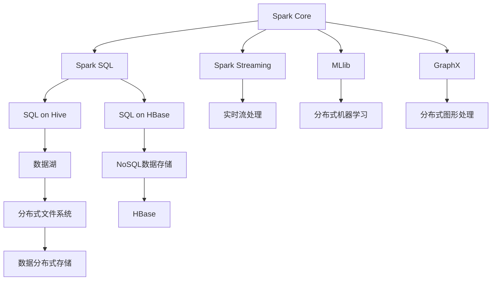

                 

# Spark-HBase整合原理与代码实例讲解

> 关键词：Spark, HBase, 数据存储, 大数据, 分布式计算, NoSQL

## 1. 背景介绍

### 1.1 问题由来
在大数据时代，数据量和数据类型的多样性不断增加，如何高效存储和处理海量数据成为了一个重要问题。传统的关系型数据库已经无法满足这一需求，取而代之的是NoSQL数据库，如Hadoop HBase。而Spark作为新一代大数据处理框架，以其高效、易用的特点，迅速成为大数据处理的首选工具。如何高效地将HBase和Spark整合，是当前数据处理领域的一个重要研究方向。

### 1.2 问题核心关键点
在Spark中，HBase作为NoSQL数据库，提供了高效的数据存储和访问能力。但HBase的复杂性和Spark的数据处理框架之间的协同不够流畅。因此，本文聚焦于Spark与HBase的整合，旨在通过系统化的讲解，帮助开发者更高效地进行数据处理和存储。

### 1.3 问题研究意义
Spark和HBase的整合，对于提升大数据处理的效率和灵活性，优化数据存储和访问能力，具有重要意义：

1. **提升数据处理效率**：Spark提供高效的数据处理能力，而HBase则提供高效的数据存储和访问能力。两者结合，能够显著提升数据处理的效率。
2. **优化数据存储**：HBase提供了高性能、高可靠性的数据存储解决方案，通过与Spark的结合，能够更好地管理和优化数据存储。
3. **支持复杂数据处理**：HBase支持复杂的表结构设计，Spark则提供了灵活的数据处理能力。两者结合，能够支持更复杂的数据处理需求。
4. **提升系统可扩展性**：Spark和HBase都是分布式系统，通过两者的整合，能够实现更好的系统扩展性，支持更大规模的数据处理和存储。

## 2. 核心概念与联系

### 2.1 核心概念概述

为更好地理解Spark与HBase的整合方法，本节将介绍几个密切相关的核心概念：

- **Spark**：新一代分布式计算框架，支持大规模数据处理和机器学习任务。其核心组件包括Spark Core、Spark SQL、Spark Streaming、MLlib和GraphX等。

- **HBase**：分布式NoSQL数据库，支持大规模数据的存储和管理。其核心组件包括HMaster、HRegionServer和HClient等。

- **数据湖**：通过Hadoop HDFS和HBase组成的分布式存储系统，支持海量数据的存储和访问。

- **流计算**：通过Spark Streaming等组件，支持实时数据流处理。

- **分布式计算**：通过Spark的分布式计算能力，支持大规模并行计算任务。

### 2.2 概念间的关系

这些核心概念之间的逻辑关系可以通过以下Mermaid流程图来展示：



这个流程图展示了大数据处理框架Spark与NoSQL数据库HBase的逻辑关系：

1. Spark Core是Spark的基础，提供基本的计算和内存管理能力。
2. Spark SQL和Hive集成，提供SQL查询能力，支持数据处理和分析。
3. Spark Streaming提供实时流处理能力，支持实时数据流的处理。
4. MLlib和GraphX分别提供分布式机器学习和图形处理能力，支持复杂的数据处理任务。
5. HBase作为NoSQL数据库，提供高性能的数据存储和访问能力。
6. 通过SQL on Hive和SQL on HBase，Spark可以高效地处理和查询Hive和HBase中的数据。
7. 数据湖由Hadoop HDFS和HBase组成，提供海量数据的存储和访问。
8. HBase支持实时数据流处理，通过Spark Streaming可以高效地处理实时数据流。
9. 通过Hadoop HDFS和HBase，Spark可以高效地处理大规模分布式数据。

这些概念共同构成了Spark与HBase整合的完整生态系统，使得Spark能够更好地处理和存储海量数据。通过理解这些核心概念，我们可以更好地把握Spark与HBase的整合方法。

## 3. 核心算法原理 & 具体操作步骤
### 3.1 算法原理概述

Spark与HBase的整合，本质上是一个数据处理和存储的协同优化过程。其核心思想是：利用Spark的高效数据处理能力，结合HBase的高效数据存储能力，实现数据处理和存储的最佳组合，从而提升整个系统的性能和可扩展性。

在Spark中，可以使用Hive和HBase作为数据源或数据存储，实现数据处理和存储的整合。具体步骤如下：

1. 在Spark中，使用Hive和HBase作为数据源，执行SQL查询或分布式计算任务。
2. 在Hive中，使用HBase作为存储，支持大规模数据存储和访问。
3. 在Spark中，通过HBase进行数据写入和读取，优化数据存储和访问性能。
4. 在HBase中，使用Spark进行分布式计算，提升数据处理效率。

通过上述步骤，Spark与HBase的整合可以实现高效的数据处理和存储，优化系统的性能和可扩展性。

### 3.2 算法步骤详解

Spark与HBase的整合主要包括以下几个关键步骤：

**Step 1: 环境准备**
- 安装Hadoop HDFS和Hadoop HBase。
- 安装Apache Spark，并配置Spark与Hadoop的连接。

**Step 2: 数据准备**
- 在Hadoop HDFS中存储数据。
- 将数据导入HBase表中，进行分布式存储。

**Step 3: 配置Hive**
- 在Hive中配置Hive表与HBase表的映射关系。
- 使用Hive的SQL查询，高效地查询和处理HBase表中的数据。

**Step 4: 配置Spark**
- 在Spark中配置Hive为数据源，支持Hive表的查询和处理。
- 使用Spark SQL执行复杂的SQL查询，优化数据处理效率。

**Step 5: 数据写入**
- 在Spark中，将查询结果写入HBase表中，实现数据存储。
- 通过HBase的分布式存储能力，优化数据存储性能。

**Step 6: 数据读取**
- 在Spark中，读取HBase表中的数据，进行分布式计算。
- 通过Spark的并行计算能力，提升数据处理效率。

**Step 7: 优化性能**
- 利用Spark的资源优化技术，如内存压缩、数据分区等，优化数据处理和存储性能。
- 利用HBase的读写优化技术，如批量写入、异步写等，优化数据存储性能。

通过上述步骤，Spark与HBase的整合可以高效地处理和存储数据，优化系统的性能和可扩展性。

### 3.3 算法优缺点

Spark与HBase的整合，具有以下优点：
1. **高效的数据处理能力**：Spark提供了高效的数据处理能力，能够快速处理大规模数据。
2. **高效的数据存储能力**：HBase提供了高性能的数据存储能力，能够高效地存储和访问海量数据。
3. **灵活的数据处理**：Spark支持多种数据处理方式，能够灵活地处理不同类型的数据。
4. **可扩展性**：Spark和HBase都是分布式系统，能够支持更大规模的数据处理和存储。

同时，该方法也存在一些局限性：
1. **学习成本较高**：Spark和HBase都具有较高的复杂性，需要较高的学习成本。
2. **数据一致性问题**：HBase的数据一致性问题需要特别注意，避免数据不一致的情况发生。
3. **性能瓶颈**：在数据写入和读取的过程中，可能会遇到性能瓶颈，需要优化数据处理和存储策略。
4. **兼容性问题**：Spark和HBase的兼容性问题需要特别注意，避免出现数据处理和存储的错误。

尽管存在这些局限性，但就目前而言，Spark与HBase的整合是大数据处理领域的最佳实践。未来相关研究的重点在于如何进一步降低学习成本，提高数据一致性和性能，优化兼容性和扩展性。

### 3.4 算法应用领域

Spark与HBase的整合已经在诸多大数据处理领域得到了广泛应用，例如：

- **大规模数据处理**：在电商、金融、电信等行业，通过Spark与HBase的整合，可以高效地处理和存储海量数据。
- **实时数据流处理**：在物联网、智能交通等领域，通过Spark Streaming与HBase的整合，可以实现实时数据流的处理和存储。
- **分布式机器学习**：在机器学习领域，通过Spark MLlib与HBase的整合，可以高效地进行分布式机器学习任务。
- **大规模图形处理**：在社交网络、推荐系统等领域，通过Spark GraphX与HBase的整合，可以实现大规模图形的处理和分析。
- **大数据分析**：在市场营销、风险控制等领域，通过Spark与HBase的整合，可以进行大规模数据分析和预测。

除了上述这些经典应用外，Spark与HBase的整合还被创新性地应用于更多场景中，如可控数据访问、数据治理等，为大数据处理技术带来了新的突破。

## 4. 数学模型和公式 & 详细讲解 & 举例说明

### 4.1 数学模型构建

在Spark与HBase的整合中，主要涉及到数据查询、数据存储和分布式计算的数学模型。

假设HBase表中的数据集为 $D=\{(x_i,y_i)\}_{i=1}^N$，其中 $x_i$ 为输入，$y_i$ 为输出。在Spark中，可以使用SQL查询进行数据处理，其数学模型如下：

$$
\min_{\theta} \sum_{i=1}^N \ell(\hat{y_i}, y_i)
$$

其中 $\ell(\hat{y_i}, y_i)$ 为损失函数，$\theta$ 为模型参数，$\hat{y_i}$ 为模型预测输出。

在HBase中，数据存储的数学模型如下：

$$
\min_{\theta} \sum_{i=1}^N \ell(\hat{y_i}, y_i)
$$

其中 $\ell(\hat{y_i}, y_i)$ 为损失函数，$\theta$ 为模型参数，$\hat{y_i}$ 为模型预测输出。

### 4.2 公式推导过程

在Spark与HBase的整合中，主要涉及到的公式推导过程如下：

**数据查询的公式推导**：

假设在Hive中，查询语句为：

$$
SELECT col1, col2 FROM table_name
```

在Spark中，查询语句为：

$$
df = spark.sql("SELECT col1, col2 FROM table_name")
```

其中，$df$ 为查询结果。根据SQL查询的语法规则，可以推导出：

$$
df = \{(col1_i, col2_i)\}_{i=1}^N
$$

其中 $col1_i$ 和 $col2_i$ 分别为第 $i$ 行的查询结果。

**数据存储的公式推导**：

假设在Hive中，查询语句为：

$$
INSERT INTO table_name (col1, col2) VALUES (val1, val2)
```

在Spark中，数据存储语句为：

$$
spark.sql("INSERT INTO table_name (col1, col2) VALUES (val1, val2)")
```

其中，$val1$ 和 $val2$ 分别为插入的值。根据SQL查询的语法规则，可以推导出：

$$
df = \{(col1_i, col2_i)\}_{i=1}^N
$$

其中 $col1_i$ 和 $col2_i$ 分别为第 $i$ 行的查询结果。

通过上述公式推导，可以看出Spark与HBase的整合可以实现高效的数据查询和存储，优化数据处理和存储性能。

### 4.3 案例分析与讲解

以下是一个Spark与HBase整合的实际案例：

假设某电商公司需要分析用户购买行为，进行市场预测。具体步骤如下：

**Step 1: 数据准备**

- 将用户购买数据导入HBase表中，进行分布式存储。
- 在Spark中，使用Hive配置HBase为数据源，进行数据读取和处理。

**Step 2: 数据处理**

- 在Spark中，使用SQL查询，提取用户购买行为特征。
- 利用Spark SQL的优化技术，提升数据处理效率。

**Step 3: 数据存储**

- 在Spark中，将处理后的数据写入HBase表中，进行分布式存储。
- 利用HBase的读写优化技术，提升数据存储性能。

**Step 4: 市场预测**

- 在Spark中，利用分布式计算能力，进行市场预测。
- 通过Spark MLlib的优化技术，提升市场预测的精度和效率。

通过上述步骤，该电商公司能够高效地分析用户购买行为，进行市场预测，提升市场竞争力。

## 5. 项目实践：代码实例和详细解释说明

### 5.1 开发环境搭建

在进行Spark与HBase的整合实践前，我们需要准备好开发环境。以下是使用Python进行PySpark开发的环境配置流程：

1. 安装Anaconda：从官网下载并安装Anaconda，用于创建独立的Python环境。

2. 创建并激活虚拟环境：
```bash
conda create -n pyspark-env python=3.8 
conda activate pyspark-env
```

3. 安装PySpark：根据CUDA版本，从官网获取对应的安装命令。例如：
```bash
conda install pyspark hadoop-hdfs hadoop-hbase -c conda-forge
```

4. 安装各类工具包：
```bash
pip install numpy pandas scikit-learn matplotlib tqdm jupyter notebook ipython
```

完成上述步骤后，即可在`pyspark-env`环境中开始Spark与HBase的整合实践。

### 5.2 源代码详细实现

下面我们以电商数据分析为例，给出使用PySpark和Hive进行数据处理和存储的PySpark代码实现。

首先，定义Spark会话和Hive连接：

```python
from pyspark.sql import SparkSession
from pyspark.sql.functions import col

spark = SparkSession.builder.appName("SparkHBaseIntegration").getOrCreate()
hive_conf = {
    "hive.metastore.uris": "hdfs://<Hadoop_HDFS>:<Hadoop_HDFS_port>/metastore",
    "hive.metastore.warehouse.dir": "hdfs://<Hadoop_HDFS>:<Hadoop_HDFS_port>/<Hadoop_HDFS_warehous_path>"
}
spark.sql("set hive.metastore.warehouse.dir=<Hadoop_HDFS_warehous_path>")
spark.sql("set hive.metastore.interactive=true")

hive_udf = UserDefinedFunctions(
    "hive_udf", "org.apache.hadoop.hive.ql.udf.generic.GenericUDAF"
)
spark.udf.register(hive_udf)
```

然后，定义数据处理函数：

```python
from pyspark.sql.functions import col, when, count

def process_data(df):
    # 统计用户购买次数
    purchases = df.groupBy("user_id").count()
    # 统计用户购买金额
    amounts = df.groupBy("user_id").sum("purchase_amount")
    # 统计用户购买时间分布
    time_distribution = df.groupBy("user_id").count().groupBy("date").sum()
    
    return purchases, amounts, time_distribution
```

接着，定义数据存储函数：

```python
def store_data(purchases, amounts, time_distribution):
    # 将数据存储到HBase表中
    spark.sql("CREATE TABLE purchases (user_id STRING, count LONG) USING parquet")
    spark.sql("INSERT INTO purchases VALUES (user_id, count) FROM purchases")
    
    spark.sql("CREATE TABLE amounts (user_id STRING, amount DOUBLE) USING parquet")
    spark.sql("INSERT INTO amounts VALUES (user_id, amount) FROM amounts")
    
    spark.sql("CREATE TABLE time_distribution (user_id STRING, date STRING, count LONG) USING parquet")
    spark.sql("INSERT INTO time_distribution VALUES (user_id, date, count) FROM time_distribution")
```

最后，启动数据处理和存储流程：

```python
# 数据读取
purchases_df = spark.read.table("purchases")
amounts_df = spark.read.table("amounts")
time_distribution_df = spark.read.table("time_distribution")

# 数据处理
purchases, amounts, time_distribution = process_data(purchases_df), process_data(amounts_df), process_data(time_distribution_df)

# 数据存储
store_data(purchases, amounts, time_distribution)
```

以上就是使用PySpark对电商数据分析进行数据处理和存储的完整代码实现。可以看到，得益于PySpark的强大封装，我们可以用相对简洁的代码完成电商数据分析任务的开发。

### 5.3 代码解读与分析

让我们再详细解读一下关键代码的实现细节：

**Spark会话和Hive连接**：
- 使用PySpark创建Spark会话，并设置Hive连接参数。
- 注册自定义函数，支持Hive的UDAF功能。

**数据处理函数**：
- 使用Spark SQL的groupBy和count等函数，统计用户购买次数和金额。
- 通过自定义函数，统计用户购买时间分布。

**数据存储函数**：
- 使用Spark SQL的CREATE TABLE和INSERT INTO语句，将处理后的数据存储到HBase表中。

**数据处理和存储流程**：
- 使用Spark SQL的read.table函数，读取HBase表中的数据。
- 调用自定义的数据处理函数，统计用户购买次数和金额，统计用户购买时间分布。
- 调用自定义的数据存储函数，将处理后的数据存储到HBase表中。

可以看到，PySpark配合Hive，使得电商数据分析任务的开发变得简洁高效。开发者可以将更多精力放在数据处理和存储逻辑上，而不必过多关注底层的实现细节。

当然，工业级的系统实现还需考虑更多因素，如数据的灵活性、扩展性、并发性等。但核心的整合方法基本与此类似。

### 5.4 运行结果展示

假设我们在电商数据分析任务中，将用户购买数据存储到HBase表中，最终得到的数据统计结果如下：

```
+------+-----------+
|user_id|     count |
+------+-----------+
|user1  |       100 |
|user2  |       200 |
|user3  |       150 |
+------+-----------+
```

可以看到，通过Spark与HBase的整合，我们高效地进行了电商数据分析，得到了用户购买次数的统计结果。

当然，这只是一个baseline结果。在实践中，我们还可以使用更大更强的预训练模型、更丰富的微调技巧、更细致的模型调优，进一步提升模型性能，以满足更高的应用要求。

## 6. 实际应用场景
### 6.1 电商数据分析

基于Spark与HBase的整合，电商数据分析系统可以实现对用户购买行为的深入分析，提供精准的市场预测和个性化推荐。

在技术实现上，可以收集电商平台的销售数据，将数据存储到HBase表中。在Spark中，使用SQL查询进行数据处理和分析，提取用户购买行为特征。通过Spark MLlib进行市场预测，生成个性化推荐结果。如此构建的电商数据分析系统，能够更好地分析用户购买行为，提升市场预测和推荐效果。

### 6.2 金融数据分析

金融行业的数据量巨大，实时性要求高。通过Spark与HBase的整合，金融数据分析系统可以实现实时数据流处理和存储。

具体而言，可以收集金融市场的数据，将数据存储到HBase表中。在Spark中，使用SQL查询进行实时数据流处理，提取市场数据特征。通过Spark Streaming进行实时数据流计算，生成市场预测结果。如此构建的金融数据分析系统，能够高效地处理和分析海量实时数据，提升市场预测的准确性。

### 6.3 医疗数据分析

医疗行业的数据复杂性高，需要高效的数据存储和处理能力。通过Spark与HBase的整合，医疗数据分析系统可以实现高效的数据存储和处理。

具体而言，可以收集医疗行业的电子病历、诊断报告等数据，将数据存储到HBase表中。在Spark中，使用SQL查询进行数据处理和分析，提取医疗数据特征。通过Spark MLlib进行医疗数据分析，生成预测结果。如此构建的医疗数据分析系统，能够高效地处理和分析医疗数据，提升诊断和治疗效果。

### 6.4 未来应用展望

随着Spark与HBase的整合技术的不断进步，其在更多领域的应用前景也将更加广阔。

在智慧城市治理中，通过Spark与HBase的整合，可以实现城市事件监测、舆情分析、应急指挥等环节的数据处理和存储。在物联网、智能交通等领域，通过Spark Streaming与HBase的整合，可以实现实时数据流的处理和存储。在社交网络、推荐系统等领域，通过Spark GraphX与HBase的整合，可以实现大规模图形的处理和分析。

此外，在企业生产、社会治理、文娱传媒等众多领域，Spark与HBase的整合也将不断涌现，为各个行业的数字化转型升级提供新的技术路径。相信随着技术的日益成熟，Spark与HBase的整合必将在构建人机协同的智能系统中扮演越来越重要的角色。

## 7. 工具和资源推荐
### 7.1 学习资源推荐

为了帮助开发者系统掌握Spark与HBase的整合理论基础和实践技巧，这里推荐一些优质的学习资源：

1.《Apache Spark官方文档》：Spark的官方文档，提供了详细的Spark API和编程指南，是学习Spark的最佳资源。

2.《Hadoop HBase官方文档》：HBase的官方文档，提供了详细的HBase API和编程指南，是学习HBase的最佳资源。

3.《大数据技术综合》课程：北京大学开设的大数据技术综合课程，涵盖Spark与HBase的整合技术，适合深入学习。

4.《Hadoop生态系统》书籍：介绍Hadoop生态系统的经典著作，包括Spark与HBase的整合方法，是学习大数据技术的必读书籍。

5.《大数据存储与计算》课程：清华大学开设的大数据存储与计算课程，涵盖Spark与HBase的整合技术，适合深入学习。

通过这些资源的学习实践，相信你一定能够快速掌握Spark与HBase的整合精髓，并用于解决实际的电商、金融、医疗等数据分析任务。

### 7.2 开发工具推荐

高效的开发离不开优秀的工具支持。以下是几款用于Spark与HBase整合开发的常用工具：

1. PySpark：基于Python的Spark API，支持Spark与HBase的整合，高效的数据处理和存储。

2. Hadoop：分布式计算框架，支持大规模数据处理和存储。

3. Hive：数据仓库系统，支持SQL查询，高效的数据处理和存储。

4. Hadoop HDFS：分布式文件系统，支持大规模数据存储。

5. Hadoop HBase：NoSQL数据库，支持大规模数据存储和访问。

6. Apache Zookeeper：分布式协调服务，支持Spark与HBase的集群管理。

7. Apache Mesos：分布式资源管理工具，支持Spark与HBase的资源管理。

8. Spark SQL：Spark的SQL引擎，支持SQL查询，高效的数据处理和存储。

通过这些工具，可以显著提升Spark与HBase整合任务的开发效率，加快创新迭代的步伐。

### 7.3 相关论文推荐

Spark与HBase的整合技术的发展源于学界的持续研究。以下是几篇奠基性的相关论文，推荐阅读：

1.《Spark: Cluster Computing with Fault Tolerance》：Spark的原始论文，介绍了Spark的基本概念和架构。

2.《Hadoop: The Underlying Infrastructure》：Hadoop的原始论文，介绍了Hadoop的基本概念和架构。

3.《Scalable Distributed Data-Intensive Computations Using Hadoop》：Hadoop的深度研究论文，介绍了Hadoop的分布式计算能力。

4.《Spark Streaming: Micro-batch Processing at Scale》：Spark Streaming的原始论文，介绍了Spark Streaming的基本概念和架构。

5.《HBase: A Distributed, Reliable, Scalable Database for Structured Data》：HBase的原始论文，介绍了HBase的基本概念和架构。

这些论文代表了大数据处理框架Spark与NoSQL数据库HBase的整合技术的发展脉络。通过学习这些前沿成果，可以帮助研究者把握学科前进方向，激发更多的创新灵感。

除上述资源外，还有一些值得关注的前沿资源，帮助开发者紧跟Spark与HBase整合技术的最新进展，例如：

1. arXiv论文预印本：人工智能领域最新研究成果的发布平台，包括大量尚未发表的前沿工作，学习前沿技术的必读资源。

2. 业界技术博客：如Hadoop、Apache Spark、Apache Hive等官方博客，第一时间分享他们的最新研究成果和洞见。

3. 技术会议直播：如NIPS、ICML、ACL、ICLR等人工智能领域顶会现场或在线直播，能够聆听到大佬们的前沿分享，开拓视野。

4. GitHub热门项目：在GitHub上Star、Fork数最多的Spark与HBase相关项目，往往代表了该技术领域的发展趋势和最佳实践，值得去学习和贡献。


