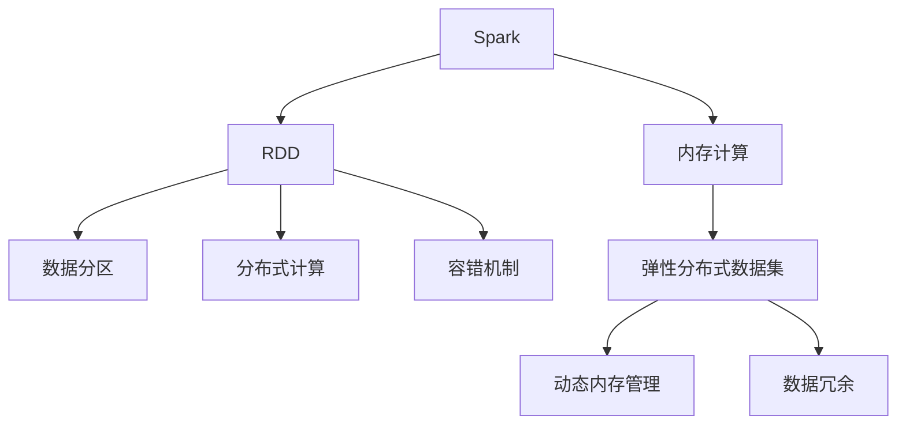
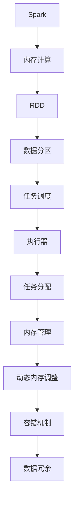

                 

# Spark内存计算引擎原理与代码实例讲解

> 关键词：Spark,内存计算,大数据处理,数据流处理,图计算,分布式计算

## 1. 背景介绍

### 1.1 问题由来
在大数据时代，数据量急剧增长，传统硬盘存储和批处理计算已经难以满足实时、高吞吐量的需求。与此同时，内存作为读写速度更快、延时更短的存储介质，逐渐成为数据处理的首选。为了充分发挥内存的性能优势，人们开始探索内存计算技术，并逐步应用到实际生产环境中。

其中，Spark是一个开源的内存计算框架，能够实现高效的大数据处理，其内存计算能力被广泛应用于各种数据流处理、图计算、机器学习等领域。本文将详细介绍Spark内存计算引擎的核心原理，并结合实际项目案例，展示其在内存计算中的高效性和实用性。

### 1.2 问题核心关键点
Spark内存计算引擎的核心关键点主要包括以下几个方面：

- **内存计算**：通过将数据缓存到内存中，减少磁盘I/O，大幅提升数据处理速度。
- **弹性分布式数据集（RDD）**：Spark的核心抽象，通过将数据切分为多个分区，实现分布式计算。
- **内存管理**：Spark使用动态内存管理机制，自动调整内存分配，保证内存使用效率。
- **故障恢复**：Spark具备数据冗余和容错机制，确保数据处理过程的可靠性。
- **高效数据传输**：Spark采用网络传输优化的算法，减少数据传输时间和带宽消耗。

这些关键点使得Spark成为内存计算领域的重要工具，帮助用户在大数据处理中实现更高的性能和更低的成本。

## 2. 核心概念与联系

### 2.1 核心概念概述

为了更好地理解Spark内存计算引擎的工作原理，本节将介绍几个密切相关的核心概念：

- **Spark**：Apache Spark是一个开源的分布式计算框架，支持内存计算、图计算、机器学习等众多功能，广泛应用于大数据处理领域。
- **内存计算**：将数据存储在内存中进行计算，相比传统磁盘存储，能够大幅提升数据处理速度。
- **弹性分布式数据集（RDD）**：Spark的核心抽象，支持数据分区、分布式计算、容错等特性，是Spark的基础数据结构。
- **动态内存管理**：Spark通过动态调整内存分配，确保内存使用效率，避免内存溢出。
- **数据冗余和容错**：Spark通过数据冗余和恢复机制，确保数据处理过程的可靠性，避免单点故障。

这些核心概念之间存在着紧密的联系，形成了Spark内存计算引擎的完整生态系统。下面通过一个Mermaid流程图来展示这些概念之间的关系：



这个流程图展示了Spark内存计算引擎的核心概念及其之间的关系：

1. Spark通过内存计算大幅提升数据处理速度。
2. Spark使用RDD作为数据抽象，支持数据分区和分布式计算。
3. RDD通过动态内存管理和数据冗余机制，确保内存使用效率和计算可靠性。
4. 弹性分布式数据集和动态内存管理共同构成Spark的核心技术栈。

通过理解这些核心概念，我们可以更好地把握Spark内存计算引擎的工作原理和优化方向。

### 2.2 概念间的关系

这些核心概念之间存在着紧密的联系，形成了Spark内存计算引擎的完整生态系统。下面我们通过几个Mermaid流程图来展示这些概念之间的关系。

#### 2.2.1 Spark内存计算的架构



这个流程图展示了Spark内存计算架构的基本原理，以及数据处理流程。

#### 2.2.2 RDD的数据处理流程


这个流程图展示了RDD在数据处理过程中，从数据分区到任务调度、执行器执行、内存管理和容错机制的工作流程。

## 3. 核心算法原理 & 具体操作步骤
### 3.1 算法原理概述

Spark内存计算引擎的核心算法原理主要包括以下几个方面：

- **内存计算**：将数据存储在内存中进行计算，能够大幅提升数据处理速度。
- **弹性分布式数据集（RDD）**：Spark的核心抽象，支持数据分区、分布式计算、容错等特性。
- **动态内存管理**：Spark通过动态调整内存分配，确保内存使用效率。
- **数据冗余和容错**：Spark通过数据冗余和恢复机制，确保数据处理过程的可靠性。

这些原理共同构成了Spark内存计算引擎的核心技术基础。下面将逐一详细介绍这些核心算法原理。

### 3.2 算法步骤详解

Spark内存计算引擎的算法步骤主要包括数据分区、任务调度、执行器执行、内存管理和容错机制等。以下将详细介绍这些步骤的具体实现过程。

**Step 1: 数据分区**

数据分区是Spark内存计算的基础，通过将数据切分为多个分区，实现分布式计算。数据分区的实现步骤如下：

1. **数据切分**：将原始数据集按照一定规则切分为多个小分区，每个分区包含部分数据。
2. **数据复制**：将每个分区复制到多个执行器中，以实现并行计算。
3. **数据排序**：根据分区键（如时间戳、用户ID等）对数据进行排序，以便后续的聚合、过滤等操作。

Spark提供了一种灵活的数据分区方式，支持按照Hash、Range、Custom等规则进行分区。数据分区的粒度可以根据实际需求进行调整，以平衡内存使用和计算效率。

**Step 2: 任务调度**

任务调度是Spark内存计算的核心，通过将计算任务分配给执行器执行，实现并行计算。任务调度的实现步骤如下：

1. **任务划分**：将计算任务划分为多个小任务，每个任务处理部分数据。
2. **任务分配**：将任务分配给多个执行器执行，每个执行器处理一个或多个小任务。
3. **任务合并**：将执行器返回的结果进行合并，得到最终的处理结果。

Spark使用一个基于DAG的任务调度器（Task Scheduler）来管理任务的分配和执行。任务调度器通过优先级、资源占用、执行时间等因素来决定任务的执行顺序，以实现高效的资源利用。

**Step 3: 执行器执行**

执行器执行是Spark内存计算的具体实现，通过将任务分配给执行器执行，实现并行计算。执行器执行的实现步骤如下：

1. **任务获取**：执行器从任务调度器获取任务列表，按照任务优先级进行处理。
2. **数据获取**：执行器从内存中获取需要处理的数据。
3. **计算处理**：执行器对数据进行计算处理，得到中间结果。
4. **数据更新**：执行器将中间结果更新到内存中，以便后续任务使用。

执行器执行是Spark内存计算的核心部分，通过将计算任务分解为多个小任务，实现并行计算，提高数据处理效率。

**Step 4: 内存管理**

内存管理是Spark内存计算的重要保障，通过动态调整内存分配，确保内存使用效率。内存管理的实现步骤如下：

1. **内存分配**：根据计算任务的需求，动态分配内存空间。
2. **内存释放**：当任务完成后，将分配的内存空间释放，以便后续任务使用。
3. **内存调整**：根据内存使用情况，动态调整内存分配策略，避免内存溢出。

Spark使用一个内存管理器（Memory Manager）来管理内存的分配和释放。内存管理器通过动态调整内存分配策略，确保内存使用效率，避免内存溢出。

**Step 5: 容错机制**

容错机制是Spark内存计算的重要保障，通过数据冗余和恢复机制，确保数据处理过程的可靠性。容错机制的实现步骤如下：

1. **数据冗余**：在每个分区中复制多份数据，以实现数据冗余。
2. **故障检测**：实时监控执行器的状态，检测是否发生故障。
3. **数据恢复**：当某个执行器故障时，从冗余数据中恢复数据，确保计算过程的连续性。

Spark通过数据冗余和恢复机制，确保数据处理过程的可靠性，避免单点故障。

### 3.3 算法优缺点

Spark内存计算引擎具有以下优点：

- **高效计算**：内存计算能够大幅提升数据处理速度，适合大规模数据处理。
- **弹性分布式**：支持数据分区和分布式计算，能够充分利用计算资源。
- **动态调整**：通过动态内存管理，确保内存使用效率。
- **容错可靠**：具备数据冗余和容错机制，确保数据处理过程的可靠性。

同时，Spark内存计算引擎也存在以下缺点：

- **内存限制**：内存计算需要大量内存空间，对硬件资源要求较高。
- **数据复杂性**：对于数据量较大、数据结构复杂的应用，内存计算的难度较高。
- **维护成本**：需要管理和维护内存分配和数据冗余机制，可能增加系统复杂度。

尽管存在这些缺点，但通过合理设计数据分区、任务调度和内存管理策略，可以最大化Spark内存计算引擎的性能优势。

### 3.4 算法应用领域

Spark内存计算引擎的应用领域非常广泛，包括但不限于以下几种：

- **大数据处理**：适用于数据量较大、数据结构复杂的应用场景，能够实现高效的数据处理和分析。
- **数据流处理**：支持实时数据流处理，能够实现高吞吐量的数据流计算。
- **图计算**：支持大规模图计算，能够高效处理图数据集。
- **机器学习**：支持分布式机器学习，能够实现高效的模型训练和预测。

随着Spark内存计算引擎的不断演进，其应用领域还将进一步拓展，带来更多的技术突破和创新应用。

## 4. 数学模型和公式 & 详细讲解 & 举例说明

### 4.1 数学模型构建

Spark内存计算引擎的数学模型主要基于分布式计算和内存管理。以下是Spark内存计算的基本数学模型：

- **数据分区模型**：将数据集分为多个分区，每个分区包含部分数据。
- **任务调度模型**：将计算任务划分为多个小任务，每个任务处理部分数据。
- **执行器执行模型**：执行器对数据进行计算处理，得到中间结果。
- **内存管理模型**：动态调整内存分配策略，确保内存使用效率。
- **容错机制模型**：通过数据冗余和恢复机制，确保数据处理过程的可靠性。

这些数学模型共同构成了Spark内存计算引擎的核心基础。

### 4.2 公式推导过程

以下是Spark内存计算引擎中几个关键数学公式的推导过程：

**数据分区公式**：

设原始数据集大小为 $N$，每个分区大小为 $K$，则数据分区数量为：

$$
P = \lceil \frac{N}{K} \rceil
$$

其中，$\lceil x \rceil$ 表示向上取整。

**任务调度公式**：

设任务数量为 $T$，每个任务需要处理的数据量为 $L$，则任务调度过程的计算时间为：

$$
T_{调度} = \frac{N}{L} \times T
$$

其中，$T_{调度}$ 表示任务调度时间，$T$ 表示每个任务的处理时间。

**执行器执行公式**：

设每个执行器分配的内存大小为 $M$，每个任务需要处理的数据量为 $L$，则执行器执行过程的计算时间为：

$$
T_{执行} = \frac{L}{M} \times T
$$

其中，$T_{执行}$ 表示执行器执行时间，$T$ 表示每个任务的处理时间。

**内存管理公式**：

设内存总大小为 $M_{总}$，每个分区需要的内存大小为 $M_{分区}$，则内存管理过程的计算时间为：

$$
T_{内存} = \frac{N}{M_{分区}} \times \frac{M_{总}}{M_{分区}} \times T
$$

其中，$T_{内存}$ 表示内存管理时间，$T$ 表示每个任务的处理时间。

**容错机制公式**：

设每个分区需要复制的数据量为 $C$，数据冗余时间为 $R$，则容错机制过程的计算时间为：

$$
T_{容错} = C \times R \times T
$$

其中，$T_{容错}$ 表示容错机制时间，$T$ 表示每个任务的处理时间。

### 4.3 案例分析与讲解

以下是一个Spark内存计算引擎的实际应用案例：

**项目背景**：一家电商平台需要实时计算每天的订单金额和销售趋势。订单数据量较大，原始数据存储在Hadoop分布式文件系统中。

**数据处理流程**：

1. **数据读取**：使用Spark的Hadoop文件系统集成器（Hadoop FS Integrate），读取订单数据集。
2. **数据分区**：将订单数据集按照时间戳进行分区，每个分区包含一定时间范围内的订单数据。
3. **数据清洗**：使用Spark的SQL引擎（Spark SQL），对订单数据进行清洗和预处理。
4. **数据计算**：使用Spark的核心API（Spark Core），对订单数据进行计算，得到每天的订单金额和销售趋势。
5. **数据输出**：将计算结果输出到Hadoop分布式文件系统中，以便后续分析和展示。

**性能分析**：

- **数据读取**：通过Spark的Hadoop文件系统集成器，读取订单数据集，能够高效处理大数据量的读取操作。
- **数据分区**：将订单数据集按照时间戳进行分区，实现分布式计算，提高数据处理效率。
- **数据清洗**：使用Spark的SQL引擎进行数据清洗，能够处理复杂的数据处理逻辑，确保数据质量。
- **数据计算**：使用Spark的核心API进行计算，能够实现高效的数据处理，满足实时计算需求。
- **数据输出**：将计算结果输出到Hadoop分布式文件系统中，能够高效存储和管理数据，便于后续分析和展示。

## 5. 项目实践：代码实例和详细解释说明

### 5.1 开发环境搭建

在开始项目实践前，需要搭建好Spark开发环境。以下是使用Python进行Spark开发的环境配置流程：

1. 安装Anaconda：从官网下载并安装Anaconda，用于创建独立的Python环境。

2. 创建并激活虚拟环境：
```bash
conda create -n spark-env python=3.7
conda activate spark-env
```

3. 安装Spark：根据操作系统和硬件配置，从官网获取对应的安装命令。例如：
```bash
conda install spark=3.1.2
```

4. 安装PySpark：使用Python的pyspark库，能够在Python环境中使用Spark。
```bash
pip install pyspark
```

5. 安装相关依赖：
```bash
pip install pyarrow pandas numpy pytz
```

完成上述步骤后，即可在`spark-env`环境中开始Spark开发。

### 5.2 源代码详细实现

以下是一个使用Spark进行大数据处理和分析的实际项目案例，包括数据读取、数据分区、数据计算和数据输出的完整代码实现。

**数据读取**

```python
from pyspark.sql import SparkSession

spark = SparkSession.builder.appName("spark-big-data").getOrCreate()

# 读取Hadoop分布式文件系统中的订单数据
order_data = spark.read.csv("hdfs://path/to/order_data.csv", inferSchema=True, header=True)

# 显示前10行数据
order_data.show(10)
```

**数据分区**

```python
# 按照时间戳进行分区
partitioned_data = order_data.partitionBy("timestamp")

# 显示分区信息
partitioned_data.getNumPartitions()
```

**数据清洗**

```python
# 去除无用的列
cleaned_data = order_data.drop("column1", "column2")

# 进行数据清洗和预处理
cleaned_data = cleaned_data.select("timestamp", "order_amount", "order_time")

# 显示清洗后的数据前10行
cleaned_data.show(10)
```

**数据计算**

```python
# 计算每天的订单金额和销售趋势
daily_sales = cleaned_data.groupBy("timestamp").agg({"order_amount": "sum"})

# 显示每天的订单金额和销售趋势
daily_sales.show()
```

**数据输出**

```python
# 将计算结果输出到Hadoop分布式文件系统中
daily_sales.write.csv("hdfs://path/to/daily_sales.csv", header=True)

# 关闭Spark会话
spark.stop()
```

以上是使用PySpark进行Spark内存计算引擎的完整代码实现。可以看到，通过Spark的SQL引擎和核心API，能够高效地处理大数据量的读取、分区、清洗、计算和输出操作。

### 5.3 代码解读与分析

让我们再详细解读一下关键代码的实现细节：

**数据读取**：
- 使用Spark的Hadoop文件系统集成器（Hadoop FS Integrate），读取Hadoop分布式文件系统中的订单数据集。
- `read.csv`方法支持读取多种数据格式，如CSV、JSON、Parquet等，并支持自动推断数据类型和列名。

**数据分区**：
- 使用`partitionBy`方法对数据集进行分区，根据时间戳进行分片，实现分布式计算。
- `getNumPartitions`方法可以查询数据分区的数量，以便后续的操作。

**数据清洗**：
- 使用`drop`方法去除无用的列，保留有用的字段。
- 使用`select`方法进行数据清洗和预处理，保留需要统计的字段。

**数据计算**：
- 使用`groupBy`方法对数据进行分组，按照时间戳进行聚合。
- 使用`agg`方法进行聚合计算，计算每天的订单金额和销售趋势。

**数据输出**：
- 使用`write.csv`方法将计算结果输出到Hadoop分布式文件系统中。
- 使用`stop`方法关闭Spark会话，释放资源。

## 6. 实际应用场景

### 6.1 智能推荐系统

Spark内存计算引擎在智能推荐系统中的应用非常广泛。通过Spark的大数据处理能力，能够高效处理用户行为数据和商品数据，实现个性化推荐。

具体而言，可以收集用户的浏览、购买、评分等行为数据，提取商品标题、描述、类别等特征信息。通过Spark的分布式计算和内存管理机制，对用户行为数据和商品数据进行实时计算，得到用户的兴趣偏好和商品特征，生成推荐结果。

### 6.2 实时监控系统

Spark内存计算引擎在实时监控系统中的应用也非常重要。通过Spark的大数据处理能力，能够实时监控系统的运行状态，及时发现异常情况。

具体而言，可以实时收集系统的日志、性能指标等数据，使用Spark的SQL引擎进行数据清洗和预处理，得到实时监控结果。通过Spark的核心API进行数据计算，得到系统的运行状态和异常情况，生成监控报告，及时通知运维人员处理。

### 6.3 金融数据分析

Spark内存计算引擎在金融数据分析中的应用非常广泛。通过Spark的大数据处理能力，能够高效处理金融市场数据，实现市场分析和投资决策。

具体而言，可以实时收集金融市场的数据，如股票、期货、外汇等，使用Spark的分布式计算和内存管理机制，对市场数据进行实时计算，得到市场的运行状态和趋势，生成投资决策报告，帮助投资者做出更明智的投资决策。

### 6.4 未来应用展望

随着Spark内存计算引擎的不断演进，未来的应用领域还将进一步拓展，带来更多的技术突破和创新应用。

在智慧城市治理中，Spark内存计算引擎可以应用于城市事件监测、舆情分析、应急指挥等环节，提高城市管理的自动化和智能化水平，构建更安全、高效的未来城市。

在智能制造领域，Spark内存计算引擎可以应用于生产流程的实时监控、设备状态预测、生产调度优化等，提高生产效率和设备利用率。

在医疗健康领域，Spark内存计算引擎可以应用于患者数据的实时分析、病历数据的关联分析、医疗资源的优化配置等，提高医疗服务的质量和效率。

## 7. 工具和资源推荐

### 7.1 学习资源推荐

为了帮助开发者系统掌握Spark内存计算引擎的理论基础和实践技巧，这里推荐一些优质的学习资源：

1.《Spark编程指南》：由Spark官方编写，深入浅出地介绍了Spark的核心概念和开发技巧。
2.《Apache Spark教程》：由Apache Spark官方编写，提供了详细的Spark开发实战案例。
3.《Spark on Cloud: Building and Running Spark on Clusters with Hadoop YARN》：介绍了如何在Hadoop YARN上部署和运行Spark，适合使用YARN集群的用户。
4.《Spark with DataFrames》：介绍了使用Spark SQL进行数据处理和分析的详细教程。
5.《Spark with PySpark》：介绍了使用PySpark进行Spark开发的详细教程。

通过对这些资源的学习实践，相信你一定能够快速掌握Spark内存计算引擎的核心技术，并用于解决实际的业务问题。

### 7.2 开发工具推荐

高效的开发离不开优秀的工具支持。以下是几款用于Spark内存计算引擎开发的工具：

1. PySpark：Python的Spark API，能够在Python环境中使用Spark。
2. Spark SQL：Spark的SQL引擎，支持使用SQL进行数据处理和分析。
3. Spark Streaming：Spark的实时数据流处理框架，支持实时数据流的处理和分析。
4. Spark GraphX：Spark的图计算框架，支持大规模图数据的计算和分析。
5. Spark MLlib：Spark的机器学习库，支持分布式机器学习算法的实现。

合理利用这些工具，可以显著提升Spark内存计算引擎的开发效率，加快创新迭代的步伐。

### 7.3 相关论文推荐

Spark内存计算引擎的研究涉及众多领域，以下是几篇奠基性的相关论文，推荐阅读：

1. Rethinking Distributed Computation：介绍Spark的基本原理和核心技术，是Spark官方文档的重要组成部分。
2. Spark: Cluster Computing with Working Sets：介绍Spark的核心算法和实现细节，是Spark论文的深度解析。
3. Resilient Distributed Datasets: A Fault-Tolerant Abstraction for In-Memory Cluster Computing：介绍Spark的核心抽象RDD的实现细节，是Spark论文的必读篇目。
4. Using DataFrames with PySpark：介绍如何在Python中使用Spark的DataFrames进行数据处理和分析。
5. Spark Streaming Programming Guide：介绍如何使用Spark Streaming进行实时数据流的处理和分析。

这些论文代表了大数据计算领域的最新进展，对于深入理解Spark内存计算引擎具有重要参考价值。

除上述资源外，还有一些值得关注的前沿资源，帮助开发者紧跟Spark内存计算引擎的最新进展，例如：

1. arXiv论文预印本：人工智能领域最新研究成果的发布平台，包括大量尚未发表的前沿工作，学习前沿技术的必读资源。
2. Apache Spark官方博客：Apache Spark官方博客，提供最新的Spark功能、性能、使用技巧等。
3. Spark用户社区：Spark用户社区，提供Spark用户之间的交流和分享。
4. Kaggle竞赛：Kaggle上的Spark竞赛，提供丰富的Spark开发案例和挑战。
5. Spark生态系统：Spark生态系统，包括Spark的各个组件和扩展库，帮助开发者深入了解Spark的技术栈。

总之，对于Spark内存计算引擎的学习和实践，需要开发者保持开放的心态和持续学习的意愿。多关注前沿资讯，多动手实践，多思考总结，必将收获满满的成长收益。

## 8. 总结：未来发展趋势与挑战

### 8.1 研究成果总结

本文对Spark内存计算引擎的核心原理和实际项目案例进行了详细讲解，总结了Spark在大数据处理、实时流处理、图计算、机器学习等方面的应用，以及其未来发展趋势和面临的挑战。

通过本文的系统梳理，可以看到，Spark内存计算引擎已经在大数据处理领域发挥了重要作用，帮助用户实现了高效、可靠的数据处理。未来，随着Spark内存计算引擎的不断演进，其应用领域还将进一步拓展，带来更多的技术突破和创新应用。

### 8.2 未来发展趋势

Spark内存计算引擎的未来发展趋势主要包括以下几个方面：

1. **分布式计算**：Spark将继续在分布式计算领域保持领先地位，支持更大规模的集群计算，提升计算效率。
2. **实时流处理**：Spark Streaming将不断优化，支持更复杂、更高效的实时流处理算法，满足实时计算需求。
3. **图计算**：Spark GraphX将不断演进，支持更大规模的图计算，提升图数据的处理效率。
4. **机器学习**：Spark MLlib将不断优化，支持更高效、更强大的分布式机器学习

