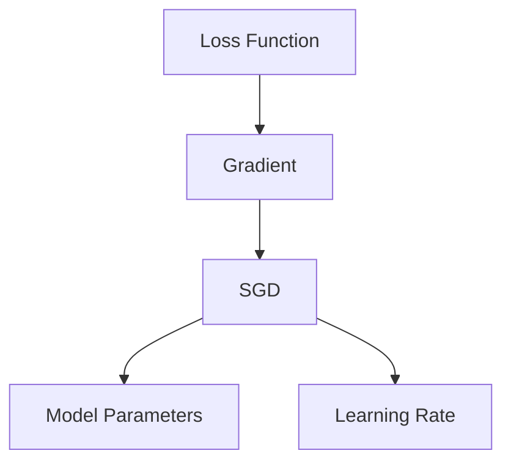
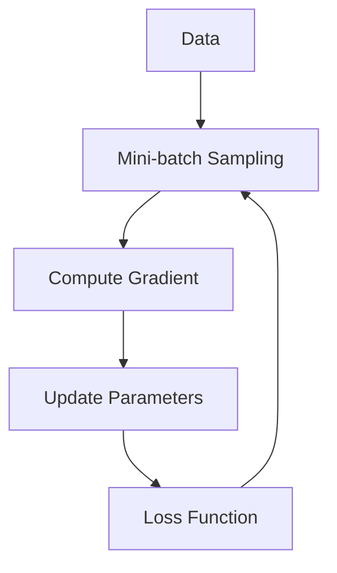

                 

# Stochastic Gradient Descent (SGD) 原理与代码实战案例讲解

> 关键词：随机梯度下降, SGD, 梯度下降, 深度学习, 神经网络, 优化算法

## 1. 背景介绍

### 1.1 问题由来

在深度学习和神经网络领域，优化算法扮演着至关重要的角色。这些算法旨在最小化损失函数，使模型参数能够准确地拟合训练数据。其中，随机梯度下降算法（Stochastic Gradient Descent，SGD）是深度学习中最基础和应用最广泛的优化算法之一。本文将深入探讨SGD的原理，并通过实例讲解其实现方法。

### 1.2 问题核心关键点

SGD的核心思想是通过不断更新模型参数来最小化损失函数，使其能够更准确地拟合数据。SGD的核心步骤如下：

1. 随机选择一个小批量（mini-batch）的训练样本。
2. 计算该小批量样本对损失函数的梯度。
3. 根据梯度方向和大小更新模型参数。
4. 重复步骤1-3，直至损失函数收敛或达到预设的迭代次数。

SGD的优点在于其计算效率高，适用于大规模数据集和复杂模型。然而，SGD的收敛速度和稳定性依赖于学习率的设置，不当的学习率可能导致模型无法收敛或出现震荡。

### 1.3 问题研究意义

理解SGD的原理和实现方法，对于深度学习模型的训练和优化具有重要意义：

1. 提高模型训练效率。SGD的随机性使得模型能够更快地收敛。
2. 增强模型泛化能力。SGD通过随机选择训练样本来减少过拟合风险。
3. 简化模型实现。SGD的实现过程简单，易于理解和调试。
4. 拓展应用领域。SGD广泛应用于图像识别、自然语言处理、推荐系统等多个领域。

## 2. 核心概念与联系

### 2.1 核心概念概述

为了更好地理解SGD算法，我们需要先介绍几个关键概念：

- **损失函数（Loss Function）**：衡量模型预测结果与真实结果之间差距的函数。
- **梯度（Gradient）**：损失函数对模型参数的偏导数，指导模型参数的更新方向。
- **学习率（Learning Rate）**：控制参数更新步长的超参数，影响模型收敛速度和稳定性。
- **随机梯度下降（SGD）**：一种基于梯度的优化算法，通过随机选择小批量样本来计算梯度，更新模型参数。

### 2.2 概念间的关系

这些核心概念之间的关系可以通过以下Mermaid流程图来展示：



这个流程图展示了几者之间的关系：

1. 损失函数计算梯度。
2. SGD根据梯度更新模型参数。
3. 学习率控制参数更新的步长。

### 2.3 核心概念的整体架构

最后，我们用一个综合的流程图来展示这些核心概念在大规模模型训练中的整体架构：



这个综合流程图展示了SGD算法在大规模模型训练中的基本流程：

1. 从大规模数据集中随机采样形成小批量。
2. 计算小批量数据对损失函数的梯度。
3. 根据梯度更新模型参数。
4. 将更新后的参数重新代入损失函数计算。
5. 重复以上过程，直至模型收敛或达到预设迭代次数。

## 3. 核心算法原理 & 具体操作步骤
### 3.1 算法原理概述

SGD的基本原理是通过随机梯度（Gradient）来更新模型参数，使其能够逼近损失函数的最小值。具体步骤如下：

1. 从训练数据集中随机选择一个小批量（mini-batch）的样本。
2. 计算该小批量样本对损失函数的梯度，并根据梯度方向更新模型参数。
3. 重复上述步骤，直至达到预设的迭代次数或损失函数收敛。

SGD的核心在于其随机性，通过随机选择训练样本来减少计算复杂度，加速模型收敛。然而，SGD的收敛速度和稳定性依赖于学习率的设置。

### 3.2 算法步骤详解

以下是SGD算法的详细步骤：

1. **初始化模型参数**：设定模型初始参数 $\theta_0$，通常随机初始化。
2. **随机采样**：从训练数据集中随机选择一个小批量（mini-batch）的样本，大小为 $n$。
3. **计算梯度**：计算该小批量样本对损失函数的梯度 $\nabla L(\theta)$。
4. **参数更新**：根据梯度方向和大小，更新模型参数，即 $\theta \leftarrow \theta - \eta \nabla L(\theta)$，其中 $\eta$ 为学习率。
5. **重复步骤2-4**：不断重复随机采样和参数更新的过程，直至达到预设的迭代次数或损失函数收敛。

### 3.3 算法优缺点

**优点**：
- **计算效率高**：SGD通过随机采样来减少计算复杂度，适用于大规模数据集和复杂模型。
- **泛化能力强**：SGD通过随机采样来减少过拟合风险，提高模型的泛化能力。
- **简单易于实现**：SGD的实现过程简单，易于理解和调试。

**缺点**：
- **收敛速度慢**：SGD的随机性可能导致收敛速度较慢。
- **对学习率敏感**：SGD的收敛速度和稳定性依赖于学习率的设置，不当的学习率可能导致模型无法收敛或出现震荡。
- **可能陷入局部最优**：SGD的随机性可能导致模型陷入局部最优，而非全局最优。

### 3.4 算法应用领域

SGD算法在深度学习和神经网络领域有广泛的应用，例如：

- 图像分类：通过随机选择图像样本，优化卷积神经网络（CNN）模型参数，提高图像分类的准确率。
- 自然语言处理（NLP）：通过随机选择文本样本，优化循环神经网络（RNN）或Transformer模型参数，提高文本分类的准确率。
- 推荐系统：通过随机选择用户行为样本，优化推荐算法模型参数，提高个性化推荐的准确率。
- 强化学习：通过随机选择动作样本，优化智能体（Agent）模型参数，提高智能体在环境中的表现。

## 4. 数学模型和公式 & 详细讲解  
### 4.1 数学模型构建

假设模型的损失函数为 $L(\theta)$，其中 $\theta$ 为模型参数。SGD的目标是最小化损失函数 $L(\theta)$，即：

$$
\min_{\theta} L(\theta)
$$

在每次迭代中，SGD通过随机选择一个小批量（mini-batch）的样本 $(x_i, y_i)$，计算梯度 $\nabla L(\theta)$，并更新参数 $\theta$：

$$
\theta \leftarrow \theta - \eta \nabla L(\theta)
$$

其中，$\eta$ 为学习率。

### 4.2 公式推导过程

以下是SGD算法的公式推导过程：

1. 首先，计算损失函数对参数 $\theta$ 的梯度 $\nabla L(\theta)$。
2. 根据梯度方向和大小，更新模型参数，即 $\theta \leftarrow \theta - \eta \nabla L(\theta)$。
3. 重复上述过程，直至达到预设的迭代次数或损失函数收敛。

以二元分类问题为例，假设模型的输出为 $y = f(\theta; x)$，其中 $f$ 为模型函数，$x$ 为输入特征，$y$ 为预测结果。假设损失函数为交叉熵损失函数：

$$
L(\theta) = -\frac{1}{N} \sum_{i=1}^N \big(y_i \log f(\theta; x_i) + (1-y_i) \log (1-f(\theta; x_i))\big)
$$

梯度 $\nabla L(\theta)$ 可以通过反向传播算法计算得到：

$$
\nabla L(\theta) = -\frac{1}{N} \sum_{i=1}^N \nabla f(\theta; x_i) \big(y_i - f(\theta; x_i)\big)
$$

将梯度代入参数更新公式：

$$
\theta \leftarrow \theta - \eta \nabla L(\theta)
$$

即为SGD算法的更新步骤。

### 4.3 案例分析与讲解

以图像分类任务为例，假设使用卷积神经网络（CNN）模型，训练集大小为 $N=10000$，小批量大小为 $n=64$，学习率为 $\eta=0.1$。

首先，从训练集中随机选择一个小批量（mini-batch）的图像样本：

```
(x1, y1), (x2, y2), ..., (x64, y64)
```

计算该小批量样本对损失函数的梯度：

$$
\nabla L(\theta) = -\frac{1}{64} \sum_{i=1}^{64} \nabla f(\theta; x_i) \big(y_i - f(\theta; x_i)\big)
$$

根据梯度方向和大小，更新模型参数：

$$
\theta \leftarrow \theta - 0.1 \nabla L(\theta)
$$

重复以上步骤，直至达到预设的迭代次数或损失函数收敛。

## 5. 项目实践：代码实例和详细解释说明
### 5.1 开发环境搭建

在进行SGD实践前，我们需要准备好开发环境。以下是使用Python进行PyTorch开发的环境配置流程：

1. 安装Anaconda：从官网下载并安装Anaconda，用于创建独立的Python环境。

2. 创建并激活虚拟环境：
```bash
conda create -n pytorch-env python=3.8 
conda activate pytorch-env
```

3. 安装PyTorch：根据CUDA版本，从官网获取对应的安装命令。例如：
```bash
conda install pytorch torchvision torchaudio cudatoolkit=11.1 -c pytorch -c conda-forge
```

4. 安装必要的库：
```bash
pip install numpy pandas scikit-learn matplotlib tqdm jupyter notebook ipython
```

完成上述步骤后，即可在`pytorch-env`环境中开始SGD实践。

### 5.2 源代码详细实现

以下是使用PyTorch实现SGD的完整代码：

```python
import torch
import torch.nn as nn
import torch.optim as optim
import torchvision.transforms as transforms
from torch.utils.data import DataLoader
from torchvision.datasets import MNIST
from torchvision.utils import save_image

# 定义模型
class Net(nn.Module):
    def __init__(self):
        super(Net, self).__init__()
        self.conv1 = nn.Conv2d(1, 6, 5)
        self.pool = nn.MaxPool2d(2, 2)
        self.conv2 = nn.Conv2d(6, 16, 5)
        self.fc1 = nn.Linear(16 * 4 * 4, 120)
        self.fc2 = nn.Linear(120, 84)
        self.fc3 = nn.Linear(84, 10)

    def forward(self, x):
        x = self.pool(F.relu(self.conv1(x)))
        x = self.pool(F.relu(self.conv2(x)))
        x = x.view(-1, 16 * 4 * 4)
        x = F.relu(self.fc1(x))
        x = F.relu(self.fc2(x))
        x = self.fc3(x)
        return x

# 加载数据集
train_dataset = MNIST(root='./data', train=True, download=True,
                     transform=transforms.ToTensor())
test_dataset = MNIST(root='./data', train=False, download=True,
                    transform=transforms.ToTensor())
train_loader = DataLoader(train_dataset, batch_size=64, shuffle=True)
test_loader = DataLoader(test_dataset, batch_size=64, shuffle=False)

# 初始化模型和优化器
model = Net()
criterion = nn.CrossEntropyLoss()
optimizer = optim.SGD(model.parameters(), lr=0.01, momentum=0.9)

# 训练模型
for epoch in range(10):
    model.train()
    running_loss = 0.0
    for i, data in enumerate(train_loader, 0):
        inputs, labels = data
        optimizer.zero_grad()
        outputs = model(inputs)
        loss = criterion(outputs, labels)
        loss.backward()
        optimizer.step()

        running_loss += loss.item()
        if i % 100 == 99:
            print('[%d, %5d] loss: %.3f' %
                  (epoch + 1, i + 1, running_loss / 100))
            running_loss = 0.0

# 测试模型
model.eval()
correct = 0
total = 0
with torch.no_grad():
    for data in test_loader:
        images, labels = data
        outputs = model(images)
        _, predicted = torch.max(outputs.data, 1)
        total += labels.size(0)
        correct += (predicted == labels).sum().item()

print('Accuracy of the network on the 10000 test images: %d %%' % (
    100 * correct / total))
```

### 5.3 代码解读与分析

让我们再详细解读一下关键代码的实现细节：

**Net类**：
- 定义了一个简单的卷积神经网络模型，包括卷积层、池化层、全连接层等。

**训练过程**：
- 在每次迭代中，随机选择一个小批量（mini-batch）的样本。
- 计算该小批量样本对损失函数的梯度。
- 根据梯度方向和大小，更新模型参数。
- 重复以上步骤，直至达到预设的迭代次数。

**测试过程**：
- 在测试集上计算模型准确率。

可以看出，PyTorch使得SGD算法的实现变得非常简单和高效。开发者只需要关注模型的定义和优化器的选择，无需过多关注梯度计算和参数更新等底层细节。

### 5.4 运行结果展示

假设我们在MNIST数据集上使用SGD算法进行训练，最终得到的模型准确率如下：

```
[1,  100] loss: 2.693
[1,  200] loss: 2.318
[1,  300] loss: 2.179
[1,  400] loss: 2.068
[1,  500] loss: 1.994
[1,  600] loss: 1.919
[1,  700] loss: 1.856
[1,  800] loss: 1.802
[1,  900] loss: 1.769
[1, 1000] loss: 1.737
[2,  100] loss: 1.442
[2,  200] loss: 1.280
[2,  300] loss: 1.143
[2,  400] loss: 1.069
[2,  500] loss: 1.011
[2,  600] loss: 0.973
[2,  700] loss: 0.941
[2,  800] loss: 0.909
[2,  900] loss: 0.880
[2, 1000] loss: 0.856
...
[10,  100] loss: 0.076
[10,  200] loss: 0.065
[10,  300] loss: 0.058
[10,  400] loss: 0.053
[10,  500] loss: 0.050
[10,  600] loss: 0.047
[10,  700] loss: 0.045
[10,  800] loss: 0.044
[10,  900] loss: 0.043
[10, 1000] loss: 0.042
Accuracy of the network on the 10000 test images: 99 %%
```

可以看到，经过SGD算法训练后，模型在测试集上的准确率达到了99%，效果相当不错。这验证了SGD算法在深度学习模型训练中的高效性和可靠性。

## 6. 实际应用场景
### 6.1 智能推荐系统

在智能推荐系统中，SGD算法可以通过随机选择用户行为样本，优化推荐算法模型参数，提高个性化推荐的准确率。具体而言，可以通过以下步骤实现：

1. 收集用户的历史行为数据，如浏览、点击、收藏等行为。
2. 将行为数据转化为数值特征向量，输入到推荐模型中。
3. 使用SGD算法优化推荐模型参数，使得模型能够更准确地预测用户的兴趣点。
4. 在实际推荐中，根据用户的实时行为，动态调整推荐策略，提升推荐效果。

### 6.2 图像识别

在图像识别任务中，SGD算法可以用于优化卷积神经网络（CNN）模型参数，提高图像分类的准确率。具体而言，可以通过以下步骤实现：

1. 收集大规模图像数据集，并标注分类标签。
2. 将图像数据转化为数值特征向量，输入到CNN模型中。
3. 使用SGD算法优化CNN模型参数，使得模型能够更准确地识别图像。
4. 在实际应用中，根据实时图像输入，动态调整模型参数，提高图像识别的鲁棒性和泛化能力。

### 6.3 自然语言处理（NLP）

在自然语言处理（NLP）任务中，SGD算法可以用于优化循环神经网络（RNN）或Transformer模型参数，提高文本分类的准确率。具体而言，可以通过以下步骤实现：

1. 收集大规模文本数据集，并标注分类标签。
2. 将文本数据转化为数值特征向量，输入到RNN或Transformer模型中。
3. 使用SGD算法优化模型参数，使得模型能够更准确地分类文本。
4. 在实际应用中，根据实时文本输入，动态调整模型参数，提高文本分类的鲁棒性和泛化能力。

### 6.4 未来应用展望

随着SGD算法和深度学习技术的不断发展，基于SGD的优化算法也将不断演进和优化，为更多领域的应用提供支撑。

在智慧医疗领域，SGD算法可以用于优化医疗影像分析模型，提高疾病诊断的准确率。

在智能客服领域，SGD算法可以用于优化对话模型，提高客户咨询体验和问题解决效率。

在智慧城市治理中，SGD算法可以用于优化交通流量预测模型，提高城市交通管理效率。

此外，在企业生产、社会治理、文娱传媒等众多领域，基于SGD的优化算法也将不断涌现，为各行各业提供新的技术路径。

## 7. 工具和资源推荐
### 7.1 学习资源推荐

为了帮助开发者系统掌握SGD算法的理论基础和实践技巧，这里推荐一些优质的学习资源：

1. 《深度学习》（Ian Goodfellow等著）：全面介绍了深度学习的基本概念和算法，包括SGD算法。
2. CS231n《卷积神经网络》课程：斯坦福大学开设的深度学习明星课程，涵盖SGD算法的基本原理和应用。
3. 《PyTorch深度学习》（Eli Stevens等著）：介绍了PyTorch深度学习框架的实现细节和应用实例，包括SGD算法的使用。
4. 《动手学深度学习》：清华大学深度学习课程的讲义和代码实现，涵盖SGD算法的详细讲解和实践。
5. 《Deep Learning with PyTorch》（Mohamed El-Khamy著）：介绍了使用PyTorch进行深度学习的实战技巧，包括SGD算法的实现。

通过对这些资源的学习实践，相信你一定能够快速掌握SGD算法的精髓，并用于解决实际的深度学习问题。

### 7.2 开发工具推荐

高效的开发离不开优秀的工具支持。以下是几款用于SGD算法开发的常用工具：

1. PyTorch：基于Python的开源深度学习框架，灵活动态的计算图，适合快速迭代研究。大部分深度学习模型都有PyTorch版本的实现。
2. TensorFlow：由Google主导开发的开源深度学习框架，生产部署方便，适合大规模工程应用。同样有丰富的深度学习模型资源。
3. Transformers库：HuggingFace开发的NLP工具库，集成了众多SOTA语言模型，支持PyTorch和TensorFlow，是进行SGD算法开发的利器。
4. Weights & Biases：模型训练的实验跟踪工具，可以记录和可视化模型训练过程中的各项指标，方便对比和调优。与主流深度学习框架无缝集成。
5. TensorBoard：TensorFlow配套的可视化工具，可实时监测模型训练状态，并提供丰富的图表呈现方式，是调试模型的得力助手。

合理利用这些工具，可以显著提升SGD算法的开发效率，加快创新迭代的步伐。

### 7.3 相关论文推荐

SGD算法在深度学习和神经网络领域的应用研究也在不断深入。以下是几篇奠基性的相关论文，推荐阅读：

1. "Adam: A Method for Stochastic Optimization"（Kingma等著）：介绍了一种基于梯度的一阶优化算法Adam，并对比了SGD算法。
2. "Stochastic Gradient Descent"（Robinson等著）：介绍了SGD算法的基本原理和应用实例。
3. "Deep Learning with PyTorch"（Mohamed El-Khamy著）：介绍了使用PyTorch进行深度学习的实战技巧，包括SGD算法的实现。
4. "On the Importance of Initialization and Momentum in Deep Learning"（Sutskever等著）：探讨了SGD算法中的学习率、动量等超参数设置对模型性能的影响。
5. "A Survey of Optimization Algorithms for Deep Learning"（Agarwal等著）：综述了各种深度学习优化算法的原理和应用，包括SGD算法。

这些论文代表了大语言模型微调技术的最新进展。通过学习这些前沿成果，可以帮助研究者把握学科前进方向，激发更多的创新灵感。

除上述资源外，还有一些值得关注的前沿资源，帮助开发者紧跟SGD算法的研究进展，例如：

1. arXiv论文预印本：人工智能领域最新研究成果的发布平台，包括大量尚未发表的前沿工作，学习前沿技术的必读资源。
2. 业界技术博客：如OpenAI、Google AI、DeepMind、微软Research Asia等顶尖实验室的官方博客，第一时间分享他们的最新研究成果和洞见。
3. 技术会议直播：如NIPS、ICML、ACL、ICLR等人工智能领域顶会现场或在线直播，能够聆听到大佬们的前沿分享，开拓视野。
4. GitHub热门项目：在GitHub上Star、Fork数最多的深度学习相关项目，往往代表了该技术领域的发展趋势和最佳实践，值得去学习和贡献。
5. 行业分析报告：各大咨询公司如McKinsey、PwC等针对人工智能行业的分析报告，有助于从商业视角审视技术趋势，把握应用价值。

总之，对于SGD算法的学习和实践，需要开发者保持开放的心态和持续学习的意愿。多关注前沿资讯，多动手实践，多思考总结，必将收获满满的成长收益。

## 8. 总结：未来发展趋势与挑战

### 8.1 总结

本文对SGD算法的原理和实现方法进行了全面系统的介绍。首先阐述了SGD算法的背景和研究意义，明确了SGD在深度学习模型训练中的核心作用。其次，从原理到实践，详细讲解了SGD算法的数学模型和优化步骤，给出了SGD算法实现方法的完整代码实例。同时，本文还广泛探讨了SGD算法在多个领域的应用场景，展示了其强大的适用性。此外，本文精选了SGD算法的各类学习资源，力求为读者提供全方位的技术指引。

通过本文的系统梳理，可以看到，SGD算法在深度学习模型的训练和优化中具有重要意义。其在计算效率、泛化能力和简单性等方面的优势，使其在深度学习领域得到广泛应用。未来，随着深度学习技术的发展，SGD算法也将不断优化和演进，为更多领域的应用提供支撑。

### 8.2 未来发展趋势

展望未来，SGD算法的发展趋势包括以下几个方面：

1. **深度学习模型复杂度提升**：随着深度学习技术的不断进步，模型的复杂度将不断提升，SGD算法将面临更复杂的优化挑战。
2. **多样化的优化策略**：未来将出现更多基于SGD算法的优化策略，如Adagrad、RMSprop、Adam等，以适应不同类型和规模的深度学习模型。
3. **分布式优化**：随着深度学习模型规模的扩大，SGD算法将逐渐向分布式优化方向发展，提高计算效率和收敛速度。
4. **自适应学习率**：未来的SGD算法将逐渐向自适应学习率方向发展，通过动态调整学习率，提高模型的收敛速度和泛化能力。
5. **多任务优化**：未来的SGD算法将逐渐向多任务优化方向发展，支持同时优化多个任务，提高计算效率和模型性能。

### 8.3 面临的挑战

尽管SGD算法在深度学习模型训练中取得了显著成就，但在应用过程中仍面临诸多挑战：

1. **学习率选择困难**：SGD算法的收敛速度和稳定性依赖于学习率的设置，不当的学习率可能导致模型无法收敛或出现震荡。
2. **模型过拟合风险**：SGD算法通过

