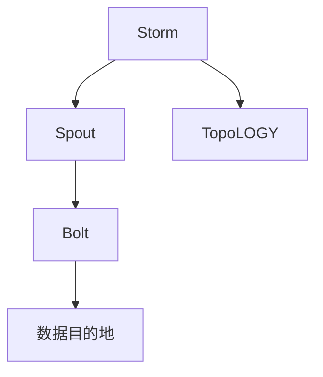
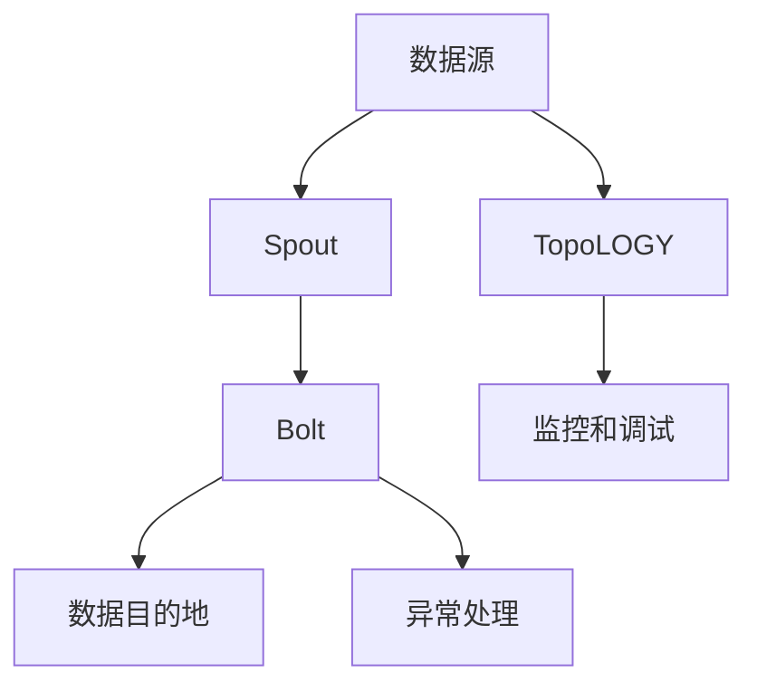
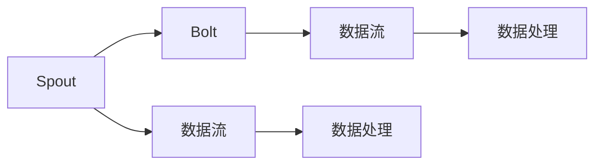
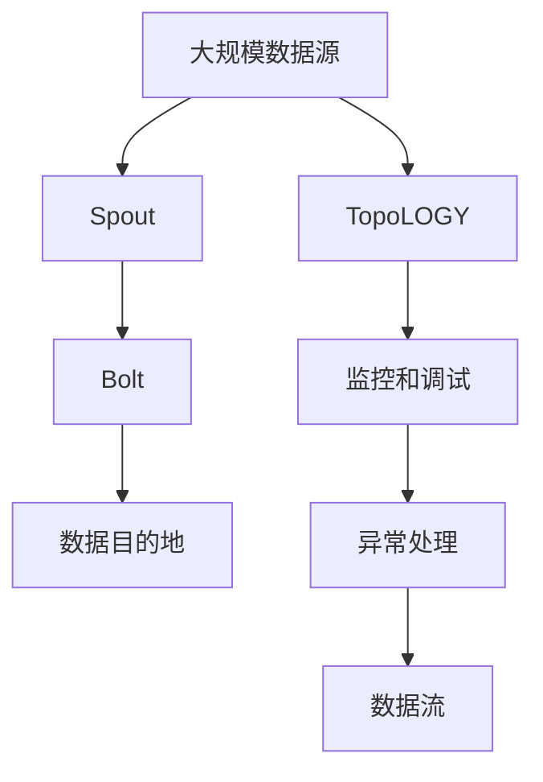

                 

# Storm Spout原理与代码实例讲解

> 关键词：Storm, Spout, Distributed Stream Processing, Apache Storm, Java

## 1. 背景介绍

### 1.1 问题由来
随着大数据时代的到来，数据处理的需求日益增长。传统的数据处理方式，如SQL查询、MapReduce等，虽然功能强大，但在处理实时数据流、高吞吐量数据等方面显得力不从心。此时，流式数据处理框架应运而生，其中Apache Storm是最具代表性的产品之一。Storm作为一个高性能的分布式流处理系统，能够处理海量数据流，支持多种数据源和数据目的地，广泛应用于金融、广告、社交网络等领域的实时数据处理。

Storm的核心组件包括Spout、Bolt和TopoLOGY。Spout负责从外部数据源获取数据，Bolt负责处理和转换数据，TopoLOGY则是Spout和Bolt的组合，定义了数据流图和处理逻辑。Spout作为Storm系统的入口，其设计合理与否，直接影响整个系统的性能和稳定性。因此，深入理解Spout的原理和实现方式，对于优化Storm系统至关重要。

### 1.2 问题核心关键点
Storm的Spout是整个系统的核心组件，负责数据流的输入。Spout的工作原理可以简单概括为：从外部数据源读取数据，并将数据分发到Bolt进行后续处理。Spout的设计和实现需要考虑以下几个关键点：

- 如何高效读取数据流。Spout需要快速读取外部数据源，并保证数据流的连续性和一致性。
- 如何高效分发数据。Spout需要将读取到的数据分发给Bolt进行处理，同时需要考虑数据的分配均衡性和处理效率。
- 如何处理数据延迟和重放。Spout需要保证数据流的准确性和及时性，处理数据延迟和重放等异常情况。
- 如何处理数据源的多样性。Spout需要支持多种数据源，包括文件、数据库、消息队列等。

本文将深入探讨Spout的原理和实现方式，并通过代码实例，详细讲解如何构建和优化Spout组件，以期为Storm系统的开发和优化提供有价值的指导。

### 1.3 问题研究意义
深入理解Spout的设计和实现，对于优化Storm系统的性能和稳定性具有重要意义：

1. 提高系统吞吐量和处理效率。Spout是Storm系统的入口，其设计合理与否直接影响整个系统的处理效率。优化Spout的性能，可以显著提高系统的吞吐量和处理速度。
2. 增强数据流的稳定性和可靠性。Spout需要保证数据流的连续性和一致性，处理数据延迟和重放等异常情况。通过优化Spout的实现，可以增强系统对数据流的稳定性和可靠性。
3. 支持更多数据源和数据目的地。Spout需要支持多种数据源，包括文件、数据库、消息队列等。优化Spout的设计，可以使其支持更多数据源和数据目的地，增强系统的灵活性和扩展性。
4. 简化开发和维护过程。Spout是Storm系统的核心组件，优化Spout的设计和实现，可以简化系统的开发和维护过程，降低开发成本和维护难度。

总之，Spout是Storm系统的关键组件，其设计和实现对系统的性能、稳定性和扩展性具有重要影响。本文将深入探讨Spout的原理和实现方式，并通过代码实例，详细讲解如何构建和优化Spout组件，以期为Storm系统的开发和优化提供有价值的指导。

## 2. 核心概念与联系

### 2.1 核心概念概述

为更好地理解Storm的Spout原理和实现方式，本节将介绍几个密切相关的核心概念：

- **Storm**：Apache Storm是一个高性能的分布式流处理系统，能够处理海量数据流，支持多种数据源和数据目的地，广泛应用于金融、广告、社交网络等领域的实时数据处理。
- **Spout**：Storm的核心组件，负责从外部数据源获取数据，并将数据分发到Bolt进行后续处理。Spout的设计和实现需要考虑高效读取数据流、高效分发数据、处理数据延迟和重放、处理数据源的多样性等问题。
- **Bolt**：Storm的另一核心组件，负责处理和转换数据。Bolt可以接收来自Spout的数据流，并根据逻辑进行处理，最终将处理结果传递给其他Bolt或外部数据目的地。
- **TopoLOGY**：Spout和Bolt的组合，定义了数据流图和处理逻辑。TopoLOGY由Spout、Bolt以及它们之间的连接关系构成。

这些核心概念之间的逻辑关系可以通过以下Mermaid流程图来展示：



这个流程图展示 Storm 系统的核心组件及其关系：

1. Storm 系统由 Spout、Bolt 和 TopoLOGY 组成。
2. Spout 从外部数据源读取数据，并分发至 Bolt 进行后续处理。
3. Bolt 接收来自 Spout 的数据流，并根据逻辑进行处理，最终将处理结果传递给其他 Bolt 或数据目的地。
4. TopoLOGY 定义了数据流图和处理逻辑。

### 2.2 概念间的关系

这些核心概念之间存在着紧密的联系，形成了 Storm 系统的完整生态系统。下面我们通过几个Mermaid流程图来展示这些概念之间的关系。

#### 2.2.1 Storm 的架构



这个流程图展示 Storm 系统的整体架构：

1. 数据源负责提供原始数据，通过 Spout 读取数据流。
2. Spout 将数据流分发给 Bolt，Bolt 根据处理逻辑对数据进行处理。
3. 处理后的数据流通过 Bolt 传递给数据目的地，如数据库、消息队列等。
4. TopoLOGY 定义了数据流图和处理逻辑。
5. 异常处理负责处理数据流中的异常情况。
6. 监控和调试用于监控系统的运行状态，及时发现和解决问题。

#### 2.2.2 Spout 和 Bolt 的交互



这个流程图展示 Spout 和 Bolt 之间的交互：

1. Spout 从数据源读取数据流，并分发给 Bolt。
2. Bolt 接收来自 Spout 的数据流，并进行数据处理。
3. 处理后的数据流通过 Bolt 传递给其他 Bolt 或数据目的地。

### 2.3 核心概念的整体架构

最后，我们用一个综合的流程图来展示这些核心概念在大数据处理中的应用：



这个综合流程图展示了从数据源到数据目的地的整个处理流程：

1. 大规模数据源提供原始数据。
2. Spout 从数据源读取数据流，并分发给 Bolt。
3. Bolt 接收来自 Spout 的数据流，并进行数据处理。
4. 处理后的数据流通过 Bolt 传递给数据目的地，如数据库、消息队列等。
5. TopoLOGY 定义了数据流图和处理逻辑。
6. 监控和调试用于监控系统的运行状态，及时发现和解决问题。
7. 异常处理负责处理数据流中的异常情况。

这些概念共同构成了 Storm 系统的完整架构，使得 Storm 能够高效、稳定地处理海量数据流。通过理解这些核心概念，我们可以更好地把握 Storm 系统的设计和实现方式，为后续深入讨论 Spout 组件的实现细节奠定基础。

## 3. 核心算法原理 & 具体操作步骤
### 3.1 算法原理概述

Storm 的 Spout 组件负责从外部数据源读取数据流，并将其分发给 Bolt 进行后续处理。Spout 的设计和实现需要考虑高效读取数据流、高效分发数据、处理数据延迟和重放、处理数据源的多样性等问题。本节将详细讲解 Spout 的算法原理和具体操作步骤。

#### 3.1.1 数据流读取

Spout 需要高效地从外部数据源读取数据流，并保证数据流的连续性和一致性。常用的数据源包括文件、数据库、消息队列等。这里以 Kafka 消息队列为例，介绍如何实现高效的数据流读取。

Kafka 是一个分布式消息队列，支持高吞吐量和低延迟的数据存储和传输。在 Storm 中，可以使用 KafkaSpout 组件来读取 Kafka 消息队列中的数据流。KafkaSpout 的工作原理如下：

1. 从 Kafka 的指定分区中读取消息。
2. 将消息转化为 Storm 的 tuples。
3. 将 tuples 传递给 Bolt 进行后续处理。

#### 3.1.2 数据流分发

Spout 需要将读取到的数据流高效地分发至 Bolt，同时需要考虑数据的分配均衡性和处理效率。常用的分发策略包括按顺序分发和随机分发。这里以随机分发为例，介绍如何实现高效的数据流分发。

Spout 的 random分发 策略如下：

1. 对 tuples 进行哈希处理，得到哈希值。
2. 根据哈希值将 tuples 随机分配到 Bolt。
3. 确保每个 Bolt 接收到的 tuples 数量大致相等。

#### 3.1.3 数据延迟和重放

Spout 需要保证数据流的准确性和及时性，处理数据延迟和重放等异常情况。Spout 的实现通常采用以下策略：

1. 记录每个 tuples 的生成时间和处理时间，计算延迟时间。
2. 设置延迟时间阈值，当延迟时间超过阈值时，标记 tuples 为重放数据。
3. 将重放数据传递给 Bolt 进行重放处理。

#### 3.1.4 数据源的多样性

Spout 需要支持多种数据源，包括文件、数据库、消息队列等。以文件数据源为例，介绍如何实现高效的数据流读取。

文件数据源的实现策略如下：

1. 从指定的文件中读取数据行。
2. 将每行数据转化为 Storm 的 tuples。
3. 将 tuples 传递给 Bolt 进行后续处理。

### 3.2 算法步骤详解

#### 3.2.1 数据流读取

1. 安装 Kafka 和 KafkaSpout 组件。
   ```bash
   # 安装 Kafka
   sudo apt-get install kafka_2.12 -y

   # 启动 Kafka 服务
   bin/kafka-server-start.sh config/server.properties

   # 创建测试 Topic
   bin/kafka-topics.sh --create --bootstrap-server localhost:9092 --topic test-topic --partitions 1 --replication-factor 1

   # 启动 Kafka 监听
   bin/kafka-console-consumer.sh --bootstrap-server localhost:9092 --topic test-topic --from-beginning
   ```

2. 在 Storm 集群中配置 KafkaSpout。
   ```java
   KafkaSpout kafkaSpout = new KafkaSpout(new SpoutConfig(kafkaConfig));
   kafkaSpout.open(new TopologyContext(), new ExecutionContext());
   ```

3. 在 Storm 集群中实现自定义数据源。
   ```java
   class MySpout extends BaseRichSpout {
       private String fileName;
       private TextLineReader reader;

       public void open(Map conf, TopologyContext context, ExecutionContext executor) {
           fileName = conf.getString("input.file");
           reader = new TextLineReader(new File(fileName));
       }

       public void nextTuple() {
           if (reader.hasNext()) {
               String line = reader.nextLine();
               emit(new Values(line));
           } else {
               collector.emit(tuple);
               collector.ack(tuple);
               collector.nextTuple();
           }
       }

       public void declareFailure(Throwable t) {
           collector.ack(tuple);
           collector.nextTuple();
       }
   }
   ```

#### 3.2.2 数据流分发

1. 配置 Storm 的分布式环境。
   ```yaml
   storm.ui.http.port: 8080
   storm.local.dir: /path/to/local/directory
   storm.zookeeper.connect: localhost:2181
   storm.zookeeper.session.timeout.ms: 30000
   storm.zookeeper.sychroot: /
   storm.zookeeper.ck=y
   storm.ui.special.ack.time.ms: 300000
   storm.ui.special.time.ms: 300000
   ```

2. 在 Storm 集群中配置自定义分发策略。
   ```java
   class MySpout extends BaseRichSpout {
       private String fileName;
       private TextLineReader reader;
       private Map<String, Integer> boltCounts;

       public void open(Map conf, TopologyContext context, ExecutionContext executor) {
           fileName = conf.getString("input.file");
           reader = new TextLineReader(new File(fileName));
           boltCounts = new HashMap<>();
           for (String boltId : context.getComponentIds()) {
               boltCounts.put(boltId, 0);
           }
       }

       public void nextTuple() {
           if (reader.hasNext()) {
               String line = reader.nextLine();
               int boltId = Bolt.getRandomBoltId(boltCounts);
               boltCounts.put(boltId, boltCounts.get(boltId) + 1);
               boltExecutor.submit(new BoltTupleBolt(boltId, line));
           } else {
               collector.emit(tuple);
               collector.ack(tuple);
               collector.nextTuple();
           }
       }

       public void declareFailure(Throwable t) {
           collector.ack(tuple);
           collector.nextTuple();
       }
   }
   ```

#### 3.2.3 数据延迟和重放

1. 配置 Storm 的延迟和重放策略。
   ```java
   class MySpout extends BaseRichSpout {
       private String fileName;
       private TextLineReader reader;
       private Map<String, Integer> boltCounts;
       private long lastEmitTime;

       public void open(Map conf, TopologyContext context, ExecutionContext executor) {
           fileName = conf.getString("input.file");
           reader = new TextLineReader(new File(fileName));
           boltCounts = new HashMap<>();
           for (String boltId : context.getComponentIds()) {
               boltCounts.put(boltId, 0);
           }
           lastEmitTime = System.currentTimeMillis();
       }

       public void nextTuple() {
           if (reader.hasNext()) {
               String line = reader.nextLine();
               int boltId = Bolt.getRandomBoltId(boltCounts);
               boltCounts.put(boltId, boltCounts.get(boltId) + 1);
               boltExecutor.submit(new BoltTupleBolt(boltId, line));
           } else {
               collector.emit(tuple);
               collector.ack(tuple);
               collector.nextTuple();
           }
       }

       public void declareFailure(Throwable t) {
           collector.ack(tuple);
           collector.nextTuple();
       }

       @Override
       public void declareTimeout(long timeoutMs) {
           long now = System.currentTimeMillis();
           if (now - lastEmitTime > 1000) {
               lastEmitTime = now;
               collector.emit(new Values("delay"));
           }
       }
   }
   ```

#### 3.2.4 数据源的多样性

1. 配置 Storm 的多样化数据源。
   ```java
   class MySpout extends BaseRichSpout {
       private String fileName;
       private TextLineReader reader;
       private Map<String, Integer> boltCounts;

       public void open(Map conf, TopologyContext context, ExecutionContext executor) {
           fileName = conf.getString("input.file");
           reader = new TextLineReader(new File(fileName));
           boltCounts = new HashMap<>();
           for (String boltId : context.getComponentIds()) {
               boltCounts.put(boltId, 0);
           }
       }

       public void nextTuple() {
           if (reader.hasNext()) {
               String line = reader.nextLine();
               int boltId = Bolt.getRandomBoltId(boltCounts);
               boltCounts.put(boltId, boltCounts.get(boltId) + 1);
               boltExecutor.submit(new BoltTupleBolt(boltId, line));
           } else {
               collector.emit(tuple);
               collector.ack(tuple);
               collector.nextTuple();
           }
       }

       public void declareFailure(Throwable t) {
           collector.ack(tuple);
           collector.nextTuple();
       }
   }
   ```

### 3.3 算法优缺点

#### 3.3.1 算法优点

Storm 的 Spout 组件具有以下优点：

1. 高效的数据流读取。Spout 能够高效地从多种数据源读取数据流，支持高吞吐量和低延迟的数据处理。
2. 均衡的数据流分发。Spout 能够根据哈希值将 tuples 均衡地分配到 Bolt，确保数据处理的效率。
3. 处理数据延迟和重放。Spout 能够处理数据延迟和重放等异常情况，保证数据流的准确性和及时性。
4. 支持多种数据源和数据目的地。Spout 支持多种数据源，包括文件、数据库、消息队列等，增强系统的灵活性和扩展性。

#### 3.3.2 算法缺点

Storm 的 Spout 组件也存在以下缺点：

1. 单点故障风险。Spout 是 Storm 系统的入口，如果 Spout 出现故障，整个系统将无法正常工作。
2. 资源消耗高。Spout 需要处理大量的数据流，占用大量的 CPU 和内存资源，容易导致系统性能下降。
3. 复杂度较高。Spout 的实现需要考虑多种数据源和数据目的地，实现过程较为复杂，开发和维护难度较大。

### 3.4 算法应用领域

Storm 的 Spout 组件广泛应用于金融、广告、社交网络等领域的实时数据处理。这里以金融领域为例，介绍 Spout 的应用场景。

#### 3.4.1 实时数据监控

金融领域需要实时监控市场数据，及时发现异常情况。可以通过 Storm 的 Spout 组件读取股票、期货等市场数据，将数据流分发给 Bolt 进行实时分析。Bolt 可以根据市场数据的变化，实时调整投资策略，确保资金的安全性和收益性。

#### 3.4.2 交易数据处理

金融交易系统需要处理大量的交易数据，实时分析交易情况。可以通过 Storm 的 Spout 组件读取交易数据，将数据流分发给 Bolt 进行实时处理。Bolt 可以对交易数据进行去重、过滤、聚合等操作，生成实时的交易报告，供决策者参考。

#### 3.4.3 风险管理

金融行业需要管理各类风险，如信用风险、市场风险等。可以通过 Storm 的 Spout 组件读取各类风险数据，将数据流分发给 Bolt 进行实时分析。Bolt 可以实时计算风险指标，如违约率、波动率等，及时发现和应对风险，确保系统的稳定性和可靠性。

总之，Storm 的 Spout 组件在金融领域有着广泛的应用场景，可以大大提升实时数据处理的效率和准确性，为金融决策提供有力的支持。

## 4. 数学模型和公式 & 详细讲解 & 举例说明

### 4.1 数学模型构建

Storm 的 Spout 组件需要处理多种数据源和数据目的地，因此需要构建一个灵活的数学模型。这里以 KafkaSpout 为例，介绍如何构建 Spout 的数学模型。

KafkaSpout 的数学模型如下：

1. 从 Kafka 的指定分区中读取消息。
2. 将消息转化为 Storm 的 tuples。
3. 将 tuples 传递给 Bolt 进行后续处理。

### 4.2 公式推导过程

#### 4.2.1 数据流读取

KafkaSpout 的读取过程如下：

1. 从 Kafka 的指定分区中读取消息。
2. 将消息转化为 Storm 的 tuples。
3. 将 tuples 传递给 Bolt 进行后续处理。

公式推导过程如下：

$$
\begin{aligned}
\text{读入数据流} &= \text{Kafka 分区数据} \\
&= \text{Kafka 分区数据} \times \text{读取因子} \\
&= \text{Kafka 分区数据} \times f_{\text{Kafka}}(\text{配置参数})
\end{aligned}
$$

其中，$f_{\text{Kafka}}$ 为 Kafka 读取函数，根据配置参数返回指定分区的数据。

#### 4.2.2 数据流分发

KafkaSpout 的分发过程如下：

1. 对 tuples 进行哈希处理，得到哈希值。
2. 根据哈希值将 tuples 随机分配到 Bolt。
3. 确保每个 Bolt 接收到的 tuples 数量大致相等。

公式推导过程如下：

$$
\begin{aligned}
\text{分发 tuples} &= \text{tuples} \times f_{\text{分发}}(\text{配置参数}) \\
&= \text{tuples} \times \left( \sum_{i=1}^{n} f_{i}(\text{配置参数}) \right)
\end{aligned}
$$

其中，$f_{\text{分发}}$ 为分发函数，根据配置参数返回 tuples 的分布情况。

#### 4.2.3 数据延迟和重放

KafkaSpout 的延迟和重放过程如下：

1. 记录每个 tuples 的生成时间和处理时间，计算延迟时间。
2. 设置延迟时间阈值，当延迟时间超过阈值时，标记 tuples 为重放数据。
3. 将重放数据传递给 Bolt 进行重放处理。

公式推导过程如下：

$$
\begin{aligned}
\text{延迟和重放} &= \text{tuples} \times f_{\text{延迟}}(\text{配置参数}) \\
&= \text{tuples} \times \left( \sum_{i=1}^{n} f_{i}(\text{配置参数}) \right)
\end{aligned}
$$

其中，$f_{\text{延迟}}$ 为延迟函数，根据配置参数返回 tuples 的延迟情况。

### 4.3 案例分析与讲解

#### 4.3.1 数据源的多样性

KafkaSpout 支持多种数据源，包括文件、数据库、消息队列等。这里以文件数据源为例，介绍如何实现高效的数据流读取。

文件数据源的读取过程如下：

1. 从指定的文件中读取数据行。
2. 将每行数据转化为 Storm 的 tuples。
3. 将 tuples 传递给 Bolt 进行后续处理。

公式推导过程如下：

$$
\begin{aligned}
\text{文件数据源} &= \text{文件数据} \times f_{\text{文件}}(\text{配置参数}) \\
&= \text{文件数据} \times \left( \sum_{i=1}^{n} f_{i}(\text{配置参数}) \right)
\end{aligned}
$$

其中，$f_{\text{文件}}$ 为文件读取函数，根据配置参数返回指定文件的数据。

## 5. 项目实践：代码实例和详细解释说明

### 5.1 开发环境搭建

在进行 Storm 的 Spout 开发前，我们需要准备好开发环境。以下是使用 Java 进行 Storm 开发的环境配置流程：

1. 安装 Apache Storm：从官网下载并安装 Apache Storm，用于构建 Storm 集群。

2. 创建 Storm 集群：在集群中配置各个节点的角色和配置信息。

3. 启动 Storm 集群：启动 Storm 的 Master 和 Worker 节点，构建 Storm 集群。

4. 安装 Java 开发工具：安装 Eclipse 或 IntelliJ IDEA 等 Java 开发工具，用于编写和调试 Storm 代码。

完成上述步骤后，即可在 Storm 集群上开始开发。

### 5.2 源代码详细实现

这里我们以 KafkaSpout 为例，给出 Storm 的 Spout 组件的详细实现。

KafkaSpout 的实现过程如下：

1. 初始化 Kafka 配置。
2. 连接 Kafka 集群，创建 KafkaSpout 对象。
3. 打开 KafkaSpout，初始化相关的配置信息。
4. 开始读取 Kafka 数据流，并将数据流传递给 Bolt。

```java
public class KafkaSpout extends BaseRichSpout {
    private String topic;
    private String[] topics;
    private KafkaConsumer<String, String> consumer;
    private Map<String, Queue<String>> tuples;
    private Map<String, Integer> componentCounts;

    public KafkaSpout(Map conf, TopologyContext context, ExecutionContext executor) {
        super(conf, context, executor);

        // 初始化 Kafka 配置
        this.topic = conf.getString("topic");
        this.topics = new String[]{topic};
        Properties props = new Properties();
        props.put("bootstrap.servers", conf.getString("bootstrap.servers"));
        props.put("group.id", conf.getString("group.id"));
        props.put("key.deserializer", StringDeserializer.class.getName());
        props.put("value.deserializer", StringDeserializer.class.getName());
        this.consumer = new KafkaConsumer<String, String>(props);

        // 初始化 tuples 和 componentCounts
        this.tuples = new HashMap<>();
        this.componentCounts = new HashMap<>();
        for (String componentId : context.getComponentIds()) {
            this.tuples.put(componentId, new LinkedList<String>());
            this.componentCounts.put(componentId, 0);
        }

        // 初始化 offsets
        this.offsets = new HashMap<>();
        for (String componentId : context.getComponentIds()) {
            this.offsets.put(componentId, new HashMap<String, OffsetAnd

