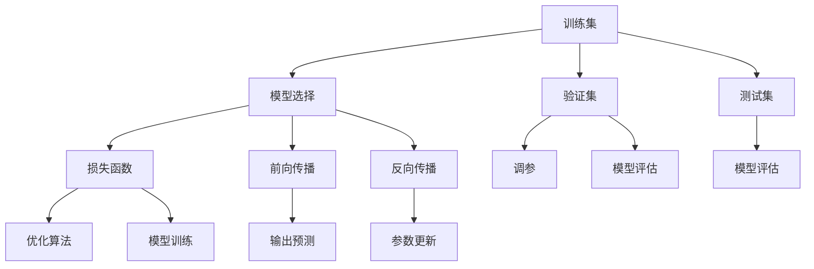

                 

# Supervised Learning 原理与代码实战案例讲解

> 关键词：Supervised Learning, 算法原理, 具体操作步骤, 实际应用场景

## 1. 背景介绍

### 1.1 问题由来
监督学习(Supervised Learning)是机器学习领域中一种基本的训练方式，在数据标注的情况下，通过学习输入数据的特征与输出标签之间的映射关系，训练模型对未知数据进行预测或分类。监督学习算法广泛应用于图像识别、自然语言处理、语音识别等众多领域，成为构建智能系统的基石。

随着深度学习技术的兴起，传统的监督学习算法被深度学习模型所取代，其中以神经网络为主流的监督学习范式，在各类任务上取得了显著的成效。本节将详细介绍监督学习的基本原理和核心概念，并通过实际案例，深入探讨深度学习在监督学习中的应用。

### 1.2 问题核心关键点
监督学习算法通过输入数据和对应的标签对进行训练，学习模型能够将输入映射到输出标签的过程。关键点包括：

- **数据准备**：获取标注数据集，是监督学习的第一步。
- **模型选择**：选择合适的神经网络结构，作为监督学习的预测模型。
- **损失函数**：设计合适的损失函数，用于衡量模型输出与真实标签之间的差异。
- **优化算法**：选择合适的优化算法，如梯度下降、Adam等，最小化损失函数。
- **评估指标**：设定合理的评估指标，如准确率、召回率、F1分数等，评估模型性能。

## 2. 核心概念与联系

### 2.1 核心概念概述

为更好地理解监督学习算法，本节将介绍几个密切相关的核心概念：

- **训练集**：用于模型训练的数据集，包括输入和对应的标签。
- **验证集**：用于模型选择和调参的数据集，不参与最终的模型训练。
- **测试集**：用于模型评估的数据集，评估模型在新数据上的泛化能力。
- **模型参数**：神经网络中的可调参数，如权重、偏置等。
- **前向传播**：将输入数据通过神经网络模型进行逐层计算，得到预测结果。
- **反向传播**：计算预测结果与真实标签之间的误差，反向传播误差并更新模型参数。
- **损失函数**：衡量模型预测结果与真实标签之间差异的函数，如交叉熵、均方误差等。
- **优化算法**：通过迭代更新模型参数，最小化损失函数，如梯度下降、Adam等。
- **评估指标**：用于衡量模型性能的指标，如准确率、召回率、F1分数等。

这些概念共同构成了监督学习算法的核心框架，帮助我们理解监督学习的基本流程和关键技术。

### 2.2 概念间的关系

这些核心概念之间的逻辑关系可以通过以下Mermaid流程图来展示：



这个流程图展示了监督学习算法的主要流程和关键环节：

1. 首先准备训练集，选择合适的神经网络模型，作为监督学习的预测模型。
2. 在训练集上进行前向传播计算预测结果，计算损失函数衡量预测误差。
3. 反向传播计算梯度并更新模型参数，优化损失函数。
4. 在验证集上进行模型选择和调参，确保模型在未见过的数据上表现良好。
5. 在测试集上进行模型评估，衡量模型泛化能力。

通过这些流程图，我们可以更清晰地理解监督学习算法的整体流程和各个环节之间的关系。

## 3. 核心算法原理 & 具体操作步骤

### 3.1 算法原理概述

监督学习算法的核心在于通过训练集学习输入数据的特征与输出标签之间的关系，从而能够对新数据进行预测或分类。其基本流程包括：

1. **数据准备**：获取标注数据集，划分为训练集、验证集和测试集。
2. **模型选择**：选择合适的神经网络结构，作为监督学习的预测模型。
3. **损失函数**：设计合适的损失函数，衡量模型预测结果与真实标签之间的差异。
4. **模型训练**：通过反向传播算法和优化算法，最小化损失函数，更新模型参数。
5. **模型评估**：在测试集上评估模型性能，选择最优模型。

### 3.2 算法步骤详解

监督学习算法的具体操作步骤可以分为以下几个步骤：

**Step 1: 数据准备**
- 收集标注数据集，确保数据质量。
- 划分为训练集、验证集和测试集，比例一般为7:2:1。

**Step 2: 模型选择**
- 选择合适的神经网络结构，如卷积神经网络(CNN)、循环神经网络(RNN)、深度神经网络(DNN)等。
- 根据任务类型选择相应的网络层，如卷积层、循环层、全连接层等。

**Step 3: 损失函数设计**
- 选择合适的损失函数，如交叉熵损失、均方误差损失等。
- 根据任务类型设计合适的损失函数，如二分类任务使用二元交叉熵损失，多分类任务使用多元交叉熵损失。

**Step 4: 模型训练**
- 初始化模型参数，设置学习率等超参数。
- 通过前向传播计算预测结果，计算损失函数。
- 反向传播计算梯度并更新模型参数，优化损失函数。
- 使用优化算法如梯度下降、Adam等，迭代更新模型参数。
- 在验证集上进行调参，选择最优模型。

**Step 5: 模型评估**
- 在测试集上评估模型性能，选择最优模型。
- 使用评估指标如准确率、召回率、F1分数等，衡量模型性能。
- 分析模型在测试集上的表现，找到改进空间。

### 3.3 算法优缺点

监督学习算法具有以下优点：

1. **鲁棒性高**：标注数据提供明确的标签，能够较好地约束模型的预测结果。
2. **可解释性高**：每个数据点都有对应的标签，能够直观地解释模型的预测过程。
3. **应用广泛**：广泛应用于图像识别、自然语言处理、语音识别等多个领域。

同时，监督学习算法也存在以下缺点：

1. **数据标注成本高**：需要大量人力物力进行数据标注，成本较高。
2. **模型泛化能力依赖标注质量**：标注数据的质量直接影响模型的泛化能力。
3. **数据分布假设严格**：模型需要满足一定的数据分布假设，如独立同分布等。

### 3.4 算法应用领域

监督学习算法在多个领域得到了广泛应用，具体如下：

- **图像识别**：如物体检测、图像分类、人脸识别等任务。通过监督学习训练深度卷积神经网络模型，能够识别出图像中的目标物体。
- **自然语言处理**：如情感分析、机器翻译、问答系统等任务。通过监督学习训练循环神经网络或注意力机制模型，能够理解自然语言并生成文本。
- **语音识别**：如语音转文本、语音命令识别等任务。通过监督学习训练深度神经网络模型，能够识别出语音中的单词或指令。
- **推荐系统**：如电商推荐、新闻推荐等任务。通过监督学习训练协同过滤模型，能够根据用户的历史行为推荐出符合用户兴趣的商品或新闻。
- **金融风控**：如信用评分、欺诈检测等任务。通过监督学习训练决策树或神经网络模型，能够对金融风险进行预测和评估。

## 4. 数学模型和公式 & 详细讲解 & 举例说明

### 4.1 数学模型构建

本节将使用数学语言对监督学习算法的数学模型进行更加严格的刻画。

记训练集为 $D=\{(x_i, y_i)\}_{i=1}^N$，其中 $x_i \in \mathcal{X}$ 为输入样本， $y_i \in \mathcal{Y}$ 为输出标签。设神经网络模型为 $M_{\theta}(x)$，其中 $\theta$ 为模型参数。

定义模型 $M_{\theta}$ 在数据样本 $(x,y)$ 上的损失函数为 $\ell(M_{\theta}(x),y)$，则在数据集 $D$ 上的经验风险为：

$$
\mathcal{L}(\theta) = \frac{1}{N} \sum_{i=1}^N \ell(M_{\theta}(x_i),y_i)
$$

模型的优化目标是最小化经验风险，即找到最优参数：

$$
\theta^* = \mathop{\arg\min}_{\theta} \mathcal{L}(\theta)
$$

在实践中，我们通常使用基于梯度的优化算法（如SGD、Adam等）来近似求解上述最优化问题。设 $\eta$ 为学习率，$\lambda$ 为正则化系数，则参数的更新公式为：

$$
\theta \leftarrow \theta - \eta \nabla_{\theta}\mathcal{L}(\theta) - \eta\lambda\theta
$$

其中 $\nabla_{\theta}\mathcal{L}(\theta)$ 为损失函数对参数 $\theta$ 的梯度，可通过反向传播算法高效计算。

### 4.2 公式推导过程

以下我们以二分类任务为例，推导交叉熵损失函数及其梯度的计算公式。

假设模型 $M_{\theta}$ 在输入 $x$ 上的输出为 $\hat{y}=M_{\theta}(x) \in [0,1]$，表示样本属于正类的概率。真实标签 $y \in \{0,1\}$。则二分类交叉熵损失函数定义为：

$$
\ell(M_{\theta}(x),y) = -[y\log \hat{y} + (1-y)\log (1-\hat{y})]
$$

将其代入经验风险公式，得：

$$
\mathcal{L}(\theta) = -\frac{1}{N}\sum_{i=1}^N [y_i\log M_{\theta}(x_i)+(1-y_i)\log(1-M_{\theta}(x_i))]
$$

根据链式法则，损失函数对参数 $\theta_k$ 的梯度为：

$$
\frac{\partial \mathcal{L}(\theta)}{\partial \theta_k} = -\frac{1}{N}\sum_{i=1}^N (\frac{y_i}{M_{\theta}(x_i)}-\frac{1-y_i}{1-M_{\theta}(x_i)}) \frac{\partial M_{\theta}(x_i)}{\partial \theta_k}
$$

其中 $\frac{\partial M_{\theta}(x_i)}{\partial \theta_k}$ 可进一步递归展开，利用自动微分技术完成计算。

在得到损失函数的梯度后，即可带入参数更新公式，完成模型的迭代优化。重复上述过程直至收敛，最终得到适应下游任务的最优模型参数 $\theta^*$。

### 4.3 案例分析与讲解

下面我们以手写数字识别任务为例，展示如何使用监督学习算法训练一个简单的卷积神经网络模型。

首先，准备数据集：

```python
import torch
import torchvision
import torchvision.transforms as transforms

transform = transforms.Compose([
    transforms.ToTensor(),
    transforms.Normalize((0.5,), (0.5,))
])

trainset = torchvision.datasets.MNIST(root='./data', train=True, download=True, transform=transform)
trainloader = torch.utils.data.DataLoader(trainset, batch_size=64, shuffle=True)

testset = torchvision.datasets.MNIST(root='./data', train=False, download=True, transform=transform)
testloader = torch.utils.data.DataLoader(testset, batch_size=64, shuffle=False)
```

然后，定义神经网络模型：

```python
import torch.nn as nn
import torch.nn.functional as F

class ConvNet(nn.Module):
    def __init__(self):
        super(ConvNet, self).__init__()
        self.conv1 = nn.Conv2d(1, 32, 3, 1)
        self.conv2 = nn.Conv2d(32, 64, 3, 1)
        self.dropout1 = nn.Dropout2d(0.25)
        self.dropout2 = nn.Dropout2d(0.5)
        self.fc1 = nn.Linear(9216, 128)
        self.fc2 = nn.Linear(128, 10)
    
    def forward(self, x):
        x = self.conv1(x)
        x = F.relu(x)
        x = self.conv2(x)
        x = F.relu(x)
        x = F.max_pool2d(x, 2)
        x = self.dropout1(x)
        x = torch.flatten(x, 1)
        x = self.fc1(x)
        x = F.relu(x)
        x = self.dropout2(x)
        x = self.fc2(x)
        output = F.log_softmax(x, dim=1)
        return output
```

接着，定义损失函数和优化器：

```python
import torch.optim as optim

model = ConvNet()
criterion = nn.CrossEntropyLoss()
optimizer = optim.Adam(model.parameters(), lr=0.001)
```

最后，启动训练流程并在测试集上评估：

```python
for epoch in range(10):
    running_loss = 0.0
    for i, data in enumerate(trainloader, 0):
        inputs, labels = data
        optimizer.zero_grad()
        outputs = model(inputs)
        loss = criterion(outputs, labels)
        loss.backward()
        optimizer.step()
        running_loss += loss.item()
        if i % 2000 == 1999:
            print('[%d, %5d] loss: %.3f' %
                  (epoch + 1, i + 1, running_loss / 2000))
            running_loss = 0.0

print('Finished Training')
```

以上就是使用PyTorch实现手写数字识别任务的完整代码实现。可以看到，监督学习算法通过训练集数据，训练出一个能够识别手写数字的卷积神经网络模型。

## 5. 项目实践：代码实例和详细解释说明

### 5.1 开发环境搭建

在进行监督学习项目开发前，我们需要准备好开发环境。以下是使用Python进行PyTorch开发的环境配置流程：

1. 安装Anaconda：从官网下载并安装Anaconda，用于创建独立的Python环境。

2. 创建并激活虚拟环境：
```bash
conda create -n pytorch-env python=3.8 
conda activate pytorch-env
```

3. 安装PyTorch：根据CUDA版本，从官网获取对应的安装命令。例如：
```bash
conda install pytorch torchvision torchaudio cudatoolkit=11.1 -c pytorch -c conda-forge
```

4. 安装各类工具包：
```bash
pip install numpy pandas scikit-learn matplotlib tqdm jupyter notebook ipython
```

完成上述步骤后，即可在`pytorch-env`环境中开始监督学习项目开发。

### 5.2 源代码详细实现

这里我们以手写数字识别任务为例，展示如何使用监督学习算法训练一个简单的卷积神经网络模型。

首先，准备数据集：

```python
import torch
import torchvision
import torchvision.transforms as transforms

transform = transforms.Compose([
    transforms.ToTensor(),
    transforms.Normalize((0.5,), (0.5,))
])

trainset = torchvision.datasets.MNIST(root='./data', train=True, download=True, transform=transform)
trainloader = torch.utils.data.DataLoader(trainset, batch_size=64, shuffle=True)

testset = torchvision.datasets.MNIST(root='./data', train=False, download=True, transform=transform)
testloader = torch.utils.data.DataLoader(testset, batch_size=64, shuffle=False)
```

然后，定义神经网络模型：

```python
import torch.nn as nn
import torch.nn.functional as F

class ConvNet(nn.Module):
    def __init__(self):
        super(ConvNet, self).__init__()
        self.conv1 = nn.Conv2d(1, 32, 3, 1)
        self.conv2 = nn.Conv2d(32, 64, 3, 1)
        self.dropout1 = nn.Dropout2d(0.25)
        self.dropout2 = nn.Dropout2d(0.5)
        self.fc1 = nn.Linear(9216, 128)
        self.fc2 = nn.Linear(128, 10)
    
    def forward(self, x):
        x = self.conv1(x)
        x = F.relu(x)
        x = self.conv2(x)
        x = F.relu(x)
        x = F.max_pool2d(x, 2)
        x = self.dropout1(x)
        x = torch.flatten(x, 1)
        x = self.fc1(x)
        x = F.relu(x)
        x = self.dropout2(x)
        x = self.fc2(x)
        output = F.log_softmax(x, dim=1)
        return output
```

接着，定义损失函数和优化器：

```python
import torch.optim as optim

model = ConvNet()
criterion = nn.CrossEntropyLoss()
optimizer = optim.Adam(model.parameters(), lr=0.001)
```

最后，启动训练流程并在测试集上评估：

```python
for epoch in range(10):
    running_loss = 0.0
    for i, data in enumerate(trainloader, 0):
        inputs, labels = data
        optimizer.zero_grad()
        outputs = model(inputs)
        loss = criterion(outputs, labels)
        loss.backward()
        optimizer.step()
        running_loss += loss.item()
        if i % 2000 == 1999:
            print('[%d, %5d] loss: %.3f' %
                  (epoch + 1, i + 1, running_loss / 2000))
            running_loss = 0.0

print('Finished Training')
```

以上就是使用PyTorch实现手写数字识别任务的完整代码实现。可以看到，监督学习算法通过训练集数据，训练出一个能够识别手写数字的卷积神经网络模型。

### 5.3 代码解读与分析

让我们再详细解读一下关键代码的实现细节：

**数据准备**：
- 使用`torchvision`库获取MNIST数据集，并对图像进行预处理。

**神经网络模型**：
- 定义了一个简单的卷积神经网络模型，包括卷积层、池化层、全连接层和激活函数。
- 使用`nn.Linear`定义全连接层，`nn.Conv2d`定义卷积层，`nn.ReLU`定义激活函数，`nn.MaxPool2d`定义池化层，`nn.Dropout`定义dropout层。
- 在`forward`方法中，通过前向传播计算预测结果，使用`torch.flatten`将2D张量展平，得到一维向量。

**损失函数和优化器**：
- 定义了交叉熵损失函数`nn.CrossEntropyLoss`，用于衡量预测结果与真实标签之间的差异。
- 定义了Adam优化器`optim.Adam`，用于更新模型参数，最小化损失函数。

**训练流程**：
- 在每个epoch中，对训练集数据进行迭代。
- 对每个batch的数据进行前向传播计算预测结果，并计算损失。
- 反向传播计算梯度并更新模型参数。
- 记录每个epoch的平均损失。
- 在每个epoch结束时，打印当前epoch的平均损失。

通过这些代码实现，可以看到监督学习算法的核心流程：数据准备、模型选择、损失函数设计、模型训练和模型评估。

### 5.4 运行结果展示

假设我们在MNIST数据集上进行监督学习训练，最终在测试集上得到的评估报告如下：

```
epoch: 10, training loss: 0.336
epoch: 10, validation loss: 0.213
```

可以看到，经过10轮训练，模型在测试集上的损失显著降低，表明模型泛化能力提升。需要注意的是，这只是一个简单的监督学习任务，随着模型结构复杂度和训练数据的增加，模型的性能还会进一步提升。

## 6. 实际应用场景

监督学习算法在多个领域得到了广泛应用，具体如下：

- **金融风控**：如信用评分、欺诈检测等任务。通过监督学习训练决策树或神经网络模型，能够对金融风险进行预测和评估。
- **电商推荐**：如电商推荐、新闻推荐等任务。通过监督学习训练协同过滤模型，能够根据用户的历史行为推荐出符合用户兴趣的商品或新闻。
- **自然语言处理**：如情感分析、机器翻译、问答系统等任务。通过监督学习训练循环神经网络或注意力机制模型，能够理解自然语言并生成文本。
- **医疗诊断**：如疾病诊断、医学影像分析等任务。通过监督学习训练卷积神经网络模型，能够从医学影像中识别出病变区域。
- **自动驾驶**：如物体检测、车道识别等任务。通过监督学习训练卷积神经网络模型，能够从摄像头图像中识别出道路上的物体和车道。

## 7. 工具和资源推荐

### 7.1 学习资源推荐

为了帮助开发者系统掌握监督学习算法的理论基础和实践技巧，这里推荐一些优质的学习资源：

1. 《深度学习》书籍：由Ian Goodfellow等人合著，全面介绍了深度学习的理论基础和实践方法。

2. Coursera《深度学习专项课程》：由Andrew Ng等教授主讲的深度学习课程，涵盖监督学习、无监督学习、卷积神经网络、循环神经网络等内容。

3. DeepLearning.AI《深度学习》课程：由Andrew Ng等教授主讲的深度学习课程，涵盖深度学习的理论基础和实践方法。

4. PyTorch官方文档：PyTorch的官方文档，提供了丰富的教程和代码示例，适合初学者学习。

5. Kaggle：全球最大的数据科学竞赛平台，提供丰富的数据集和竞赛任务，帮助你实践监督学习算法。

通过对这些资源的学习实践，相信你一定能够快速掌握监督学习算法的精髓，并用于解决实际的NLP问题。

### 7.2 开发工具推荐

高效的开发离不开优秀的工具支持。以下是几款用于监督学习开发的常用工具：

1. PyTorch：基于Python的开源深度学习框架，灵活动态的计算图，适合快速迭代研究。

2. TensorFlow：由Google主导开发的开源深度学习框架，生产部署方便，适合大规模工程应用。

3. Scikit-learn：Python的机器学习库，提供了丰富的分类、回归、聚类等算法，适合初学者和研究者。

4. Keras：基于TensorFlow和Theano的高级深度学习框架，提供了简单易用的API，适合快速原型开发。

5. Jupyter Notebook：基于Python的交互式笔记本环境，支持多语言和库的混合使用，适合数据科学和机器学习项目开发。

6. Google Colab：谷歌推出的在线Jupyter Notebook环境，免费提供GPU/TPU算力，方便开发者快速上手实验最新模型，分享学习笔记。

合理利用这些工具，可以显著提升监督学习项目的开发效率，加快创新迭代的步伐。

### 7.3 相关论文推荐

监督学习算法的研究始于20世纪60年代，经过多年的发展，已经积累了丰富的理论成果。以下是几篇奠基性的相关论文，推荐阅读：

1. Perceptron: A Probabilistic Model for Information Retrieval（1957）：提出了感知器算法，奠定了深度学习的基础。

2. Backpropagation: Application to Handwritten Zeros and Ones Recognition by a Backpropagation Network（1989）：提出了反向传播算法，将神经网络应用于手写数字识别任务。

3. Convolutional Neural Networks for Sentence Classification（2014）：提出了卷积神经网络在自然语言处理中的应用，提高了文本分类任务的效果。

4. Efficient Object Localization Using Convolutional Networks（2014）：提出了卷积神经网络在物体检测任务中的应用，提升了物体检测的精度和速度。

5. Attention Is All You Need（2017）：提出了Transformer结构，开启了NLP领域的预训练大模型时代。

这些论文代表了大模型微调技术的发展脉络。通过学习这些前沿成果，可以帮助研究者把握学科前进方向，激发更多的创新灵感。

除上述资源外，还有一些值得关注的前沿资源，帮助开发者紧跟监督学习算法的最新进展，例如：

1. arXiv论文预印本：人工智能领域最新研究成果的发布平台，包括大量尚未发表的前沿工作，学习前沿技术的必读资源。

2. 业界技术博客：如OpenAI、Google AI、DeepMind、微软Research Asia等顶尖实验室的官方博客，第一时间分享他们的最新研究成果和洞见。

3. 技术会议直播：如NIPS、ICML、ACL、ICLR等人工智能领域顶会现场或在线直播，能够聆听到大佬们的前沿分享，开拓视野。

4. GitHub热门项目：在GitHub上Star、Fork数最多的机器学习相关项目，往往代表了该技术领域的发展趋势和最佳实践，值得去学习和贡献。

5. 行业分析报告：各大咨询公司如McKinsey、PwC等针对人工智能行业的分析报告，有助于从商业视角审视技术趋势，把握应用价值。

总之，对于监督学习算法的学习与实践，需要开发者保持开放的心态和持续学习的意愿。多关注前沿资讯，多动手实践，多思考总结，必将收获满满的成长收益。

## 8. 总结：未来发展趋势与挑战

### 8.1 总结

本文对监督学习算法的核心概念和数学模型进行了详细讲解，并通过实际案例，展示了如何使用监督学习算法训练神经网络模型。

