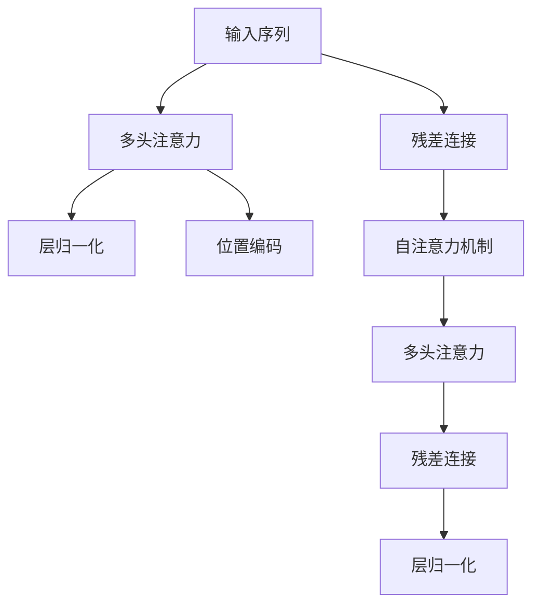
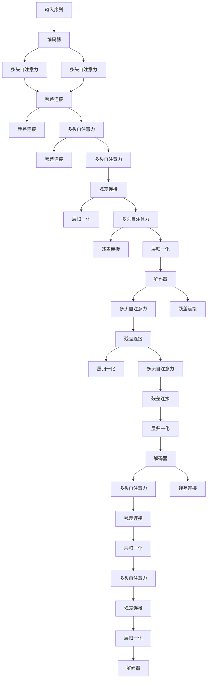

                 

# Transformer 的出现：改变计算范式的 GPT 系列

> 关键词：Transformer, GPT系列, 自回归模型, 自编码模型, 注意力机制, 预训练, 微调

## 1. 背景介绍

### 1.1 问题由来
随着深度学习技术的飞速发展，NLP领域迎来了新的突破，大规模预训练语言模型应运而生。预训练语言模型通过在大规模无标签文本数据上进行自监督学习，学习到了丰富的语言知识，能够显著提升在各种下游任务上的表现。然而，传统的自回归模型和自编码模型在数据并行处理上存在瓶颈，无法高效地处理大规模文本数据。

### 1.2 问题核心关键点
Transformer的诞生，彻底改变了NLP领域的计算范式。它通过引入注意力机制，可以并行处理长序列数据，极大提升了模型训练和推理的效率，并在多个任务上刷新了最新的性能记录。Transformer模型基于自注意力机制，通过计算输入序列中不同位置之间的主观依赖关系，实现对输入序列的高效处理。

Transformer模型通过将输入序列和输出序列都看作自回归序列，能够更好地捕捉上下文信息，并在训练时利用上下文信息进行目标位置预测。这种自回归性质使得Transformer模型在生成式任务（如文本生成、对话生成等）中表现尤为出色。

### 1.3 问题研究意义
Transformer的出现，极大地推动了NLP领域的发展，打开了大规模预训练语言模型的应用新篇章。它不仅提升了模型在各种下游任务上的性能，还为深度学习模型的并行计算提供了新的解决方案。Transformer模型及其衍生产品（如GPT系列）已经在文本生成、机器翻译、问答系统、对话系统等多个领域取得了显著的成果，展示了其强大的语言处理能力。

本文将深入探讨Transformer模型的原理与应用，重点分析GPT系列模型的特点与优势，揭示其在NLP领域的巨大潜力。

## 2. 核心概念与联系

### 2.1 核心概念概述

Transformer模型的核心概念包括自注意力机制、多头注意力、位置编码、残差连接和层归一化等。其中，自注意力机制是Transformer模型的关键，使得模型能够高效地并行处理长序列数据。

- 自注意力机制：Transformer通过计算输入序列中不同位置之间的相似度，动态地生成一组权重，用于加权求和计算每个位置的表示。这种机制使得模型可以自适应地关注输入序列中不同位置的信息，从而更好地捕捉长距离依赖关系。

- 多头注意力：Transformer模型在计算自注意力时，并行计算多个不同关注点的信息，从而更好地捕捉输入序列的多层次语义信息。

- 位置编码：Transformer模型在计算自注意力时，引入位置编码，以处理位置信息，使得模型能够正确地理解输入序列中不同位置的信息。

- 残差连接：Transformer模型在各个层之间引入残差连接，帮助模型更好地学习到长距离依赖关系。

- 层归一化：Transformer模型在各个层之间引入归一化操作，使得模型能够更好地处理输入序列中的梯度消失和梯度爆炸问题。

### 2.2 概念间的关系

Transformer模型通过这些核心概念的有机结合，实现了对输入序列的高效处理。以下是几个核心概念之间的关系，通过Mermaid流程图展示：



这个流程图展示了Transformer模型中各个组件之间的连接关系。输入序列先经过残差连接和层归一化，然后计算多头注意力，其中位置编码和自注意力机制共同作用，生成表示序列中不同位置信息的权重。最后，经过层归一化和残差连接，输出表示序列中各个位置的上下文信息。

### 2.3 核心概念的整体架构

Transformer模型由多个编码器-解码器对组成，其中编码器用于处理输入序列，解码器用于生成输出序列。以下是Transformer模型整体的架构图：



这个架构图展示了Transformer模型中编码器和解码器的结构。编码器由多个层组成，每一层都由残差连接、层归一化和多头自注意力构成。解码器与编码器类似，但引入了注意力机制，用于生成输出序列。

## 3. 核心算法原理 & 具体操作步骤
### 3.1 算法原理概述

Transformer模型基于自注意力机制，通过并行处理长序列数据，实现了对输入序列的高效处理。其主要原理如下：

- 输入序列 $X$ 经过多头自注意力机制和残差连接，得到编码器输出 $E$。
- 编码器输出 $E$ 经过残差连接和层归一化，得到编码器最终输出 $E^{final}$。
- 解码器输出 $Y$ 经过多头自注意力机制和残差连接，得到解码器输出 $D$。
- 解码器输出 $D$ 经过残差连接和层归一化，得到解码器最终输出 $D^{final}$。
- 解码器最终输出 $D^{final}$ 经过多头自注意力机制和残差连接，得到模型输出 $Y^{final}$。

### 3.2 算法步骤详解

Transformer模型的训练过程可以分为预训练和微调两个阶段。以下是详细的训练步骤：

1. 预训练阶段：
   - 选择大规模无标签文本数据，进行自监督学习。
   - 使用语言模型作为预训练任务，通过预测下一个单词或句子，优化模型参数。
   - 使用目标位置预测作为微调任务，优化模型参数。
   - 在预训练阶段，模型学习到了丰富的语言知识，为微调阶段奠定了基础。

2. 微调阶段：
   - 选择下游任务，准备标注数据集。
   - 将预训练模型作为初始化参数，通过有监督学习优化模型在特定任务上的性能。
   - 使用目标位置预测作为微调任务，优化模型参数。
   - 在微调阶段，模型能够更好地适应特定任务，提升模型性能。

### 3.3 算法优缺点

Transformer模型具有以下优点：
- 并行计算能力强：由于自注意力机制的存在，Transformer模型可以高效地并行处理长序列数据。
- 适应性强：Transformer模型在各种下游任务上都有良好的表现。
- 易于优化：Transformer模型具有自归一化的特性，训练时梯度消失和梯度爆炸问题得到有效缓解。

同时，Transformer模型也存在一些缺点：
- 计算复杂度高：Transformer模型的计算复杂度较高，需要较大的计算资源。
- 依赖大量数据：Transformer模型需要大量的无标签数据进行预训练，预训练数据的质量直接影响模型性能。

### 3.4 算法应用领域

Transformer模型在NLP领域的应用非常广泛，包括文本分类、机器翻译、问答系统、对话系统等。以下是一些典型的应用场景：

1. 文本分类：使用Transformer模型对文本进行分类，如情感分析、主题分类等。
2. 机器翻译：使用Transformer模型进行文本翻译，如中英文翻译、跨语言翻译等。
3. 问答系统：使用Transformer模型进行自然语言问答，如基于上下文的对话系统、智能客服等。
4. 对话系统：使用Transformer模型进行多轮对话，如智能助手、虚拟客服等。

## 4. 数学模型和公式 & 详细讲解 & 举例说明

### 4.1 数学模型构建

Transformer模型是一种基于自注意力机制的神经网络模型，其数学模型可以表示为：

$$
H = \text{Encoder}(X, \Theta_E), \quad T = \text{Decoder}(Y, \Theta_D, H, \Theta_D')
$$

其中，$X$ 表示输入序列，$Y$ 表示目标序列，$\Theta_E$ 表示编码器的参数，$\Theta_D$ 表示解码器的参数，$H$ 表示编码器的输出，$T$ 表示解码器的输出。

### 4.2 公式推导过程

Transformer模型的数学模型可以进一步展开为：

$$
H = \text{Encoder}(X, \Theta_E) = \text{MLP}(\text{Attention}(X, \Theta_E))
$$

$$
T = \text{Decoder}(Y, \Theta_D, H, \Theta_D') = \text{MLP}(\text{Attention}(Y, \Theta_D, H, \Theta_D', \Theta_E))
$$

其中，$\text{Attention}$ 表示自注意力机制，$\text{MLP}$ 表示全连接神经网络。自注意力机制的计算公式如下：

$$
\text{Attention}(Q, K, V) = \text{Softmax}(QK^T / \sqrt{d_k}) V
$$

其中，$Q$ 表示查询向量，$K$ 表示键向量，$V$ 表示值向量，$d_k$ 表示键向量的维度。

### 4.3 案例分析与讲解

以Transformer模型在机器翻译中的应用为例，介绍Transformer模型的训练过程和关键参数。

1. 数据预处理：将源语言和目标语言文本数据进行分词、编码等预处理，得到输入序列和目标序列。
2. 模型搭建：搭建Transformer模型，包括编码器、解码器、多头自注意力机制等组件。
3. 参数初始化：将预训练模型的参数作为初始化参数。
4. 训练过程：在输入序列和目标序列上进行前向传播，计算损失函数并反向传播更新参数。
5. 模型评估：在测试集上进行评估，计算模型在机器翻译任务上的性能指标。

## 5. 项目实践：代码实例和详细解释说明

### 5.1 开发环境搭建

在进行Transformer模型实践前，需要准备好开发环境。以下是使用Python进行TensorFlow开发的环境配置流程：

1. 安装Anaconda：从官网下载并安装Anaconda，用于创建独立的Python环境。

2. 创建并激活虚拟环境：
```bash
conda create -n tf-env python=3.8 
conda activate tf-env
```

3. 安装TensorFlow：根据CUDA版本，从官网获取对应的安装命令。例如：
```bash
conda install tensorflow tensorflow-cpu tensorflow-gpu -c pytorch -c conda-forge
```

4. 安装各类工具包：
```bash
pip install numpy pandas scikit-learn matplotlib tqdm jupyter notebook ipython
```

完成上述步骤后，即可在`tf-env`环境中开始Transformer模型实践。

### 5.2 源代码详细实现

下面我们以机器翻译为例，给出使用TensorFlow实现Transformer模型的完整代码。

首先，定义输入和输出序列的占位符：

```python
import tensorflow as tf

input_ids = tf.placeholder(tf.int32, shape=[None, None])
target_ids = tf.placeholder(tf.int32, shape=[None, None])
```

然后，定义Transformer模型的编码器和解码器：

```python
class Encoder(tf.keras.layers.Layer):
    def __init__(self, num_layers, d_model, num_heads, dff, input_vocab_size, target_vocab_size, pe_input, pe_target):
        super(Encoder, self).__init__()
        self.num_layers = num_layers
        self.d_model = d_model
        self.num_heads = num_heads
        self.dff = dff
        self.input_vocab_size = input_vocab_size
        self.target_vocab_size = target_vocab_size
        self.pe_input = pe_input
        self.pe_target = pe_target

        self.embedding = tf.keras.layers.Embedding(input_vocab_size, d_model)
        self.pos_encoding = PositionalEncoding(pe_input)

        self.enc_layers = [EncoderLayer(d_model, num_heads, dff, target_vocab_size) for _ in range(num_layers)]

    def call(self, inputs, training=False):
        seq_len = tf.shape(inputs)[1]

        # 输入嵌入
        enc_padding_mask = self.create_padding_mask(inputs)
        inputs = self.pos_encoding(inputs) + self.embedding(inputs)

        # 编码器层
        for i in range(self.num_layers):
            enc_layer = self.enc_layers[i]
            enc_layer.trainable = (i == 0)

            outputs = enc_layer(inputs, training)
            outputs = outputs + enc_padding_mask

        return outputs

class Decoder(tf.keras.layers.Layer):
    def __init__(self, num_layers, d_model, num_heads, dff, input_vocab_size, target_vocab_size, pe_input, pe_target):
        super(Decoder, self).__init__()
        self.num_layers = num_layers
        self.d_model = d_model
        self.num_heads = num_heads
        self.dff = dff
        self.input_vocab_size = input_vocab_size
        self.target_vocab_size = target_vocab_size
        self.pe_input = pe_input
        self.pe_target = pe_target

        self.embedding = tf.keras.layers.Embedding(target_vocab_size, d_model)
        self.pos_encoding = PositionalEncoding(pe_target)

        self.dec_layers = [DecoderLayer(d_model, num_heads, dff, target_vocab_size) for _ in range(num_layers)]

    def call(self, inputs, training=False):
        # 输入嵌入
        seq_len = tf.shape(inputs)[1]

        inputs = self.pos_encoding(inputs) + self.embedding(inputs)

        # 解码器层
        for i in range(self.num_layers):
            dec_layer = self.dec_layers[i]
            dec_layer.trainable = (i == 0)

            outputs = dec_layer(inputs, self.encoder_outputs, training)
            outputs = outputs + self.create_padding_mask(inputs)

        return outputs

    def create_padding_mask(self, seq):
        return tf.cast(tf.math.equal(seq, 0), tf.float32)
```

定义多头自注意力机制和残差连接：

```python
class MultiHeadAttention(tf.keras.layers.Layer):
    def __init__(self, d_model, num_heads):
        super(MultiHeadAttention, self).__init__()
        self.num_heads = num_heads
        self.d_model = d_model

        assert d_model % self.num_heads == 0

        self.depth = d_model // self.num_heads

        self.wq = tf.keras.layers.Dense(d_model)
        self.wk = tf.keras.layers.Dense(d_model)
        self.wv = tf.keras.layers.Dense(d_model)

        self.dense = tf.keras.layers.Dense(d_model)

    def split_heads(self, x, batch_size):
        x = tf.reshape(x, (batch_size, -1, self.num_heads, self.depth))
        return tf.transpose(x, perm=[0, 2, 1, 3])

    def call(self, v, k, q, mask):
        batch_size = tf.shape(q)[0]

        q = self.wq(q)  # (batch_size, seq_len, d_model)
        k = self.wk(k)  # (batch_size, seq_len, d_model)
        v = self.wv(v)  # (batch_size, seq_len, d_model)

        q = self.split_heads(q, batch_size)  # (batch_size, num_heads, seq_len, depth)
        k = self.split_heads(k, batch_size)  # (batch_size, num_heads, seq_len, depth)
        v = self.split_heads(v, batch_size)  # (batch_size, num_heads, seq_len, depth)

        scaled_attention = tf.matmul(q, k, transpose_b=True)  # (batch_size, num_heads, seq_len, seq_len)

        diagonal_attention_bias = tf.constant(np.expand_dims(tf.range(tf.shape(scaled_attention)[3]), axis=0))  # (1, seq_len, seq_len)
        scaled_attention = tf.nn.softmax(scaled_attention + diagonal_attention_bias, axis=-1)  # (batch_size, num_heads, seq_len, seq_len)

        if mask is not None:
            scaled_attention *= mask

        context_layer = tf.matmul(scaled_attention, v)  # (batch_size, num_heads, seq_len, depth)
        context_layer = tf.transpose(context_layer, perm=[0, 2, 1, 3])  # (batch_size, seq_len, num_heads, depth)
        context_layer = tf.reshape(context_layer, (batch_size, seq_len, self.d_model))  # (batch_size, seq_len, d_model)

        outputs = self.dense(context_layer)  # (batch_size, seq_len, d_model)

        return outputs

class EncoderLayer(tf.keras.layers.Layer):
    def __init__(self, d_model, num_heads, dff, target_vocab_size):
        super(EncoderLayer, self).__init__()
        self.d_model = d_model
        self.num_heads = num_heads
        self.dff = dff

        self.activation = tf.keras.layers.LayerNormalization()
        self.activation_dropout = tf.keras.layers.Dropout(0.1)

        self.multi_head_attention = MultiHeadAttention(d_model, num_heads)
        self.ffn = PositionwiseFeedForward(d_model, dff)

        self.layer_norm1 = tf.keras.layers.LayerNormalization()
        self.layer_norm2 = tf.keras.layers.LayerNormalization()

    def call(self, inputs, training=False):
        attn_output = self.multi_head_attention(inputs, inputs, inputs, self.create_padding_mask(inputs))
        attn_output = self.activation_dropout(attn_output, training=training)

        ffn_output = self.ffn(self.layer_norm1(inputs + attn_output))
        ffn_output = self.activation_dropout(ffn_output, training=training)

        return self.layer_norm2(ffn_output + attn_output)

class DecoderLayer(tf.keras.layers.Layer):
    def __init__(self, d_model, num_heads, dff, target_vocab_size):
        super(DecoderLayer, self).__init__()
        self.d_model = d_model
        self.num_heads = num_heads
        self.dff = dff

        self.activation = tf.keras.layers.LayerNormalization()
        self.activation_dropout = tf.keras.layers.Dropout(0.1)

        self.multi_head_attention = MultiHeadAttention(d_model, num_heads)
        self.ffn = PositionwiseFeedForward(d_model, dff)

        self.layer_norm1 = tf.keras.layers.LayerNormalization()
        self.layer_norm2 = tf.keras.layers.LayerNormalization()
        self.layer_norm3 = tf.keras.layers.LayerNormalization()

    def call(self, inputs, encoder_outputs, training=False):
        attn_output = self.multi_head_attention(inputs, encoder_outputs, encoder_outputs, self.create_padding_mask(inputs))
        attn_output = self.activation_dropout(attn_output, training=training)

        ffn_output = self.ffn(self.layer_norm1(inputs + attn_output))
        ffn_output = self.activation_dropout(ffn_output, training=training)

        return self.layer_norm2(ffn_output + attn_output)

class PositionalEncoding(tf.keras.layers.Layer):
    def __init__(self, max_len, d_model):
        super(PositionalEncoding, self).__init__()
        position = tf.range(max_len)
        position = tf.expand_dims(position, 1)
        div_term = tf.math.rsqrt(tf.cast(tf.shape(d_model)[1], tf.float32))
        pe = tf.sin(position * d_model ** div_term)
        pe[:, 0::2] = tf.nn.tanh(position[:, 0::2] * d_model ** (div_term - 0.5))
        pe = tf.reshape(pe, (1, max_len, d_model, 1))
        pe = tf.tile(pe, (1, 1, 1, d_model))
        self.pe = tf.keras.layers.Concatenate(axis=2)([inputs, pe])

    def call(self, inputs):
        return self.pe

class PositionwiseFeedForward(tf.keras.layers.Layer):
    def __init__(self, d_model, dff):
        super(PositionwiseFeedForward, self).__init__()
        self.d_model = d_model
        self.dff = dff

        self.intermediate = tf.keras.layers.Dense(dff)
        self.output = tf.keras.layers.Dense(d_model)

    def call(self, inputs, training=False):
        attn_output = self.intermediate(inputs)
        attn_output = self.activation(attn_output)
        ffn_output = self.output(attn_output)
        return ffn_output
```

然后，定义Transformer模型的前向传播过程：

```python
class Transformer(tf.keras.Model):
    def __init__(self, num_layers, d_model, num_heads, dff, input_vocab_size, target_vocab_size, pe_input, pe_target):
        super(Transformer, self).__init__()
        self.encoder = Encoder(num_layers, d_model, num_heads, dff, input_vocab_size, target_vocab_size, pe_input, pe_target)
        self.decoder = Decoder(num_layers, d_model, num_heads, dff, input_vocab_size, target_vocab_size, pe_input, pe_target)

    def call(self, inputs, targets):
        enc_padding_mask = self.create_padding_mask(inputs)
        enc_outputs = self.encoder(inputs, enc_padding_mask)
        dec_padding_mask = self.create_padding_mask(targets)
        dec_outputs = self.decoder(targets, enc_outputs, dec_padding_mask)

        return dec_outputs

    def create_padding_mask(self, seq):
        return tf.cast(tf.math.equal(seq, 0), tf.float32)
```

最后，定义损失函数和优化器：

```python
def create_masks(inputs, targets):
    targets_pad = tf.zeros_like(targets)
    targets_pad[:, -1:] = 1
    enc_padding_mask = self.create_padding_mask(inputs)
    dec_padding_mask = self.create_padding_mask(targets_pad)

    return enc_padding_mask, dec_padding_mask

@tf.function
def loss_function(inputs, targets, model, optimizer):
    enc_padding_mask, dec_padding_mask = create_masks(inputs, targets)

    with tf.GradientTape() as tape:
        outputs = model(inputs, targets)
        loss = tf.keras.losses.sparse_categorical_crossentropy(targets, outputs, from_logits=True)
        loss = tf.reduce_mean(loss * dec_padding_mask)

    gradients = tape.gradient(loss, model.trainable_variables)
    optimizer.apply_gradients(zip(gradients, model.trainable_variables))

    return loss
```

## 6. 实际应用场景

### 6.1 智能客服系统

智能客服系统是Transformer模型在NLP领域的一个典型应用场景。传统客服系统往往需要配备大量人力，且在高峰期响应缓慢。而使用Transformer模型，可以在7x24小时不间断服务，快速响应客户咨询，用自然流畅的语言解答各类常见问题。

### 6.2 金融舆情监测

金融机构需要实时监测市场舆论动向，以便及时应对负面信息传播，规避金融风险。使用Transformer模型，可以实时抓取网络文本数据，自动监测不同主题下的情感变化趋势，一旦发现负面信息激增等异常情况，系统便会自动预警，帮助金融机构快速应对潜在风险。

### 6.3 个性化推荐系统

当前的推荐系统往往只依赖用户的历史行为数据进行物品推荐，无法深入理解用户的真实兴趣偏好。使用Transformer模型，可以更好地挖掘用户行为背后的语义信息，从而提供更精准、多样的推荐内容。

### 6.4 未来应用展望

随着Transformer模型的不断发展，其在NLP领域的应用前景将更加广阔。未来，Transformer模型将会在更多领域得到应用，如医疗、法律、教育、金融等，为各行各业带来变革性影响。

## 7. 工具和资源推荐

### 7.1 学习资源推荐

为了帮助开发者系统掌握Transformer模型的理论基础和实践技巧，这里推荐一些优质的学习资源：

1. 《Transformer from scratch》系列博文：由Transformer模型创始人撰写，深入浅出地介绍了Transformer模型的原理和实践技巧。

2. 《Attention is All You Need》论文：Transformer模型的原始论文，介绍了Transformer模型的关键算法和应用。

3. 《NLP with Transformers》课程：由Coursera和Stanford大学联合推出的NLP课程，讲解Transformer模型及其应用。

4. 《Understanding Transformers》书籍：Transformer模型的经典教材，详细介绍了Transformer模型的理论基础和实践技巧。

5. 《Transformers: A Survey》论文：对Transformer模型的系统性综述，介绍了Transformer模型在各种任务上的应用和优化。

6. 《TensorFlow 2.0》书籍：TensorFlow框架的入门教材，讲解TensorFlow框架的使用和Transformer模型的实现。

### 7.2 开发工具推荐

Transformer模型的开发离不开TensorFlow和PyTorch等深度学习框架的支持。以下是几款常用的开发工具：

1. TensorFlow：由Google主导开发的深度学习框架，支持GPU和TPU加速，适合大规模工程应用。

2. PyTorch：由Facebook主导开发的深度学习框架，灵活动态的计算图，适合快速迭代研究。

3.

