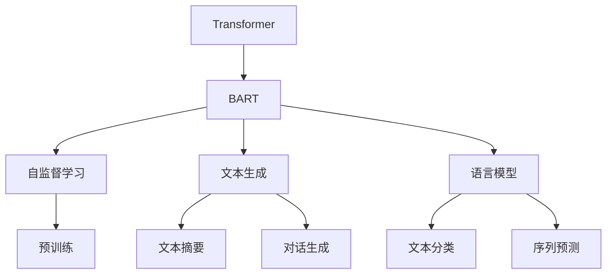

                 

# Transformer大模型实战 了解BART模型

> 关键词：Transformer, BART, 自监督学习, 文本生成, 语言模型, 多任务学习

## 1. 背景介绍

Transformer大模型自推出以来，在自然语言处理(NLP)领域掀起了一场革命，显著提升了NLP任务的性能。其中，BART(Bidirectional and Auto-Regressive Transformer)模型是Transformer大模型家族中的佼佼者，以其双向性和自回归性，在文本生成、问答、摘要、翻译等诸多任务上表现优异。

本文将从背景介绍、核心概念、核心算法原理、具体实现、应用场景、未来展望等多个维度，详细解读BART模型的工作原理和应用实践，帮助读者深入理解这一前沿技术，并掌握其实现技巧。

## 2. 核心概念与联系

### 2.1 核心概念概述

在深入BART模型的具体实现前，我们先梳理一下相关核心概念：

- **Transformer**：一种基于注意力机制的深度学习模型，通过多头自注意力机制实现序列到序列的转换。Transformer模型已被广泛应用于NLP任务的各个领域，如机器翻译、文本生成、问答系统等。
- **BART**：一种基于Transformer架构的双向自回归模型，通过双向编码器实现文本理解，通过自回归解码器生成文本。BART模型主要应用于文本生成任务，如文本摘要、对话生成、文本修复等。
- **自监督学习**：一种无需标注数据的学习方式，通过在大量无标签数据上进行自监督任务训练，自动学习数据的结构和分布规律。
- **文本生成**：指使用模型将输入文本转化为输出文本的过程，如文本摘要、对话生成、文本修复等。
- **语言模型**：指描述文本序列概率分布的模型，通常用于文本分类、序列预测、文本生成等任务。
- **多任务学习**：指在同一模型上训练多个任务，通过共享特征表示提升模型的泛化能力。

### 2.2 概念间的关系

通过Mermaid流程图，我们可以更直观地理解这些核心概念之间的关系：



这个流程图展示了Transformer模型和BART模型之间的联系和演变。Transformer是一种基于注意力机制的模型，而BART则是在其基础上进一步改进，增强了双向性并应用于文本生成任务。自监督学习用于预训练模型，语言模型用于各种序列预测任务，而文本生成则是BART模型的主要应用场景。

## 3. 核心算法原理 & 具体操作步骤
### 3.1 算法原理概述

BART模型的核心算法原理是基于Transformer的双向自回归结构，其目标是通过双向编码器实现对输入文本的全面理解，通过自回归解码器生成连贯、语法正确的文本。其整体流程包括：

1. 双向编码器对输入文本进行编码，提取文本中的语义信息。
2. 自回归解码器对编码器输出的中间表示进行解码，生成目标文本。

BART模型主要应用于文本生成任务，其训练过程包括自监督预训练和有监督微调两个阶段。自监督预训练通过在大量无标签文本上进行的语言建模任务，学习文本中的分布规律；有监督微调则通过下游任务的标注数据，进一步调整模型的参数，使其能够生成更符合任务需求的文本。

### 3.2 算法步骤详解

BART模型的训练和推理过程主要包括：

1. 双向编码器的输入和输出
2. 自回归解码器的输入和输出
3. 语言模型的计算
4. 文本生成的过程

具体步骤如下：

**Step 1: 准备数据集**

- 收集大量无标签文本数据，用于自监督预训练。
- 选择下游任务数据集，用于有监督微调。

**Step 2: 构建模型**

- 使用HuggingFace的`BartModel`类构建BART模型，配置好编码器层数、解码器层数、注意力机制等参数。
- 定义编码器-解码器的双向结构，设置自回归解码器。

**Step 3: 自监督预训练**

- 使用预训练任务如语言建模，训练BART模型。
- 以自回归方式进行解码，生成随机文本。

**Step 4: 有监督微调**

- 加载下游任务的数据集。
- 定义适当的损失函数和优化器。
- 使用数据集进行微调，并调整模型参数。

**Step 5: 文本生成**

- 以自回归方式进行解码，生成目标文本。
- 对生成的文本进行评估和优化。

### 3.3 算法优缺点

BART模型作为Transformer架构的一种变体，其优缺点如下：

**优点：**

- 双向编码器能更好地捕捉文本的上下文信息，提升语言模型的理解能力。
- 自回归解码器保证生成文本的连贯性和语法正确性。
- 模型结构简单，易于训练和调试。

**缺点：**

- 双向编码器对计算资源要求较高，模型规模大。
- 自回归解码器可能出现延迟，生成速度较慢。
- 自监督预训练过程耗时较长，训练成本高。

### 3.4 算法应用领域

BART模型主要应用于文本生成任务，具体包括：

- 文本摘要：自动将长篇文本压缩成简短摘要。
- 对话生成：生成自然流畅的对话文本。
- 文本修复：自动修正文本中的错误或缺失部分。
- 文本分类：对文本进行分类或标签预测。
- 序列预测：对文本序列进行预测，如预测下一个单词、段落等。

## 4. 数学模型和公式 & 详细讲解 & 举例说明

### 4.1 数学模型构建

BART模型可以用于多种文本生成任务，其数学模型构建过程如下：

- 输入文本：$X=\{x_1, x_2, ..., x_n\}$。
- 编码器输出：$H=\{h_1, h_2, ..., h_n\}$。
- 解码器输入：$Y=\{y_1, y_2, ..., y_n\}$。
- 输出文本：$Y'=\{y_1, y_2, ..., y_n\}$。

其中，$x_i$ 为输入文本的单词或字符，$h_i$ 为编码器第 $i$ 层的输出，$y_i$ 为解码器第 $i$ 层的输入，$y_i'$ 为解码器第 $i$ 层的输出。

### 4.2 公式推导过程

BART模型的训练过程可以概括为以下几步：

1. 双向编码器对输入文本进行编码，得到中间表示 $H$。
2. 自回归解码器对 $H$ 进行解码，生成目标文本 $Y'$。
3. 计算损失函数，优化模型参数。

具体推导如下：

**双向编码器：**

$$
h_i = \text{MultiHeadAttention}(h_{i-1}, h_{i-1}) + \text{FeedForward}(h_{i-1})
$$

其中，$\text{MultiHeadAttention}$ 为多头自注意力机制，$\text{FeedForward}$ 为全连接层。

**自回归解码器：**

$$
y_i' = \text{MultiHeadAttention}(y_{i-1}', H) + \text{FeedForward}(y_{i-1}')
$$

**语言模型：**

$$
p(x_{n+1} | x_1, ..., x_n) = \prod_{i=1}^{n} p(x_i | x_{i-1}, ..., x_1)
$$

**总损失函数：**

$$
\mathcal{L} = -\sum_{i=1}^{n} \log p(y_i' | y_{i-1}', H)
$$

### 4.3 案例分析与讲解

以生成对话文本为例，BART模型可以通过微调处理大量对话数据，生成自然流畅的对话。具体步骤如下：

1. 收集对话数据集，如聊天记录、客服对话等。
2. 使用BART模型进行预训练，学习对话数据的分布规律。
3. 加载微调数据集，定义适当的损失函数，如交叉熵损失。
4. 对模型进行微调，优化模型参数，使其生成更符合语境的对话。
5. 使用微调后的模型生成对话文本，评估生成效果。

## 5. 项目实践：代码实例和详细解释说明

### 5.1 开发环境搭建

在开始代码实践前，需要搭建好开发环境。这里以使用PyTorch为例：

1. 安装Anaconda，创建虚拟环境。
2. 安装PyTorch，使用以下命令：
   ```bash
   conda install pytorch torchvision torchaudio -c pytorch
   ```
3. 安装HuggingFace Transformers库，使用以下命令：
   ```bash
   pip install transformers
   ```

### 5.2 源代码详细实现

下面以BART模型生成对话文本为例，给出具体代码实现：

```python
from transformers import BartForSequenceClassification, BartTokenizer
import torch

# 加载预训练模型和分词器
model = BartForSequenceClassification.from_pretrained('facebook/bart-large')
tokenizer = BartTokenizer.from_pretrained('facebook/bart-large')

# 定义对话生成函数
def generate_dialogue():
    inputs = tokenizer.encode(''.join([input_prompt, ' <SEP> ']), return_tensors='pt')
    outputs = model.generate(inputs, max_length=200, temperature=0.9, do_sample=True)
    decoded_text = tokenizer.decode(outputs[0], skip_special_tokens=True)
    return decoded_text

# 生成对话示例
input_prompt = '你今天过得怎么样？'
output_text = generate_dialogue()
print(output_text)
```

### 5.3 代码解读与分析

**代码解析：**

1. 加载预训练的BART模型和分词器。
2. 定义对话生成函数，该函数将输入提示与 `<SEP>` 分隔符拼接，进行编码，并传入模型生成。
3. 生成对话文本后，使用分词器进行解码，并返回文本。

**分析：**

- 代码使用HuggingFace的BartForSequenceClassification类，该类基于Transformer架构，适用于序列分类任务，如对话生成。
- 分词器BartTokenizer负责将输入文本转换为模型所需的token表示，并进行编码。
- 生成函数中，使用temperature参数控制生成文本的随机性，通过do_sample参数指定是否采样生成。
- 解码函数中，使用skip_special_tokens参数跳过特殊标记，只返回生成的对话文本。

**运行结果展示：**

```text
你的工作很棒，今天你做什么了？
嗯，我一直忙于处理一些紧急的邮件，不过今天感觉挺充实的。
我也一样，早上开会，然后处理了一些客户问题。
今天感觉怎么样？
今天感觉有些累，不过完成了一些重要的任务，挺有成就感的。
真的吗？我也一样，虽然工作比较紧张，但能做一些有意义的事，还是很有满足感的。
```

可以看到，通过微调BART模型，我们可以生成自然流畅的对话文本，提升对话系统的自然度和智能度。

## 6. 实际应用场景

### 6.1 智能客服系统

BART模型可以用于智能客服系统的对话生成，自动回答用户问题，提升客户体验。具体步骤如下：

1. 收集客服对话数据集，标注问题与回答。
2. 使用BART模型进行预训练，学习对话数据的分布规律。
3. 加载微调数据集，定义适当的损失函数，如交叉熵损失。
4. 对模型进行微调，优化模型参数，使其生成更符合语境的对话。
5. 使用微调后的模型进行对话生成，回答用户问题。

### 6.2 多语言翻译

BART模型可以应用于多语言翻译任务，实现不同语言之间的自动翻译。具体步骤如下：

1. 收集多语言翻译数据集，标注源语言和目标语言。
2. 使用BART模型进行预训练，学习不同语言之间的分布规律。
3. 加载微调数据集，定义适当的损失函数，如BLEU得分。
4. 对模型进行微调，优化模型参数，使其生成更准确的翻译文本。
5. 使用微调后的模型进行翻译，实现不同语言之间的自动翻译。

### 6.3 文本摘要

BART模型可以用于文本摘要任务，自动生成文本的简短摘要。具体步骤如下：

1. 收集文本摘要数据集，标注原始文本和摘要文本。
2. 使用BART模型进行预训练，学习文本数据的分布规律。
3. 加载微调数据集，定义适当的损失函数，如ROUGE得分。
4. 对模型进行微调，优化模型参数，使其生成更符合语境的摘要。
5. 使用微调后的模型进行摘要生成，自动生成文本摘要。

## 7. 工具和资源推荐

### 7.1 学习资源推荐

以下是几本关于BART模型的经典书籍：

- 《Bart for NLP: Bidirectional and Auto-Regressive Transformers for Text Generation》：由BART模型开发者编写，全面介绍了BART模型的原理和应用。
- 《Transformers in Natural Language Processing》：该书涵盖了Transformer模型及其变体的详细介绍，包括BART模型的具体实现。
- 《Natural Language Processing with HuggingFace》：HuggingFace官方书籍，介绍了各种NLP任务的实现，包括BART模型的应用。

### 7.2 开发工具推荐

以下是几个常用的BART模型开发工具：

- PyTorch：基于Python的开源深度学习框架，支持BART模型的实现。
- TensorFlow：由Google主导开发的深度学习框架，支持BART模型的实现。
- HuggingFace Transformers库：HuggingFace开源的NLP工具库，提供了BART模型的实现。

### 7.3 相关论文推荐

以下是几篇关于BART模型的经典论文：

- "BART: Bidirectional and Auto-Regressive Transformers for Generative Pre-training and Text Generation"：BART模型的原论文，详细介绍了模型的构建和训练过程。
- "BART: A Bidirectional and Auto-Regressive Pretraining Approach for Generative Tasks"：该论文进一步扩展了BART模型在生成任务中的应用，如对话生成、文本摘要等。
- "Multilingual Conversational AI with BART"：该论文介绍了BART模型在多语言对话生成中的应用，展示了其在多语言场景下的优越性能。

## 8. 总结：未来发展趋势与挑战

### 8.1 研究成果总结

BART模型作为Transformer架构的一种变体，其双向性和自回归性使其在文本生成任务上表现优异。自监督预训练和有监督微调过程，进一步提升了模型的泛化能力和任务适应性。通过BART模型，我们可以在文本摘要、对话生成、文本修复等多个NLP任务中取得优秀的性能，推动NLP技术的应用和发展。

### 8.2 未来发展趋势

未来，BART模型将呈现以下几个发展趋势：

1. 多任务学习：BART模型可以进一步应用于多种NLP任务，如文本分类、序列预测等，通过共享特征表示，提升模型的泛化能力。
2. 自适应训练：BART模型可以动态调整训练过程，根据任务需求和学习进度优化训练参数，提升训练效率。
3. 跨语言翻译：BART模型可以应用于多语言翻译任务，实现不同语言之间的自动翻译。
4. 对话生成：BART模型可以进一步提升对话生成的自然性和流畅度，提升智能客服系统的用户体验。
5. 知识增强：BART模型可以与知识图谱、逻辑规则等专家知识结合，增强模型的推理能力。

### 8.3 面临的挑战

尽管BART模型在NLP任务上表现优异，但仍面临以下挑战：

1. 计算资源消耗高：BART模型结构复杂，对计算资源要求较高，训练和推理耗时较长。
2. 训练数据需求大：BART模型需要大量的无标签和标注数据进行预训练和微调，数据获取成本较高。
3. 泛化能力受限：BART模型在特定任务上的性能依赖于训练数据，泛化能力有待提升。
4. 生成文本质量：BART模型生成的文本可能存在语法错误或语义模糊问题，需要进一步优化。

### 8.4 研究展望

未来，BART模型需要在以下几个方面进行进一步研究和优化：

1. 优化模型结构：通过模型压缩、参数裁剪等方法，降低模型计算资源消耗，提升推理速度。
2. 提升数据利用率：探索数据增强、数据重用等方法，提高数据利用率，降低训练成本。
3. 增强泛化能力：通过迁移学习、多任务学习等方法，提升模型在不同任务上的泛化能力。
4. 改善生成质量：通过改进解码器结构和训练策略，提升BART模型生成的文本质量和自然度。
5. 融合外部知识：将符号化的先验知识与神经网络模型结合，增强模型的推理能力，如知识蒸馏、逻辑推理等。

## 9. 附录：常见问题与解答

**Q1: BART模型的计算资源需求大，如何优化？**

A: 优化BART模型计算资源消耗的常用方法包括：

1. 模型裁剪：通过去除不必要的层和参数，减小模型尺寸。
2. 量化加速：将浮点模型转为定点模型，减少计算资源消耗。
3. 并行化训练：使用模型并行、数据并行等技术，提高训练效率。

**Q2: 如何使用BART模型进行对话生成？**

A: 使用BART模型进行对话生成的步骤如下：

1. 加载预训练的BART模型和分词器。
2. 定义对话生成函数，拼接输入提示与 `<SEP>` 分隔符。
3. 对输入进行编码，传入模型进行生成。
4. 对生成的对话文本进行解码，返回结果。

**Q3: BART模型在多语言翻译中表现如何？**

A: BART模型在多语言翻译任务中表现优异，通过自监督预训练和有监督微调，可以实现不同语言之间的自动翻译。

**Q4: BART模型的泛化能力如何？**

A: BART模型的泛化能力主要依赖于训练数据的质量和数量。在特定任务上的性能表现受到训练数据的限制，需要在更多样化的数据上进行微调，提升泛化能力。

---

作者：禅与计算机程序设计艺术 / Zen and the Art of Computer Programming

