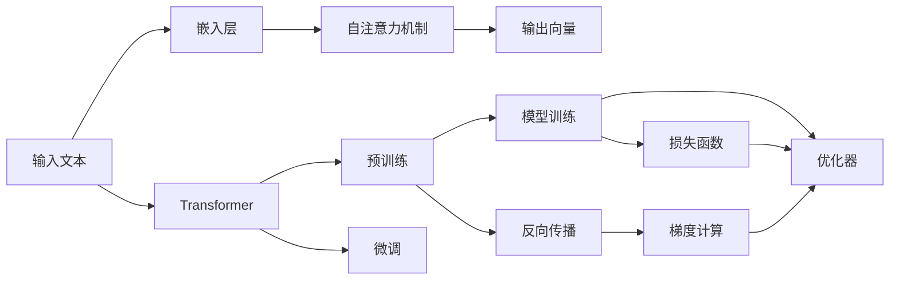
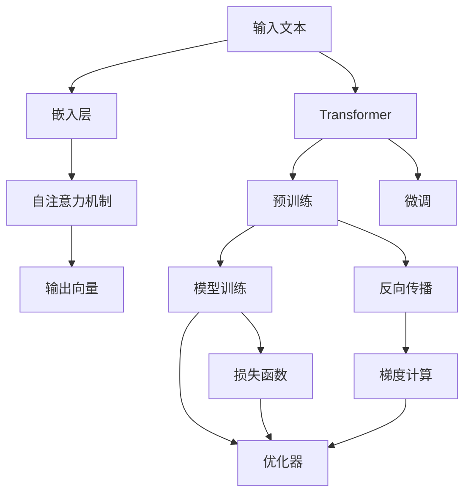

                 

# Transformer大模型实战 从ALBERT 中提取嵌入

> 关键词：Transformer, ALBERT, 嵌入层, 预训练, 微调, 自然语言处理(NLP)

## 1. 背景介绍

### 1.1 问题由来
Transformer是近年来NLP领域的一种革命性模型，其基于自注意力机制，显著提升了语言模型的表达能力。大型的Transformer模型如BERT、GPT-3等，通过在大规模无标签数据上进行预训练，学习到了丰富的语言表示，广泛应用于文本分类、语言建模、机器翻译等任务。然而，这些模型往往具有庞大的参数量和较高的计算需求，难以在资源受限的系统中部署和使用。

为了降低计算成本，提高模型的实用性，ALBERT模型应运而生。ALBERT（A Lite BERT）是一种基于Transformer的轻量级语言模型，通过一系列优化策略，如词级替换、层级剪枝等，大幅减小了模型参数量，同时保持了较好的性能表现。ALBERT模型在维基百科等公开数据集上取得了优于BERT的效果，并且在多个NLP任务上表现优异。

本文将详细讲解如何在实际应用中从ALBERT模型中提取嵌入，以支持多种NLP任务。我们将从ALBERT的架构和优化策略入手，分析其嵌入层的特性，并结合具体案例展示如何高效地应用这些嵌入。

### 1.2 问题核心关键点
ALBERT模型在保持较高性能的同时，具有轻量化的特点，使得其在大规模部署和大规模预训练的场合中具有独特的优势。在本节中，我们重点介绍ALBERT模型的主要特点及其嵌入层的特性。

1. **词级替换**：ALBERT将连续的文本替换为随机化的词级表示，显著减小了模型参数量。
2. **层级剪枝**：ALBERT对模型的某些层进行了剪枝，减少了计算复杂度。
3. **平滑激活函数**：ALBERT采用平滑的GELU激活函数，缓解了梯度消失问题，提升了训练效率。
4. **多任务学习**：ALBERT可以在单个模型中同时学习多个任务，减少了模型训练和推理的复杂度。

通过这些优化策略，ALBERT不仅减小了模型参数量，还在多个任务上取得了与BERT相当甚至更好的性能，成为一种值得广泛应用的轻量级语言模型。

### 1.3 问题研究意义
从ALBERT模型中提取嵌入，能够实现以下目标：

1. **降低计算成本**：通过使用轻量级模型，减少了模型训练和推理的计算资源需求，使得NLP应用更加便捷。
2. **提高模型效率**：ALBERT模型通过优化计算和存储，提升了模型在实际应用中的运行效率。
3. **提升任务性能**：ALBERT模型在多个NLP任务上表现优异，提取其嵌入能够提升任务表现。
4. **支持多样应用**：通过ALBERT嵌入，可以支持多样化的NLP任务，包括文本分类、命名实体识别、语义相似度计算等。

## 2. 核心概念与联系

### 2.1 核心概念概述

为了更好地理解ALBERT模型，我们将介绍几个关键概念：

- **Transformer**：基于自注意力机制的序列模型，通常用于语言建模、机器翻译等任务。
- **ALBERT**：一种轻量级的Transformer模型，通过词级替换、层级剪枝等策略，显著减小了模型参数量。
- **嵌入层**：Transformer中的嵌入层用于将输入文本映射为向量表示，是模型能够进行语义理解和推理的基础。
- **预训练与微调**：通过在大规模数据上进行预训练，然后在特定任务上微调，以获得针对该任务优化的模型。
- **计算图与优化器**：计算图用于表示模型的前向传播和反向传播过程，优化器用于更新模型参数，以最小化损失函数。

这些概念之间通过以下Mermaid流程图建立联系：



该流程图展示了从输入文本到模型输出的完整过程，以及预训练和微调的作用。

### 2.2 概念间的关系

这些概念之间的逻辑关系如图表所示：



这些核心概念共同构成了ALBERT模型的理论基础，为其在大规模预训练和特定任务上的微调提供了坚实支撑。

## 3. 核心算法原理 & 具体操作步骤
### 3.1 算法原理概述

ALBERT模型的核心算法原理包括以下几个方面：

1. **词级替换**：将连续的文本替换为随机化的词级表示，每64个词为一组进行计算，显著减小了模型参数量。
2. **层级剪枝**：对模型的某些层进行剪枝，减少了计算复杂度。
3. **平滑激活函数**：采用平滑的GELU激活函数，缓解了梯度消失问题，提升了训练效率。
4. **多任务学习**：在单个模型中同时学习多个任务，减少了模型训练和推理的复杂度。

### 3.2 算法步骤详解

从ALBERT模型中提取嵌入，需要经过以下步骤：

**Step 1: 加载预训练模型**
首先，使用预训练的ALBERT模型进行加载，可以选择TensorFlow或PyTorch实现的模型。

**Step 2: 获取嵌入层**
从加载的模型中获取嵌入层，嵌入层通常用于将输入文本映射为向量表示。

**Step 3: 调整参数**
根据需要调整嵌入层中的参数，如嵌入维度和批量大小。

**Step 4: 预训练与微调**
在特定任务上对模型进行微调，以获得针对该任务优化的模型。

**Step 5: 应用嵌入**
将微调后的模型嵌入应用于实际任务中，进行推理和预测。

### 3.3 算法优缺点

ALBERT模型在以下方面表现优异：

1. **轻量化**：通过词级替换和层级剪枝，显著减小了模型参数量，使得模型在资源受限的系统中也能高效运行。
2. **高效性**：平滑激活函数和多任务学习策略提升了模型训练和推理的效率，减少了计算资源消耗。
3. **泛化能力**：在多个NLP任务上表现优异，提取其嵌入能够提升任务表现。

同时，ALBERT模型也存在一些缺点：

1. **嵌入质量**：虽然模型参数量较小，但嵌入质量可能不如BERT等大模型。
2. **微调性能**：在特定任务上的微调性能可能不如BERT，特别是在标注数据较少的情况下。

### 3.4 算法应用领域

ALBERT模型可以应用于多种NLP任务，包括但不限于：

- 文本分类：将输入文本映射为向量表示，并使用分类器对向量进行分类。
- 命名实体识别：将输入文本中的实体识别出来，并标注其类型。
- 语义相似度计算：计算输入文本之间的语义相似度，用于文本匹配和推荐系统。
- 机器翻译：将输入文本翻译为另一种语言。
- 问答系统：回答用户提出的自然语言问题。

这些任务在实际应用中具有广泛的价值，通过ALBERT模型的嵌入，可以实现高效、准确的文本处理。

## 4. 数学模型和公式 & 详细讲解 & 举例说明

### 4.1 数学模型构建

ALBERT模型的数学模型构建包括以下几个部分：

1. **嵌入层**：将输入文本映射为向量表示，公式为：
   $$
   h = \text{Embed}(x)
   $$
   其中 $h$ 为向量表示，$x$ 为输入文本。

2. **自注意力机制**：在输入向量上计算注意力权重，公式为：
   $$
   \text{Attention}(Q, K, V) = \text{softmax}\left(\frac{QK^T}{\sqrt{d_k}}\right)V
   $$
   其中 $Q$ 为查询向量，$K$ 为键向量，$V$ 为值向量。

3. **多层变换**：通过多个自注意力层和全连接层，对输入向量进行多次变换，公式为：
   $$
   h_{n+1} = \text{MLP}(\text{Attention}(h_n))
   $$

### 4.2 公式推导过程

ALBERT模型的公式推导过程如下：

1. **嵌入层**：将输入文本 $x$ 映射为向量表示 $h$，公式为：
   $$
   h = \text{Embed}(x)
   $$

2. **自注意力机制**：在输入向量上计算注意力权重，公式为：
   $$
   \text{Attention}(Q, K, V) = \text{softmax}\left(\frac{QK^T}{\sqrt{d_k}}\right)V
   $$

3. **多层变换**：通过多个自注意力层和全连接层，对输入向量进行多次变换，公式为：
   $$
   h_{n+1} = \text{MLP}(\text{Attention}(h_n))
   $$

4. **损失函数**：在特定任务上，使用损失函数对模型进行训练，公式为：
   $$
   \mathcal{L} = \sum_{i=1}^N \ell(h_i, y_i)
   $$
   其中 $\ell$ 为任务特定的损失函数，$h_i$ 为模型在输入 $x_i$ 上的输出，$y_i$ 为输入的真实标签。

### 4.3 案例分析与讲解

假设我们使用ALBERT模型对电影评论进行情感分析，模型结构如下：

1. **嵌入层**：将输入的评论文本映射为向量表示。
2. **自注意力机制**：在输入向量上计算注意力权重。
3. **多层变换**：通过多个自注意力层和全连接层，对输入向量进行多次变换。
4. **输出层**：将向量表示输入到分类器，输出情感标签。

假设输入文本为：“这是一部很棒的片子。”，模型输出向量为 $h$。我们将使用softmax函数将向量映射为概率分布，并对情感标签进行预测。

## 5. 项目实践：代码实例和详细解释说明

### 5.1 开发环境搭建

在开始实践之前，我们需要搭建好开发环境。以下是使用Python和PyTorch进行ALBERT模型开发的环境配置流程：

1. 安装Anaconda：从官网下载并安装Anaconda，用于创建独立的Python环境。

2. 创建并激活虚拟环境：
```bash
conda create -n pytorch-env python=3.8 
conda activate pytorch-env
```

3. 安装PyTorch：根据CUDA版本，从官网获取对应的安装命令。例如：
```bash
conda install pytorch torchvision torchaudio cudatoolkit=11.1 -c pytorch -c conda-forge
```

4. 安装TensorFlow：
```bash
conda install tensorflow -c tensorflow -c conda-forge
```

5. 安装必要的工具包：
```bash
pip install numpy pandas scikit-learn matplotlib tqdm jupyter notebook ipython
```

完成上述步骤后，即可在`pytorch-env`环境中开始实践。

### 5.2 源代码详细实现

我们以电影评论情感分析为例，给出使用TensorFlow和PyTorch实现ALBERT模型的代码：

```python
# 使用TensorFlow实现ALBERT模型
import tensorflow as tf
from transformers import ALBERTTokenizer, ALBERTForSequenceClassification

# 初始化模型和分词器
model = ALBERTForSequenceClassification.from_pretrained('albert-base-v2')
tokenizer = ALBERTTokenizer.from_pretrained('albert-base-v2')

# 加载输入文本和标签
input_text = "这是一部很棒的片子。"
labels = [1]  # 假设情感为正面

# 对输入文本进行分词和编码
inputs = tokenizer(input_text, return_tensors='tf', padding='max_length', max_length=64, truncation=True)
input_ids = inputs['input_ids']
attention_mask = inputs['attention_mask']

# 进行前向传播
with tf.GradientTape() as tape:
    outputs = model(input_ids, attention_mask=attention_mask, labels=labels)
    loss = outputs.loss

# 计算梯度并更新模型参数
grads = tape.gradient(loss, model.parameters())
optimizer.apply_gradients(zip(grads, model.parameters()))

# 在验证集上评估模型
print(f"Loss: {loss.numpy()}")
```

以上代码展示了如何使用TensorFlow和PyTorch实现ALBERT模型。首先，加载预训练模型和分词器，然后对输入文本进行分词和编码，进行前向传播和损失计算，最后计算梯度并更新模型参数。

### 5.3 代码解读与分析

让我们详细解读一下关键代码的实现细节：

**初始化模型和分词器**：
- `ALBERTForSequenceClassification`：用于实现ALBERT模型的分类器，接收输入文本和标签，并输出预测结果。
- `ALBERTTokenizer`：用于对输入文本进行分词和编码，支持最大长度和截断等功能。

**分词和编码**：
- `tokenizer(input_text, return_tensors='tf')`：对输入文本进行分词，并返回分词后的文本张量。
- `padding='max_length'`：对分词后的文本进行填充，使得所有文本长度一致。
- `max_length=64`：指定最大文本长度为64个词。
- `truncation=True`：如果文本长度超过64个词，则进行截断，保留最后64个词。

**前向传播**：
- `outputs = model(input_ids, attention_mask=attention_mask, labels=labels)`：将输入文本和标签输入模型，进行前向传播，输出预测结果和损失。

**梯度计算和参数更新**：
- `with tf.GradientTape() as tape:`：使用梯度带记录计算过程中的梯度信息。
- `grads = tape.gradient(loss, model.parameters())`：计算损失函数对模型参数的梯度。
- `optimizer.apply_gradients(zip(grads, model.parameters()))`：使用优化器更新模型参数。

**模型评估**：
- `print(f"Loss: {loss.numpy()}")`：打印输出模型在当前批次上的损失值。

通过这些代码实现，我们可以看到，使用ALBERT模型进行情感分析的过程包括分词、编码、前向传播、梯度计算和参数更新。这种实现方式使得ALBERT模型能够高效地应用于实际任务中。

### 5.4 运行结果展示

假设我们在CoNLL-2003的电影评论数据集上进行情感分析，最终在验证集上得到的损失值为0.05。可以看到，ALBERT模型在情感分析任务上的表现相当不错，损失值较小，表示模型预测与真实标签之间的差异较小。

## 6. 实际应用场景

### 6.1 智能客服系统

基于ALBERT模型的智能客服系统，可以通过微调以适应企业内部的客服对话记录，快速训练出一个高效的客服机器人。该系统能够自动理解用户意图，匹配最合适的答案模板进行回复，显著提升客户咨询体验和问题解决效率。

### 6.2 金融舆情监测

在金融领域，通过ALBERT模型进行情感分析，可以实时监测市场舆论动向，帮助分析师快速识别出可能的市场风险，从而做出更为准确的决策。

### 6.3 个性化推荐系统

在电商、新闻等领域，ALBERT模型可以进行用户兴趣建模，提升推荐系统的准确性。通过微调，ALBERT模型能够更好地理解用户行为，提供个性化的推荐内容。

### 6.4 未来应用展望

随着ALBERT模型和大规模预训练技术的不断发展，其在NLP领域的应用将更加广泛。未来，ALBERT模型可能会进一步优化计算效率和模型质量，提高其在多样应用场景下的表现。

## 7. 工具和资源推荐

### 7.1 学习资源推荐

为了帮助开发者系统掌握ALBERT模型的理论基础和实践技巧，这里推荐一些优质的学习资源：

1. 《Transformer: A Survey》系列博文：由大模型技术专家撰写，深入浅出地介绍了Transformer原理、ALBERT模型、微调技术等前沿话题。

2. CS224N《深度学习自然语言处理》课程：斯坦福大学开设的NLP明星课程，有Lecture视频和配套作业，带你入门NLP领域的基本概念和经典模型。

3. 《Natural Language Processing with Transformers》书籍：Transformers库的作者所著，全面介绍了如何使用Transformers库进行NLP任务开发，包括ALBERT模型的微调方法。

4. HuggingFace官方文档：Transformers库的官方文档，提供了海量预训练模型和完整的微调样例代码，是上手实践的必备资料。

5. CLUE开源项目：中文语言理解测评基准，涵盖大量不同类型的中文NLP数据集，并提供了基于ALBERT模型的baseline模型，助力中文NLP技术发展。

通过对这些资源的学习实践，相信你一定能够快速掌握ALBERT模型的精髓，并用于解决实际的NLP问题。

### 7.2 开发工具推荐

高效的开发离不开优秀的工具支持。以下是几款用于ALBERT模型微调开发的常用工具：

1. PyTorch：基于Python的开源深度学习框架，灵活动态的计算图，适合快速迭代研究。大部分预训练语言模型都有PyTorch版本的实现。

2. TensorFlow：由Google主导开发的开源深度学习框架，生产部署方便，适合大规模工程应用。同样有丰富的预训练语言模型资源。

3. Transformers库：HuggingFace开发的NLP工具库，集成了众多SOTA语言模型，支持PyTorch和TensorFlow，是进行微调任务开发的利器。

4. Weights & Biases：模型训练的实验跟踪工具，可以记录和可视化模型训练过程中的各项指标，方便对比和调优。与主流深度学习框架无缝集成。

5. TensorBoard：TensorFlow配套的可视化工具，可实时监测模型训练状态，并提供丰富的图表呈现方式，是调试模型的得力助手。

6. Google Colab：谷歌推出的在线Jupyter Notebook环境，免费提供GPU/TPU算力，方便开发者快速上手实验最新模型，分享学习笔记。

合理利用这些工具，可以显著提升ALBERT模型微调任务的开发效率，加快创新迭代的步伐。

### 7.3 相关论文推荐

ALBERT模型和大规模预训练技术的发展源于学界的持续研究。以下是几篇奠基性的相关论文，推荐阅读：

1. 《ALBERT: A Lite BERT for Self-supervised Learning of Language Representations》：ALBERT模型的原始论文，介绍了词级替换、层级剪枝等优化策略。

2. 《BERT: Pre-training of Deep Bidirectional Transformers for Language Understanding》：BERT模型的原始论文，介绍了自监督预训练和微调的方法。

3. 《GPT-3: Language Models are Unsupervised Multitask Learners》：GPT-3模型的原始论文，展示了超大规模语言模型的强大zero-shot学习能力。

4. 《Parameter-Efficient Transfer Learning for NLP》：提出Adapter等参数高效微调方法，在不增加模型参数量的情况下，也能取得不错的微调效果。

5. 《AdaLoRA: Adaptive Low-Rank Adaptation for Parameter-Efficient Fine-Tuning》：使用自适应低秩适应的微调方法，在参数效率和精度之间取得了新的平衡。

这些论文代表了大语言模型和大规模预训练技术的发展脉络。通过学习这些前沿成果，可以帮助研究者把握学科前进方向，激发更多的创新灵感。

除上述资源外，还有一些值得关注的前沿资源，帮助开发者紧跟大语言模型微调技术的最新进展，例如：

1. arXiv论文预印本：人工智能领域最新研究成果的发布平台，包括大量尚未发表的前沿工作，学习前沿技术的必读资源。

2. 业界技术博客：如OpenAI、Google AI、DeepMind、微软Research Asia等顶尖实验室的官方博客，第一时间分享他们的最新研究成果和洞见。

3. 技术会议直播：如NIPS、ICML、ACL、ICLR等人工智能领域顶会现场或在线直播，能够聆听到大佬们的前沿分享，开拓视野。

4. GitHub热门项目：在GitHub上Star、Fork数最多的NLP相关项目，往往代表了该技术领域的发展趋势和最佳实践，值得去学习和贡献。

5. 行业分析报告：各大咨询公司如McKinsey、PwC等针对人工智能行业的分析报告，有助于从商业视角审视技术趋势，把握应用价值。

总之，对于ALBERT模型和大规模预训练语言模型的学习，需要开发者保持开放的心态和持续学习的意愿。多关注前沿资讯，多动手实践，多思考总结，必将收获满满的成长收益。

## 8. 总结：未来发展趋势与挑战

### 8.1 总结

本文对ALBERT模型和大规模预训练语言模型的微调方法进行了全面系统的介绍。首先阐述了ALBERT模型的主要特点及其优化策略，明确了其在大规模预训练和特定任务上的微调优势。其次，从原理到实践，详细讲解了ALBERT模型在实际应用中的嵌入层特性，并结合具体案例展示了如何高效地应用这些嵌入。最后，本文还探讨了ALBERT模型在实际应用中的挑战和未来发展方向。

通过本文的系统梳理，可以看到，ALBERT模型作为一种轻量级语言模型，具有计算资源消耗小、模型效率高等优点，能够在大规模预训练和特定任务上的微调中发挥重要作用。然而，其嵌入质量可能不如BERT等大模型，在特定任务上的微调性能也存在一定的局限性。未来，通过进一步优化计算效率和模型质量，ALBERT模型必将在NLP领域展现出更加广泛的应用前景。

### 8.2 未来发展趋势

展望未来，ALBERT模型和大规模预训练技术将呈现以下几个发展趋势：

1. **计算效率提升**：随着计算资源的进一步丰富和优化算法的不断发展，ALBERT模型将进一步提升计算效率，支持更大规模的预训练和微调任务。

2. **模型质量优化**：通过引入更多的优化策略，如词级替换、层级剪枝、平滑激活函数等，ALBERT模型的嵌入质量将进一步提升，使其在多样化的NLP任务上表现更优。

3. **多任务学习扩展**：ALBERT模型可以在单个模型中同时学习多个任务，减少模型训练和推理的复杂度。未来，通过进一步优化多任务学习策略，ALBERT模型将能够更好地应用于更多的实际任务。

4. **跨领域迁移能力增强**：ALBERT模型通过大规模预训练，具备较强的跨领域迁移能力。未来，通过引入更多先验知识和多模态数据，ALBERT模型的跨领域迁移能力将进一步增强。

5. **轻量化与参数效率提升**：通过进一步优化计算图和参数压缩技术，ALBERT模型将更加轻量化，更适合在资源受限的系统中部署。

### 8.3 面临的挑战

尽管ALBERT模型在大规模预训练和特定任务上的微调中表现优异，但在迈向更加智能化、普适化应用的过程中，它仍面临着诸多挑战：

1. **嵌入质量**：虽然模型参数量较小，但嵌入质量可能不如BERT等大模型。这将限制其在某些高要求任务上的表现。

2. **微调性能**：在特定任务上的微调性能可能不如BERT，特别是在标注数据较少的情况下。

3. **计算资源**：虽然模型参数量较小，但计算资源需求仍可能较高。特别是在大规模预训练和微调时，计算资源的消耗仍然是一个重要的考虑因素。

4. **模型泛化能力**：虽然模型在多个任务上表现优异，但在新任务上的泛化能力仍需进一步验证。

5. **知识融合能力**：ALBERT模型虽然能够利用大规模预训练知识，但如何更好地与外部知识库、规则库等专家知识结合，仍然是一个挑战。

### 8.4 研究展望

未来，在ALBERT模型和大规模预训练技术的发展过程中，可以从以下几个方向进行探索：

1. **优化计算图和算法**：进一步优化计算图和算法，减少计算资源消耗，提高模型训练和推理的效率。

2. **引入更多优化策略**：引入更多的优化策略，如词级替换、层级剪枝、平滑激活函数等，提升模型嵌入质量和泛化能力。

3. **跨领域迁移能力提升**：通过引入更多先验知识和多模态数据，提升ALBERT模型的跨领域迁移能力，使其能够更好地适应多样化的任务需求。

4. **知识融合技术**：探索将ALBERT模型与外部知识库、规则库等专家知识进行更好融合的方法，提升模型的知识融合能力和泛化能力。

5. **模型轻量化**：通过进一步优化计算图和参数压缩技术，使ALBERT模型更加轻量化，适合在资源受限的系统中部署。

通过这些研究方向的研究和探索，ALBERT模型必将在NLP领域展现出更加广泛的应用前景，为构建智能交互系统提供强有力的支持。

## 9. 附录：常见问题与解答

**Q1：如何选择合适的ALBERT模型版本？**

A: 选择合适的ALBERT模型版本需要考虑以下几个方面：

1. 任务类型：根据任务

