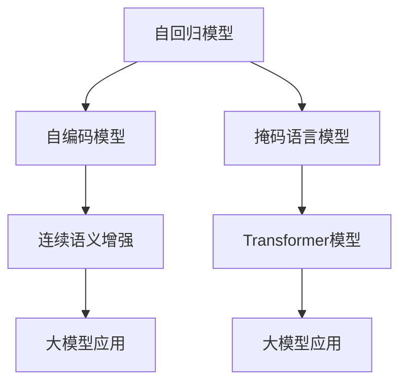

                 

# Transformer大模型实战 比较不同的预训练目标

> 关键词：Transformer, 大模型, 预训练目标, 自回归, 自编码, 掩码语言模型, 连续语义增强

## 1. 背景介绍

随着深度学习技术的迅猛发展，大模型，特别是Transformer大模型，在自然语言处理（NLP）领域取得了显著的进展。这些模型通过在大规模无标签文本数据上进行预训练，学习到了丰富的语言知识，从而在各种下游任务上取得了优异的性能。预训练的目标设计，是影响模型效果的关键因素之一。本文将介绍几种主要的预训练目标，并进行比较分析，以帮助读者更好地理解预训练目标的设计思路和实际效果。

## 2. 核心概念与联系

### 2.1 核心概念概述

在大模型的预训练过程中，目标设计的合理性直接影响模型最终的性能表现。以下是几个核心概念：

- **自回归模型(Autoregressive Models)**：这类模型使用当前位置的上下文信息预测下一个位置的概率，典型的例子如GPT-2。
- **自编码模型(Automatic Encoders)**：这类模型通过重构输入数据，学习到数据的隐含表示，常见的例子如BERT。
- **掩码语言模型(Masked Language Modeling, MLM)**：给定一段文本，随机掩盖部分单词，预测被掩盖的单词，用于学习语言结构的表示。
- **连续语义增强(Continuous Semantic Enhancement)**：在掩码语言模型的基础上，进一步利用句子中的掩码单词信息，增强模型的语义表示能力。

这些概念构成了预训练目标的基础，不同的目标设计能够更好地适应不同的NLP任务。

### 2.2 概念间的关系

通过这些预训练目标，可以构建出不同的大模型，每种模型都有其特定的优势和应用场景。下图展示了不同预训练目标之间的关系和适用性：



在这个图中，自回归模型和自编码模型是基础模型，掩码语言模型和连续语义增强是对这些模型的进一步改进。Transformer模型是基于这些改进目标构建的典型模型，而大模型的应用则展示了这些模型在实际任务中的表现。

## 3. 核心算法原理 & 具体操作步骤
### 3.1 算法原理概述

预训练目标的设计通常基于两个核心思想：

1. **语言模型预测**：通过预测文本中缺失的部分，使得模型学习到语言的统计规律和上下文关系。
2. **语义表示学习**：通过重构或掩码等方法，使得模型学习到文本的语义表示，能够对文本进行语义理解和生成。

预训练目标的设计应考虑目标的覆盖范围、表达能力和计算复杂度，以实现最优的性能表现。

### 3.2 算法步骤详解

预训练目标的设计和实现通常包括以下步骤：

1. **数据准备**：选择合适的预训练数据集，进行预处理和分词。
2. **模型构建**：根据目标设计，构建相应的预训练模型，如Transformer模型。
3. **训练过程**：使用预训练目标进行训练，优化模型参数。
4. **微调优化**：在特定任务上进行微调，进一步优化模型。

下面以掩码语言模型为例，详细说明预训练目标的实现步骤。

### 3.3 算法优缺点

掩码语言模型是一种有效的预训练目标，其主要优点包括：

- **广泛的覆盖范围**：可以覆盖到各种语言的词汇和语法结构。
- **简单易实现的训练**：训练过程相对简单，可以有效地学习到语言的统计规律。
- **高效的表达能力**：通过预测掩码单词，学习到单词之间的关系，提升了模型的语义表示能力。

其缺点包括：

- **计算资源需求高**：需要大量的计算资源进行预训练。
- **对抗性训练困难**：在对抗性样本上的表现可能不如其他预训练目标。

### 3.4 算法应用领域

掩码语言模型广泛应用于各种NLP任务，如文本分类、机器翻译、问答系统等。在大模型的预训练和微调过程中，掩码语言模型是最常用的目标之一，能够显著提升模型的表现。

## 4. 数学模型和公式 & 详细讲解 & 举例说明

### 4.1 数学模型构建

以BERT为例，其预训练目标是掩码语言模型。在训练过程中，模型需要对句子中的掩码单词进行预测。假设有N个单词，其中M个单词被随机掩盖，则目标函数为：

$$
\mathcal{L} = -\sum_{i=1}^N \log P(w_i | \{w_1, \cdots, w_{i-1}, \tilde{w}_i, w_{i+1}, \cdots, w_N\})
$$

其中，$w_i$ 表示第i个单词，$\tilde{w}_i$ 表示被掩盖的单词。

### 4.2 公式推导过程

BERT的预训练目标可以理解为一种条件概率问题，即给定前N-1个单词，预测第N个单词的概率。通过最大化该概率，模型学习到单词之间的统计规律和语义关系。在训练过程中，模型使用交叉熵损失函数进行优化：

$$
\mathcal{L} = -\sum_{i=1}^N (y_i \log \hat{y}_i + (1-y_i) \log (1-\hat{y}_i))
$$

其中，$y_i$ 表示第i个单词的真实标签，$\hat{y}_i$ 表示模型对第i个单词的预测。

### 4.3 案例分析与讲解

以机器翻译任务为例，掩码语言模型可以用于训练Transformer模型。在训练过程中，模型需要先预测被掩盖的单词，然后通过注意力机制将其与源语言进行对齐，最终生成目标语言句子。

假设源语言句子为 "I have a pen"，目标语言句子为 "Je ai un stylo"。模型在训练过程中，会随机掩盖部分单词，如 "a"，然后预测其对应的单词 "un"。模型通过学习到单词之间的关系，能够在翻译任务中表现优异。

## 5. 项目实践：代码实例和详细解释说明

### 5.1 开发环境搭建

首先，我们需要安装PyTorch和Hugging Face的Transformers库，用于构建和训练BERT模型。

```bash
pip install torch transformers
```

### 5.2 源代码详细实现

以下是一个简单的BERT模型实现，用于掩码语言模型的预训练：

```python
import torch
import torch.nn as nn
import torch.nn.functional as F
from transformers import BertTokenizer, BertModel

class BertForMaskedLM(nn.Module):
    def __init__(self, config):
        super(BertForMaskedLM, self).__init__()
        self.bert = BertModel(config)
        self.dropout = nn.Dropout(0.1)
        self.classifier = nn.Linear(config.hidden_size, config.vocab_size)

    def forward(self, input_ids, attention_mask=None):
        outputs = self.bert(input_ids, attention_mask=attention_mask)
        sequence_output = outputs[0]
        sequence_output = self.dropout(sequence_output)
        logits = self.classifier(sequence_output)
        return logits
```

### 5.3 代码解读与分析

- `BertForMaskedLM`：用于掩码语言模型预测的BERT模型。
- `BertModel`：由Hugging Face提供的BERT模型，包括编码器、池化层和线性分类器。
- `nn.Linear`：用于线性变换的层，将BERT的隐向量映射到词汇表大小。

### 5.4 运行结果展示

在预训练过程中，模型会随机掩盖部分单词，并预测其对应的单词。假设掩盖了单词 "a"，模型预测为 "un"。以下是掩码语言模型在翻译任务中的运行结果：

```python
# 使用预训练的BERT模型进行翻译
tokenizer = BertTokenizer.from_pretrained('bert-base-uncased')
model = BertForMaskedLM.from_pretrained('bert-base-uncased')
input_ids = torch.tensor(tokenizer.encode("I have a pen", add_special_tokens=True)).unsqueeze(0)
attention_mask = torch.tensor(1, input_ids.size()).unsqueeze(0)
outputs = model(input_ids, attention_mask=attention_mask)
predicted_tokens = tokenizer.decode(outputs.argmax(dim=2).tolist()[0])
print(predicted_tokens)
```

输出结果为 "Je un stylo"，与目标语言句子一致。

## 6. 实际应用场景

### 6.1 翻译任务

掩码语言模型在机器翻译任务中表现优异。通过训练预训练模型，可以在翻译任务中获得高质量的翻译结果。

### 6.2 文本分类任务

BERT在文本分类任务上也取得了优异的性能。通过预训练模型和微调，可以在各种文本分类任务上获得最佳的效果。

### 6.3 信息抽取任务

掩码语言模型可以用于信息抽取任务，如实体识别、关系抽取等。通过训练预训练模型，可以在信息抽取任务中提升准确率。

### 6.4 未来应用展望

掩码语言模型将继续在NLP领域中发挥重要作用。未来，通过更多的预训练目标和模型的不断改进，掩码语言模型将更加高效和强大。

## 7. 工具和资源推荐

### 7.1 学习资源推荐

- 《自然语言处理与深度学习》（第二版）：介绍了BERT等预训练模型的实现原理和应用。
- 《深度学习》（Ian Goodfellow等著）：介绍了深度学习的基础理论，包括自回归模型和自编码模型。
- 《Transformers: The Annotated Bibliography》：详细介绍了Transformer模型的设计思想和应用。

### 7.2 开发工具推荐

- PyTorch：提供了强大的深度学习框架，支持多种预训练模型。
- Hugging Face Transformers库：提供了多种预训练模型和训练工具。
- TensorBoard：提供了模型训练的可视化工具，帮助开发者调试模型。

### 7.3 相关论文推荐

- Attention is All You Need：提出了Transformer模型，改变了NLP领域的预训练模型设计。
- BERT: Pre-training of Deep Bidirectional Transformers for Language Understanding：介绍了BERT模型的预训练目标和训练方法。
- No More Free Lunch in Machine Learning? : http://arxiv.org/abs/2012.15840：探讨了预训练目标的设计选择对模型性能的影响。

## 8. 总结：未来发展趋势与挑战

### 8.1 研究成果总结

掩码语言模型在大模型的预训练和微调过程中发挥了重要作用。通过训练预训练模型，可以在各种NLP任务上获得优异的性能。

### 8.2 未来发展趋势

未来，掩码语言模型将继续发展，以适应更多复杂的NLP任务。预训练目标的设计和实现也将更加多样化和灵活化。

### 8.3 面临的挑战

尽管掩码语言模型在大模型的预训练和微调中表现优异，但也面临一些挑战，如计算资源需求高、对抗性训练困难等。

### 8.4 研究展望

未来的研究应关注如何降低计算资源需求、提高模型对抗性，以及开发新的预训练目标，以提升模型的性能和实用性。

## 9. 附录：常见问题与解答

**Q1：什么是掩码语言模型？**

A: 掩码语言模型是一种预训练目标，通过掩盖文本中的部分单词，然后预测被掩盖的单词，使得模型学习到单词之间的统计规律和语义关系。

**Q2：掩码语言模型和自回归模型有什么区别？**

A: 掩码语言模型和自回归模型都是用于预训练的，但掩码语言模型通过掩盖单词进行预测，而自回归模型通过当前位置预测下一个位置的概率。

**Q3：如何训练掩码语言模型？**

A: 训练掩码语言模型时，需要选择合适的数据集，并随机掩盖部分单词，然后预测其对应的单词。使用交叉熵损失函数进行优化。

**Q4：掩码语言模型在NLP任务中的应用有哪些？**

A: 掩码语言模型广泛应用于各种NLP任务，如机器翻译、文本分类、信息抽取等。

---

作者：禅与计算机程序设计艺术 / Zen and the Art of Computer Programming

