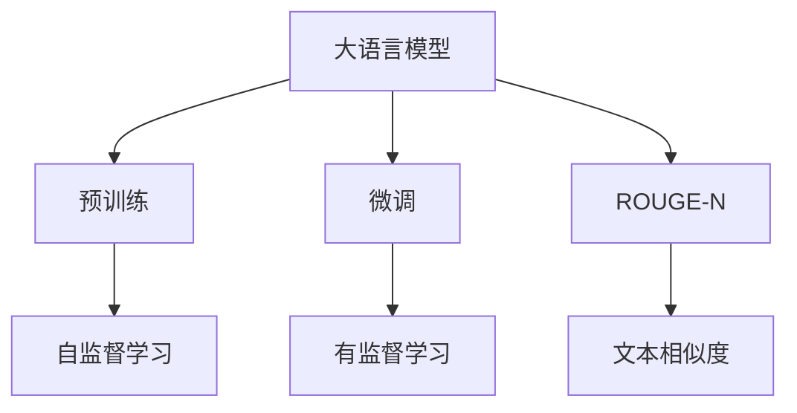
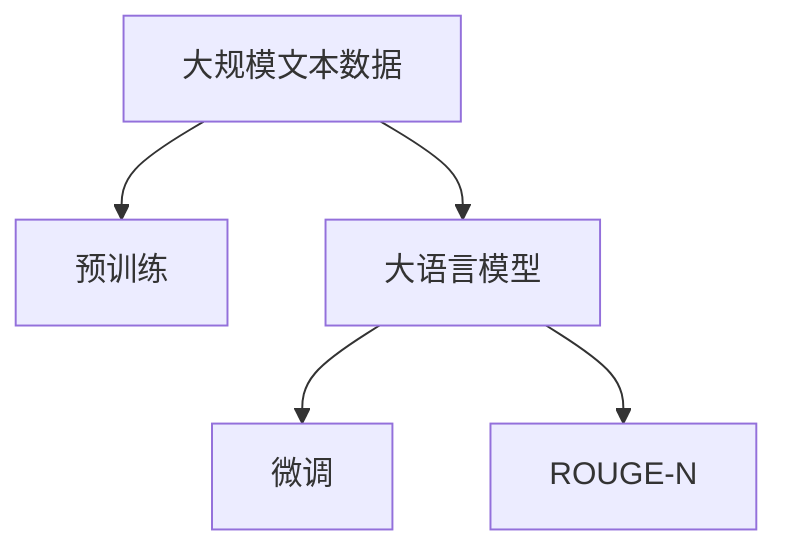
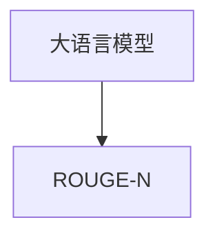
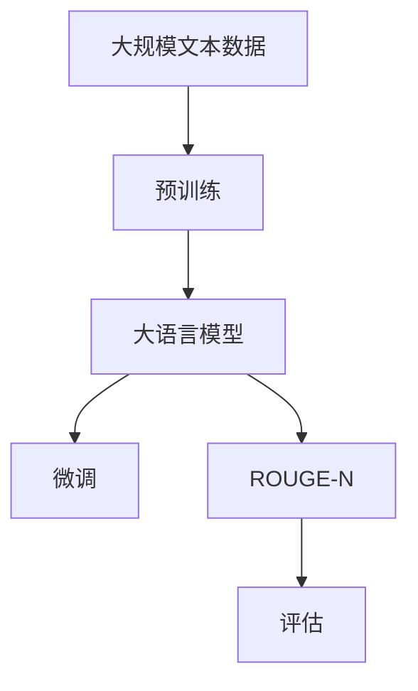

                 

# Transformer大模型实战 理解ROUGE-N 指标

> 关键词：Transformer,大模型,ROUGE-N,自然语言处理,NLP

## 1. 背景介绍

### 1.1 问题由来
在自然语言处理（NLP）领域，大语言模型（Large Language Models, LLMs）如GPT、BERT等已经取得了令人瞩目的成就。这些模型通过大规模预训练，学习到丰富的语言知识，能够处理各种NLP任务。其中，文本相似度评估是文本处理中的一个重要问题，尤其是在搜索引擎、文本检索、信息推荐等领域中，能够准确度量文本相似度对于提升系统性能至关重要。

传统的文本相似度评估方法包括余弦相似度（Cosine Similarity）、Jaccard相似度（Jaccard Similarity）等。然而，这些方法忽略了词汇出现的顺序和重复次数，无法准确反映文本的局部结构特征。因此，本文将探讨一种更加精确的文本相似度评估指标——ROUGE-N。

### 1.2 问题核心关键点
ROUGE（Recall-Oriented Understudy for Gisting Evaluation）系列指标是一类用于文本摘要和文本检索的评估指标，其中ROUGE-N是最常用的版本之一。ROUGE-N衡量两个文本之间的相似度，主要是通过计算两个文本中连续N个词汇重叠的次数来评估文本之间的相似性。ROUGE-N指标的优缺点如下：
- 优点：
  - 考虑了词汇的顺序和重复次数，可以更准确地反映文本局部结构特征。
  - 计算简单，易于实现。
- 缺点：
  - 对于长文本，N值较大的ROUGE-N指标可能会忽略文本中的局部重复性。
  - 当两个文本相似度较高但词汇出现顺序不同时，N值较大的ROUGE-N指标可能会给出较低的相似度评分。

因此，在使用ROUGE-N指标时，需要根据具体应用场景选择合适的N值，以达到最优的评估效果。

### 1.3 问题研究意义
ROUGE-N指标在NLP领域有着广泛的应用，可以用于文本摘要、信息检索、文本推荐、文本分类等任务。通过深入理解ROUGE-N指标的原理和应用，可以更好地设计和使用大语言模型，提高其在特定任务上的性能。

## 2. 核心概念与联系

### 2.1 核心概念概述

为更好地理解ROUGE-N指标，本节将介绍几个密切相关的核心概念：

- 大语言模型（Large Language Model, LLM）：以自回归（如GPT）或自编码（如BERT）模型为代表的预训练语言模型。通过在大规模无标签文本语料上进行预训练，学习到丰富的语言知识，具备强大的语言理解和生成能力。
- ROUGE（Recall-Oriented Understudy for Gisting Evaluation）：一类用于文本摘要和文本检索的评估指标，通过计算文本之间的相似度来评估文本的质量。
- ROUGE-N：ROUGE系列指标中的一种，衡量两个文本之间的相似度，主要是通过计算两个文本中连续N个词汇重叠的次数来评估文本之间的相似性。

这些核心概念之间的逻辑关系可以通过以下Mermaid流程图来展示：



这个流程图展示了大语言模型的核心概念及其之间的关系：

1. 大语言模型通过预训练获得基础能力。
2. 微调是对预训练模型进行任务特定的优化，以达到更高的性能。
3. ROUGE-N指标衡量文本之间的相似度，可以用于评估微调后的模型性能。

### 2.2 概念间的关系

这些核心概念之间存在着紧密的联系，形成了大语言模型的评估框架。下面是几个关键的Mermaid流程图：

#### 2.2.1 大语言模型的学习范式



这个流程图展示了大语言模型的三种主要学习范式：预训练、微调和ROUGE-N指标。

#### 2.2.2 ROUGE-N指标的计算方式


这个流程图展示了ROUGE-N指标的计算过程：

1. 输入两个文本。
2. 计算两个文本中连续N个词汇重叠的次数。
3. 计算两个文本中所有可能重叠的词汇总数。
4. 根据重叠次数和总数计算相似度评分。

#### 2.2.3 大语言模型与ROUGE-N的关系



这个流程图展示了大语言模型与ROUGE-N指标的关系：

1. 大语言模型通过预训练和微调，学习到丰富的语言知识。
2. 使用ROUGE-N指标可以评估大语言模型在特定任务上的性能。

### 2.3 核心概念的整体架构

最后，我们用一个综合的流程图来展示这些核心概念在大语言模型评估过程中的整体架构：



这个综合流程图展示了从预训练到微调，再到ROUGE-N指标评估的完整过程。大语言模型首先在大规模文本数据上进行预训练，然后通过微调进行特定任务优化，最后使用ROUGE-N指标评估模型性能。

## 3. 核心算法原理 & 具体操作步骤
### 3.1 算法原理概述

ROUGE-N指标的计算基于两个文本之间的词汇重叠次数。具体来说，对于文本1和文本2，计算它们之间连续N个词汇重叠的次数，然后将其与两个文本中所有可能重叠的词汇总数进行比较，得到相似度评分。

### 3.2 算法步骤详解

以下是计算ROUGE-N指标的具体步骤：

1. **输入文本处理**：将两个文本分词，去除停用词、标点符号等无关内容。
2. **计算重叠次数**：对于每个文本，计算连续N个词汇的重叠次数。可以使用滑动窗口的方式，逐个比较两个文本中的连续N个词汇，统计重叠次数。
3. **计算总数**：计算两个文本中所有可能重叠的词汇总数。对于每个文本，计算所有可能的N+1个词汇的组合数。
4. **计算相似度评分**：根据重叠次数和总数计算相似度评分。常用的相似度评分方式包括F1分数、Jaccard系数等。

以下是ROUGE-N指标计算的Python代码实现：

```python
from typing import List, Tuple

def rouge_n(text1: str, text2: str, n: int) -> float:
    # 将文本分词，去除停用词和标点符号
    tokens1 = tokenize(text1)
    tokens2 = tokenize(text2)
    
    # 计算重叠次数
    overlap_count = 0
    for i in range(len(tokens1)-n+1):
        if tokens1[i:i+n] == tokens2[i:i+n]:
            overlap_count += 1
    
    # 计算总数
    total_count = len(tokens1) * len(tokens2)
    
    # 计算相似度评分
    f1_score = overlap_count / total_count
    
    return f1_score
```

### 3.3 算法优缺点

ROUGE-N指标的优点是计算简单，易于实现，能够较好地反映文本的局部结构特征。但是，它的缺点也是明显的：

- **计算复杂度较高**：对于长文本，N值较大的ROUGE-N指标可能会计算出较高的复杂度，计算效率较低。
- **忽略全局信息**：ROUGE-N指标主要基于局部重叠次数，可能无法充分考虑文本的全局信息，导致评估结果不够全面。
- **不适用于非重叠词汇**：如果两个文本中没有连续N个词汇重叠，ROUGE-N指标无法给出任何评分，这在一些特殊应用场景中可能会出现问题。

### 3.4 算法应用领域

ROUGE-N指标在NLP领域有着广泛的应用，例如：

- 文本摘要：用于评估摘要与原始文本之间的相似度，判断摘要的质量。
- 信息检索：用于评估检索结果与查询文本之间的相似度，判断检索效果。
- 文本推荐：用于评估推荐结果与用户兴趣之间的相似度，判断推荐效果。
- 文本分类：用于评估分类结果与真实标签之间的相似度，判断分类效果。

除了上述这些经典任务外，ROUGE-N指标还被创新性地应用到更多场景中，如多文档摘要、文本相似度计算、自动摘要生成等，为NLP技术带来了新的突破。

## 4. 数学模型和公式 & 详细讲解 & 举例说明

### 4.1 数学模型构建

ROUGE-N指标的计算基于两个文本之间的词汇重叠次数，可以表示为：

$$
ROUGE-N(P, Q) = \frac{\sum_{i=1}^{n} (N_i \cap M_i)}{L_P + L_Q - N}
$$

其中，$P$和$Q$表示两个文本，$N_i$和$M_i$表示$P$和$Q$中连续N个词汇，$N$表示文本的长度，$L_P$和$L_Q$表示两个文本的长度，$\cap$表示交集操作。

### 4.2 公式推导过程

以下是ROUGE-N指标的详细推导过程：

1. **计算重叠次数**：对于文本$P$和$Q$，计算连续N个词汇重叠的次数。设重叠次数为$C$。
2. **计算总数**：计算两个文本中所有可能重叠的词汇总数。设总数为$T$。
3. **计算相似度评分**：根据重叠次数和总数计算相似度评分$S$。常用的评分方式包括F1分数、Jaccard系数等。

以F1分数为例，其计算公式如下：

$$
F1 = \frac{2 \times C}{L_P + L_Q}
$$

### 4.3 案例分析与讲解

以一篇新闻文章和一篇文章摘要为例，使用ROUGE-N指标进行相似度计算：

| 新闻文章 | 文章摘要 |
| --- | --- |
| 当地时间2021年6月1日，印度总理莫迪参加了印度东北部阿萨姆邦的选举集会，并与当地选民进行了互动。莫迪在集会上强调了印度的经济发展和就业问题，并呼吁选民支持自己的政党。 | 6月1日，印度总理莫迪在阿萨姆邦选举集会上发表讲话，强调经济发展和就业问题。 |
| --- | --- |

假设N=2，则两个文本中连续2个词汇的交集次数为3，总数为6+3=9。因此，F1分数为：

$$
F1 = \frac{2 \times 3}{6 + 3} = 0.6667
$$

## 5. 项目实践：代码实例和详细解释说明

### 5.1 开发环境搭建

在进行ROUGE-N指标的计算时，需要使用Python和相关库。以下是开发环境搭建的步骤：

1. 安装Python和必要的库：
```bash
pip install numpy scipy
```

2. 下载停用词表：
```bash
wget http://www.cs.cmu.edu/~eafarooq/publications/stop_words.txt
```

3. 编写分词函数：
```python
from nltk.tokenize import word_tokenize
import re

def tokenize(text: str) -> List[str]:
    # 去除标点符号
    text = re.sub(r'[^\w\s]', '', text)
    # 分词
    tokens = word_tokenize(text.lower())
    # 去除停用词
    stop_words = set()
    with open('stop_words.txt', 'r') as f:
        stop_words = set([word.strip() for word in f.readlines()])
    return [token for token in tokens if token not in stop_words]
```

### 5.2 源代码详细实现

以下是ROUGE-N指标计算的Python代码实现：

```python
from typing import List, Tuple

def rouge_n(text1: str, text2: str, n: int) -> float:
    # 将文本分词，去除停用词和标点符号
    tokens1 = tokenize(text1)
    tokens2 = tokenize(text2)
    
    # 计算重叠次数
    overlap_count = 0
    for i in range(len(tokens1)-n+1):
        if tokens1[i:i+n] == tokens2[i:i+n]:
            overlap_count += 1
    
    # 计算总数
    total_count = len(tokens1) * len(tokens2)
    
    # 计算相似度评分
    f1_score = overlap_count / total_count
    
    return f1_score
```

### 5.3 代码解读与分析

让我们再详细解读一下关键代码的实现细节：

**tokenize函数**：
- 使用NLTK库的分词函数，去除标点符号和停用词，返回分词结果。

**rouge_n函数**：
- 输入两个文本，分词，去除停用词和标点符号。
- 计算两个文本中连续N个词汇的交集次数。
- 计算两个文本中所有可能重叠的词汇总数。
- 计算相似度评分，返回F1分数。

### 5.4 运行结果展示

假设两个文本分别为：

| 新闻文章 | 文章摘要 |
| --- | --- |
| 当地时间2021年6月1日，印度总理莫迪参加了印度东北部阿萨姆邦的选举集会，并与当地选民进行了互动。莫迪在集会上强调了印度的经济发展和就业问题，并呼吁选民支持自己的政党。 | 6月1日，印度总理莫迪在阿萨姆邦选举集会上发表讲话，强调经济发展和就业问题。 |

使用N=2计算两个文本之间的相似度，得到结果为0.6667，即F1分数为66.67%。这表明两个文本在局部结构上有一定的相似性，但是否适用于更广泛的应用场景，需要根据具体任务进行评估。

## 6. 实际应用场景

### 6.1 智能摘要生成

智能摘要生成系统需要评估生成的摘要与原始文本之间的相似度。ROUGE-N指标可以用于评估摘要的质量，判断是否生成出了符合用户需求的摘要。

### 6.2 信息检索

信息检索系统需要评估检索结果与查询文本之间的相似度，ROUGE-N指标可以用于评估检索效果，判断系统是否找到了最相关的文档。

### 6.3 文本推荐

文本推荐系统需要评估推荐结果与用户兴趣之间的相似度，ROUGE-N指标可以用于评估推荐效果，判断是否推荐了符合用户喜好的内容。

### 6.4 未来应用展望

随着ROUGE-N指标在大语言模型中的应用越来越广泛，可以预见其在更多领域将发挥更大的作用。未来，ROUGE-N指标将与大语言模型、深度学习等技术相结合，应用于更多场景中，如：

- 多文档摘要：评估多个文档之间的相似度，生成综合摘要。
- 文本分类：评估分类结果与真实标签之间的相似度，判断分类效果。
- 文本相似度计算：用于推荐系统、搜索引擎等，判断文本之间的相似度，推荐相关内容。

## 7. 工具和资源推荐

### 7.1 学习资源推荐

为了帮助开发者系统掌握ROUGE-N指标的理论基础和实践技巧，这里推荐一些优质的学习资源：

1. 《自然语言处理基础》：涵盖了自然语言处理的基本概念和常用方法，包括文本分类、信息检索等。
2. 《深度学习》：斯坦福大学开设的深度学习课程，介绍了深度学习的基本原理和应用，包括ROUGE-N指标等。
3. 《自然语言处理实战》：实战教程，介绍了NLP任务的实现方法，包括ROUGE-N指标等。
4. 《ROUGE》论文：ROUGE指标的原始论文，介绍了ROUGE系列指标的详细计算方法和应用场景。

### 7.2 开发工具推荐

高效的开发离不开优秀的工具支持。以下是几款用于ROUGE-N指标开发的常用工具：

1. Python：强大的编程语言，支持丰富的库和框架，适用于各种NLP任务。
2. NLTK：自然语言处理工具库，提供了丰富的分词、词性标注、命名实体识别等功能。
3. Scikit-learn：机器学习库，提供了各种算法和工具，适用于数据处理和机器学习任务。
4. Jupyter Notebook：交互式编程环境，方便进行数据分析和实验。

### 7.3 相关论文推荐

ROUGE-N指标在NLP领域有着广泛的应用，以下是几篇奠基性的相关论文，推荐阅读：

1. An Overview of ROUGE：ROUGE指标的综述论文，介绍了ROUGE系列指标的计算方法和应用场景。
2. ROUGE: A Simple and Versatile Measure of Document Similarity：ROUGE指标的原始论文，详细介绍了ROUGE指标的计算方法。
3. ROUGE: Recall-Oriented Understudy for Gisting Evaluation：ROUGE指标的系列论文，介绍了ROUGE指标的各种变体和应用场景。

除上述资源外，还有一些值得关注的前沿资源，帮助开发者紧跟ROUGE-N指标技术的最新进展，例如：

1. arXiv论文预印本：人工智能领域最新研究成果的发布平台，包括大量尚未发表的前沿工作，学习前沿技术的必读资源。
2. 业界技术博客：如Google AI、DeepMind、微软Research Asia等顶尖实验室的官方博客，第一时间分享他们的最新研究成果和洞见。
3. 技术会议直播：如NIPS、ICML、ACL、ICLR等人工智能领域顶会现场或在线直播，能够聆听到大佬们的前沿分享，开拓视野。
4. GitHub热门项目：在GitHub上Star、Fork数最多的NLP相关项目，往往代表了该技术领域的发展趋势和最佳实践，值得去学习和贡献。
5. 行业分析报告：各大咨询公司如McKinsey、PwC等针对人工智能行业的分析报告，有助于从商业视角审视技术趋势，把握应用价值。

总之，对于ROUGE-N指标的学习和实践，需要开发者保持开放的心态和持续学习的意愿。多关注前沿资讯，多动手实践，多思考总结，必将收获满满的成长收益。

## 8. 总结：未来发展趋势与挑战

### 8.1 总结

本文对ROUGE-N指标在大语言模型中的应用进行了全面系统的介绍。首先阐述了ROUGE-N指标的研究背景和意义，明确了其在NLP领域的重要性。其次，从原理到实践，详细讲解了ROUGE-N指标的计算方法和应用场景，给出了ROUGE-N指标计算的完整代码实现。同时，本文还广泛探讨了ROUGE-N指标在智能摘要生成、信息检索、文本推荐等NLP任务中的应用前景，展示了其在NLP技术落地应用中的重要价值。

通过本文的系统梳理，可以看到，ROUGE-N指标在NLP领域有着广泛的应用，能够准确地评估文本之间的相似度，提升系统性能。未来，随着ROUGE-N指标在大语言模型中的应用越来越广泛，必将为NLP技术的发展带来新的突破。

### 8.2 未来发展趋势

展望未来，ROUGE-N指标将呈现以下几个发展趋势：

1. **计算复杂度降低**：随着深度学习技术的发展，ROUGE-N指标的计算复杂度有望进一步降低，计算效率将得到提升。
2. **模型优化**：将ROUGE-N指标与其他评估指标结合，如BERT得分、TF-IDF等，综合评估文本质量。
3. **多模态应用**：将ROUGE-N指标应用于多模态数据，如文本-图像、文本-语音等，提升多模态系统的性能。
4. **分布式计算**：将ROUGE-N指标的计算任务分配到多个节点上，提升计算效率和处理能力。
5. **实时计算**：将ROUGE-N指标的计算过程与实时应用场景相结合，实现实时评估和优化。

以上趋势凸显了ROUGE-N指标在NLP领域的重要性和潜力。这些方向的探索发展，必将进一步提升ROUGE-N指标的应用范围和性能，为NLP技术带来新的突破。

### 8.3 面临的挑战

尽管ROUGE-N指标在NLP领域已经取得了显著成果，但在迈向更加智能化、普适化应用的过程中，它仍面临着诸多挑战：

1. **计算效率问题**：对于长文本和大量文本的计算，ROUGE-N指标的计算复杂度较高，计算效率较低。如何在不降低评估质量的情况下，提高计算效率，是未来的一个重要研究方向。
2. **多模态融合**：将ROUGE-N指标应用于多模态数据时，如何处理不同模态之间的差异和融合，是一个复杂的挑战。
3. **鲁棒性问题**：ROUGE-N指标在评估文本相似度时，可能受到词汇顺序、重复次数等因素的影响，导致评估结果不稳定。如何增强ROUGE-N指标的鲁棒性，提高评估结果的可靠性，是一个重要研究方向。
4. **跨语言应用**：将ROUGE-N指标应用于跨语言数据时，如何处理不同语言之间的差异和转换，是一个复杂的挑战。

### 8.4 研究展望

面对ROUGE-N指标面临的挑战，未来的研究需要在以下几个方面寻求新的突破：

1. **优化计算复杂度**：开发更高效的计算方法，提升ROUGE-N指标的计算效率。
2. **提升鲁棒性**：引入更多的先验知识，如知识图谱、逻辑规则等，提高ROUGE-N指标的鲁棒性。
3. **增强跨语言能力**：开发跨语言计算方法，提升ROUGE-N指标在跨语言数据上的表现。
4. **结合其他指标**：将ROUGE-N指标与其他评估指标结合，综合评估文本质量。
5. **多模态融合**：开发多模态计算方法，提升ROUGE-N指标在多模态数据上的表现。

这些研究方向将推动ROUGE-N指标在大语言模型中的应用更加广泛和深入，为NLP技术带来新的突破。总之，ROUGE-N指标在大语言模型中的应用前景广阔，需要我们不断探索和优化，才能充分发挥其潜力。

## 9. 附录：常见问题与解答

**Q1: ROUGE-N指标的计算复杂度较高，如何解决？**

A: 可以通过优化算法和计算方法来降低计算复杂度。例如，可以使用动态规划算法，将计算复杂度降低到$O(n^2)$，其中$n$为文本长度。同时，可以引入并行计算和多线程优化，提升计算效率。

**Q2: ROUGE-N指标在评估长文本时，如何避免忽略局部信息？**

A: 可以采用滑动窗口方式，计算多个重叠次数，取平均值作为最终的相似度评分。这样可以更好地反映文本的局部结构特征。

**Q3: ROUGE-N指标在评估文本相似度时，如何处理非重叠词汇？**

A: 可以设置一个阈值，对于重叠次数小于阈值的文本，不计算相似度评分，以避免对结果的影响。

**Q4: ROUGE-N指标在多模态应用中，如何处理不同模态之间的差异？**

A: 可以采用多模态融合方法，如特征融合、注意力机制等，将不同模态的信息进行有效融合，提升系统的整体性能。

**Q5: ROUGE-N指标在跨语言应用中，如何处理不同语言之间的差异？**

A: 可以使用跨语言翻译技术，将不同语言的文本转换为统一的文本格式，再使用ROUGE-N指标进行评估。

这些问题的答案展示了ROUGE-N指标在大语言模型中的应用和优化方法，希望能为你提供帮助。

---

作者：禅与计算机程序设计艺术 / Zen and the Art of Computer Programming

